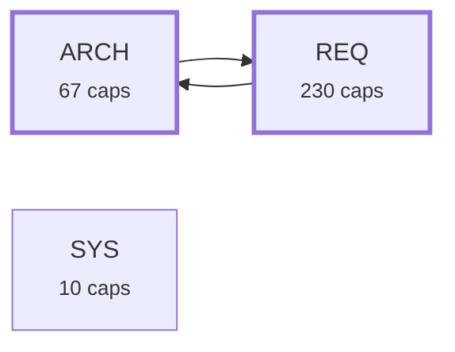

# Requirement Map

## System Map

_Capabilities grouped by area; thick border = bus; arrows = `depends_on`. Edges into the bus/hubs are hidden (the Dependency Map shows area-level coupling)._

```mermaid
graph LR
  subgraph sg_ARCH["ARCH"]
    ARCH_ACVERIFY_019["Per-criterion test coverage<br><small>ARCH-ACVERIFY-019</small>"]
    ARCH_ATOMICITY_049["Statement atomicity<br><small>ARCH-ATOMICITY-049</small>"]
    ARCH_AUDIT_065["One report of everything the engine can discover<br><small>ARCH-AUDIT-065</small>"]
    ARCH_CANDIDATES_009["Capability candidates (extraction plan)<br><small>ARCH-CANDIDATES-009</small>"]
    ARCH_CHECK_006["The gate<br><small>ARCH-CHECK-006</small>"]
    ARCH_CLARIFY_062["Questions a requirement has not answered<br><small>ARCH-CLARIFY-062</small>"]
    ARCH_CMDREGISTRY_033["CLI command registry + generated integration artifacts<br><small>ARCH-CMDREGISTRY-033</small>"]
    ARCH_CONFIG_060["Per-repo configuration file<br><small>ARCH-CONFIG-060</small>"]
    ARCH_CONTEXT_048["Consolidated Context section<br><small>ARCH-CONTEXT-048</small>"]
    ARCH_COVERAGE_029["Untagged-code coverage signal<br><small>ARCH-COVERAGE-029</small>"]
    ARCH_DECOMPOSE_050["Clause decomposition scaffold<br><small>ARCH-DECOMPOSE-050</small>"]
    ARCH_DESIGN_061["Advisory design review<br><small>ARCH-DESIGN-061</small>"]
    ARCH_DOCBUNDLE_026["Untagged doc-bundle warning<br><small>ARCH-DOCBUNDLE-026</small>"]
    ARCH_DOCCLAIMS_071["Corpus counts a document states about itself<br><small>ARCH-DOCCLAIMS-071</small>"]
    ARCH_DRIFT_003["Contract hashing & lock<br><small>ARCH-DRIFT-003</small>"]
    ARCH_DRIFTIMPACT_035["Drift blast-radius: name dependents<br><small>ARCH-DRIFTIMPACT-035</small>"]
    ARCH_EXTRACT_008["Legacy extraction<br><small>ARCH-EXTRACT-008</small>"]
    ARCH_FANOUT_052["Hierarchy breadth<br><small>ARCH-FANOUT-052</small>"]
    ARCH_FINDINGS_010["Open-findings report<br><small>ARCH-FINDINGS-010</small>"]
    ARCH_GITRUN_067["Talking to git<br><small>ARCH-GITRUN-067</small>"]
    ARCH_HEALTH_017["Corpus health snapshot<br><small>ARCH-HEALTH-017</small>"]
    ARCH_IMPLEMENT_063["The brief for implementing a requirement<br><small>ARCH-IMPLEMENT-063</small>"]
    ARCH_INIT_012["First-use bootstrap<br><small>ARCH-INIT-012</small>"]
    ARCH_LEVEL_051["Specification level<br><small>ARCH-LEVEL-051</small>"]
    ARCH_LEVELRETROFIT_066["Giving an existing corpus the three rungs<br><small>ARCH-LEVELRETROFIT-066</small>"]
    ARCH_LINT_014["Requirement readability linter<br><small>ARCH-LINT-014</small>"]
    ARCH_LINTCHECKS_025["Readability & scope checks<br><small>ARCH-LINTCHECKS-025</small>"]
    ARCH_MAP_007["Requirement graph (_map.json)<br><small>ARCH-MAP-007</small>"]
    ARCH_MAPDIAGRAMS_055["Mermaid diagrams (_map.md)<br><small>ARCH-MAPDIAGRAMS-055</small>"]
    ARCH_MCP_073["Serving the engine over MCP<br><small>ARCH-MCP-073</small>"]
    ARCH_MEMBERDRIFT_027["Reverse-direction member drift<br><small>ARCH-MEMBERDRIFT-027</small>"]
    ARCH_NEW_004["Scaffold a requirement<br><small>ARCH-NEW-004</small>"]
    ARCH_NEXT_013["What-should-I-do-next report<br><small>ARCH-NEXT-013</small>"]
    ARCH_ORPHANCODE_034["Orphan-code warning<br><small>ARCH-ORPHANCODE-034</small>"]
    ARCH_PARSE_001["Requirement reading<br><small>ARCH-PARSE-001</small>"]
    ARCH_PIPE_046["A closed output pipe ends a command quietly<br><small>ARCH-PIPE-046</small>"]
    ARCH_PLANDRIFT_069["Plan items whose code has moved on without them<br><small>ARCH-PLANDRIFT-069</small>"]
    ARCH_PROMOTE_011["Confirmation is a human's answer, and an edit takes it back<br><small>ARCH-PROMOTE-011</small>"]
    ARCH_PROMOTE_TODO_001["Promote a TODO item into a requirement draft<br><small>ARCH-PROMOTE-TODO-001</small>"]
    ARCH_PROSE_024["Prose capability classification & drafting<br><small>ARCH-PROSE-024</small>"]
    ARCH_PYFLOOR_040["Declared Python support floor<br><small>ARCH-PYFLOOR-040</small>"]
    ARCH_REGISTRYLAG_035["Registry-lag signal — commits since the requirements dir was last touched<br><small>ARCH-REGISTRYLAG-035</small>"]
    ARCH_RELEASE_072["Releasing from the plan<br><small>ARCH-RELEASE-072</small>"]
    ARCH_REPRO_041["Committed build artifacts stay re-derivable<br><small>ARCH-REPRO-041</small>"]
    ARCH_RETIRE_064["Taking a requirement out of service<br><small>ARCH-RETIRE-064</small>"]
    ARCH_REVIEW_022["AI requirement-quality review (deterministic plan + advisory pass)<br><small>ARCH-REVIEW-022</small>"]
    ARCH_ROADMAP_038["Roadmap coherence signals<br><small>ARCH-ROADMAP-038</small>"]
    ARCH_RULES_059["The gate rule registry<br><small>ARCH-RULES-059</small>"]
    ARCH_SCAN_002["Member discovery<br><small>ARCH-SCAN-002</small>"]
    ARCH_SCANCACHE_023["Opt-in scan cache<br><small>ARCH-SCANCACHE-023</small>"]
    ARCH_SEARCH_036["Free-text requirement search<br><small>ARCH-SEARCH-036</small>"]
    ARCH_SECTIONS_068["Reading a requirement's sections<br><small>ARCH-SECTIONS-068</small>"]
    ARCH_SELFGATE_039["This repo's own gate wiring<br><small>ARCH-SELFGATE-039</small>"]
    ARCH_SHOW_015["Single-requirement dossier<br><small>ARCH-SHOW-015</small>"]
    ARCH_SIMILAR_016["Duplicate-capability detector<br><small>ARCH-SIMILAR-016</small>"]
    ARCH_SITE_026["Generate & maintain a project presentation page<br><small>ARCH-SITE-026</small>"]
    ARCH_STALEENGINE_043["Stale vendored engine, reported in CI<br><small>ARCH-STALEENGINE-043</small>"]
    ARCH_SUGGESTVERIFIES_047["Suggest per-criterion 'verifies:' tags<br><small>ARCH-SUGGESTVERIFIES-047</small>"]
    ARCH_TESTLINK_018["Test-link integrity check<br><small>ARCH-TESTLINK-018</small>"]
    ARCH_TRACE_020["Upstream traceability<br><small>ARCH-TRACE-020</small>"]
    ARCH_TRACKED_042["Untracked members reported<br><small>ARCH-TRACKED-042</small>"]
    ARCH_TRANSLATE_044["Reading a cached requirement translation into the map<br><small>ARCH-TRANSLATE-044</small>"]
    ARCH_UNREADABLE_070["Source files the scan cannot decode<br><small>ARCH-UNREADABLE-070</small>"]
    ARCH_UNSCANNEDTAG_045["Tags in unscanned file types reported<br><small>ARCH-UNSCANNEDTAG-045</small>"]
    ARCH_VIEWER_007["Self-contained HTML map viewer<br><small>ARCH-VIEWER-007</small>"]
    ARCH_VIEWERFILE_074["The viewer ships as one self-contained HTML file<br><small>ARCH-VIEWERFILE-074</small>"]
    ARCH_VLEVEL_037["Verification levels<br><small>ARCH-VLEVEL-037</small>"]
  end
  subgraph sg_REQ["REQ"]
    REQ_ACVERIFY_821["Mapping verifies tags to labelled criteria<br><small>REQ-ACVERIFY-821</small>"]
    REQ_ACVERIFY_822["When per-criterion coverage stays silent<br><small>REQ-ACVERIFY-822</small>"]
    REQ_ACVERIFY_823["Emitting clauses, covered and gap on the map<br><small>REQ-ACVERIFY-823</small>"]
    REQ_DANGLINGVERIFY_1009["A verifies tag that points at nothing<br><small>REQ-DANGLINGVERIFY-1009</small>"]
    REQ_ATOMICITY_824["One obligation per clause, with an advisory length backstop<br><small>REQ-ATOMICITY-824</small>"]
    REQ_ATOMICITY_825["statement-size measures length, not atomicity<br><small>REQ-ATOMICITY-825</small>"]
    REQ_AUDIT_970["Every discovery pass, one report, one exit code<br><small>REQ-AUDIT-970</small>"]
    REQ_AUDIT_971["An exemption nobody justified is itself a finding<br><small>REQ-AUDIT-971</small>"]
    REQ_AUDIT_972["Whether the corpus has a shape at all<br><small>REQ-AUDIT-972</small>"]
    REQ_AUDIT_973["Sync says what it found<br><small>REQ-AUDIT-973</small>"]
    REQ_RELEVEL_997["The tail names a move that was only half made<br><small>REQ-RELEVEL-997</small>"]
    REQ_CANDIDATES_826["The plan's JSON shape and read-only scanning<br><small>REQ-CANDIDATES-826</small>"]
    REQ_CANDIDATES_827["Fields a candidate carries<br><small>REQ-CANDIDATES-827</small>"]
    REQ_PLANTAGGED_1005["One definition of 'this file is already accounted for'<br><small>REQ-PLANTAGGED-1005</small>"]
    REQ_PLANLEVEL_1006["The plan carries the pyramid it would write<br><small>REQ-PLANLEVEL-1006</small>"]
    REQ_PLANDRAFTID_1010["The plan states the id the writer will mint<br><small>REQ-PLANDRAFTID-1010</small>"]
    REQ_CHECK_828["Gate errors that block a commit<br><small>REQ-CHECK-828</small>"]
    REQ_CHECK_829["Contract drift and missing-coverage warnings<br><small>REQ-CHECK-829</small>"]
    REQ_CHECK_1040["A confirmed requirement missing its Description or Cases<br><small>REQ-CHECK-1040</small>"]
    REQ_CHECK_830["Milestone shape and lock-file warnings<br><small>REQ-CHECK-830</small>"]
    REQ_CHECK_831["Corpus-health warnings: legacy schema and cycles<br><small>REQ-CHECK-831</small>"]
    REQ_CHECK_832["What the gate prints beyond pass or fail<br><small>REQ-CHECK-832</small>"]
    REQ_CHECK_833["Advancing the lock file<br><small>REQ-CHECK-833</small>"]
    REQ_CHECK_1035["A Description link to a requirement that does not exist<br><small>REQ-CHECK-1035</small>"]
    REQ_CHECK_1036["A bare gate says only what is broken<br><small>REQ-CHECK-1036</small>"]
    REQ_CLARIFY_956["Detecting what a requirement leaves open<br><small>REQ-CLARIFY-956</small>"]
    REQ_CLARIFY_957["Reporting the open questions<br><small>REQ-CLARIFY-957</small>"]
    REQ_CLARIFY_975["An answer can raise a question the old text never had<br><small>REQ-CLARIFY-975</small>"]
    REQ_CMDREGISTRY_834["One COMMANDS dict drives argparse, schema and docs<br><small>REQ-CMDREGISTRY-834</small>"]
    REQ_CMDREGISTRY_963["The command registry as data on the map<br><small>REQ-CMDREGISTRY-963</small>"]
    REQ_CMDREGISTRY_1031["'ask' holds the questions, 'gate' the verdict<br><small>REQ-CMDREGISTRY-1031</small>"]
    REQ_NEWGONE_1034["'new' is gone; six verbs remain, and the template stays<br><small>REQ-NEWGONE-1034</small>"]
    REQ_CMDREGISTRY_1085["Help is rendered from the registry, one verb at a time<br><small>REQ-CMDREGISTRY-1085</small>"]
    REQ_CONFIG_949["Reading and applying '_config.json'<br><small>REQ-CONFIG-949</small>"]
    REQ_CONTEXT_835["One Context section replaces three near-synonymous headings<br><small>REQ-CONTEXT-835</small>"]
    REQ_COVERAGE_836["Counting untagged code as a read-only signal<br><small>REQ-COVERAGE-836</small>"]
    REQ_UNTAGGEDSET_1007["Two untagged reports, one list<br><small>REQ-UNTAGGEDSET-1007</small>"]
    REQ_DECOMPOSE_837["--decompose is opt-in; the default lint run never writes<br><small>REQ-DECOMPOSE-837</small>"]
    REQ_DECOMPOSE_838["A created draft's shape: status, parent link, seeded clause, id<br><small>REQ-DECOMPOSE-838</small>"]
    REQ_DECOMPOSE_839["The parent never changes, and the command knows its own limits<br><small>REQ-DECOMPOSE-839</small>"]
    REQ_DECOMPOSE_994["Splitting a requirement along its own contract groups<br><small>REQ-DECOMPOSE-994</small>"]
    REQ_DESIGN_950["Encapsulation and abstraction candidates<br><small>REQ-DESIGN-950</small>"]
    REQ_DESIGN_951["Inheritance and polymorphism candidates<br><small>REQ-DESIGN-951</small>"]
    REQ_DESIGN_952["The 'design' report<br><small>REQ-DESIGN-952</small>"]
    REQ_DESIGN_953["Code-writing standards<br><small>REQ-DESIGN-953</small>"]
    REQ_DESIGN_954["Design health in the map<br><small>REQ-DESIGN-954</small>"]
    REQ_DESIGN_955["Brace-language heuristics<br><small>REQ-DESIGN-955</small>"]
    REQ_DESIGN_976["Design candidates in the map<br><small>REQ-DESIGN-976</small>"]
    REQ_DESIGN_978["Class metrics, the C&K half that applies<br><small>REQ-DESIGN-978</small>"]
    REQ_DESIGN_979["What the review could not measure<br><small>REQ-DESIGN-979</small>"]
    REQ_DESIGN_980["The metrics that did not survive calibration<br><small>REQ-DESIGN-980</small>"]
    REQ_DESIGN_991["Advisory data cannot inherit a verdict<br><small>REQ-DESIGN-991</small>"]
    REQ_DOCBUNDLE_840["Flagging a large, unlinked docs/ HTML bundle<br><small>REQ-DOCBUNDLE-840</small>"]
    REQ_DOCCLAIMS_1012["Re-measuring a marked claim<br><small>REQ-DOCCLAIMS-1012</small>"]
    REQ_DRIFT_841["Hashing only the normative sections<br><small>REQ-DRIFT-841</small>"]
    REQ_DRIFT_842["Reading and writing the drift baseline<br><small>REQ-DRIFT-842</small>"]
    REQ_DRIFT_988["The waiver leaves a trace<br><small>REQ-DRIFT-988</small>"]
    REQ_DRIFTIMPACT_843["Name a drifted requirement's direct dependents<br><small>REQ-DRIFTIMPACT-843</small>"]
    REQ_EXTRACT_849["Which files draft walks<br><small>REQ-EXTRACT-849</small>"]
    REQ_EXTRACT_850["Writing one draft proposal per file<br><small>REQ-EXTRACT-850</small>"]
    REQ_EXTRACT_851["Scoring risk and capturing an authoring hint<br><small>REQ-EXTRACT-851</small>"]
    REQ_EXTRACT_981["The three rungs extraction drafts<br><small>REQ-EXTRACT-981</small>"]
    REQ_INITTAG_1008["The draft and its source are linked in the same run<br><small>REQ-INITTAG-1008</small>"]
    REQ_FANOUT_852["Counting children and reporting an out-of-band parent<br><small>REQ-FANOUT-852</small>"]
    REQ_FINDINGS_853["Collecting open verify-intent bullets<br><small>REQ-FINDINGS-853</small>"]
    REQ_FINDINGS_854["The raw findings report<br><small>REQ-FINDINGS-854</small>"]
    REQ_FINDINGS_855["The triaged findings report<br><small>REQ-FINDINGS-855</small>"]
    REQ_FINDINGS_856["Findings integration with map and gate<br><small>REQ-FINDINGS-856</small>"]
    REQ_GITRUN_993["One runner for every git question<br><small>REQ-GITRUN-993</small>"]
    REQ_HEALTH_857["health is a read-only snapshot of the whole corpus<br><small>REQ-HEALTH-857</small>"]
    REQ_HEALTH_858["The headline score: green means every axis passes at once<br><small>REQ-HEALTH-858</small>"]
    REQ_HEALTH_859["Component counts, --json parity, and an always-zero exit<br><small>REQ-HEALTH-859</small>"]
    REQ_HEALTH_968["The health record travels with the map<br><small>REQ-HEALTH-968</small>"]
    REQ_REVIEWEDSCORE_109["Reviewed-only health score<br><small>REQ-REVIEWEDSCORE-109</small>"]
    REQ_HEALTHROWS_1083["The rows behind the health score<br><small>REQ-HEALTHROWS-1083</small>"]
    REQ_IMPLEMENT_958["What the implementation brief states<br><small>REQ-IMPLEMENT-958</small>"]
    REQ_IMPLEMENT_959["Pointing at where this kind of code lives<br><small>REQ-IMPLEMENT-959</small>"]
    REQ_INIT_860["Scaffolding the requirements folder and a starter .reqmapignore<br><small>REQ-INIT-860</small>"]
    REQ_INIT_861["Running draft, lock, and map in a fixed order<br><small>REQ-INIT-861</small>"]
    REQ_LEVEL_862["The level field, validated independently of layer<br><small>REQ-LEVEL-862</small>"]
    REQ_LEVELRETROFIT_985["Which rung, and on what evidence<br><small>REQ-LEVELRETROFIT-985</small>"]
    REQ_LEVELRETROFIT_986["Writing a rung into a file somebody else wrote<br><small>REQ-LEVELRETROFIT-986</small>"]
    REQ_LEVELRETROFIT_987["Read-only by default, and honest about what it will not do<br><small>REQ-LEVELRETROFIT-987</small>"]
    REQ_LINT_863["What lint checks and skips<br><small>REQ-LINT-863</small>"]
    REQ_LINT_864["Where the prose checks read from, and what fails a strict run<br><small>REQ-LINT-864</small>"]
    REQ_LINTCHECKS_865["Readability checks: length, stacking, anonymous subjects<br><small>REQ-LINTCHECKS-865</small>"]
    REQ_LINTCHECKS_866["Scope checks: acceptance count, over-scoping, file spread<br><small>REQ-LINTCHECKS-866</small>"]
    REQ_LINTCHECKS_867["Atomic-form parity and layer-mismatch checks<br><small>REQ-LINTCHECKS-867</small>"]
    REQ_LINTCHECKS_868["The vague-term check<br><small>REQ-LINTCHECKS-868</small>"]
    REQ_LINTCHECKS_869["The redundant-modal check<br><small>REQ-LINTCHECKS-869</small>"]
    REQ_MAP_870["Generating _map.json's node graph<br><small>REQ-MAP-870</small>"]
    REQ_MAP_871["Repo, engine version, todos, and freshness checking<br><small>REQ-MAP-871</small>"]
    REQ_MAP_872["Reading contract clauses across wrapped lines<br><small>REQ-MAP-872</small>"]
    REQ_MAP_873["Deduping intent against the contract<br><small>REQ-MAP-873</small>"]
    REQ_PLANCADENCE_1000["A release cadence, computed once and only drawn by the chart<br><small>REQ-PLANCADENCE-1000</small>"]
    REQ_HISTORY_1003["What already shipped, read from the CHANGELOG and grouped by month<br><small>REQ-HISTORY-1003</small>"]
    REQ_MAPDIAGRAMS_874["_map.md: four legended, always-regenerated Mermaid blocks<br><small>REQ-MAPDIAGRAMS-874</small>"]
    REQ_MAPDIAGRAMS_875["Specification Hierarchy: satisfies edges only, code counted not drawn<br><small>REQ-MAPDIAGRAMS-875</small>"]
    REQ_MAPDIAGRAMS_876["System Map: per-area subgraphs, bus edges hidden<br><small>REQ-MAPDIAGRAMS-876</small>"]
    REQ_MAPDIAGRAMS_877["Dependency Map is area-level; Req→Code colors and collapses lines<br><small>REQ-MAPDIAGRAMS-877</small>"]
    REQ_MAPDIAGRAMS_878["Risk diagram: only flagged requirements, each with advice<br><small>REQ-MAPDIAGRAMS-878</small>"]
    REQ_MCPPROTOCOL_1027["The protocol, over stdio<br><small>REQ-MCPPROTOCOL-1027</small>"]
    REQ_MCPTOOLS_1028["Tools named for questions, run as the CLI<br><small>REQ-MCPTOOLS-1028</small>"]
    REQ_MCPSEED_1029["init writes the client configs that start the server<br><small>REQ-MCPSEED-1029</small>"]
    REQ_MCPRESOURCES_1030["The map and each requirement, as resources<br><small>REQ-MCPRESOURCES-1030</small>"]
    REQ_MEMBERDRIFT_879["The member-hash sidecar<br><small>REQ-MEMBERDRIFT-879</small>"]
    REQ_MEMBERDRIFT_880["Warning when code moves ahead of its spec<br><small>REQ-MEMBERDRIFT-880</small>"]
    REQ_MEMBERDRIFT_982["The member hash keys on the tagged definition<br><small>REQ-MEMBERDRIFT-982</small>"]
    REQ_NEW_881["Stamping a fresh requirement file from a template<br><small>REQ-NEW-881</small>"]
    REQ_NEW_882["Refusing to clobber, and a scaffold that lints clean<br><small>REQ-NEW-882</small>"]
    REQ_NEW_1032["'new' says it is going away<br><small>REQ-NEW-1032</small>"]
    REQ_NEXT_883["next reads the same risk signals the Risk tab reads<br><small>REQ-NEXT-883</small>"]
    REQ_NEXT_884["Four action buckets and two advisory ones<br><small>REQ-NEXT-884</small>"]
    REQ_NEXTUNTAGGED_1050["Untagged files, ranked lowest<br><small>REQ-NEXTUNTAGGED-1050</small>"]
    REQ_NEXT_885["Priority, then risk score, then id decide bucket order<br><small>REQ-NEXT-885</small>"]
    REQ_NEXT_886["Each bucket truncates to a top few, --all shows everything<br><small>REQ-NEXT-886</small>"]
    REQ_NEXT_887["An empty registry and a clean one get different messages<br><small>REQ-NEXT-887</small>"]
    REQ_PLANGAPS_1033["The plan's own gaps are a bucket in the worklist<br><small>REQ-PLANGAPS-1033</small>"]
    REQ_ORPHANCODE_888["Warning on a sizeable file with no requirement link<br><small>REQ-ORPHANCODE-888</small>"]
    REQ_PARSE_890["load_requirements returns one meta/body/path record per file<br><small>REQ-PARSE-890</small>"]
    REQ_PARSE_891["The hand-rolled frontmatter grammar: scalars and lists only<br><small>REQ-PARSE-891</small>"]
    REQ_PARSE_892["Missing frontmatter, underscore files, and a BOM never crash the reader<br><small>REQ-PARSE-892</small>"]
    REQ_ATOMICFORM_053["The atomic requirement form<br><small>REQ-ATOMICFORM-053</small>"]
    REQ_MODULEFILE_056["Several requirements in one file<br><small>REQ-MODULEFILE-056</small>"]
    REQ_PIPE_893["A closed reader ends the command with exit 0<br><small>REQ-PIPE-893</small>"]
    REQ_PLANDRIFT_1002["Reading an item's citations, and the six ways that goes wrong<br><small>REQ-PLANDRIFT-1002</small>"]
    REQ_PROMOTE_894["A surgical edit to the status line<br><small>REQ-PROMOTE-894</small>"]
    REQ_PROMOTE_974["An edited contract loses its confirmation<br><small>REQ-PROMOTE-974</small>"]
    REQ_PROMOTE_TODO_897["Scaffolding a draft from a matched TODO item<br><small>REQ-PROMOTE-TODO-897</small>"]
    REQ_PROMOTE_TODO_898["Refusing an unresolvable promotion<br><small>REQ-PROMOTE-TODO-898</small>"]
    REQ_PROMOTE_TODO_899["TODO.md stays untouched unless --mark-done asks otherwise<br><small>REQ-PROMOTE-TODO-899</small>"]
    REQ_PROSE_900["Sorting prose files into three drafting buckets<br><small>REQ-PROSE-900</small>"]
    REQ_PROSE_901["Scaffolding a draft from a prose file's own headings<br><small>REQ-PROSE-901</small>"]
    REQ_PYFLOOR_902["Refusing an interpreter below the declared floor<br><small>REQ-PYFLOOR-902</small>"]
    REQ_REGISTRYLAG_903["Counting commits since the registry last moved<br><small>REQ-REGISTRYLAG-903</small>"]
    REQ_REGISTRYLAG_904["Reporting lag without ever gating on it<br><small>REQ-REGISTRYLAG-904</small>"]
    REQ_VERSIONFILES_1014["The version a repository declares is read where it lives<br><small>REQ-VERSIONFILES-1014</small>"]
    REQ_CHANGELOGFORMS_1015["A CHANGELOG is read in the form its ecosystem writes<br><small>REQ-CHANGELOGFORMS-1015</small>"]
    REQ_VERSIONALIGN_1016["Where the version sources disagree is reported<br><small>REQ-VERSIONALIGN-1016</small>"]
    REQ_NEXTVERSION_1017["The next release's number comes from the plan<br><small>REQ-NEXTVERSION-1017</small>"]
    REQ_RELEASECMD_1018["'sync --release' cuts the next planned version<br><small>REQ-RELEASECMD-1018</small>"]
    REQ_RELEASEWORKFLOW_1019["A GitHub repository gets the workflow that tags a release once<br><small>REQ-RELEASEWORKFLOW-1019</small>"]
    REQ_PLANADVANCE_1020["Releasing a version advances the plan<br><small>REQ-PLANADVANCE-1020</small>"]
    REQ_PLANDATES_1022["'sync' suggests a bar's date when the work moved<br><small>REQ-PLANDATES-1022</small>"]
    REQ_RELEASEROADMAP_1023["A release names the ROADMAP items it carries out<br><small>REQ-RELEASEROADMAP-1023</small>"]
    REQ_REPRO_905["Rebuilding and diffing each committed artifact in CI<br><small>REQ-REPRO-905</small>"]
    REQ_RETIRE_960["The blast radius of a retirement<br><small>REQ-RETIRE-960</small>"]
    REQ_RETIRE_961["Deprecating, refusing, and never writing by accident<br><small>REQ-RETIRE-961</small>"]
    REQ_RETIRE_962["Deleting a requirement without deleting meaning<br><small>REQ-RETIRE-962</small>"]
    REQ_RETIRE_963["Retiring a class in one operation<br><small>REQ-RETIRE-963</small>"]
    REQ_REVIEW_906["A deterministic plan for an out-of-band AI review<br><small>REQ-REVIEW-906</small>"]
    REQ_ROADMAP_907["A behind roadmap and an unversioned heading, both read-only<br><small>REQ-ROADMAP-907</small>"]
    REQ_ROADMAP_983["The roadmap can also be ahead of the requirements<br><small>REQ-ROADMAP-983</small>"]
    REQ_ROADMAP_998["ROADMAP.md: the horizon plan, and the two claims in it that can be checked<br><small>REQ-ROADMAP-998</small>"]
    REQ_PLANHORIZON_1010["A repo with no plan still gets a calendar to plan on<br><small>REQ-PLANHORIZON-1010</small>"]
    REQ_PLANBRANCH_1011["The shipped band is named by the branch it shipped on<br><small>REQ-PLANBRANCH-1011</small>"]
    REQ_PLANSTALE_1013["A plan that schedules a version already declared is reported<br><small>REQ-PLANSTALE-1013</small>"]
    REQ_UNPLANNED_1024["A Now or Next item with no bar is counted<br><small>REQ-UNPLANNED-1024</small>"]
    REQ_RULES_947["One registry of gate rules<br><small>REQ-RULES-947</small>"]
    REQ_RULES_948["Codes on every finding, and per-requirement exemption<br><small>REQ-RULES-948</small>"]
    REQ_RULES_989["Drift severity is a repo's own call<br><small>REQ-RULES-989</small>"]
    REQ_SCAN_908["scan_members walks the tree and collects role: ID tags<br><small>REQ-SCAN-908</small>"]
    REQ_SCAN_909["One tag can bind several requirements, and directories are pruned<br><small>REQ-SCAN-909</small>"]
    REQ_SCAN_992["Which lines a tag may live on<br><small>REQ-SCAN-992</small>"]
    REQ_SCANCACHE_911["Caching scan results without changing them<br><small>REQ-SCANCACHE-911</small>"]
    REQ_SEARCH_912["Ranking a query against the corpus<br><small>REQ-SEARCH-912</small>"]
    REQ_SEARCH_913["Printing ranked matches with their score<br><small>REQ-SEARCH-913</small>"]
    REQ_SEARCH_914["The relevance floor and the empty-query message<br><small>REQ-SEARCH-914</small>"]
    REQ_SEARCH_915["Search always exits zero on a well-formed query<br><small>REQ-SEARCH-915</small>"]
    REQ_SEARCH_965["Finding a requirement by its id, and by its literal text<br><small>REQ-SEARCH-965</small>"]
    REQ_SECTIONS_994["One section reader for every consumer<br><small>REQ-SECTIONS-994</small>"]
    REQ_DESCRIPTION_057["One Description section, and Cases instead of Acceptance<br><small>REQ-DESCRIPTION-057</small>"]
    REQ_SELFGATE_916["The CI workflow runs the one verdict and moves the Action's alias<br><small>REQ-SELFGATE-916</small>"]
    REQ_SELFGATE_1070["The dev git hooks run CI's checks before a commit and guard 'main'<br><small>REQ-SELFGATE-1070</small>"]
    REQ_SELFGATE_1071["The published Action runs the consumer's engine through the same gate<br><small>REQ-SELFGATE-1071</small>"]
    REQ_SELFGATE_1072["The cache-sync script refreshes an engine, never seeds one<br><small>REQ-SELFGATE-1072</small>"]
    REQ_SELFGATE_990["The repo's own documentation is checked, not trusted<br><small>REQ-SELFGATE-990</small>"]
    REQ_SELFGATE_1011["A live instruction never names a CLI name the engine dropped<br><small>REQ-SELFGATE-1011</small>"]
    REQ_SHOW_917["A one-screen header, intent and contract<br><small>REQ-SHOW-917</small>"]
    REQ_SHOW_918["Dependencies both ways, and the code members<br><small>REQ-SHOW-918</small>"]
    REQ_SHOW_919["Open questions, risk signals, and a caller-visible exit code<br><small>REQ-SHOW-919</small>"]
    REQ_SIMILAR_920["Reporting overlapping requirement pairs<br><small>REQ-SIMILAR-920</small>"]
    REQ_SIMILAR_921["Building the comparison bag of words<br><small>REQ-SIMILAR-921</small>"]
    REQ_SIMILAR_922["Weighting terms and scoring a pair<br><small>REQ-SIMILAR-922</small>"]
    REQ_SIMILAR_923["The relevance threshold and report format<br><small>REQ-SIMILAR-923</small>"]
    REQ_SIMILARIDS_1025["An id is not a word two requirements share<br><small>REQ-SIMILARIDS-1025</small>"]
    REQ_SIMILARDISTINCT_1026["A pair a reviewer read and found distinct stops being reported<br><small>REQ-SIMILARDISTINCT-1026</small>"]
    REQ_REDUNDANCY_058["Requirements that say the same thing<br><small>REQ-REDUNDANCY-058</small>"]
    REQ_SITE_924["Inject engine-owned regions into a presentation page<br><small>REQ-SITE-924</small>"]
    REQ_STALEENGINE_925["The gate action reports a stale vendored engine<br><small>REQ-STALEENGINE-925</small>"]
    REQ_STALEENGINE_926["The staleness probe fails open, never the gate itself<br><small>REQ-STALEENGINE-926</small>"]
    REQ_SUGGESTVERIFIES_927["Proposing a tag from a matching test name<br><small>REQ-SUGGESTVERIFIES-927</small>"]
    REQ_SUGGESTVERIFIES_928["Refusing a match that could be wrong<br><small>REQ-SUGGESTVERIFIES-928</small>"]
    REQ_SUGGESTVERIFIES_929["A dry run by default, --apply to write<br><small>REQ-SUGGESTVERIFIES-929</small>"]
    REQ_TESTLINK_930["Checking every tested-by link, at every status<br><small>REQ-TESTLINK-930</small>"]
    REQ_TESTLINK_931["Recognizing a test function by shape, not by parsing<br><small>REQ-TESTLINK-931</small>"]
    REQ_TESTLINK_932["Recognizing Rust, shell, and stdlib-style test entry points<br><small>REQ-TESTLINK-932</small>"]
    REQ_TESTLINK_933["Reporting a broken link as a warning, never an error<br><small>REQ-TESTLINK-933</small>"]
    REQ_TRACE_934["Declaring and checking a satisfies: link<br><small>REQ-TRACE-934</small>"]
    REQ_TRACE_935["How need and aggregate layers are exempt from code checks<br><small>REQ-TRACE-935</small>"]
    REQ_TRACKED_936["Warning when a member is not tracked by git<br><small>REQ-TRACKED-936</small>"]
    REQ_TRANSLATE_937["The cache key, and the promise that nothing shells out<br><small>REQ-TRANSLATE-937</small>"]
    REQ_TRANSLATE_938["Reading the cache: fresh only, and failing open<br><small>REQ-TRANSLATE-938</small>"]
    REQ_TRANSLATE_967["A translation may not carry a field the requirement does not<br><small>REQ-TRANSLATE-967</small>"]
    REQ_TRANSLATE_996["Declaring the requirements language<br><small>REQ-TRANSLATE-996</small>"]
    REQ_TRANSLATE_1080["Showing a cached translation, always marked<br><small>REQ-TRANSLATE-1080</small>"]
    REQ_UNREADABLE_1004["Decoding a source file, or refusing it out loud<br><small>REQ-UNREADABLE-1004</small>"]
    REQ_UNSCANNEDTAG_939["Warning about a tag the scan never reads<br><small>REQ-UNSCANNEDTAG-939</small>"]
    REQ_VIEWER_942["Ranking nodes and rendering acceptance criteria as authored<br><small>REQ-VIEWER-942</small>"]
    REQ_VIEWER_943["UI chrome language, requirement content untranslated<br><small>REQ-VIEWER-943</small>"]
    REQ_VIEWER_944["Cross-references and header fields in a rendered spec<br><small>REQ-VIEWER-944</small>"]
    REQ_VIEWER_945["Scoping the outline from the registry tally<br><small>REQ-VIEWER-945</small>"]
    REQ_VIEWER_964["The command reference, in the reader's language<br><small>REQ-VIEWER-964</small>"]
    REQ_VIEWER_966["One inbox, with the origin of a signal as a tab<br><small>REQ-VIEWER-966</small>"]
    REQ_VIEWER_969["Two engine-emitted readings in the rail<br><small>REQ-VIEWER-969</small>"]
    REQ_VIEWER_977["The advisory design tab<br><small>REQ-VIEWER-977</small>"]
    REQ_VIEWER_984["Reading a roadmap wider than the screen<br><small>REQ-VIEWER-984</small>"]
    REQ_VIEWER_995["The roadmap has one lane, and it is named for what the chips are<br><small>REQ-VIEWER-995</small>"]
    REQ_VIEWER_999["A plan bar opens the note its author wrote in ROADMAP.md<br><small>REQ-VIEWER-999</small>"]
    REQ_PLANSTACK_1012["Bars are stacked by what is drawn, not by what is scheduled<br><small>REQ-PLANSTACK-1012</small>"]
    REQ_PLANDAYS_1021["Each day on the Plan is labelled<br><small>REQ-PLANDAYS-1021</small>"]
    REQ_HISTORY_1081["The shipped months, drawn beside the plan<br><small>REQ-HISTORY-1081</small>"]
    REQ_VIEWER_1082["A registry tally row asks for its slice<br><small>REQ-VIEWER-1082</small>"]
    REQ_VIEWER_1084["A rail reading opens the rows behind its number<br><small>REQ-VIEWER-1084</small>"]
    REQ_VIEWER_940["Writing _map.html from the vendored template<br><small>REQ-VIEWER-940</small>"]
    REQ_VIEWER_941["Escaping the inlined graph for embedded ‹script›<br><small>REQ-VIEWER-941</small>"]
    REQ_VLEVEL_944["A tested-by tag may carry a level suffix<br><small>REQ-VLEVEL-944</small>"]
    REQ_VLEVEL_945["scan_test_levels collects real levels, not documented examples<br><small>REQ-VLEVEL-945</small>"]
    REQ_VLEVEL_946["The gate reads levels: unvalidated needs, system-only bus code<br><small>REQ-VLEVEL-946</small>"]
    REQ_VRUNGS_054["Level-to-verification correspondence<br><small>REQ-VRUNGS-054</small>"]
  end
  subgraph sg_SYS["SYS"]
    SYS_AUTHOR_101["Authoring and evolving a requirement<br><small>SYS-AUTHOR-101</small>"]
    SYS_DRIFT_109["Noticing what moved without the specification<br><small>SYS-DRIFT-109</small>"]
    SYS_GATE_102["Keeping code and specification linked<br><small>SYS-GATE-102</small>"]
    SYS_QUALITY_104["Keeping requirements readable<br><small>SYS-QUALITY-104</small>"]
    SYS_READ_103["Reading a repository<br><small>SYS-READ-103</small>"]
    SYS_REPORT_105["Answering what is here and what to do next<br><small>SYS-REPORT-105</small>"]
    SYS_SHIP_108["Adopting and shipping the engine<br><small>SYS-SHIP-108</small>"]
    SYS_SSOT_001["Stakeholder need — specs and code stay in sync<br><small>SYS-SSOT-001</small>"]
    SYS_VISUAL_106["Seeing the system at a glance<br><small>SYS-VISUAL-106</small>"]
    SYS_VMODEL_107["Placing a requirement in the V<br><small>SYS-VMODEL-107</small>"]
  end
  ARCH_ATOMICITY_049 --> ARCH_LINT_014
  ARCH_AUDIT_065 --> ARCH_NEXT_013
  ARCH_AUDIT_065 --> ARCH_SIMILAR_016
  ARCH_AUDIT_065 --> ARCH_COVERAGE_029
  ARCH_COVERAGE_029 --> ARCH_NEXT_013
  ARCH_DECOMPOSE_050 --> ARCH_ATOMICITY_049
  ARCH_DECOMPOSE_050 --> ARCH_LINT_014
  ARCH_DESIGN_061 --> ARCH_CMDREGISTRY_033
  ARCH_FANOUT_052 --> ARCH_LINT_014
  ARCH_FANOUT_052 --> ARCH_LEVEL_051
  ARCH_IMPLEMENT_063 --> ARCH_SIMILAR_016
  ARCH_IMPLEMENT_063 --> ARCH_CLARIFY_062
  ARCH_INIT_012 --> ARCH_EXTRACT_008
  ARCH_LEVELRETROFIT_066 --> ARCH_LEVEL_051
  ARCH_LINTCHECKS_025 --> ARCH_LINT_014
  ARCH_MCP_073 --> ARCH_CMDREGISTRY_033
  ARCH_MCP_073 --> ARCH_INIT_012
  ARCH_PIPE_046 --> ARCH_CMDREGISTRY_033
  ARCH_PLANDRIFT_069 --> ARCH_ROADMAP_038
  ARCH_PROMOTE_TODO_001 --> ARCH_NEW_004
  ARCH_PROSE_024 --> ARCH_EXTRACT_008
  ARCH_REGISTRYLAG_035 --> ARCH_HEALTH_017
  ARCH_RELEASE_072 --> ARCH_ROADMAP_038
  ARCH_RELEASE_072 --> ARCH_INIT_012
  ARCH_REPRO_041 --> ARCH_SELFGATE_039
  ARCH_ROADMAP_038 --> ARCH_HEALTH_017
  ARCH_SEARCH_036 --> ARCH_SIMILAR_016
  REQ_REDUNDANCY_058 --> ARCH_NEXT_013
  ARCH_SITE_026 --> ARCH_VIEWER_007
  ARCH_STALEENGINE_043 --> ARCH_SELFGATE_039
  ARCH_SUGGESTVERIFIES_047 --> ARCH_ACVERIFY_019
  ARCH_TRANSLATE_044 --> ARCH_VIEWER_007
  REQ_VRUNGS_054 --> ARCH_LEVEL_051
  style ARCH_CONFIG_060 stroke-width:3px
  style REQ_CONFIG_949 stroke-width:3px
  style ARCH_DRIFT_003 stroke-width:3px
  style REQ_DRIFT_841 stroke-width:3px
  style REQ_DRIFT_842 stroke-width:3px
  style ARCH_GITRUN_067 stroke-width:3px
  style REQ_GITRUN_993 stroke-width:3px
  style ARCH_PARSE_001 stroke-width:3px
  style REQ_PARSE_890 stroke-width:3px
  style REQ_PARSE_891 stroke-width:3px
  style REQ_PARSE_892 stroke-width:3px
  style REQ_MODULEFILE_056 stroke-width:3px
  style ARCH_RULES_059 stroke-width:3px
  style REQ_RULES_947 stroke-width:3px
  style REQ_RULES_948 stroke-width:3px
  style ARCH_SCAN_002 stroke-width:3px
  style REQ_SCAN_908 stroke-width:3px
  style REQ_SCAN_909 stroke-width:3px
  style REQ_SCAN_992 stroke-width:3px
  style ARCH_SECTIONS_068 stroke-width:3px
  style REQ_SECTIONS_994 stroke-width:3px
  style REQ_DESCRIPTION_057 stroke-width:3px
```

## Requirement-to-Code

_Each system/architecture requirement → its code; arrow label = role (`implements` / `tested-by`). Red = confirmed but no code linked (a gap); grey = baseline/draft, not linked yet (expected). Code-level requirements are omitted here (see the viewer)._

```mermaid
graph LR
  ARCH_ACVERIFY_019["Per-criterion test coverage<br><small>ARCH-ACVERIFY-019</small>"]
  f_plugin_scripts_test_reqmap_gate_py_696_794["plugin/scripts/test_reqmap_gate.py:696-794"]
  ARCH_ACVERIFY_019 -->|tested-by| f_plugin_scripts_test_reqmap_gate_py_696_794
  f_plugin_scripts_test_reqmap_scan_py_556_908["plugin/scripts/test_reqmap_scan.py:556-908"]
  ARCH_ACVERIFY_019 -->|tested-by| f_plugin_scripts_test_reqmap_scan_py_556_908
  f_plugin_scripts_reqmap_engine_acceptance_py_23_112["plugin/scripts/reqmap_engine/acceptance.py:23-112"]
  ARCH_ACVERIFY_019 -->|implements| f_plugin_scripts_reqmap_engine_acceptance_py_23_112
  f_plugin_scripts_reqmap_engine_mapdata_py_19["plugin/scripts/reqmap_engine/mapdata.py:19"]
  ARCH_ACVERIFY_019 -->|implements| f_plugin_scripts_reqmap_engine_mapdata_py_19
  f_plugin_scripts_reqmap_engine_rules_py_209_228["plugin/scripts/reqmap_engine/rules.py:209-228"]
  ARCH_ACVERIFY_019 -->|implements| f_plugin_scripts_reqmap_engine_rules_py_209_228
  f_plugin_scripts_reqmap_engine_scan_py_226_339["plugin/scripts/reqmap_engine/scan.py:226-339"]
  ARCH_ACVERIFY_019 -->|implements| f_plugin_scripts_reqmap_engine_scan_py_226_339
  ARCH_ATOMICITY_049["Statement atomicity<br><small>ARCH-ATOMICITY-049</small>"]
  f_plugin_scripts_test_reqmap_author_py_1424_1888["plugin/scripts/test_reqmap_author.py:1424-1888"]
  ARCH_ATOMICITY_049 -->|tested-by| f_plugin_scripts_test_reqmap_author_py_1424_1888
  f_plugin_scripts_reqmap_engine_lintprose_py_79_90["plugin/scripts/reqmap_engine/lintprose.py:79-90"]
  ARCH_ATOMICITY_049 -->|implements| f_plugin_scripts_reqmap_engine_lintprose_py_79_90
  ARCH_AUDIT_065["One report of everything the engine can discover<br><small>ARCH-AUDIT-065</small>"]
  f_plugin_scripts_test_reqmap_report_py_3153_4894["plugin/scripts/test_reqmap_report.py:3153-4894"]
  ARCH_AUDIT_065 -->|tested-by| f_plugin_scripts_test_reqmap_report_py_3153_4894
  f_plugin_scripts_reqmap_engine_audit_py_20_241["plugin/scripts/reqmap_engine/audit.py:20-241"]
  ARCH_AUDIT_065 -->|implements| f_plugin_scripts_reqmap_engine_audit_py_20_241
  f_plugin_scripts_reqmap_engine_audittail_py_20_212["plugin/scripts/reqmap_engine/audittail.py:20-212"]
  ARCH_AUDIT_065 -->|implements| f_plugin_scripts_reqmap_engine_audittail_py_20_212
  f_plugin_scripts_reqmap_engine_relevel_py_20_231["plugin/scripts/reqmap_engine/relevel.py:20-231"]
  ARCH_AUDIT_065 -->|implements| f_plugin_scripts_reqmap_engine_relevel_py_20_231
  f_plugin_scripts_reqmap_engine_rulesrepo_py_60["plugin/scripts/reqmap_engine/rulesrepo.py:60"]
  ARCH_AUDIT_065 -->|implements| f_plugin_scripts_reqmap_engine_rulesrepo_py_60
  f_plugin_scripts_reqmap_engine_similar_py_37_83["plugin/scripts/reqmap_engine/similar.py:37-83"]
  ARCH_AUDIT_065 -->|implements| f_plugin_scripts_reqmap_engine_similar_py_37_83
  ARCH_CANDIDATES_009["Capability candidates (extraction plan)<br><small>ARCH-CANDIDATES-009</small>"]
  f_plugin_scripts_test_reqmap_author_py_125_2037["plugin/scripts/test_reqmap_author.py:125-2037"]
  ARCH_CANDIDATES_009 -->|tested-by| f_plugin_scripts_test_reqmap_author_py_125_2037
  f_plugin_scripts_test_reqmap_scan_py_478_519["plugin/scripts/test_reqmap_scan.py:478-519"]
  ARCH_CANDIDATES_009 -->|tested-by| f_plugin_scripts_test_reqmap_scan_py_478_519
  f_plugin_scripts_reqmap_engine_candidates_py_25_349["plugin/scripts/reqmap_engine/candidates.py:25-349"]
  ARCH_CANDIDATES_009 -->|implements| f_plugin_scripts_reqmap_engine_candidates_py_25_349
  f_plugin_scripts_reqmap_engine_tags_py_352_362["plugin/scripts/reqmap_engine/tags.py:352-362"]
  ARCH_CANDIDATES_009 -->|implements| f_plugin_scripts_reqmap_engine_tags_py_352_362
  ARCH_CHECK_006["The gate<br><small>ARCH-CHECK-006</small>"]
  f_plugin_hooks_pre_commit_2["plugin/hooks/pre-commit:2"]
  ARCH_CHECK_006 -->|implements| f_plugin_hooks_pre_commit_2
  f_plugin_scripts_test_reqmap_gate_py_42_2937["plugin/scripts/test_reqmap_gate.py:42-2937"]
  ARCH_CHECK_006 -->|tested-by| f_plugin_scripts_test_reqmap_gate_py_42_2937
  f_plugin_scripts_test_reqmap_report_py_645["plugin/scripts/test_reqmap_report.py:645"]
  ARCH_CHECK_006 -->|tested-by| f_plugin_scripts_test_reqmap_report_py_645
  f_plugin_scripts_reqmap_engine___init___py_12["plugin/scripts/reqmap_engine/__init__.py:12"]
  ARCH_CHECK_006 -->|implements| f_plugin_scripts_reqmap_engine___init___py_12
  f_plugin_scripts_reqmap_engine_gate_py_25_327["plugin/scripts/reqmap_engine/gate.py:25-327"]
  ARCH_CHECK_006 -->|implements| f_plugin_scripts_reqmap_engine_gate_py_25_327
  f_plugin_scripts_reqmap_engine_locks_py_192_388["plugin/scripts/reqmap_engine/locks.py:192-388"]
  ARCH_CHECK_006 -->|implements| f_plugin_scripts_reqmap_engine_locks_py_192_388
  f_plugin_scripts_reqmap_engine_mapjson_py_9["plugin/scripts/reqmap_engine/mapjson.py:9"]
  ARCH_CHECK_006 -->|implements| f_plugin_scripts_reqmap_engine_mapjson_py_9
  f_plugin_scripts_reqmap_engine_model_py_228["plugin/scripts/reqmap_engine/model.py:228"]
  ARCH_CHECK_006 -->|implements| f_plugin_scripts_reqmap_engine_model_py_228
  f_plugin_scripts_reqmap_engine_rulesrepo_py_209["plugin/scripts/reqmap_engine/rulesrepo.py:209"]
  ARCH_CHECK_006 -->|implements| f_plugin_scripts_reqmap_engine_rulesrepo_py_209
  f_plugin_scripts_reqmap_engine_sections_py_111_264["plugin/scripts/reqmap_engine/sections.py:111-264"]
  ARCH_CHECK_006 -->|implements| f_plugin_scripts_reqmap_engine_sections_py_111_264
  ARCH_CLARIFY_062["Questions a requirement has not answered<br><small>ARCH-CLARIFY-062</small>"]
  f_plugin_scripts_test_reqmap_author_py_2127_2714["plugin/scripts/test_reqmap_author.py:2127-2714"]
  ARCH_CLARIFY_062 -->|tested-by| f_plugin_scripts_test_reqmap_author_py_2127_2714
  f_plugin_scripts_reqmap_engine_clarify_py_132_291["plugin/scripts/reqmap_engine/clarify.py:132-291"]
  ARCH_CLARIFY_062 -->|implements| f_plugin_scripts_reqmap_engine_clarify_py_132_291
  ARCH_CMDREGISTRY_033["CLI command registry + generated integration artifacts<br><small>ARCH-CMDREGISTRY-033</small>"]
  f_plugin_scripts_reqmap_py_87["plugin/scripts/reqmap.py:87"]
  ARCH_CMDREGISTRY_033 -->|implements| f_plugin_scripts_reqmap_py_87
  f_plugin_scripts_test_reqmap_report_py_1826_5702["plugin/scripts/test_reqmap_report.py:1826-5702"]
  ARCH_CMDREGISTRY_033 -->|tested-by| f_plugin_scripts_test_reqmap_report_py_1826_5702
  f_plugin_scripts_reqmap_engine_cliflags_py_18_51["plugin/scripts/reqmap_engine/cliflags.py:18-51"]
  ARCH_CMDREGISTRY_033 -->|implements| f_plugin_scripts_reqmap_engine_cliflags_py_18_51
  f_plugin_scripts_reqmap_engine_commands_py_15["plugin/scripts/reqmap_engine/commands.py:15"]
  ARCH_CMDREGISTRY_033 -->|implements| f_plugin_scripts_reqmap_engine_commands_py_15
  f_plugin_scripts_reqmap_engine_registry_py_13_48["plugin/scripts/reqmap_engine/registry.py:13-48"]
  ARCH_CMDREGISTRY_033 -->|implements| f_plugin_scripts_reqmap_engine_registry_py_13_48
  ARCH_CONFIG_060["Per-repo configuration file<br><small>ARCH-CONFIG-060</small>"]
  f_plugin_scripts_reqmap_py_311["plugin/scripts/reqmap.py:311"]
  ARCH_CONFIG_060 -->|implements| f_plugin_scripts_reqmap_py_311
  f_plugin_scripts_test_reqmap_report_py_2955_5134["plugin/scripts/test_reqmap_report.py:2955-5134"]
  ARCH_CONFIG_060 -->|tested-by| f_plugin_scripts_test_reqmap_report_py_2955_5134
  f_plugin_scripts_reqmap_engine_config_py_242_260["plugin/scripts/reqmap_engine/config.py:242-260"]
  ARCH_CONFIG_060 -->|implements| f_plugin_scripts_reqmap_engine_config_py_242_260
  ARCH_CONTEXT_048["Consolidated Context section<br><small>ARCH-CONTEXT-048</small>"]
  f_plugin_scripts_test_reqmap_report_py_455_3660["plugin/scripts/test_reqmap_report.py:455-3660"]
  ARCH_CONTEXT_048 -->|tested-by| f_plugin_scripts_test_reqmap_report_py_455_3660
  f_plugin_scripts_reqmap_engine_text_py_212["plugin/scripts/reqmap_engine/text.py:212"]
  ARCH_CONTEXT_048 -->|implements| f_plugin_scripts_reqmap_engine_text_py_212
  ARCH_COVERAGE_029["Untagged-code coverage signal<br><small>ARCH-COVERAGE-029</small>"]
  f_plugin_scripts_test_reqmap_report_py_1497["plugin/scripts/test_reqmap_report.py:1497"]
  ARCH_COVERAGE_029 -->|tested-by| f_plugin_scripts_test_reqmap_report_py_1497
  f_plugin_scripts_reqmap_engine_health_py_311["plugin/scripts/reqmap_engine/health.py:311"]
  ARCH_COVERAGE_029 -->|implements| f_plugin_scripts_reqmap_engine_health_py_311
  f_plugin_scripts_reqmap_engine_orphans_py_153_181["plugin/scripts/reqmap_engine/orphans.py:153-181"]
  ARCH_COVERAGE_029 -->|implements| f_plugin_scripts_reqmap_engine_orphans_py_153_181
  ARCH_DECOMPOSE_050["Clause decomposition scaffold<br><small>ARCH-DECOMPOSE-050</small>"]
  f_plugin_scripts_test_reqmap_author_py_1502_2807["plugin/scripts/test_reqmap_author.py:1502-2807"]
  ARCH_DECOMPOSE_050 -->|tested-by| f_plugin_scripts_test_reqmap_author_py_1502_2807
  f_plugin_scripts_test_reqmap_report_py_4803["plugin/scripts/test_reqmap_report.py:4803"]
  ARCH_DECOMPOSE_050 -->|tested-by| f_plugin_scripts_test_reqmap_report_py_4803
  f_plugin_scripts_reqmap_engine_decompose_py_54_114["plugin/scripts/reqmap_engine/decompose.py:54-114"]
  ARCH_DECOMPOSE_050 -->|implements| f_plugin_scripts_reqmap_engine_decompose_py_54_114
  f_plugin_scripts_reqmap_engine_groups_py_91_363["plugin/scripts/reqmap_engine/groups.py:91-363"]
  ARCH_DECOMPOSE_050 -->|implements| f_plugin_scripts_reqmap_engine_groups_py_91_363
  f_plugin_scripts_reqmap_engine_lint_py_79_146["plugin/scripts/reqmap_engine/lint.py:79-146"]
  ARCH_DECOMPOSE_050 -->|implements| f_plugin_scripts_reqmap_engine_lint_py_79_146
  f_plugin_scripts_reqmap_engine_lintrules_py_18["plugin/scripts/reqmap_engine/lintrules.py:18"]
  ARCH_DECOMPOSE_050 -->|implements| f_plugin_scripts_reqmap_engine_lintrules_py_18
  ARCH_DESIGN_061["Advisory design review<br><small>ARCH-DESIGN-061</small>"]
  f_plugin_scripts_test_reqmap_report_py_5170_5532["plugin/scripts/test_reqmap_report.py:5170-5532"]
  ARCH_DESIGN_061 -->|tested-by| f_plugin_scripts_test_reqmap_report_py_5170_5532
  f_plugin_scripts_reqmap_engine_design_py_58["plugin/scripts/reqmap_engine/design.py:58"]
  ARCH_DESIGN_061 -->|implements| f_plugin_scripts_reqmap_engine_design_py_58
  f_plugin_scripts_reqmap_engine_design_report_py_16_86["plugin/scripts/reqmap_engine/design_report.py:16-86"]
  ARCH_DESIGN_061 -->|implements| f_plugin_scripts_reqmap_engine_design_report_py_16_86
  ARCH_DOCBUNDLE_026["Untagged doc-bundle warning<br><small>ARCH-DOCBUNDLE-026</small>"]
  f_plugin_scripts_test_reqmap_gate_py_243["plugin/scripts/test_reqmap_gate.py:243"]
  ARCH_DOCBUNDLE_026 -->|tested-by| f_plugin_scripts_test_reqmap_gate_py_243
  f_plugin_scripts_reqmap_engine_orphans_py_114["plugin/scripts/reqmap_engine/orphans.py:114"]
  ARCH_DOCBUNDLE_026 -->|implements| f_plugin_scripts_reqmap_engine_orphans_py_114
  f_plugin_scripts_reqmap_engine_rulesrepo_py_133["plugin/scripts/reqmap_engine/rulesrepo.py:133"]
  ARCH_DOCBUNDLE_026 -->|implements| f_plugin_scripts_reqmap_engine_rulesrepo_py_133
  ARCH_DOCCLAIMS_071["Corpus counts a document states about itself<br><small>ARCH-DOCCLAIMS-071</small>"]
  f_plugin_scripts_test_reqmap_gate_py_2847["plugin/scripts/test_reqmap_gate.py:2847"]
  ARCH_DOCCLAIMS_071 -->|tested-by| f_plugin_scripts_test_reqmap_gate_py_2847
  f_plugin_scripts_reqmap_engine_docclaims_py_78["plugin/scripts/reqmap_engine/docclaims.py:78"]
  ARCH_DOCCLAIMS_071 -->|implements| f_plugin_scripts_reqmap_engine_docclaims_py_78
  ARCH_DRIFT_003["Contract hashing & lock<br><small>ARCH-DRIFT-003</small>"]
  f_plugin_scripts_test_reqmap_gate_py_52_2572["plugin/scripts/test_reqmap_gate.py:52-2572"]
  ARCH_DRIFT_003 -->|tested-by| f_plugin_scripts_test_reqmap_gate_py_52_2572
  f_plugin_scripts_test_reqmap_scan_py_1419["plugin/scripts/test_reqmap_scan.py:1419"]
  ARCH_DRIFT_003 -->|tested-by| f_plugin_scripts_test_reqmap_scan_py_1419
  f_plugin_scripts_reqmap_engine_locks_py_12_132["plugin/scripts/reqmap_engine/locks.py:12-132"]
  ARCH_DRIFT_003 -->|implements| f_plugin_scripts_reqmap_engine_locks_py_12_132
  f_plugin_scripts_reqmap_engine_rulesrepo_py_94["plugin/scripts/reqmap_engine/rulesrepo.py:94"]
  ARCH_DRIFT_003 -->|implements| f_plugin_scripts_reqmap_engine_rulesrepo_py_94
  f_plugin_scripts_reqmap_engine_sections_py_202["plugin/scripts/reqmap_engine/sections.py:202"]
  ARCH_DRIFT_003 -->|implements| f_plugin_scripts_reqmap_engine_sections_py_202
  ARCH_DRIFTIMPACT_035["Drift blast-radius: name dependents<br><small>ARCH-DRIFTIMPACT-035</small>"]
  f_plugin_scripts_test_reqmap_gate_py_458["plugin/scripts/test_reqmap_gate.py:458"]
  ARCH_DRIFTIMPACT_035 -->|tested-by| f_plugin_scripts_test_reqmap_gate_py_458
  f_plugin_scripts_test_reqmap_report_py_4113["plugin/scripts/test_reqmap_report.py:4113"]
  ARCH_DRIFTIMPACT_035 -->|tested-by| f_plugin_scripts_test_reqmap_report_py_4113
  f_plugin_scripts_reqmap_engine_rulesrepo_py_94["plugin/scripts/reqmap_engine/rulesrepo.py:94"]
  ARCH_DRIFTIMPACT_035 -->|implements| f_plugin_scripts_reqmap_engine_rulesrepo_py_94
  ARCH_EXTRACT_008["Legacy extraction<br><small>ARCH-EXTRACT-008</small>"]
  f_plugin_scripts_test_reqmap_author_py_30_1940["plugin/scripts/test_reqmap_author.py:30-1940"]
  ARCH_EXTRACT_008 -->|tested-by| f_plugin_scripts_test_reqmap_author_py_30_1940
  f_plugin_scripts_test_reqmap_scan_py_463["plugin/scripts/test_reqmap_scan.py:463"]
  ARCH_EXTRACT_008 -->|tested-by| f_plugin_scripts_test_reqmap_scan_py_463
  f_plugin_scripts_reqmap_engine_candidates_py_419_468["plugin/scripts/reqmap_engine/candidates.py:419-468"]
  ARCH_EXTRACT_008 -->|implements| f_plugin_scripts_reqmap_engine_candidates_py_419_468
  f_plugin_scripts_reqmap_engine_draft_py_55_370["plugin/scripts/reqmap_engine/draft.py:55-370"]
  ARCH_EXTRACT_008 -->|implements| f_plugin_scripts_reqmap_engine_draft_py_55_370
  f_plugin_scripts_reqmap_engine_tags_py_406_421["plugin/scripts/reqmap_engine/tags.py:406-421"]
  ARCH_EXTRACT_008 -->|implements| f_plugin_scripts_reqmap_engine_tags_py_406_421
  ARCH_FANOUT_052["Hierarchy breadth<br><small>ARCH-FANOUT-052</small>"]
  f_plugin_scripts_test_reqmap_author_py_1702_1901["plugin/scripts/test_reqmap_author.py:1702-1901"]
  ARCH_FANOUT_052 -->|tested-by| f_plugin_scripts_test_reqmap_author_py_1702_1901
  f_plugin_scripts_reqmap_engine_lint_py_18_61["plugin/scripts/reqmap_engine/lint.py:18-61"]
  ARCH_FANOUT_052 -->|implements| f_plugin_scripts_reqmap_engine_lint_py_18_61
  ARCH_FINDINGS_010["Open-findings report<br><small>ARCH-FINDINGS-010</small>"]
  f_plugin_scripts_test_reqmap_report_py_153_3706["plugin/scripts/test_reqmap_report.py:153-3706"]
  ARCH_FINDINGS_010 -->|tested-by| f_plugin_scripts_test_reqmap_report_py_153_3706
  f_plugin_scripts_reqmap_engine_findings_py_15_146["plugin/scripts/reqmap_engine/findings.py:15-146"]
  ARCH_FINDINGS_010 -->|implements| f_plugin_scripts_reqmap_engine_findings_py_15_146
  f_plugin_scripts_reqmap_engine_mapcmd_py_50_217["plugin/scripts/reqmap_engine/mapcmd.py:50-217"]
  ARCH_FINDINGS_010 -->|implements| f_plugin_scripts_reqmap_engine_mapcmd_py_50_217
  f_plugin_scripts_reqmap_engine_text_py_190["plugin/scripts/reqmap_engine/text.py:190"]
  ARCH_FINDINGS_010 -->|implements| f_plugin_scripts_reqmap_engine_text_py_190
  ARCH_GITRUN_067["Talking to git<br><small>ARCH-GITRUN-067</small>"]
  f_plugin_scripts_test_reqmap_scan_py_1500["plugin/scripts/test_reqmap_scan.py:1500"]
  ARCH_GITRUN_067 -->|tested-by| f_plugin_scripts_test_reqmap_scan_py_1500
  f_plugin_scripts_reqmap_engine_git_py_7_131["plugin/scripts/reqmap_engine/git.py:7-131"]
  ARCH_GITRUN_067 -->|implements| f_plugin_scripts_reqmap_engine_git_py_7_131
  ARCH_HEALTH_017["Corpus health snapshot<br><small>ARCH-HEALTH-017</small>"]
  f_plugin_scripts_test_reqmap_report_py_1351_4803["plugin/scripts/test_reqmap_report.py:1351-4803"]
  ARCH_HEALTH_017 -->|tested-by| f_plugin_scripts_test_reqmap_report_py_1351_4803
  f_plugin_scripts_reqmap_engine_health_py_28_452["plugin/scripts/reqmap_engine/health.py:28-452"]
  ARCH_HEALTH_017 -->|implements| f_plugin_scripts_reqmap_engine_health_py_28_452
  f_plugin_scripts_reqmap_engine_healthrows_py_11_20["plugin/scripts/reqmap_engine/healthrows.py:11-20"]
  ARCH_HEALTH_017 -->|implements| f_plugin_scripts_reqmap_engine_healthrows_py_11_20
  ARCH_IMPLEMENT_063["The brief for implementing a requirement<br><small>ARCH-IMPLEMENT-063</small>"]
  style ARCH_IMPLEMENT_063 fill:#eee,stroke:#bbb,color:#888
  ARCH_INIT_012["First-use bootstrap<br><small>ARCH-INIT-012</small>"]
  f_plugin_scripts_test_reqmap_author_py_391_592["plugin/scripts/test_reqmap_author.py:391-592"]
  ARCH_INIT_012 -->|tested-by| f_plugin_scripts_test_reqmap_author_py_391_592
  f_plugin_scripts_test_reqmap_report_py_2006_4803["plugin/scripts/test_reqmap_report.py:2006-4803"]
  ARCH_INIT_012 -->|tested-by| f_plugin_scripts_test_reqmap_report_py_2006_4803
  f_plugin_scripts_reqmap_engine_init_py_147_312["plugin/scripts/reqmap_engine/init.py:147-312"]
  ARCH_INIT_012 -->|implements| f_plugin_scripts_reqmap_engine_init_py_147_312
  ARCH_LEVEL_051["Specification level<br><small>ARCH-LEVEL-051</small>"]
  f_plugin_scripts_test_reqmap_gate_py_2142_2478["plugin/scripts/test_reqmap_gate.py:2142-2478"]
  ARCH_LEVEL_051 -->|tested-by| f_plugin_scripts_test_reqmap_gate_py_2142_2478
  f_plugin_scripts_reqmap_engine_mapdata_py_52["plugin/scripts/reqmap_engine/mapdata.py:52"]
  ARCH_LEVEL_051 -->|implements| f_plugin_scripts_reqmap_engine_mapdata_py_52
  f_plugin_scripts_reqmap_engine_model_py_27["plugin/scripts/reqmap_engine/model.py:27"]
  ARCH_LEVEL_051 -->|implements| f_plugin_scripts_reqmap_engine_model_py_27
  f_plugin_scripts_reqmap_engine_rules_py_28["plugin/scripts/reqmap_engine/rules.py:28"]
  ARCH_LEVEL_051 -->|implements| f_plugin_scripts_reqmap_engine_rules_py_28
  ARCH_LEVELRETROFIT_066["Giving an existing corpus the three rungs<br><small>ARCH-LEVELRETROFIT-066</small>"]
  f_plugin_scripts_test_reqmap_author_py_1064["plugin/scripts/test_reqmap_author.py:1064"]
  ARCH_LEVELRETROFIT_066 -->|tested-by| f_plugin_scripts_test_reqmap_author_py_1064
  f_plugin_scripts_reqmap_engine_levels_py_11_119["plugin/scripts/reqmap_engine/levels.py:11-119"]
  ARCH_LEVELRETROFIT_066 -->|implements| f_plugin_scripts_reqmap_engine_levels_py_11_119
  f_plugin_scripts_reqmap_engine_pyramid_py_55_82["plugin/scripts/reqmap_engine/pyramid.py:55-82"]
  ARCH_LEVELRETROFIT_066 -->|implements| f_plugin_scripts_reqmap_engine_pyramid_py_55_82
  ARCH_LINT_014["Requirement readability linter<br><small>ARCH-LINT-014</small>"]
  f_plugin_scripts_test_reqmap_author_py_693["plugin/scripts/test_reqmap_author.py:693"]
  ARCH_LINT_014 -->|tested-by| f_plugin_scripts_test_reqmap_author_py_693
  f_plugin_scripts_test_reqmap_gate_py_2971["plugin/scripts/test_reqmap_gate.py:2971"]
  ARCH_LINT_014 -->|tested-by| f_plugin_scripts_test_reqmap_gate_py_2971
  f_plugin_scripts_reqmap_engine_lint_py_17_146["plugin/scripts/reqmap_engine/lint.py:17-146"]
  ARCH_LINT_014 -->|implements| f_plugin_scripts_reqmap_engine_lint_py_17_146
  f_plugin_scripts_reqmap_engine_lintprose_py_45_73["plugin/scripts/reqmap_engine/lintprose.py:45-73"]
  ARCH_LINT_014 -->|implements| f_plugin_scripts_reqmap_engine_lintprose_py_45_73
  ARCH_LINTCHECKS_025["Readability & scope checks<br><small>ARCH-LINTCHECKS-025</small>"]
  f_plugin_scripts_test_reqmap_author_py_693_1269["plugin/scripts/test_reqmap_author.py:693-1269"]
  ARCH_LINTCHECKS_025 -->|tested-by| f_plugin_scripts_test_reqmap_author_py_693_1269
  f_plugin_scripts_test_reqmap_scan_py_540["plugin/scripts/test_reqmap_scan.py:540"]
  ARCH_LINTCHECKS_025 -->|tested-by| f_plugin_scripts_test_reqmap_scan_py_540
  f_plugin_scripts_reqmap_engine_lint_py_17_60["plugin/scripts/reqmap_engine/lint.py:17-60"]
  ARCH_LINTCHECKS_025 -->|implements| f_plugin_scripts_reqmap_engine_lint_py_17_60
  f_plugin_scripts_reqmap_engine_lintprose_py_66_202["plugin/scripts/reqmap_engine/lintprose.py:66-202"]
  ARCH_LINTCHECKS_025 -->|implements| f_plugin_scripts_reqmap_engine_lintprose_py_66_202
  f_plugin_scripts_reqmap_engine_lintrules_py_79_250["plugin/scripts/reqmap_engine/lintrules.py:79-250"]
  ARCH_LINTCHECKS_025 -->|implements| f_plugin_scripts_reqmap_engine_lintrules_py_79_250
  ARCH_MAP_007["Requirement graph (_map.json)<br><small>ARCH-MAP-007</small>"]
  f_plugin_scripts_test_reqmap_gate_py_943_3252["plugin/scripts/test_reqmap_gate.py:943-3252"]
  ARCH_MAP_007 -->|tested-by| f_plugin_scripts_test_reqmap_gate_py_943_3252
  f_plugin_scripts_test_reqmap_report_py_281_4803["plugin/scripts/test_reqmap_report.py:281-4803"]
  ARCH_MAP_007 -->|tested-by| f_plugin_scripts_test_reqmap_report_py_281_4803
  f_plugin_scripts_test_reqmap_scan_py_556["plugin/scripts/test_reqmap_scan.py:556"]
  ARCH_MAP_007 -->|tested-by| f_plugin_scripts_test_reqmap_scan_py_556
  f_plugin_scripts_reqmap_engine_acceptance_py_85["plugin/scripts/reqmap_engine/acceptance.py:85"]
  ARCH_MAP_007 -->|implements| f_plugin_scripts_reqmap_engine_acceptance_py_85
  f_plugin_scripts_reqmap_engine_git_py_63["plugin/scripts/reqmap_engine/git.py:63"]
  ARCH_MAP_007 -->|implements| f_plugin_scripts_reqmap_engine_git_py_63
  f_plugin_scripts_reqmap_engine_mapcmd_py_25_239["plugin/scripts/reqmap_engine/mapcmd.py:25-239"]
  ARCH_MAP_007 -->|implements| f_plugin_scripts_reqmap_engine_mapcmd_py_25_239
  f_plugin_scripts_reqmap_engine_mapdata_py_42_116["plugin/scripts/reqmap_engine/mapdata.py:42-116"]
  ARCH_MAP_007 -->|implements| f_plugin_scripts_reqmap_engine_mapdata_py_42_116
  f_plugin_scripts_reqmap_engine_mapjson_py_60_121["plugin/scripts/reqmap_engine/mapjson.py:60-121"]
  ARCH_MAP_007 -->|implements| f_plugin_scripts_reqmap_engine_mapjson_py_60_121
  f_plugin_scripts_reqmap_engine_mapmd_py_42["plugin/scripts/reqmap_engine/mapmd.py:42"]
  ARCH_MAP_007 -->|implements| f_plugin_scripts_reqmap_engine_mapmd_py_42
  f_plugin_scripts_reqmap_engine_model_py_275["plugin/scripts/reqmap_engine/model.py:275"]
  ARCH_MAP_007 -->|implements| f_plugin_scripts_reqmap_engine_model_py_275
  f_plugin_scripts_reqmap_engine_rulesrepo_py_230["plugin/scripts/reqmap_engine/rulesrepo.py:230"]
  ARCH_MAP_007 -->|implements| f_plugin_scripts_reqmap_engine_rulesrepo_py_230
  f_plugin_scripts_reqmap_engine_targets_py_1["plugin/scripts/reqmap_engine/targets.py:1"]
  ARCH_MAP_007 -->|implements| f_plugin_scripts_reqmap_engine_targets_py_1
  f_plugin_scripts_reqmap_engine_text_py_32_127["plugin/scripts/reqmap_engine/text.py:32-127"]
  ARCH_MAP_007 -->|implements| f_plugin_scripts_reqmap_engine_text_py_32_127
  ARCH_MAPDIAGRAMS_055["Mermaid diagrams (_map.md)<br><small>ARCH-MAPDIAGRAMS-055</small>"]
  f_plugin_scripts_test_reqmap_report_py_31_4137["plugin/scripts/test_reqmap_report.py:31-4137"]
  ARCH_MAPDIAGRAMS_055 -->|tested-by| f_plugin_scripts_test_reqmap_report_py_31_4137
  f_plugin_scripts_reqmap_engine_mapmd_py_50_356["plugin/scripts/reqmap_engine/mapmd.py:50-356"]
  ARCH_MAPDIAGRAMS_055 -->|implements| f_plugin_scripts_reqmap_engine_mapmd_py_50_356
  ARCH_MCP_073["Serving the engine over MCP<br><small>ARCH-MCP-073</small>"]
  f_plugin_scripts_test_reqmap_gate_py_3359["plugin/scripts/test_reqmap_gate.py:3359"]
  ARCH_MCP_073 -->|tested-by| f_plugin_scripts_test_reqmap_gate_py_3359
  f_plugin_scripts_test_reqmap_report_py_4558["plugin/scripts/test_reqmap_report.py:4558"]
  ARCH_MCP_073 -->|tested-by| f_plugin_scripts_test_reqmap_report_py_4558
  f_plugin_scripts_reqmap_engine_mcp_py_10_380["plugin/scripts/reqmap_engine/mcp.py:10-380"]
  ARCH_MCP_073 -->|implements| f_plugin_scripts_reqmap_engine_mcp_py_10_380
  f_plugin_scripts_reqmap_engine_mcpconfig_py_9["plugin/scripts/reqmap_engine/mcpconfig.py:9"]
  ARCH_MCP_073 -->|implements| f_plugin_scripts_reqmap_engine_mcpconfig_py_9
  ARCH_MEMBERDRIFT_027["Reverse-direction member drift<br><small>ARCH-MEMBERDRIFT-027</small>"]
  f_plugin_scripts_test_reqmap_gate_py_298["plugin/scripts/test_reqmap_gate.py:298"]
  ARCH_MEMBERDRIFT_027 -->|tested-by| f_plugin_scripts_test_reqmap_gate_py_298
  f_plugin_scripts_reqmap_engine_locks_py_61_324["plugin/scripts/reqmap_engine/locks.py:61-324"]
  ARCH_MEMBERDRIFT_027 -->|implements| f_plugin_scripts_reqmap_engine_locks_py_61_324
  f_plugin_scripts_reqmap_engine_rulesrepo_py_112["plugin/scripts/reqmap_engine/rulesrepo.py:112"]
  ARCH_MEMBERDRIFT_027 -->|implements| f_plugin_scripts_reqmap_engine_rulesrepo_py_112
  ARCH_NEW_004["Scaffold a requirement<br><small>ARCH-NEW-004</small>"]
  style ARCH_NEW_004 fill:#eee,stroke:#bbb,color:#888
  ARCH_NEXT_013["What-should-I-do-next report<br><small>ARCH-NEXT-013</small>"]
  f_plugin_scripts_test_reqmap_author_py_1588["plugin/scripts/test_reqmap_author.py:1588"]
  ARCH_NEXT_013 -->|tested-by| f_plugin_scripts_test_reqmap_author_py_1588
  f_plugin_scripts_test_reqmap_report_py_918_5023["plugin/scripts/test_reqmap_report.py:918-5023"]
  ARCH_NEXT_013 -->|tested-by| f_plugin_scripts_test_reqmap_report_py_918_5023
  f_plugin_scripts_reqmap_engine_lintrules_py_18["plugin/scripts/reqmap_engine/lintrules.py:18"]
  ARCH_NEXT_013 -->|implements| f_plugin_scripts_reqmap_engine_lintrules_py_18
  f_plugin_scripts_reqmap_engine_orphans_py_181["plugin/scripts/reqmap_engine/orphans.py:181"]
  ARCH_NEXT_013 -->|implements| f_plugin_scripts_reqmap_engine_orphans_py_181
  f_plugin_scripts_reqmap_engine_risk_py_14_275["plugin/scripts/reqmap_engine/risk.py:14-275"]
  ARCH_NEXT_013 -->|implements| f_plugin_scripts_reqmap_engine_risk_py_14_275
  ARCH_ORPHANCODE_034["Orphan-code warning<br><small>ARCH-ORPHANCODE-034</small>"]
  f_plugin_scripts_test_reqmap_gate_py_398_2526["plugin/scripts/test_reqmap_gate.py:398-2526"]
  ARCH_ORPHANCODE_034 -->|tested-by| f_plugin_scripts_test_reqmap_gate_py_398_2526
  f_plugin_scripts_reqmap_engine_orphans_py_206["plugin/scripts/reqmap_engine/orphans.py:206"]
  ARCH_ORPHANCODE_034 -->|implements| f_plugin_scripts_reqmap_engine_orphans_py_206
  f_plugin_scripts_reqmap_engine_rulesrepo_py_183["plugin/scripts/reqmap_engine/rulesrepo.py:183"]
  ARCH_ORPHANCODE_034 -->|implements| f_plugin_scripts_reqmap_engine_rulesrepo_py_183
  ARCH_PARSE_001["Requirement reading<br><small>ARCH-PARSE-001</small>"]
  f_plugin_scripts_test_reqmap_report_py_4803["plugin/scripts/test_reqmap_report.py:4803"]
  ARCH_PARSE_001 -->|tested-by| f_plugin_scripts_test_reqmap_report_py_4803
  f_plugin_scripts_test_reqmap_scan_py_32_877["plugin/scripts/test_reqmap_scan.py:32-877"]
  ARCH_PARSE_001 -->|tested-by| f_plugin_scripts_test_reqmap_scan_py_32_877
  f_plugin_scripts_reqmap_engine_model_py_71_197["plugin/scripts/reqmap_engine/model.py:71-197"]
  ARCH_PARSE_001 -->|implements| f_plugin_scripts_reqmap_engine_model_py_71_197
  f_plugin_scripts_reqmap_engine_parse_py_8_120["plugin/scripts/reqmap_engine/parse.py:8-120"]
  ARCH_PARSE_001 -->|implements| f_plugin_scripts_reqmap_engine_parse_py_8_120
  ARCH_PIPE_046["A closed output pipe ends a command quietly<br><small>ARCH-PIPE-046</small>"]
  f_plugin_scripts_reqmap_py_372_393["plugin/scripts/reqmap.py:372-393"]
  ARCH_PIPE_046 -->|implements| f_plugin_scripts_reqmap_py_372_393
  f_plugin_scripts_test_reqmap_gate_py_2121["plugin/scripts/test_reqmap_gate.py:2121"]
  ARCH_PIPE_046 -->|tested-by| f_plugin_scripts_test_reqmap_gate_py_2121
  ARCH_PLANDRIFT_069["Plan items whose code has moved on without them<br><small>ARCH-PLANDRIFT-069</small>"]
  f_plugin_scripts_test_reqmap_report_py_2683["plugin/scripts/test_reqmap_report.py:2683"]
  ARCH_PLANDRIFT_069 -->|tested-by| f_plugin_scripts_test_reqmap_report_py_2683
  f_plugin_scripts_reqmap_engine_plandrift_py_218_264["plugin/scripts/reqmap_engine/plandrift.py:218-264"]
  ARCH_PLANDRIFT_069 -->|implements| f_plugin_scripts_reqmap_engine_plandrift_py_218_264
  ARCH_PROMOTE_011["Confirmation is a human's answer, and an edit takes it back<br><small>ARCH-PROMOTE-011</small>"]
  f_plugin_scripts_test_reqmap_author_py_336_2527["plugin/scripts/test_reqmap_author.py:336-2527"]
  ARCH_PROMOTE_011 -->|tested-by| f_plugin_scripts_test_reqmap_author_py_336_2527
  f_plugin_scripts_test_reqmap_gate_py_832["plugin/scripts/test_reqmap_gate.py:832"]
  ARCH_PROMOTE_011 -->|tested-by| f_plugin_scripts_test_reqmap_gate_py_832
  f_plugin_scripts_test_reqmap_report_py_1728_1969["plugin/scripts/test_reqmap_report.py:1728-1969"]
  ARCH_PROMOTE_011 -->|tested-by| f_plugin_scripts_test_reqmap_report_py_1728_1969
  f_plugin_scripts_reqmap_engine_author_py_126_155["plugin/scripts/reqmap_engine/author.py:126-155"]
  ARCH_PROMOTE_011 -->|implements| f_plugin_scripts_reqmap_engine_author_py_126_155
  ARCH_PROMOTE_TODO_001["Promote a TODO item into a requirement draft<br><small>ARCH-PROMOTE-TODO-001</small>"]
  style ARCH_PROMOTE_TODO_001 fill:#eee,stroke:#bbb,color:#888
  ARCH_PROSE_024["Prose capability classification & drafting<br><small>ARCH-PROSE-024</small>"]
  f_plugin_scripts_test_reqmap_scan_py_369_1281["plugin/scripts/test_reqmap_scan.py:369-1281"]
  ARCH_PROSE_024 -->|tested-by| f_plugin_scripts_test_reqmap_scan_py_369_1281
  f_plugin_scripts_reqmap_engine_draft_py_16_274["plugin/scripts/reqmap_engine/draft.py:16-274"]
  ARCH_PROSE_024 -->|implements| f_plugin_scripts_reqmap_engine_draft_py_16_274
  f_plugin_scripts_reqmap_engine_tags_py_317["plugin/scripts/reqmap_engine/tags.py:317"]
  ARCH_PROSE_024 -->|implements| f_plugin_scripts_reqmap_engine_tags_py_317
  ARCH_PYFLOOR_040["Declared Python support floor<br><small>ARCH-PYFLOOR-040</small>"]
  f__github_workflows_ci_yml_3[".github/workflows/ci.yml:3"]
  ARCH_PYFLOOR_040 -->|implements| f__github_workflows_ci_yml_3
  f_plugin_scripts_reqmap_py_66["plugin/scripts/reqmap.py:66"]
  ARCH_PYFLOOR_040 -->|implements| f_plugin_scripts_reqmap_py_66
  f_plugin_scripts_test_reqmap_gate_py_1784_2492["plugin/scripts/test_reqmap_gate.py:1784-2492"]
  ARCH_PYFLOOR_040 -->|tested-by| f_plugin_scripts_test_reqmap_gate_py_1784_2492
  ARCH_REGISTRYLAG_035["Registry-lag signal — commits since the requirements dir was last touched<br><small>ARCH-REGISTRYLAG-035</small>"]
  f_plugin_scripts_test_reqmap_report_py_1521["plugin/scripts/test_reqmap_report.py:1521"]
  ARCH_REGISTRYLAG_035 -->|tested-by| f_plugin_scripts_test_reqmap_report_py_1521
  f_plugin_scripts_reqmap_engine_health_py_125_319["plugin/scripts/reqmap_engine/health.py:125-319"]
  ARCH_REGISTRYLAG_035 -->|implements| f_plugin_scripts_reqmap_engine_health_py_125_319
  ARCH_RELEASE_072["Releasing from the plan<br><small>ARCH-RELEASE-072</small>"]
  f_plugin_scripts_test_reqmap_author_py_3507["plugin/scripts/test_reqmap_author.py:3507"]
  ARCH_RELEASE_072 -->|tested-by| f_plugin_scripts_test_reqmap_author_py_3507
  f_plugin_scripts_reqmap_engine_plandrift_py_289_351["plugin/scripts/reqmap_engine/plandrift.py:289-351"]
  ARCH_RELEASE_072 -->|implements| f_plugin_scripts_reqmap_engine_plandrift_py_289_351
  f_plugin_scripts_reqmap_engine_release_py_1_336["plugin/scripts/reqmap_engine/release.py:1-336"]
  ARCH_RELEASE_072 -->|implements| f_plugin_scripts_reqmap_engine_release_py_1_336
  f_plugin_scripts_reqmap_engine_versions_py_1_239["plugin/scripts/reqmap_engine/versions.py:1-239"]
  ARCH_RELEASE_072 -->|implements| f_plugin_scripts_reqmap_engine_versions_py_1_239
  ARCH_REPRO_041["Committed build artifacts stay re-derivable<br><small>ARCH-REPRO-041</small>"]
  f__github_workflows_ci_yml_4[".github/workflows/ci.yml:4"]
  ARCH_REPRO_041 -->|implements| f__github_workflows_ci_yml_4
  f_scripts_test_pipeline_wiring_py_238["scripts/test_pipeline_wiring.py:238"]
  ARCH_REPRO_041 -->|tested-by| f_scripts_test_pipeline_wiring_py_238
  ARCH_RETIRE_064["Taking a requirement out of service<br><small>ARCH-RETIRE-064</small>"]
  f_plugin_scripts_test_reqmap_author_py_1776_2752["plugin/scripts/test_reqmap_author.py:1776-2752"]
  ARCH_RETIRE_064 -->|tested-by| f_plugin_scripts_test_reqmap_author_py_1776_2752
  f_plugin_scripts_test_reqmap_report_py_4803["plugin/scripts/test_reqmap_report.py:4803"]
  ARCH_RETIRE_064 -->|tested-by| f_plugin_scripts_test_reqmap_report_py_4803
  f_plugin_scripts_reqmap_engine_retire_py_12_229["plugin/scripts/reqmap_engine/retire.py:12-229"]
  ARCH_RETIRE_064 -->|implements| f_plugin_scripts_reqmap_engine_retire_py_12_229
  f_plugin_scripts_reqmap_engine_retireapply_py_11["plugin/scripts/reqmap_engine/retireapply.py:11"]
  ARCH_RETIRE_064 -->|implements| f_plugin_scripts_reqmap_engine_retireapply_py_11
  ARCH_REVIEW_022["AI requirement-quality review (deterministic plan + advisory pass)<br><small>ARCH-REVIEW-022</small>"]
  f_plugin_scripts_test_reqmap_author_py_1301["plugin/scripts/test_reqmap_author.py:1301"]
  ARCH_REVIEW_022 -->|tested-by| f_plugin_scripts_test_reqmap_author_py_1301
  f_plugin_scripts_reqmap_engine_review_py_11["plugin/scripts/reqmap_engine/review.py:11"]
  ARCH_REVIEW_022 -->|implements| f_plugin_scripts_reqmap_engine_review_py_11
  f_plugin_skills_requirement_quality_review_SKILL_md_6["plugin/skills/requirement-quality-review/SKILL.md:6"]
  ARCH_REVIEW_022 -->|implements| f_plugin_skills_requirement_quality_review_SKILL_md_6
  f_plugin_skills_requirement_quality_review_SKILL_universal_md_9["plugin/skills/requirement-quality-review/SKILL.universal.md:9"]
  ARCH_REVIEW_022 -->|implements| f_plugin_skills_requirement_quality_review_SKILL_universal_md_9
  ARCH_ROADMAP_038["Roadmap coherence signals<br><small>ARCH-ROADMAP-038</small>"]
  f_plugin_scripts_test_reqmap_report_py_2070_4096["plugin/scripts/test_reqmap_report.py:2070-4096"]
  ARCH_ROADMAP_038 -->|tested-by| f_plugin_scripts_test_reqmap_report_py_2070_4096
  f_plugin_scripts_reqmap_engine_health_py_327["plugin/scripts/reqmap_engine/health.py:327"]
  ARCH_ROADMAP_038 -->|implements| f_plugin_scripts_reqmap_engine_health_py_327
  f_plugin_scripts_reqmap_engine_mapdata_py_153_362["plugin/scripts/reqmap_engine/mapdata.py:153-362"]
  ARCH_ROADMAP_038 -->|implements| f_plugin_scripts_reqmap_engine_mapdata_py_153_362
  f_plugin_scripts_reqmap_engine_plandrift_py_370["plugin/scripts/reqmap_engine/plandrift.py:370"]
  ARCH_ROADMAP_038 -->|implements| f_plugin_scripts_reqmap_engine_plandrift_py_370
  f_plugin_scripts_reqmap_engine_targets_py_169["plugin/scripts/reqmap_engine/targets.py:169"]
  ARCH_ROADMAP_038 -->|implements| f_plugin_scripts_reqmap_engine_targets_py_169
  f_plugin_scripts_reqmap_engine_versions_py_173_206["plugin/scripts/reqmap_engine/versions.py:173-206"]
  ARCH_ROADMAP_038 -->|implements| f_plugin_scripts_reqmap_engine_versions_py_173_206
  ARCH_RULES_059["The gate rule registry<br><small>ARCH-RULES-059</small>"]
  f_plugin_scripts_test_reqmap_gate_py_2233_3150["plugin/scripts/test_reqmap_gate.py:2233-3150"]
  ARCH_RULES_059 -->|tested-by| f_plugin_scripts_test_reqmap_gate_py_2233_3150
  f_plugin_scripts_reqmap_engine_gate_py_53_327["plugin/scripts/reqmap_engine/gate.py:53-327"]
  ARCH_RULES_059 -->|implements| f_plugin_scripts_reqmap_engine_gate_py_53_327
  f_plugin_scripts_reqmap_engine_model_py_125_173["plugin/scripts/reqmap_engine/model.py:125-173"]
  ARCH_RULES_059 -->|implements| f_plugin_scripts_reqmap_engine_model_py_125_173
  f_plugin_scripts_reqmap_engine_workspace_py_95_161["plugin/scripts/reqmap_engine/workspace.py:95-161"]
  ARCH_RULES_059 -->|implements| f_plugin_scripts_reqmap_engine_workspace_py_95_161
  ARCH_SCAN_002["Member discovery<br><small>ARCH-SCAN-002</small>"]
  f_plugin_scripts_test_reqmap_scan_py_113_1749["plugin/scripts/test_reqmap_scan.py:113-1749"]
  ARCH_SCAN_002 -->|tested-by| f_plugin_scripts_test_reqmap_scan_py_113_1749
  f_plugin_scripts_reqmap_engine_scan_py_16_320["plugin/scripts/reqmap_engine/scan.py:16-320"]
  ARCH_SCAN_002 -->|implements| f_plugin_scripts_reqmap_engine_scan_py_16_320
  f_plugin_scripts_reqmap_engine_tags_py_93_282["plugin/scripts/reqmap_engine/tags.py:93-282"]
  ARCH_SCAN_002 -->|implements| f_plugin_scripts_reqmap_engine_tags_py_93_282
  ARCH_SCANCACHE_023["Opt-in scan cache<br><small>ARCH-SCANCACHE-023</small>"]
  f_plugin_scripts_test_reqmap_scan_py_603["plugin/scripts/test_reqmap_scan.py:603"]
  ARCH_SCANCACHE_023 -->|tested-by| f_plugin_scripts_test_reqmap_scan_py_603
  f_plugin_scripts_reqmap_engine_scan_py_97_248["plugin/scripts/reqmap_engine/scan.py:97-248"]
  ARCH_SCANCACHE_023 -->|implements| f_plugin_scripts_reqmap_engine_scan_py_97_248
  ARCH_SEARCH_036["Free-text requirement search<br><small>ARCH-SEARCH-036</small>"]
  f_app_scripts_smoke_views_jsx_8["app/scripts/smoke/views.jsx:8"]
  ARCH_SEARCH_036 -->|tested-by| f_app_scripts_smoke_views_jsx_8
  f_app_src_lib_search_js_1["app/src/lib/search.js:1"]
  ARCH_SEARCH_036 -->|implements| f_app_src_lib_search_js_1
  f_plugin_scripts_test_reqmap_report_py_1259_4724["plugin/scripts/test_reqmap_report.py:1259-4724"]
  ARCH_SEARCH_036 -->|tested-by| f_plugin_scripts_test_reqmap_report_py_1259_4724
  f_plugin_scripts_reqmap_engine_search_py_32_149["plugin/scripts/reqmap_engine/search.py:32-149"]
  ARCH_SEARCH_036 -->|implements| f_plugin_scripts_reqmap_engine_search_py_32_149
  ARCH_SECTIONS_068["Reading a requirement's sections<br><small>ARCH-SECTIONS-068</small>"]
  f_plugin_scripts_test_reqmap_scan_py_1571["plugin/scripts/test_reqmap_scan.py:1571"]
  ARCH_SECTIONS_068 -->|tested-by| f_plugin_scripts_test_reqmap_scan_py_1571
  f_plugin_scripts_reqmap_engine_sections_py_51_81["plugin/scripts/reqmap_engine/sections.py:51-81"]
  ARCH_SECTIONS_068 -->|implements| f_plugin_scripts_reqmap_engine_sections_py_51_81
  ARCH_SELFGATE_039["This repo's own gate wiring<br><small>ARCH-SELFGATE-039</small>"]
  f__github_workflows_dogfood_yml_2[".github/workflows/dogfood.yml:2"]
  ARCH_SELFGATE_039 -->|implements| f__github_workflows_dogfood_yml_2
  f_plugin_scripts_test_reqmap_report_py_4586["plugin/scripts/test_reqmap_report.py:4586"]
  ARCH_SELFGATE_039 -->|tested-by| f_plugin_scripts_test_reqmap_report_py_4586
  f_scripts_changelog_notes_py_2["scripts/changelog_notes.py:2"]
  ARCH_SELFGATE_039 -->|implements| f_scripts_changelog_notes_py_2
  f_scripts_check_engine_budget_py_2["scripts/check_engine_budget.py:2"]
  ARCH_SELFGATE_039 -->|implements| f_scripts_check_engine_budget_py_2
  f_scripts_check_engine_bump_py_2["scripts/check_engine_bump.py:2"]
  ARCH_SELFGATE_039 -->|implements| f_scripts_check_engine_bump_py_2
  f_scripts_check_engine_perf_py_2["scripts/check_engine_perf.py:2"]
  ARCH_SELFGATE_039 -->|implements| f_scripts_check_engine_perf_py_2
  f_scripts_check_retired_verbs_py_2_224["scripts/check_retired_verbs.py:2-224"]
  ARCH_SELFGATE_039 -->|implements| f_scripts_check_retired_verbs_py_2_224
  f_scripts_check_versions_py_2["scripts/check_versions.py:2"]
  ARCH_SELFGATE_039 -->|implements| f_scripts_check_versions_py_2
  f_scripts_test_changelog_notes_py_2["scripts/test_changelog_notes.py:2"]
  ARCH_SELFGATE_039 -->|tested-by| f_scripts_test_changelog_notes_py_2
  f_scripts_test_check_engine_budget_py_38["scripts/test_check_engine_budget.py:38"]
  ARCH_SELFGATE_039 -->|tested-by| f_scripts_test_check_engine_budget_py_38
  f_scripts_test_check_engine_bump_py_56["scripts/test_check_engine_bump.py:56"]
  ARCH_SELFGATE_039 -->|tested-by| f_scripts_test_check_engine_bump_py_56
  f_scripts_test_check_engine_perf_py_52["scripts/test_check_engine_perf.py:52"]
  ARCH_SELFGATE_039 -->|tested-by| f_scripts_test_check_engine_perf_py_52
  f_scripts_test_check_retired_verbs_py_12["scripts/test_check_retired_verbs.py:12"]
  ARCH_SELFGATE_039 -->|tested-by| f_scripts_test_check_retired_verbs_py_12
  f_scripts_test_check_versions_py_94_101["scripts/test_check_versions.py:94-101"]
  ARCH_SELFGATE_039 -->|tested-by| f_scripts_test_check_versions_py_94_101
  f_scripts_test_pipeline_wiring_py_66["scripts/test_pipeline_wiring.py:66"]
  ARCH_SELFGATE_039 -->|tested-by| f_scripts_test_pipeline_wiring_py_66
  ARCH_SHOW_015["Single-requirement dossier<br><small>ARCH-SHOW-015</small>"]
  f_plugin_scripts_test_reqmap_report_py_1075_3579["plugin/scripts/test_reqmap_report.py:1075-3579"]
  ARCH_SHOW_015 -->|tested-by| f_plugin_scripts_test_reqmap_report_py_1075_3579
  f_plugin_scripts_reqmap_engine_show_py_11_105["plugin/scripts/reqmap_engine/show.py:11-105"]
  ARCH_SHOW_015 -->|implements| f_plugin_scripts_reqmap_engine_show_py_11_105
  ARCH_SIMILAR_016["Duplicate-capability detector<br><small>ARCH-SIMILAR-016</small>"]
  f_plugin_scripts_test_reqmap_report_py_1178_3978["plugin/scripts/test_reqmap_report.py:1178-3978"]
  ARCH_SIMILAR_016 -->|tested-by| f_plugin_scripts_test_reqmap_report_py_1178_3978
  f_plugin_scripts_reqmap_engine_similar_py_19_352["plugin/scripts/reqmap_engine/similar.py:19-352"]
  ARCH_SIMILAR_016 -->|implements| f_plugin_scripts_reqmap_engine_similar_py_19_352
  ARCH_SITE_026["Generate & maintain a project presentation page<br><small>ARCH-SITE-026</small>"]
  f_plugin_scripts_reqmap_py_247["plugin/scripts/reqmap.py:247"]
  ARCH_SITE_026 -->|implements| f_plugin_scripts_reqmap_py_247
  f_plugin_scripts_test_reqmap_author_py_3637["plugin/scripts/test_reqmap_author.py:3637"]
  ARCH_SITE_026 -->|tested-by| f_plugin_scripts_test_reqmap_author_py_3637
  f_plugin_scripts_reqmap_engine_git_py_88_107["plugin/scripts/reqmap_engine/git.py:88-107"]
  ARCH_SITE_026 -->|implements| f_plugin_scripts_reqmap_engine_git_py_88_107
  f_plugin_scripts_reqmap_engine_init_py_296["plugin/scripts/reqmap_engine/init.py:296"]
  ARCH_SITE_026 -->|implements| f_plugin_scripts_reqmap_engine_init_py_296
  f_plugin_scripts_reqmap_engine_mapcmd_py_232["plugin/scripts/reqmap_engine/mapcmd.py:232"]
  ARCH_SITE_026 -->|implements| f_plugin_scripts_reqmap_engine_mapcmd_py_232
  f_plugin_scripts_reqmap_engine_site_py_15_182["plugin/scripts/reqmap_engine/site.py:15-182"]
  ARCH_SITE_026 -->|implements| f_plugin_scripts_reqmap_engine_site_py_15_182
  f_plugin_scripts_reqmap_engine_site_template_py_9["plugin/scripts/reqmap_engine/site_template.py:9"]
  ARCH_SITE_026 -->|implements| f_plugin_scripts_reqmap_engine_site_template_py_9
  ARCH_STALEENGINE_043["Stale vendored engine, reported in CI<br><small>ARCH-STALEENGINE-043</small>"]
  f_check_action_yml_3["check/action.yml:3"]
  ARCH_STALEENGINE_043 -->|implements| f_check_action_yml_3
  f_check_engine_staleness_py_2["check/engine_staleness.py:2"]
  ARCH_STALEENGINE_043 -->|implements| f_check_engine_staleness_py_2
  f_scripts_test_engine_staleness_py_49_154["scripts/test_engine_staleness.py:49-154"]
  ARCH_STALEENGINE_043 -->|tested-by| f_scripts_test_engine_staleness_py_49_154
  ARCH_SUGGESTVERIFIES_047["Suggest per-criterion 'verifies:' tags<br><small>ARCH-SUGGESTVERIFIES-047</small>"]
  style ARCH_SUGGESTVERIFIES_047 fill:#eee,stroke:#bbb,color:#888
  ARCH_TESTLINK_018["Test-link integrity check<br><small>ARCH-TESTLINK-018</small>"]
  f_plugin_scripts_test_reqmap_gate_py_632_2457["plugin/scripts/test_reqmap_gate.py:632-2457"]
  ARCH_TESTLINK_018 -->|tested-by| f_plugin_scripts_test_reqmap_gate_py_632_2457
  f_plugin_scripts_reqmap_engine_rules_py_190["plugin/scripts/reqmap_engine/rules.py:190"]
  ARCH_TESTLINK_018 -->|implements| f_plugin_scripts_reqmap_engine_rules_py_190
  f_plugin_scripts_reqmap_engine_workspace_py_60_85["plugin/scripts/reqmap_engine/workspace.py:60-85"]
  ARCH_TESTLINK_018 -->|implements| f_plugin_scripts_reqmap_engine_workspace_py_60_85
  ARCH_TRACE_020["Upstream traceability<br><small>ARCH-TRACE-020</small>"]
  f_plugin_scripts_test_reqmap_gate_py_832_1094["plugin/scripts/test_reqmap_gate.py:832-1094"]
  ARCH_TRACE_020 -->|tested-by| f_plugin_scripts_test_reqmap_gate_py_832_1094
  f_plugin_scripts_reqmap_engine_axis_py_15_62["plugin/scripts/reqmap_engine/axis.py:15-62"]
  ARCH_TRACE_020 -->|implements| f_plugin_scripts_reqmap_engine_axis_py_15_62
  f_plugin_scripts_reqmap_engine_mapdata_py_131_145["plugin/scripts/reqmap_engine/mapdata.py:131-145"]
  ARCH_TRACE_020 -->|implements| f_plugin_scripts_reqmap_engine_mapdata_py_131_145
  f_plugin_scripts_reqmap_engine_model_py_215["plugin/scripts/reqmap_engine/model.py:215"]
  ARCH_TRACE_020 -->|implements| f_plugin_scripts_reqmap_engine_model_py_215
  f_plugin_scripts_reqmap_engine_rules_py_54_285["plugin/scripts/reqmap_engine/rules.py:54-285"]
  ARCH_TRACE_020 -->|implements| f_plugin_scripts_reqmap_engine_rules_py_54_285
  f_plugin_scripts_reqmap_engine_show_py_47["plugin/scripts/reqmap_engine/show.py:47"]
  ARCH_TRACE_020 -->|implements| f_plugin_scripts_reqmap_engine_show_py_47
  ARCH_TRACKED_042["Untracked members reported<br><small>ARCH-TRACKED-042</small>"]
  f_plugin_scripts_test_reqmap_scan_py_821["plugin/scripts/test_reqmap_scan.py:821"]
  ARCH_TRACKED_042 -->|tested-by| f_plugin_scripts_test_reqmap_scan_py_821
  f_plugin_scripts_reqmap_engine_orphans_py_15["plugin/scripts/reqmap_engine/orphans.py:15"]
  ARCH_TRACKED_042 -->|implements| f_plugin_scripts_reqmap_engine_orphans_py_15
  f_plugin_scripts_reqmap_engine_rulesrepo_py_145["plugin/scripts/reqmap_engine/rulesrepo.py:145"]
  ARCH_TRACKED_042 -->|implements| f_plugin_scripts_reqmap_engine_rulesrepo_py_145
  ARCH_TRANSLATE_044["Reading a cached requirement translation into the map<br><small>ARCH-TRANSLATE-044</small>"]
  f_plugin_scripts_test_reqmap_author_py_975["plugin/scripts/test_reqmap_author.py:975"]
  ARCH_TRANSLATE_044 -->|tested-by| f_plugin_scripts_test_reqmap_author_py_975
  f_plugin_scripts_reqmap_engine_i18n_py_13_94["plugin/scripts/reqmap_engine/i18n.py:13-94"]
  ARCH_TRANSLATE_044 -->|implements| f_plugin_scripts_reqmap_engine_i18n_py_13_94
  ARCH_UNREADABLE_070["Source files the scan cannot decode<br><small>ARCH-UNREADABLE-070</small>"]
  f_plugin_scripts_test_reqmap_scan_py_1654_1733["plugin/scripts/test_reqmap_scan.py:1654-1733"]
  ARCH_UNREADABLE_070 -->|tested-by| f_plugin_scripts_test_reqmap_scan_py_1654_1733
  f_plugin_scripts_reqmap_engine_orphans_py_230["plugin/scripts/reqmap_engine/orphans.py:230"]
  ARCH_UNREADABLE_070 -->|implements| f_plugin_scripts_reqmap_engine_orphans_py_230
  f_plugin_scripts_reqmap_engine_rulesrepo_py_172["plugin/scripts/reqmap_engine/rulesrepo.py:172"]
  ARCH_UNREADABLE_070 -->|implements| f_plugin_scripts_reqmap_engine_rulesrepo_py_172
  f_plugin_scripts_reqmap_engine_scan_py_177_205["plugin/scripts/reqmap_engine/scan.py:177-205"]
  ARCH_UNREADABLE_070 -->|implements| f_plugin_scripts_reqmap_engine_scan_py_177_205
  ARCH_UNSCANNEDTAG_045["Tags in unscanned file types reported<br><small>ARCH-UNSCANNEDTAG-045</small>"]
  f_plugin_scripts_test_reqmap_scan_py_963["plugin/scripts/test_reqmap_scan.py:963"]
  ARCH_UNSCANNEDTAG_045 -->|tested-by| f_plugin_scripts_test_reqmap_scan_py_963
  f_plugin_scripts_reqmap_engine_orphans_py_61["plugin/scripts/reqmap_engine/orphans.py:61"]
  ARCH_UNSCANNEDTAG_045 -->|implements| f_plugin_scripts_reqmap_engine_orphans_py_61
  f_plugin_scripts_reqmap_engine_rulesrepo_py_158["plugin/scripts/reqmap_engine/rulesrepo.py:158"]
  ARCH_UNSCANNEDTAG_045 -->|implements| f_plugin_scripts_reqmap_engine_rulesrepo_py_158
  ARCH_VIEWER_007["Self-contained HTML map viewer<br><small>ARCH-VIEWER-007</small>"]
  f_app_scripts_run_ssr_smoke_mjs_1["app/scripts/run-ssr-smoke.mjs:1"]
  ARCH_VIEWER_007 -->|implements| f_app_scripts_run_ssr_smoke_mjs_1
  f_app_scripts_ssr_smoke_jsx_1["app/scripts/ssr-smoke.jsx:1"]
  ARCH_VIEWER_007 -->|implements| f_app_scripts_ssr_smoke_jsx_1
  f_app_scripts_sync_data_mjs_1["app/scripts/sync-data.mjs:1"]
  ARCH_VIEWER_007 -->|implements| f_app_scripts_sync_data_mjs_1
  f_app_scripts_smoke_explorer_jsx_1["app/scripts/smoke/explorer.jsx:1"]
  ARCH_VIEWER_007 -->|tested-by| f_app_scripts_smoke_explorer_jsx_1
  f_app_scripts_smoke_harness_jsx_1["app/scripts/smoke/harness.jsx:1"]
  ARCH_VIEWER_007 -->|implements| f_app_scripts_smoke_harness_jsx_1
  f_app_scripts_smoke_history_jsx_1["app/scripts/smoke/history.jsx:1"]
  ARCH_VIEWER_007 -->|tested-by| f_app_scripts_smoke_history_jsx_1
  f_app_scripts_smoke_rail_jsx_1["app/scripts/smoke/rail.jsx:1"]
  ARCH_VIEWER_007 -->|tested-by| f_app_scripts_smoke_rail_jsx_1
  f_app_scripts_smoke_views_jsx_4["app/scripts/smoke/views.jsx:4"]
  ARCH_VIEWER_007 -->|tested-by| f_app_scripts_smoke_views_jsx_4
  f_app_src_App_jsx_1["app/src/App.jsx:1"]
  ARCH_VIEWER_007 -->|implements| f_app_src_App_jsx_1
  f_app_src_main_jsx_1["app/src/main.jsx:1"]
  ARCH_VIEWER_007 -->|implements| f_app_src_main_jsx_1
  f_app_src_components_Rail_jsx_1["app/src/components/Rail.jsx:1"]
  ARCH_VIEWER_007 -->|implements| f_app_src_components_Rail_jsx_1
  f_app_src_components_TopBar_jsx_1["app/src/components/TopBar.jsx:1"]
  ARCH_VIEWER_007 -->|implements| f_app_src_components_TopBar_jsx_1
  f_app_src_lib_canvasZoom_jsx_1["app/src/lib/canvasZoom.jsx:1"]
  ARCH_VIEWER_007 -->|implements| f_app_src_lib_canvasZoom_jsx_1
  f_app_src_lib_data_js_1["app/src/lib/data.js:1"]
  ARCH_VIEWER_007 -->|implements| f_app_src_lib_data_js_1
  f_app_src_lib_i18n_jsx_1["app/src/lib/i18n.jsx:1"]
  ARCH_VIEWER_007 -->|implements| f_app_src_lib_i18n_jsx_1
  f_app_src_lib_icons_jsx_1["app/src/lib/icons.jsx:1"]
  ARCH_VIEWER_007 -->|implements| f_app_src_lib_icons_jsx_1
  f_app_src_lib_layout_js_1["app/src/lib/layout.js:1"]
  ARCH_VIEWER_007 -->|implements| f_app_src_lib_layout_js_1
  f_app_src_lib_loadData_js_1["app/src/lib/loadData.js:1"]
  ARCH_VIEWER_007 -->|implements| f_app_src_lib_loadData_js_1
  f_app_src_lib_planBars_js_1["app/src/lib/planBars.js:1"]
  ARCH_VIEWER_007 -->|implements| f_app_src_lib_planBars_js_1
  f_app_src_lib_timeline_js_1["app/src/lib/timeline.js:1"]
  ARCH_VIEWER_007 -->|implements| f_app_src_lib_timeline_js_1
  f_app_src_lib_tree_js_1["app/src/lib/tree.js:1"]
  ARCH_VIEWER_007 -->|implements| f_app_src_lib_tree_js_1
  f_app_src_lib_ui_jsx_1["app/src/lib/ui.jsx:1"]
  ARCH_VIEWER_007 -->|implements| f_app_src_lib_ui_jsx_1
  f_app_src_lib_useDragPan_js_1["app/src/lib/useDragPan.js:1"]
  ARCH_VIEWER_007 -->|implements| f_app_src_lib_useDragPan_js_1
  f_app_src_styles_app_css_1["app/src/styles/app.css:1"]
  ARCH_VIEWER_007 -->|implements| f_app_src_styles_app_css_1
  f_app_src_styles_colors_and_type_css_1["app/src/styles/colors_and_type.css:1"]
  ARCH_VIEWER_007 -->|implements| f_app_src_styles_colors_and_type_css_1
  f_app_src_views_CommandsView_jsx_1["app/src/views/CommandsView.jsx:1"]
  ARCH_VIEWER_007 -->|implements| f_app_src_views_CommandsView_jsx_1
  f_app_src_views_ExplorerView_jsx_1["app/src/views/ExplorerView.jsx:1"]
  ARCH_VIEWER_007 -->|implements| f_app_src_views_ExplorerView_jsx_1
  f_app_src_views_MapView_jsx_1["app/src/views/MapView.jsx:1"]
  ARCH_VIEWER_007 -->|implements| f_app_src_views_MapView_jsx_1
  f_app_src_views_ProblemsView_jsx_1["app/src/views/ProblemsView.jsx:1"]
  ARCH_VIEWER_007 -->|implements| f_app_src_views_ProblemsView_jsx_1
  f_app_src_views_RoadmapView_jsx_1["app/src/views/RoadmapView.jsx:1"]
  ARCH_VIEWER_007 -->|implements| f_app_src_views_RoadmapView_jsx_1
  f_app_src_views_SpecDoc_jsx_1["app/src/views/SpecDoc.jsx:1"]
  ARCH_VIEWER_007 -->|implements| f_app_src_views_SpecDoc_jsx_1
  f_app_src_views_commands_CommandGroup_jsx_1["app/src/views/commands/CommandGroup.jsx:1"]
  ARCH_VIEWER_007 -->|implements| f_app_src_views_commands_CommandGroup_jsx_1
  f_app_src_views_explorer_ExplorerFilters_jsx_1["app/src/views/explorer/ExplorerFilters.jsx:1"]
  ARCH_VIEWER_007 -->|implements| f_app_src_views_explorer_ExplorerFilters_jsx_1
  f_app_src_views_map_MapParts_jsx_1["app/src/views/map/MapParts.jsx:1"]
  ARCH_VIEWER_007 -->|implements| f_app_src_views_map_MapParts_jsx_1
  f_app_src_views_problems_ProblemsPanels_jsx_1["app/src/views/problems/ProblemsPanels.jsx:1"]
  ARCH_VIEWER_007 -->|implements| f_app_src_views_problems_ProblemsPanels_jsx_1
  f_app_src_views_roadmap_GanttLanes_jsx_1["app/src/views/roadmap/GanttLanes.jsx:1"]
  ARCH_VIEWER_007 -->|implements| f_app_src_views_roadmap_GanttLanes_jsx_1
  f_app_src_views_roadmap_GanttRuler_jsx_1["app/src/views/roadmap/GanttRuler.jsx:1"]
  ARCH_VIEWER_007 -->|implements| f_app_src_views_roadmap_GanttRuler_jsx_1
  f_app_src_views_roadmap_PlanGantt_jsx_1["app/src/views/roadmap/PlanGantt.jsx:1"]
  ARCH_VIEWER_007 -->|implements| f_app_src_views_roadmap_PlanGantt_jsx_1
  f_app_src_views_roadmap_PlanNotes_jsx_1["app/src/views/roadmap/PlanNotes.jsx:1"]
  ARCH_VIEWER_007 -->|implements| f_app_src_views_roadmap_PlanNotes_jsx_1
  f_app_src_views_roadmap_VersionsTable_jsx_1["app/src/views/roadmap/VersionsTable.jsx:1"]
  ARCH_VIEWER_007 -->|implements| f_app_src_views_roadmap_VersionsTable_jsx_1
  f_app_src_views_roadmap_ganttLayout_js_1["app/src/views/roadmap/ganttLayout.js:1"]
  ARCH_VIEWER_007 -->|implements| f_app_src_views_roadmap_ganttLayout_js_1
  f_app_src_views_roadmap_versionsData_js_1["app/src/views/roadmap/versionsData.js:1"]
  ARCH_VIEWER_007 -->|implements| f_app_src_views_roadmap_versionsData_js_1
  f_app_src_views_spec_SpecParts_jsx_1["app/src/views/spec/SpecParts.jsx:1"]
  ARCH_VIEWER_007 -->|implements| f_app_src_views_spec_SpecParts_jsx_1
  f_plugin_scripts_test_reqmap_report_py_2149["plugin/scripts/test_reqmap_report.py:2149"]
  ARCH_VIEWER_007 -->|tested-by| f_plugin_scripts_test_reqmap_report_py_2149
  f_plugin_scripts_reqmap_engine_rulesrepo_py_40["plugin/scripts/reqmap_engine/rulesrepo.py:40"]
  ARCH_VIEWER_007 -->|implements| f_plugin_scripts_reqmap_engine_rulesrepo_py_40
  f_plugin_scripts_reqmap_engine_viewer_py_40["plugin/scripts/reqmap_engine/viewer.py:40"]
  ARCH_VIEWER_007 -->|implements| f_plugin_scripts_reqmap_engine_viewer_py_40
  ARCH_VIEWERFILE_074["The viewer ships as one self-contained HTML file<br><small>ARCH-VIEWERFILE-074</small>"]
  f_app_vite_viewer_config_js_1["app/vite.viewer.config.js:1"]
  ARCH_VIEWERFILE_074 -->|implements| f_app_vite_viewer_config_js_1
  f_plugin_scripts_test_reqmap_report_py_428_3919["plugin/scripts/test_reqmap_report.py:428-3919"]
  ARCH_VIEWERFILE_074 -->|tested-by| f_plugin_scripts_test_reqmap_report_py_428_3919
  f_plugin_scripts_reqmap_engine_viewer_py_72_106["plugin/scripts/reqmap_engine/viewer.py:72-106"]
  ARCH_VIEWERFILE_074 -->|implements| f_plugin_scripts_reqmap_engine_viewer_py_72_106
  ARCH_VLEVEL_037["Verification levels<br><small>ARCH-VLEVEL-037</small>"]
  f_plugin_scripts_test_reqmap_gate_py_175_231["plugin/scripts/test_reqmap_gate.py:175-231"]
  ARCH_VLEVEL_037 -->|tested-by| f_plugin_scripts_test_reqmap_gate_py_175_231
  f_plugin_scripts_test_reqmap_report_py_1159_1168["plugin/scripts/test_reqmap_report.py:1159-1168"]
  ARCH_VLEVEL_037 -->|tested-by| f_plugin_scripts_test_reqmap_report_py_1159_1168
  f_plugin_scripts_test_reqmap_scan_py_262_324["plugin/scripts/test_reqmap_scan.py:262-324"]
  ARCH_VLEVEL_037 -->|tested-by| f_plugin_scripts_test_reqmap_scan_py_262_324
  f_plugin_scripts_reqmap_engine_rules_py_135_152["plugin/scripts/reqmap_engine/rules.py:135-152"]
  ARCH_VLEVEL_037 -->|implements| f_plugin_scripts_reqmap_engine_rules_py_135_152
  f_plugin_scripts_reqmap_engine_scan_py_352["plugin/scripts/reqmap_engine/scan.py:352"]
  ARCH_VLEVEL_037 -->|implements| f_plugin_scripts_reqmap_engine_scan_py_352
  f_plugin_scripts_reqmap_engine_show_py_11["plugin/scripts/reqmap_engine/show.py:11"]
  ARCH_VLEVEL_037 -->|implements| f_plugin_scripts_reqmap_engine_show_py_11
  f_scripts_test_cross_tool_py_84["scripts/test_cross_tool.py:84"]
  ARCH_VLEVEL_037 -->|tested-by| f_scripts_test_cross_tool_py_84
  SYS_AUTHOR_101["Authoring and evolving a requirement<br><small>SYS-AUTHOR-101</small>"]
  style SYS_AUTHOR_101 fill:#fee,stroke:#c66
  SYS_DRIFT_109["Noticing what moved without the specification<br><small>SYS-DRIFT-109</small>"]
  style SYS_DRIFT_109 fill:#fee,stroke:#c66
  SYS_GATE_102["Keeping code and specification linked<br><small>SYS-GATE-102</small>"]
  style SYS_GATE_102 fill:#fee,stroke:#c66
  SYS_QUALITY_104["Keeping requirements readable<br><small>SYS-QUALITY-104</small>"]
  style SYS_QUALITY_104 fill:#fee,stroke:#c66
  SYS_READ_103["Reading a repository<br><small>SYS-READ-103</small>"]
  style SYS_READ_103 fill:#fee,stroke:#c66
  SYS_REPORT_105["Answering what is here and what to do next<br><small>SYS-REPORT-105</small>"]
  style SYS_REPORT_105 fill:#fee,stroke:#c66
  SYS_SHIP_108["Adopting and shipping the engine<br><small>SYS-SHIP-108</small>"]
  style SYS_SHIP_108 fill:#fee,stroke:#c66
  SYS_SSOT_001["Stakeholder need — specs and code stay in sync<br><small>SYS-SSOT-001</small>"]
  style SYS_SSOT_001 fill:#fee,stroke:#c66
  SYS_VISUAL_106["Seeing the system at a glance<br><small>SYS-VISUAL-106</small>"]
  style SYS_VISUAL_106 fill:#fee,stroke:#c66
  SYS_VMODEL_107["Placing a requirement in the V<br><small>SYS-VMODEL-107</small>"]
  style SYS_VMODEL_107 fill:#fee,stroke:#c66
```

## Dependency Map

_Area-level coupling: one box per area (N caps), arrow A->B = some capability in A depends on one in B. The System Map has the per-capability detail._



## Risk & Unknowns

_Requirements needing attention: red = unimplemented (confirmed, no code); orange = unreviewed (promote after review); yellow = untested (implemented but no tested-by — set `test_exempt` to silence), or unverified-intent (open verify-intent question)._


