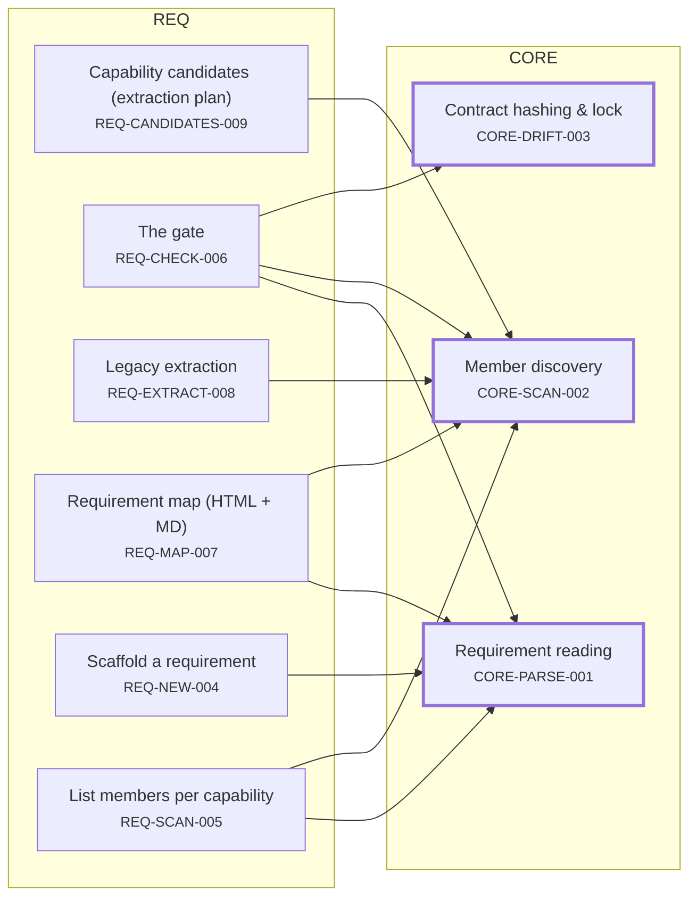
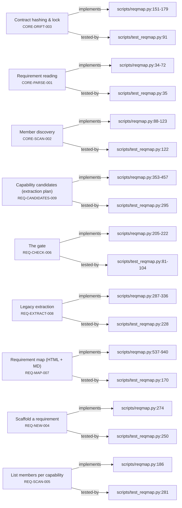
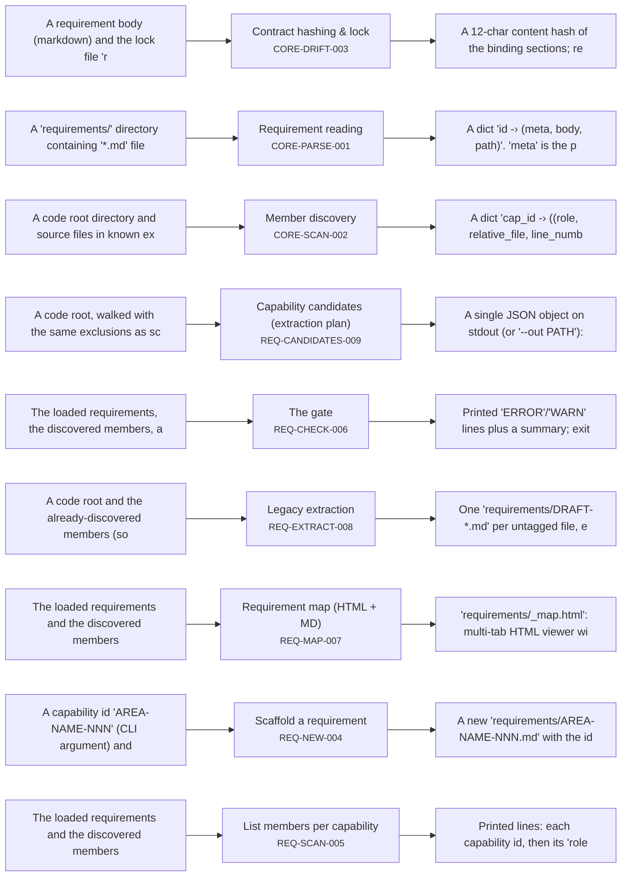
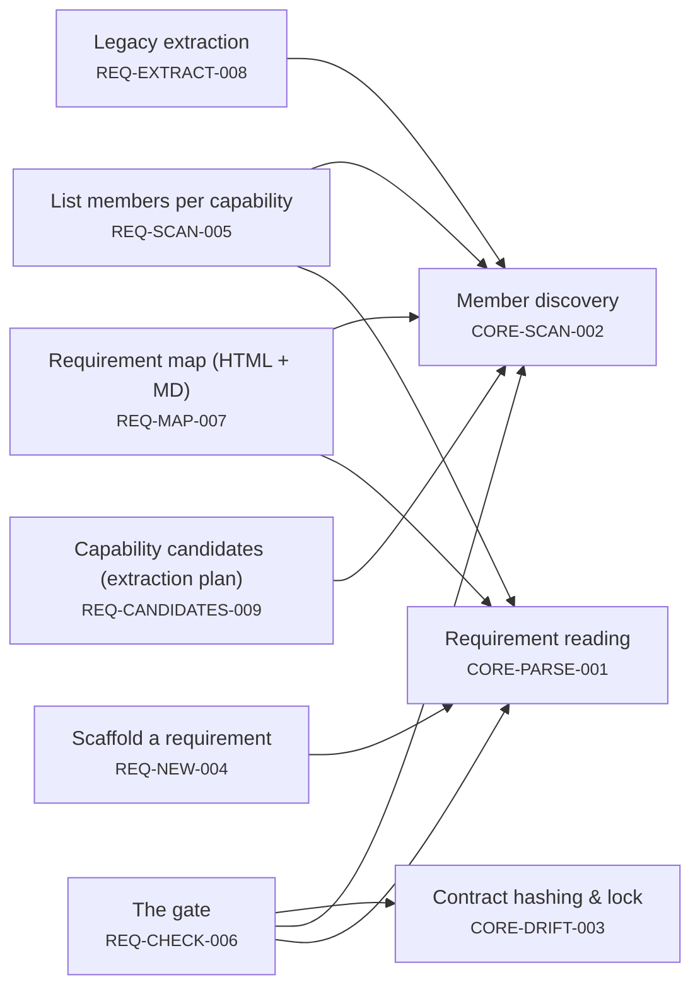
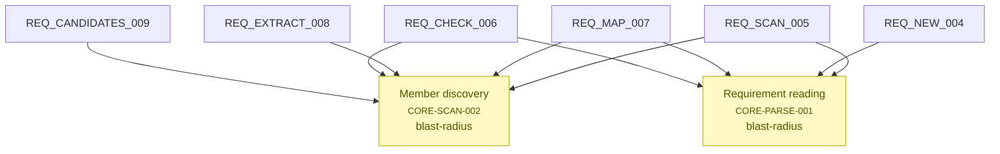

# Requirement Map

## System Map

## Requirement-to-Code

## Behavioral Flow

## Dependency Map

## Risk & Unknowns

### Risk Table

| ID | status | members | dependents | risks |
| --- | --- | --- | --- | --- |
| CORE-PARSE-001 | confirmed | 4 | 4 | blast-radius |
| CORE-SCAN-002 | confirmed | 4 | 5 | blast-radius |
