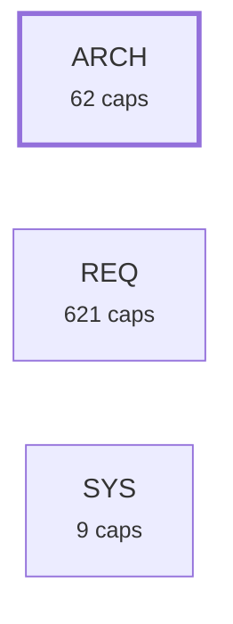

# Requirement Map

## Specification Hierarchy

_The spec hierarchy: system needs -> architecture requirements (`satisfies:`), each box showing how many code-level requirements sit under it. The code level itself is counted, not drawn._

```mermaid
graph TD
  ARCH_ACVERIFY_019[ARCH-ACVERIFY-019<br/>11 code]
  ARCH_ATOMICFORM_053[ARCH-ATOMICFORM-053<br/>0 code]
  ARCH_ATOMICITY_049[ARCH-ATOMICITY-049<br/>13 code]
  ARCH_CANDIDATES_009[ARCH-CANDIDATES-009<br/>14 code]
  ARCH_CHECK_006[ARCH-CHECK-006<br/>34 code]
  ARCH_CMDREGISTRY_033[ARCH-CMDREGISTRY-033<br/>7 code]
  ARCH_CONTEXT_048[ARCH-CONTEXT-048<br/>6 code]
  ARCH_COVERAGE_029[ARCH-COVERAGE-029<br/>10 code]
  ARCH_DECOMPOSE_050[ARCH-DECOMPOSE-050<br/>11 code]
  ARCH_DESCRIPTION_057[ARCH-DESCRIPTION-057<br/>0 code]
  ARCH_DOCBUNDLE_026[ARCH-DOCBUNDLE-026<br/>8 code]
  ARCH_DRIFT_003[ARCH-DRIFT-003<br/>8 code]
  ARCH_DRIFTIMPACT_035[ARCH-DRIFTIMPACT-035<br/>5 code]
  ARCH_EXCALIDRAW_030[ARCH-EXCALIDRAW-030<br/>9 code]
  ARCH_EXCALIDRAW_031[ARCH-EXCALIDRAW-031<br/>9 code]
  ARCH_EXCALIDRAW_032[ARCH-EXCALIDRAW-032<br/>4 code]
  ARCH_EXTRACT_008[ARCH-EXTRACT-008<br/>14 code]
  ARCH_FANOUT_052[ARCH-FANOUT-052<br/>7 code]
  ARCH_FINDINGS_010[ARCH-FINDINGS-010<br/>18 code]
  ARCH_HEALTH_017[ARCH-HEALTH-017<br/>12 code]
  ARCH_INIT_012[ARCH-INIT-012<br/>11 code]
  ARCH_LEVEL_051[ARCH-LEVEL-051<br/>8 code]
  ARCH_LINT_014[ARCH-LINT-014<br/>13 code]
  ARCH_LINTCHECKS_025[ARCH-LINTCHECKS-025<br/>19 code]
  ARCH_MAP_007[ARCH-MAP-007<br/>18 code]
  ARCH_MAPDIAGRAMS_055[ARCH-MAPDIAGRAMS-055<br/>17 code]
  ARCH_MEMBERDRIFT_027[ARCH-MEMBERDRIFT-027<br/>8 code]
  ARCH_MODULEFILE_056[ARCH-MODULEFILE-056<br/>0 code]
  ARCH_NEW_004[ARCH-NEW-004<br/>8 code]
  ARCH_NEXT_013[ARCH-NEXT-013<br/>23 code]
  ARCH_ORPHANCODE_034[ARCH-ORPHANCODE-034<br/>10 code]
  ARCH_PAGES_021[ARCH-PAGES-021<br/>3 code]
  ARCH_PARSE_001[ARCH-PARSE-001<br/>10 code]
  ARCH_PIPE_046[ARCH-PIPE-046<br/>4 code]
  ARCH_PROMOTE_011[ARCH-PROMOTE-011<br/>13 code]
  ARCH_PROMOTE_TODO_001[ARCH-PROMOTE-TODO-001<br/>14 code]
  ARCH_PROSE_024[ARCH-PROSE-024<br/>9 code]
  ARCH_PYFLOOR_040[ARCH-PYFLOOR-040<br/>5 code]
  ARCH_REDUNDANCY_058[ARCH-REDUNDANCY-058<br/>0 code]
  ARCH_REGISTRYLAG_035[ARCH-REGISTRYLAG-035<br/>10 code]
  ARCH_REPRO_041[ARCH-REPRO-041<br/>6 code]
  ARCH_REVIEW_022[ARCH-REVIEW-022<br/>8 code]
  ARCH_REVIEWEDSCORE_109[ARCH-REVIEWEDSCORE-109<br/>0 code]
  ARCH_ROADMAP_038[ARCH-ROADMAP-038<br/>8 code]
  ARCH_SCAN_002[ARCH-SCAN-002<br/>15 code]
  ARCH_SCAN_005[ARCH-SCAN-005<br/>4 code]
  ARCH_SCANCACHE_023[ARCH-SCANCACHE-023<br/>5 code]
  ARCH_SEARCH_036[ARCH-SEARCH-036<br/>19 code]
  ARCH_SELFGATE_039[ARCH-SELFGATE-039<br/>6 code]
  ARCH_SHOW_015[ARCH-SHOW-015<br/>13 code]
  ARCH_SIMILAR_016[ARCH-SIMILAR-016<br/>16 code]
  ARCH_SITE_026[ARCH-SITE-026<br/>6 code]
  ARCH_STALEENGINE_043[ARCH-STALEENGINE-043<br/>12 code]
  ARCH_SUGGESTVERIFIES_047[ARCH-SUGGESTVERIFIES-047<br/>12 code]
  ARCH_TESTLINK_018[ARCH-TESTLINK-018<br/>17 code]
  ARCH_TRACE_020[ARCH-TRACE-020<br/>10 code]
  ARCH_TRACKED_042[ARCH-TRACKED-042<br/>5 code]
  ARCH_TRANSLATE_044[ARCH-TRANSLATE-044<br/>10 code]
  ARCH_UNSCANNEDTAG_045[ARCH-UNSCANNEDTAG-045<br/>7 code]
  ARCH_VIEWER_007[ARCH-VIEWER-007<br/>24 code]
  ARCH_VLEVEL_037[ARCH-VLEVEL-037<br/>15 code]
  ARCH_VRUNGS_054[ARCH-VRUNGS-054<br/>0 code]
  SYS_AUTHOR_101[[SYS-AUTHOR-101]]
  SYS_GATE_102[[SYS-GATE-102]]
  SYS_QUALITY_104[[SYS-QUALITY-104]]
  SYS_READ_103[[SYS-READ-103]]
  SYS_REPORT_105[[SYS-REPORT-105]]
  SYS_SHIP_108[[SYS-SHIP-108]]
  SYS_SSOT_001[[SYS-SSOT-001]]
  SYS_VISUAL_106[[SYS-VISUAL-106]]
  SYS_VMODEL_107[[SYS-VMODEL-107]]
  SYS_GATE_102 --> ARCH_ACVERIFY_019
  SYS_AUTHOR_101 --> ARCH_ATOMICFORM_053
  SYS_AUTHOR_101 --> ARCH_ATOMICITY_049
  SYS_READ_103 --> ARCH_CANDIDATES_009
  SYS_GATE_102 --> ARCH_CHECK_006
  SYS_SHIP_108 --> ARCH_CMDREGISTRY_033
  SYS_AUTHOR_101 --> ARCH_CONTEXT_048
  SYS_REPORT_105 --> ARCH_COVERAGE_029
  SYS_AUTHOR_101 --> ARCH_DECOMPOSE_050
  SYS_AUTHOR_101 --> ARCH_DESCRIPTION_057
  SYS_GATE_102 --> ARCH_DOCBUNDLE_026
  SYS_GATE_102 --> ARCH_DRIFT_003
  SYS_GATE_102 --> ARCH_DRIFTIMPACT_035
  SYS_VISUAL_106 --> ARCH_EXCALIDRAW_030
  SYS_VISUAL_106 --> ARCH_EXCALIDRAW_031
  SYS_VISUAL_106 --> ARCH_EXCALIDRAW_032
  SYS_READ_103 --> ARCH_EXTRACT_008
  SYS_VMODEL_107 --> ARCH_FANOUT_052
  SYS_REPORT_105 --> ARCH_FINDINGS_010
  SYS_REPORT_105 --> ARCH_HEALTH_017
  SYS_SHIP_108 --> ARCH_INIT_012
  SYS_VMODEL_107 --> ARCH_LEVEL_051
  SYS_QUALITY_104 --> ARCH_LINT_014
  SYS_QUALITY_104 --> ARCH_LINTCHECKS_025
  SYS_VISUAL_106 --> ARCH_MAP_007
  SYS_VISUAL_106 --> ARCH_MAPDIAGRAMS_055
  SYS_GATE_102 --> ARCH_MEMBERDRIFT_027
  SYS_READ_103 --> ARCH_MODULEFILE_056
  SYS_AUTHOR_101 --> ARCH_NEW_004
  SYS_REPORT_105 --> ARCH_NEXT_013
  SYS_GATE_102 --> ARCH_ORPHANCODE_034
  SYS_VISUAL_106 --> ARCH_PAGES_021
  SYS_READ_103 --> ARCH_PARSE_001
  SYS_QUALITY_104 --> ARCH_PIPE_046
  SYS_AUTHOR_101 --> ARCH_PROMOTE_011
  SYS_AUTHOR_101 --> ARCH_PROMOTE_TODO_001
  SYS_READ_103 --> ARCH_PROSE_024
  SYS_SHIP_108 --> ARCH_PYFLOOR_040
  SYS_QUALITY_104 --> ARCH_REDUNDANCY_058
  SYS_REPORT_105 --> ARCH_REGISTRYLAG_035
  SYS_SHIP_108 --> ARCH_REPRO_041
  SYS_QUALITY_104 --> ARCH_REVIEW_022
  SYS_REPORT_105 --> ARCH_REVIEWEDSCORE_109
  SYS_REPORT_105 --> ARCH_ROADMAP_038
  SYS_READ_103 --> ARCH_SCAN_002
  SYS_REPORT_105 --> ARCH_SCAN_005
  SYS_READ_103 --> ARCH_SCANCACHE_023
  SYS_REPORT_105 --> ARCH_SEARCH_036
  SYS_SHIP_108 --> ARCH_SELFGATE_039
  SYS_REPORT_105 --> ARCH_SHOW_015
  SYS_QUALITY_104 --> ARCH_SIMILAR_016
  SYS_VISUAL_106 --> ARCH_SITE_026
  SYS_SHIP_108 --> ARCH_STALEENGINE_043
  SYS_QUALITY_104 --> ARCH_SUGGESTVERIFIES_047
  SYS_GATE_102 --> ARCH_TESTLINK_018
  SYS_VMODEL_107 --> ARCH_TRACE_020
  SYS_GATE_102 --> ARCH_TRACKED_042
  SYS_SHIP_108 --> ARCH_TRANSLATE_044
  SYS_GATE_102 --> ARCH_UNSCANNEDTAG_045
  SYS_VISUAL_106 --> ARCH_VIEWER_007
  SYS_VMODEL_107 --> ARCH_VLEVEL_037
  SYS_VMODEL_107 --> ARCH_VRUNGS_054
  SYS_SSOT_001 --> SYS_AUTHOR_101
  SYS_SSOT_001 --> SYS_GATE_102
  SYS_SSOT_001 --> SYS_QUALITY_104
  SYS_SSOT_001 --> SYS_READ_103
  SYS_SSOT_001 --> SYS_REPORT_105
  SYS_SSOT_001 --> SYS_SHIP_108
  SYS_SSOT_001 --> SYS_VISUAL_106
  SYS_SSOT_001 --> SYS_VMODEL_107
  style SYS_AUTHOR_101 stroke-width:3px
  style SYS_GATE_102 stroke-width:3px
  style SYS_QUALITY_104 stroke-width:3px
  style SYS_READ_103 stroke-width:3px
  style SYS_REPORT_105 stroke-width:3px
  style SYS_SHIP_108 stroke-width:3px
  style SYS_SSOT_001 stroke-width:3px
  style SYS_VISUAL_106 stroke-width:3px
  style SYS_VMODEL_107 stroke-width:3px
```



## System Map

_Capabilities grouped by area; thick border = bus; arrows = `depends_on`. Edges into the bus/hubs are hidden (the Dependency Map shows area-level coupling)._

```mermaid
graph LR
  subgraph sg_ARCH["ARCH"]
    ARCH_ACVERIFY_019["Per-criterion test coverage<br><small>ARCH-ACVERIFY-019</small>"]
    ARCH_ATOMICFORM_053["The atomic requirement form<br><small>ARCH-ATOMICFORM-053</small>"]
    ARCH_ATOMICITY_049["Statement atomicity<br><small>ARCH-ATOMICITY-049</small>"]
    ARCH_CANDIDATES_009["Capability candidates (extraction plan)<br><small>ARCH-CANDIDATES-009</small>"]
    ARCH_CHECK_006["The gate<br><small>ARCH-CHECK-006</small>"]
    ARCH_CMDREGISTRY_033["CLI command registry + generated integration artifacts<br><small>ARCH-CMDREGISTRY-033</small>"]
    ARCH_CONTEXT_048["Consolidated Context section<br><small>ARCH-CONTEXT-048</small>"]
    ARCH_COVERAGE_029["Untagged-code coverage signal<br><small>ARCH-COVERAGE-029</small>"]
    ARCH_DECOMPOSE_050["Clause decomposition scaffold<br><small>ARCH-DECOMPOSE-050</small>"]
    ARCH_DESCRIPTION_057["One Description section, and Cases instead of Acceptance<br><small>ARCH-DESCRIPTION-057</small>"]
    ARCH_DOCBUNDLE_026["Untagged doc-bundle warning<br><small>ARCH-DOCBUNDLE-026</small>"]
    ARCH_DRIFT_003["Contract hashing & lock<br><small>ARCH-DRIFT-003</small>"]
    ARCH_DRIFTIMPACT_035["Drift blast-radius: name dependents<br><small>ARCH-DRIFTIMPACT-035</small>"]
    ARCH_EXCALIDRAW_030["Excalidraw scene builder — core API<br><small>ARCH-EXCALIDRAW-030</small>"]
    ARCH_EXCALIDRAW_031["Excalidraw quality gates<br><small>ARCH-EXCALIDRAW-031</small>"]
    ARCH_EXCALIDRAW_032["Excalidraw builder CLI verbs<br><small>ARCH-EXCALIDRAW-032</small>"]
    ARCH_EXTRACT_008["Legacy extraction<br><small>ARCH-EXTRACT-008</small>"]
    ARCH_FANOUT_052["Hierarchy breadth<br><small>ARCH-FANOUT-052</small>"]
    ARCH_FINDINGS_010["Open-findings report<br><small>ARCH-FINDINGS-010</small>"]
    ARCH_HEALTH_017["Corpus health snapshot<br><small>ARCH-HEALTH-017</small>"]
    ARCH_INIT_012["First-use bootstrap<br><small>ARCH-INIT-012</small>"]
    ARCH_LEVEL_051["Specification level<br><small>ARCH-LEVEL-051</small>"]
    ARCH_LINT_014["Requirement readability linter<br><small>ARCH-LINT-014</small>"]
    ARCH_LINTCHECKS_025["Readability & scope checks<br><small>ARCH-LINTCHECKS-025</small>"]
    ARCH_MAP_007["Requirement graph (_map.json)<br><small>ARCH-MAP-007</small>"]
    ARCH_MAPDIAGRAMS_055["Mermaid diagrams (_map.md)<br><small>ARCH-MAPDIAGRAMS-055</small>"]
    ARCH_MEMBERDRIFT_027["Reverse-direction member drift<br><small>ARCH-MEMBERDRIFT-027</small>"]
    ARCH_MODULEFILE_056["Several requirements in one file<br><small>ARCH-MODULEFILE-056</small>"]
    ARCH_NEW_004["Scaffold a requirement<br><small>ARCH-NEW-004</small>"]
    ARCH_NEXT_013["What-should-I-do-next report<br><small>ARCH-NEXT-013</small>"]
    ARCH_ORPHANCODE_034["Orphan-code warning<br><small>ARCH-ORPHANCODE-034</small>"]
    ARCH_PAGES_021["Publish & gate the GitHub Pages map copy<br><small>ARCH-PAGES-021</small>"]
    ARCH_PARSE_001["Requirement reading<br><small>ARCH-PARSE-001</small>"]
    ARCH_PIPE_046["A closed output pipe ends a command quietly<br><small>ARCH-PIPE-046</small>"]
    ARCH_PROMOTE_011["confirm<br><small>ARCH-PROMOTE-011</small>"]
    ARCH_PROMOTE_TODO_001["Promote a TODO item into a requirement draft<br><small>ARCH-PROMOTE-TODO-001</small>"]
    ARCH_PROSE_024["Prose capability classification & drafting<br><small>ARCH-PROSE-024</small>"]
    ARCH_PYFLOOR_040["Declared Python support floor<br><small>ARCH-PYFLOOR-040</small>"]
    ARCH_REDUNDANCY_058["Requirements that say the same thing<br><small>ARCH-REDUNDANCY-058</small>"]
    ARCH_REGISTRYLAG_035["Registry-lag signal — commits since the requirements dir was last touched<br><small>ARCH-REGISTRYLAG-035</small>"]
    ARCH_REPRO_041["Committed build artifacts stay re-derivable<br><small>ARCH-REPRO-041</small>"]
    ARCH_REVIEW_022["AI requirement-quality review (deterministic plan + advisory pass)<br><small>ARCH-REVIEW-022</small>"]
    ARCH_REVIEWEDSCORE_109["Reviewed-only health score<br><small>ARCH-REVIEWEDSCORE-109</small>"]
    ARCH_ROADMAP_038["Roadmap coherence signals<br><small>ARCH-ROADMAP-038</small>"]
    ARCH_SCAN_002["Member discovery<br><small>ARCH-SCAN-002</small>"]
    ARCH_SCAN_005["List members per capability<br><small>ARCH-SCAN-005</small>"]
    ARCH_SCANCACHE_023["Opt-in scan cache<br><small>ARCH-SCANCACHE-023</small>"]
    ARCH_SEARCH_036["Free-text requirement search<br><small>ARCH-SEARCH-036</small>"]
    ARCH_SELFGATE_039["This repo's own gate wiring<br><small>ARCH-SELFGATE-039</small>"]
    ARCH_SHOW_015["Single-requirement dossier<br><small>ARCH-SHOW-015</small>"]
    ARCH_SIMILAR_016["Duplicate-capability detector<br><small>ARCH-SIMILAR-016</small>"]
    ARCH_SITE_026["Generate & maintain a project presentation page<br><small>ARCH-SITE-026</small>"]
    ARCH_STALEENGINE_043["Stale vendored engine, reported in CI<br><small>ARCH-STALEENGINE-043</small>"]
    ARCH_SUGGESTVERIFIES_047["Suggest per-criterion 'verifies:' tags<br><small>ARCH-SUGGESTVERIFIES-047</small>"]
    ARCH_TESTLINK_018["Test-link integrity check<br><small>ARCH-TESTLINK-018</small>"]
    ARCH_TRACE_020["Upstream traceability<br><small>ARCH-TRACE-020</small>"]
    ARCH_TRACKED_042["Untracked members reported<br><small>ARCH-TRACKED-042</small>"]
    ARCH_TRANSLATE_044["Opt-in requirement-content translation<br><small>ARCH-TRANSLATE-044</small>"]
    ARCH_UNSCANNEDTAG_045["Tags in unscanned file types reported<br><small>ARCH-UNSCANNEDTAG-045</small>"]
    ARCH_VIEWER_007["Self-contained HTML map viewer<br><small>ARCH-VIEWER-007</small>"]
    ARCH_VLEVEL_037["Verification levels<br><small>ARCH-VLEVEL-037</small>"]
    ARCH_VRUNGS_054["Level-to-verification correspondence<br><small>ARCH-VRUNGS-054</small>"]
  end
  subgraph sg_REQ["REQ"]
    REQ_ACVERIFY_233["The gate scans code for # verifies: ‹id›#AC-N<br><small>REQ-ACVERIFY-233</small>"]
    REQ_ACVERIFY_234["The gate recognises a verifies tag only with<br><small>REQ-ACVERIFY-234</small>"]
    REQ_ACVERIFY_235["For a confirmed requirement that labels its criteria<br><small>REQ-ACVERIFY-235</small>"]
    REQ_ACVERIFY_236["That single warning also states how many labelled<br><small>REQ-ACVERIFY-236</small>"]
    REQ_ACVERIFY_237["A confirmed requirement with no verifies tag is<br><small>REQ-ACVERIFY-237</small>"]
    REQ_ACVERIFY_238["A requirement whose criteria are unlabelled bullets is<br><small>REQ-ACVERIFY-238</small>"]
    REQ_ACVERIFY_239["A criterion marked ‹!-- verifiable by: inspection --›<br><small>REQ-ACVERIFY-239</small>"]
    REQ_ACVERIFY_240["The map emits clauses and covered on a<br><small>REQ-ACVERIFY-240</small>"]
    REQ_ACVERIFY_241["The map emits a gap naming the untagged<br><small>REQ-ACVERIFY-241</small>"]
    REQ_ACVERIFY_242["An absent clauses means 'not measured'. No reader<br><small>REQ-ACVERIFY-242</small>"]
    REQ_ACVERIFY_243["The check is warn-only. It never changes the<br><small>REQ-ACVERIFY-243</small>"]
    REQ_ATOMICITY_244["A clause in a Contract section describes a<br><small>REQ-ATOMICITY-244</small>"]
    REQ_ATOMICITY_245["A clause carrying two independent obligations counts as<br><small>REQ-ATOMICITY-245</small>"]
    REQ_ATOMICITY_246["Atomicity is judged by a human reader. No<br><small>REQ-ATOMICITY-246</small>"]
    REQ_ATOMICITY_247["A clause normally holds no more than LINT_STATEMENT_WORDS<br><small>REQ-ATOMICITY-247</small>"]
    REQ_ATOMICITY_248["The statement-size check reports a Contract clause above<br><small>REQ-ATOMICITY-248</small>"]
    REQ_ATOMICITY_249["The threshold is advisory. A clause above it<br><small>REQ-ATOMICITY-249</small>"]
    REQ_ATOMICITY_250["Lint_exempt: statement-size silences the check for one requirement<br><small>REQ-ATOMICITY-250</small>"]
    REQ_ATOMICITY_251["The statement-size check measures textual size, never semantic<br><small>REQ-ATOMICITY-251</small>"]
    REQ_ATOMICITY_252["A short clause may carry several independent obligations<br><small>REQ-ATOMICITY-252</small>"]
    REQ_ATOMICITY_253["A finding asks the author to re-read the<br><small>REQ-ATOMICITY-253</small>"]
    REQ_ATOMICITY_254["The check counts words after each backticked code<br><small>REQ-ATOMICITY-254</small>"]
    REQ_ATOMICITY_255["A nested sub-bullet is counted as its own<br><small>REQ-ATOMICITY-255</small>"]
    REQ_ATOMICITY_256["The check reads the Contract section only. Acceptance<br><small>REQ-ATOMICITY-256</small>"]
    REQ_CANDIDATES_257["Plan emits a single JSON object, to stdout<br><small>REQ-CANDIDATES-257</small>"]
    REQ_CANDIDATES_258["Plan writes NO .md files. It cannot repeat<br><small>REQ-CANDIDATES-258</small>"]
    REQ_CANDIDATES_259["Plan walks the code with the same exclusions<br><small>REQ-CANDIDATES-259</small>"]
    REQ_CANDIDATES_260["Plan gathers per-file facts: module and symbol docstrings<br><small>REQ-CANDIDATES-260</small>"]
    REQ_CANDIDATES_261["Plan lists every scannable code file as a<br><small>REQ-CANDIDATES-261</small>"]
    REQ_CANDIDATES_262["Plan reads top-level signatures from Python via ast<br><small>REQ-CANDIDATES-262</small>"]
    REQ_CANDIDATES_263["An unparseable file yields empty facts. It never<br><small>REQ-CANDIDATES-263</small>"]
    REQ_CANDIDATES_264["Each candidate carries (suggested_id, suggested_layer, files, docstrings(), signatures<br><small>REQ-CANDIDATES-264</small>"]
    REQ_CANDIDATES_265["Is_test is true when every file of the<br><small>REQ-CANDIDATES-265</small>"]
    REQ_CANDIDATES_266["Depends_on is derived from imports resolved to other<br><small>REQ-CANDIDATES-266</small>"]
    REQ_CANDIDATES_267["Suggested_layer is bus when importer_count ≥ BUS_FANIN_THRESHOLD, else<br><small>REQ-CANDIDATES-267</small>"]
    REQ_CANDIDATES_268["A file already carrying an implements: tag is<br><small>REQ-CANDIDATES-268</small>"]
    REQ_CANDIDATES_269["Plan groups files by requirements/_capmap.json when that file<br><small>REQ-CANDIDATES-269</small>"]
    REQ_CANDIDATES_270["Absent _capmap.json, plan falls back to one candidate<br><small>REQ-CANDIDATES-270</small>"]
    REQ_CHECK_271["Gate reports an ERROR and exits non-zero for<br><small>REQ-CHECK-271</small>"]
    REQ_CHECK_272["A dangling tag — a code tag referencing<br><small>REQ-CHECK-272</small>"]
    REQ_CHECK_273["An invalid status or an invalid layer is<br><small>REQ-CHECK-273</small>"]
    REQ_CHECK_274["A depends_on pointing at a missing id is<br><small>REQ-CHECK-274</small>"]
    REQ_CHECK_275["An enforced requirement with no implements: member is<br><small>REQ-CHECK-275</small>"]
    REQ_CHECK_276["A requirement is enforced when its status is<br><small>REQ-CHECK-276</small>"]
    REQ_CHECK_277["A layer: need requirement is exempt from that<br><small>REQ-CHECK-277</small>"]
    REQ_CHECK_278["Gate reports drift as a WARN, never an<br><small>REQ-CHECK-278</small>"]
    REQ_CHECK_279["The drift warning names the member file:line locations<br><small>REQ-CHECK-279</small>"]
    REQ_CHECK_280["A confirmed requirement with no tested-by: member is<br><small>REQ-CHECK-280</small>"]
    REQ_CHECK_281["A requirement carrying a test_exempt: ‹reason› opt-out in<br><small>REQ-CHECK-281</small>"]
    REQ_CHECK_282["A layer: need requirement is exempt from it<br><small>REQ-CHECK-282</small>"]
    REQ_CHECK_283["A confirmed requirement missing a ## WHAT —<br><small>REQ-CHECK-283</small>"]
    REQ_CHECK_284["A confirmed requirement missing a ## HOW —<br><small>REQ-CHECK-284</small>"]
    REQ_CHECK_285["The requirement milestone: field is optional. When present<br><small>REQ-CHECK-285</small>"]
    REQ_CHECK_286["A malformed milestone: value is a WARN, because<br><small>REQ-CHECK-286</small>"]
    REQ_CHECK_287["A deprecated requirement is exempt from the milestone<br><small>REQ-CHECK-287</small>"]
    REQ_CHECK_288["A present-but-unreadable _reqlock.json is a WARN. Drift is<br><small>REQ-CHECK-288</small>"]
    REQ_CHECK_289["A lock sidecar (_reqlock.json or _memberlock.json) that exists<br><small>REQ-CHECK-289</small>"]
    REQ_CHECK_290["An uncommitted lock silently disables drift detection on<br><small>REQ-CHECK-290</small>"]
    REQ_CHECK_291["That git-tracking check is fail-open: gate stays silent<br><small>REQ-CHECK-291</small>"]
    REQ_CHECK_292["Gate names every requirement whose body lacks a<br><small>REQ-CHECK-292</small>"]
    REQ_CHECK_293["Gate counts those legacy-schema requirements in the summary<br><small>REQ-CHECK-293</small>"]
    REQ_CHECK_294["The legacy-schema warning does not affect the exit<br><small>REQ-CHECK-294</small>"]
    REQ_CHECK_295["A confirmed need with no validated-against: member is<br><small>REQ-CHECK-295</small>"]
    REQ_CHECK_296["A confirmed bus requirement whose levelled tested-by: links<br><small>REQ-CHECK-296</small>"]
    REQ_CHECK_297["A depends_on cycle is a WARN naming the<br><small>REQ-CHECK-297</small>"]
    REQ_CHECK_298["The cycle warning stays a warning under --strict<br><small>REQ-CHECK-298</small>"]
    REQ_CHECK_299["Gate prints an advisory line carrying the open<br><small>REQ-CHECK-299</small>"]
    REQ_CHECK_300["That advisory line does not affect the exit<br><small>REQ-CHECK-300</small>"]
    REQ_CHECK_301["Gate prints a summary of requirements, members, errors<br><small>REQ-CHECK-301</small>"]
    REQ_CHECK_302["With --update-lock, gate writes the current binding hashes<br><small>REQ-CHECK-302</small>"]
    REQ_CHECK_303["Sync and the deprecated check alias pass --update-lock<br><small>REQ-CHECK-303</small>"]
    REQ_CHECK_304["The gate verb itself is report-only<br><small>REQ-CHECK-304</small>"]
    REQ_CMDREGISTRY_305["A COMMANDS dict is the single source of<br><small>REQ-CMDREGISTRY-305</small>"]
    REQ_CMDREGISTRY_306["Argparse choices are derived from COMMANDS at runtime<br><small>REQ-CMDREGISTRY-306</small>"]
    REQ_CMDREGISTRY_307["Tool_definition.json (the function-calling schema) is generated from COMMANDS<br><small>REQ-CMDREGISTRY-307</small>"]
    REQ_CMDREGISTRY_308["The SKILL.universal.md command table is generated from COMMANDS<br><small>REQ-CMDREGISTRY-308</small>"]
    REQ_CMDREGISTRY_309["Internal commands (e.g. gen-integration) are excluded from AI-facing<br><small>REQ-CMDREGISTRY-309</small>"]
    REQ_CMDREGISTRY_310["The gate fails (exit non-zero) when a committed<br><small>REQ-CMDREGISTRY-310</small>"]
    REQ_CMDREGISTRY_311["All generators and the gate check are stdlib-only<br><small>REQ-CMDREGISTRY-311</small>"]
    REQ_CONTEXT_312["New's built-in template scaffolds the Context form for<br><small>REQ-CONTEXT-312</small>"]
    REQ_CONTEXT_313["The Context form groups sub-topics with a bold<br><small>REQ-CONTEXT-313</small>"]
    REQ_CONTEXT_314["_context_group(body, label) returns the bullets under one bold<br><small>REQ-CONTEXT-314</small>"]
    REQ_CONTEXT_315["The legacy form remains fully valid. Nothing in<br><small>REQ-CONTEXT-315</small>"]
    REQ_CONTEXT_316["_build_map_data's notes and current_impl fields try the legacy<br><small>REQ-CONTEXT-316</small>"]
    REQ_CONTEXT_317["## Context and its sub-groups are commentary: not<br><small>REQ-CONTEXT-317</small>"]
    REQ_COVERAGE_318["The capability reports the count of scannable code<br><small>REQ-COVERAGE-318</small>"]
    REQ_COVERAGE_319["The denominator is exactly _scan_untagged's (see ARCH-NEXT-013): the<br><small>REQ-COVERAGE-319</small>"]
    REQ_COVERAGE_320["Any membership tag counts a file as covered<br><small>REQ-COVERAGE-320</small>"]
    REQ_COVERAGE_321["The health command includes this count as an<br><small>REQ-COVERAGE-321</small>"]
    REQ_COVERAGE_322["The health command also includes it as a<br><small>REQ-COVERAGE-322</small>"]
    REQ_COVERAGE_323["The untagged key is absent, not zero, when<br><small>REQ-COVERAGE-323</small>"]
    REQ_COVERAGE_324["The signal is read-only and is never a<br><small>REQ-COVERAGE-324</small>"]
    REQ_COVERAGE_325["The signal never lowers the health score, because<br><small>REQ-COVERAGE-325</small>"]
    REQ_COVERAGE_326["A file is silenced from the count either<br><small>REQ-COVERAGE-326</small>"]
    REQ_COVERAGE_327["There is no separate exemption mechanism<br><small>REQ-COVERAGE-327</small>"]
    REQ_DECOMPOSE_328["Lint writes no file during the default run<br><small>REQ-DECOMPOSE-328</small>"]
    REQ_DECOMPOSE_329["Lint --decompose creates one draft requirement for each<br><small>REQ-DECOMPOSE-329</small>"]
    REQ_DECOMPOSE_330["The gate, the pre-commit hook and CI never<br><small>REQ-DECOMPOSE-330</small>"]
    REQ_DECOMPOSE_331["Each created draft carries status: draft and a<br><small>REQ-DECOMPOSE-331</small>"]
    REQ_DECOMPOSE_332["The reported clause text is seeded into the<br><small>REQ-DECOMPOSE-332</small>"]
    REQ_DECOMPOSE_333["The created id keeps the parent's area and<br><small>REQ-DECOMPOSE-333</small>"]
    REQ_DECOMPOSE_334["Lint --decompose leaves the parent unchanged, so no<br><small>REQ-DECOMPOSE-334</small>"]
    REQ_DECOMPOSE_335["The command chooses the split by word count<br><small>REQ-DECOMPOSE-335</small>"]
    REQ_DECOMPOSE_336["Each created draft records that its split point<br><small>REQ-DECOMPOSE-336</small>"]
    REQ_DECOMPOSE_337["Deleting a created draft restores the corpus exactly<br><small>REQ-DECOMPOSE-337</small>"]
    REQ_DECOMPOSE_338["Lint --decompose skips a clause whose target file<br><small>REQ-DECOMPOSE-338</small>"]
    REQ_DOCBUNDLE_339["The gate warns for each file under docs/<br><small>REQ-DOCBUNDLE-339</small>"]
    REQ_DOCBUNDLE_340["The gate considers only files under docs/<br><small>REQ-DOCBUNDLE-340</small>"]
    REQ_DOCBUNDLE_341["The check skips engine-generated outputs: a file whose<br><small>REQ-DOCBUNDLE-341</small>"]
    REQ_DOCBUNDLE_342["The engine owns those two and freshness-checks them<br><small>REQ-DOCBUNDLE-342</small>"]
    REQ_DOCBUNDLE_343["The check honors .reqmapignore and the standard scan<br><small>REQ-DOCBUNDLE-343</small>"]
    REQ_DOCBUNDLE_344["The scan walk prunes .git, node_modules, __pycache__ and<br><small>REQ-DOCBUNDLE-344</small>"]
    REQ_DOCBUNDLE_345["The check skips a file it cannot read<br><small>REQ-DOCBUNDLE-345</small>"]
    REQ_DOCBUNDLE_346["The check is warn-only and never changes the<br><small>REQ-DOCBUNDLE-346</small>"]
    REQ_DRIFT_200["Binding_hash computes a stable 12-character hex content hash<br><small>REQ-DRIFT-200</small>"]
    REQ_DRIFT_201["The normative sections are the Contract and Acceptance<br><small>REQ-DRIFT-201</small>"]
    REQ_DRIFT_202["Rationale, notes, verify-intent, links and the member list<br><small>REQ-DRIFT-202</small>"]
    REQ_DRIFT_203["The hash is deterministic for identical normative content<br><small>REQ-DRIFT-203</small>"]
    REQ_DRIFT_204["Load_lock and save_lock read and write the per-id<br><small>REQ-DRIFT-204</small>"]
    REQ_DRIFT_205["A missing, empty or unparseable lock loads as<br><small>REQ-DRIFT-205</small>"]
    REQ_DRIFT_206["Save_lock creates the requirements directory if it is<br><small>REQ-DRIFT-206</small>"]
    REQ_DRIFT_207["Save_lock writes sorted, indented JSON, so the lock<br><small>REQ-DRIFT-207</small>"]
    REQ_DRIFTIMPACT_347["When the gate reports a contract drift for<br><small>REQ-DRIFTIMPACT-347</small>"]
    REQ_DRIFTIMPACT_348["The dependent list is sorted and deduplicated, so<br><small>REQ-DRIFTIMPACT-348</small>"]
    REQ_DRIFTIMPACT_349["Only direct dependents are named (one edge, not<br><small>REQ-DRIFTIMPACT-349</small>"]
    REQ_DRIFTIMPACT_350["A drifted requirement with no dependents produces the<br><small>REQ-DRIFTIMPACT-350</small>"]
    REQ_DRIFTIMPACT_351["The addition does not change the drift warning's<br><small>REQ-DRIFTIMPACT-351</small>"]
    REQ_EXCALIDRAW_352["Scene() produces a valid Excalidraw JSON scene (schema<br><small>REQ-EXCALIDRAW-352</small>"]
    REQ_EXCALIDRAW_353["Scene exposes shape primitives: box, ellipse, diamond, frame<br><small>REQ-EXCALIDRAW-353</small>"]
    REQ_EXCALIDRAW_354["Scene exposes ISO 5807 flowchart aliases: process, terminator<br><small>REQ-EXCALIDRAW-354</small>"]
    REQ_EXCALIDRAW_355["Scene exposes layout helpers: row, column, grid, enclose<br><small>REQ-EXCALIDRAW-355</small>"]
    REQ_EXCALIDRAW_356["Scene exposes annotation helpers: title, label, legend, glossary<br><small>REQ-EXCALIDRAW-356</small>"]
    REQ_EXCALIDRAW_357["Scene exposes connector helpers: arrow, free_arrow, path, route_under<br><small>REQ-EXCALIDRAW-357</small>"]
    REQ_EXCALIDRAW_358[".save(basename, out_dir) writes both ‹basename›.excalidraw (the scene JSON)<br><small>REQ-EXCALIDRAW-358</small>"]
    REQ_EXCALIDRAW_359["Scene(seed=‹int›) produces byte-identical output across re-runs<br><small>REQ-EXCALIDRAW-359</small>"]
    REQ_EXCALIDRAW_360["The builder has no external dependencies — stdlib<br><small>REQ-EXCALIDRAW-360</small>"]
    REQ_EXCALIDRAW_361[".save() supports five named gates, each accepting 'warn'<br><small>REQ-EXCALIDRAW-361</small>"]
    REQ_EXCALIDRAW_362["Crossing_check: a bound arrow whose straight centre-to-centre path<br><small>REQ-EXCALIDRAW-362</small>"]
    REQ_EXCALIDRAW_363["Legend_check: a fill colour used on any shape<br><small>REQ-EXCALIDRAW-363</small>"]
    REQ_EXCALIDRAW_364["Overflow_check: a shape whose bound text is larger<br><small>REQ-EXCALIDRAW-364</small>"]
    REQ_EXCALIDRAW_365["Text_overlap_check: two free captions or label elements that<br><small>REQ-EXCALIDRAW-365</small>"]
    REQ_EXCALIDRAW_366["Label_fit_check: a bound arrow whose text label is<br><small>REQ-EXCALIDRAW-366</small>"]
    REQ_EXCALIDRAW_367[".save() additionally enforces two hard gates that raise<br><small>REQ-EXCALIDRAW-367</small>"]
    REQ_EXCALIDRAW_368["The inspection methods check_overlaps(), check_arrow_crossings(), check_legend_coverage(), check_text_overflow(), check_text_overlaps()<br><small>REQ-EXCALIDRAW-368</small>"]
    REQ_EXCALIDRAW_369["Test_excalidraw.py exercises the five named gates in both<br><small>REQ-EXCALIDRAW-369</small>"]
    REQ_EXCALIDRAW_370["Invoking python excalidraw_builder.py with no arguments runs the<br><small>REQ-EXCALIDRAW-370</small>"]
    REQ_EXCALIDRAW_371["Python excalidraw_builder.py render ‹scene.excalidraw› out_dir reads an existing<br><small>REQ-EXCALIDRAW-371</small>"]
    REQ_EXCALIDRAW_372["Python excalidraw_builder.py discover ‹repo› out.py scans ‹repo› for<br><small>REQ-EXCALIDRAW-372</small>"]
    REQ_EXCALIDRAW_373["Any unrecognised verb exits with code 2 and<br><small>REQ-EXCALIDRAW-373</small>"]
    REQ_EXTRACT_374["Draft walks every untagged scannable code file —<br><small>REQ-EXTRACT-374</small>"]
    REQ_EXTRACT_375["Draft skips a file that already carries a<br><small>REQ-EXTRACT-375</small>"]
    REQ_EXTRACT_376["Draft honors .reqmapignore, the same fnmatch globs scan<br><small>REQ-EXTRACT-376</small>"]
    REQ_EXTRACT_377["A file matching an ignore pattern is never<br><small>REQ-EXTRACT-377</small>"]
    REQ_EXTRACT_378["Draft proposes one requirements/DRAFT-.md per remaining file<br><small>REQ-EXTRACT-378</small>"]
    REQ_EXTRACT_379["Every proposal carries status: draft and a TODO<br><small>REQ-EXTRACT-379</small>"]
    REQ_EXTRACT_380["A proposal's Contract section opens with 'Every line<br><small>REQ-EXTRACT-380</small>"]
    REQ_EXTRACT_381["Draft creates the requirements directory if it is<br><small>REQ-EXTRACT-381</small>"]
    REQ_EXTRACT_382["Draft ids are path-aware, so two files sharing<br><small>REQ-EXTRACT-382</small>"]
    REQ_EXTRACT_383["Draft assigns a cheap risk score from TODO/FIXME/HACK/XXX<br><small>REQ-EXTRACT-383</small>"]
    REQ_EXTRACT_384["Draft routes a score of 2 or more<br><small>REQ-EXTRACT-384</small>"]
    REQ_EXTRACT_385["Re-running draft never overwrites an existing draft<br><small>REQ-EXTRACT-385</small>"]
    REQ_EXTRACT_386["A code proposal's WHERE section lists the file's<br><small>REQ-EXTRACT-386</small>"]
    REQ_EXTRACT_387["That surface is an authoring hint under WHERE<br><small>REQ-EXTRACT-387</small>"]
    REQ_FANOUT_388["The fan-out check counts, per requirement, how many<br><small>REQ-FANOUT-388</small>"]
    REQ_FANOUT_389["The count reads the satisfies: graph only, never<br><small>REQ-FANOUT-389</small>"]
    REQ_FANOUT_390["A requirement with no children is skipped, because<br><small>REQ-FANOUT-390</small>"]
    REQ_FANOUT_391["The fan-out check warns when a parent's child<br><small>REQ-FANOUT-391</small>"]
    REQ_FANOUT_392["The finding says whether the count is below<br><small>REQ-FANOUT-392</small>"]
    REQ_FANOUT_393["The fan-out check is warn-only and never changes<br><small>REQ-FANOUT-393</small>"]
    REQ_FANOUT_394["Lint_exempt: fan-out silences the check for one requirement<br><small>REQ-FANOUT-394</small>"]
    REQ_FINDINGS_395["Findings scans every requirement and collects the bullet<br><small>REQ-FINDINGS-395</small>"]
    REQ_FINDINGS_396["Findings writes them into a single _findings.md in<br><small>REQ-FINDINGS-396</small>"]
    REQ_FINDINGS_397["Findings excludes the 'None — …' placeholder bullet<br><small>REQ-FINDINGS-397</small>"]
    REQ_FINDINGS_398["In raw mode, findings groups the findings by<br><small>REQ-FINDINGS-398</small>"]
    REQ_FINDINGS_399["Each group and the document header carry a<br><small>REQ-FINDINGS-399</small>"]
    REQ_FINDINGS_400["With zero findings, findings still writes a well-formed<br><small>REQ-FINDINGS-400</small>"]
    REQ_FINDINGS_401["With the raw flag set, findings ignores any<br><small>REQ-FINDINGS-401</small>"]
    REQ_FINDINGS_402["When the sidecar exists and raw mode is<br><small>REQ-FINDINGS-402</small>"]
    REQ_FINDINGS_403["That view puts confirmed bugs first, ordered by<br><small>REQ-FINDINGS-403</small>"]
    REQ_FINDINGS_404["A bug entry shows its location and its<br><small>REQ-FINDINGS-404</small>"]
    REQ_FINDINGS_405["Findings emits an advisory staleness note when the<br><small>REQ-FINDINGS-405</small>"]
    REQ_FINDINGS_406["Findings is deterministic and stdlib-only. It never classifies<br><small>REQ-FINDINGS-406</small>"]
    REQ_FINDINGS_407["Findings writes no file other than _findings.md<br><small>REQ-FINDINGS-407</small>"]
    REQ_FINDINGS_408["Map rewrites _findings.md when that file already exists<br><small>REQ-FINDINGS-408</small>"]
    REQ_FINDINGS_409["Map never creates _findings.md. Running findings once opts<br><small>REQ-FINDINGS-409</small>"]
    REQ_FINDINGS_410["Map --check reports _findings.md stale when the committed<br><small>REQ-FINDINGS-410</small>"]
    REQ_FINDINGS_411["The gate prints a non-error advisory line carrying<br><small>REQ-FINDINGS-411</small>"]
    REQ_FINDINGS_412["The open-findings count never changes the gate's exit<br><small>REQ-FINDINGS-412</small>"]
    REQ_HEALTH_413["Health prints a coherence snapshot of the whole<br><small>REQ-HEALTH-413</small>"]
    REQ_HEALTH_414["Health writes nothing. It only reads and prints<br><small>REQ-HEALTH-414</small>"]
    REQ_HEALTH_415["Health computes a headline score: the percentage of<br><small>REQ-HEALTH-415</small>"]
    REQ_HEALTH_416["The axes are status confirmed, coverage, a test<br><small>REQ-HEALTH-416</small>"]
    REQ_HEALTH_417["For a bus or feature requirement, coverage means<br><small>REQ-HEALTH-417</small>"]
    REQ_HEALTH_418["For those same layers, the test signal means<br><small>REQ-HEALTH-418</small>"]
    REQ_HEALTH_419["A need is covered when at least one<br><small>REQ-HEALTH-419</small>"]
    REQ_HEALTH_420["A confirmed need that no requirement satisfies counts<br><small>REQ-HEALTH-420</small>"]
    REQ_HEALTH_421["Health prints component counts alongside the score: confirmed<br><small>REQ-HEALTH-421</small>"]
    REQ_HEALTH_422["--json emits the same numbers as a JSON<br><small>REQ-HEALTH-422</small>"]
    REQ_HEALTH_423["On an empty corpus health prints a score<br><small>REQ-HEALTH-423</small>"]
    REQ_HEALTH_424["Health always returns zero. The snapshot is a<br><small>REQ-HEALTH-424</small>"]
    REQ_INIT_425["Init creates the requirements folder if it is<br><small>REQ-INIT-425</small>"]
    REQ_INIT_426["Init writes a starter .reqmapignore only if the<br><small>REQ-INIT-426</small>"]
    REQ_INIT_427["The starter file lists scripts/reqmap.py. Without that line<br><small>REQ-INIT-427</small>"]
    REQ_INIT_428["The starter file also lists .worktrees/ and .claude/worktrees/<br><small>REQ-INIT-428</small>"]
    REQ_INIT_429["One exception: if the engine describes itself in<br><small>REQ-INIT-429</small>"]
    REQ_INIT_430["'Describes itself' means scripts/reqmap.py carries tags whose ids<br><small>REQ-INIT-430</small>"]
    REQ_INIT_431["Init drafts requirements from untagged code, writes the<br><small>REQ-INIT-431</small>"]
    REQ_INIT_432["Init ends with a short summary naming one<br><small>REQ-INIT-432</small>"]
    REQ_INIT_433["If nothing was drafted, init says so in<br><small>REQ-INIT-433</small>"]
    REQ_INIT_434["Running init twice is safe. The second run<br><small>REQ-INIT-434</small>"]
    REQ_INIT_435["A second run never deletes a requirement someone<br><small>REQ-INIT-435</small>"]
    REQ_LEVEL_436["A requirement may carry a level: value of<br><small>REQ-LEVEL-436</small>"]
    REQ_LEVEL_437["The level: field is optional. A requirement without<br><small>REQ-LEVEL-437</small>"]
    REQ_LEVEL_438["The level: axis is independent of layer:, and<br><small>REQ-LEVEL-438</small>"]
    REQ_LEVEL_439["An architecture requirement owns code, so the gate<br><small>REQ-LEVEL-439</small>"]
    REQ_LEVEL_440["The aggregate layer stays exempt from that rule<br><small>REQ-LEVEL-440</small>"]
    REQ_LEVEL_441["No level: value is added to the implementation-exemption<br><small>REQ-LEVEL-441</small>"]
    REQ_LEVEL_442["The gate reports an error for a level<br><small>REQ-LEVEL-442</small>"]
    REQ_LEVEL_443["The gate says nothing about a requirement that<br><small>REQ-LEVEL-443</small>"]
    REQ_LINT_444["Lint reports readability problems and structure problems in<br><small>REQ-LINT-444</small>"]
    REQ_LINT_445["Lint writes no file. It only reads and<br><small>REQ-LINT-445</small>"]
    REQ_LINT_446["Lint checks non-draft requirements only — status baseline<br><small>REQ-LINT-446</small>"]
    REQ_LINT_447["Lint gives each finding one of two severities<br><small>REQ-LINT-447</small>"]
    REQ_LINT_448["The missing-section check reports an error when a<br><small>REQ-LINT-448</small>"]
    REQ_LINT_449["The empty-section check reports a warn when one<br><small>REQ-LINT-449</small>"]
    REQ_LINT_450["The prose checks read the Contract and the<br><small>REQ-LINT-450</small>"]
    REQ_LINT_451["The 'Notes & limitations' section is exempt: only<br><small>REQ-LINT-451</small>"]
    REQ_LINT_452["The prose checks skip lines that are not<br><small>REQ-LINT-452</small>"]
    REQ_LINT_453["Lint strips a bullet's leading marker before the<br><small>REQ-LINT-453</small>"]
    REQ_LINT_454["Lint returns zero by default, whatever it found<br><small>REQ-LINT-454</small>"]
    REQ_LINT_455["With --strict, lint returns non-zero when at least<br><small>REQ-LINT-455</small>"]
    REQ_LINT_456["A warning never changes the exit code<br><small>REQ-LINT-456</small>"]
    REQ_LINTCHECKS_457["The statement-too-long check warns on a Contract bullet<br><small>REQ-LINTCHECKS-457</small>"]
    REQ_LINTCHECKS_458["The stacked-conditions check warns on a normative line<br><small>REQ-LINTCHECKS-458</small>"]
    REQ_LINTCHECKS_459["Stacked-conditions reads every normative line. It does not<br><small>REQ-LINTCHECKS-459</small>"]
    REQ_LINTCHECKS_460["The anonymous-subject check warns on a Contract clause<br><small>REQ-LINTCHECKS-460</small>"]
    REQ_LINTCHECKS_461["Anonymous-subject reads the Contract only. Acceptance prose may<br><small>REQ-LINTCHECKS-461</small>"]
    REQ_LINTCHECKS_462["The ac-count-low check warns on an Acceptance section<br><small>REQ-LINTCHECKS-462</small>"]
    REQ_LINTCHECKS_463["The ac-count-high check warns on more than LINT_AC_MAX<br><small>REQ-LINTCHECKS-463</small>"]
    REQ_LINTCHECKS_464["The over-scoped check warns on a requirement over<br><small>REQ-LINTCHECKS-464</small>"]
    REQ_LINTCHECKS_465["Over-scoped counts clause groups when the Contract carries<br><small>REQ-LINTCHECKS-465</small>"]
    REQ_LINTCHECKS_466["The file-spread check warns on a requirement whose<br><small>REQ-LINTCHECKS-466</small>"]
    REQ_LINTCHECKS_467["File-spread is an architectural-diffuseness signal and is skipped<br><small>REQ-LINTCHECKS-467</small>"]
    REQ_LINTCHECKS_468["The layer-mismatch check warns on a layer: bus<br><small>REQ-LINTCHECKS-468</small>"]
    REQ_LINTCHECKS_469["Layer-mismatch is skipped when no fan-in data is<br><small>REQ-LINTCHECKS-469</small>"]
    REQ_LINTCHECKS_470["The vague-term check warns on a Contract bullet<br><small>REQ-LINTCHECKS-470</small>"]
    REQ_LINTCHECKS_471["Backticked code spans are stripped before the vague-term<br><small>REQ-LINTCHECKS-471</small>"]
    REQ_LINTCHECKS_472["Vague-term emits one finding per distinct term<br><small>REQ-LINTCHECKS-472</small>"]
    REQ_LINTCHECKS_473["The redundant-modal check warns on a Contract bullet<br><small>REQ-LINTCHECKS-473</small>"]
    REQ_LINTCHECKS_474["Backticked code spans are stripped before the redundant-modal<br><small>REQ-LINTCHECKS-474</small>"]
    REQ_LINTCHECKS_475["Redundant-modal emits one finding per distinct term<br><small>REQ-LINTCHECKS-475</small>"]
    REQ_MAP_476["Map generates _map.json under requirements/, and export writes<br><small>REQ-MAP-476</small>"]
    REQ_MAP_477["_map.json is a derived view. It is regenerated<br><small>REQ-MAP-477</small>"]
    REQ_MAP_478["_map.json carries one node per requirement and one<br><small>REQ-MAP-478</small>"]
    REQ_MAP_479["Each node carries its requirement's id, layer, status<br><small>REQ-MAP-479</small>"]
    REQ_MAP_480["A node's acc list carries one entry per<br><small>REQ-MAP-480</small>"]
    REQ_MAP_481["_map.json carries a top-level repo field: a best-effort<br><small>REQ-MAP-481</small>"]
    REQ_MAP_482["Repo identifies the project the map describes, for<br><small>REQ-MAP-482</small>"]
    REQ_MAP_483["Repo is derived from the git remote, so<br><small>REQ-MAP-483</small>"]
    REQ_MAP_484["Resolving repo never raises and never blocks map<br><small>REQ-MAP-484</small>"]
    REQ_MAP_485["Engine_version is likewise excluded from the map --check<br><small>REQ-MAP-485</small>"]
    REQ_MAP_486["_map.json carries a top-level todos array, derived from<br><small>REQ-MAP-486</small>"]
    REQ_MAP_487["Reading a requirement's clauses folds a wrapped line<br><small>REQ-MAP-487</small>"]
    REQ_MAP_488["A clause-group label groups the clauses below it<br><small>REQ-MAP-488</small>"]
    REQ_MAP_489["Position decides a label, not the bold markers<br><small>REQ-MAP-489</small>"]
    REQ_MAP_490["Map --check fails when a committed generated file<br><small>REQ-MAP-490</small>"]
    REQ_MAP_491["The gate reports the same staleness as a<br><small>REQ-MAP-491</small>"]
    REQ_MAP_492["The gate never regenerates the map. It only<br><small>REQ-MAP-492</small>"]
    REQ_MAP_493["All requirement-derived text is JSON-encoded in _map.json, which<br><small>REQ-MAP-493</small>"]
    REQ_MAPDIAGRAMS_494["Map generates _map.md under requirements/, rendered from the<br><small>REQ-MAPDIAGRAMS-494</small>"]
    REQ_MAPDIAGRAMS_495["_map.md contains exactly 5 Mermaid code blocks: Specification<br><small>REQ-MAPDIAGRAMS-495</small>"]
    REQ_MAPDIAGRAMS_496["Each of those 5 blocks carries a legend<br><small>REQ-MAPDIAGRAMS-496</small>"]
    REQ_MAPDIAGRAMS_497["The Specification Hierarchy is drawn from the satisfies<br><small>REQ-MAPDIAGRAMS-497</small>"]
    REQ_MAPDIAGRAMS_498["The Hierarchy draws a node for each system<br><small>REQ-MAPDIAGRAMS-498</small>"]
    REQ_MAPDIAGRAMS_499["The Hierarchy counts a code requirement against its<br><small>REQ-MAPDIAGRAMS-499</small>"]
    REQ_MAPDIAGRAMS_500["An architecture box shows how many code requirements<br><small>REQ-MAPDIAGRAMS-500</small>"]
    REQ_MAPDIAGRAMS_501["A node's area is its area: field, or<br><small>REQ-MAPDIAGRAMS-501</small>"]
    REQ_MAPDIAGRAMS_502["The System Map groups nodes into per-area subgraphs<br><small>REQ-MAPDIAGRAMS-502</small>"]
    REQ_MAPDIAGRAMS_503["The System Map omits a depends_on edge whose<br><small>REQ-MAPDIAGRAMS-503</small>"]
    REQ_MAPDIAGRAMS_504["The Dependency Map is area-level: one node per<br><small>REQ-MAPDIAGRAMS-504</small>"]
    REQ_MAPDIAGRAMS_505["The Dependency Map draws an edge A→B when<br><small>REQ-MAPDIAGRAMS-505</small>"]
    REQ_MAPDIAGRAMS_506["Req→Code colors an enforced-but-unlinked requirement red, and a<br><small>REQ-MAPDIAGRAMS-506</small>"]
    REQ_MAPDIAGRAMS_507["Req→Code collapses multiple members in one file to<br><small>REQ-MAPDIAGRAMS-507</small>"]
    REQ_MAPDIAGRAMS_508["The Risk diagram shows only requirements with at<br><small>REQ-MAPDIAGRAMS-508</small>"]
    REQ_MAPDIAGRAMS_509["The Risk diagram pairs each of them with<br><small>REQ-MAPDIAGRAMS-509</small>"]
    REQ_MAPDIAGRAMS_510["A draft's open verify-intent question is suppressed, subsumed<br><small>REQ-MAPDIAGRAMS-510</small>"]
    REQ_MEMBERDRIFT_511["Member content hashes live in a separate, versioned<br><small>REQ-MEMBERDRIFT-511</small>"]
    REQ_MEMBERDRIFT_512["The sidecar fails open (treated as empty) when<br><small>REQ-MEMBERDRIFT-512</small>"]
    REQ_MEMBERDRIFT_513["Member hashes are recorded only for files dedicated<br><small>REQ-MEMBERDRIFT-513</small>"]
    REQ_MEMBERDRIFT_514["Member hashes are computed on line-ending-normalized bytes (CRLF<br><small>REQ-MEMBERDRIFT-514</small>"]
    REQ_MEMBERDRIFT_515["The gate warns for each confirmed requirement whose<br><small>REQ-MEMBERDRIFT-515</small>"]
    REQ_MEMBERDRIFT_516["A member with no recorded baseline does not<br><small>REQ-MEMBERDRIFT-516</small>"]
    REQ_MEMBERDRIFT_517["The check is warn-only by default and is<br><small>REQ-MEMBERDRIFT-517</small>"]
    REQ_MEMBERDRIFT_518["--update-lock re-baselines the sidecar in lockstep with _reqlock.json<br><small>REQ-MEMBERDRIFT-518</small>"]
    REQ_NEW_519["Given a capability id, new writes requirements/‹ID›.md, stamped<br><small>REQ-NEW-519</small>"]
    REQ_NEW_520["New creates the requirements directory if it is<br><small>REQ-NEW-520</small>"]
    REQ_NEW_521["The scaffold is the engine's built-in template<br><small>REQ-NEW-521</small>"]
    REQ_NEW_522["An on-disk templates/requirement.md, when present, overrides the built-in<br><small>REQ-NEW-522</small>"]
    REQ_NEW_523["New refuses to overwrite an existing file. It<br><small>REQ-NEW-523</small>"]
    REQ_NEW_524["The emitted Contract section opens with 'Every line<br><small>REQ-NEW-524</small>"]
    REQ_NEW_525["The scaffold's guidance names the authoring rules the<br><small>REQ-NEW-525</small>"]
    REQ_NEW_526["New warns, and still exits zero, when another<br><small>REQ-NEW-526</small>"]
    REQ_NEXT_527["Next groups every requirement's open risk signals into<br><small>REQ-NEXT-527</small>"]
    REQ_NEXT_528["Next reads those signals from _risk_signals and their<br><small>REQ-NEXT-528</small>"]
    REQ_NEXT_529["Next prints a progress header N requirement(s) ·<br><small>REQ-NEXT-529</small>"]
    REQ_NEXT_530["In that header, tested counts the requirements that<br><small>REQ-NEXT-530</small>"]
    REQ_NEXT_531["Next surfaces exactly the actionable buckets: unimplemented (Orphans)<br><small>REQ-NEXT-531</small>"]
    REQ_NEXT_532["Next prints those four buckets in that order<br><small>REQ-NEXT-532</small>"]
    REQ_NEXT_533["Next omits blast-radius, because that signal is a<br><small>REQ-NEXT-533</small>"]
    REQ_NEXT_534["Next surfaces every scannable file that carries no<br><small>REQ-NEXT-534</small>"]
    REQ_NEXT_535["That bucket omits prose in the auto-draft 'ignore'<br><small>REQ-NEXT-535</small>"]
    REQ_NEXT_536["Next skips that untagged scan when the caller<br><small>REQ-NEXT-536</small>"]
    REQ_NEXT_537["An Orphans item may have members recorded in<br><small>REQ-NEXT-537</small>"]
    REQ_NEXT_538["Within a bucket, next orders items by priority<br><small>REQ-NEXT-538</small>"]
    REQ_NEXT_539["Priority rank runs must-have ‹ should-have ‹ could-have<br><small>REQ-NEXT-539</small>"]
    REQ_NEXT_540["Next tags an item whose risk: is 2<br><small>REQ-NEXT-540</small>"]
    REQ_NEXT_541["Next names the requirement file to open, as<br><small>REQ-NEXT-541</small>"]
    REQ_NEXT_542["By default next shows at most the top<br><small>REQ-NEXT-542</small>"]
    REQ_NEXT_543["Next prints a ... N more line when<br><small>REQ-NEXT-543</small>"]
    REQ_NEXT_544["With --all, next lists every item<br><small>REQ-NEXT-544</small>"]
    REQ_NEXT_545["The 'Untagged files' bucket truncates the same way<br><small>REQ-NEXT-545</small>"]
    REQ_NEXT_546["With a registry that holds no requirements, next<br><small>REQ-NEXT-546</small>"]
    REQ_NEXT_547["With requirements but no open signal, next prints<br><small>REQ-NEXT-547</small>"]
    REQ_NEXT_548["Next is deterministic and writes no file<br><small>REQ-NEXT-548</small>"]
    REQ_NEXT_549["Next always exits zero. The report is advice<br><small>REQ-NEXT-549</small>"]
    REQ_ORPHANCODE_550["The gate warns for each program file that<br><small>REQ-ORPHANCODE-550</small>"]
    REQ_ORPHANCODE_551["A program file is one ending in .py<br><small>REQ-ORPHANCODE-551</small>"]
    REQ_ORPHANCODE_552["A membership tag is one of implements, tested-by<br><small>REQ-ORPHANCODE-552</small>"]
    REQ_ORPHANCODE_553["The gate does not consider the prose, styling<br><small>REQ-ORPHANCODE-553</small>"]
    REQ_ORPHANCODE_554["The check honors .reqmapignore and the standard scan<br><small>REQ-ORPHANCODE-554</small>"]
    REQ_ORPHANCODE_555["The scan walk prunes .git, node_modules, __pycache__ and<br><small>REQ-ORPHANCODE-555</small>"]
    REQ_ORPHANCODE_556["The check skips a file it cannot read<br><small>REQ-ORPHANCODE-556</small>"]
    REQ_ORPHANCODE_557["The check is warn-only and never changes the<br><small>REQ-ORPHANCODE-557</small>"]
    REQ_ORPHANCODE_558["An author silences a file by tagging it<br><small>REQ-ORPHANCODE-558</small>"]
    REQ_ORPHANCODE_559["There is no separate exemption mechanism<br><small>REQ-ORPHANCODE-559</small>"]
    REQ_PAGES_560["When _map.html is generated AND a docs/ directory<br><small>REQ-PAGES-560</small>"]
    REQ_PAGES_561["Map --check (the no-write freshness gate) additionally flags<br><small>REQ-PAGES-561</small>"]
    REQ_PAGES_562["The freshness comparison reads the on-disk copy as<br><small>REQ-PAGES-562</small>"]
    REQ_PARSE_208["Load_requirements parses each requirements/.md file into a record<br><small>REQ-PARSE-208</small>"]
    REQ_PARSE_209["Meta is the parsed frontmatter, and body is<br><small>REQ-PARSE-209</small>"]
    REQ_PARSE_210["The id comes from the frontmatter id: field<br><small>REQ-PARSE-210</small>"]
    REQ_PARSE_211["The grammar supports scalars, inline a, b lists<br><small>REQ-PARSE-211</small>"]
    REQ_PARSE_212["A trailing # comment is stripped from a<br><small>REQ-PARSE-212</small>"]
    REQ_PARSE_213["Matching surrounding quotes are removed from a scalar<br><small>REQ-PARSE-213</small>"]
    REQ_PARSE_214["An inline list missing its closing is parsed<br><small>REQ-PARSE-214</small>"]
    REQ_PARSE_215["A file with no leading --- block yields<br><small>REQ-PARSE-215</small>"]
    REQ_PARSE_216["A file whose name starts with _ (a<br><small>REQ-PARSE-216</small>"]
    REQ_PARSE_217["A leading UTF-8 BOM is tolerated<br><small>REQ-PARSE-217</small>"]
    REQ_PIPE_563["When the command's standard output turns out to<br><small>REQ-PIPE-563</small>"]
    REQ_PIPE_564["Reqmap.py treats BrokenPipeError and the Windows form of<br><small>REQ-PIPE-564</small>"]
    REQ_PIPE_565["Any other OSError still propagates unchanged. The rule<br><small>REQ-PIPE-565</small>"]
    REQ_PIPE_566["The rule lives in the command-line entry point<br><small>REQ-PIPE-566</small>"]
    REQ_PROMOTE_567["Confirm ‹ID› sets the requirement's status to confirmed<br><small>REQ-PROMOTE-567</small>"]
    REQ_PROMOTE_568["Confirm edits only the value of the first<br><small>REQ-PROMOTE-568</small>"]
    REQ_PROMOTE_569["Confirm preserves that line's indentation and any trailing<br><small>REQ-PROMOTE-569</small>"]
    REQ_PROMOTE_570["Confirm leaves the body untouched<br><small>REQ-PROMOTE-570</small>"]
    REQ_PROMOTE_571["Confirm refuses a requirement with no implements: member<br><small>REQ-PROMOTE-571</small>"]
    REQ_PROMOTE_572["Confirm exempts a need and an aggregate from<br><small>REQ-PROMOTE-572</small>"]
    REQ_PROMOTE_573["Confirm refuses an aggregate whose depends_on list is<br><small>REQ-PROMOTE-573</small>"]
    REQ_PROMOTE_574["A refusal prints the tag the caller needs<br><small>REQ-PROMOTE-574</small>"]
    REQ_PROMOTE_575["Confirm exits non-zero with a clear message for<br><small>REQ-PROMOTE-575</small>"]
    REQ_PROMOTE_576["Confirm warns, without failing, when no tested-by: member<br><small>REQ-PROMOTE-576</small>"]
    REQ_PROMOTE_577["That warning points at the test tag to<br><small>REQ-PROMOTE-577</small>"]
    REQ_PROMOTE_578["Confirm reminds the caller to refresh the lock<br><small>REQ-PROMOTE-578</small>"]
    REQ_PROMOTE_579["Confirm is idempotent. An already-confirmed requirement is reported<br><small>REQ-PROMOTE-579</small>"]
    REQ_PROMOTE_TODO_580["New --from-todo scaffolds a new requirement file from<br><small>REQ-PROMOTE-TODO-580</small>"]
    REQ_PROMOTE_TODO_581["The item is selected by exact name, trimmed<br><small>REQ-PROMOTE-TODO-581</small>"]
    REQ_PROMOTE_TODO_582["New --from-todo requires an explicit --id AREA-NAME-NNN. There<br><small>REQ-PROMOTE-TODO-582</small>"]
    REQ_PROMOTE_TODO_583["New --from-todo seeds the new requirement from the<br><small>REQ-PROMOTE-TODO-583</small>"]
    REQ_PROMOTE_TODO_584["A lane: ops maps to layer: feature<br><small>REQ-PROMOTE-TODO-584</small>"]
    REQ_PROMOTE_TODO_585["The new requirement's status is draft, so the<br><small>REQ-PROMOTE-TODO-585</small>"]
    REQ_PROMOTE_TODO_586["New --from-todo refuses with a non-zero exit and<br><small>REQ-PROMOTE-TODO-586</small>"]
    REQ_PROMOTE_TODO_587["The command refuses when the target id already<br><small>REQ-PROMOTE-TODO-587</small>"]
    REQ_PROMOTE_TODO_588["The command refuses when no open TODO matches<br><small>REQ-PROMOTE-TODO-588</small>"]
    REQ_PROMOTE_TODO_589["The command refuses when the name is ambiguous<br><small>REQ-PROMOTE-TODO-589</small>"]
    REQ_PROMOTE_TODO_590["Each refusal prints a clear message. For a<br><small>REQ-PROMOTE-TODO-590</small>"]
    REQ_PROMOTE_TODO_591["New --from-todo does not modify TODO.md by default<br><small>REQ-PROMOTE-TODO-591</small>"]
    REQ_PROMOTE_TODO_592["With --mark-done it flips the matched item's checkbox<br><small>REQ-PROMOTE-TODO-592</small>"]
    REQ_PROMOTE_TODO_593["That flip is best-effort: a write failure warns<br><small>REQ-PROMOTE-TODO-593</small>"]
    REQ_PROSE_594["Draft also produces draft-status requirements from untagged prose<br><small>REQ-PROSE-594</small>"]
    REQ_PROSE_595["Each prose file is classified into one of<br><small>REQ-PROSE-595</small>"]
    REQ_PROSE_596["Ignore — meta/boilerplate that is never a capability<br><small>REQ-PROSE-596</small>"]
    REQ_PROSE_597["Sync_only — README/README. in any letter case, everything<br><small>REQ-PROSE-597</small>"]
    REQ_PROSE_598["Capability — everything else (e.g. prompts/, specs/, modes/<br><small>REQ-PROSE-598</small>"]
    REQ_PROSE_599["The buckets govern auto-drafting ONLY; an explicit tag<br><small>REQ-PROSE-599</small>"]
    REQ_PROSE_600["A prose draft is scaffolded from the file's<br><small>REQ-PROSE-600</small>"]
    REQ_PROSE_601["When a file has no ## heading at<br><small>REQ-PROSE-601</small>"]
    REQ_PROSE_602["The source prose is never the contract: the<br><small>REQ-PROSE-602</small>"]
    REQ_PYFLOOR_603["MIN_PYTHON names the oldest interpreter version the engine<br><small>REQ-PYFLOOR-603</small>"]
    REQ_PYFLOOR_604["MIN_PYTHON equals the oldest version the CI test<br><small>REQ-PYFLOOR-604</small>"]
    REQ_PYFLOOR_605["Reqmap.py refuses to run on an interpreter below<br><small>REQ-PYFLOOR-605</small>"]
    REQ_PYFLOOR_606["Reqmap.py exits 2 on refusal and prints one<br><small>REQ-PYFLOOR-606</small>"]
    REQ_PYFLOOR_607["_python_floor_error reports the refusal message for a caller-supplied<br><small>REQ-PYFLOOR-607</small>"]
    REQ_REGISTRYLAG_608["Registry lag is the number of commits on<br><small>REQ-REGISTRYLAG-608</small>"]
    REQ_REGISTRYLAG_609["The count comes from git alone: the last<br><small>REQ-REGISTRYLAG-609</small>"]
    REQ_REGISTRYLAG_610["The capability never parses requirement contents<br><small>REQ-REGISTRYLAG-610</small>"]
    REQ_REGISTRYLAG_611["Health --json includes the count as a commits_since_req_touch<br><small>REQ-REGISTRYLAG-611</small>"]
    REQ_REGISTRYLAG_612["Text output carries a labelled line only when<br><small>REQ-REGISTRYLAG-612</small>"]
    REQ_REGISTRYLAG_613["The signal is read-only and never a gate<br><small>REQ-REGISTRYLAG-613</small>"]
    REQ_REGISTRYLAG_614["The signal never lowers the health score, because<br><small>REQ-REGISTRYLAG-614</small>"]
    REQ_REGISTRYLAG_615["The commits_since_req_touch key is absent, not zero, whenever<br><small>REQ-REGISTRYLAG-615</small>"]
    REQ_REGISTRYLAG_616["Unmeasurable means no code root was supplied, code_root<br><small>REQ-REGISTRYLAG-616</small>"]
    REQ_REGISTRYLAG_617["Absence rather than zero preserves the --json schema<br><small>REQ-REGISTRYLAG-617</small>"]
    REQ_REPRO_618["Plugin/scripts/_map_viewer.html derives from app/, built by npm run<br><small>REQ-REPRO-618</small>"]
    REQ_REPRO_619["Docs/full_architecture.html derives from plugin/skills/excalidraw-diagram/examples/make_full_architecture.py<br><small>REQ-REPRO-619</small>"]
    REQ_REPRO_620["The artifacts CI job rebuilds each covered artifact<br><small>REQ-REPRO-620</small>"]
    REQ_REPRO_621["The job fails the build when a rebuilt<br><small>REQ-REPRO-621</small>"]
    REQ_REPRO_622["The failure message names the stale file and<br><small>REQ-REPRO-622</small>"]
    REQ_REPRO_623["The release job runs only after artifacts passes<br><small>REQ-REPRO-623</small>"]
    REQ_REVIEW_624["The review command emits a DETERMINISTIC, read-only JSON<br><small>REQ-REVIEW-624</small>"]
    REQ_REVIEW_625["The plan carries, per requirement, its prose (title<br><small>REQ-REVIEW-625</small>"]
    REQ_REVIEW_626["The plan names exactly three AI categories —<br><small>REQ-REVIEW-626</small>"]
    REQ_REVIEW_627["DETERMINISM WALL: the plan is byte-reproducible across runs<br><small>REQ-REVIEW-627</small>"]
    REQ_REVIEW_628["Gate behaves identically whether or not an AI<br><small>REQ-REVIEW-628</small>"]
    REQ_REVIEW_629["The AI pass is non-deterministic and advisory: its<br><small>REQ-REVIEW-629</small>"]
    REQ_REVIEW_630["The AI consumer (the requirement-quality-review skill) writes findings<br><small>REQ-REVIEW-630</small>"]
    REQ_REVIEW_631["Review is distinct from show: show is a<br><small>REQ-REVIEW-631</small>"]
    REQ_ROADMAP_632["Health reads TODO.md from the code root, or<br><small>REQ-ROADMAP-632</small>"]
    REQ_ROADMAP_633["Health --json reports nothing about the roadmap when<br><small>REQ-ROADMAP-633</small>"]
    REQ_ROADMAP_634["Health --json reports the newest milestone in the<br><small>REQ-ROADMAP-634</small>"]
    REQ_ROADMAP_635["Health --json reports the pair only when the<br><small>REQ-ROADMAP-635</small>"]
    REQ_ROADMAP_636["Versions compare segment by segment as numbers, so<br><small>REQ-ROADMAP-636</small>"]
    REQ_ROADMAP_637["Health --json lists every ## heading in the<br><small>REQ-ROADMAP-637</small>"]
    REQ_ROADMAP_638["Such a heading leaves the previous milestone in<br><small>REQ-ROADMAP-638</small>"]
    REQ_ROADMAP_639["Both signals are read-only. Neither changes an exit<br><small>REQ-ROADMAP-639</small>"]
    REQ_SCAN_218["Scan_members walks a code root and, in every<br><small>REQ-SCAN-218</small>"]
    REQ_SCAN_219["Scan_members returns cap_id -› (role, relative_file, line),<br><small>REQ-SCAN-219</small>"]
    REQ_SCAN_220["A role is one of implements, generated-from, validated-against<br><small>REQ-SCAN-220</small>"]
    REQ_SCAN_221["A tag ID matches A-ZA-Z0-9(-A-Z0-9+)+<br><small>REQ-SCAN-221</small>"]
    REQ_SCAN_222["A left-boundary guard prevents a substring match such<br><small>REQ-SCAN-222</small>"]
    REQ_SCAN_223["The same (role, ID) appearing twice on one<br><small>REQ-SCAN-223</small>"]
    REQ_SCAN_224["File paths are reported repo-root-relative, with POSIX separators<br><small>REQ-SCAN-224</small>"]
    REQ_SCAN_225["A single tag may bind several requirements through<br><small>REQ-SCAN-225</small>"]
    REQ_SCAN_226["Each id in that list is recorded as<br><small>REQ-SCAN-226</small>"]
    REQ_SCAN_227["A whole-system doc generated from many requirements (generated-from<br><small>REQ-SCAN-227</small>"]
    REQ_SCAN_228[".git, node_modules, __pycache__ and the SSOT requirements/ directory<br><small>REQ-SCAN-228</small>"]
    REQ_SCAN_229["The SSOT directory is matched by realpath, so<br><small>REQ-SCAN-229</small>"]
    REQ_SCAN_230["Paths matching .reqmapignore are excluded<br><small>REQ-SCAN-230</small>"]
    REQ_SCAN_231["An unreadable file is skipped without aborting the<br><small>REQ-SCAN-231</small>"]
    REQ_SCAN_232["Scan_all returns the members, the per-criterion coverage and<br><small>REQ-SCAN-232</small>"]
    REQ_SCAN_640["Scan prints every capability id, followed by its<br><small>REQ-SCAN-640</small>"]
    REQ_SCAN_641["The listed ids are the union of the<br><small>REQ-SCAN-641</small>"]
    REQ_SCAN_642["A capability with no members prints (no members<br><small>REQ-SCAN-642</small>"]
    REQ_SCAN_643["A tag pointing at an id with no<br><small>REQ-SCAN-643</small>"]
    REQ_SCANCACHE_644["The --cache flag (off by default) enables a<br><small>REQ-SCANCACHE-644</small>"]
    REQ_SCANCACHE_645["The cache is a sidecar requirements/_scancache.json, keyed per<br><small>REQ-SCANCACHE-645</small>"]
    REQ_SCANCACHE_646["With the cache on: an unchanged file (matching<br><small>REQ-SCANCACHE-646</small>"]
    REQ_SCANCACHE_647["The cache is a PURE performance optimization: scan_members(cache=True)<br><small>REQ-SCANCACHE-647</small>"]
    REQ_SCANCACHE_648["The cache fails open and best-effort: an absent<br><small>REQ-SCANCACHE-648</small>"]
    REQ_SEARCH_649["Search '‹query›' ranks every requirement by how well<br><small>REQ-SEARCH-649</small>"]
    REQ_SEARCH_650["Search writes no file. It only reads and<br><small>REQ-SEARCH-650</small>"]
    REQ_SEARCH_651["Search reuses the scoring machinery of dupes (ARCH-SIMILAR-016)<br><small>REQ-SEARCH-651</small>"]
    REQ_SEARCH_652["The query and each requirement both reduce to<br><small>REQ-SEARCH-652</small>"]
    REQ_SEARCH_653["Search then compares those two bags by cosine<br><small>REQ-SEARCH-653</small>"]
    REQ_SEARCH_654["Search prints every match it shows together with<br><small>REQ-SEARCH-654</small>"]
    REQ_SEARCH_655["Search shows at most --top matches. --top defaults<br><small>REQ-SEARCH-655</small>"]
    REQ_SEARCH_656["A --top of zero or less counts as<br><small>REQ-SEARCH-656</small>"]
    REQ_SEARCH_657["Search applies a relevance floor and never prints<br><small>REQ-SEARCH-657</small>"]
    REQ_SEARCH_658["When no requirement scores at or above the<br><small>REQ-SEARCH-658</small>"]
    REQ_SEARCH_659["The floor defaults to 0.05<br><small>REQ-SEARCH-659</small>"]
    REQ_SEARCH_660["When the query holds no searchable term, search<br><small>REQ-SEARCH-660</small>"]
    REQ_SEARCH_661["Tokenizing drops short words, stopwords and pure numbers<br><small>REQ-SEARCH-661</small>"]
    REQ_SEARCH_662["The output of search says that the search<br><small>REQ-SEARCH-662</small>"]
    REQ_SEARCH_663["Search always returns zero from a well-formed invocation<br><small>REQ-SEARCH-663</small>"]
    REQ_SEARCH_664["A missing query argument is a usage error<br><small>REQ-SEARCH-664</small>"]
    REQ_SEARCH_665["The map viewer's search box ranks by this<br><small>REQ-SEARCH-665</small>"]
    REQ_SEARCH_666["The viewer's ranking (app/src/lib/search.js) is a faithful port<br><small>REQ-SEARCH-666</small>"]
    REQ_SEARCH_667["A shared golden fixture pins the port to<br><small>REQ-SEARCH-667</small>"]
    REQ_SELFGATE_668[".github/workflows/ci.yml's gate-and-tests job invokes reqmap.py gate / lint<br><small>REQ-SELFGATE-668</small>"]
    REQ_SELFGATE_669["Check/action.yml packages the same invocation as a reusable<br><small>REQ-SELFGATE-669</small>"]
    REQ_SELFGATE_670["Ci.yml's release job force-moves the action's major-alias tag<br><small>REQ-SELFGATE-670</small>"]
    REQ_SELFGATE_671[".githooks/pre-commit mirrors the CI order locally, before a<br><small>REQ-SELFGATE-671</small>"]
    REQ_SELFGATE_672[".githooks/pre-push blocks a direct push to main<br><small>REQ-SELFGATE-672</small>"]
    REQ_SELFGATE_673["Sync_reqmap.sh propagates plugin/scripts/reqmap.py (+ the vendored viewer template)<br><small>REQ-SELFGATE-673</small>"]
    REQ_SHOW_674["Show ‹ID› prints one consolidated, human-readable view of<br><small>REQ-SHOW-674</small>"]
    REQ_SHOW_675["Show writes nothing. It only reads and prints<br><small>REQ-SHOW-675</small>"]
    REQ_SHOW_676["Show prints a header line carrying the id<br><small>REQ-SHOW-676</small>"]
    REQ_SHOW_677["The header appends priority after the layer when<br><small>REQ-SHOW-677</small>"]
    REQ_SHOW_678["An absent optional field adds no empty segment<br><small>REQ-SHOW-678</small>"]
    REQ_SHOW_679["Show prints the title and the intent. A<br><small>REQ-SHOW-679</small>"]
    REQ_SHOW_680["Show lists the Contract bullets. When the requirement<br><small>REQ-SHOW-680</small>"]
    REQ_SHOW_681["Show prints dependencies in both directions: the depends_on<br><small>REQ-SHOW-681</small>"]
    REQ_SHOW_682["Show lists the code members grouped by role<br><small>REQ-SHOW-682</small>"]
    REQ_SHOW_683["Show prints the verification level beside a member<br><small>REQ-SHOW-683</small>"]
    REQ_SHOW_684["Show lists the open ## WHAT — Verify<br><small>REQ-SHOW-684</small>"]
    REQ_SHOW_685["Show lists the risk signals with their advice<br><small>REQ-SHOW-685</small>"]
    REQ_SHOW_686["Show returns zero for a known id and<br><small>REQ-SHOW-686</small>"]
    REQ_SIMILAR_687["Dupes reports pairs of requirements whose contracts overlap<br><small>REQ-SIMILAR-687</small>"]
    REQ_SIMILAR_688["Dupes writes nothing. It only reads and prints<br><small>REQ-SIMILAR-688</small>"]
    REQ_SIMILAR_689["Dupes builds a bag of words for each<br><small>REQ-SIMILAR-689</small>"]
    REQ_SIMILAR_690["Dupes leaves the 'Notes & limitations' section out<br><small>REQ-SIMILAR-690</small>"]
    REQ_SIMILAR_691["Dupes tokenizes text into lowercase alphanumeric words of<br><small>REQ-SIMILAR-691</small>"]
    REQ_SIMILAR_692["Dupes drops a small stopword set and pure<br><small>REQ-SIMILAR-692</small>"]
    REQ_SIMILAR_693["Dupes skips a requirement whose Contract bullets are<br><small>REQ-SIMILAR-693</small>"]
    REQ_SIMILAR_694["Dupes skips a pair linked by tested-by —<br><small>REQ-SIMILAR-694</small>"]
    REQ_SIMILAR_695["Dupes weights terms with a smoothed TF-IDF (log((1<br><small>REQ-SIMILAR-695</small>"]
    REQ_SIMILAR_696["The smoothing keeps every weight positive, so a<br><small>REQ-SIMILAR-696</small>"]
    REQ_SIMILAR_697["Dupes scores each pair with cosine similarity in<br><small>REQ-SIMILAR-697</small>"]
    REQ_SIMILAR_698["Dupes reports only the pairs at or above<br><small>REQ-SIMILAR-698</small>"]
    REQ_SIMILAR_699["The threshold defaults to 0.35<br><small>REQ-SIMILAR-699</small>"]
    REQ_SIMILAR_700["--threshold overrides that default<br><small>REQ-SIMILAR-700</small>"]
    REQ_SIMILAR_701["Dupes prints pairs most-similar-first, each with its score<br><small>REQ-SIMILAR-701</small>"]
    REQ_SIMILAR_702["Dupes always returns zero. The report is advisory<br><small>REQ-SIMILAR-702</small>"]
    REQ_SITE_703["Site --attach ‹page.html› injects the requested marker-delimited regions<br><small>REQ-SITE-703</small>"]
    REQ_SITE_704["When the --attach target does not exist, site<br><small>REQ-SITE-704</small>"]
    REQ_SITE_705["The nav region emits a link only when<br><small>REQ-SITE-705</small>"]
    REQ_SITE_706["The engine never imports or executes the excalidraw<br><small>REQ-SITE-706</small>"]
    REQ_SITE_707["Init, unless --no-site is given, runs a best-effort<br><small>REQ-SITE-707</small>"]
    REQ_SITE_708["Map --check flags the site page stale when<br><small>REQ-SITE-708</small>"]
    REQ_STALEENGINE_709["The staleness probe compares the vendored engine's MAP_ENGINE_VERSION<br><small>REQ-STALEENGINE-709</small>"]
    REQ_STALEENGINE_710["Check/action.yml runs the probe as a step of<br><small>REQ-STALEENGINE-710</small>"]
    REQ_STALEENGINE_711["The probe's --mode selects its behaviour: warn, error<br><small>REQ-STALEENGINE-711</small>"]
    REQ_STALEENGINE_712["The action's stale-engine input sets that mode and<br><small>REQ-STALEENGINE-712</small>"]
    REQ_STALEENGINE_713["A vendored engine older than the reference produces<br><small>REQ-STALEENGINE-713</small>"]
    REQ_STALEENGINE_714["In warn the message is a warning and<br><small>REQ-STALEENGINE-714</small>"]
    REQ_STALEENGINE_715["In error the same condition exits 1<br><small>REQ-STALEENGINE-715</small>"]
    REQ_STALEENGINE_716["Under GitHub Actions the message is emitted as<br><small>REQ-STALEENGINE-716</small>"]
    REQ_STALEENGINE_717["Off produces no output and exit 0<br><small>REQ-STALEENGINE-717</small>"]
    REQ_STALEENGINE_718["A vendored engine at or ahead of the<br><small>REQ-STALEENGINE-718</small>"]
    REQ_STALEENGINE_719["A version that cannot be read from either<br><small>REQ-STALEENGINE-719</small>"]
    REQ_STALEENGINE_720["An unexpected internal failure of the probe is<br><small>REQ-STALEENGINE-720</small>"]
    REQ_SUGGESTVERIFIES_721["Suggest-verifies proposes a # verifies: ‹id›#AC-N tag for<br><small>REQ-SUGGESTVERIFIES-721</small>"]
    REQ_SUGGESTVERIFIES_722["Suggest-verifies searches only the tested-by files of the<br><small>REQ-SUGGESTVERIFIES-722</small>"]
    REQ_SUGGESTVERIFIES_723["Suggest-verifies reads a test name from a def<br><small>REQ-SUGGESTVERIFIES-723</small>"]
    REQ_SUGGESTVERIFIES_724["A criterion already carrying a verifies tag is<br><small>REQ-SUGGESTVERIFIES-724</small>"]
    REQ_SUGGESTVERIFIES_725["A criterion marked as not machine-verifiable is never<br><small>REQ-SUGGESTVERIFIES-725</small>"]
    REQ_SUGGESTVERIFIES_726["A name matches a criterion only as a<br><small>REQ-SUGGESTVERIFIES-726</small>"]
    REQ_SUGGESTVERIFIES_727["When the tested-by file belongs to more than<br><small>REQ-SUGGESTVERIFIES-727</small>"]
    REQ_SUGGESTVERIFIES_728["A test whose name carries another requirement's number<br><small>REQ-SUGGESTVERIFIES-728</small>"]
    REQ_SUGGESTVERIFIES_729["When two or more tests match one criterion<br><small>REQ-SUGGESTVERIFIES-729</small>"]
    REQ_SUGGESTVERIFIES_730["Suggest-verifies writes nothing by default. It prints the<br><small>REQ-SUGGESTVERIFIES-730</small>"]
    REQ_SUGGESTVERIFIES_731["--apply appends each proposed tag to its test's<br><small>REQ-SUGGESTVERIFIES-731</small>"]
    REQ_SUGGESTVERIFIES_732["--apply leaves a line that already carries the<br><small>REQ-SUGGESTVERIFIES-732</small>"]
    REQ_TESTLINK_733["The gate checks every tested-by link, at every<br><small>REQ-TESTLINK-733</small>"]
    REQ_TESTLINK_734["For each distinct tested-by file, the gate verifies<br><small>REQ-TESTLINK-734</small>"]
    REQ_TESTLINK_735["For each such file the gate also verifies<br><small>REQ-TESTLINK-735</small>"]
    REQ_TESTLINK_736["The gate recognizes a test function lexically<br><small>REQ-TESTLINK-736</small>"]
    REQ_TESTLINK_737["A Python def test...( counts<br><small>REQ-TESTLINK-737</small>"]
    REQ_TESTLINK_738["A JavaScript or TypeScript function test...( counts<br><small>REQ-TESTLINK-738</small>"]
    REQ_TESTLINK_739["An it( call or a test( call counts<br><small>REQ-TESTLINK-739</small>"]
    REQ_TESTLINK_740["A Go func Test/Benchmark/Example/Fuzz( counts<br><small>REQ-TESTLINK-740</small>"]
    REQ_TESTLINK_741["A Rust #test counts<br><small>REQ-TESTLINK-741</small>"]
    REQ_TESTLINK_742["A .py file with no def test... also<br><small>REQ-TESTLINK-742</small>"]
    REQ_TESTLINK_743["A shell test_x() function, a function test_x definition<br><small>REQ-TESTLINK-743</small>"]
    REQ_TESTLINK_744["A shell file named by a test convention<br><small>REQ-TESTLINK-744</small>"]
    REQ_TESTLINK_745["When a file is missing, unreadable, or holds<br><small>REQ-TESTLINK-745</small>"]
    REQ_TESTLINK_746["That warning names the requirement and the file<br><small>REQ-TESTLINK-746</small>"]
    REQ_TESTLINK_747["The check is warn-only. It never adds an<br><small>REQ-TESTLINK-747</small>"]
    REQ_TESTLINK_748["Under --strict the warning becomes an error only<br><small>REQ-TESTLINK-748</small>"]
    REQ_TESTLINK_749["The check stays silent on a well-formed corpus<br><small>REQ-TESTLINK-749</small>"]
    REQ_TRACE_750["A requirement may declare a satisfies: frontmatter list<br><small>REQ-TRACE-750</small>"]
    REQ_TRACE_751["The gate warns, and never errors, when a<br><small>REQ-TRACE-751</small>"]
    REQ_TRACE_752["The gate warns when a confirmed need has<br><small>REQ-TRACE-752</small>"]
    REQ_TRACE_753["The aggregate layer is exempt from the implements<br><small>REQ-TRACE-753</small>"]
    REQ_TRACE_754["An aggregate declares at least one depends_on id<br><small>REQ-TRACE-754</small>"]
    REQ_TRACE_755["An aggregate adds no behaviour of its own<br><small>REQ-TRACE-755</small>"]
    REQ_TRACE_756["The need layer is exempt from the implements<br><small>REQ-TRACE-756</small>"]
    REQ_TRACE_757["A need is still expected to carry a<br><small>REQ-TRACE-757</small>"]
    REQ_TRACE_758["Show prints the upstream ids a requirement satisfies<br><small>REQ-TRACE-758</small>"]
    REQ_TRACE_759["The map data carries satisfies and satisfied_by on<br><small>REQ-TRACE-759</small>"]
    REQ_TRACKED_760["Untracked_members lists the member files git does not<br><small>REQ-TRACKED-760</small>"]
    REQ_TRACKED_761["Gate reports those files in one warning naming<br><small>REQ-TRACKED-761</small>"]
    REQ_TRACKED_762["The warning names the two remedies: commit the<br><small>REQ-TRACKED-762</small>"]
    REQ_TRACKED_763["Untracked_members reports nothing and the gate stays silent<br><small>REQ-TRACKED-763</small>"]
    REQ_TRACKED_764["The warning never changes the exit code<br><small>REQ-TRACKED-764</small>"]
    REQ_TRANSLATE_765["Translate is reached ONLY by typing reqmap.py translate<br><small>REQ-TRANSLATE-765</small>"]
    REQ_TRANSLATE_766["Corpus_lang(reqs) detects the corpus's majority language (ro or<br><small>REQ-TRANSLATE-766</small>"]
    REQ_TRANSLATE_767["Translate --to ro/en translates every requirement whose effective<br><small>REQ-TRANSLATE-767</small>"]
    REQ_TRANSLATE_768["The cache key is translation_hash(body, title) — a<br><small>REQ-TRANSLATE-768</small>"]
    REQ_TRANSLATE_769["Before a translation is cached, _translation_preserves_structure() compares the<br><small>REQ-TRANSLATE-769</small>"]
    REQ_TRANSLATE_770["The AC-N labels and the Gherkin keywords are<br><small>REQ-TRANSLATE-770</small>"]
    REQ_TRANSLATE_771["A missing/erroring claude CLI, a timeout, or a<br><small>REQ-TRANSLATE-771</small>"]
    REQ_TRANSLATE_772["A cache hit (stored hash matches current content)<br><small>REQ-TRANSLATE-772</small>"]
    REQ_TRANSLATE_773["Map and export read requirements/_i18n/.json (when present) and<br><small>REQ-TRANSLATE-773</small>"]
    REQ_TRANSLATE_774["The viewer consumes node.i18n ONLY through translatedText() (i18n.jsx)<br><small>REQ-TRANSLATE-774</small>"]
    REQ_UNSCANNEDTAG_775["Tagged_unscanned_files lists the tracked, non-scannable files under the<br><small>REQ-UNSCANNEDTAG-775</small>"]
    REQ_UNSCANNEDTAG_776["Gate reports those files in one warning naming<br><small>REQ-UNSCANNEDTAG-776</small>"]
    REQ_UNSCANNEDTAG_777["The warning states that those files are not<br><small>REQ-UNSCANNEDTAG-777</small>"]
    REQ_UNSCANNEDTAG_778["The check skips paths matching .reqmapignore, files under<br><small>REQ-UNSCANNEDTAG-778</small>"]
    REQ_UNSCANNEDTAG_779["A file that is not valid UTF-8 text<br><small>REQ-UNSCANNEDTAG-779</small>"]
    REQ_UNSCANNEDTAG_780["The check reports nothing and the gate stays<br><small>REQ-UNSCANNEDTAG-780</small>"]
    REQ_UNSCANNEDTAG_781["The warning never changes the exit code<br><small>REQ-UNSCANNEDTAG-781</small>"]
    REQ_VIEWER_782["Map generates _map.html when the template _map_viewer.html is<br><small>REQ-VIEWER-782</small>"]
    REQ_VIEWER_783["_map.html is a self-contained, single-file copy of the<br><small>REQ-VIEWER-783</small>"]
    REQ_VIEWER_784["_map.html opens by double-click, with no server<br><small>REQ-VIEWER-784</small>"]
    REQ_VIEWER_785["Absent the template, render_html emits nothing and returns<br><small>REQ-VIEWER-785</small>"]
    REQ_VIEWER_786["Map then still writes _map.md and _map.json, so<br><small>REQ-VIEWER-786</small>"]
    REQ_VIEWER_787["Render_html replaces the template's ‹!--REQMAP_DATA--› marker with a<br><small>REQ-VIEWER-787</small>"]
    REQ_VIEWER_788["That assignment carries the same (nodes, edges) graph<br><small>REQ-VIEWER-788</small>"]
    REQ_VIEWER_789["Render_html makes the injected graph HTML-safe for embedding<br><small>REQ-VIEWER-789</small>"]
    REQ_VIEWER_790["‹/ → ‹// — prevents ‹/script› from closing<br><small>REQ-VIEWER-790</small>"]
    REQ_VIEWER_791["‹!-- → ‹/!-- — prevents the HTML5 parser<br><small>REQ-VIEWER-791</small>"]
    REQ_VIEWER_792["--› → -/-› — prevents prematurely closing that<br><small>REQ-VIEWER-792</small>"]
    REQ_VIEWER_793["The first guard alone was the original contract<br><small>REQ-VIEWER-793</small>"]
    REQ_VIEWER_794["Render_html also escapes U+2028 and U+2029 to their<br><small>REQ-VIEWER-794</small>"]
    REQ_VIEWER_795["The viewer ranks nodes by longest dependency path<br><small>REQ-VIEWER-795</small>"]
    REQ_VIEWER_796["The viewer excludes a cycle-closing edge from that<br><small>REQ-VIEWER-796</small>"]
    REQ_VIEWER_797["No node ranks higher than the number of<br><small>REQ-VIEWER-797</small>"]
    REQ_VIEWER_798["A node carries the acceptance section twice: accept<br><small>REQ-VIEWER-798</small>"]
    REQ_VIEWER_799["The viewer renders accept — one line per<br><small>REQ-VIEWER-799</small>"]
    REQ_VIEWER_800["The viewer renders its own UI chrome in<br><small>REQ-VIEWER-800</small>"]
    REQ_VIEWER_801["A locale control in the viewer's top bar<br><small>REQ-VIEWER-801</small>"]
    REQ_VIEWER_802["Requirement content is never translated: id, title, intent<br><small>REQ-VIEWER-802</small>"]
    REQ_VIEWER_803["The engine's own vocabulary is never translated either<br><small>REQ-VIEWER-803</small>"]
    REQ_VIEWER_804["A chrome string with no entry in the<br><small>REQ-VIEWER-804</small>"]
    REQ_VIEWER_805["The reader's chosen locale is remembered on their<br><small>REQ-VIEWER-805</small>"]
    REQ_VLEVEL_806["A tested-by: tag may end with a verification<br><small>REQ-VLEVEL-806</small>"]
    REQ_VLEVEL_807["A level written on a tag applies to<br><small>REQ-VLEVEL-807</small>"]
    REQ_VLEVEL_808["A tested-by: tag carrying no level, or an<br><small>REQ-VLEVEL-808</small>"]
    REQ_VLEVEL_809["The engine reports, per requirement, each level it<br><small>REQ-VLEVEL-809</small>"]
    REQ_VLEVEL_810["The level scan stays separate from the member<br><small>REQ-VLEVEL-810</small>"]
    REQ_VLEVEL_811["The engine skips a levelled tag written inside<br><small>REQ-VLEVEL-811</small>"]
    REQ_VLEVEL_812["In a Python file the engine also skips<br><small>REQ-VLEVEL-812</small>"]
    REQ_VLEVEL_813["The gate warns when a confirmed need carries<br><small>REQ-VLEVEL-813</small>"]
    REQ_VLEVEL_814["The gate holds that need warning back until<br><small>REQ-VLEVEL-814</small>"]
    REQ_VLEVEL_815["The gate warns when a confirmed bus requirement's<br><small>REQ-VLEVEL-815</small>"]
    REQ_VLEVEL_816["The gate judges no requirement that has no<br><small>REQ-VLEVEL-816</small>"]
    REQ_VLEVEL_817["The gate applies the level-fit rule to the<br><small>REQ-VLEVEL-817</small>"]
    REQ_VLEVEL_818["Both rules are warn-only. Neither changes the gate's<br><small>REQ-VLEVEL-818</small>"]
    REQ_VLEVEL_819["Show prints the verification level beside a member<br><small>REQ-VLEVEL-819</small>"]
    REQ_VLEVEL_820["Show prints a member whose tag carries no<br><small>REQ-VLEVEL-820</small>"]
  end
  subgraph sg_SYS["SYS"]
    SYS_AUTHOR_101["Authoring and evolving a requirement<br><small>SYS-AUTHOR-101</small>"]
    SYS_GATE_102["Keeping code and specification in step<br><small>SYS-GATE-102</small>"]
    SYS_QUALITY_104["Keeping requirements readable<br><small>SYS-QUALITY-104</small>"]
    SYS_READ_103["Reading a repository<br><small>SYS-READ-103</small>"]
    SYS_REPORT_105["Answering what is here and what to do next<br><small>SYS-REPORT-105</small>"]
    SYS_SHIP_108["Adopting and shipping the engine<br><small>SYS-SHIP-108</small>"]
    SYS_SSOT_001["Stakeholder need — specs and code stay in sync<br><small>SYS-SSOT-001</small>"]
    SYS_VISUAL_106["Seeing the system at a glance<br><small>SYS-VISUAL-106</small>"]
    SYS_VMODEL_107["Placing a requirement in the V<br><small>SYS-VMODEL-107</small>"]
  end
  ARCH_ATOMICITY_049 --> ARCH_LINT_014
  ARCH_COVERAGE_029 --> ARCH_NEXT_013
  ARCH_DECOMPOSE_050 --> ARCH_ATOMICITY_049
  ARCH_DECOMPOSE_050 --> ARCH_LINT_014
  ARCH_DECOMPOSE_050 --> ARCH_NEW_004
  ARCH_EXCALIDRAW_031 --> ARCH_EXCALIDRAW_030
  ARCH_EXCALIDRAW_032 --> ARCH_EXCALIDRAW_030
  ARCH_FANOUT_052 --> ARCH_LINT_014
  ARCH_FANOUT_052 --> ARCH_LEVEL_051
  ARCH_INIT_012 --> ARCH_EXTRACT_008
  ARCH_LINTCHECKS_025 --> ARCH_LINT_014
  ARCH_PIPE_046 --> ARCH_CMDREGISTRY_033
  ARCH_PROMOTE_TODO_001 --> ARCH_NEW_004
  ARCH_PROSE_024 --> ARCH_EXTRACT_008
  ARCH_REDUNDANCY_058 --> ARCH_NEXT_013
  ARCH_REDUNDANCY_058 --> ARCH_SIMILAR_016
  ARCH_REGISTRYLAG_035 --> ARCH_HEALTH_017
  ARCH_REPRO_041 --> ARCH_SELFGATE_039
  ARCH_REVIEWEDSCORE_109 --> ARCH_HEALTH_017
  ARCH_ROADMAP_038 --> ARCH_HEALTH_017
  ARCH_SEARCH_036 --> ARCH_SIMILAR_016
  ARCH_SITE_026 --> ARCH_VIEWER_007
  ARCH_SITE_026 --> ARCH_PAGES_021
  ARCH_STALEENGINE_043 --> ARCH_SELFGATE_039
  ARCH_SUGGESTVERIFIES_047 --> ARCH_ACVERIFY_019
  ARCH_TRANSLATE_044 --> ARCH_VIEWER_007
  ARCH_VRUNGS_054 --> ARCH_LEVEL_051
  ARCH_VRUNGS_054 --> ARCH_VLEVEL_037
  style ARCH_DESCRIPTION_057 stroke-width:3px
  style ARCH_DRIFT_003 stroke-width:3px
  style ARCH_MODULEFILE_056 stroke-width:3px
  style ARCH_PARSE_001 stroke-width:3px
  style ARCH_SCAN_002 stroke-width:3px
```

## Requirement-to-Code

_Each requirement → its code; arrow label = role (`implements` / `tested-by`). Red = confirmed but no code linked (a gap); grey = baseline/draft, not linked yet (expected)._

```mermaid
graph LR
  ARCH_ACVERIFY_019["Per-criterion test coverage<br><small>ARCH-ACVERIFY-019</small>"]
  f_plugin_scripts_reqmap_py_1187_3569["plugin/scripts/reqmap.py:1187-3569"]
  ARCH_ACVERIFY_019 -->|implements| f_plugin_scripts_reqmap_py_1187_3569
  f_plugin_scripts_test_reqmap_py_3917_6259["plugin/scripts/test_reqmap.py:3917-6259"]
  ARCH_ACVERIFY_019 -->|tested-by| f_plugin_scripts_test_reqmap_py_3917_6259
  REQ_ACVERIFY_233["The gate scans code for # verifies: ‹id›#AC-N<br><small>REQ-ACVERIFY-233</small>"]
  style REQ_ACVERIFY_233 fill:#eee,stroke:#bbb,color:#888
  REQ_ACVERIFY_234["The gate recognises a verifies tag only with<br><small>REQ-ACVERIFY-234</small>"]
  style REQ_ACVERIFY_234 fill:#eee,stroke:#bbb,color:#888
  REQ_ACVERIFY_235["For a confirmed requirement that labels its criteria<br><small>REQ-ACVERIFY-235</small>"]
  style REQ_ACVERIFY_235 fill:#eee,stroke:#bbb,color:#888
  REQ_ACVERIFY_236["That single warning also states how many labelled<br><small>REQ-ACVERIFY-236</small>"]
  style REQ_ACVERIFY_236 fill:#eee,stroke:#bbb,color:#888
  REQ_ACVERIFY_237["A confirmed requirement with no verifies tag is<br><small>REQ-ACVERIFY-237</small>"]
  style REQ_ACVERIFY_237 fill:#eee,stroke:#bbb,color:#888
  REQ_ACVERIFY_238["A requirement whose criteria are unlabelled bullets is<br><small>REQ-ACVERIFY-238</small>"]
  style REQ_ACVERIFY_238 fill:#eee,stroke:#bbb,color:#888
  REQ_ACVERIFY_239["A criterion marked ‹!-- verifiable by: inspection --›<br><small>REQ-ACVERIFY-239</small>"]
  style REQ_ACVERIFY_239 fill:#eee,stroke:#bbb,color:#888
  REQ_ACVERIFY_240["The map emits clauses and covered on a<br><small>REQ-ACVERIFY-240</small>"]
  style REQ_ACVERIFY_240 fill:#eee,stroke:#bbb,color:#888
  REQ_ACVERIFY_241["The map emits a gap naming the untagged<br><small>REQ-ACVERIFY-241</small>"]
  style REQ_ACVERIFY_241 fill:#eee,stroke:#bbb,color:#888
  REQ_ACVERIFY_242["An absent clauses means 'not measured'. No reader<br><small>REQ-ACVERIFY-242</small>"]
  style REQ_ACVERIFY_242 fill:#eee,stroke:#bbb,color:#888
  REQ_ACVERIFY_243["The check is warn-only. It never changes the<br><small>REQ-ACVERIFY-243</small>"]
  style REQ_ACVERIFY_243 fill:#eee,stroke:#bbb,color:#888
  ARCH_ATOMICFORM_053["The atomic requirement form<br><small>ARCH-ATOMICFORM-053</small>"]
  f_plugin_scripts_reqmap_py_1660_5875["plugin/scripts/reqmap.py:1660-5875"]
  ARCH_ATOMICFORM_053 -->|implements| f_plugin_scripts_reqmap_py_1660_5875
  f_plugin_scripts_test_reqmap_py_7401["plugin/scripts/test_reqmap.py:7401"]
  ARCH_ATOMICFORM_053 -->|tested-by| f_plugin_scripts_test_reqmap_py_7401
  ARCH_ATOMICITY_049["Statement atomicity<br><small>ARCH-ATOMICITY-049</small>"]
  f_plugin_scripts_reqmap_py_4363_4371["plugin/scripts/reqmap.py:4363-4371"]
  ARCH_ATOMICITY_049 -->|implements| f_plugin_scripts_reqmap_py_4363_4371
  f_plugin_scripts_test_reqmap_py_7009["plugin/scripts/test_reqmap.py:7009"]
  ARCH_ATOMICITY_049 -->|tested-by| f_plugin_scripts_test_reqmap_py_7009
  REQ_ATOMICITY_244["A clause in a Contract section describes a<br><small>REQ-ATOMICITY-244</small>"]
  style REQ_ATOMICITY_244 fill:#eee,stroke:#bbb,color:#888
  REQ_ATOMICITY_245["A clause carrying two independent obligations counts as<br><small>REQ-ATOMICITY-245</small>"]
  style REQ_ATOMICITY_245 fill:#eee,stroke:#bbb,color:#888
  REQ_ATOMICITY_246["Atomicity is judged by a human reader. No<br><small>REQ-ATOMICITY-246</small>"]
  style REQ_ATOMICITY_246 fill:#eee,stroke:#bbb,color:#888
  REQ_ATOMICITY_247["A clause normally holds no more than LINT_STATEMENT_WORDS<br><small>REQ-ATOMICITY-247</small>"]
  style REQ_ATOMICITY_247 fill:#eee,stroke:#bbb,color:#888
  REQ_ATOMICITY_248["The statement-size check reports a Contract clause above<br><small>REQ-ATOMICITY-248</small>"]
  style REQ_ATOMICITY_248 fill:#eee,stroke:#bbb,color:#888
  REQ_ATOMICITY_249["The threshold is advisory. A clause above it<br><small>REQ-ATOMICITY-249</small>"]
  style REQ_ATOMICITY_249 fill:#eee,stroke:#bbb,color:#888
  REQ_ATOMICITY_250["Lint_exempt: statement-size silences the check for one requirement<br><small>REQ-ATOMICITY-250</small>"]
  style REQ_ATOMICITY_250 fill:#eee,stroke:#bbb,color:#888
  REQ_ATOMICITY_251["The statement-size check measures textual size, never semantic<br><small>REQ-ATOMICITY-251</small>"]
  style REQ_ATOMICITY_251 fill:#eee,stroke:#bbb,color:#888
  REQ_ATOMICITY_252["A short clause may carry several independent obligations<br><small>REQ-ATOMICITY-252</small>"]
  style REQ_ATOMICITY_252 fill:#eee,stroke:#bbb,color:#888
  REQ_ATOMICITY_253["A finding asks the author to re-read the<br><small>REQ-ATOMICITY-253</small>"]
  style REQ_ATOMICITY_253 fill:#eee,stroke:#bbb,color:#888
  REQ_ATOMICITY_254["The check counts words after each backticked code<br><small>REQ-ATOMICITY-254</small>"]
  style REQ_ATOMICITY_254 fill:#eee,stroke:#bbb,color:#888
  REQ_ATOMICITY_255["A nested sub-bullet is counted as its own<br><small>REQ-ATOMICITY-255</small>"]
  style REQ_ATOMICITY_255 fill:#eee,stroke:#bbb,color:#888
  REQ_ATOMICITY_256["The check reads the Contract section only. Acceptance<br><small>REQ-ATOMICITY-256</small>"]
  style REQ_ATOMICITY_256 fill:#eee,stroke:#bbb,color:#888
  ARCH_CANDIDATES_009["Capability candidates (extraction plan)<br><small>ARCH-CANDIDATES-009</small>"]
  f_plugin_scripts_reqmap_py_3147_3313["plugin/scripts/reqmap.py:3147-3313"]
  ARCH_CANDIDATES_009 -->|implements| f_plugin_scripts_reqmap_py_3147_3313
  f_plugin_scripts_test_reqmap_py_1216_6901["plugin/scripts/test_reqmap.py:1216-6901"]
  ARCH_CANDIDATES_009 -->|tested-by| f_plugin_scripts_test_reqmap_py_1216_6901
  REQ_CANDIDATES_257["Plan emits a single JSON object, to stdout<br><small>REQ-CANDIDATES-257</small>"]
  style REQ_CANDIDATES_257 fill:#eee,stroke:#bbb,color:#888
  REQ_CANDIDATES_258["Plan writes NO .md files. It cannot repeat<br><small>REQ-CANDIDATES-258</small>"]
  style REQ_CANDIDATES_258 fill:#eee,stroke:#bbb,color:#888
  REQ_CANDIDATES_259["Plan walks the code with the same exclusions<br><small>REQ-CANDIDATES-259</small>"]
  style REQ_CANDIDATES_259 fill:#eee,stroke:#bbb,color:#888
  REQ_CANDIDATES_260["Plan gathers per-file facts: module and symbol docstrings<br><small>REQ-CANDIDATES-260</small>"]
  style REQ_CANDIDATES_260 fill:#eee,stroke:#bbb,color:#888
  REQ_CANDIDATES_261["Plan lists every scannable code file as a<br><small>REQ-CANDIDATES-261</small>"]
  style REQ_CANDIDATES_261 fill:#eee,stroke:#bbb,color:#888
  REQ_CANDIDATES_262["Plan reads top-level signatures from Python via ast<br><small>REQ-CANDIDATES-262</small>"]
  style REQ_CANDIDATES_262 fill:#eee,stroke:#bbb,color:#888
  REQ_CANDIDATES_263["An unparseable file yields empty facts. It never<br><small>REQ-CANDIDATES-263</small>"]
  style REQ_CANDIDATES_263 fill:#eee,stroke:#bbb,color:#888
  REQ_CANDIDATES_264["Each candidate carries (suggested_id, suggested_layer, files, docstrings(), signatures<br><small>REQ-CANDIDATES-264</small>"]
  style REQ_CANDIDATES_264 fill:#eee,stroke:#bbb,color:#888
  REQ_CANDIDATES_265["Is_test is true when every file of the<br><small>REQ-CANDIDATES-265</small>"]
  style REQ_CANDIDATES_265 fill:#eee,stroke:#bbb,color:#888
  REQ_CANDIDATES_266["Depends_on is derived from imports resolved to other<br><small>REQ-CANDIDATES-266</small>"]
  style REQ_CANDIDATES_266 fill:#eee,stroke:#bbb,color:#888
  REQ_CANDIDATES_267["Suggested_layer is bus when importer_count ≥ BUS_FANIN_THRESHOLD, else<br><small>REQ-CANDIDATES-267</small>"]
  style REQ_CANDIDATES_267 fill:#eee,stroke:#bbb,color:#888
  REQ_CANDIDATES_268["A file already carrying an implements: tag is<br><small>REQ-CANDIDATES-268</small>"]
  style REQ_CANDIDATES_268 fill:#eee,stroke:#bbb,color:#888
  REQ_CANDIDATES_269["Plan groups files by requirements/_capmap.json when that file<br><small>REQ-CANDIDATES-269</small>"]
  style REQ_CANDIDATES_269 fill:#eee,stroke:#bbb,color:#888
  REQ_CANDIDATES_270["Absent _capmap.json, plan falls back to one candidate<br><small>REQ-CANDIDATES-270</small>"]
  style REQ_CANDIDATES_270 fill:#eee,stroke:#bbb,color:#888
  ARCH_CHECK_006["The gate<br><small>ARCH-CHECK-006</small>"]
  f_docs_full_architecture_html_4["docs/full_architecture.html:4"]
  ARCH_CHECK_006 -->|generated-from| f_docs_full_architecture_html_4
  f_plugin_scripts_reqmap_py_1790_6754["plugin/scripts/reqmap.py:1790-6754"]
  ARCH_CHECK_006 -->|implements| f_plugin_scripts_reqmap_py_1790_6754
  f_plugin_scripts_test_reqmap_py_145_6457["plugin/scripts/test_reqmap.py:145-6457"]
  ARCH_CHECK_006 -->|tested-by| f_plugin_scripts_test_reqmap_py_145_6457
  REQ_CHECK_271["Gate reports an ERROR and exits non-zero for<br><small>REQ-CHECK-271</small>"]
  style REQ_CHECK_271 fill:#eee,stroke:#bbb,color:#888
  REQ_CHECK_272["A dangling tag — a code tag referencing<br><small>REQ-CHECK-272</small>"]
  style REQ_CHECK_272 fill:#eee,stroke:#bbb,color:#888
  REQ_CHECK_273["An invalid status or an invalid layer is<br><small>REQ-CHECK-273</small>"]
  style REQ_CHECK_273 fill:#eee,stroke:#bbb,color:#888
  REQ_CHECK_274["A depends_on pointing at a missing id is<br><small>REQ-CHECK-274</small>"]
  style REQ_CHECK_274 fill:#eee,stroke:#bbb,color:#888
  REQ_CHECK_275["An enforced requirement with no implements: member is<br><small>REQ-CHECK-275</small>"]
  style REQ_CHECK_275 fill:#eee,stroke:#bbb,color:#888
  REQ_CHECK_276["A requirement is enforced when its status is<br><small>REQ-CHECK-276</small>"]
  style REQ_CHECK_276 fill:#eee,stroke:#bbb,color:#888
  REQ_CHECK_277["A layer: need requirement is exempt from that<br><small>REQ-CHECK-277</small>"]
  style REQ_CHECK_277 fill:#eee,stroke:#bbb,color:#888
  REQ_CHECK_278["Gate reports drift as a WARN, never an<br><small>REQ-CHECK-278</small>"]
  style REQ_CHECK_278 fill:#eee,stroke:#bbb,color:#888
  REQ_CHECK_279["The drift warning names the member file:line locations<br><small>REQ-CHECK-279</small>"]
  style REQ_CHECK_279 fill:#eee,stroke:#bbb,color:#888
  REQ_CHECK_280["A confirmed requirement with no tested-by: member is<br><small>REQ-CHECK-280</small>"]
  style REQ_CHECK_280 fill:#eee,stroke:#bbb,color:#888
  REQ_CHECK_281["A requirement carrying a test_exempt: ‹reason› opt-out in<br><small>REQ-CHECK-281</small>"]
  style REQ_CHECK_281 fill:#eee,stroke:#bbb,color:#888
  REQ_CHECK_282["A layer: need requirement is exempt from it<br><small>REQ-CHECK-282</small>"]
  style REQ_CHECK_282 fill:#eee,stroke:#bbb,color:#888
  REQ_CHECK_283["A confirmed requirement missing a ## WHAT —<br><small>REQ-CHECK-283</small>"]
  style REQ_CHECK_283 fill:#eee,stroke:#bbb,color:#888
  REQ_CHECK_284["A confirmed requirement missing a ## HOW —<br><small>REQ-CHECK-284</small>"]
  style REQ_CHECK_284 fill:#eee,stroke:#bbb,color:#888
  REQ_CHECK_285["The requirement milestone: field is optional. When present<br><small>REQ-CHECK-285</small>"]
  style REQ_CHECK_285 fill:#eee,stroke:#bbb,color:#888
  REQ_CHECK_286["A malformed milestone: value is a WARN, because<br><small>REQ-CHECK-286</small>"]
  style REQ_CHECK_286 fill:#eee,stroke:#bbb,color:#888
  REQ_CHECK_287["A deprecated requirement is exempt from the milestone<br><small>REQ-CHECK-287</small>"]
  style REQ_CHECK_287 fill:#eee,stroke:#bbb,color:#888
  REQ_CHECK_288["A present-but-unreadable _reqlock.json is a WARN. Drift is<br><small>REQ-CHECK-288</small>"]
  style REQ_CHECK_288 fill:#eee,stroke:#bbb,color:#888
  REQ_CHECK_289["A lock sidecar (_reqlock.json or _memberlock.json) that exists<br><small>REQ-CHECK-289</small>"]
  style REQ_CHECK_289 fill:#eee,stroke:#bbb,color:#888
  REQ_CHECK_290["An uncommitted lock silently disables drift detection on<br><small>REQ-CHECK-290</small>"]
  style REQ_CHECK_290 fill:#eee,stroke:#bbb,color:#888
  REQ_CHECK_291["That git-tracking check is fail-open: gate stays silent<br><small>REQ-CHECK-291</small>"]
  style REQ_CHECK_291 fill:#eee,stroke:#bbb,color:#888
  REQ_CHECK_292["Gate names every requirement whose body lacks a<br><small>REQ-CHECK-292</small>"]
  style REQ_CHECK_292 fill:#eee,stroke:#bbb,color:#888
  REQ_CHECK_293["Gate counts those legacy-schema requirements in the summary<br><small>REQ-CHECK-293</small>"]
  style REQ_CHECK_293 fill:#eee,stroke:#bbb,color:#888
  REQ_CHECK_294["The legacy-schema warning does not affect the exit<br><small>REQ-CHECK-294</small>"]
  style REQ_CHECK_294 fill:#eee,stroke:#bbb,color:#888
  REQ_CHECK_295["A confirmed need with no validated-against: member is<br><small>REQ-CHECK-295</small>"]
  style REQ_CHECK_295 fill:#eee,stroke:#bbb,color:#888
  REQ_CHECK_296["A confirmed bus requirement whose levelled tested-by: links<br><small>REQ-CHECK-296</small>"]
  style REQ_CHECK_296 fill:#eee,stroke:#bbb,color:#888
  REQ_CHECK_297["A depends_on cycle is a WARN naming the<br><small>REQ-CHECK-297</small>"]
  style REQ_CHECK_297 fill:#eee,stroke:#bbb,color:#888
  REQ_CHECK_298["The cycle warning stays a warning under --strict<br><small>REQ-CHECK-298</small>"]
  style REQ_CHECK_298 fill:#eee,stroke:#bbb,color:#888
  REQ_CHECK_299["Gate prints an advisory line carrying the open<br><small>REQ-CHECK-299</small>"]
  style REQ_CHECK_299 fill:#eee,stroke:#bbb,color:#888
  REQ_CHECK_300["That advisory line does not affect the exit<br><small>REQ-CHECK-300</small>"]
  style REQ_CHECK_300 fill:#eee,stroke:#bbb,color:#888
  REQ_CHECK_301["Gate prints a summary of requirements, members, errors<br><small>REQ-CHECK-301</small>"]
  style REQ_CHECK_301 fill:#eee,stroke:#bbb,color:#888
  REQ_CHECK_302["With --update-lock, gate writes the current binding hashes<br><small>REQ-CHECK-302</small>"]
  style REQ_CHECK_302 fill:#eee,stroke:#bbb,color:#888
  REQ_CHECK_303["Sync and the deprecated check alias pass --update-lock<br><small>REQ-CHECK-303</small>"]
  style REQ_CHECK_303 fill:#eee,stroke:#bbb,color:#888
  REQ_CHECK_304["The gate verb itself is report-only<br><small>REQ-CHECK-304</small>"]
  style REQ_CHECK_304 fill:#eee,stroke:#bbb,color:#888
  ARCH_CMDREGISTRY_033["CLI command registry + generated integration artifacts<br><small>ARCH-CMDREGISTRY-033</small>"]
  f_plugin_scripts_reqmap_py_225_2603["plugin/scripts/reqmap.py:225-2603"]
  ARCH_CMDREGISTRY_033 -->|implements| f_plugin_scripts_reqmap_py_225_2603
  f_plugin_scripts_test_reqmap_py_6118["plugin/scripts/test_reqmap.py:6118"]
  ARCH_CMDREGISTRY_033 -->|tested-by| f_plugin_scripts_test_reqmap_py_6118
  REQ_CMDREGISTRY_305["A COMMANDS dict is the single source of<br><small>REQ-CMDREGISTRY-305</small>"]
  style REQ_CMDREGISTRY_305 fill:#eee,stroke:#bbb,color:#888
  REQ_CMDREGISTRY_306["Argparse choices are derived from COMMANDS at runtime<br><small>REQ-CMDREGISTRY-306</small>"]
  style REQ_CMDREGISTRY_306 fill:#eee,stroke:#bbb,color:#888
  REQ_CMDREGISTRY_307["Tool_definition.json (the function-calling schema) is generated from COMMANDS<br><small>REQ-CMDREGISTRY-307</small>"]
  style REQ_CMDREGISTRY_307 fill:#eee,stroke:#bbb,color:#888
  REQ_CMDREGISTRY_308["The SKILL.universal.md command table is generated from COMMANDS<br><small>REQ-CMDREGISTRY-308</small>"]
  style REQ_CMDREGISTRY_308 fill:#eee,stroke:#bbb,color:#888
  REQ_CMDREGISTRY_309["Internal commands (e.g. gen-integration) are excluded from AI-facing<br><small>REQ-CMDREGISTRY-309</small>"]
  style REQ_CMDREGISTRY_309 fill:#eee,stroke:#bbb,color:#888
  REQ_CMDREGISTRY_310["The gate fails (exit non-zero) when a committed<br><small>REQ-CMDREGISTRY-310</small>"]
  style REQ_CMDREGISTRY_310 fill:#eee,stroke:#bbb,color:#888
  REQ_CMDREGISTRY_311["All generators and the gate check are stdlib-only<br><small>REQ-CMDREGISTRY-311</small>"]
  style REQ_CMDREGISTRY_311 fill:#eee,stroke:#bbb,color:#888
  ARCH_CONTEXT_048["Consolidated Context section<br><small>ARCH-CONTEXT-048</small>"]
  f_plugin_scripts_reqmap_py_5916["plugin/scripts/reqmap.py:5916"]
  ARCH_CONTEXT_048 -->|implements| f_plugin_scripts_reqmap_py_5916
  f_plugin_scripts_test_reqmap_py_1673["plugin/scripts/test_reqmap.py:1673"]
  ARCH_CONTEXT_048 -->|tested-by| f_plugin_scripts_test_reqmap_py_1673
  REQ_CONTEXT_312["New's built-in template scaffolds the Context form for<br><small>REQ-CONTEXT-312</small>"]
  style REQ_CONTEXT_312 fill:#eee,stroke:#bbb,color:#888
  REQ_CONTEXT_313["The Context form groups sub-topics with a bold<br><small>REQ-CONTEXT-313</small>"]
  style REQ_CONTEXT_313 fill:#eee,stroke:#bbb,color:#888
  REQ_CONTEXT_314["_context_group(body, label) returns the bullets under one bold<br><small>REQ-CONTEXT-314</small>"]
  style REQ_CONTEXT_314 fill:#eee,stroke:#bbb,color:#888
  REQ_CONTEXT_315["The legacy form remains fully valid. Nothing in<br><small>REQ-CONTEXT-315</small>"]
  style REQ_CONTEXT_315 fill:#eee,stroke:#bbb,color:#888
  REQ_CONTEXT_316["_build_map_data's notes and current_impl fields try the legacy<br><small>REQ-CONTEXT-316</small>"]
  style REQ_CONTEXT_316 fill:#eee,stroke:#bbb,color:#888
  REQ_CONTEXT_317["## Context and its sub-groups are commentary: not<br><small>REQ-CONTEXT-317</small>"]
  style REQ_CONTEXT_317 fill:#eee,stroke:#bbb,color:#888
  ARCH_COVERAGE_029["Untagged-code coverage signal<br><small>ARCH-COVERAGE-029</small>"]
  f_plugin_scripts_reqmap_py_5464["plugin/scripts/reqmap.py:5464"]
  ARCH_COVERAGE_029 -->|implements| f_plugin_scripts_reqmap_py_5464
  f_plugin_scripts_test_reqmap_py_3612["plugin/scripts/test_reqmap.py:3612"]
  ARCH_COVERAGE_029 -->|tested-by| f_plugin_scripts_test_reqmap_py_3612
  REQ_COVERAGE_318["The capability reports the count of scannable code<br><small>REQ-COVERAGE-318</small>"]
  style REQ_COVERAGE_318 fill:#eee,stroke:#bbb,color:#888
  REQ_COVERAGE_319["The denominator is exactly _scan_untagged's (see ARCH-NEXT-013): the<br><small>REQ-COVERAGE-319</small>"]
  style REQ_COVERAGE_319 fill:#eee,stroke:#bbb,color:#888
  REQ_COVERAGE_320["Any membership tag counts a file as covered<br><small>REQ-COVERAGE-320</small>"]
  style REQ_COVERAGE_320 fill:#eee,stroke:#bbb,color:#888
  REQ_COVERAGE_321["The health command includes this count as an<br><small>REQ-COVERAGE-321</small>"]
  style REQ_COVERAGE_321 fill:#eee,stroke:#bbb,color:#888
  REQ_COVERAGE_322["The health command also includes it as a<br><small>REQ-COVERAGE-322</small>"]
  style REQ_COVERAGE_322 fill:#eee,stroke:#bbb,color:#888
  REQ_COVERAGE_323["The untagged key is absent, not zero, when<br><small>REQ-COVERAGE-323</small>"]
  style REQ_COVERAGE_323 fill:#eee,stroke:#bbb,color:#888
  REQ_COVERAGE_324["The signal is read-only and is never a<br><small>REQ-COVERAGE-324</small>"]
  style REQ_COVERAGE_324 fill:#eee,stroke:#bbb,color:#888
  REQ_COVERAGE_325["The signal never lowers the health score, because<br><small>REQ-COVERAGE-325</small>"]
  style REQ_COVERAGE_325 fill:#eee,stroke:#bbb,color:#888
  REQ_COVERAGE_326["A file is silenced from the count either<br><small>REQ-COVERAGE-326</small>"]
  style REQ_COVERAGE_326 fill:#eee,stroke:#bbb,color:#888
  REQ_COVERAGE_327["There is no separate exemption mechanism<br><small>REQ-COVERAGE-327</small>"]
  style REQ_COVERAGE_327 fill:#eee,stroke:#bbb,color:#888
  ARCH_DECOMPOSE_050["Clause decomposition scaffold<br><small>ARCH-DECOMPOSE-050</small>"]
  f_plugin_scripts_reqmap_py_2170_4833["plugin/scripts/reqmap.py:2170-4833"]
  ARCH_DECOMPOSE_050 -->|implements| f_plugin_scripts_reqmap_py_2170_4833
  f_plugin_scripts_test_reqmap_py_7087_7784["plugin/scripts/test_reqmap.py:7087-7784"]
  ARCH_DECOMPOSE_050 -->|tested-by| f_plugin_scripts_test_reqmap_py_7087_7784
  REQ_DECOMPOSE_328["Lint writes no file during the default run<br><small>REQ-DECOMPOSE-328</small>"]
  style REQ_DECOMPOSE_328 fill:#eee,stroke:#bbb,color:#888
  REQ_DECOMPOSE_329["Lint --decompose creates one draft requirement for each<br><small>REQ-DECOMPOSE-329</small>"]
  style REQ_DECOMPOSE_329 fill:#eee,stroke:#bbb,color:#888
  REQ_DECOMPOSE_330["The gate, the pre-commit hook and CI never<br><small>REQ-DECOMPOSE-330</small>"]
  style REQ_DECOMPOSE_330 fill:#eee,stroke:#bbb,color:#888
  REQ_DECOMPOSE_331["Each created draft carries status: draft and a<br><small>REQ-DECOMPOSE-331</small>"]
  style REQ_DECOMPOSE_331 fill:#eee,stroke:#bbb,color:#888
  REQ_DECOMPOSE_332["The reported clause text is seeded into the<br><small>REQ-DECOMPOSE-332</small>"]
  style REQ_DECOMPOSE_332 fill:#eee,stroke:#bbb,color:#888
  REQ_DECOMPOSE_333["The created id keeps the parent's area and<br><small>REQ-DECOMPOSE-333</small>"]
  style REQ_DECOMPOSE_333 fill:#eee,stroke:#bbb,color:#888
  REQ_DECOMPOSE_334["Lint --decompose leaves the parent unchanged, so no<br><small>REQ-DECOMPOSE-334</small>"]
  style REQ_DECOMPOSE_334 fill:#eee,stroke:#bbb,color:#888
  REQ_DECOMPOSE_335["The command chooses the split by word count<br><small>REQ-DECOMPOSE-335</small>"]
  style REQ_DECOMPOSE_335 fill:#eee,stroke:#bbb,color:#888
  REQ_DECOMPOSE_336["Each created draft records that its split point<br><small>REQ-DECOMPOSE-336</small>"]
  style REQ_DECOMPOSE_336 fill:#eee,stroke:#bbb,color:#888
  REQ_DECOMPOSE_337["Deleting a created draft restores the corpus exactly<br><small>REQ-DECOMPOSE-337</small>"]
  style REQ_DECOMPOSE_337 fill:#eee,stroke:#bbb,color:#888
  REQ_DECOMPOSE_338["Lint --decompose skips a clause whose target file<br><small>REQ-DECOMPOSE-338</small>"]
  style REQ_DECOMPOSE_338 fill:#eee,stroke:#bbb,color:#888
  ARCH_DESCRIPTION_057["One Description section, and Cases instead of Acceptance<br><small>ARCH-DESCRIPTION-057</small>"]
  f_docs_full_architecture_html_4["docs/full_architecture.html:4"]
  ARCH_DESCRIPTION_057 -->|generated-from| f_docs_full_architecture_html_4
  f_plugin_scripts_reqmap_py_1761_2059["plugin/scripts/reqmap.py:1761-2059"]
  ARCH_DESCRIPTION_057 -->|implements| f_plugin_scripts_reqmap_py_1761_2059
  f_plugin_scripts_test_reqmap_py_7643["plugin/scripts/test_reqmap.py:7643"]
  ARCH_DESCRIPTION_057 -->|tested-by| f_plugin_scripts_test_reqmap_py_7643
  ARCH_DOCBUNDLE_026["Untagged doc-bundle warning<br><small>ARCH-DOCBUNDLE-026</small>"]
  f_plugin_scripts_reqmap_py_1466["plugin/scripts/reqmap.py:1466"]
  ARCH_DOCBUNDLE_026 -->|implements| f_plugin_scripts_reqmap_py_1466
  f_plugin_scripts_test_reqmap_py_587["plugin/scripts/test_reqmap.py:587"]
  ARCH_DOCBUNDLE_026 -->|tested-by| f_plugin_scripts_test_reqmap_py_587
  REQ_DOCBUNDLE_339["The gate warns for each file under docs/<br><small>REQ-DOCBUNDLE-339</small>"]
  style REQ_DOCBUNDLE_339 fill:#eee,stroke:#bbb,color:#888
  REQ_DOCBUNDLE_340["The gate considers only files under docs/<br><small>REQ-DOCBUNDLE-340</small>"]
  style REQ_DOCBUNDLE_340 fill:#eee,stroke:#bbb,color:#888
  REQ_DOCBUNDLE_341["The check skips engine-generated outputs: a file whose<br><small>REQ-DOCBUNDLE-341</small>"]
  style REQ_DOCBUNDLE_341 fill:#eee,stroke:#bbb,color:#888
  REQ_DOCBUNDLE_342["The engine owns those two and freshness-checks them<br><small>REQ-DOCBUNDLE-342</small>"]
  style REQ_DOCBUNDLE_342 fill:#eee,stroke:#bbb,color:#888
  REQ_DOCBUNDLE_343["The check honors .reqmapignore and the standard scan<br><small>REQ-DOCBUNDLE-343</small>"]
  style REQ_DOCBUNDLE_343 fill:#eee,stroke:#bbb,color:#888
  REQ_DOCBUNDLE_344["The scan walk prunes .git, node_modules, __pycache__ and<br><small>REQ-DOCBUNDLE-344</small>"]
  style REQ_DOCBUNDLE_344 fill:#eee,stroke:#bbb,color:#888
  REQ_DOCBUNDLE_345["The check skips a file it cannot read<br><small>REQ-DOCBUNDLE-345</small>"]
  style REQ_DOCBUNDLE_345 fill:#eee,stroke:#bbb,color:#888
  REQ_DOCBUNDLE_346["The check is warn-only and never changes the<br><small>REQ-DOCBUNDLE-346</small>"]
  style REQ_DOCBUNDLE_346 fill:#eee,stroke:#bbb,color:#888
  ARCH_DRIFT_003["Contract hashing & lock<br><small>ARCH-DRIFT-003</small>"]
  f_docs_full_architecture_html_4["docs/full_architecture.html:4"]
  ARCH_DRIFT_003 -->|generated-from| f_docs_full_architecture_html_4
  f_plugin_scripts_reqmap_py_1842_1903["plugin/scripts/reqmap.py:1842-1903"]
  ARCH_DRIFT_003 -->|implements| f_plugin_scripts_reqmap_py_1842_1903
  f_plugin_scripts_test_reqmap_py_155_6275["plugin/scripts/test_reqmap.py:155-6275"]
  ARCH_DRIFT_003 -->|tested-by| f_plugin_scripts_test_reqmap_py_155_6275
  REQ_DRIFT_200["Binding_hash computes a stable 12-character hex content hash<br><small>REQ-DRIFT-200</small>"]
  style REQ_DRIFT_200 fill:#eee,stroke:#bbb,color:#888
  REQ_DRIFT_201["The normative sections are the Contract and Acceptance<br><small>REQ-DRIFT-201</small>"]
  style REQ_DRIFT_201 fill:#eee,stroke:#bbb,color:#888
  REQ_DRIFT_202["Rationale, notes, verify-intent, links and the member list<br><small>REQ-DRIFT-202</small>"]
  style REQ_DRIFT_202 fill:#eee,stroke:#bbb,color:#888
  REQ_DRIFT_203["The hash is deterministic for identical normative content<br><small>REQ-DRIFT-203</small>"]
  style REQ_DRIFT_203 fill:#eee,stroke:#bbb,color:#888
  REQ_DRIFT_204["Load_lock and save_lock read and write the per-id<br><small>REQ-DRIFT-204</small>"]
  style REQ_DRIFT_204 fill:#eee,stroke:#bbb,color:#888
  REQ_DRIFT_205["A missing, empty or unparseable lock loads as<br><small>REQ-DRIFT-205</small>"]
  style REQ_DRIFT_205 fill:#eee,stroke:#bbb,color:#888
  REQ_DRIFT_206["Save_lock creates the requirements directory if it is<br><small>REQ-DRIFT-206</small>"]
  style REQ_DRIFT_206 fill:#eee,stroke:#bbb,color:#888
  REQ_DRIFT_207["Save_lock writes sorted, indented JSON, so the lock<br><small>REQ-DRIFT-207</small>"]
  style REQ_DRIFT_207 fill:#eee,stroke:#bbb,color:#888
  ARCH_DRIFTIMPACT_035["Drift blast-radius: name dependents<br><small>ARCH-DRIFTIMPACT-035</small>"]
  f_plugin_scripts_reqmap_py_2441["plugin/scripts/reqmap.py:2441"]
  ARCH_DRIFTIMPACT_035 -->|implements| f_plugin_scripts_reqmap_py_2441
  f_plugin_scripts_test_reqmap_py_802["plugin/scripts/test_reqmap.py:802"]
  ARCH_DRIFTIMPACT_035 -->|tested-by| f_plugin_scripts_test_reqmap_py_802
  REQ_DRIFTIMPACT_347["When the gate reports a contract drift for<br><small>REQ-DRIFTIMPACT-347</small>"]
  style REQ_DRIFTIMPACT_347 fill:#eee,stroke:#bbb,color:#888
  REQ_DRIFTIMPACT_348["The dependent list is sorted and deduplicated, so<br><small>REQ-DRIFTIMPACT-348</small>"]
  style REQ_DRIFTIMPACT_348 fill:#eee,stroke:#bbb,color:#888
  REQ_DRIFTIMPACT_349["Only direct dependents are named (one edge, not<br><small>REQ-DRIFTIMPACT-349</small>"]
  style REQ_DRIFTIMPACT_349 fill:#eee,stroke:#bbb,color:#888
  REQ_DRIFTIMPACT_350["A drifted requirement with no dependents produces the<br><small>REQ-DRIFTIMPACT-350</small>"]
  style REQ_DRIFTIMPACT_350 fill:#eee,stroke:#bbb,color:#888
  REQ_DRIFTIMPACT_351["The addition does not change the drift warning's<br><small>REQ-DRIFTIMPACT-351</small>"]
  style REQ_DRIFTIMPACT_351 fill:#eee,stroke:#bbb,color:#888
  ARCH_EXCALIDRAW_030["Excalidraw scene builder — core API<br><small>ARCH-EXCALIDRAW-030</small>"]
  f_plugin_skills_excalidraw_diagram_scripts_excalidraw_builder_py_2["plugin/skills/excalidraw-diagram/scripts/excalidraw_builder.py:2"]
  ARCH_EXCALIDRAW_030 -->|implements| f_plugin_skills_excalidraw_diagram_scripts_excalidraw_builder_py_2
  f_plugin_skills_excalidraw_diagram_scripts_test_excalidraw_py_2["plugin/skills/excalidraw-diagram/scripts/test_excalidraw.py:2"]
  ARCH_EXCALIDRAW_030 -->|tested-by| f_plugin_skills_excalidraw_diagram_scripts_test_excalidraw_py_2
  REQ_EXCALIDRAW_352["Scene() produces a valid Excalidraw JSON scene (schema<br><small>REQ-EXCALIDRAW-352</small>"]
  style REQ_EXCALIDRAW_352 fill:#eee,stroke:#bbb,color:#888
  REQ_EXCALIDRAW_353["Scene exposes shape primitives: box, ellipse, diamond, frame<br><small>REQ-EXCALIDRAW-353</small>"]
  style REQ_EXCALIDRAW_353 fill:#eee,stroke:#bbb,color:#888
  REQ_EXCALIDRAW_354["Scene exposes ISO 5807 flowchart aliases: process, terminator<br><small>REQ-EXCALIDRAW-354</small>"]
  style REQ_EXCALIDRAW_354 fill:#eee,stroke:#bbb,color:#888
  REQ_EXCALIDRAW_355["Scene exposes layout helpers: row, column, grid, enclose<br><small>REQ-EXCALIDRAW-355</small>"]
  style REQ_EXCALIDRAW_355 fill:#eee,stroke:#bbb,color:#888
  REQ_EXCALIDRAW_356["Scene exposes annotation helpers: title, label, legend, glossary<br><small>REQ-EXCALIDRAW-356</small>"]
  style REQ_EXCALIDRAW_356 fill:#eee,stroke:#bbb,color:#888
  REQ_EXCALIDRAW_357["Scene exposes connector helpers: arrow, free_arrow, path, route_under<br><small>REQ-EXCALIDRAW-357</small>"]
  style REQ_EXCALIDRAW_357 fill:#eee,stroke:#bbb,color:#888
  REQ_EXCALIDRAW_358[".save(basename, out_dir) writes both ‹basename›.excalidraw (the scene JSON)<br><small>REQ-EXCALIDRAW-358</small>"]
  style REQ_EXCALIDRAW_358 fill:#eee,stroke:#bbb,color:#888
  REQ_EXCALIDRAW_359["Scene(seed=‹int›) produces byte-identical output across re-runs<br><small>REQ-EXCALIDRAW-359</small>"]
  style REQ_EXCALIDRAW_359 fill:#eee,stroke:#bbb,color:#888
  REQ_EXCALIDRAW_360["The builder has no external dependencies — stdlib<br><small>REQ-EXCALIDRAW-360</small>"]
  style REQ_EXCALIDRAW_360 fill:#eee,stroke:#bbb,color:#888
  ARCH_EXCALIDRAW_031["Excalidraw quality gates<br><small>ARCH-EXCALIDRAW-031</small>"]
  f_plugin_skills_excalidraw_diagram_scripts_excalidraw_builder_py_3["plugin/skills/excalidraw-diagram/scripts/excalidraw_builder.py:3"]
  ARCH_EXCALIDRAW_031 -->|implements| f_plugin_skills_excalidraw_diagram_scripts_excalidraw_builder_py_3
  f_plugin_skills_excalidraw_diagram_scripts_test_excalidraw_py_3["plugin/skills/excalidraw-diagram/scripts/test_excalidraw.py:3"]
  ARCH_EXCALIDRAW_031 -->|tested-by| f_plugin_skills_excalidraw_diagram_scripts_test_excalidraw_py_3
  REQ_EXCALIDRAW_361[".save() supports five named gates, each accepting 'warn'<br><small>REQ-EXCALIDRAW-361</small>"]
  style REQ_EXCALIDRAW_361 fill:#eee,stroke:#bbb,color:#888
  REQ_EXCALIDRAW_362["Crossing_check: a bound arrow whose straight centre-to-centre path<br><small>REQ-EXCALIDRAW-362</small>"]
  style REQ_EXCALIDRAW_362 fill:#eee,stroke:#bbb,color:#888
  REQ_EXCALIDRAW_363["Legend_check: a fill colour used on any shape<br><small>REQ-EXCALIDRAW-363</small>"]
  style REQ_EXCALIDRAW_363 fill:#eee,stroke:#bbb,color:#888
  REQ_EXCALIDRAW_364["Overflow_check: a shape whose bound text is larger<br><small>REQ-EXCALIDRAW-364</small>"]
  style REQ_EXCALIDRAW_364 fill:#eee,stroke:#bbb,color:#888
  REQ_EXCALIDRAW_365["Text_overlap_check: two free captions or label elements that<br><small>REQ-EXCALIDRAW-365</small>"]
  style REQ_EXCALIDRAW_365 fill:#eee,stroke:#bbb,color:#888
  REQ_EXCALIDRAW_366["Label_fit_check: a bound arrow whose text label is<br><small>REQ-EXCALIDRAW-366</small>"]
  style REQ_EXCALIDRAW_366 fill:#eee,stroke:#bbb,color:#888
  REQ_EXCALIDRAW_367[".save() additionally enforces two hard gates that raise<br><small>REQ-EXCALIDRAW-367</small>"]
  style REQ_EXCALIDRAW_367 fill:#eee,stroke:#bbb,color:#888
  REQ_EXCALIDRAW_368["The inspection methods check_overlaps(), check_arrow_crossings(), check_legend_coverage(), check_text_overflow(), check_text_overlaps()<br><small>REQ-EXCALIDRAW-368</small>"]
  style REQ_EXCALIDRAW_368 fill:#eee,stroke:#bbb,color:#888
  REQ_EXCALIDRAW_369["Test_excalidraw.py exercises the five named gates in both<br><small>REQ-EXCALIDRAW-369</small>"]
  style REQ_EXCALIDRAW_369 fill:#eee,stroke:#bbb,color:#888
  ARCH_EXCALIDRAW_032["Excalidraw builder CLI verbs<br><small>ARCH-EXCALIDRAW-032</small>"]
  f_plugin_skills_excalidraw_diagram_scripts_excalidraw_builder_py_4["plugin/skills/excalidraw-diagram/scripts/excalidraw_builder.py:4"]
  ARCH_EXCALIDRAW_032 -->|implements| f_plugin_skills_excalidraw_diagram_scripts_excalidraw_builder_py_4
  f_plugin_skills_excalidraw_diagram_scripts_test_excalidraw_py_4["plugin/skills/excalidraw-diagram/scripts/test_excalidraw.py:4"]
  ARCH_EXCALIDRAW_032 -->|tested-by| f_plugin_skills_excalidraw_diagram_scripts_test_excalidraw_py_4
  REQ_EXCALIDRAW_370["Invoking python excalidraw_builder.py with no arguments runs the<br><small>REQ-EXCALIDRAW-370</small>"]
  style REQ_EXCALIDRAW_370 fill:#eee,stroke:#bbb,color:#888
  REQ_EXCALIDRAW_371["Python excalidraw_builder.py render ‹scene.excalidraw› out_dir reads an existing<br><small>REQ-EXCALIDRAW-371</small>"]
  style REQ_EXCALIDRAW_371 fill:#eee,stroke:#bbb,color:#888
  REQ_EXCALIDRAW_372["Python excalidraw_builder.py discover ‹repo› out.py scans ‹repo› for<br><small>REQ-EXCALIDRAW-372</small>"]
  style REQ_EXCALIDRAW_372 fill:#eee,stroke:#bbb,color:#888
  REQ_EXCALIDRAW_373["Any unrecognised verb exits with code 2 and<br><small>REQ-EXCALIDRAW-373</small>"]
  style REQ_EXCALIDRAW_373 fill:#eee,stroke:#bbb,color:#888
  ARCH_EXTRACT_008["Legacy extraction<br><small>ARCH-EXTRACT-008</small>"]
  f_plugin_scripts_reqmap_py_2947_3125["plugin/scripts/reqmap.py:2947-3125"]
  ARCH_EXTRACT_008 -->|implements| f_plugin_scripts_reqmap_py_2947_3125
  f_plugin_scripts_test_reqmap_py_1056_6941["plugin/scripts/test_reqmap.py:1056-6941"]
  ARCH_EXTRACT_008 -->|tested-by| f_plugin_scripts_test_reqmap_py_1056_6941
  REQ_EXTRACT_374["Draft walks every untagged scannable code file —<br><small>REQ-EXTRACT-374</small>"]
  style REQ_EXTRACT_374 fill:#eee,stroke:#bbb,color:#888
  REQ_EXTRACT_375["Draft skips a file that already carries a<br><small>REQ-EXTRACT-375</small>"]
  style REQ_EXTRACT_375 fill:#eee,stroke:#bbb,color:#888
  REQ_EXTRACT_376["Draft honors .reqmapignore, the same fnmatch globs scan<br><small>REQ-EXTRACT-376</small>"]
  style REQ_EXTRACT_376 fill:#eee,stroke:#bbb,color:#888
  REQ_EXTRACT_377["A file matching an ignore pattern is never<br><small>REQ-EXTRACT-377</small>"]
  style REQ_EXTRACT_377 fill:#eee,stroke:#bbb,color:#888
  REQ_EXTRACT_378["Draft proposes one requirements/DRAFT-.md per remaining file<br><small>REQ-EXTRACT-378</small>"]
  style REQ_EXTRACT_378 fill:#eee,stroke:#bbb,color:#888
  REQ_EXTRACT_379["Every proposal carries status: draft and a TODO<br><small>REQ-EXTRACT-379</small>"]
  style REQ_EXTRACT_379 fill:#eee,stroke:#bbb,color:#888
  REQ_EXTRACT_380["A proposal's Contract section opens with 'Every line<br><small>REQ-EXTRACT-380</small>"]
  style REQ_EXTRACT_380 fill:#eee,stroke:#bbb,color:#888
  REQ_EXTRACT_381["Draft creates the requirements directory if it is<br><small>REQ-EXTRACT-381</small>"]
  style REQ_EXTRACT_381 fill:#eee,stroke:#bbb,color:#888
  REQ_EXTRACT_382["Draft ids are path-aware, so two files sharing<br><small>REQ-EXTRACT-382</small>"]
  style REQ_EXTRACT_382 fill:#eee,stroke:#bbb,color:#888
  REQ_EXTRACT_383["Draft assigns a cheap risk score from TODO/FIXME/HACK/XXX<br><small>REQ-EXTRACT-383</small>"]
  style REQ_EXTRACT_383 fill:#eee,stroke:#bbb,color:#888
  REQ_EXTRACT_384["Draft routes a score of 2 or more<br><small>REQ-EXTRACT-384</small>"]
  style REQ_EXTRACT_384 fill:#eee,stroke:#bbb,color:#888
  REQ_EXTRACT_385["Re-running draft never overwrites an existing draft<br><small>REQ-EXTRACT-385</small>"]
  style REQ_EXTRACT_385 fill:#eee,stroke:#bbb,color:#888
  REQ_EXTRACT_386["A code proposal's WHERE section lists the file's<br><small>REQ-EXTRACT-386</small>"]
  style REQ_EXTRACT_386 fill:#eee,stroke:#bbb,color:#888
  REQ_EXTRACT_387["That surface is an authoring hint under WHERE<br><small>REQ-EXTRACT-387</small>"]
  style REQ_EXTRACT_387 fill:#eee,stroke:#bbb,color:#888
  ARCH_FANOUT_052["Hierarchy breadth<br><small>ARCH-FANOUT-052</small>"]
  f_plugin_scripts_reqmap_py_4429_4856["plugin/scripts/reqmap.py:4429-4856"]
  ARCH_FANOUT_052 -->|implements| f_plugin_scripts_reqmap_py_4429_4856
  f_plugin_scripts_test_reqmap_py_7356["plugin/scripts/test_reqmap.py:7356"]
  ARCH_FANOUT_052 -->|tested-by| f_plugin_scripts_test_reqmap_py_7356
  REQ_FANOUT_388["The fan-out check counts, per requirement, how many<br><small>REQ-FANOUT-388</small>"]
  style REQ_FANOUT_388 fill:#eee,stroke:#bbb,color:#888
  REQ_FANOUT_389["The count reads the satisfies: graph only, never<br><small>REQ-FANOUT-389</small>"]
  style REQ_FANOUT_389 fill:#eee,stroke:#bbb,color:#888
  REQ_FANOUT_390["A requirement with no children is skipped, because<br><small>REQ-FANOUT-390</small>"]
  style REQ_FANOUT_390 fill:#eee,stroke:#bbb,color:#888
  REQ_FANOUT_391["The fan-out check warns when a parent's child<br><small>REQ-FANOUT-391</small>"]
  style REQ_FANOUT_391 fill:#eee,stroke:#bbb,color:#888
  REQ_FANOUT_392["The finding says whether the count is below<br><small>REQ-FANOUT-392</small>"]
  style REQ_FANOUT_392 fill:#eee,stroke:#bbb,color:#888
  REQ_FANOUT_393["The fan-out check is warn-only and never changes<br><small>REQ-FANOUT-393</small>"]
  style REQ_FANOUT_393 fill:#eee,stroke:#bbb,color:#888
  REQ_FANOUT_394["Lint_exempt: fan-out silences the check for one requirement<br><small>REQ-FANOUT-394</small>"]
  style REQ_FANOUT_394 fill:#eee,stroke:#bbb,color:#888
  ARCH_FINDINGS_010["Open-findings report<br><small>ARCH-FINDINGS-010</small>"]
  f_plugin_scripts_reqmap_py_3435_5733["plugin/scripts/reqmap.py:3435-5733"]
  ARCH_FINDINGS_010 -->|implements| f_plugin_scripts_reqmap_py_3435_5733
  f_plugin_scripts_test_reqmap_py_1289_6624["plugin/scripts/test_reqmap.py:1289-6624"]
  ARCH_FINDINGS_010 -->|tested-by| f_plugin_scripts_test_reqmap_py_1289_6624
  REQ_FINDINGS_395["Findings scans every requirement and collects the bullet<br><small>REQ-FINDINGS-395</small>"]
  style REQ_FINDINGS_395 fill:#eee,stroke:#bbb,color:#888
  REQ_FINDINGS_396["Findings writes them into a single _findings.md in<br><small>REQ-FINDINGS-396</small>"]
  style REQ_FINDINGS_396 fill:#eee,stroke:#bbb,color:#888
  REQ_FINDINGS_397["Findings excludes the 'None — …' placeholder bullet<br><small>REQ-FINDINGS-397</small>"]
  style REQ_FINDINGS_397 fill:#eee,stroke:#bbb,color:#888
  REQ_FINDINGS_398["In raw mode, findings groups the findings by<br><small>REQ-FINDINGS-398</small>"]
  style REQ_FINDINGS_398 fill:#eee,stroke:#bbb,color:#888
  REQ_FINDINGS_399["Each group and the document header carry a<br><small>REQ-FINDINGS-399</small>"]
  style REQ_FINDINGS_399 fill:#eee,stroke:#bbb,color:#888
  REQ_FINDINGS_400["With zero findings, findings still writes a well-formed<br><small>REQ-FINDINGS-400</small>"]
  style REQ_FINDINGS_400 fill:#eee,stroke:#bbb,color:#888
  REQ_FINDINGS_401["With the raw flag set, findings ignores any<br><small>REQ-FINDINGS-401</small>"]
  style REQ_FINDINGS_401 fill:#eee,stroke:#bbb,color:#888
  REQ_FINDINGS_402["When the sidecar exists and raw mode is<br><small>REQ-FINDINGS-402</small>"]
  style REQ_FINDINGS_402 fill:#eee,stroke:#bbb,color:#888
  REQ_FINDINGS_403["That view puts confirmed bugs first, ordered by<br><small>REQ-FINDINGS-403</small>"]
  style REQ_FINDINGS_403 fill:#eee,stroke:#bbb,color:#888
  REQ_FINDINGS_404["A bug entry shows its location and its<br><small>REQ-FINDINGS-404</small>"]
  style REQ_FINDINGS_404 fill:#eee,stroke:#bbb,color:#888
  REQ_FINDINGS_405["Findings emits an advisory staleness note when the<br><small>REQ-FINDINGS-405</small>"]
  style REQ_FINDINGS_405 fill:#eee,stroke:#bbb,color:#888
  REQ_FINDINGS_406["Findings is deterministic and stdlib-only. It never classifies<br><small>REQ-FINDINGS-406</small>"]
  style REQ_FINDINGS_406 fill:#eee,stroke:#bbb,color:#888
  REQ_FINDINGS_407["Findings writes no file other than _findings.md<br><small>REQ-FINDINGS-407</small>"]
  style REQ_FINDINGS_407 fill:#eee,stroke:#bbb,color:#888
  REQ_FINDINGS_408["Map rewrites _findings.md when that file already exists<br><small>REQ-FINDINGS-408</small>"]
  style REQ_FINDINGS_408 fill:#eee,stroke:#bbb,color:#888
  REQ_FINDINGS_409["Map never creates _findings.md. Running findings once opts<br><small>REQ-FINDINGS-409</small>"]
  style REQ_FINDINGS_409 fill:#eee,stroke:#bbb,color:#888
  REQ_FINDINGS_410["Map --check reports _findings.md stale when the committed<br><small>REQ-FINDINGS-410</small>"]
  style REQ_FINDINGS_410 fill:#eee,stroke:#bbb,color:#888
  REQ_FINDINGS_411["The gate prints a non-error advisory line carrying<br><small>REQ-FINDINGS-411</small>"]
  style REQ_FINDINGS_411 fill:#eee,stroke:#bbb,color:#888
  REQ_FINDINGS_412["The open-findings count never changes the gate's exit<br><small>REQ-FINDINGS-412</small>"]
  style REQ_FINDINGS_412 fill:#eee,stroke:#bbb,color:#888
  ARCH_HEALTH_017["Corpus health snapshot<br><small>ARCH-HEALTH-017</small>"]
  f_plugin_scripts_reqmap_py_5378["plugin/scripts/reqmap.py:5378"]
  ARCH_HEALTH_017 -->|implements| f_plugin_scripts_reqmap_py_5378
  f_plugin_scripts_test_reqmap_py_3531_3767["plugin/scripts/test_reqmap.py:3531-3767"]
  ARCH_HEALTH_017 -->|tested-by| f_plugin_scripts_test_reqmap_py_3531_3767
  REQ_HEALTH_413["Health prints a coherence snapshot of the whole<br><small>REQ-HEALTH-413</small>"]
  style REQ_HEALTH_413 fill:#eee,stroke:#bbb,color:#888
  REQ_HEALTH_414["Health writes nothing. It only reads and prints<br><small>REQ-HEALTH-414</small>"]
  style REQ_HEALTH_414 fill:#eee,stroke:#bbb,color:#888
  REQ_HEALTH_415["Health computes a headline score: the percentage of<br><small>REQ-HEALTH-415</small>"]
  style REQ_HEALTH_415 fill:#eee,stroke:#bbb,color:#888
  REQ_HEALTH_416["The axes are status confirmed, coverage, a test<br><small>REQ-HEALTH-416</small>"]
  style REQ_HEALTH_416 fill:#eee,stroke:#bbb,color:#888
  REQ_HEALTH_417["For a bus or feature requirement, coverage means<br><small>REQ-HEALTH-417</small>"]
  style REQ_HEALTH_417 fill:#eee,stroke:#bbb,color:#888
  REQ_HEALTH_418["For those same layers, the test signal means<br><small>REQ-HEALTH-418</small>"]
  style REQ_HEALTH_418 fill:#eee,stroke:#bbb,color:#888
  REQ_HEALTH_419["A need is covered when at least one<br><small>REQ-HEALTH-419</small>"]
  style REQ_HEALTH_419 fill:#eee,stroke:#bbb,color:#888
  REQ_HEALTH_420["A confirmed need that no requirement satisfies counts<br><small>REQ-HEALTH-420</small>"]
  style REQ_HEALTH_420 fill:#eee,stroke:#bbb,color:#888
  REQ_HEALTH_421["Health prints component counts alongside the score: confirmed<br><small>REQ-HEALTH-421</small>"]
  style REQ_HEALTH_421 fill:#eee,stroke:#bbb,color:#888
  REQ_HEALTH_422["--json emits the same numbers as a JSON<br><small>REQ-HEALTH-422</small>"]
  style REQ_HEALTH_422 fill:#eee,stroke:#bbb,color:#888
  REQ_HEALTH_423["On an empty corpus health prints a score<br><small>REQ-HEALTH-423</small>"]
  style REQ_HEALTH_423 fill:#eee,stroke:#bbb,color:#888
  REQ_HEALTH_424["Health always returns zero. The snapshot is a<br><small>REQ-HEALTH-424</small>"]
  style REQ_HEALTH_424 fill:#eee,stroke:#bbb,color:#888
  ARCH_INIT_012["First-use bootstrap<br><small>ARCH-INIT-012</small>"]
  f_plugin_scripts_reqmap_py_5603_5639["plugin/scripts/reqmap.py:5603-5639"]
  ARCH_INIT_012 -->|implements| f_plugin_scripts_reqmap_py_5603_5639
  f_plugin_scripts_test_reqmap_py_2538_6393["plugin/scripts/test_reqmap.py:2538-6393"]
  ARCH_INIT_012 -->|tested-by| f_plugin_scripts_test_reqmap_py_2538_6393
  REQ_INIT_425["Init creates the requirements folder if it is<br><small>REQ-INIT-425</small>"]
  style REQ_INIT_425 fill:#eee,stroke:#bbb,color:#888
  REQ_INIT_426["Init writes a starter .reqmapignore only if the<br><small>REQ-INIT-426</small>"]
  style REQ_INIT_426 fill:#eee,stroke:#bbb,color:#888
  REQ_INIT_427["The starter file lists scripts/reqmap.py. Without that line<br><small>REQ-INIT-427</small>"]
  style REQ_INIT_427 fill:#eee,stroke:#bbb,color:#888
  REQ_INIT_428["The starter file also lists .worktrees/ and .claude/worktrees/<br><small>REQ-INIT-428</small>"]
  style REQ_INIT_428 fill:#eee,stroke:#bbb,color:#888
  REQ_INIT_429["One exception: if the engine describes itself in<br><small>REQ-INIT-429</small>"]
  style REQ_INIT_429 fill:#eee,stroke:#bbb,color:#888
  REQ_INIT_430["'Describes itself' means scripts/reqmap.py carries tags whose ids<br><small>REQ-INIT-430</small>"]
  style REQ_INIT_430 fill:#eee,stroke:#bbb,color:#888
  REQ_INIT_431["Init drafts requirements from untagged code, writes the<br><small>REQ-INIT-431</small>"]
  style REQ_INIT_431 fill:#eee,stroke:#bbb,color:#888
  REQ_INIT_432["Init ends with a short summary naming one<br><small>REQ-INIT-432</small>"]
  style REQ_INIT_432 fill:#eee,stroke:#bbb,color:#888
  REQ_INIT_433["If nothing was drafted, init says so in<br><small>REQ-INIT-433</small>"]
  style REQ_INIT_433 fill:#eee,stroke:#bbb,color:#888
  REQ_INIT_434["Running init twice is safe. The second run<br><small>REQ-INIT-434</small>"]
  style REQ_INIT_434 fill:#eee,stroke:#bbb,color:#888
  REQ_INIT_435["A second run never deletes a requirement someone<br><small>REQ-INIT-435</small>"]
  style REQ_INIT_435 fill:#eee,stroke:#bbb,color:#888
  ARCH_LEVEL_051["Specification level<br><small>ARCH-LEVEL-051</small>"]
  f_docs_full_architecture_html_4["docs/full_architecture.html:4"]
  ARCH_LEVEL_051 -->|generated-from| f_docs_full_architecture_html_4
  f_plugin_scripts_reqmap_py_148_3610["plugin/scripts/reqmap.py:148-3610"]
  ARCH_LEVEL_051 -->|implements| f_plugin_scripts_reqmap_py_148_3610
  f_plugin_scripts_test_reqmap_py_7313["plugin/scripts/test_reqmap.py:7313"]
  ARCH_LEVEL_051 -->|tested-by| f_plugin_scripts_test_reqmap_py_7313
  REQ_LEVEL_436["A requirement may carry a level: value of<br><small>REQ-LEVEL-436</small>"]
  style REQ_LEVEL_436 fill:#eee,stroke:#bbb,color:#888
  REQ_LEVEL_437["The level: field is optional. A requirement without<br><small>REQ-LEVEL-437</small>"]
  style REQ_LEVEL_437 fill:#eee,stroke:#bbb,color:#888
  REQ_LEVEL_438["The level: axis is independent of layer:, and<br><small>REQ-LEVEL-438</small>"]
  style REQ_LEVEL_438 fill:#eee,stroke:#bbb,color:#888
  REQ_LEVEL_439["An architecture requirement owns code, so the gate<br><small>REQ-LEVEL-439</small>"]
  style REQ_LEVEL_439 fill:#eee,stroke:#bbb,color:#888
  REQ_LEVEL_440["The aggregate layer stays exempt from that rule<br><small>REQ-LEVEL-440</small>"]
  style REQ_LEVEL_440 fill:#eee,stroke:#bbb,color:#888
  REQ_LEVEL_441["No level: value is added to the implementation-exemption<br><small>REQ-LEVEL-441</small>"]
  style REQ_LEVEL_441 fill:#eee,stroke:#bbb,color:#888
  REQ_LEVEL_442["The gate reports an error for a level<br><small>REQ-LEVEL-442</small>"]
  style REQ_LEVEL_442 fill:#eee,stroke:#bbb,color:#888
  REQ_LEVEL_443["The gate says nothing about a requirement that<br><small>REQ-LEVEL-443</small>"]
  style REQ_LEVEL_443 fill:#eee,stroke:#bbb,color:#888
  ARCH_LINT_014["Requirement readability linter<br><small>ARCH-LINT-014</small>"]
  f_plugin_scripts_reqmap_py_4323_4833["plugin/scripts/reqmap.py:4323-4833"]
  ARCH_LINT_014 -->|implements| f_plugin_scripts_reqmap_py_4323_4833
  f_plugin_scripts_test_reqmap_py_2839["plugin/scripts/test_reqmap.py:2839"]
  ARCH_LINT_014 -->|tested-by| f_plugin_scripts_test_reqmap_py_2839
  REQ_LINT_444["Lint reports readability problems and structure problems in<br><small>REQ-LINT-444</small>"]
  style REQ_LINT_444 fill:#eee,stroke:#bbb,color:#888
  REQ_LINT_445["Lint writes no file. It only reads and<br><small>REQ-LINT-445</small>"]
  style REQ_LINT_445 fill:#eee,stroke:#bbb,color:#888
  REQ_LINT_446["Lint checks non-draft requirements only — status baseline<br><small>REQ-LINT-446</small>"]
  style REQ_LINT_446 fill:#eee,stroke:#bbb,color:#888
  REQ_LINT_447["Lint gives each finding one of two severities<br><small>REQ-LINT-447</small>"]
  style REQ_LINT_447 fill:#eee,stroke:#bbb,color:#888
  REQ_LINT_448["The missing-section check reports an error when a<br><small>REQ-LINT-448</small>"]
  style REQ_LINT_448 fill:#eee,stroke:#bbb,color:#888
  REQ_LINT_449["The empty-section check reports a warn when one<br><small>REQ-LINT-449</small>"]
  style REQ_LINT_449 fill:#eee,stroke:#bbb,color:#888
  REQ_LINT_450["The prose checks read the Contract and the<br><small>REQ-LINT-450</small>"]
  style REQ_LINT_450 fill:#eee,stroke:#bbb,color:#888
  REQ_LINT_451["The 'Notes & limitations' section is exempt: only<br><small>REQ-LINT-451</small>"]
  style REQ_LINT_451 fill:#eee,stroke:#bbb,color:#888
  REQ_LINT_452["The prose checks skip lines that are not<br><small>REQ-LINT-452</small>"]
  style REQ_LINT_452 fill:#eee,stroke:#bbb,color:#888
  REQ_LINT_453["Lint strips a bullet's leading marker before the<br><small>REQ-LINT-453</small>"]
  style REQ_LINT_453 fill:#eee,stroke:#bbb,color:#888
  REQ_LINT_454["Lint returns zero by default, whatever it found<br><small>REQ-LINT-454</small>"]
  style REQ_LINT_454 fill:#eee,stroke:#bbb,color:#888
  REQ_LINT_455["With --strict, lint returns non-zero when at least<br><small>REQ-LINT-455</small>"]
  style REQ_LINT_455 fill:#eee,stroke:#bbb,color:#888
  REQ_LINT_456["A warning never changes the exit code<br><small>REQ-LINT-456</small>"]
  style REQ_LINT_456 fill:#eee,stroke:#bbb,color:#888
  ARCH_LINTCHECKS_025["Readability & scope checks<br><small>ARCH-LINTCHECKS-025</small>"]
  f_plugin_scripts_reqmap_py_4352_4855["plugin/scripts/reqmap.py:4352-4855"]
  ARCH_LINTCHECKS_025 -->|implements| f_plugin_scripts_reqmap_py_4352_4855
  f_plugin_scripts_test_reqmap_py_2823_4523["plugin/scripts/test_reqmap.py:2823-4523"]
  ARCH_LINTCHECKS_025 -->|tested-by| f_plugin_scripts_test_reqmap_py_2823_4523
  REQ_LINTCHECKS_457["The statement-too-long check warns on a Contract bullet<br><small>REQ-LINTCHECKS-457</small>"]
  style REQ_LINTCHECKS_457 fill:#eee,stroke:#bbb,color:#888
  REQ_LINTCHECKS_458["The stacked-conditions check warns on a normative line<br><small>REQ-LINTCHECKS-458</small>"]
  style REQ_LINTCHECKS_458 fill:#eee,stroke:#bbb,color:#888
  REQ_LINTCHECKS_459["Stacked-conditions reads every normative line. It does not<br><small>REQ-LINTCHECKS-459</small>"]
  style REQ_LINTCHECKS_459 fill:#eee,stroke:#bbb,color:#888
  REQ_LINTCHECKS_460["The anonymous-subject check warns on a Contract clause<br><small>REQ-LINTCHECKS-460</small>"]
  style REQ_LINTCHECKS_460 fill:#eee,stroke:#bbb,color:#888
  REQ_LINTCHECKS_461["Anonymous-subject reads the Contract only. Acceptance prose may<br><small>REQ-LINTCHECKS-461</small>"]
  style REQ_LINTCHECKS_461 fill:#eee,stroke:#bbb,color:#888
  REQ_LINTCHECKS_462["The ac-count-low check warns on an Acceptance section<br><small>REQ-LINTCHECKS-462</small>"]
  style REQ_LINTCHECKS_462 fill:#eee,stroke:#bbb,color:#888
  REQ_LINTCHECKS_463["The ac-count-high check warns on more than LINT_AC_MAX<br><small>REQ-LINTCHECKS-463</small>"]
  style REQ_LINTCHECKS_463 fill:#eee,stroke:#bbb,color:#888
  REQ_LINTCHECKS_464["The over-scoped check warns on a requirement over<br><small>REQ-LINTCHECKS-464</small>"]
  style REQ_LINTCHECKS_464 fill:#eee,stroke:#bbb,color:#888
  REQ_LINTCHECKS_465["Over-scoped counts clause groups when the Contract carries<br><small>REQ-LINTCHECKS-465</small>"]
  style REQ_LINTCHECKS_465 fill:#eee,stroke:#bbb,color:#888
  REQ_LINTCHECKS_466["The file-spread check warns on a requirement whose<br><small>REQ-LINTCHECKS-466</small>"]
  style REQ_LINTCHECKS_466 fill:#eee,stroke:#bbb,color:#888
  REQ_LINTCHECKS_467["File-spread is an architectural-diffuseness signal and is skipped<br><small>REQ-LINTCHECKS-467</small>"]
  style REQ_LINTCHECKS_467 fill:#eee,stroke:#bbb,color:#888
  REQ_LINTCHECKS_468["The layer-mismatch check warns on a layer: bus<br><small>REQ-LINTCHECKS-468</small>"]
  style REQ_LINTCHECKS_468 fill:#eee,stroke:#bbb,color:#888
  REQ_LINTCHECKS_469["Layer-mismatch is skipped when no fan-in data is<br><small>REQ-LINTCHECKS-469</small>"]
  style REQ_LINTCHECKS_469 fill:#eee,stroke:#bbb,color:#888
  REQ_LINTCHECKS_470["The vague-term check warns on a Contract bullet<br><small>REQ-LINTCHECKS-470</small>"]
  style REQ_LINTCHECKS_470 fill:#eee,stroke:#bbb,color:#888
  REQ_LINTCHECKS_471["Backticked code spans are stripped before the vague-term<br><small>REQ-LINTCHECKS-471</small>"]
  style REQ_LINTCHECKS_471 fill:#eee,stroke:#bbb,color:#888
  REQ_LINTCHECKS_472["Vague-term emits one finding per distinct term<br><small>REQ-LINTCHECKS-472</small>"]
  style REQ_LINTCHECKS_472 fill:#eee,stroke:#bbb,color:#888
  REQ_LINTCHECKS_473["The redundant-modal check warns on a Contract bullet<br><small>REQ-LINTCHECKS-473</small>"]
  style REQ_LINTCHECKS_473 fill:#eee,stroke:#bbb,color:#888
  REQ_LINTCHECKS_474["Backticked code spans are stripped before the redundant-modal<br><small>REQ-LINTCHECKS-474</small>"]
  style REQ_LINTCHECKS_474 fill:#eee,stroke:#bbb,color:#888
  REQ_LINTCHECKS_475["Redundant-modal emits one finding per distinct term<br><small>REQ-LINTCHECKS-475</small>"]
  style REQ_LINTCHECKS_475 fill:#eee,stroke:#bbb,color:#888
  ARCH_MAP_007["Requirement graph (_map.json)<br><small>ARCH-MAP-007</small>"]
  f_docs_full_architecture_html_4["docs/full_architecture.html:4"]
  ARCH_MAP_007 -->|generated-from| f_docs_full_architecture_html_4
  f_plugin_scripts_reqmap_py_1722_6848["plugin/scripts/reqmap.py:1722-6848"]
  ARCH_MAP_007 -->|implements| f_plugin_scripts_reqmap_py_1722_6848
  f_plugin_scripts_test_reqmap_py_1374_6806["plugin/scripts/test_reqmap.py:1374-6806"]
  ARCH_MAP_007 -->|tested-by| f_plugin_scripts_test_reqmap_py_1374_6806
  REQ_MAP_476["Map generates _map.json under requirements/, and export writes<br><small>REQ-MAP-476</small>"]
  style REQ_MAP_476 fill:#eee,stroke:#bbb,color:#888
  REQ_MAP_477["_map.json is a derived view. It is regenerated<br><small>REQ-MAP-477</small>"]
  style REQ_MAP_477 fill:#eee,stroke:#bbb,color:#888
  REQ_MAP_478["_map.json carries one node per requirement and one<br><small>REQ-MAP-478</small>"]
  style REQ_MAP_478 fill:#eee,stroke:#bbb,color:#888
  REQ_MAP_479["Each node carries its requirement's id, layer, status<br><small>REQ-MAP-479</small>"]
  style REQ_MAP_479 fill:#eee,stroke:#bbb,color:#888
  REQ_MAP_480["A node's acc list carries one entry per<br><small>REQ-MAP-480</small>"]
  style REQ_MAP_480 fill:#eee,stroke:#bbb,color:#888
  REQ_MAP_481["_map.json carries a top-level repo field: a best-effort<br><small>REQ-MAP-481</small>"]
  style REQ_MAP_481 fill:#eee,stroke:#bbb,color:#888
  REQ_MAP_482["Repo identifies the project the map describes, for<br><small>REQ-MAP-482</small>"]
  style REQ_MAP_482 fill:#eee,stroke:#bbb,color:#888
  REQ_MAP_483["Repo is derived from the git remote, so<br><small>REQ-MAP-483</small>"]
  style REQ_MAP_483 fill:#eee,stroke:#bbb,color:#888
  REQ_MAP_484["Resolving repo never raises and never blocks map<br><small>REQ-MAP-484</small>"]
  style REQ_MAP_484 fill:#eee,stroke:#bbb,color:#888
  REQ_MAP_485["Engine_version is likewise excluded from the map --check<br><small>REQ-MAP-485</small>"]
  style REQ_MAP_485 fill:#eee,stroke:#bbb,color:#888
  REQ_MAP_486["_map.json carries a top-level todos array, derived from<br><small>REQ-MAP-486</small>"]
  style REQ_MAP_486 fill:#eee,stroke:#bbb,color:#888
  REQ_MAP_487["Reading a requirement's clauses folds a wrapped line<br><small>REQ-MAP-487</small>"]
  style REQ_MAP_487 fill:#eee,stroke:#bbb,color:#888
  REQ_MAP_488["A clause-group label groups the clauses below it<br><small>REQ-MAP-488</small>"]
  style REQ_MAP_488 fill:#eee,stroke:#bbb,color:#888
  REQ_MAP_489["Position decides a label, not the bold markers<br><small>REQ-MAP-489</small>"]
  style REQ_MAP_489 fill:#eee,stroke:#bbb,color:#888
  REQ_MAP_490["Map --check fails when a committed generated file<br><small>REQ-MAP-490</small>"]
  style REQ_MAP_490 fill:#eee,stroke:#bbb,color:#888
  REQ_MAP_491["The gate reports the same staleness as a<br><small>REQ-MAP-491</small>"]
  style REQ_MAP_491 fill:#eee,stroke:#bbb,color:#888
  REQ_MAP_492["The gate never regenerates the map. It only<br><small>REQ-MAP-492</small>"]
  style REQ_MAP_492 fill:#eee,stroke:#bbb,color:#888
  REQ_MAP_493["All requirement-derived text is JSON-encoded in _map.json, which<br><small>REQ-MAP-493</small>"]
  style REQ_MAP_493 fill:#eee,stroke:#bbb,color:#888
  ARCH_MAPDIAGRAMS_055["Mermaid diagrams (_map.md)<br><small>ARCH-MAPDIAGRAMS-055</small>"]
  f_plugin_scripts_reqmap_py_5996_6316["plugin/scripts/reqmap.py:5996-6316"]
  ARCH_MAPDIAGRAMS_055 -->|implements| f_plugin_scripts_reqmap_py_5996_6316
  f_plugin_scripts_test_reqmap_py_883_7497["plugin/scripts/test_reqmap.py:883-7497"]
  ARCH_MAPDIAGRAMS_055 -->|tested-by| f_plugin_scripts_test_reqmap_py_883_7497
  REQ_MAPDIAGRAMS_494["Map generates _map.md under requirements/, rendered from the<br><small>REQ-MAPDIAGRAMS-494</small>"]
  style REQ_MAPDIAGRAMS_494 fill:#eee,stroke:#bbb,color:#888
  REQ_MAPDIAGRAMS_495["_map.md contains exactly 5 Mermaid code blocks: Specification<br><small>REQ-MAPDIAGRAMS-495</small>"]
  style REQ_MAPDIAGRAMS_495 fill:#eee,stroke:#bbb,color:#888
  REQ_MAPDIAGRAMS_496["Each of those 5 blocks carries a legend<br><small>REQ-MAPDIAGRAMS-496</small>"]
  style REQ_MAPDIAGRAMS_496 fill:#eee,stroke:#bbb,color:#888
  REQ_MAPDIAGRAMS_497["The Specification Hierarchy is drawn from the satisfies<br><small>REQ-MAPDIAGRAMS-497</small>"]
  style REQ_MAPDIAGRAMS_497 fill:#eee,stroke:#bbb,color:#888
  REQ_MAPDIAGRAMS_498["The Hierarchy draws a node for each system<br><small>REQ-MAPDIAGRAMS-498</small>"]
  style REQ_MAPDIAGRAMS_498 fill:#eee,stroke:#bbb,color:#888
  REQ_MAPDIAGRAMS_499["The Hierarchy counts a code requirement against its<br><small>REQ-MAPDIAGRAMS-499</small>"]
  style REQ_MAPDIAGRAMS_499 fill:#eee,stroke:#bbb,color:#888
  REQ_MAPDIAGRAMS_500["An architecture box shows how many code requirements<br><small>REQ-MAPDIAGRAMS-500</small>"]
  style REQ_MAPDIAGRAMS_500 fill:#eee,stroke:#bbb,color:#888
  REQ_MAPDIAGRAMS_501["A node's area is its area: field, or<br><small>REQ-MAPDIAGRAMS-501</small>"]
  style REQ_MAPDIAGRAMS_501 fill:#eee,stroke:#bbb,color:#888
  REQ_MAPDIAGRAMS_502["The System Map groups nodes into per-area subgraphs<br><small>REQ-MAPDIAGRAMS-502</small>"]
  style REQ_MAPDIAGRAMS_502 fill:#eee,stroke:#bbb,color:#888
  REQ_MAPDIAGRAMS_503["The System Map omits a depends_on edge whose<br><small>REQ-MAPDIAGRAMS-503</small>"]
  style REQ_MAPDIAGRAMS_503 fill:#eee,stroke:#bbb,color:#888
  REQ_MAPDIAGRAMS_504["The Dependency Map is area-level: one node per<br><small>REQ-MAPDIAGRAMS-504</small>"]
  style REQ_MAPDIAGRAMS_504 fill:#eee,stroke:#bbb,color:#888
  REQ_MAPDIAGRAMS_505["The Dependency Map draws an edge A→B when<br><small>REQ-MAPDIAGRAMS-505</small>"]
  style REQ_MAPDIAGRAMS_505 fill:#eee,stroke:#bbb,color:#888
  REQ_MAPDIAGRAMS_506["Req→Code colors an enforced-but-unlinked requirement red, and a<br><small>REQ-MAPDIAGRAMS-506</small>"]
  style REQ_MAPDIAGRAMS_506 fill:#eee,stroke:#bbb,color:#888
  REQ_MAPDIAGRAMS_507["Req→Code collapses multiple members in one file to<br><small>REQ-MAPDIAGRAMS-507</small>"]
  style REQ_MAPDIAGRAMS_507 fill:#eee,stroke:#bbb,color:#888
  REQ_MAPDIAGRAMS_508["The Risk diagram shows only requirements with at<br><small>REQ-MAPDIAGRAMS-508</small>"]
  style REQ_MAPDIAGRAMS_508 fill:#eee,stroke:#bbb,color:#888
  REQ_MAPDIAGRAMS_509["The Risk diagram pairs each of them with<br><small>REQ-MAPDIAGRAMS-509</small>"]
  style REQ_MAPDIAGRAMS_509 fill:#eee,stroke:#bbb,color:#888
  REQ_MAPDIAGRAMS_510["A draft's open verify-intent question is suppressed, subsumed<br><small>REQ-MAPDIAGRAMS-510</small>"]
  style REQ_MAPDIAGRAMS_510 fill:#eee,stroke:#bbb,color:#888
  ARCH_MEMBERDRIFT_027["Reverse-direction member drift<br><small>ARCH-MEMBERDRIFT-027</small>"]
  f_plugin_scripts_reqmap_py_1919_2006["plugin/scripts/reqmap.py:1919-2006"]
  ARCH_MEMBERDRIFT_027 -->|implements| f_plugin_scripts_reqmap_py_1919_2006
  f_plugin_scripts_test_reqmap_py_642["plugin/scripts/test_reqmap.py:642"]
  ARCH_MEMBERDRIFT_027 -->|tested-by| f_plugin_scripts_test_reqmap_py_642
  REQ_MEMBERDRIFT_511["Member content hashes live in a separate, versioned<br><small>REQ-MEMBERDRIFT-511</small>"]
  style REQ_MEMBERDRIFT_511 fill:#eee,stroke:#bbb,color:#888
  REQ_MEMBERDRIFT_512["The sidecar fails open (treated as empty) when<br><small>REQ-MEMBERDRIFT-512</small>"]
  style REQ_MEMBERDRIFT_512 fill:#eee,stroke:#bbb,color:#888
  REQ_MEMBERDRIFT_513["Member hashes are recorded only for files dedicated<br><small>REQ-MEMBERDRIFT-513</small>"]
  style REQ_MEMBERDRIFT_513 fill:#eee,stroke:#bbb,color:#888
  REQ_MEMBERDRIFT_514["Member hashes are computed on line-ending-normalized bytes (CRLF<br><small>REQ-MEMBERDRIFT-514</small>"]
  style REQ_MEMBERDRIFT_514 fill:#eee,stroke:#bbb,color:#888
  REQ_MEMBERDRIFT_515["The gate warns for each confirmed requirement whose<br><small>REQ-MEMBERDRIFT-515</small>"]
  style REQ_MEMBERDRIFT_515 fill:#eee,stroke:#bbb,color:#888
  REQ_MEMBERDRIFT_516["A member with no recorded baseline does not<br><small>REQ-MEMBERDRIFT-516</small>"]
  style REQ_MEMBERDRIFT_516 fill:#eee,stroke:#bbb,color:#888
  REQ_MEMBERDRIFT_517["The check is warn-only by default and is<br><small>REQ-MEMBERDRIFT-517</small>"]
  style REQ_MEMBERDRIFT_517 fill:#eee,stroke:#bbb,color:#888
  REQ_MEMBERDRIFT_518["--update-lock re-baselines the sidecar in lockstep with _reqlock.json<br><small>REQ-MEMBERDRIFT-518</small>"]
  style REQ_MEMBERDRIFT_518 fill:#eee,stroke:#bbb,color:#888
  ARCH_MODULEFILE_056["Several requirements in one file<br><small>ARCH-MODULEFILE-056</small>"]
  f_plugin_scripts_reqmap_py_892_4137["plugin/scripts/reqmap.py:892-4137"]
  ARCH_MODULEFILE_056 -->|implements| f_plugin_scripts_reqmap_py_892_4137
  f_plugin_scripts_test_reqmap_py_7554["plugin/scripts/test_reqmap.py:7554"]
  ARCH_MODULEFILE_056 -->|tested-by| f_plugin_scripts_test_reqmap_py_7554
  ARCH_NEW_004["Scaffold a requirement<br><small>ARCH-NEW-004</small>"]
  f_plugin_scripts_reqmap_py_2712_2734["plugin/scripts/reqmap.py:2712-2734"]
  ARCH_NEW_004 -->|implements| f_plugin_scripts_reqmap_py_2712_2734
  f_plugin_scripts_test_reqmap_py_1135_6726["plugin/scripts/test_reqmap.py:1135-6726"]
  ARCH_NEW_004 -->|tested-by| f_plugin_scripts_test_reqmap_py_1135_6726
  REQ_NEW_519["Given a capability id, new writes requirements/‹ID›.md, stamped<br><small>REQ-NEW-519</small>"]
  style REQ_NEW_519 fill:#eee,stroke:#bbb,color:#888
  REQ_NEW_520["New creates the requirements directory if it is<br><small>REQ-NEW-520</small>"]
  style REQ_NEW_520 fill:#eee,stroke:#bbb,color:#888
  REQ_NEW_521["The scaffold is the engine's built-in template<br><small>REQ-NEW-521</small>"]
  style REQ_NEW_521 fill:#eee,stroke:#bbb,color:#888
  REQ_NEW_522["An on-disk templates/requirement.md, when present, overrides the built-in<br><small>REQ-NEW-522</small>"]
  style REQ_NEW_522 fill:#eee,stroke:#bbb,color:#888
  REQ_NEW_523["New refuses to overwrite an existing file. It<br><small>REQ-NEW-523</small>"]
  style REQ_NEW_523 fill:#eee,stroke:#bbb,color:#888
  REQ_NEW_524["The emitted Contract section opens with 'Every line<br><small>REQ-NEW-524</small>"]
  style REQ_NEW_524 fill:#eee,stroke:#bbb,color:#888
  REQ_NEW_525["The scaffold's guidance names the authoring rules the<br><small>REQ-NEW-525</small>"]
  style REQ_NEW_525 fill:#eee,stroke:#bbb,color:#888
  REQ_NEW_526["New warns, and still exits zero, when another<br><small>REQ-NEW-526</small>"]
  style REQ_NEW_526 fill:#eee,stroke:#bbb,color:#888
  ARCH_NEXT_013["What-should-I-do-next report<br><small>ARCH-NEXT-013</small>"]
  f_plugin_scripts_reqmap_py_1497_4146["plugin/scripts/reqmap.py:1497-4146"]
  ARCH_NEXT_013 -->|implements| f_plugin_scripts_reqmap_py_1497_4146
  f_plugin_scripts_test_reqmap_py_2392_7173["plugin/scripts/test_reqmap.py:2392-7173"]
  ARCH_NEXT_013 -->|tested-by| f_plugin_scripts_test_reqmap_py_2392_7173
  REQ_NEXT_527["Next groups every requirement's open risk signals into<br><small>REQ-NEXT-527</small>"]
  style REQ_NEXT_527 fill:#eee,stroke:#bbb,color:#888
  REQ_NEXT_528["Next reads those signals from _risk_signals and their<br><small>REQ-NEXT-528</small>"]
  style REQ_NEXT_528 fill:#eee,stroke:#bbb,color:#888
  REQ_NEXT_529["Next prints a progress header N requirement(s) ·<br><small>REQ-NEXT-529</small>"]
  style REQ_NEXT_529 fill:#eee,stroke:#bbb,color:#888
  REQ_NEXT_530["In that header, tested counts the requirements that<br><small>REQ-NEXT-530</small>"]
  style REQ_NEXT_530 fill:#eee,stroke:#bbb,color:#888
  REQ_NEXT_531["Next surfaces exactly the actionable buckets: unimplemented (Orphans)<br><small>REQ-NEXT-531</small>"]
  style REQ_NEXT_531 fill:#eee,stroke:#bbb,color:#888
  REQ_NEXT_532["Next prints those four buckets in that order<br><small>REQ-NEXT-532</small>"]
  style REQ_NEXT_532 fill:#eee,stroke:#bbb,color:#888
  REQ_NEXT_533["Next omits blast-radius, because that signal is a<br><small>REQ-NEXT-533</small>"]
  style REQ_NEXT_533 fill:#eee,stroke:#bbb,color:#888
  REQ_NEXT_534["Next surfaces every scannable file that carries no<br><small>REQ-NEXT-534</small>"]
  style REQ_NEXT_534 fill:#eee,stroke:#bbb,color:#888
  REQ_NEXT_535["That bucket omits prose in the auto-draft 'ignore'<br><small>REQ-NEXT-535</small>"]
  style REQ_NEXT_535 fill:#eee,stroke:#bbb,color:#888
  REQ_NEXT_536["Next skips that untagged scan when the caller<br><small>REQ-NEXT-536</small>"]
  style REQ_NEXT_536 fill:#eee,stroke:#bbb,color:#888
  REQ_NEXT_537["An Orphans item may have members recorded in<br><small>REQ-NEXT-537</small>"]
  style REQ_NEXT_537 fill:#eee,stroke:#bbb,color:#888
  REQ_NEXT_538["Within a bucket, next orders items by priority<br><small>REQ-NEXT-538</small>"]
  style REQ_NEXT_538 fill:#eee,stroke:#bbb,color:#888
  REQ_NEXT_539["Priority rank runs must-have ‹ should-have ‹ could-have<br><small>REQ-NEXT-539</small>"]
  style REQ_NEXT_539 fill:#eee,stroke:#bbb,color:#888
  REQ_NEXT_540["Next tags an item whose risk: is 2<br><small>REQ-NEXT-540</small>"]
  style REQ_NEXT_540 fill:#eee,stroke:#bbb,color:#888
  REQ_NEXT_541["Next names the requirement file to open, as<br><small>REQ-NEXT-541</small>"]
  style REQ_NEXT_541 fill:#eee,stroke:#bbb,color:#888
  REQ_NEXT_542["By default next shows at most the top<br><small>REQ-NEXT-542</small>"]
  style REQ_NEXT_542 fill:#eee,stroke:#bbb,color:#888
  REQ_NEXT_543["Next prints a ... N more line when<br><small>REQ-NEXT-543</small>"]
  style REQ_NEXT_543 fill:#eee,stroke:#bbb,color:#888
  REQ_NEXT_544["With --all, next lists every item<br><small>REQ-NEXT-544</small>"]
  style REQ_NEXT_544 fill:#eee,stroke:#bbb,color:#888
  REQ_NEXT_545["The 'Untagged files' bucket truncates the same way<br><small>REQ-NEXT-545</small>"]
  style REQ_NEXT_545 fill:#eee,stroke:#bbb,color:#888
  REQ_NEXT_546["With a registry that holds no requirements, next<br><small>REQ-NEXT-546</small>"]
  style REQ_NEXT_546 fill:#eee,stroke:#bbb,color:#888
  REQ_NEXT_547["With requirements but no open signal, next prints<br><small>REQ-NEXT-547</small>"]
  style REQ_NEXT_547 fill:#eee,stroke:#bbb,color:#888
  REQ_NEXT_548["Next is deterministic and writes no file<br><small>REQ-NEXT-548</small>"]
  style REQ_NEXT_548 fill:#eee,stroke:#bbb,color:#888
  REQ_NEXT_549["Next always exits zero. The report is advice<br><small>REQ-NEXT-549</small>"]
  style REQ_NEXT_549 fill:#eee,stroke:#bbb,color:#888
  ARCH_ORPHANCODE_034["Orphan-code warning<br><small>ARCH-ORPHANCODE-034</small>"]
  f_plugin_scripts_reqmap_py_1528_2511["plugin/scripts/reqmap.py:1528-2511"]
  ARCH_ORPHANCODE_034 -->|implements| f_plugin_scripts_reqmap_py_1528_2511
  f_plugin_scripts_test_reqmap_py_742["plugin/scripts/test_reqmap.py:742"]
  ARCH_ORPHANCODE_034 -->|tested-by| f_plugin_scripts_test_reqmap_py_742
  REQ_ORPHANCODE_550["The gate warns for each program file that<br><small>REQ-ORPHANCODE-550</small>"]
  style REQ_ORPHANCODE_550 fill:#eee,stroke:#bbb,color:#888
  REQ_ORPHANCODE_551["A program file is one ending in .py<br><small>REQ-ORPHANCODE-551</small>"]
  style REQ_ORPHANCODE_551 fill:#eee,stroke:#bbb,color:#888
  REQ_ORPHANCODE_552["A membership tag is one of implements, tested-by<br><small>REQ-ORPHANCODE-552</small>"]
  style REQ_ORPHANCODE_552 fill:#eee,stroke:#bbb,color:#888
  REQ_ORPHANCODE_553["The gate does not consider the prose, styling<br><small>REQ-ORPHANCODE-553</small>"]
  style REQ_ORPHANCODE_553 fill:#eee,stroke:#bbb,color:#888
  REQ_ORPHANCODE_554["The check honors .reqmapignore and the standard scan<br><small>REQ-ORPHANCODE-554</small>"]
  style REQ_ORPHANCODE_554 fill:#eee,stroke:#bbb,color:#888
  REQ_ORPHANCODE_555["The scan walk prunes .git, node_modules, __pycache__ and<br><small>REQ-ORPHANCODE-555</small>"]
  style REQ_ORPHANCODE_555 fill:#eee,stroke:#bbb,color:#888
  REQ_ORPHANCODE_556["The check skips a file it cannot read<br><small>REQ-ORPHANCODE-556</small>"]
  style REQ_ORPHANCODE_556 fill:#eee,stroke:#bbb,color:#888
  REQ_ORPHANCODE_557["The check is warn-only and never changes the<br><small>REQ-ORPHANCODE-557</small>"]
  style REQ_ORPHANCODE_557 fill:#eee,stroke:#bbb,color:#888
  REQ_ORPHANCODE_558["An author silences a file by tagging it<br><small>REQ-ORPHANCODE-558</small>"]
  style REQ_ORPHANCODE_558 fill:#eee,stroke:#bbb,color:#888
  REQ_ORPHANCODE_559["There is no separate exemption mechanism<br><small>REQ-ORPHANCODE-559</small>"]
  style REQ_ORPHANCODE_559 fill:#eee,stroke:#bbb,color:#888
  ARCH_PAGES_021["Publish & gate the GitHub Pages map copy<br><small>ARCH-PAGES-021</small>"]
  f_plugin_scripts_reqmap_py_4059_6864["plugin/scripts/reqmap.py:4059-6864"]
  ARCH_PAGES_021 -->|implements| f_plugin_scripts_reqmap_py_4059_6864
  f_plugin_scripts_test_reqmap_py_1478_2207["plugin/scripts/test_reqmap.py:1478-2207"]
  ARCH_PAGES_021 -->|tested-by| f_plugin_scripts_test_reqmap_py_1478_2207
  REQ_PAGES_560["When _map.html is generated AND a docs/ directory<br><small>REQ-PAGES-560</small>"]
  style REQ_PAGES_560 fill:#eee,stroke:#bbb,color:#888
  REQ_PAGES_561["Map --check (the no-write freshness gate) additionally flags<br><small>REQ-PAGES-561</small>"]
  style REQ_PAGES_561 fill:#eee,stroke:#bbb,color:#888
  REQ_PAGES_562["The freshness comparison reads the on-disk copy as<br><small>REQ-PAGES-562</small>"]
  style REQ_PAGES_562 fill:#eee,stroke:#bbb,color:#888
  ARCH_PARSE_001["Requirement reading<br><small>ARCH-PARSE-001</small>"]
  f_docs_full_architecture_html_4["docs/full_architecture.html:4"]
  ARCH_PARSE_001 -->|generated-from| f_docs_full_architecture_html_4
  f_plugin_scripts_reqmap_py_816_911["plugin/scripts/reqmap.py:816-911"]
  ARCH_PARSE_001 -->|implements| f_plugin_scripts_reqmap_py_816_911
  f_plugin_scripts_test_reqmap_py_52_6228["plugin/scripts/test_reqmap.py:52-6228"]
  ARCH_PARSE_001 -->|tested-by| f_plugin_scripts_test_reqmap_py_52_6228
  REQ_PARSE_208["Load_requirements parses each requirements/.md file into a record<br><small>REQ-PARSE-208</small>"]
  style REQ_PARSE_208 fill:#eee,stroke:#bbb,color:#888
  REQ_PARSE_209["Meta is the parsed frontmatter, and body is<br><small>REQ-PARSE-209</small>"]
  style REQ_PARSE_209 fill:#eee,stroke:#bbb,color:#888
  REQ_PARSE_210["The id comes from the frontmatter id: field<br><small>REQ-PARSE-210</small>"]
  style REQ_PARSE_210 fill:#eee,stroke:#bbb,color:#888
  REQ_PARSE_211["The grammar supports scalars, inline a, b lists<br><small>REQ-PARSE-211</small>"]
  style REQ_PARSE_211 fill:#eee,stroke:#bbb,color:#888
  REQ_PARSE_212["A trailing # comment is stripped from a<br><small>REQ-PARSE-212</small>"]
  style REQ_PARSE_212 fill:#eee,stroke:#bbb,color:#888
  REQ_PARSE_213["Matching surrounding quotes are removed from a scalar<br><small>REQ-PARSE-213</small>"]
  style REQ_PARSE_213 fill:#eee,stroke:#bbb,color:#888
  REQ_PARSE_214["An inline list missing its closing is parsed<br><small>REQ-PARSE-214</small>"]
  style REQ_PARSE_214 fill:#eee,stroke:#bbb,color:#888
  REQ_PARSE_215["A file with no leading --- block yields<br><small>REQ-PARSE-215</small>"]
  style REQ_PARSE_215 fill:#eee,stroke:#bbb,color:#888
  REQ_PARSE_216["A file whose name starts with _ (a<br><small>REQ-PARSE-216</small>"]
  style REQ_PARSE_216 fill:#eee,stroke:#bbb,color:#888
  REQ_PARSE_217["A leading UTF-8 BOM is tolerated<br><small>REQ-PARSE-217</small>"]
  style REQ_PARSE_217 fill:#eee,stroke:#bbb,color:#888
  ARCH_PIPE_046["A closed output pipe ends a command quietly<br><small>ARCH-PIPE-046</small>"]
  f_plugin_scripts_reqmap_py_7481_7492["plugin/scripts/reqmap.py:7481-7492"]
  ARCH_PIPE_046 -->|implements| f_plugin_scripts_reqmap_py_7481_7492
  f_plugin_scripts_test_reqmap_py_6988["plugin/scripts/test_reqmap.py:6988"]
  ARCH_PIPE_046 -->|tested-by| f_plugin_scripts_test_reqmap_py_6988
  REQ_PIPE_563["When the command's standard output turns out to<br><small>REQ-PIPE-563</small>"]
  style REQ_PIPE_563 fill:#eee,stroke:#bbb,color:#888
  REQ_PIPE_564["Reqmap.py treats BrokenPipeError and the Windows form of<br><small>REQ-PIPE-564</small>"]
  style REQ_PIPE_564 fill:#eee,stroke:#bbb,color:#888
  REQ_PIPE_565["Any other OSError still propagates unchanged. The rule<br><small>REQ-PIPE-565</small>"]
  style REQ_PIPE_565 fill:#eee,stroke:#bbb,color:#888
  REQ_PIPE_566["The rule lives in the command-line entry point<br><small>REQ-PIPE-566</small>"]
  style REQ_PIPE_566 fill:#eee,stroke:#bbb,color:#888
  ARCH_PROMOTE_011["confirm<br><small>ARCH-PROMOTE-011</small>"]
  f_plugin_scripts_reqmap_py_2847_2873["plugin/scripts/reqmap.py:2847-2873"]
  ARCH_PROMOTE_011 -->|implements| f_plugin_scripts_reqmap_py_2847_2873
  f_plugin_scripts_test_reqmap_py_2310_6339["plugin/scripts/test_reqmap.py:2310-6339"]
  ARCH_PROMOTE_011 -->|tested-by| f_plugin_scripts_test_reqmap_py_2310_6339
  REQ_PROMOTE_567["Confirm ‹ID› sets the requirement's status to confirmed<br><small>REQ-PROMOTE-567</small>"]
  f_plugin_scripts_reqmap_py_2873["plugin/scripts/reqmap.py:2873"]
  REQ_PROMOTE_567 -->|implements| f_plugin_scripts_reqmap_py_2873
  f_plugin_scripts_test_reqmap_py_2319["plugin/scripts/test_reqmap.py:2319"]
  REQ_PROMOTE_567 -->|tested-by| f_plugin_scripts_test_reqmap_py_2319
  REQ_PROMOTE_568["Confirm edits only the value of the first<br><small>REQ-PROMOTE-568</small>"]
  style REQ_PROMOTE_568 fill:#eee,stroke:#bbb,color:#888
  REQ_PROMOTE_569["Confirm preserves that line's indentation and any trailing<br><small>REQ-PROMOTE-569</small>"]
  style REQ_PROMOTE_569 fill:#eee,stroke:#bbb,color:#888
  REQ_PROMOTE_570["Confirm leaves the body untouched<br><small>REQ-PROMOTE-570</small>"]
  style REQ_PROMOTE_570 fill:#eee,stroke:#bbb,color:#888
  REQ_PROMOTE_571["Confirm refuses a requirement with no implements: member<br><small>REQ-PROMOTE-571</small>"]
  style REQ_PROMOTE_571 fill:#eee,stroke:#bbb,color:#888
  REQ_PROMOTE_572["Confirm exempts a need and an aggregate from<br><small>REQ-PROMOTE-572</small>"]
  style REQ_PROMOTE_572 fill:#eee,stroke:#bbb,color:#888
  REQ_PROMOTE_573["Confirm refuses an aggregate whose depends_on list is<br><small>REQ-PROMOTE-573</small>"]
  style REQ_PROMOTE_573 fill:#eee,stroke:#bbb,color:#888
  REQ_PROMOTE_574["A refusal prints the tag the caller needs<br><small>REQ-PROMOTE-574</small>"]
  style REQ_PROMOTE_574 fill:#eee,stroke:#bbb,color:#888
  REQ_PROMOTE_575["Confirm exits non-zero with a clear message for<br><small>REQ-PROMOTE-575</small>"]
  style REQ_PROMOTE_575 fill:#eee,stroke:#bbb,color:#888
  REQ_PROMOTE_576["Confirm warns, without failing, when no tested-by: member<br><small>REQ-PROMOTE-576</small>"]
  style REQ_PROMOTE_576 fill:#eee,stroke:#bbb,color:#888
  REQ_PROMOTE_577["That warning points at the test tag to<br><small>REQ-PROMOTE-577</small>"]
  style REQ_PROMOTE_577 fill:#eee,stroke:#bbb,color:#888
  REQ_PROMOTE_578["Confirm reminds the caller to refresh the lock<br><small>REQ-PROMOTE-578</small>"]
  style REQ_PROMOTE_578 fill:#eee,stroke:#bbb,color:#888
  REQ_PROMOTE_579["Confirm is idempotent. An already-confirmed requirement is reported<br><small>REQ-PROMOTE-579</small>"]
  style REQ_PROMOTE_579 fill:#eee,stroke:#bbb,color:#888
  ARCH_PROMOTE_TODO_001["Promote a TODO item into a requirement draft<br><small>ARCH-PROMOTE-TODO-001</small>"]
  f_plugin_scripts_reqmap_py_2756_2815["plugin/scripts/reqmap.py:2756-2815"]
  ARCH_PROMOTE_TODO_001 -->|implements| f_plugin_scripts_reqmap_py_2756_2815
  f_plugin_scripts_test_reqmap_py_4679_6339["plugin/scripts/test_reqmap.py:4679-6339"]
  ARCH_PROMOTE_TODO_001 -->|tested-by| f_plugin_scripts_test_reqmap_py_4679_6339
  REQ_PROMOTE_TODO_580["New --from-todo scaffolds a new requirement file from<br><small>REQ-PROMOTE-TODO-580</small>"]
  style REQ_PROMOTE_TODO_580 fill:#eee,stroke:#bbb,color:#888
  REQ_PROMOTE_TODO_581["The item is selected by exact name, trimmed<br><small>REQ-PROMOTE-TODO-581</small>"]
  style REQ_PROMOTE_TODO_581 fill:#eee,stroke:#bbb,color:#888
  REQ_PROMOTE_TODO_582["New --from-todo requires an explicit --id AREA-NAME-NNN. There<br><small>REQ-PROMOTE-TODO-582</small>"]
  style REQ_PROMOTE_TODO_582 fill:#eee,stroke:#bbb,color:#888
  REQ_PROMOTE_TODO_583["New --from-todo seeds the new requirement from the<br><small>REQ-PROMOTE-TODO-583</small>"]
  style REQ_PROMOTE_TODO_583 fill:#eee,stroke:#bbb,color:#888
  REQ_PROMOTE_TODO_584["A lane: ops maps to layer: feature<br><small>REQ-PROMOTE-TODO-584</small>"]
  style REQ_PROMOTE_TODO_584 fill:#eee,stroke:#bbb,color:#888
  REQ_PROMOTE_TODO_585["The new requirement's status is draft, so the<br><small>REQ-PROMOTE-TODO-585</small>"]
  style REQ_PROMOTE_TODO_585 fill:#eee,stroke:#bbb,color:#888
  REQ_PROMOTE_TODO_586["New --from-todo refuses with a non-zero exit and<br><small>REQ-PROMOTE-TODO-586</small>"]
  style REQ_PROMOTE_TODO_586 fill:#eee,stroke:#bbb,color:#888
  REQ_PROMOTE_TODO_587["The command refuses when the target id already<br><small>REQ-PROMOTE-TODO-587</small>"]
  style REQ_PROMOTE_TODO_587 fill:#eee,stroke:#bbb,color:#888
  REQ_PROMOTE_TODO_588["The command refuses when no open TODO matches<br><small>REQ-PROMOTE-TODO-588</small>"]
  style REQ_PROMOTE_TODO_588 fill:#eee,stroke:#bbb,color:#888
  REQ_PROMOTE_TODO_589["The command refuses when the name is ambiguous<br><small>REQ-PROMOTE-TODO-589</small>"]
  style REQ_PROMOTE_TODO_589 fill:#eee,stroke:#bbb,color:#888
  REQ_PROMOTE_TODO_590["Each refusal prints a clear message. For a<br><small>REQ-PROMOTE-TODO-590</small>"]
  style REQ_PROMOTE_TODO_590 fill:#eee,stroke:#bbb,color:#888
  REQ_PROMOTE_TODO_591["New --from-todo does not modify TODO.md by default<br><small>REQ-PROMOTE-TODO-591</small>"]
  style REQ_PROMOTE_TODO_591 fill:#eee,stroke:#bbb,color:#888
  REQ_PROMOTE_TODO_592["With --mark-done it flips the matched item's checkbox<br><small>REQ-PROMOTE-TODO-592</small>"]
  style REQ_PROMOTE_TODO_592 fill:#eee,stroke:#bbb,color:#888
  REQ_PROMOTE_TODO_593["That flip is best-effort: a write failure warns<br><small>REQ-PROMOTE-TODO-593</small>"]
  style REQ_PROMOTE_TODO_593 fill:#eee,stroke:#bbb,color:#888
  ARCH_PROSE_024["Prose capability classification & drafting<br><small>ARCH-PROSE-024</small>"]
  f_plugin_scripts_reqmap_py_2955_3014["plugin/scripts/reqmap.py:2955-3014"]
  ARCH_PROSE_024 -->|implements| f_plugin_scripts_reqmap_py_2955_3014
  f_plugin_scripts_test_reqmap_py_840_6886["plugin/scripts/test_reqmap.py:840-6886"]
  ARCH_PROSE_024 -->|tested-by| f_plugin_scripts_test_reqmap_py_840_6886
  REQ_PROSE_594["Draft also produces draft-status requirements from untagged prose<br><small>REQ-PROSE-594</small>"]
  style REQ_PROSE_594 fill:#eee,stroke:#bbb,color:#888
  REQ_PROSE_595["Each prose file is classified into one of<br><small>REQ-PROSE-595</small>"]
  style REQ_PROSE_595 fill:#eee,stroke:#bbb,color:#888
  REQ_PROSE_596["Ignore — meta/boilerplate that is never a capability<br><small>REQ-PROSE-596</small>"]
  style REQ_PROSE_596 fill:#eee,stroke:#bbb,color:#888
  REQ_PROSE_597["Sync_only — README/README. in any letter case, everything<br><small>REQ-PROSE-597</small>"]
  style REQ_PROSE_597 fill:#eee,stroke:#bbb,color:#888
  REQ_PROSE_598["Capability — everything else (e.g. prompts/, specs/, modes/<br><small>REQ-PROSE-598</small>"]
  style REQ_PROSE_598 fill:#eee,stroke:#bbb,color:#888
  REQ_PROSE_599["The buckets govern auto-drafting ONLY; an explicit tag<br><small>REQ-PROSE-599</small>"]
  style REQ_PROSE_599 fill:#eee,stroke:#bbb,color:#888
  REQ_PROSE_600["A prose draft is scaffolded from the file's<br><small>REQ-PROSE-600</small>"]
  style REQ_PROSE_600 fill:#eee,stroke:#bbb,color:#888
  REQ_PROSE_601["When a file has no ## heading at<br><small>REQ-PROSE-601</small>"]
  style REQ_PROSE_601 fill:#eee,stroke:#bbb,color:#888
  REQ_PROSE_602["The source prose is never the contract: the<br><small>REQ-PROSE-602</small>"]
  style REQ_PROSE_602 fill:#eee,stroke:#bbb,color:#888
  ARCH_PYFLOOR_040["Declared Python support floor<br><small>ARCH-PYFLOOR-040</small>"]
  f__github_workflows_ci_yml_3[".github/workflows/ci.yml:3"]
  ARCH_PYFLOOR_040 -->|implements| f__github_workflows_ci_yml_3
  f_plugin_scripts_reqmap_py_199["plugin/scripts/reqmap.py:199"]
  ARCH_PYFLOOR_040 -->|implements| f_plugin_scripts_reqmap_py_199
  f_plugin_scripts_test_reqmap_py_5937["plugin/scripts/test_reqmap.py:5937"]
  ARCH_PYFLOOR_040 -->|tested-by| f_plugin_scripts_test_reqmap_py_5937
  REQ_PYFLOOR_603["MIN_PYTHON names the oldest interpreter version the engine<br><small>REQ-PYFLOOR-603</small>"]
  style REQ_PYFLOOR_603 fill:#eee,stroke:#bbb,color:#888
  REQ_PYFLOOR_604["MIN_PYTHON equals the oldest version the CI test<br><small>REQ-PYFLOOR-604</small>"]
  style REQ_PYFLOOR_604 fill:#eee,stroke:#bbb,color:#888
  REQ_PYFLOOR_605["Reqmap.py refuses to run on an interpreter below<br><small>REQ-PYFLOOR-605</small>"]
  style REQ_PYFLOOR_605 fill:#eee,stroke:#bbb,color:#888
  REQ_PYFLOOR_606["Reqmap.py exits 2 on refusal and prints one<br><small>REQ-PYFLOOR-606</small>"]
  style REQ_PYFLOOR_606 fill:#eee,stroke:#bbb,color:#888
  REQ_PYFLOOR_607["_python_floor_error reports the refusal message for a caller-supplied<br><small>REQ-PYFLOOR-607</small>"]
  style REQ_PYFLOOR_607 fill:#eee,stroke:#bbb,color:#888
  ARCH_REDUNDANCY_058["Requirements that say the same thing<br><small>ARCH-REDUNDANCY-058</small>"]
  f_plugin_scripts_reqmap_py_5021_7425["plugin/scripts/reqmap.py:5021-7425"]
  ARCH_REDUNDANCY_058 -->|implements| f_plugin_scripts_reqmap_py_5021_7425
  f_plugin_scripts_test_reqmap_py_7707["plugin/scripts/test_reqmap.py:7707"]
  ARCH_REDUNDANCY_058 -->|tested-by| f_plugin_scripts_test_reqmap_py_7707
  ARCH_REGISTRYLAG_035["Registry-lag signal — commits since the requirements dir was last touched<br><small>ARCH-REGISTRYLAG-035</small>"]
  f_plugin_scripts_reqmap_py_5346_5470["plugin/scripts/reqmap.py:5346-5470"]
  ARCH_REGISTRYLAG_035 -->|implements| f_plugin_scripts_reqmap_py_5346_5470
  f_plugin_scripts_test_reqmap_py_3637["plugin/scripts/test_reqmap.py:3637"]
  ARCH_REGISTRYLAG_035 -->|tested-by| f_plugin_scripts_test_reqmap_py_3637
  REQ_REGISTRYLAG_608["Registry lag is the number of commits on<br><small>REQ-REGISTRYLAG-608</small>"]
  style REQ_REGISTRYLAG_608 fill:#eee,stroke:#bbb,color:#888
  REQ_REGISTRYLAG_609["The count comes from git alone: the last<br><small>REQ-REGISTRYLAG-609</small>"]
  style REQ_REGISTRYLAG_609 fill:#eee,stroke:#bbb,color:#888
  REQ_REGISTRYLAG_610["The capability never parses requirement contents<br><small>REQ-REGISTRYLAG-610</small>"]
  style REQ_REGISTRYLAG_610 fill:#eee,stroke:#bbb,color:#888
  REQ_REGISTRYLAG_611["Health --json includes the count as a commits_since_req_touch<br><small>REQ-REGISTRYLAG-611</small>"]
  style REQ_REGISTRYLAG_611 fill:#eee,stroke:#bbb,color:#888
  REQ_REGISTRYLAG_612["Text output carries a labelled line only when<br><small>REQ-REGISTRYLAG-612</small>"]
  style REQ_REGISTRYLAG_612 fill:#eee,stroke:#bbb,color:#888
  REQ_REGISTRYLAG_613["The signal is read-only and never a gate<br><small>REQ-REGISTRYLAG-613</small>"]
  style REQ_REGISTRYLAG_613 fill:#eee,stroke:#bbb,color:#888
  REQ_REGISTRYLAG_614["The signal never lowers the health score, because<br><small>REQ-REGISTRYLAG-614</small>"]
  style REQ_REGISTRYLAG_614 fill:#eee,stroke:#bbb,color:#888
  REQ_REGISTRYLAG_615["The commits_since_req_touch key is absent, not zero, whenever<br><small>REQ-REGISTRYLAG-615</small>"]
  style REQ_REGISTRYLAG_615 fill:#eee,stroke:#bbb,color:#888
  REQ_REGISTRYLAG_616["Unmeasurable means no code root was supplied, code_root<br><small>REQ-REGISTRYLAG-616</small>"]
  style REQ_REGISTRYLAG_616 fill:#eee,stroke:#bbb,color:#888
  REQ_REGISTRYLAG_617["Absence rather than zero preserves the --json schema<br><small>REQ-REGISTRYLAG-617</small>"]
  style REQ_REGISTRYLAG_617 fill:#eee,stroke:#bbb,color:#888
  ARCH_REPRO_041["Committed build artifacts stay re-derivable<br><small>ARCH-REPRO-041</small>"]
  f__github_workflows_ci_yml_4[".github/workflows/ci.yml:4"]
  ARCH_REPRO_041 -->|implements| f__github_workflows_ci_yml_4
  REQ_REPRO_618["Plugin/scripts/_map_viewer.html derives from app/, built by npm run<br><small>REQ-REPRO-618</small>"]
  style REQ_REPRO_618 fill:#eee,stroke:#bbb,color:#888
  REQ_REPRO_619["Docs/full_architecture.html derives from plugin/skills/excalidraw-diagram/examples/make_full_architecture.py<br><small>REQ-REPRO-619</small>"]
  style REQ_REPRO_619 fill:#eee,stroke:#bbb,color:#888
  REQ_REPRO_620["The artifacts CI job rebuilds each covered artifact<br><small>REQ-REPRO-620</small>"]
  style REQ_REPRO_620 fill:#eee,stroke:#bbb,color:#888
  REQ_REPRO_621["The job fails the build when a rebuilt<br><small>REQ-REPRO-621</small>"]
  style REQ_REPRO_621 fill:#eee,stroke:#bbb,color:#888
  REQ_REPRO_622["The failure message names the stale file and<br><small>REQ-REPRO-622</small>"]
  style REQ_REPRO_622 fill:#eee,stroke:#bbb,color:#888
  REQ_REPRO_623["The release job runs only after artifacts passes<br><small>REQ-REPRO-623</small>"]
  style REQ_REPRO_623 fill:#eee,stroke:#bbb,color:#888
  ARCH_REVIEW_022["AI requirement-quality review (deterministic plan + advisory pass)<br><small>ARCH-REVIEW-022</small>"]
  f_plugin_scripts_reqmap_py_7191["plugin/scripts/reqmap.py:7191"]
  ARCH_REVIEW_022 -->|implements| f_plugin_scripts_reqmap_py_7191
  f_plugin_scripts_test_reqmap_py_4765["plugin/scripts/test_reqmap.py:4765"]
  ARCH_REVIEW_022 -->|tested-by| f_plugin_scripts_test_reqmap_py_4765
  f_plugin_skills_requirement_quality_review_SKILL_md_6["plugin/skills/requirement-quality-review/SKILL.md:6"]
  ARCH_REVIEW_022 -->|implements| f_plugin_skills_requirement_quality_review_SKILL_md_6
  f_plugin_skills_requirement_quality_review_SKILL_universal_md_9["plugin/skills/requirement-quality-review/SKILL.universal.md:9"]
  ARCH_REVIEW_022 -->|implements| f_plugin_skills_requirement_quality_review_SKILL_universal_md_9
  REQ_REVIEW_624["The review command emits a DETERMINISTIC, read-only JSON<br><small>REQ-REVIEW-624</small>"]
  style REQ_REVIEW_624 fill:#eee,stroke:#bbb,color:#888
  REQ_REVIEW_625["The plan carries, per requirement, its prose (title<br><small>REQ-REVIEW-625</small>"]
  style REQ_REVIEW_625 fill:#eee,stroke:#bbb,color:#888
  REQ_REVIEW_626["The plan names exactly three AI categories —<br><small>REQ-REVIEW-626</small>"]
  style REQ_REVIEW_626 fill:#eee,stroke:#bbb,color:#888
  REQ_REVIEW_627["DETERMINISM WALL: the plan is byte-reproducible across runs<br><small>REQ-REVIEW-627</small>"]
  style REQ_REVIEW_627 fill:#eee,stroke:#bbb,color:#888
  REQ_REVIEW_628["Gate behaves identically whether or not an AI<br><small>REQ-REVIEW-628</small>"]
  style REQ_REVIEW_628 fill:#eee,stroke:#bbb,color:#888
  REQ_REVIEW_629["The AI pass is non-deterministic and advisory: its<br><small>REQ-REVIEW-629</small>"]
  style REQ_REVIEW_629 fill:#eee,stroke:#bbb,color:#888
  REQ_REVIEW_630["The AI consumer (the requirement-quality-review skill) writes findings<br><small>REQ-REVIEW-630</small>"]
  style REQ_REVIEW_630 fill:#eee,stroke:#bbb,color:#888
  REQ_REVIEW_631["Review is distinct from show: show is a<br><small>REQ-REVIEW-631</small>"]
  style REQ_REVIEW_631 fill:#eee,stroke:#bbb,color:#888
  ARCH_REVIEWEDSCORE_109["Reviewed-only health score<br><small>ARCH-REVIEWEDSCORE-109</small>"]
  f_plugin_scripts_reqmap_py_5444["plugin/scripts/reqmap.py:5444"]
  ARCH_REVIEWEDSCORE_109 -->|implements| f_plugin_scripts_reqmap_py_5444
  f_plugin_scripts_test_reqmap_py_3531["plugin/scripts/test_reqmap.py:3531"]
  ARCH_REVIEWEDSCORE_109 -->|tested-by| f_plugin_scripts_test_reqmap_py_3531
  ARCH_ROADMAP_038["Roadmap coherence signals<br><small>ARCH-ROADMAP-038</small>"]
  f_plugin_scripts_reqmap_py_3657_5476["plugin/scripts/reqmap.py:3657-5476"]
  ARCH_ROADMAP_038 -->|implements| f_plugin_scripts_reqmap_py_3657_5476
  f_plugin_scripts_test_reqmap_py_6480["plugin/scripts/test_reqmap.py:6480"]
  ARCH_ROADMAP_038 -->|tested-by| f_plugin_scripts_test_reqmap_py_6480
  REQ_ROADMAP_632["Health reads TODO.md from the code root, or<br><small>REQ-ROADMAP-632</small>"]
  style REQ_ROADMAP_632 fill:#eee,stroke:#bbb,color:#888
  REQ_ROADMAP_633["Health --json reports nothing about the roadmap when<br><small>REQ-ROADMAP-633</small>"]
  style REQ_ROADMAP_633 fill:#eee,stroke:#bbb,color:#888
  REQ_ROADMAP_634["Health --json reports the newest milestone in the<br><small>REQ-ROADMAP-634</small>"]
  style REQ_ROADMAP_634 fill:#eee,stroke:#bbb,color:#888
  REQ_ROADMAP_635["Health --json reports the pair only when the<br><small>REQ-ROADMAP-635</small>"]
  style REQ_ROADMAP_635 fill:#eee,stroke:#bbb,color:#888
  REQ_ROADMAP_636["Versions compare segment by segment as numbers, so<br><small>REQ-ROADMAP-636</small>"]
  style REQ_ROADMAP_636 fill:#eee,stroke:#bbb,color:#888
  REQ_ROADMAP_637["Health --json lists every ## heading in the<br><small>REQ-ROADMAP-637</small>"]
  style REQ_ROADMAP_637 fill:#eee,stroke:#bbb,color:#888
  REQ_ROADMAP_638["Such a heading leaves the previous milestone in<br><small>REQ-ROADMAP-638</small>"]
  style REQ_ROADMAP_638 fill:#eee,stroke:#bbb,color:#888
  REQ_ROADMAP_639["Both signals are read-only. Neither changes an exit<br><small>REQ-ROADMAP-639</small>"]
  style REQ_ROADMAP_639 fill:#eee,stroke:#bbb,color:#888
  ARCH_SCAN_002["Member discovery<br><small>ARCH-SCAN-002</small>"]
  f_docs_full_architecture_html_4["docs/full_architecture.html:4"]
  ARCH_SCAN_002 -->|generated-from| f_docs_full_architecture_html_4
  f_plugin_scripts_reqmap_py_119_1242["plugin/scripts/reqmap.py:119-1242"]
  ARCH_SCAN_002 -->|implements| f_plugin_scripts_reqmap_py_119_1242
  f_plugin_scripts_test_reqmap_py_342_6879["plugin/scripts/test_reqmap.py:342-6879"]
  ARCH_SCAN_002 -->|tested-by| f_plugin_scripts_test_reqmap_py_342_6879
  REQ_SCAN_218["Scan_members walks a code root and, in every<br><small>REQ-SCAN-218</small>"]
  style REQ_SCAN_218 fill:#eee,stroke:#bbb,color:#888
  REQ_SCAN_219["Scan_members returns cap_id -› (role, relative_file, line),<br><small>REQ-SCAN-219</small>"]
  style REQ_SCAN_219 fill:#eee,stroke:#bbb,color:#888
  REQ_SCAN_220["A role is one of implements, generated-from, validated-against<br><small>REQ-SCAN-220</small>"]
  style REQ_SCAN_220 fill:#eee,stroke:#bbb,color:#888
  REQ_SCAN_221["A tag ID matches A-ZA-Z0-9(-A-Z0-9+)+<br><small>REQ-SCAN-221</small>"]
  style REQ_SCAN_221 fill:#eee,stroke:#bbb,color:#888
  REQ_SCAN_222["A left-boundary guard prevents a substring match such<br><small>REQ-SCAN-222</small>"]
  style REQ_SCAN_222 fill:#eee,stroke:#bbb,color:#888
  REQ_SCAN_223["The same (role, ID) appearing twice on one<br><small>REQ-SCAN-223</small>"]
  style REQ_SCAN_223 fill:#eee,stroke:#bbb,color:#888
  REQ_SCAN_224["File paths are reported repo-root-relative, with POSIX separators<br><small>REQ-SCAN-224</small>"]
  style REQ_SCAN_224 fill:#eee,stroke:#bbb,color:#888
  REQ_SCAN_225["A single tag may bind several requirements through<br><small>REQ-SCAN-225</small>"]
  style REQ_SCAN_225 fill:#eee,stroke:#bbb,color:#888
  REQ_SCAN_226["Each id in that list is recorded as<br><small>REQ-SCAN-226</small>"]
  style REQ_SCAN_226 fill:#eee,stroke:#bbb,color:#888
  REQ_SCAN_227["A whole-system doc generated from many requirements (generated-from<br><small>REQ-SCAN-227</small>"]
  style REQ_SCAN_227 fill:#eee,stroke:#bbb,color:#888
  REQ_SCAN_228[".git, node_modules, __pycache__ and the SSOT requirements/ directory<br><small>REQ-SCAN-228</small>"]
  style REQ_SCAN_228 fill:#eee,stroke:#bbb,color:#888
  REQ_SCAN_229["The SSOT directory is matched by realpath, so<br><small>REQ-SCAN-229</small>"]
  style REQ_SCAN_229 fill:#eee,stroke:#bbb,color:#888
  REQ_SCAN_230["Paths matching .reqmapignore are excluded<br><small>REQ-SCAN-230</small>"]
  style REQ_SCAN_230 fill:#eee,stroke:#bbb,color:#888
  REQ_SCAN_231["An unreadable file is skipped without aborting the<br><small>REQ-SCAN-231</small>"]
  style REQ_SCAN_231 fill:#eee,stroke:#bbb,color:#888
  REQ_SCAN_232["Scan_all returns the members, the per-criterion coverage and<br><small>REQ-SCAN-232</small>"]
  style REQ_SCAN_232 fill:#eee,stroke:#bbb,color:#888
  ARCH_SCAN_005["List members per capability<br><small>ARCH-SCAN-005</small>"]
  f_plugin_scripts_reqmap_py_2069["plugin/scripts/reqmap.py:2069"]
  ARCH_SCAN_005 -->|implements| f_plugin_scripts_reqmap_py_2069
  f_plugin_scripts_test_reqmap_py_1202["plugin/scripts/test_reqmap.py:1202"]
  ARCH_SCAN_005 -->|tested-by| f_plugin_scripts_test_reqmap_py_1202
  REQ_SCAN_640["Scan prints every capability id, followed by its<br><small>REQ-SCAN-640</small>"]
  style REQ_SCAN_640 fill:#eee,stroke:#bbb,color:#888
  REQ_SCAN_641["The listed ids are the union of the<br><small>REQ-SCAN-641</small>"]
  style REQ_SCAN_641 fill:#eee,stroke:#bbb,color:#888
  REQ_SCAN_642["A capability with no members prints (no members<br><small>REQ-SCAN-642</small>"]
  style REQ_SCAN_642 fill:#eee,stroke:#bbb,color:#888
  REQ_SCAN_643["A tag pointing at an id with no<br><small>REQ-SCAN-643</small>"]
  style REQ_SCAN_643 fill:#eee,stroke:#bbb,color:#888
  ARCH_SCANCACHE_023["Opt-in scan cache<br><small>ARCH-SCANCACHE-023</small>"]
  f_plugin_scripts_reqmap_py_1142_1156["plugin/scripts/reqmap.py:1142-1156"]
  ARCH_SCANCACHE_023 -->|implements| f_plugin_scripts_reqmap_py_1142_1156
  f_plugin_scripts_test_reqmap_py_4826["plugin/scripts/test_reqmap.py:4826"]
  ARCH_SCANCACHE_023 -->|tested-by| f_plugin_scripts_test_reqmap_py_4826
  REQ_SCANCACHE_644["The --cache flag (off by default) enables a<br><small>REQ-SCANCACHE-644</small>"]
  style REQ_SCANCACHE_644 fill:#eee,stroke:#bbb,color:#888
  REQ_SCANCACHE_645["The cache is a sidecar requirements/_scancache.json, keyed per<br><small>REQ-SCANCACHE-645</small>"]
  style REQ_SCANCACHE_645 fill:#eee,stroke:#bbb,color:#888
  REQ_SCANCACHE_646["With the cache on: an unchanged file (matching<br><small>REQ-SCANCACHE-646</small>"]
  style REQ_SCANCACHE_646 fill:#eee,stroke:#bbb,color:#888
  REQ_SCANCACHE_647["The cache is a PURE performance optimization: scan_members(cache=True)<br><small>REQ-SCANCACHE-647</small>"]
  style REQ_SCANCACHE_647 fill:#eee,stroke:#bbb,color:#888
  REQ_SCANCACHE_648["The cache fails open and best-effort: an absent<br><small>REQ-SCANCACHE-648</small>"]
  style REQ_SCANCACHE_648 fill:#eee,stroke:#bbb,color:#888
  ARCH_SEARCH_036["Free-text requirement search<br><small>ARCH-SEARCH-036</small>"]
  f_app_scripts_ssr_smoke_jsx_2["app/scripts/ssr-smoke.jsx:2"]
  ARCH_SEARCH_036 -->|tested-by| f_app_scripts_ssr_smoke_jsx_2
  f_app_src_lib_search_js_1["app/src/lib/search.js:1"]
  ARCH_SEARCH_036 -->|implements| f_app_src_lib_search_js_1
  f_plugin_scripts_reqmap_py_5182["plugin/scripts/reqmap.py:5182"]
  ARCH_SEARCH_036 -->|implements| f_plugin_scripts_reqmap_py_5182
  f_plugin_scripts_test_reqmap_py_3451["plugin/scripts/test_reqmap.py:3451"]
  ARCH_SEARCH_036 -->|tested-by| f_plugin_scripts_test_reqmap_py_3451
  REQ_SEARCH_649["Search '‹query›' ranks every requirement by how well<br><small>REQ-SEARCH-649</small>"]
  style REQ_SEARCH_649 fill:#eee,stroke:#bbb,color:#888
  REQ_SEARCH_650["Search writes no file. It only reads and<br><small>REQ-SEARCH-650</small>"]
  style REQ_SEARCH_650 fill:#eee,stroke:#bbb,color:#888
  REQ_SEARCH_651["Search reuses the scoring machinery of dupes (ARCH-SIMILAR-016)<br><small>REQ-SEARCH-651</small>"]
  style REQ_SEARCH_651 fill:#eee,stroke:#bbb,color:#888
  REQ_SEARCH_652["The query and each requirement both reduce to<br><small>REQ-SEARCH-652</small>"]
  style REQ_SEARCH_652 fill:#eee,stroke:#bbb,color:#888
  REQ_SEARCH_653["Search then compares those two bags by cosine<br><small>REQ-SEARCH-653</small>"]
  style REQ_SEARCH_653 fill:#eee,stroke:#bbb,color:#888
  REQ_SEARCH_654["Search prints every match it shows together with<br><small>REQ-SEARCH-654</small>"]
  style REQ_SEARCH_654 fill:#eee,stroke:#bbb,color:#888
  REQ_SEARCH_655["Search shows at most --top matches. --top defaults<br><small>REQ-SEARCH-655</small>"]
  style REQ_SEARCH_655 fill:#eee,stroke:#bbb,color:#888
  REQ_SEARCH_656["A --top of zero or less counts as<br><small>REQ-SEARCH-656</small>"]
  style REQ_SEARCH_656 fill:#eee,stroke:#bbb,color:#888
  REQ_SEARCH_657["Search applies a relevance floor and never prints<br><small>REQ-SEARCH-657</small>"]
  style REQ_SEARCH_657 fill:#eee,stroke:#bbb,color:#888
  REQ_SEARCH_658["When no requirement scores at or above the<br><small>REQ-SEARCH-658</small>"]
  style REQ_SEARCH_658 fill:#eee,stroke:#bbb,color:#888
  REQ_SEARCH_659["The floor defaults to 0.05<br><small>REQ-SEARCH-659</small>"]
  style REQ_SEARCH_659 fill:#eee,stroke:#bbb,color:#888
  REQ_SEARCH_660["When the query holds no searchable term, search<br><small>REQ-SEARCH-660</small>"]
  style REQ_SEARCH_660 fill:#eee,stroke:#bbb,color:#888
  REQ_SEARCH_661["Tokenizing drops short words, stopwords and pure numbers<br><small>REQ-SEARCH-661</small>"]
  style REQ_SEARCH_661 fill:#eee,stroke:#bbb,color:#888
  REQ_SEARCH_662["The output of search says that the search<br><small>REQ-SEARCH-662</small>"]
  style REQ_SEARCH_662 fill:#eee,stroke:#bbb,color:#888
  REQ_SEARCH_663["Search always returns zero from a well-formed invocation<br><small>REQ-SEARCH-663</small>"]
  style REQ_SEARCH_663 fill:#eee,stroke:#bbb,color:#888
  REQ_SEARCH_664["A missing query argument is a usage error<br><small>REQ-SEARCH-664</small>"]
  style REQ_SEARCH_664 fill:#eee,stroke:#bbb,color:#888
  REQ_SEARCH_665["The map viewer's search box ranks by this<br><small>REQ-SEARCH-665</small>"]
  style REQ_SEARCH_665 fill:#eee,stroke:#bbb,color:#888
  REQ_SEARCH_666["The viewer's ranking (app/src/lib/search.js) is a faithful port<br><small>REQ-SEARCH-666</small>"]
  style REQ_SEARCH_666 fill:#eee,stroke:#bbb,color:#888
  REQ_SEARCH_667["A shared golden fixture pins the port to<br><small>REQ-SEARCH-667</small>"]
  style REQ_SEARCH_667 fill:#eee,stroke:#bbb,color:#888
  ARCH_SELFGATE_039["This repo's own gate wiring<br><small>ARCH-SELFGATE-039</small>"]
  f_sync_reqmap_sh_2["sync_reqmap.sh:2"]
  ARCH_SELFGATE_039 -->|implements| f_sync_reqmap_sh_2
  f__githooks_pre_commit_2[".githooks/pre-commit:2"]
  ARCH_SELFGATE_039 -->|implements| f__githooks_pre_commit_2
  f__githooks_pre_push_2[".githooks/pre-push:2"]
  ARCH_SELFGATE_039 -->|implements| f__githooks_pre_push_2
  f__github_workflows_ci_yml_2[".github/workflows/ci.yml:2"]
  ARCH_SELFGATE_039 -->|implements| f__github_workflows_ci_yml_2
  f_check_action_yml_2["check/action.yml:2"]
  ARCH_SELFGATE_039 -->|implements| f_check_action_yml_2
  f_scripts_check_versions_py_2["scripts/check_versions.py:2"]
  ARCH_SELFGATE_039 -->|implements| f_scripts_check_versions_py_2
  f_scripts_test_check_engine_bump_py_56["scripts/test_check_engine_bump.py:56"]
  ARCH_SELFGATE_039 -->|tested-by| f_scripts_test_check_engine_bump_py_56
  f_scripts_test_check_versions_py_93_100["scripts/test_check_versions.py:93-100"]
  ARCH_SELFGATE_039 -->|tested-by| f_scripts_test_check_versions_py_93_100
  REQ_SELFGATE_668[".github/workflows/ci.yml's gate-and-tests job invokes reqmap.py gate / lint<br><small>REQ-SELFGATE-668</small>"]
  style REQ_SELFGATE_668 fill:#eee,stroke:#bbb,color:#888
  REQ_SELFGATE_669["Check/action.yml packages the same invocation as a reusable<br><small>REQ-SELFGATE-669</small>"]
  style REQ_SELFGATE_669 fill:#eee,stroke:#bbb,color:#888
  REQ_SELFGATE_670["Ci.yml's release job force-moves the action's major-alias tag<br><small>REQ-SELFGATE-670</small>"]
  style REQ_SELFGATE_670 fill:#eee,stroke:#bbb,color:#888
  REQ_SELFGATE_671[".githooks/pre-commit mirrors the CI order locally, before a<br><small>REQ-SELFGATE-671</small>"]
  style REQ_SELFGATE_671 fill:#eee,stroke:#bbb,color:#888
  REQ_SELFGATE_672[".githooks/pre-push blocks a direct push to main<br><small>REQ-SELFGATE-672</small>"]
  style REQ_SELFGATE_672 fill:#eee,stroke:#bbb,color:#888
  REQ_SELFGATE_673["Sync_reqmap.sh propagates plugin/scripts/reqmap.py (+ the vendored viewer template)<br><small>REQ-SELFGATE-673</small>"]
  style REQ_SELFGATE_673 fill:#eee,stroke:#bbb,color:#888
  ARCH_SHOW_015["Single-requirement dossier<br><small>ARCH-SHOW-015</small>"]
  f_plugin_scripts_reqmap_py_4916["plugin/scripts/reqmap.py:4916"]
  ARCH_SHOW_015 -->|implements| f_plugin_scripts_reqmap_py_4916
  f_plugin_scripts_test_reqmap_py_3288["plugin/scripts/test_reqmap.py:3288"]
  ARCH_SHOW_015 -->|tested-by| f_plugin_scripts_test_reqmap_py_3288
  REQ_SHOW_674["Show ‹ID› prints one consolidated, human-readable view of<br><small>REQ-SHOW-674</small>"]
  style REQ_SHOW_674 fill:#eee,stroke:#bbb,color:#888
  REQ_SHOW_675["Show writes nothing. It only reads and prints<br><small>REQ-SHOW-675</small>"]
  style REQ_SHOW_675 fill:#eee,stroke:#bbb,color:#888
  REQ_SHOW_676["Show prints a header line carrying the id<br><small>REQ-SHOW-676</small>"]
  style REQ_SHOW_676 fill:#eee,stroke:#bbb,color:#888
  REQ_SHOW_677["The header appends priority after the layer when<br><small>REQ-SHOW-677</small>"]
  style REQ_SHOW_677 fill:#eee,stroke:#bbb,color:#888
  REQ_SHOW_678["An absent optional field adds no empty segment<br><small>REQ-SHOW-678</small>"]
  style REQ_SHOW_678 fill:#eee,stroke:#bbb,color:#888
  REQ_SHOW_679["Show prints the title and the intent. A<br><small>REQ-SHOW-679</small>"]
  style REQ_SHOW_679 fill:#eee,stroke:#bbb,color:#888
  REQ_SHOW_680["Show lists the Contract bullets. When the requirement<br><small>REQ-SHOW-680</small>"]
  style REQ_SHOW_680 fill:#eee,stroke:#bbb,color:#888
  REQ_SHOW_681["Show prints dependencies in both directions: the depends_on<br><small>REQ-SHOW-681</small>"]
  style REQ_SHOW_681 fill:#eee,stroke:#bbb,color:#888
  REQ_SHOW_682["Show lists the code members grouped by role<br><small>REQ-SHOW-682</small>"]
  style REQ_SHOW_682 fill:#eee,stroke:#bbb,color:#888
  REQ_SHOW_683["Show prints the verification level beside a member<br><small>REQ-SHOW-683</small>"]
  style REQ_SHOW_683 fill:#eee,stroke:#bbb,color:#888
  REQ_SHOW_684["Show lists the open ## WHAT — Verify<br><small>REQ-SHOW-684</small>"]
  style REQ_SHOW_684 fill:#eee,stroke:#bbb,color:#888
  REQ_SHOW_685["Show lists the risk signals with their advice<br><small>REQ-SHOW-685</small>"]
  style REQ_SHOW_685 fill:#eee,stroke:#bbb,color:#888
  REQ_SHOW_686["Show returns zero for a known id and<br><small>REQ-SHOW-686</small>"]
  style REQ_SHOW_686 fill:#eee,stroke:#bbb,color:#888
  ARCH_SIMILAR_016["Duplicate-capability detector<br><small>ARCH-SIMILAR-016</small>"]
  f_plugin_scripts_reqmap_py_5005_5119["plugin/scripts/reqmap.py:5005-5119"]
  ARCH_SIMILAR_016 -->|implements| f_plugin_scripts_reqmap_py_5005_5119
  f_plugin_scripts_test_reqmap_py_3370_6963["plugin/scripts/test_reqmap.py:3370-6963"]
  ARCH_SIMILAR_016 -->|tested-by| f_plugin_scripts_test_reqmap_py_3370_6963
  REQ_SIMILAR_687["Dupes reports pairs of requirements whose contracts overlap<br><small>REQ-SIMILAR-687</small>"]
  style REQ_SIMILAR_687 fill:#eee,stroke:#bbb,color:#888
  REQ_SIMILAR_688["Dupes writes nothing. It only reads and prints<br><small>REQ-SIMILAR-688</small>"]
  style REQ_SIMILAR_688 fill:#eee,stroke:#bbb,color:#888
  REQ_SIMILAR_689["Dupes builds a bag of words for each<br><small>REQ-SIMILAR-689</small>"]
  style REQ_SIMILAR_689 fill:#eee,stroke:#bbb,color:#888
  REQ_SIMILAR_690["Dupes leaves the 'Notes & limitations' section out<br><small>REQ-SIMILAR-690</small>"]
  style REQ_SIMILAR_690 fill:#eee,stroke:#bbb,color:#888
  REQ_SIMILAR_691["Dupes tokenizes text into lowercase alphanumeric words of<br><small>REQ-SIMILAR-691</small>"]
  style REQ_SIMILAR_691 fill:#eee,stroke:#bbb,color:#888
  REQ_SIMILAR_692["Dupes drops a small stopword set and pure<br><small>REQ-SIMILAR-692</small>"]
  style REQ_SIMILAR_692 fill:#eee,stroke:#bbb,color:#888
  REQ_SIMILAR_693["Dupes skips a requirement whose Contract bullets are<br><small>REQ-SIMILAR-693</small>"]
  style REQ_SIMILAR_693 fill:#eee,stroke:#bbb,color:#888
  REQ_SIMILAR_694["Dupes skips a pair linked by tested-by —<br><small>REQ-SIMILAR-694</small>"]
  style REQ_SIMILAR_694 fill:#eee,stroke:#bbb,color:#888
  REQ_SIMILAR_695["Dupes weights terms with a smoothed TF-IDF (log((1<br><small>REQ-SIMILAR-695</small>"]
  style REQ_SIMILAR_695 fill:#eee,stroke:#bbb,color:#888
  REQ_SIMILAR_696["The smoothing keeps every weight positive, so a<br><small>REQ-SIMILAR-696</small>"]
  style REQ_SIMILAR_696 fill:#eee,stroke:#bbb,color:#888
  REQ_SIMILAR_697["Dupes scores each pair with cosine similarity in<br><small>REQ-SIMILAR-697</small>"]
  style REQ_SIMILAR_697 fill:#eee,stroke:#bbb,color:#888
  REQ_SIMILAR_698["Dupes reports only the pairs at or above<br><small>REQ-SIMILAR-698</small>"]
  style REQ_SIMILAR_698 fill:#eee,stroke:#bbb,color:#888
  REQ_SIMILAR_699["The threshold defaults to 0.35<br><small>REQ-SIMILAR-699</small>"]
  style REQ_SIMILAR_699 fill:#eee,stroke:#bbb,color:#888
  REQ_SIMILAR_700["--threshold overrides that default<br><small>REQ-SIMILAR-700</small>"]
  style REQ_SIMILAR_700 fill:#eee,stroke:#bbb,color:#888
  REQ_SIMILAR_701["Dupes prints pairs most-similar-first, each with its score<br><small>REQ-SIMILAR-701</small>"]
  style REQ_SIMILAR_701 fill:#eee,stroke:#bbb,color:#888
  REQ_SIMILAR_702["Dupes always returns zero. The report is advisory<br><small>REQ-SIMILAR-702</small>"]
  style REQ_SIMILAR_702 fill:#eee,stroke:#bbb,color:#888
  ARCH_SITE_026["Generate & maintain a project presentation page<br><small>ARCH-SITE-026</small>"]
  f_plugin_scripts_reqmap_py_5665_7453["plugin/scripts/reqmap.py:5665-7453"]
  ARCH_SITE_026 -->|implements| f_plugin_scripts_reqmap_py_5665_7453
  f_plugin_scripts_test_reqmap_py_5558["plugin/scripts/test_reqmap.py:5558"]
  ARCH_SITE_026 -->|tested-by| f_plugin_scripts_test_reqmap_py_5558
  REQ_SITE_703["Site --attach ‹page.html› injects the requested marker-delimited regions<br><small>REQ-SITE-703</small>"]
  style REQ_SITE_703 fill:#eee,stroke:#bbb,color:#888
  REQ_SITE_704["When the --attach target does not exist, site<br><small>REQ-SITE-704</small>"]
  style REQ_SITE_704 fill:#eee,stroke:#bbb,color:#888
  REQ_SITE_705["The nav region emits a link only when<br><small>REQ-SITE-705</small>"]
  style REQ_SITE_705 fill:#eee,stroke:#bbb,color:#888
  REQ_SITE_706["The engine never imports or executes the excalidraw<br><small>REQ-SITE-706</small>"]
  style REQ_SITE_706 fill:#eee,stroke:#bbb,color:#888
  REQ_SITE_707["Init, unless --no-site is given, runs a best-effort<br><small>REQ-SITE-707</small>"]
  style REQ_SITE_707 fill:#eee,stroke:#bbb,color:#888
  REQ_SITE_708["Map --check flags the site page stale when<br><small>REQ-SITE-708</small>"]
  style REQ_SITE_708 fill:#eee,stroke:#bbb,color:#888
  ARCH_STALEENGINE_043["Stale vendored engine, reported in CI<br><small>ARCH-STALEENGINE-043</small>"]
  f_check_action_yml_3["check/action.yml:3"]
  ARCH_STALEENGINE_043 -->|implements| f_check_action_yml_3
  f_check_engine_staleness_py_2["check/engine_staleness.py:2"]
  ARCH_STALEENGINE_043 -->|implements| f_check_engine_staleness_py_2
  f_scripts_test_engine_staleness_py_49["scripts/test_engine_staleness.py:49"]
  ARCH_STALEENGINE_043 -->|tested-by| f_scripts_test_engine_staleness_py_49
  REQ_STALEENGINE_709["The staleness probe compares the vendored engine's MAP_ENGINE_VERSION<br><small>REQ-STALEENGINE-709</small>"]
  style REQ_STALEENGINE_709 fill:#eee,stroke:#bbb,color:#888
  REQ_STALEENGINE_710["Check/action.yml runs the probe as a step of<br><small>REQ-STALEENGINE-710</small>"]
  style REQ_STALEENGINE_710 fill:#eee,stroke:#bbb,color:#888
  REQ_STALEENGINE_711["The probe's --mode selects its behaviour: warn, error<br><small>REQ-STALEENGINE-711</small>"]
  style REQ_STALEENGINE_711 fill:#eee,stroke:#bbb,color:#888
  REQ_STALEENGINE_712["The action's stale-engine input sets that mode and<br><small>REQ-STALEENGINE-712</small>"]
  style REQ_STALEENGINE_712 fill:#eee,stroke:#bbb,color:#888
  REQ_STALEENGINE_713["A vendored engine older than the reference produces<br><small>REQ-STALEENGINE-713</small>"]
  style REQ_STALEENGINE_713 fill:#eee,stroke:#bbb,color:#888
  REQ_STALEENGINE_714["In warn the message is a warning and<br><small>REQ-STALEENGINE-714</small>"]
  style REQ_STALEENGINE_714 fill:#eee,stroke:#bbb,color:#888
  REQ_STALEENGINE_715["In error the same condition exits 1<br><small>REQ-STALEENGINE-715</small>"]
  style REQ_STALEENGINE_715 fill:#eee,stroke:#bbb,color:#888
  REQ_STALEENGINE_716["Under GitHub Actions the message is emitted as<br><small>REQ-STALEENGINE-716</small>"]
  style REQ_STALEENGINE_716 fill:#eee,stroke:#bbb,color:#888
  REQ_STALEENGINE_717["Off produces no output and exit 0<br><small>REQ-STALEENGINE-717</small>"]
  style REQ_STALEENGINE_717 fill:#eee,stroke:#bbb,color:#888
  REQ_STALEENGINE_718["A vendored engine at or ahead of the<br><small>REQ-STALEENGINE-718</small>"]
  style REQ_STALEENGINE_718 fill:#eee,stroke:#bbb,color:#888
  REQ_STALEENGINE_719["A version that cannot be read from either<br><small>REQ-STALEENGINE-719</small>"]
  style REQ_STALEENGINE_719 fill:#eee,stroke:#bbb,color:#888
  REQ_STALEENGINE_720["An unexpected internal failure of the probe is<br><small>REQ-STALEENGINE-720</small>"]
  style REQ_STALEENGINE_720 fill:#eee,stroke:#bbb,color:#888
  ARCH_SUGGESTVERIFIES_047["Suggest per-criterion 'verifies:' tags<br><small>ARCH-SUGGESTVERIFIES-047</small>"]
  f_plugin_scripts_reqmap_py_7033_7164["plugin/scripts/reqmap.py:7033-7164"]
  ARCH_SUGGESTVERIFIES_047 -->|implements| f_plugin_scripts_reqmap_py_7033_7164
  f_plugin_scripts_test_reqmap_py_4273["plugin/scripts/test_reqmap.py:4273"]
  ARCH_SUGGESTVERIFIES_047 -->|tested-by| f_plugin_scripts_test_reqmap_py_4273
  REQ_SUGGESTVERIFIES_721["Suggest-verifies proposes a # verifies: ‹id›#AC-N tag for<br><small>REQ-SUGGESTVERIFIES-721</small>"]
  style REQ_SUGGESTVERIFIES_721 fill:#eee,stroke:#bbb,color:#888
  REQ_SUGGESTVERIFIES_722["Suggest-verifies searches only the tested-by files of the<br><small>REQ-SUGGESTVERIFIES-722</small>"]
  style REQ_SUGGESTVERIFIES_722 fill:#eee,stroke:#bbb,color:#888
  REQ_SUGGESTVERIFIES_723["Suggest-verifies reads a test name from a def<br><small>REQ-SUGGESTVERIFIES-723</small>"]
  style REQ_SUGGESTVERIFIES_723 fill:#eee,stroke:#bbb,color:#888
  REQ_SUGGESTVERIFIES_724["A criterion already carrying a verifies tag is<br><small>REQ-SUGGESTVERIFIES-724</small>"]
  style REQ_SUGGESTVERIFIES_724 fill:#eee,stroke:#bbb,color:#888
  REQ_SUGGESTVERIFIES_725["A criterion marked as not machine-verifiable is never<br><small>REQ-SUGGESTVERIFIES-725</small>"]
  style REQ_SUGGESTVERIFIES_725 fill:#eee,stroke:#bbb,color:#888
  REQ_SUGGESTVERIFIES_726["A name matches a criterion only as a<br><small>REQ-SUGGESTVERIFIES-726</small>"]
  style REQ_SUGGESTVERIFIES_726 fill:#eee,stroke:#bbb,color:#888
  REQ_SUGGESTVERIFIES_727["When the tested-by file belongs to more than<br><small>REQ-SUGGESTVERIFIES-727</small>"]
  style REQ_SUGGESTVERIFIES_727 fill:#eee,stroke:#bbb,color:#888
  REQ_SUGGESTVERIFIES_728["A test whose name carries another requirement's number<br><small>REQ-SUGGESTVERIFIES-728</small>"]
  style REQ_SUGGESTVERIFIES_728 fill:#eee,stroke:#bbb,color:#888
  REQ_SUGGESTVERIFIES_729["When two or more tests match one criterion<br><small>REQ-SUGGESTVERIFIES-729</small>"]
  style REQ_SUGGESTVERIFIES_729 fill:#eee,stroke:#bbb,color:#888
  REQ_SUGGESTVERIFIES_730["Suggest-verifies writes nothing by default. It prints the<br><small>REQ-SUGGESTVERIFIES-730</small>"]
  style REQ_SUGGESTVERIFIES_730 fill:#eee,stroke:#bbb,color:#888
  REQ_SUGGESTVERIFIES_731["--apply appends each proposed tag to its test's<br><small>REQ-SUGGESTVERIFIES-731</small>"]
  style REQ_SUGGESTVERIFIES_731 fill:#eee,stroke:#bbb,color:#888
  REQ_SUGGESTVERIFIES_732["--apply leaves a line that already carries the<br><small>REQ-SUGGESTVERIFIES-732</small>"]
  style REQ_SUGGESTVERIFIES_732 fill:#eee,stroke:#bbb,color:#888
  ARCH_TESTLINK_018["Test-link integrity check<br><small>ARCH-TESTLINK-018</small>"]
  f_plugin_scripts_reqmap_py_2194_2366["plugin/scripts/reqmap.py:2194-2366"]
  ARCH_TESTLINK_018 -->|implements| f_plugin_scripts_reqmap_py_2194_2366
  f_plugin_scripts_test_reqmap_py_3841_4196["plugin/scripts/test_reqmap.py:3841-4196"]
  ARCH_TESTLINK_018 -->|tested-by| f_plugin_scripts_test_reqmap_py_3841_4196
  REQ_TESTLINK_733["The gate checks every tested-by link, at every<br><small>REQ-TESTLINK-733</small>"]
  style REQ_TESTLINK_733 fill:#eee,stroke:#bbb,color:#888
  REQ_TESTLINK_734["For each distinct tested-by file, the gate verifies<br><small>REQ-TESTLINK-734</small>"]
  style REQ_TESTLINK_734 fill:#eee,stroke:#bbb,color:#888
  REQ_TESTLINK_735["For each such file the gate also verifies<br><small>REQ-TESTLINK-735</small>"]
  style REQ_TESTLINK_735 fill:#eee,stroke:#bbb,color:#888
  REQ_TESTLINK_736["The gate recognizes a test function lexically<br><small>REQ-TESTLINK-736</small>"]
  style REQ_TESTLINK_736 fill:#eee,stroke:#bbb,color:#888
  REQ_TESTLINK_737["A Python def test...( counts<br><small>REQ-TESTLINK-737</small>"]
  style REQ_TESTLINK_737 fill:#eee,stroke:#bbb,color:#888
  REQ_TESTLINK_738["A JavaScript or TypeScript function test...( counts<br><small>REQ-TESTLINK-738</small>"]
  style REQ_TESTLINK_738 fill:#eee,stroke:#bbb,color:#888
  REQ_TESTLINK_739["An it( call or a test( call counts<br><small>REQ-TESTLINK-739</small>"]
  style REQ_TESTLINK_739 fill:#eee,stroke:#bbb,color:#888
  REQ_TESTLINK_740["A Go func Test/Benchmark/Example/Fuzz( counts<br><small>REQ-TESTLINK-740</small>"]
  style REQ_TESTLINK_740 fill:#eee,stroke:#bbb,color:#888
  REQ_TESTLINK_741["A Rust #test counts<br><small>REQ-TESTLINK-741</small>"]
  style REQ_TESTLINK_741 fill:#eee,stroke:#bbb,color:#888
  REQ_TESTLINK_742["A .py file with no def test... also<br><small>REQ-TESTLINK-742</small>"]
  style REQ_TESTLINK_742 fill:#eee,stroke:#bbb,color:#888
  REQ_TESTLINK_743["A shell test_x() function, a function test_x definition<br><small>REQ-TESTLINK-743</small>"]
  style REQ_TESTLINK_743 fill:#eee,stroke:#bbb,color:#888
  REQ_TESTLINK_744["A shell file named by a test convention<br><small>REQ-TESTLINK-744</small>"]
  style REQ_TESTLINK_744 fill:#eee,stroke:#bbb,color:#888
  REQ_TESTLINK_745["When a file is missing, unreadable, or holds<br><small>REQ-TESTLINK-745</small>"]
  style REQ_TESTLINK_745 fill:#eee,stroke:#bbb,color:#888
  REQ_TESTLINK_746["That warning names the requirement and the file<br><small>REQ-TESTLINK-746</small>"]
  style REQ_TESTLINK_746 fill:#eee,stroke:#bbb,color:#888
  REQ_TESTLINK_747["The check is warn-only. It never adds an<br><small>REQ-TESTLINK-747</small>"]
  style REQ_TESTLINK_747 fill:#eee,stroke:#bbb,color:#888
  REQ_TESTLINK_748["Under --strict the warning becomes an error only<br><small>REQ-TESTLINK-748</small>"]
  style REQ_TESTLINK_748 fill:#eee,stroke:#bbb,color:#888
  REQ_TESTLINK_749["The check stays silent on a well-formed corpus<br><small>REQ-TESTLINK-749</small>"]
  style REQ_TESTLINK_749 fill:#eee,stroke:#bbb,color:#888
  ARCH_TRACE_020["Upstream traceability<br><small>ARCH-TRACE-020</small>"]
  f_docs_full_architecture_html_4["docs/full_architecture.html:4"]
  ARCH_TRACE_020 -->|generated-from| f_docs_full_architecture_html_4
  f_plugin_scripts_reqmap_py_2159_4951["plugin/scripts/reqmap.py:2159-4951"]
  ARCH_TRACE_020 -->|implements| f_plugin_scripts_reqmap_py_2159_4951
  f_plugin_scripts_test_reqmap_py_4094_4555["plugin/scripts/test_reqmap.py:4094-4555"]
  ARCH_TRACE_020 -->|tested-by| f_plugin_scripts_test_reqmap_py_4094_4555
  REQ_TRACE_750["A requirement may declare a satisfies: frontmatter list<br><small>REQ-TRACE-750</small>"]
  style REQ_TRACE_750 fill:#eee,stroke:#bbb,color:#888
  REQ_TRACE_751["The gate warns, and never errors, when a<br><small>REQ-TRACE-751</small>"]
  style REQ_TRACE_751 fill:#eee,stroke:#bbb,color:#888
  REQ_TRACE_752["The gate warns when a confirmed need has<br><small>REQ-TRACE-752</small>"]
  style REQ_TRACE_752 fill:#eee,stroke:#bbb,color:#888
  REQ_TRACE_753["The aggregate layer is exempt from the implements<br><small>REQ-TRACE-753</small>"]
  style REQ_TRACE_753 fill:#eee,stroke:#bbb,color:#888
  REQ_TRACE_754["An aggregate declares at least one depends_on id<br><small>REQ-TRACE-754</small>"]
  style REQ_TRACE_754 fill:#eee,stroke:#bbb,color:#888
  REQ_TRACE_755["An aggregate adds no behaviour of its own<br><small>REQ-TRACE-755</small>"]
  style REQ_TRACE_755 fill:#eee,stroke:#bbb,color:#888
  REQ_TRACE_756["The need layer is exempt from the implements<br><small>REQ-TRACE-756</small>"]
  style REQ_TRACE_756 fill:#eee,stroke:#bbb,color:#888
  REQ_TRACE_757["A need is still expected to carry a<br><small>REQ-TRACE-757</small>"]
  style REQ_TRACE_757 fill:#eee,stroke:#bbb,color:#888
  REQ_TRACE_758["Show prints the upstream ids a requirement satisfies<br><small>REQ-TRACE-758</small>"]
  style REQ_TRACE_758 fill:#eee,stroke:#bbb,color:#888
  REQ_TRACE_759["The map data carries satisfies and satisfied_by on<br><small>REQ-TRACE-759</small>"]
  style REQ_TRACE_759 fill:#eee,stroke:#bbb,color:#888
  ARCH_TRACKED_042["Untracked members reported<br><small>ARCH-TRACKED-042</small>"]
  f_plugin_scripts_reqmap_py_1372_2490["plugin/scripts/reqmap.py:1372-2490"]
  ARCH_TRACKED_042 -->|implements| f_plugin_scripts_reqmap_py_1372_2490
  f_plugin_scripts_test_reqmap_py_5825["plugin/scripts/test_reqmap.py:5825"]
  ARCH_TRACKED_042 -->|tested-by| f_plugin_scripts_test_reqmap_py_5825
  REQ_TRACKED_760["Untracked_members lists the member files git does not<br><small>REQ-TRACKED-760</small>"]
  style REQ_TRACKED_760 fill:#eee,stroke:#bbb,color:#888
  REQ_TRACKED_761["Gate reports those files in one warning naming<br><small>REQ-TRACKED-761</small>"]
  style REQ_TRACKED_761 fill:#eee,stroke:#bbb,color:#888
  REQ_TRACKED_762["The warning names the two remedies: commit the<br><small>REQ-TRACKED-762</small>"]
  style REQ_TRACKED_762 fill:#eee,stroke:#bbb,color:#888
  REQ_TRACKED_763["Untracked_members reports nothing and the gate stays silent<br><small>REQ-TRACKED-763</small>"]
  style REQ_TRACKED_763 fill:#eee,stroke:#bbb,color:#888
  REQ_TRACKED_764["The warning never changes the exit code<br><small>REQ-TRACKED-764</small>"]
  style REQ_TRACKED_764 fill:#eee,stroke:#bbb,color:#888
  ARCH_TRANSLATE_044["Opt-in requirement-content translation<br><small>ARCH-TRANSLATE-044</small>"]
  f_app_src_lib_i18n_jsx_2["app/src/lib/i18n.jsx:2"]
  ARCH_TRANSLATE_044 -->|implements| f_app_src_lib_i18n_jsx_2
  f_app_src_views_SpecView_jsx_2["app/src/views/SpecView.jsx:2"]
  ARCH_TRANSLATE_044 -->|implements| f_app_src_views_SpecView_jsx_2
  f_plugin_scripts_reqmap_py_3738_4035["plugin/scripts/reqmap.py:3738-4035"]
  ARCH_TRANSLATE_044 -->|implements| f_plugin_scripts_reqmap_py_3738_4035
  f_plugin_scripts_test_reqmap_py_3101["plugin/scripts/test_reqmap.py:3101"]
  ARCH_TRANSLATE_044 -->|tested-by| f_plugin_scripts_test_reqmap_py_3101
  REQ_TRANSLATE_765["Translate is reached ONLY by typing reqmap.py translate<br><small>REQ-TRANSLATE-765</small>"]
  style REQ_TRANSLATE_765 fill:#eee,stroke:#bbb,color:#888
  REQ_TRANSLATE_766["Corpus_lang(reqs) detects the corpus's majority language (ro or<br><small>REQ-TRANSLATE-766</small>"]
  style REQ_TRANSLATE_766 fill:#eee,stroke:#bbb,color:#888
  REQ_TRANSLATE_767["Translate --to ro/en translates every requirement whose effective<br><small>REQ-TRANSLATE-767</small>"]
  style REQ_TRANSLATE_767 fill:#eee,stroke:#bbb,color:#888
  REQ_TRANSLATE_768["The cache key is translation_hash(body, title) — a<br><small>REQ-TRANSLATE-768</small>"]
  style REQ_TRANSLATE_768 fill:#eee,stroke:#bbb,color:#888
  REQ_TRANSLATE_769["Before a translation is cached, _translation_preserves_structure() compares the<br><small>REQ-TRANSLATE-769</small>"]
  style REQ_TRANSLATE_769 fill:#eee,stroke:#bbb,color:#888
  REQ_TRANSLATE_770["The AC-N labels and the Gherkin keywords are<br><small>REQ-TRANSLATE-770</small>"]
  style REQ_TRANSLATE_770 fill:#eee,stroke:#bbb,color:#888
  REQ_TRANSLATE_771["A missing/erroring claude CLI, a timeout, or a<br><small>REQ-TRANSLATE-771</small>"]
  style REQ_TRANSLATE_771 fill:#eee,stroke:#bbb,color:#888
  REQ_TRANSLATE_772["A cache hit (stored hash matches current content)<br><small>REQ-TRANSLATE-772</small>"]
  style REQ_TRANSLATE_772 fill:#eee,stroke:#bbb,color:#888
  REQ_TRANSLATE_773["Map and export read requirements/_i18n/.json (when present) and<br><small>REQ-TRANSLATE-773</small>"]
  style REQ_TRANSLATE_773 fill:#eee,stroke:#bbb,color:#888
  REQ_TRANSLATE_774["The viewer consumes node.i18n ONLY through translatedText() (i18n.jsx)<br><small>REQ-TRANSLATE-774</small>"]
  style REQ_TRANSLATE_774 fill:#eee,stroke:#bbb,color:#888
  ARCH_UNSCANNEDTAG_045["Tags in unscanned file types reported<br><small>ARCH-UNSCANNEDTAG-045</small>"]
  f_plugin_scripts_reqmap_py_1415_2501["plugin/scripts/reqmap.py:1415-2501"]
  ARCH_UNSCANNEDTAG_045 -->|implements| f_plugin_scripts_reqmap_py_1415_2501
  f_plugin_scripts_test_reqmap_py_6825["plugin/scripts/test_reqmap.py:6825"]
  ARCH_UNSCANNEDTAG_045 -->|tested-by| f_plugin_scripts_test_reqmap_py_6825
  REQ_UNSCANNEDTAG_775["Tagged_unscanned_files lists the tracked, non-scannable files under the<br><small>REQ-UNSCANNEDTAG-775</small>"]
  style REQ_UNSCANNEDTAG_775 fill:#eee,stroke:#bbb,color:#888
  REQ_UNSCANNEDTAG_776["Gate reports those files in one warning naming<br><small>REQ-UNSCANNEDTAG-776</small>"]
  style REQ_UNSCANNEDTAG_776 fill:#eee,stroke:#bbb,color:#888
  REQ_UNSCANNEDTAG_777["The warning states that those files are not<br><small>REQ-UNSCANNEDTAG-777</small>"]
  style REQ_UNSCANNEDTAG_777 fill:#eee,stroke:#bbb,color:#888
  REQ_UNSCANNEDTAG_778["The check skips paths matching .reqmapignore, files under<br><small>REQ-UNSCANNEDTAG-778</small>"]
  style REQ_UNSCANNEDTAG_778 fill:#eee,stroke:#bbb,color:#888
  REQ_UNSCANNEDTAG_779["A file that is not valid UTF-8 text<br><small>REQ-UNSCANNEDTAG-779</small>"]
  style REQ_UNSCANNEDTAG_779 fill:#eee,stroke:#bbb,color:#888
  REQ_UNSCANNEDTAG_780["The check reports nothing and the gate stays<br><small>REQ-UNSCANNEDTAG-780</small>"]
  style REQ_UNSCANNEDTAG_780 fill:#eee,stroke:#bbb,color:#888
  REQ_UNSCANNEDTAG_781["The warning never changes the exit code<br><small>REQ-UNSCANNEDTAG-781</small>"]
  style REQ_UNSCANNEDTAG_781 fill:#eee,stroke:#bbb,color:#888
  ARCH_VIEWER_007["Self-contained HTML map viewer<br><small>ARCH-VIEWER-007</small>"]
  f_app_vite_viewer_config_js_1["app/vite.viewer.config.js:1"]
  ARCH_VIEWER_007 -->|implements| f_app_vite_viewer_config_js_1
  f_app_scripts_install_viewer_mjs_1["app/scripts/install-viewer.mjs:1"]
  ARCH_VIEWER_007 -->|implements| f_app_scripts_install_viewer_mjs_1
  f_app_scripts_ssr_smoke_jsx_1["app/scripts/ssr-smoke.jsx:1"]
  ARCH_VIEWER_007 -->|tested-by| f_app_scripts_ssr_smoke_jsx_1
  f_app_src_App_jsx_1["app/src/App.jsx:1"]
  ARCH_VIEWER_007 -->|implements| f_app_src_App_jsx_1
  f_app_src_main_jsx_1["app/src/main.jsx:1"]
  ARCH_VIEWER_007 -->|implements| f_app_src_main_jsx_1
  f_app_src_lib_data_js_1["app/src/lib/data.js:1"]
  ARCH_VIEWER_007 -->|implements| f_app_src_lib_data_js_1
  f_app_src_lib_i18n_jsx_1["app/src/lib/i18n.jsx:1"]
  ARCH_VIEWER_007 -->|implements| f_app_src_lib_i18n_jsx_1
  f_app_src_lib_icons_jsx_1["app/src/lib/icons.jsx:1"]
  ARCH_VIEWER_007 -->|implements| f_app_src_lib_icons_jsx_1
  f_app_src_lib_layout_js_1["app/src/lib/layout.js:1"]
  ARCH_VIEWER_007 -->|implements| f_app_src_lib_layout_js_1
  f_app_src_lib_loadData_js_1["app/src/lib/loadData.js:1"]
  ARCH_VIEWER_007 -->|implements| f_app_src_lib_loadData_js_1
  f_app_src_lib_tree_js_1["app/src/lib/tree.js:1"]
  ARCH_VIEWER_007 -->|implements| f_app_src_lib_tree_js_1
  f_app_src_lib_ui_jsx_1["app/src/lib/ui.jsx:1"]
  ARCH_VIEWER_007 -->|implements| f_app_src_lib_ui_jsx_1
  f_app_src_lib_useDragPan_js_1["app/src/lib/useDragPan.js:1"]
  ARCH_VIEWER_007 -->|implements| f_app_src_lib_useDragPan_js_1
  f_app_src_styles_app_css_1["app/src/styles/app.css:1"]
  ARCH_VIEWER_007 -->|implements| f_app_src_styles_app_css_1
  f_app_src_styles_colors_and_type_css_1["app/src/styles/colors_and_type.css:1"]
  ARCH_VIEWER_007 -->|implements| f_app_src_styles_colors_and_type_css_1
  f_app_src_views_ExplorerView_jsx_1["app/src/views/ExplorerView.jsx:1"]
  ARCH_VIEWER_007 -->|implements| f_app_src_views_ExplorerView_jsx_1
  f_app_src_views_FindingsView_jsx_1["app/src/views/FindingsView.jsx:1"]
  ARCH_VIEWER_007 -->|implements| f_app_src_views_FindingsView_jsx_1
  f_app_src_views_MapView_jsx_1["app/src/views/MapView.jsx:1"]
  ARCH_VIEWER_007 -->|implements| f_app_src_views_MapView_jsx_1
  f_app_src_views_ProblemsView_jsx_1["app/src/views/ProblemsView.jsx:1"]
  ARCH_VIEWER_007 -->|implements| f_app_src_views_ProblemsView_jsx_1
  f_app_src_views_RoadmapView_jsx_1["app/src/views/RoadmapView.jsx:1"]
  ARCH_VIEWER_007 -->|implements| f_app_src_views_RoadmapView_jsx_1
  f_app_src_views_SpecView_jsx_1["app/src/views/SpecView.jsx:1"]
  ARCH_VIEWER_007 -->|implements| f_app_src_views_SpecView_jsx_1
  f_docs_full_architecture_html_4["docs/full_architecture.html:4"]
  ARCH_VIEWER_007 -->|generated-from| f_docs_full_architecture_html_4
  f_plugin_scripts_reqmap_py_1344_7007["plugin/scripts/reqmap.py:1344-7007"]
  ARCH_VIEWER_007 -->|implements| f_plugin_scripts_reqmap_py_1344_7007
  f_plugin_scripts_test_reqmap_py_1451_6523["plugin/scripts/test_reqmap.py:1451-6523"]
  ARCH_VIEWER_007 -->|tested-by| f_plugin_scripts_test_reqmap_py_1451_6523
  REQ_VIEWER_782["Map generates _map.html when the template _map_viewer.html is<br><small>REQ-VIEWER-782</small>"]
  style REQ_VIEWER_782 fill:#eee,stroke:#bbb,color:#888
  REQ_VIEWER_783["_map.html is a self-contained, single-file copy of the<br><small>REQ-VIEWER-783</small>"]
  style REQ_VIEWER_783 fill:#eee,stroke:#bbb,color:#888
  REQ_VIEWER_784["_map.html opens by double-click, with no server<br><small>REQ-VIEWER-784</small>"]
  style REQ_VIEWER_784 fill:#eee,stroke:#bbb,color:#888
  REQ_VIEWER_785["Absent the template, render_html emits nothing and returns<br><small>REQ-VIEWER-785</small>"]
  style REQ_VIEWER_785 fill:#eee,stroke:#bbb,color:#888
  REQ_VIEWER_786["Map then still writes _map.md and _map.json, so<br><small>REQ-VIEWER-786</small>"]
  style REQ_VIEWER_786 fill:#eee,stroke:#bbb,color:#888
  REQ_VIEWER_787["Render_html replaces the template's ‹!--REQMAP_DATA--› marker with a<br><small>REQ-VIEWER-787</small>"]
  style REQ_VIEWER_787 fill:#eee,stroke:#bbb,color:#888
  REQ_VIEWER_788["That assignment carries the same (nodes, edges) graph<br><small>REQ-VIEWER-788</small>"]
  style REQ_VIEWER_788 fill:#eee,stroke:#bbb,color:#888
  REQ_VIEWER_789["Render_html makes the injected graph HTML-safe for embedding<br><small>REQ-VIEWER-789</small>"]
  style REQ_VIEWER_789 fill:#eee,stroke:#bbb,color:#888
  REQ_VIEWER_790["‹/ → ‹// — prevents ‹/script› from closing<br><small>REQ-VIEWER-790</small>"]
  style REQ_VIEWER_790 fill:#eee,stroke:#bbb,color:#888
  REQ_VIEWER_791["‹!-- → ‹/!-- — prevents the HTML5 parser<br><small>REQ-VIEWER-791</small>"]
  style REQ_VIEWER_791 fill:#eee,stroke:#bbb,color:#888
  REQ_VIEWER_792["--› → -/-› — prevents prematurely closing that<br><small>REQ-VIEWER-792</small>"]
  style REQ_VIEWER_792 fill:#eee,stroke:#bbb,color:#888
  REQ_VIEWER_793["The first guard alone was the original contract<br><small>REQ-VIEWER-793</small>"]
  style REQ_VIEWER_793 fill:#eee,stroke:#bbb,color:#888
  REQ_VIEWER_794["Render_html also escapes U+2028 and U+2029 to their<br><small>REQ-VIEWER-794</small>"]
  style REQ_VIEWER_794 fill:#eee,stroke:#bbb,color:#888
  REQ_VIEWER_795["The viewer ranks nodes by longest dependency path<br><small>REQ-VIEWER-795</small>"]
  style REQ_VIEWER_795 fill:#eee,stroke:#bbb,color:#888
  REQ_VIEWER_796["The viewer excludes a cycle-closing edge from that<br><small>REQ-VIEWER-796</small>"]
  style REQ_VIEWER_796 fill:#eee,stroke:#bbb,color:#888
  REQ_VIEWER_797["No node ranks higher than the number of<br><small>REQ-VIEWER-797</small>"]
  style REQ_VIEWER_797 fill:#eee,stroke:#bbb,color:#888
  REQ_VIEWER_798["A node carries the acceptance section twice: accept<br><small>REQ-VIEWER-798</small>"]
  style REQ_VIEWER_798 fill:#eee,stroke:#bbb,color:#888
  REQ_VIEWER_799["The viewer renders accept — one line per<br><small>REQ-VIEWER-799</small>"]
  style REQ_VIEWER_799 fill:#eee,stroke:#bbb,color:#888
  REQ_VIEWER_800["The viewer renders its own UI chrome in<br><small>REQ-VIEWER-800</small>"]
  style REQ_VIEWER_800 fill:#eee,stroke:#bbb,color:#888
  REQ_VIEWER_801["A locale control in the viewer's top bar<br><small>REQ-VIEWER-801</small>"]
  style REQ_VIEWER_801 fill:#eee,stroke:#bbb,color:#888
  REQ_VIEWER_802["Requirement content is never translated: id, title, intent<br><small>REQ-VIEWER-802</small>"]
  style REQ_VIEWER_802 fill:#eee,stroke:#bbb,color:#888
  REQ_VIEWER_803["The engine's own vocabulary is never translated either<br><small>REQ-VIEWER-803</small>"]
  style REQ_VIEWER_803 fill:#eee,stroke:#bbb,color:#888
  REQ_VIEWER_804["A chrome string with no entry in the<br><small>REQ-VIEWER-804</small>"]
  style REQ_VIEWER_804 fill:#eee,stroke:#bbb,color:#888
  REQ_VIEWER_805["The reader's chosen locale is remembered on their<br><small>REQ-VIEWER-805</small>"]
  style REQ_VIEWER_805 fill:#eee,stroke:#bbb,color:#888
  ARCH_VLEVEL_037["Verification levels<br><small>ARCH-VLEVEL-037</small>"]
  f_plugin_scripts_reqmap_py_1600_4916["plugin/scripts/reqmap.py:1600-4916"]
  ARCH_VLEVEL_037 -->|implements| f_plugin_scripts_reqmap_py_1600_4916
  f_plugin_scripts_test_reqmap_py_274_3360["plugin/scripts/test_reqmap.py:274-3360"]
  ARCH_VLEVEL_037 -->|tested-by| f_plugin_scripts_test_reqmap_py_274_3360
  REQ_VLEVEL_806["A tested-by: tag may end with a verification<br><small>REQ-VLEVEL-806</small>"]
  style REQ_VLEVEL_806 fill:#eee,stroke:#bbb,color:#888
  REQ_VLEVEL_807["A level written on a tag applies to<br><small>REQ-VLEVEL-807</small>"]
  style REQ_VLEVEL_807 fill:#eee,stroke:#bbb,color:#888
  REQ_VLEVEL_808["A tested-by: tag carrying no level, or an<br><small>REQ-VLEVEL-808</small>"]
  style REQ_VLEVEL_808 fill:#eee,stroke:#bbb,color:#888
  REQ_VLEVEL_809["The engine reports, per requirement, each level it<br><small>REQ-VLEVEL-809</small>"]
  style REQ_VLEVEL_809 fill:#eee,stroke:#bbb,color:#888
  REQ_VLEVEL_810["The level scan stays separate from the member<br><small>REQ-VLEVEL-810</small>"]
  style REQ_VLEVEL_810 fill:#eee,stroke:#bbb,color:#888
  REQ_VLEVEL_811["The engine skips a levelled tag written inside<br><small>REQ-VLEVEL-811</small>"]
  style REQ_VLEVEL_811 fill:#eee,stroke:#bbb,color:#888
  REQ_VLEVEL_812["In a Python file the engine also skips<br><small>REQ-VLEVEL-812</small>"]
  style REQ_VLEVEL_812 fill:#eee,stroke:#bbb,color:#888
  REQ_VLEVEL_813["The gate warns when a confirmed need carries<br><small>REQ-VLEVEL-813</small>"]
  style REQ_VLEVEL_813 fill:#eee,stroke:#bbb,color:#888
  REQ_VLEVEL_814["The gate holds that need warning back until<br><small>REQ-VLEVEL-814</small>"]
  style REQ_VLEVEL_814 fill:#eee,stroke:#bbb,color:#888
  REQ_VLEVEL_815["The gate warns when a confirmed bus requirement's<br><small>REQ-VLEVEL-815</small>"]
  style REQ_VLEVEL_815 fill:#eee,stroke:#bbb,color:#888
  REQ_VLEVEL_816["The gate judges no requirement that has no<br><small>REQ-VLEVEL-816</small>"]
  style REQ_VLEVEL_816 fill:#eee,stroke:#bbb,color:#888
  REQ_VLEVEL_817["The gate applies the level-fit rule to the<br><small>REQ-VLEVEL-817</small>"]
  style REQ_VLEVEL_817 fill:#eee,stroke:#bbb,color:#888
  REQ_VLEVEL_818["Both rules are warn-only. Neither changes the gate's<br><small>REQ-VLEVEL-818</small>"]
  style REQ_VLEVEL_818 fill:#eee,stroke:#bbb,color:#888
  REQ_VLEVEL_819["Show prints the verification level beside a member<br><small>REQ-VLEVEL-819</small>"]
  style REQ_VLEVEL_819 fill:#eee,stroke:#bbb,color:#888
  REQ_VLEVEL_820["Show prints a member whose tag carries no<br><small>REQ-VLEVEL-820</small>"]
  style REQ_VLEVEL_820 fill:#eee,stroke:#bbb,color:#888
  ARCH_VRUNGS_054["Level-to-verification correspondence<br><small>ARCH-VRUNGS-054</small>"]
  f_plugin_scripts_reqmap_py_2346["plugin/scripts/reqmap.py:2346"]
  ARCH_VRUNGS_054 -->|implements| f_plugin_scripts_reqmap_py_2346
  f_plugin_scripts_test_reqmap_py_7454["plugin/scripts/test_reqmap.py:7454"]
  ARCH_VRUNGS_054 -->|tested-by| f_plugin_scripts_test_reqmap_py_7454
  SYS_AUTHOR_101["Authoring and evolving a requirement<br><small>SYS-AUTHOR-101</small>"]
  style SYS_AUTHOR_101 fill:#fee,stroke:#c66
  SYS_GATE_102["Keeping code and specification in step<br><small>SYS-GATE-102</small>"]
  style SYS_GATE_102 fill:#fee,stroke:#c66
  SYS_QUALITY_104["Keeping requirements readable<br><small>SYS-QUALITY-104</small>"]
  style SYS_QUALITY_104 fill:#fee,stroke:#c66
  SYS_READ_103["Reading a repository<br><small>SYS-READ-103</small>"]
  style SYS_READ_103 fill:#fee,stroke:#c66
  SYS_REPORT_105["Answering what is here and what to do next<br><small>SYS-REPORT-105</small>"]
  style SYS_REPORT_105 fill:#fee,stroke:#c66
  SYS_SHIP_108["Adopting and shipping the engine<br><small>SYS-SHIP-108</small>"]
  style SYS_SHIP_108 fill:#fee,stroke:#c66
  SYS_SSOT_001["Stakeholder need — specs and code stay in sync<br><small>SYS-SSOT-001</small>"]
  style SYS_SSOT_001 fill:#fee,stroke:#c66
  SYS_VISUAL_106["Seeing the system at a glance<br><small>SYS-VISUAL-106</small>"]
  style SYS_VISUAL_106 fill:#fee,stroke:#c66
  SYS_VMODEL_107["Placing a requirement in the V<br><small>SYS-VMODEL-107</small>"]
  style SYS_VMODEL_107 fill:#fee,stroke:#c66
```

## Dependency Map

_Area-level coupling: one box per area (N caps), arrow A->B = some capability in A depends on one in B. The System Map has the per-capability detail._



## Risk & Unknowns

_Requirements needing attention: red = unimplemented (confirmed, no code); orange = unreviewed (promote after review); yellow = untested (implemented but no tested-by — set `test_exempt` to silence), or unverified-intent (open verify-intent question)._

```mermaid
graph LR
  subgraph sg_REQ["REQ"]
    REQ_ACVERIFY_233["The gate scans code for # verifies: ‹id›#AC-N<br><small>REQ-ACVERIFY-233</small><br>unreviewed"]
    REQ_ACVERIFY_234["The gate recognises a verifies tag only with<br><small>REQ-ACVERIFY-234</small><br>unreviewed"]
    REQ_ACVERIFY_235["For a confirmed requirement that labels its criteria<br><small>REQ-ACVERIFY-235</small><br>unreviewed"]
    REQ_ACVERIFY_236["That single warning also states how many labelled<br><small>REQ-ACVERIFY-236</small><br>unreviewed"]
    REQ_ACVERIFY_237["A confirmed requirement with no verifies tag is<br><small>REQ-ACVERIFY-237</small><br>unreviewed"]
    REQ_ACVERIFY_238["A requirement whose criteria are unlabelled bullets is<br><small>REQ-ACVERIFY-238</small><br>unreviewed"]
    REQ_ACVERIFY_239["A criterion marked ‹!-- verifiable by: inspection --›<br><small>REQ-ACVERIFY-239</small><br>unreviewed"]
    REQ_ACVERIFY_240["The map emits clauses and covered on a<br><small>REQ-ACVERIFY-240</small><br>unreviewed"]
    REQ_ACVERIFY_241["The map emits a gap naming the untagged<br><small>REQ-ACVERIFY-241</small><br>unreviewed"]
    REQ_ACVERIFY_242["An absent clauses means 'not measured'. No reader<br><small>REQ-ACVERIFY-242</small><br>unreviewed"]
    REQ_ACVERIFY_243["The check is warn-only. It never changes the<br><small>REQ-ACVERIFY-243</small><br>unreviewed"]
    REQ_ATOMICITY_244["A clause in a Contract section describes a<br><small>REQ-ATOMICITY-244</small><br>unreviewed"]
    REQ_ATOMICITY_245["A clause carrying two independent obligations counts as<br><small>REQ-ATOMICITY-245</small><br>unreviewed"]
    REQ_ATOMICITY_246["Atomicity is judged by a human reader. No<br><small>REQ-ATOMICITY-246</small><br>unreviewed"]
    REQ_ATOMICITY_247["A clause normally holds no more than LINT_STATEMENT_WORDS<br><small>REQ-ATOMICITY-247</small><br>unreviewed"]
    REQ_ATOMICITY_248["The statement-size check reports a Contract clause above<br><small>REQ-ATOMICITY-248</small><br>unreviewed"]
    REQ_ATOMICITY_249["The threshold is advisory. A clause above it<br><small>REQ-ATOMICITY-249</small><br>unreviewed"]
    REQ_ATOMICITY_250["Lint_exempt: statement-size silences the check for one requirement<br><small>REQ-ATOMICITY-250</small><br>unreviewed"]
    REQ_ATOMICITY_251["The statement-size check measures textual size, never semantic<br><small>REQ-ATOMICITY-251</small><br>unreviewed"]
    REQ_ATOMICITY_252["A short clause may carry several independent obligations<br><small>REQ-ATOMICITY-252</small><br>unreviewed"]
    REQ_ATOMICITY_253["A finding asks the author to re-read the<br><small>REQ-ATOMICITY-253</small><br>unreviewed"]
    REQ_ATOMICITY_254["The check counts words after each backticked code<br><small>REQ-ATOMICITY-254</small><br>unreviewed"]
    REQ_ATOMICITY_255["A nested sub-bullet is counted as its own<br><small>REQ-ATOMICITY-255</small><br>unreviewed"]
    REQ_ATOMICITY_256["The check reads the Contract section only. Acceptance<br><small>REQ-ATOMICITY-256</small><br>unreviewed"]
    REQ_CANDIDATES_257["Plan emits a single JSON object, to stdout<br><small>REQ-CANDIDATES-257</small><br>unreviewed"]
    REQ_CANDIDATES_258["Plan writes NO .md files. It cannot repeat<br><small>REQ-CANDIDATES-258</small><br>unreviewed"]
    REQ_CANDIDATES_259["Plan walks the code with the same exclusions<br><small>REQ-CANDIDATES-259</small><br>unreviewed"]
    REQ_CANDIDATES_260["Plan gathers per-file facts: module and symbol docstrings<br><small>REQ-CANDIDATES-260</small><br>unreviewed"]
    REQ_CANDIDATES_261["Plan lists every scannable code file as a<br><small>REQ-CANDIDATES-261</small><br>unreviewed"]
    REQ_CANDIDATES_262["Plan reads top-level signatures from Python via ast<br><small>REQ-CANDIDATES-262</small><br>unreviewed"]
    REQ_CANDIDATES_263["An unparseable file yields empty facts. It never<br><small>REQ-CANDIDATES-263</small><br>unreviewed"]
    REQ_CANDIDATES_264["Each candidate carries (suggested_id, suggested_layer, files, docstrings(), signatures<br><small>REQ-CANDIDATES-264</small><br>unreviewed"]
    REQ_CANDIDATES_265["Is_test is true when every file of the<br><small>REQ-CANDIDATES-265</small><br>unreviewed"]
    REQ_CANDIDATES_266["Depends_on is derived from imports resolved to other<br><small>REQ-CANDIDATES-266</small><br>unreviewed"]
    REQ_CANDIDATES_267["Suggested_layer is bus when importer_count ≥ BUS_FANIN_THRESHOLD, else<br><small>REQ-CANDIDATES-267</small><br>unreviewed"]
    REQ_CANDIDATES_268["A file already carrying an implements: tag is<br><small>REQ-CANDIDATES-268</small><br>unreviewed"]
    REQ_CANDIDATES_269["Plan groups files by requirements/_capmap.json when that file<br><small>REQ-CANDIDATES-269</small><br>unreviewed"]
    REQ_CANDIDATES_270["Absent _capmap.json, plan falls back to one candidate<br><small>REQ-CANDIDATES-270</small><br>unreviewed"]
    REQ_CHECK_271["Gate reports an ERROR and exits non-zero for<br><small>REQ-CHECK-271</small><br>unreviewed"]
    REQ_CHECK_272["A dangling tag — a code tag referencing<br><small>REQ-CHECK-272</small><br>unreviewed"]
    REQ_CHECK_273["An invalid status or an invalid layer is<br><small>REQ-CHECK-273</small><br>unreviewed"]
    REQ_CHECK_274["A depends_on pointing at a missing id is<br><small>REQ-CHECK-274</small><br>unreviewed"]
    REQ_CHECK_275["An enforced requirement with no implements: member is<br><small>REQ-CHECK-275</small><br>unreviewed"]
    REQ_CHECK_276["A requirement is enforced when its status is<br><small>REQ-CHECK-276</small><br>unreviewed"]
    REQ_CHECK_277["A layer: need requirement is exempt from that<br><small>REQ-CHECK-277</small><br>unreviewed"]
    REQ_CHECK_278["Gate reports drift as a WARN, never an<br><small>REQ-CHECK-278</small><br>unreviewed"]
    REQ_CHECK_279["The drift warning names the member file:line locations<br><small>REQ-CHECK-279</small><br>unreviewed"]
    REQ_CHECK_280["A confirmed requirement with no tested-by: member is<br><small>REQ-CHECK-280</small><br>unreviewed"]
    REQ_CHECK_281["A requirement carrying a test_exempt: ‹reason› opt-out in<br><small>REQ-CHECK-281</small><br>unreviewed"]
    REQ_CHECK_282["A layer: need requirement is exempt from it<br><small>REQ-CHECK-282</small><br>unreviewed"]
    REQ_CHECK_283["A confirmed requirement missing a ## WHAT —<br><small>REQ-CHECK-283</small><br>unreviewed"]
    REQ_CHECK_284["A confirmed requirement missing a ## HOW —<br><small>REQ-CHECK-284</small><br>unreviewed"]
    REQ_CHECK_285["The requirement milestone: field is optional. When present<br><small>REQ-CHECK-285</small><br>unreviewed"]
    REQ_CHECK_286["A malformed milestone: value is a WARN, because<br><small>REQ-CHECK-286</small><br>unreviewed"]
    REQ_CHECK_287["A deprecated requirement is exempt from the milestone<br><small>REQ-CHECK-287</small><br>unreviewed"]
    REQ_CHECK_288["A present-but-unreadable _reqlock.json is a WARN. Drift is<br><small>REQ-CHECK-288</small><br>unreviewed"]
    REQ_CHECK_289["A lock sidecar (_reqlock.json or _memberlock.json) that exists<br><small>REQ-CHECK-289</small><br>unreviewed"]
    REQ_CHECK_290["An uncommitted lock silently disables drift detection on<br><small>REQ-CHECK-290</small><br>unreviewed"]
    REQ_CHECK_291["That git-tracking check is fail-open: gate stays silent<br><small>REQ-CHECK-291</small><br>unreviewed"]
    REQ_CHECK_292["Gate names every requirement whose body lacks a<br><small>REQ-CHECK-292</small><br>unreviewed"]
    REQ_CHECK_293["Gate counts those legacy-schema requirements in the summary<br><small>REQ-CHECK-293</small><br>unreviewed"]
    REQ_CHECK_294["The legacy-schema warning does not affect the exit<br><small>REQ-CHECK-294</small><br>unreviewed"]
    REQ_CHECK_295["A confirmed need with no validated-against: member is<br><small>REQ-CHECK-295</small><br>unreviewed"]
    REQ_CHECK_296["A confirmed bus requirement whose levelled tested-by: links<br><small>REQ-CHECK-296</small><br>unreviewed"]
    REQ_CHECK_297["A depends_on cycle is a WARN naming the<br><small>REQ-CHECK-297</small><br>unreviewed"]
    REQ_CHECK_298["The cycle warning stays a warning under --strict<br><small>REQ-CHECK-298</small><br>unreviewed"]
    REQ_CHECK_299["Gate prints an advisory line carrying the open<br><small>REQ-CHECK-299</small><br>unreviewed"]
    REQ_CHECK_300["That advisory line does not affect the exit<br><small>REQ-CHECK-300</small><br>unreviewed"]
    REQ_CHECK_301["Gate prints a summary of requirements, members, errors<br><small>REQ-CHECK-301</small><br>unreviewed"]
    REQ_CHECK_302["With --update-lock, gate writes the current binding hashes<br><small>REQ-CHECK-302</small><br>unreviewed"]
    REQ_CHECK_303["Sync and the deprecated check alias pass --update-lock<br><small>REQ-CHECK-303</small><br>unreviewed"]
    REQ_CHECK_304["The gate verb itself is report-only<br><small>REQ-CHECK-304</small><br>unreviewed"]
    REQ_CMDREGISTRY_305["A COMMANDS dict is the single source of<br><small>REQ-CMDREGISTRY-305</small><br>unreviewed"]
    REQ_CMDREGISTRY_306["Argparse choices are derived from COMMANDS at runtime<br><small>REQ-CMDREGISTRY-306</small><br>unreviewed"]
    REQ_CMDREGISTRY_307["Tool_definition.json (the function-calling schema) is generated from COMMANDS<br><small>REQ-CMDREGISTRY-307</small><br>unreviewed"]
    REQ_CMDREGISTRY_308["The SKILL.universal.md command table is generated from COMMANDS<br><small>REQ-CMDREGISTRY-308</small><br>unreviewed"]
    REQ_CMDREGISTRY_309["Internal commands (e.g. gen-integration) are excluded from AI-facing<br><small>REQ-CMDREGISTRY-309</small><br>unreviewed"]
    REQ_CMDREGISTRY_310["The gate fails (exit non-zero) when a committed<br><small>REQ-CMDREGISTRY-310</small><br>unreviewed"]
    REQ_CMDREGISTRY_311["All generators and the gate check are stdlib-only<br><small>REQ-CMDREGISTRY-311</small><br>unreviewed"]
    REQ_CONTEXT_312["New's built-in template scaffolds the Context form for<br><small>REQ-CONTEXT-312</small><br>unreviewed"]
    REQ_CONTEXT_313["The Context form groups sub-topics with a bold<br><small>REQ-CONTEXT-313</small><br>unreviewed"]
    REQ_CONTEXT_314["_context_group(body, label) returns the bullets under one bold<br><small>REQ-CONTEXT-314</small><br>unreviewed"]
    REQ_CONTEXT_315["The legacy form remains fully valid. Nothing in<br><small>REQ-CONTEXT-315</small><br>unreviewed"]
    REQ_CONTEXT_316["_build_map_data's notes and current_impl fields try the legacy<br><small>REQ-CONTEXT-316</small><br>unreviewed"]
    REQ_CONTEXT_317["## Context and its sub-groups are commentary: not<br><small>REQ-CONTEXT-317</small><br>unreviewed"]
    REQ_COVERAGE_318["The capability reports the count of scannable code<br><small>REQ-COVERAGE-318</small><br>unreviewed"]
    REQ_COVERAGE_319["The denominator is exactly _scan_untagged's (see ARCH-NEXT-013): the<br><small>REQ-COVERAGE-319</small><br>unreviewed"]
    REQ_COVERAGE_320["Any membership tag counts a file as covered<br><small>REQ-COVERAGE-320</small><br>unreviewed"]
    REQ_COVERAGE_321["The health command includes this count as an<br><small>REQ-COVERAGE-321</small><br>unreviewed"]
    REQ_COVERAGE_322["The health command also includes it as a<br><small>REQ-COVERAGE-322</small><br>unreviewed"]
    REQ_COVERAGE_323["The untagged key is absent, not zero, when<br><small>REQ-COVERAGE-323</small><br>unreviewed"]
    REQ_COVERAGE_324["The signal is read-only and is never a<br><small>REQ-COVERAGE-324</small><br>unreviewed"]
    REQ_COVERAGE_325["The signal never lowers the health score, because<br><small>REQ-COVERAGE-325</small><br>unreviewed"]
    REQ_COVERAGE_326["A file is silenced from the count either<br><small>REQ-COVERAGE-326</small><br>unreviewed"]
    REQ_COVERAGE_327["There is no separate exemption mechanism<br><small>REQ-COVERAGE-327</small><br>unreviewed"]
    REQ_DECOMPOSE_328["Lint writes no file during the default run<br><small>REQ-DECOMPOSE-328</small><br>unreviewed"]
    REQ_DECOMPOSE_329["Lint --decompose creates one draft requirement for each<br><small>REQ-DECOMPOSE-329</small><br>unreviewed"]
    REQ_DECOMPOSE_330["The gate, the pre-commit hook and CI never<br><small>REQ-DECOMPOSE-330</small><br>unreviewed"]
    REQ_DECOMPOSE_331["Each created draft carries status: draft and a<br><small>REQ-DECOMPOSE-331</small><br>unreviewed"]
    REQ_DECOMPOSE_332["The reported clause text is seeded into the<br><small>REQ-DECOMPOSE-332</small><br>unreviewed"]
    REQ_DECOMPOSE_333["The created id keeps the parent's area and<br><small>REQ-DECOMPOSE-333</small><br>unreviewed"]
    REQ_DECOMPOSE_334["Lint --decompose leaves the parent unchanged, so no<br><small>REQ-DECOMPOSE-334</small><br>unreviewed"]
    REQ_DECOMPOSE_335["The command chooses the split by word count<br><small>REQ-DECOMPOSE-335</small><br>unreviewed"]
    REQ_DECOMPOSE_336["Each created draft records that its split point<br><small>REQ-DECOMPOSE-336</small><br>unreviewed"]
    REQ_DECOMPOSE_337["Deleting a created draft restores the corpus exactly<br><small>REQ-DECOMPOSE-337</small><br>unreviewed"]
    REQ_DECOMPOSE_338["Lint --decompose skips a clause whose target file<br><small>REQ-DECOMPOSE-338</small><br>unreviewed"]
    REQ_DOCBUNDLE_339["The gate warns for each file under docs/<br><small>REQ-DOCBUNDLE-339</small><br>unreviewed"]
    REQ_DOCBUNDLE_340["The gate considers only files under docs/<br><small>REQ-DOCBUNDLE-340</small><br>unreviewed"]
    REQ_DOCBUNDLE_341["The check skips engine-generated outputs: a file whose<br><small>REQ-DOCBUNDLE-341</small><br>unreviewed"]
    REQ_DOCBUNDLE_342["The engine owns those two and freshness-checks them<br><small>REQ-DOCBUNDLE-342</small><br>unreviewed"]
    REQ_DOCBUNDLE_343["The check honors .reqmapignore and the standard scan<br><small>REQ-DOCBUNDLE-343</small><br>unreviewed"]
    REQ_DOCBUNDLE_344["The scan walk prunes .git, node_modules, __pycache__ and<br><small>REQ-DOCBUNDLE-344</small><br>unreviewed"]
    REQ_DOCBUNDLE_345["The check skips a file it cannot read<br><small>REQ-DOCBUNDLE-345</small><br>unreviewed"]
    REQ_DOCBUNDLE_346["The check is warn-only and never changes the<br><small>REQ-DOCBUNDLE-346</small><br>unreviewed"]
    REQ_DRIFT_200["Binding_hash computes a stable 12-character hex content hash<br><small>REQ-DRIFT-200</small><br>unreviewed"]
    REQ_DRIFT_201["The normative sections are the Contract and Acceptance<br><small>REQ-DRIFT-201</small><br>unreviewed"]
    REQ_DRIFT_202["Rationale, notes, verify-intent, links and the member list<br><small>REQ-DRIFT-202</small><br>unreviewed"]
    REQ_DRIFT_203["The hash is deterministic for identical normative content<br><small>REQ-DRIFT-203</small><br>unreviewed"]
    REQ_DRIFT_204["Load_lock and save_lock read and write the per-id<br><small>REQ-DRIFT-204</small><br>unreviewed"]
    REQ_DRIFT_205["A missing, empty or unparseable lock loads as<br><small>REQ-DRIFT-205</small><br>unreviewed"]
    REQ_DRIFT_206["Save_lock creates the requirements directory if it is<br><small>REQ-DRIFT-206</small><br>unreviewed"]
    REQ_DRIFT_207["Save_lock writes sorted, indented JSON, so the lock<br><small>REQ-DRIFT-207</small><br>unreviewed"]
    REQ_DRIFTIMPACT_347["When the gate reports a contract drift for<br><small>REQ-DRIFTIMPACT-347</small><br>unreviewed"]
    REQ_DRIFTIMPACT_348["The dependent list is sorted and deduplicated, so<br><small>REQ-DRIFTIMPACT-348</small><br>unreviewed"]
    REQ_DRIFTIMPACT_349["Only direct dependents are named (one edge, not<br><small>REQ-DRIFTIMPACT-349</small><br>unreviewed"]
    REQ_DRIFTIMPACT_350["A drifted requirement with no dependents produces the<br><small>REQ-DRIFTIMPACT-350</small><br>unreviewed"]
    REQ_DRIFTIMPACT_351["The addition does not change the drift warning's<br><small>REQ-DRIFTIMPACT-351</small><br>unreviewed"]
    REQ_EXCALIDRAW_352["Scene() produces a valid Excalidraw JSON scene (schema<br><small>REQ-EXCALIDRAW-352</small><br>unreviewed"]
    REQ_EXCALIDRAW_353["Scene exposes shape primitives: box, ellipse, diamond, frame<br><small>REQ-EXCALIDRAW-353</small><br>unreviewed"]
    REQ_EXCALIDRAW_354["Scene exposes ISO 5807 flowchart aliases: process, terminator<br><small>REQ-EXCALIDRAW-354</small><br>unreviewed"]
    REQ_EXCALIDRAW_355["Scene exposes layout helpers: row, column, grid, enclose<br><small>REQ-EXCALIDRAW-355</small><br>unreviewed"]
    REQ_EXCALIDRAW_356["Scene exposes annotation helpers: title, label, legend, glossary<br><small>REQ-EXCALIDRAW-356</small><br>unreviewed"]
    REQ_EXCALIDRAW_357["Scene exposes connector helpers: arrow, free_arrow, path, route_under<br><small>REQ-EXCALIDRAW-357</small><br>unreviewed"]
    REQ_EXCALIDRAW_358[".save(basename, out_dir) writes both ‹basename›.excalidraw (the scene JSON)<br><small>REQ-EXCALIDRAW-358</small><br>unreviewed"]
    REQ_EXCALIDRAW_359["Scene(seed=‹int›) produces byte-identical output across re-runs<br><small>REQ-EXCALIDRAW-359</small><br>unreviewed"]
    REQ_EXCALIDRAW_360["The builder has no external dependencies — stdlib<br><small>REQ-EXCALIDRAW-360</small><br>unreviewed"]
    REQ_EXCALIDRAW_361[".save() supports five named gates, each accepting 'warn'<br><small>REQ-EXCALIDRAW-361</small><br>unreviewed"]
    REQ_EXCALIDRAW_362["Crossing_check: a bound arrow whose straight centre-to-centre path<br><small>REQ-EXCALIDRAW-362</small><br>unreviewed"]
    REQ_EXCALIDRAW_363["Legend_check: a fill colour used on any shape<br><small>REQ-EXCALIDRAW-363</small><br>unreviewed"]
    REQ_EXCALIDRAW_364["Overflow_check: a shape whose bound text is larger<br><small>REQ-EXCALIDRAW-364</small><br>unreviewed"]
    REQ_EXCALIDRAW_365["Text_overlap_check: two free captions or label elements that<br><small>REQ-EXCALIDRAW-365</small><br>unreviewed"]
    REQ_EXCALIDRAW_366["Label_fit_check: a bound arrow whose text label is<br><small>REQ-EXCALIDRAW-366</small><br>unreviewed"]
    REQ_EXCALIDRAW_367[".save() additionally enforces two hard gates that raise<br><small>REQ-EXCALIDRAW-367</small><br>unreviewed"]
    REQ_EXCALIDRAW_368["The inspection methods check_overlaps(), check_arrow_crossings(), check_legend_coverage(), check_text_overflow(), check_text_overlaps()<br><small>REQ-EXCALIDRAW-368</small><br>unreviewed"]
    REQ_EXCALIDRAW_369["Test_excalidraw.py exercises the five named gates in both<br><small>REQ-EXCALIDRAW-369</small><br>unreviewed"]
    REQ_EXCALIDRAW_370["Invoking python excalidraw_builder.py with no arguments runs the<br><small>REQ-EXCALIDRAW-370</small><br>unreviewed"]
    REQ_EXCALIDRAW_371["Python excalidraw_builder.py render ‹scene.excalidraw› out_dir reads an existing<br><small>REQ-EXCALIDRAW-371</small><br>unreviewed"]
    REQ_EXCALIDRAW_372["Python excalidraw_builder.py discover ‹repo› out.py scans ‹repo› for<br><small>REQ-EXCALIDRAW-372</small><br>unreviewed"]
    REQ_EXCALIDRAW_373["Any unrecognised verb exits with code 2 and<br><small>REQ-EXCALIDRAW-373</small><br>unreviewed"]
    REQ_EXTRACT_374["Draft walks every untagged scannable code file —<br><small>REQ-EXTRACT-374</small><br>unreviewed"]
    REQ_EXTRACT_375["Draft skips a file that already carries a<br><small>REQ-EXTRACT-375</small><br>unreviewed"]
    REQ_EXTRACT_376["Draft honors .reqmapignore, the same fnmatch globs scan<br><small>REQ-EXTRACT-376</small><br>unreviewed"]
    REQ_EXTRACT_377["A file matching an ignore pattern is never<br><small>REQ-EXTRACT-377</small><br>unreviewed"]
    REQ_EXTRACT_378["Draft proposes one requirements/DRAFT-.md per remaining file<br><small>REQ-EXTRACT-378</small><br>unreviewed"]
    REQ_EXTRACT_379["Every proposal carries status: draft and a TODO<br><small>REQ-EXTRACT-379</small><br>unreviewed"]
    REQ_EXTRACT_380["A proposal's Contract section opens with 'Every line<br><small>REQ-EXTRACT-380</small><br>unreviewed"]
    REQ_EXTRACT_381["Draft creates the requirements directory if it is<br><small>REQ-EXTRACT-381</small><br>unreviewed"]
    REQ_EXTRACT_382["Draft ids are path-aware, so two files sharing<br><small>REQ-EXTRACT-382</small><br>unreviewed"]
    REQ_EXTRACT_383["Draft assigns a cheap risk score from TODO/FIXME/HACK/XXX<br><small>REQ-EXTRACT-383</small><br>unreviewed"]
    REQ_EXTRACT_384["Draft routes a score of 2 or more<br><small>REQ-EXTRACT-384</small><br>unreviewed"]
    REQ_EXTRACT_385["Re-running draft never overwrites an existing draft<br><small>REQ-EXTRACT-385</small><br>unreviewed"]
    REQ_EXTRACT_386["A code proposal's WHERE section lists the file's<br><small>REQ-EXTRACT-386</small><br>unreviewed"]
    REQ_EXTRACT_387["That surface is an authoring hint under WHERE<br><small>REQ-EXTRACT-387</small><br>unreviewed"]
    REQ_FANOUT_388["The fan-out check counts, per requirement, how many<br><small>REQ-FANOUT-388</small><br>unreviewed"]
    REQ_FANOUT_389["The count reads the satisfies: graph only, never<br><small>REQ-FANOUT-389</small><br>unreviewed"]
    REQ_FANOUT_390["A requirement with no children is skipped, because<br><small>REQ-FANOUT-390</small><br>unreviewed"]
    REQ_FANOUT_391["The fan-out check warns when a parent's child<br><small>REQ-FANOUT-391</small><br>unreviewed"]
    REQ_FANOUT_392["The finding says whether the count is below<br><small>REQ-FANOUT-392</small><br>unreviewed"]
    REQ_FANOUT_393["The fan-out check is warn-only and never changes<br><small>REQ-FANOUT-393</small><br>unreviewed"]
    REQ_FANOUT_394["Lint_exempt: fan-out silences the check for one requirement<br><small>REQ-FANOUT-394</small><br>unreviewed"]
    REQ_FINDINGS_395["Findings scans every requirement and collects the bullet<br><small>REQ-FINDINGS-395</small><br>unreviewed"]
    REQ_FINDINGS_396["Findings writes them into a single _findings.md in<br><small>REQ-FINDINGS-396</small><br>unreviewed"]
    REQ_FINDINGS_397["Findings excludes the 'None — …' placeholder bullet<br><small>REQ-FINDINGS-397</small><br>unreviewed"]
    REQ_FINDINGS_398["In raw mode, findings groups the findings by<br><small>REQ-FINDINGS-398</small><br>unreviewed"]
    REQ_FINDINGS_399["Each group and the document header carry a<br><small>REQ-FINDINGS-399</small><br>unreviewed"]
    REQ_FINDINGS_400["With zero findings, findings still writes a well-formed<br><small>REQ-FINDINGS-400</small><br>unreviewed"]
    REQ_FINDINGS_401["With the raw flag set, findings ignores any<br><small>REQ-FINDINGS-401</small><br>unreviewed"]
    REQ_FINDINGS_402["When the sidecar exists and raw mode is<br><small>REQ-FINDINGS-402</small><br>unreviewed"]
    REQ_FINDINGS_403["That view puts confirmed bugs first, ordered by<br><small>REQ-FINDINGS-403</small><br>unreviewed"]
    REQ_FINDINGS_404["A bug entry shows its location and its<br><small>REQ-FINDINGS-404</small><br>unreviewed"]
    REQ_FINDINGS_405["Findings emits an advisory staleness note when the<br><small>REQ-FINDINGS-405</small><br>unreviewed"]
    REQ_FINDINGS_406["Findings is deterministic and stdlib-only. It never classifies<br><small>REQ-FINDINGS-406</small><br>unreviewed"]
    REQ_FINDINGS_407["Findings writes no file other than _findings.md<br><small>REQ-FINDINGS-407</small><br>unreviewed"]
    REQ_FINDINGS_408["Map rewrites _findings.md when that file already exists<br><small>REQ-FINDINGS-408</small><br>unreviewed"]
    REQ_FINDINGS_409["Map never creates _findings.md. Running findings once opts<br><small>REQ-FINDINGS-409</small><br>unreviewed"]
    REQ_FINDINGS_410["Map --check reports _findings.md stale when the committed<br><small>REQ-FINDINGS-410</small><br>unreviewed"]
    REQ_FINDINGS_411["The gate prints a non-error advisory line carrying<br><small>REQ-FINDINGS-411</small><br>unreviewed"]
    REQ_FINDINGS_412["The open-findings count never changes the gate's exit<br><small>REQ-FINDINGS-412</small><br>unreviewed"]
    REQ_HEALTH_413["Health prints a coherence snapshot of the whole<br><small>REQ-HEALTH-413</small><br>unreviewed"]
    REQ_HEALTH_414["Health writes nothing. It only reads and prints<br><small>REQ-HEALTH-414</small><br>unreviewed"]
    REQ_HEALTH_415["Health computes a headline score: the percentage of<br><small>REQ-HEALTH-415</small><br>unreviewed"]
    REQ_HEALTH_416["The axes are status confirmed, coverage, a test<br><small>REQ-HEALTH-416</small><br>unreviewed"]
    REQ_HEALTH_417["For a bus or feature requirement, coverage means<br><small>REQ-HEALTH-417</small><br>unreviewed"]
    REQ_HEALTH_418["For those same layers, the test signal means<br><small>REQ-HEALTH-418</small><br>unreviewed"]
    REQ_HEALTH_419["A need is covered when at least one<br><small>REQ-HEALTH-419</small><br>unreviewed"]
    REQ_HEALTH_420["A confirmed need that no requirement satisfies counts<br><small>REQ-HEALTH-420</small><br>unreviewed"]
    REQ_HEALTH_421["Health prints component counts alongside the score: confirmed<br><small>REQ-HEALTH-421</small><br>unreviewed"]
    REQ_HEALTH_422["--json emits the same numbers as a JSON<br><small>REQ-HEALTH-422</small><br>unreviewed"]
    REQ_HEALTH_423["On an empty corpus health prints a score<br><small>REQ-HEALTH-423</small><br>unreviewed"]
    REQ_HEALTH_424["Health always returns zero. The snapshot is a<br><small>REQ-HEALTH-424</small><br>unreviewed"]
    REQ_INIT_425["Init creates the requirements folder if it is<br><small>REQ-INIT-425</small><br>unreviewed"]
    REQ_INIT_426["Init writes a starter .reqmapignore only if the<br><small>REQ-INIT-426</small><br>unreviewed"]
    REQ_INIT_427["The starter file lists scripts/reqmap.py. Without that line<br><small>REQ-INIT-427</small><br>unreviewed"]
    REQ_INIT_428["The starter file also lists .worktrees/ and .claude/worktrees/<br><small>REQ-INIT-428</small><br>unreviewed"]
    REQ_INIT_429["One exception: if the engine describes itself in<br><small>REQ-INIT-429</small><br>unreviewed"]
    REQ_INIT_430["'Describes itself' means scripts/reqmap.py carries tags whose ids<br><small>REQ-INIT-430</small><br>unreviewed"]
    REQ_INIT_431["Init drafts requirements from untagged code, writes the<br><small>REQ-INIT-431</small><br>unreviewed"]
    REQ_INIT_432["Init ends with a short summary naming one<br><small>REQ-INIT-432</small><br>unreviewed"]
    REQ_INIT_433["If nothing was drafted, init says so in<br><small>REQ-INIT-433</small><br>unreviewed"]
    REQ_INIT_434["Running init twice is safe. The second run<br><small>REQ-INIT-434</small><br>unreviewed"]
    REQ_INIT_435["A second run never deletes a requirement someone<br><small>REQ-INIT-435</small><br>unreviewed"]
    REQ_LEVEL_436["A requirement may carry a level: value of<br><small>REQ-LEVEL-436</small><br>unreviewed"]
    REQ_LEVEL_437["The level: field is optional. A requirement without<br><small>REQ-LEVEL-437</small><br>unreviewed"]
    REQ_LEVEL_438["The level: axis is independent of layer:, and<br><small>REQ-LEVEL-438</small><br>unreviewed"]
    REQ_LEVEL_439["An architecture requirement owns code, so the gate<br><small>REQ-LEVEL-439</small><br>unreviewed"]
    REQ_LEVEL_440["The aggregate layer stays exempt from that rule<br><small>REQ-LEVEL-440</small><br>unreviewed"]
    REQ_LEVEL_441["No level: value is added to the implementation-exemption<br><small>REQ-LEVEL-441</small><br>unreviewed"]
    REQ_LEVEL_442["The gate reports an error for a level<br><small>REQ-LEVEL-442</small><br>unreviewed"]
    REQ_LEVEL_443["The gate says nothing about a requirement that<br><small>REQ-LEVEL-443</small><br>unreviewed"]
    REQ_LINT_444["Lint reports readability problems and structure problems in<br><small>REQ-LINT-444</small><br>unreviewed"]
    REQ_LINT_445["Lint writes no file. It only reads and<br><small>REQ-LINT-445</small><br>unreviewed"]
    REQ_LINT_446["Lint checks non-draft requirements only — status baseline<br><small>REQ-LINT-446</small><br>unreviewed"]
    REQ_LINT_447["Lint gives each finding one of two severities<br><small>REQ-LINT-447</small><br>unreviewed"]
    REQ_LINT_448["The missing-section check reports an error when a<br><small>REQ-LINT-448</small><br>unreviewed"]
    REQ_LINT_449["The empty-section check reports a warn when one<br><small>REQ-LINT-449</small><br>unreviewed"]
    REQ_LINT_450["The prose checks read the Contract and the<br><small>REQ-LINT-450</small><br>unreviewed"]
    REQ_LINT_451["The 'Notes & limitations' section is exempt: only<br><small>REQ-LINT-451</small><br>unreviewed"]
    REQ_LINT_452["The prose checks skip lines that are not<br><small>REQ-LINT-452</small><br>unreviewed"]
    REQ_LINT_453["Lint strips a bullet's leading marker before the<br><small>REQ-LINT-453</small><br>unreviewed"]
    REQ_LINT_454["Lint returns zero by default, whatever it found<br><small>REQ-LINT-454</small><br>unreviewed"]
    REQ_LINT_455["With --strict, lint returns non-zero when at least<br><small>REQ-LINT-455</small><br>unreviewed"]
    REQ_LINT_456["A warning never changes the exit code<br><small>REQ-LINT-456</small><br>unreviewed"]
    REQ_LINTCHECKS_457["The statement-too-long check warns on a Contract bullet<br><small>REQ-LINTCHECKS-457</small><br>unreviewed"]
    REQ_LINTCHECKS_458["The stacked-conditions check warns on a normative line<br><small>REQ-LINTCHECKS-458</small><br>unreviewed"]
    REQ_LINTCHECKS_459["Stacked-conditions reads every normative line. It does not<br><small>REQ-LINTCHECKS-459</small><br>unreviewed"]
    REQ_LINTCHECKS_460["The anonymous-subject check warns on a Contract clause<br><small>REQ-LINTCHECKS-460</small><br>unreviewed"]
    REQ_LINTCHECKS_461["Anonymous-subject reads the Contract only. Acceptance prose may<br><small>REQ-LINTCHECKS-461</small><br>unreviewed"]
    REQ_LINTCHECKS_462["The ac-count-low check warns on an Acceptance section<br><small>REQ-LINTCHECKS-462</small><br>unreviewed"]
    REQ_LINTCHECKS_463["The ac-count-high check warns on more than LINT_AC_MAX<br><small>REQ-LINTCHECKS-463</small><br>unreviewed"]
    REQ_LINTCHECKS_464["The over-scoped check warns on a requirement over<br><small>REQ-LINTCHECKS-464</small><br>unreviewed"]
    REQ_LINTCHECKS_465["Over-scoped counts clause groups when the Contract carries<br><small>REQ-LINTCHECKS-465</small><br>unreviewed"]
    REQ_LINTCHECKS_466["The file-spread check warns on a requirement whose<br><small>REQ-LINTCHECKS-466</small><br>unreviewed"]
    REQ_LINTCHECKS_467["File-spread is an architectural-diffuseness signal and is skipped<br><small>REQ-LINTCHECKS-467</small><br>unreviewed"]
    REQ_LINTCHECKS_468["The layer-mismatch check warns on a layer: bus<br><small>REQ-LINTCHECKS-468</small><br>unreviewed"]
    REQ_LINTCHECKS_469["Layer-mismatch is skipped when no fan-in data is<br><small>REQ-LINTCHECKS-469</small><br>unreviewed"]
    REQ_LINTCHECKS_470["The vague-term check warns on a Contract bullet<br><small>REQ-LINTCHECKS-470</small><br>unreviewed"]
    REQ_LINTCHECKS_471["Backticked code spans are stripped before the vague-term<br><small>REQ-LINTCHECKS-471</small><br>unreviewed"]
    REQ_LINTCHECKS_472["Vague-term emits one finding per distinct term<br><small>REQ-LINTCHECKS-472</small><br>unreviewed"]
    REQ_LINTCHECKS_473["The redundant-modal check warns on a Contract bullet<br><small>REQ-LINTCHECKS-473</small><br>unreviewed"]
    REQ_LINTCHECKS_474["Backticked code spans are stripped before the redundant-modal<br><small>REQ-LINTCHECKS-474</small><br>unreviewed"]
    REQ_LINTCHECKS_475["Redundant-modal emits one finding per distinct term<br><small>REQ-LINTCHECKS-475</small><br>unreviewed"]
    REQ_MAP_476["Map generates _map.json under requirements/, and export writes<br><small>REQ-MAP-476</small><br>unreviewed"]
    REQ_MAP_477["_map.json is a derived view. It is regenerated<br><small>REQ-MAP-477</small><br>unreviewed"]
    REQ_MAP_478["_map.json carries one node per requirement and one<br><small>REQ-MAP-478</small><br>unreviewed"]
    REQ_MAP_479["Each node carries its requirement's id, layer, status<br><small>REQ-MAP-479</small><br>unreviewed"]
    REQ_MAP_480["A node's acc list carries one entry per<br><small>REQ-MAP-480</small><br>unreviewed"]
    REQ_MAP_481["_map.json carries a top-level repo field: a best-effort<br><small>REQ-MAP-481</small><br>unreviewed"]
    REQ_MAP_482["Repo identifies the project the map describes, for<br><small>REQ-MAP-482</small><br>unreviewed"]
    REQ_MAP_483["Repo is derived from the git remote, so<br><small>REQ-MAP-483</small><br>unreviewed"]
    REQ_MAP_484["Resolving repo never raises and never blocks map<br><small>REQ-MAP-484</small><br>unreviewed"]
    REQ_MAP_485["Engine_version is likewise excluded from the map --check<br><small>REQ-MAP-485</small><br>unreviewed"]
    REQ_MAP_486["_map.json carries a top-level todos array, derived from<br><small>REQ-MAP-486</small><br>unreviewed"]
    REQ_MAP_487["Reading a requirement's clauses folds a wrapped line<br><small>REQ-MAP-487</small><br>unreviewed"]
    REQ_MAP_488["A clause-group label groups the clauses below it<br><small>REQ-MAP-488</small><br>unreviewed"]
    REQ_MAP_489["Position decides a label, not the bold markers<br><small>REQ-MAP-489</small><br>unreviewed"]
    REQ_MAP_490["Map --check fails when a committed generated file<br><small>REQ-MAP-490</small><br>unreviewed"]
    REQ_MAP_491["The gate reports the same staleness as a<br><small>REQ-MAP-491</small><br>unreviewed"]
    REQ_MAP_492["The gate never regenerates the map. It only<br><small>REQ-MAP-492</small><br>unreviewed"]
    REQ_MAP_493["All requirement-derived text is JSON-encoded in _map.json, which<br><small>REQ-MAP-493</small><br>unreviewed"]
    REQ_MAPDIAGRAMS_494["Map generates _map.md under requirements/, rendered from the<br><small>REQ-MAPDIAGRAMS-494</small><br>unreviewed"]
    REQ_MAPDIAGRAMS_495["_map.md contains exactly 5 Mermaid code blocks: Specification<br><small>REQ-MAPDIAGRAMS-495</small><br>unreviewed"]
    REQ_MAPDIAGRAMS_496["Each of those 5 blocks carries a legend<br><small>REQ-MAPDIAGRAMS-496</small><br>unreviewed"]
    REQ_MAPDIAGRAMS_497["The Specification Hierarchy is drawn from the satisfies<br><small>REQ-MAPDIAGRAMS-497</small><br>unreviewed"]
    REQ_MAPDIAGRAMS_498["The Hierarchy draws a node for each system<br><small>REQ-MAPDIAGRAMS-498</small><br>unreviewed"]
    REQ_MAPDIAGRAMS_499["The Hierarchy counts a code requirement against its<br><small>REQ-MAPDIAGRAMS-499</small><br>unreviewed"]
    REQ_MAPDIAGRAMS_500["An architecture box shows how many code requirements<br><small>REQ-MAPDIAGRAMS-500</small><br>unreviewed"]
    REQ_MAPDIAGRAMS_501["A node's area is its area: field, or<br><small>REQ-MAPDIAGRAMS-501</small><br>unreviewed"]
    REQ_MAPDIAGRAMS_502["The System Map groups nodes into per-area subgraphs<br><small>REQ-MAPDIAGRAMS-502</small><br>unreviewed"]
    REQ_MAPDIAGRAMS_503["The System Map omits a depends_on edge whose<br><small>REQ-MAPDIAGRAMS-503</small><br>unreviewed"]
    REQ_MAPDIAGRAMS_504["The Dependency Map is area-level: one node per<br><small>REQ-MAPDIAGRAMS-504</small><br>unreviewed"]
    REQ_MAPDIAGRAMS_505["The Dependency Map draws an edge A→B when<br><small>REQ-MAPDIAGRAMS-505</small><br>unreviewed"]
    REQ_MAPDIAGRAMS_506["Req→Code colors an enforced-but-unlinked requirement red, and a<br><small>REQ-MAPDIAGRAMS-506</small><br>unreviewed"]
    REQ_MAPDIAGRAMS_507["Req→Code collapses multiple members in one file to<br><small>REQ-MAPDIAGRAMS-507</small><br>unreviewed"]
    REQ_MAPDIAGRAMS_508["The Risk diagram shows only requirements with at<br><small>REQ-MAPDIAGRAMS-508</small><br>unreviewed"]
    REQ_MAPDIAGRAMS_509["The Risk diagram pairs each of them with<br><small>REQ-MAPDIAGRAMS-509</small><br>unreviewed"]
    REQ_MAPDIAGRAMS_510["A draft's open verify-intent question is suppressed, subsumed<br><small>REQ-MAPDIAGRAMS-510</small><br>unreviewed"]
    REQ_MEMBERDRIFT_511["Member content hashes live in a separate, versioned<br><small>REQ-MEMBERDRIFT-511</small><br>unreviewed"]
    REQ_MEMBERDRIFT_512["The sidecar fails open (treated as empty) when<br><small>REQ-MEMBERDRIFT-512</small><br>unreviewed"]
    REQ_MEMBERDRIFT_513["Member hashes are recorded only for files dedicated<br><small>REQ-MEMBERDRIFT-513</small><br>unreviewed"]
    REQ_MEMBERDRIFT_514["Member hashes are computed on line-ending-normalized bytes (CRLF<br><small>REQ-MEMBERDRIFT-514</small><br>unreviewed"]
    REQ_MEMBERDRIFT_515["The gate warns for each confirmed requirement whose<br><small>REQ-MEMBERDRIFT-515</small><br>unreviewed"]
    REQ_MEMBERDRIFT_516["A member with no recorded baseline does not<br><small>REQ-MEMBERDRIFT-516</small><br>unreviewed"]
    REQ_MEMBERDRIFT_517["The check is warn-only by default and is<br><small>REQ-MEMBERDRIFT-517</small><br>unreviewed"]
    REQ_MEMBERDRIFT_518["--update-lock re-baselines the sidecar in lockstep with _reqlock.json<br><small>REQ-MEMBERDRIFT-518</small><br>unreviewed"]
    REQ_NEW_519["Given a capability id, new writes requirements/‹ID›.md, stamped<br><small>REQ-NEW-519</small><br>unreviewed"]
    REQ_NEW_520["New creates the requirements directory if it is<br><small>REQ-NEW-520</small><br>unreviewed"]
    REQ_NEW_521["The scaffold is the engine's built-in template<br><small>REQ-NEW-521</small><br>unreviewed"]
    REQ_NEW_522["An on-disk templates/requirement.md, when present, overrides the built-in<br><small>REQ-NEW-522</small><br>unreviewed"]
    REQ_NEW_523["New refuses to overwrite an existing file. It<br><small>REQ-NEW-523</small><br>unreviewed"]
    REQ_NEW_524["The emitted Contract section opens with 'Every line<br><small>REQ-NEW-524</small><br>unreviewed"]
    REQ_NEW_525["The scaffold's guidance names the authoring rules the<br><small>REQ-NEW-525</small><br>unreviewed"]
    REQ_NEW_526["New warns, and still exits zero, when another<br><small>REQ-NEW-526</small><br>unreviewed"]
    REQ_NEXT_527["Next groups every requirement's open risk signals into<br><small>REQ-NEXT-527</small><br>unreviewed"]
    REQ_NEXT_528["Next reads those signals from _risk_signals and their<br><small>REQ-NEXT-528</small><br>unreviewed"]
    REQ_NEXT_529["Next prints a progress header N requirement(s) ·<br><small>REQ-NEXT-529</small><br>unreviewed"]
    REQ_NEXT_530["In that header, tested counts the requirements that<br><small>REQ-NEXT-530</small><br>unreviewed"]
    REQ_NEXT_531["Next surfaces exactly the actionable buckets: unimplemented (Orphans)<br><small>REQ-NEXT-531</small><br>unreviewed"]
    REQ_NEXT_532["Next prints those four buckets in that order<br><small>REQ-NEXT-532</small><br>unreviewed"]
    REQ_NEXT_533["Next omits blast-radius, because that signal is a<br><small>REQ-NEXT-533</small><br>unreviewed"]
    REQ_NEXT_534["Next surfaces every scannable file that carries no<br><small>REQ-NEXT-534</small><br>unreviewed"]
    REQ_NEXT_535["That bucket omits prose in the auto-draft 'ignore'<br><small>REQ-NEXT-535</small><br>unreviewed"]
    REQ_NEXT_536["Next skips that untagged scan when the caller<br><small>REQ-NEXT-536</small><br>unreviewed"]
    REQ_NEXT_537["An Orphans item may have members recorded in<br><small>REQ-NEXT-537</small><br>unreviewed"]
    REQ_NEXT_538["Within a bucket, next orders items by priority<br><small>REQ-NEXT-538</small><br>unreviewed"]
    REQ_NEXT_539["Priority rank runs must-have ‹ should-have ‹ could-have<br><small>REQ-NEXT-539</small><br>unreviewed"]
    REQ_NEXT_540["Next tags an item whose risk: is 2<br><small>REQ-NEXT-540</small><br>unreviewed"]
    REQ_NEXT_541["Next names the requirement file to open, as<br><small>REQ-NEXT-541</small><br>unreviewed"]
    REQ_NEXT_542["By default next shows at most the top<br><small>REQ-NEXT-542</small><br>unreviewed"]
    REQ_NEXT_543["Next prints a ... N more line when<br><small>REQ-NEXT-543</small><br>unreviewed"]
    REQ_NEXT_544["With --all, next lists every item<br><small>REQ-NEXT-544</small><br>unreviewed"]
    REQ_NEXT_545["The 'Untagged files' bucket truncates the same way<br><small>REQ-NEXT-545</small><br>unreviewed"]
    REQ_NEXT_546["With a registry that holds no requirements, next<br><small>REQ-NEXT-546</small><br>unreviewed"]
    REQ_NEXT_547["With requirements but no open signal, next prints<br><small>REQ-NEXT-547</small><br>unreviewed"]
    REQ_NEXT_548["Next is deterministic and writes no file<br><small>REQ-NEXT-548</small><br>unreviewed"]
    REQ_NEXT_549["Next always exits zero. The report is advice<br><small>REQ-NEXT-549</small><br>unreviewed"]
    REQ_ORPHANCODE_550["The gate warns for each program file that<br><small>REQ-ORPHANCODE-550</small><br>unreviewed"]
    REQ_ORPHANCODE_551["A program file is one ending in .py<br><small>REQ-ORPHANCODE-551</small><br>unreviewed"]
    REQ_ORPHANCODE_552["A membership tag is one of implements, tested-by<br><small>REQ-ORPHANCODE-552</small><br>unreviewed"]
    REQ_ORPHANCODE_553["The gate does not consider the prose, styling<br><small>REQ-ORPHANCODE-553</small><br>unreviewed"]
    REQ_ORPHANCODE_554["The check honors .reqmapignore and the standard scan<br><small>REQ-ORPHANCODE-554</small><br>unreviewed"]
    REQ_ORPHANCODE_555["The scan walk prunes .git, node_modules, __pycache__ and<br><small>REQ-ORPHANCODE-555</small><br>unreviewed"]
    REQ_ORPHANCODE_556["The check skips a file it cannot read<br><small>REQ-ORPHANCODE-556</small><br>unreviewed"]
    REQ_ORPHANCODE_557["The check is warn-only and never changes the<br><small>REQ-ORPHANCODE-557</small><br>unreviewed"]
    REQ_ORPHANCODE_558["An author silences a file by tagging it<br><small>REQ-ORPHANCODE-558</small><br>unreviewed"]
    REQ_ORPHANCODE_559["There is no separate exemption mechanism<br><small>REQ-ORPHANCODE-559</small><br>unreviewed"]
    REQ_PAGES_560["When _map.html is generated AND a docs/ directory<br><small>REQ-PAGES-560</small><br>unreviewed"]
    REQ_PAGES_561["Map --check (the no-write freshness gate) additionally flags<br><small>REQ-PAGES-561</small><br>unreviewed"]
    REQ_PAGES_562["The freshness comparison reads the on-disk copy as<br><small>REQ-PAGES-562</small><br>unreviewed"]
    REQ_PARSE_208["Load_requirements parses each requirements/.md file into a record<br><small>REQ-PARSE-208</small><br>unreviewed"]
    REQ_PARSE_209["Meta is the parsed frontmatter, and body is<br><small>REQ-PARSE-209</small><br>unreviewed"]
    REQ_PARSE_210["The id comes from the frontmatter id: field<br><small>REQ-PARSE-210</small><br>unreviewed"]
    REQ_PARSE_211["The grammar supports scalars, inline a, b lists<br><small>REQ-PARSE-211</small><br>unreviewed"]
    REQ_PARSE_212["A trailing # comment is stripped from a<br><small>REQ-PARSE-212</small><br>unreviewed"]
    REQ_PARSE_213["Matching surrounding quotes are removed from a scalar<br><small>REQ-PARSE-213</small><br>unreviewed"]
    REQ_PARSE_214["An inline list missing its closing is parsed<br><small>REQ-PARSE-214</small><br>unreviewed"]
    REQ_PARSE_215["A file with no leading --- block yields<br><small>REQ-PARSE-215</small><br>unreviewed"]
    REQ_PARSE_216["A file whose name starts with _ (a<br><small>REQ-PARSE-216</small><br>unreviewed"]
    REQ_PARSE_217["A leading UTF-8 BOM is tolerated<br><small>REQ-PARSE-217</small><br>unreviewed"]
    REQ_PIPE_563["When the command's standard output turns out to<br><small>REQ-PIPE-563</small><br>unreviewed"]
    REQ_PIPE_564["Reqmap.py treats BrokenPipeError and the Windows form of<br><small>REQ-PIPE-564</small><br>unreviewed"]
    REQ_PIPE_565["Any other OSError still propagates unchanged. The rule<br><small>REQ-PIPE-565</small><br>unreviewed"]
    REQ_PIPE_566["The rule lives in the command-line entry point<br><small>REQ-PIPE-566</small><br>unreviewed"]
    REQ_PROMOTE_568["Confirm edits only the value of the first<br><small>REQ-PROMOTE-568</small><br>unreviewed"]
    REQ_PROMOTE_569["Confirm preserves that line's indentation and any trailing<br><small>REQ-PROMOTE-569</small><br>unreviewed"]
    REQ_PROMOTE_570["Confirm leaves the body untouched<br><small>REQ-PROMOTE-570</small><br>unreviewed"]
    REQ_PROMOTE_571["Confirm refuses a requirement with no implements: member<br><small>REQ-PROMOTE-571</small><br>unreviewed"]
    REQ_PROMOTE_572["Confirm exempts a need and an aggregate from<br><small>REQ-PROMOTE-572</small><br>unreviewed"]
    REQ_PROMOTE_573["Confirm refuses an aggregate whose depends_on list is<br><small>REQ-PROMOTE-573</small><br>unreviewed"]
    REQ_PROMOTE_574["A refusal prints the tag the caller needs<br><small>REQ-PROMOTE-574</small><br>unreviewed"]
    REQ_PROMOTE_575["Confirm exits non-zero with a clear message for<br><small>REQ-PROMOTE-575</small><br>unreviewed"]
    REQ_PROMOTE_576["Confirm warns, without failing, when no tested-by: member<br><small>REQ-PROMOTE-576</small><br>unreviewed"]
    REQ_PROMOTE_577["That warning points at the test tag to<br><small>REQ-PROMOTE-577</small><br>unreviewed"]
    REQ_PROMOTE_578["Confirm reminds the caller to refresh the lock<br><small>REQ-PROMOTE-578</small><br>unreviewed"]
    REQ_PROMOTE_579["Confirm is idempotent. An already-confirmed requirement is reported<br><small>REQ-PROMOTE-579</small><br>unreviewed"]
    REQ_PROMOTE_TODO_580["New --from-todo scaffolds a new requirement file from<br><small>REQ-PROMOTE-TODO-580</small><br>unreviewed"]
    REQ_PROMOTE_TODO_581["The item is selected by exact name, trimmed<br><small>REQ-PROMOTE-TODO-581</small><br>unreviewed"]
    REQ_PROMOTE_TODO_582["New --from-todo requires an explicit --id AREA-NAME-NNN. There<br><small>REQ-PROMOTE-TODO-582</small><br>unreviewed"]
    REQ_PROMOTE_TODO_583["New --from-todo seeds the new requirement from the<br><small>REQ-PROMOTE-TODO-583</small><br>unreviewed"]
    REQ_PROMOTE_TODO_584["A lane: ops maps to layer: feature<br><small>REQ-PROMOTE-TODO-584</small><br>unreviewed"]
    REQ_PROMOTE_TODO_585["The new requirement's status is draft, so the<br><small>REQ-PROMOTE-TODO-585</small><br>unreviewed"]
    REQ_PROMOTE_TODO_586["New --from-todo refuses with a non-zero exit and<br><small>REQ-PROMOTE-TODO-586</small><br>unreviewed"]
    REQ_PROMOTE_TODO_587["The command refuses when the target id already<br><small>REQ-PROMOTE-TODO-587</small><br>unreviewed"]
    REQ_PROMOTE_TODO_588["The command refuses when no open TODO matches<br><small>REQ-PROMOTE-TODO-588</small><br>unreviewed"]
    REQ_PROMOTE_TODO_589["The command refuses when the name is ambiguous<br><small>REQ-PROMOTE-TODO-589</small><br>unreviewed"]
    REQ_PROMOTE_TODO_590["Each refusal prints a clear message. For a<br><small>REQ-PROMOTE-TODO-590</small><br>unreviewed"]
    REQ_PROMOTE_TODO_591["New --from-todo does not modify TODO.md by default<br><small>REQ-PROMOTE-TODO-591</small><br>unreviewed"]
    REQ_PROMOTE_TODO_592["With --mark-done it flips the matched item's checkbox<br><small>REQ-PROMOTE-TODO-592</small><br>unreviewed"]
    REQ_PROMOTE_TODO_593["That flip is best-effort: a write failure warns<br><small>REQ-PROMOTE-TODO-593</small><br>unreviewed"]
    REQ_PROSE_594["Draft also produces draft-status requirements from untagged prose<br><small>REQ-PROSE-594</small><br>unreviewed"]
    REQ_PROSE_595["Each prose file is classified into one of<br><small>REQ-PROSE-595</small><br>unreviewed"]
    REQ_PROSE_596["Ignore — meta/boilerplate that is never a capability<br><small>REQ-PROSE-596</small><br>unreviewed"]
    REQ_PROSE_597["Sync_only — README/README. in any letter case, everything<br><small>REQ-PROSE-597</small><br>unreviewed"]
    REQ_PROSE_598["Capability — everything else (e.g. prompts/, specs/, modes/<br><small>REQ-PROSE-598</small><br>unreviewed"]
    REQ_PROSE_599["The buckets govern auto-drafting ONLY; an explicit tag<br><small>REQ-PROSE-599</small><br>unreviewed"]
    REQ_PROSE_600["A prose draft is scaffolded from the file's<br><small>REQ-PROSE-600</small><br>unreviewed"]
    REQ_PROSE_601["When a file has no ## heading at<br><small>REQ-PROSE-601</small><br>unreviewed"]
    REQ_PROSE_602["The source prose is never the contract: the<br><small>REQ-PROSE-602</small><br>unreviewed"]
    REQ_PYFLOOR_603["MIN_PYTHON names the oldest interpreter version the engine<br><small>REQ-PYFLOOR-603</small><br>unreviewed"]
    REQ_PYFLOOR_604["MIN_PYTHON equals the oldest version the CI test<br><small>REQ-PYFLOOR-604</small><br>unreviewed"]
    REQ_PYFLOOR_605["Reqmap.py refuses to run on an interpreter below<br><small>REQ-PYFLOOR-605</small><br>unreviewed"]
    REQ_PYFLOOR_606["Reqmap.py exits 2 on refusal and prints one<br><small>REQ-PYFLOOR-606</small><br>unreviewed"]
    REQ_PYFLOOR_607["_python_floor_error reports the refusal message for a caller-supplied<br><small>REQ-PYFLOOR-607</small><br>unreviewed"]
    REQ_REGISTRYLAG_608["Registry lag is the number of commits on<br><small>REQ-REGISTRYLAG-608</small><br>unreviewed"]
    REQ_REGISTRYLAG_609["The count comes from git alone: the last<br><small>REQ-REGISTRYLAG-609</small><br>unreviewed"]
    REQ_REGISTRYLAG_610["The capability never parses requirement contents<br><small>REQ-REGISTRYLAG-610</small><br>unreviewed"]
    REQ_REGISTRYLAG_611["Health --json includes the count as a commits_since_req_touch<br><small>REQ-REGISTRYLAG-611</small><br>unreviewed"]
    REQ_REGISTRYLAG_612["Text output carries a labelled line only when<br><small>REQ-REGISTRYLAG-612</small><br>unreviewed"]
    REQ_REGISTRYLAG_613["The signal is read-only and never a gate<br><small>REQ-REGISTRYLAG-613</small><br>unreviewed"]
    REQ_REGISTRYLAG_614["The signal never lowers the health score, because<br><small>REQ-REGISTRYLAG-614</small><br>unreviewed"]
    REQ_REGISTRYLAG_615["The commits_since_req_touch key is absent, not zero, whenever<br><small>REQ-REGISTRYLAG-615</small><br>unreviewed"]
    REQ_REGISTRYLAG_616["Unmeasurable means no code root was supplied, code_root<br><small>REQ-REGISTRYLAG-616</small><br>unreviewed"]
    REQ_REGISTRYLAG_617["Absence rather than zero preserves the --json schema<br><small>REQ-REGISTRYLAG-617</small><br>unreviewed"]
    REQ_REPRO_618["Plugin/scripts/_map_viewer.html derives from app/, built by npm run<br><small>REQ-REPRO-618</small><br>unreviewed"]
    REQ_REPRO_619["Docs/full_architecture.html derives from plugin/skills/excalidraw-diagram/examples/make_full_architecture.py<br><small>REQ-REPRO-619</small><br>unreviewed"]
    REQ_REPRO_620["The artifacts CI job rebuilds each covered artifact<br><small>REQ-REPRO-620</small><br>unreviewed"]
    REQ_REPRO_621["The job fails the build when a rebuilt<br><small>REQ-REPRO-621</small><br>unreviewed"]
    REQ_REPRO_622["The failure message names the stale file and<br><small>REQ-REPRO-622</small><br>unreviewed"]
    REQ_REPRO_623["The release job runs only after artifacts passes<br><small>REQ-REPRO-623</small><br>unreviewed"]
    REQ_REVIEW_624["The review command emits a DETERMINISTIC, read-only JSON<br><small>REQ-REVIEW-624</small><br>unreviewed"]
    REQ_REVIEW_625["The plan carries, per requirement, its prose (title<br><small>REQ-REVIEW-625</small><br>unreviewed"]
    REQ_REVIEW_626["The plan names exactly three AI categories —<br><small>REQ-REVIEW-626</small><br>unreviewed"]
    REQ_REVIEW_627["DETERMINISM WALL: the plan is byte-reproducible across runs<br><small>REQ-REVIEW-627</small><br>unreviewed"]
    REQ_REVIEW_628["Gate behaves identically whether or not an AI<br><small>REQ-REVIEW-628</small><br>unreviewed"]
    REQ_REVIEW_629["The AI pass is non-deterministic and advisory: its<br><small>REQ-REVIEW-629</small><br>unreviewed"]
    REQ_REVIEW_630["The AI consumer (the requirement-quality-review skill) writes findings<br><small>REQ-REVIEW-630</small><br>unreviewed"]
    REQ_REVIEW_631["Review is distinct from show: show is a<br><small>REQ-REVIEW-631</small><br>unreviewed"]
    REQ_ROADMAP_632["Health reads TODO.md from the code root, or<br><small>REQ-ROADMAP-632</small><br>unreviewed"]
    REQ_ROADMAP_633["Health --json reports nothing about the roadmap when<br><small>REQ-ROADMAP-633</small><br>unreviewed"]
    REQ_ROADMAP_634["Health --json reports the newest milestone in the<br><small>REQ-ROADMAP-634</small><br>unreviewed"]
    REQ_ROADMAP_635["Health --json reports the pair only when the<br><small>REQ-ROADMAP-635</small><br>unreviewed"]
    REQ_ROADMAP_636["Versions compare segment by segment as numbers, so<br><small>REQ-ROADMAP-636</small><br>unreviewed"]
    REQ_ROADMAP_637["Health --json lists every ## heading in the<br><small>REQ-ROADMAP-637</small><br>unreviewed"]
    REQ_ROADMAP_638["Such a heading leaves the previous milestone in<br><small>REQ-ROADMAP-638</small><br>unreviewed"]
    REQ_ROADMAP_639["Both signals are read-only. Neither changes an exit<br><small>REQ-ROADMAP-639</small><br>unreviewed"]
    REQ_SCAN_218["Scan_members walks a code root and, in every<br><small>REQ-SCAN-218</small><br>unreviewed"]
    REQ_SCAN_219["Scan_members returns cap_id -› (role, relative_file, line),<br><small>REQ-SCAN-219</small><br>unreviewed"]
    REQ_SCAN_220["A role is one of implements, generated-from, validated-against<br><small>REQ-SCAN-220</small><br>unreviewed"]
    REQ_SCAN_221["A tag ID matches A-ZA-Z0-9(-A-Z0-9+)+<br><small>REQ-SCAN-221</small><br>unreviewed"]
    REQ_SCAN_222["A left-boundary guard prevents a substring match such<br><small>REQ-SCAN-222</small><br>unreviewed"]
    REQ_SCAN_223["The same (role, ID) appearing twice on one<br><small>REQ-SCAN-223</small><br>unreviewed"]
    REQ_SCAN_224["File paths are reported repo-root-relative, with POSIX separators<br><small>REQ-SCAN-224</small><br>unreviewed"]
    REQ_SCAN_225["A single tag may bind several requirements through<br><small>REQ-SCAN-225</small><br>unreviewed"]
    REQ_SCAN_226["Each id in that list is recorded as<br><small>REQ-SCAN-226</small><br>unreviewed"]
    REQ_SCAN_227["A whole-system doc generated from many requirements (generated-from<br><small>REQ-SCAN-227</small><br>unreviewed"]
    REQ_SCAN_228[".git, node_modules, __pycache__ and the SSOT requirements/ directory<br><small>REQ-SCAN-228</small><br>unreviewed"]
    REQ_SCAN_229["The SSOT directory is matched by realpath, so<br><small>REQ-SCAN-229</small><br>unreviewed"]
    REQ_SCAN_230["Paths matching .reqmapignore are excluded<br><small>REQ-SCAN-230</small><br>unreviewed"]
    REQ_SCAN_231["An unreadable file is skipped without aborting the<br><small>REQ-SCAN-231</small><br>unreviewed"]
    REQ_SCAN_232["Scan_all returns the members, the per-criterion coverage and<br><small>REQ-SCAN-232</small><br>unreviewed"]
    REQ_SCAN_640["Scan prints every capability id, followed by its<br><small>REQ-SCAN-640</small><br>unreviewed"]
    REQ_SCAN_641["The listed ids are the union of the<br><small>REQ-SCAN-641</small><br>unreviewed"]
    REQ_SCAN_642["A capability with no members prints (no members<br><small>REQ-SCAN-642</small><br>unreviewed"]
    REQ_SCAN_643["A tag pointing at an id with no<br><small>REQ-SCAN-643</small><br>unreviewed"]
    REQ_SCANCACHE_644["The --cache flag (off by default) enables a<br><small>REQ-SCANCACHE-644</small><br>unreviewed"]
    REQ_SCANCACHE_645["The cache is a sidecar requirements/_scancache.json, keyed per<br><small>REQ-SCANCACHE-645</small><br>unreviewed"]
    REQ_SCANCACHE_646["With the cache on: an unchanged file (matching<br><small>REQ-SCANCACHE-646</small><br>unreviewed"]
    REQ_SCANCACHE_647["The cache is a PURE performance optimization: scan_members(cache=True)<br><small>REQ-SCANCACHE-647</small><br>unreviewed"]
    REQ_SCANCACHE_648["The cache fails open and best-effort: an absent<br><small>REQ-SCANCACHE-648</small><br>unreviewed"]
    REQ_SEARCH_649["Search '‹query›' ranks every requirement by how well<br><small>REQ-SEARCH-649</small><br>unreviewed"]
    REQ_SEARCH_650["Search writes no file. It only reads and<br><small>REQ-SEARCH-650</small><br>unreviewed"]
    REQ_SEARCH_651["Search reuses the scoring machinery of dupes (ARCH-SIMILAR-016)<br><small>REQ-SEARCH-651</small><br>unreviewed"]
    REQ_SEARCH_652["The query and each requirement both reduce to<br><small>REQ-SEARCH-652</small><br>unreviewed"]
    REQ_SEARCH_653["Search then compares those two bags by cosine<br><small>REQ-SEARCH-653</small><br>unreviewed"]
    REQ_SEARCH_654["Search prints every match it shows together with<br><small>REQ-SEARCH-654</small><br>unreviewed"]
    REQ_SEARCH_655["Search shows at most --top matches. --top defaults<br><small>REQ-SEARCH-655</small><br>unreviewed"]
    REQ_SEARCH_656["A --top of zero or less counts as<br><small>REQ-SEARCH-656</small><br>unreviewed"]
    REQ_SEARCH_657["Search applies a relevance floor and never prints<br><small>REQ-SEARCH-657</small><br>unreviewed"]
    REQ_SEARCH_658["When no requirement scores at or above the<br><small>REQ-SEARCH-658</small><br>unreviewed"]
    REQ_SEARCH_659["The floor defaults to 0.05<br><small>REQ-SEARCH-659</small><br>unreviewed"]
    REQ_SEARCH_660["When the query holds no searchable term, search<br><small>REQ-SEARCH-660</small><br>unreviewed"]
    REQ_SEARCH_661["Tokenizing drops short words, stopwords and pure numbers<br><small>REQ-SEARCH-661</small><br>unreviewed"]
    REQ_SEARCH_662["The output of search says that the search<br><small>REQ-SEARCH-662</small><br>unreviewed"]
    REQ_SEARCH_663["Search always returns zero from a well-formed invocation<br><small>REQ-SEARCH-663</small><br>unreviewed"]
    REQ_SEARCH_664["A missing query argument is a usage error<br><small>REQ-SEARCH-664</small><br>unreviewed"]
    REQ_SEARCH_665["The map viewer's search box ranks by this<br><small>REQ-SEARCH-665</small><br>unreviewed"]
    REQ_SEARCH_666["The viewer's ranking (app/src/lib/search.js) is a faithful port<br><small>REQ-SEARCH-666</small><br>unreviewed"]
    REQ_SEARCH_667["A shared golden fixture pins the port to<br><small>REQ-SEARCH-667</small><br>unreviewed"]
    REQ_SELFGATE_668[".github/workflows/ci.yml's gate-and-tests job invokes reqmap.py gate / lint<br><small>REQ-SELFGATE-668</small><br>unreviewed"]
    REQ_SELFGATE_669["Check/action.yml packages the same invocation as a reusable<br><small>REQ-SELFGATE-669</small><br>unreviewed"]
    REQ_SELFGATE_670["Ci.yml's release job force-moves the action's major-alias tag<br><small>REQ-SELFGATE-670</small><br>unreviewed"]
    REQ_SELFGATE_671[".githooks/pre-commit mirrors the CI order locally, before a<br><small>REQ-SELFGATE-671</small><br>unreviewed"]
    REQ_SELFGATE_672[".githooks/pre-push blocks a direct push to main<br><small>REQ-SELFGATE-672</small><br>unreviewed"]
    REQ_SELFGATE_673["Sync_reqmap.sh propagates plugin/scripts/reqmap.py (+ the vendored viewer template)<br><small>REQ-SELFGATE-673</small><br>unreviewed"]
    REQ_SHOW_674["Show ‹ID› prints one consolidated, human-readable view of<br><small>REQ-SHOW-674</small><br>unreviewed"]
    REQ_SHOW_675["Show writes nothing. It only reads and prints<br><small>REQ-SHOW-675</small><br>unreviewed"]
    REQ_SHOW_676["Show prints a header line carrying the id<br><small>REQ-SHOW-676</small><br>unreviewed"]
    REQ_SHOW_677["The header appends priority after the layer when<br><small>REQ-SHOW-677</small><br>unreviewed"]
    REQ_SHOW_678["An absent optional field adds no empty segment<br><small>REQ-SHOW-678</small><br>unreviewed"]
    REQ_SHOW_679["Show prints the title and the intent. A<br><small>REQ-SHOW-679</small><br>unreviewed"]
    REQ_SHOW_680["Show lists the Contract bullets. When the requirement<br><small>REQ-SHOW-680</small><br>unreviewed"]
    REQ_SHOW_681["Show prints dependencies in both directions: the depends_on<br><small>REQ-SHOW-681</small><br>unreviewed"]
    REQ_SHOW_682["Show lists the code members grouped by role<br><small>REQ-SHOW-682</small><br>unreviewed"]
    REQ_SHOW_683["Show prints the verification level beside a member<br><small>REQ-SHOW-683</small><br>unreviewed"]
    REQ_SHOW_684["Show lists the open ## WHAT — Verify<br><small>REQ-SHOW-684</small><br>unreviewed"]
    REQ_SHOW_685["Show lists the risk signals with their advice<br><small>REQ-SHOW-685</small><br>unreviewed"]
    REQ_SHOW_686["Show returns zero for a known id and<br><small>REQ-SHOW-686</small><br>unreviewed"]
    REQ_SIMILAR_687["Dupes reports pairs of requirements whose contracts overlap<br><small>REQ-SIMILAR-687</small><br>unreviewed"]
    REQ_SIMILAR_688["Dupes writes nothing. It only reads and prints<br><small>REQ-SIMILAR-688</small><br>unreviewed"]
    REQ_SIMILAR_689["Dupes builds a bag of words for each<br><small>REQ-SIMILAR-689</small><br>unreviewed"]
    REQ_SIMILAR_690["Dupes leaves the 'Notes & limitations' section out<br><small>REQ-SIMILAR-690</small><br>unreviewed"]
    REQ_SIMILAR_691["Dupes tokenizes text into lowercase alphanumeric words of<br><small>REQ-SIMILAR-691</small><br>unreviewed"]
    REQ_SIMILAR_692["Dupes drops a small stopword set and pure<br><small>REQ-SIMILAR-692</small><br>unreviewed"]
    REQ_SIMILAR_693["Dupes skips a requirement whose Contract bullets are<br><small>REQ-SIMILAR-693</small><br>unreviewed"]
    REQ_SIMILAR_694["Dupes skips a pair linked by tested-by —<br><small>REQ-SIMILAR-694</small><br>unreviewed"]
    REQ_SIMILAR_695["Dupes weights terms with a smoothed TF-IDF (log((1<br><small>REQ-SIMILAR-695</small><br>unreviewed"]
    REQ_SIMILAR_696["The smoothing keeps every weight positive, so a<br><small>REQ-SIMILAR-696</small><br>unreviewed"]
    REQ_SIMILAR_697["Dupes scores each pair with cosine similarity in<br><small>REQ-SIMILAR-697</small><br>unreviewed"]
    REQ_SIMILAR_698["Dupes reports only the pairs at or above<br><small>REQ-SIMILAR-698</small><br>unreviewed"]
    REQ_SIMILAR_699["The threshold defaults to 0.35<br><small>REQ-SIMILAR-699</small><br>unreviewed"]
    REQ_SIMILAR_700["--threshold overrides that default<br><small>REQ-SIMILAR-700</small><br>unreviewed"]
    REQ_SIMILAR_701["Dupes prints pairs most-similar-first, each with its score<br><small>REQ-SIMILAR-701</small><br>unreviewed"]
    REQ_SIMILAR_702["Dupes always returns zero. The report is advisory<br><small>REQ-SIMILAR-702</small><br>unreviewed"]
    REQ_SITE_703["Site --attach ‹page.html› injects the requested marker-delimited regions<br><small>REQ-SITE-703</small><br>unreviewed"]
    REQ_SITE_704["When the --attach target does not exist, site<br><small>REQ-SITE-704</small><br>unreviewed"]
    REQ_SITE_705["The nav region emits a link only when<br><small>REQ-SITE-705</small><br>unreviewed"]
    REQ_SITE_706["The engine never imports or executes the excalidraw<br><small>REQ-SITE-706</small><br>unreviewed"]
    REQ_SITE_707["Init, unless --no-site is given, runs a best-effort<br><small>REQ-SITE-707</small><br>unreviewed"]
    REQ_SITE_708["Map --check flags the site page stale when<br><small>REQ-SITE-708</small><br>unreviewed"]
    REQ_STALEENGINE_709["The staleness probe compares the vendored engine's MAP_ENGINE_VERSION<br><small>REQ-STALEENGINE-709</small><br>unreviewed"]
    REQ_STALEENGINE_710["Check/action.yml runs the probe as a step of<br><small>REQ-STALEENGINE-710</small><br>unreviewed"]
    REQ_STALEENGINE_711["The probe's --mode selects its behaviour: warn, error<br><small>REQ-STALEENGINE-711</small><br>unreviewed"]
    REQ_STALEENGINE_712["The action's stale-engine input sets that mode and<br><small>REQ-STALEENGINE-712</small><br>unreviewed"]
    REQ_STALEENGINE_713["A vendored engine older than the reference produces<br><small>REQ-STALEENGINE-713</small><br>unreviewed"]
    REQ_STALEENGINE_714["In warn the message is a warning and<br><small>REQ-STALEENGINE-714</small><br>unreviewed"]
    REQ_STALEENGINE_715["In error the same condition exits 1<br><small>REQ-STALEENGINE-715</small><br>unreviewed"]
    REQ_STALEENGINE_716["Under GitHub Actions the message is emitted as<br><small>REQ-STALEENGINE-716</small><br>unreviewed"]
    REQ_STALEENGINE_717["Off produces no output and exit 0<br><small>REQ-STALEENGINE-717</small><br>unreviewed"]
    REQ_STALEENGINE_718["A vendored engine at or ahead of the<br><small>REQ-STALEENGINE-718</small><br>unreviewed"]
    REQ_STALEENGINE_719["A version that cannot be read from either<br><small>REQ-STALEENGINE-719</small><br>unreviewed"]
    REQ_STALEENGINE_720["An unexpected internal failure of the probe is<br><small>REQ-STALEENGINE-720</small><br>unreviewed"]
    REQ_SUGGESTVERIFIES_721["Suggest-verifies proposes a # verifies: ‹id›#AC-N tag for<br><small>REQ-SUGGESTVERIFIES-721</small><br>unreviewed"]
    REQ_SUGGESTVERIFIES_722["Suggest-verifies searches only the tested-by files of the<br><small>REQ-SUGGESTVERIFIES-722</small><br>unreviewed"]
    REQ_SUGGESTVERIFIES_723["Suggest-verifies reads a test name from a def<br><small>REQ-SUGGESTVERIFIES-723</small><br>unreviewed"]
    REQ_SUGGESTVERIFIES_724["A criterion already carrying a verifies tag is<br><small>REQ-SUGGESTVERIFIES-724</small><br>unreviewed"]
    REQ_SUGGESTVERIFIES_725["A criterion marked as not machine-verifiable is never<br><small>REQ-SUGGESTVERIFIES-725</small><br>unreviewed"]
    REQ_SUGGESTVERIFIES_726["A name matches a criterion only as a<br><small>REQ-SUGGESTVERIFIES-726</small><br>unreviewed"]
    REQ_SUGGESTVERIFIES_727["When the tested-by file belongs to more than<br><small>REQ-SUGGESTVERIFIES-727</small><br>unreviewed"]
    REQ_SUGGESTVERIFIES_728["A test whose name carries another requirement's number<br><small>REQ-SUGGESTVERIFIES-728</small><br>unreviewed"]
    REQ_SUGGESTVERIFIES_729["When two or more tests match one criterion<br><small>REQ-SUGGESTVERIFIES-729</small><br>unreviewed"]
    REQ_SUGGESTVERIFIES_730["Suggest-verifies writes nothing by default. It prints the<br><small>REQ-SUGGESTVERIFIES-730</small><br>unreviewed"]
    REQ_SUGGESTVERIFIES_731["--apply appends each proposed tag to its test's<br><small>REQ-SUGGESTVERIFIES-731</small><br>unreviewed"]
    REQ_SUGGESTVERIFIES_732["--apply leaves a line that already carries the<br><small>REQ-SUGGESTVERIFIES-732</small><br>unreviewed"]
    REQ_TESTLINK_733["The gate checks every tested-by link, at every<br><small>REQ-TESTLINK-733</small><br>unreviewed"]
    REQ_TESTLINK_734["For each distinct tested-by file, the gate verifies<br><small>REQ-TESTLINK-734</small><br>unreviewed"]
    REQ_TESTLINK_735["For each such file the gate also verifies<br><small>REQ-TESTLINK-735</small><br>unreviewed"]
    REQ_TESTLINK_736["The gate recognizes a test function lexically<br><small>REQ-TESTLINK-736</small><br>unreviewed"]
    REQ_TESTLINK_737["A Python def test...( counts<br><small>REQ-TESTLINK-737</small><br>unreviewed"]
    REQ_TESTLINK_738["A JavaScript or TypeScript function test...( counts<br><small>REQ-TESTLINK-738</small><br>unreviewed"]
    REQ_TESTLINK_739["An it( call or a test( call counts<br><small>REQ-TESTLINK-739</small><br>unreviewed"]
    REQ_TESTLINK_740["A Go func Test/Benchmark/Example/Fuzz( counts<br><small>REQ-TESTLINK-740</small><br>unreviewed"]
    REQ_TESTLINK_741["A Rust #test counts<br><small>REQ-TESTLINK-741</small><br>unreviewed"]
    REQ_TESTLINK_742["A .py file with no def test... also<br><small>REQ-TESTLINK-742</small><br>unreviewed"]
    REQ_TESTLINK_743["A shell test_x() function, a function test_x definition<br><small>REQ-TESTLINK-743</small><br>unreviewed"]
    REQ_TESTLINK_744["A shell file named by a test convention<br><small>REQ-TESTLINK-744</small><br>unreviewed"]
    REQ_TESTLINK_745["When a file is missing, unreadable, or holds<br><small>REQ-TESTLINK-745</small><br>unreviewed"]
    REQ_TESTLINK_746["That warning names the requirement and the file<br><small>REQ-TESTLINK-746</small><br>unreviewed"]
    REQ_TESTLINK_747["The check is warn-only. It never adds an<br><small>REQ-TESTLINK-747</small><br>unreviewed"]
    REQ_TESTLINK_748["Under --strict the warning becomes an error only<br><small>REQ-TESTLINK-748</small><br>unreviewed"]
    REQ_TESTLINK_749["The check stays silent on a well-formed corpus<br><small>REQ-TESTLINK-749</small><br>unreviewed"]
    REQ_TRACE_750["A requirement may declare a satisfies: frontmatter list<br><small>REQ-TRACE-750</small><br>unreviewed"]
    REQ_TRACE_751["The gate warns, and never errors, when a<br><small>REQ-TRACE-751</small><br>unreviewed"]
    REQ_TRACE_752["The gate warns when a confirmed need has<br><small>REQ-TRACE-752</small><br>unreviewed"]
    REQ_TRACE_753["The aggregate layer is exempt from the implements<br><small>REQ-TRACE-753</small><br>unreviewed"]
    REQ_TRACE_754["An aggregate declares at least one depends_on id<br><small>REQ-TRACE-754</small><br>unreviewed"]
    REQ_TRACE_755["An aggregate adds no behaviour of its own<br><small>REQ-TRACE-755</small><br>unreviewed"]
    REQ_TRACE_756["The need layer is exempt from the implements<br><small>REQ-TRACE-756</small><br>unreviewed"]
    REQ_TRACE_757["A need is still expected to carry a<br><small>REQ-TRACE-757</small><br>unreviewed"]
    REQ_TRACE_758["Show prints the upstream ids a requirement satisfies<br><small>REQ-TRACE-758</small><br>unreviewed"]
    REQ_TRACE_759["The map data carries satisfies and satisfied_by on<br><small>REQ-TRACE-759</small><br>unreviewed"]
    REQ_TRACKED_760["Untracked_members lists the member files git does not<br><small>REQ-TRACKED-760</small><br>unreviewed"]
    REQ_TRACKED_761["Gate reports those files in one warning naming<br><small>REQ-TRACKED-761</small><br>unreviewed"]
    REQ_TRACKED_762["The warning names the two remedies: commit the<br><small>REQ-TRACKED-762</small><br>unreviewed"]
    REQ_TRACKED_763["Untracked_members reports nothing and the gate stays silent<br><small>REQ-TRACKED-763</small><br>unreviewed"]
    REQ_TRACKED_764["The warning never changes the exit code<br><small>REQ-TRACKED-764</small><br>unreviewed"]
    REQ_TRANSLATE_765["Translate is reached ONLY by typing reqmap.py translate<br><small>REQ-TRANSLATE-765</small><br>unreviewed"]
    REQ_TRANSLATE_766["Corpus_lang(reqs) detects the corpus's majority language (ro or<br><small>REQ-TRANSLATE-766</small><br>unreviewed"]
    REQ_TRANSLATE_767["Translate --to ro/en translates every requirement whose effective<br><small>REQ-TRANSLATE-767</small><br>unreviewed"]
    REQ_TRANSLATE_768["The cache key is translation_hash(body, title) — a<br><small>REQ-TRANSLATE-768</small><br>unreviewed"]
    REQ_TRANSLATE_769["Before a translation is cached, _translation_preserves_structure() compares the<br><small>REQ-TRANSLATE-769</small><br>unreviewed"]
    REQ_TRANSLATE_770["The AC-N labels and the Gherkin keywords are<br><small>REQ-TRANSLATE-770</small><br>unreviewed"]
    REQ_TRANSLATE_771["A missing/erroring claude CLI, a timeout, or a<br><small>REQ-TRANSLATE-771</small><br>unreviewed"]
    REQ_TRANSLATE_772["A cache hit (stored hash matches current content)<br><small>REQ-TRANSLATE-772</small><br>unreviewed"]
    REQ_TRANSLATE_773["Map and export read requirements/_i18n/.json (when present) and<br><small>REQ-TRANSLATE-773</small><br>unreviewed"]
    REQ_TRANSLATE_774["The viewer consumes node.i18n ONLY through translatedText() (i18n.jsx)<br><small>REQ-TRANSLATE-774</small><br>unreviewed"]
    REQ_UNSCANNEDTAG_775["Tagged_unscanned_files lists the tracked, non-scannable files under the<br><small>REQ-UNSCANNEDTAG-775</small><br>unreviewed"]
    REQ_UNSCANNEDTAG_776["Gate reports those files in one warning naming<br><small>REQ-UNSCANNEDTAG-776</small><br>unreviewed"]
    REQ_UNSCANNEDTAG_777["The warning states that those files are not<br><small>REQ-UNSCANNEDTAG-777</small><br>unreviewed"]
    REQ_UNSCANNEDTAG_778["The check skips paths matching .reqmapignore, files under<br><small>REQ-UNSCANNEDTAG-778</small><br>unreviewed"]
    REQ_UNSCANNEDTAG_779["A file that is not valid UTF-8 text<br><small>REQ-UNSCANNEDTAG-779</small><br>unreviewed"]
    REQ_UNSCANNEDTAG_780["The check reports nothing and the gate stays<br><small>REQ-UNSCANNEDTAG-780</small><br>unreviewed"]
    REQ_UNSCANNEDTAG_781["The warning never changes the exit code<br><small>REQ-UNSCANNEDTAG-781</small><br>unreviewed"]
    REQ_VIEWER_782["Map generates _map.html when the template _map_viewer.html is<br><small>REQ-VIEWER-782</small><br>unreviewed"]
    REQ_VIEWER_783["_map.html is a self-contained, single-file copy of the<br><small>REQ-VIEWER-783</small><br>unreviewed"]
    REQ_VIEWER_784["_map.html opens by double-click, with no server<br><small>REQ-VIEWER-784</small><br>unreviewed"]
    REQ_VIEWER_785["Absent the template, render_html emits nothing and returns<br><small>REQ-VIEWER-785</small><br>unreviewed"]
    REQ_VIEWER_786["Map then still writes _map.md and _map.json, so<br><small>REQ-VIEWER-786</small><br>unreviewed"]
    REQ_VIEWER_787["Render_html replaces the template's ‹!--REQMAP_DATA--› marker with a<br><small>REQ-VIEWER-787</small><br>unreviewed"]
    REQ_VIEWER_788["That assignment carries the same (nodes, edges) graph<br><small>REQ-VIEWER-788</small><br>unreviewed"]
    REQ_VIEWER_789["Render_html makes the injected graph HTML-safe for embedding<br><small>REQ-VIEWER-789</small><br>unreviewed"]
    REQ_VIEWER_790["‹/ → ‹// — prevents ‹/script› from closing<br><small>REQ-VIEWER-790</small><br>unreviewed"]
    REQ_VIEWER_791["‹!-- → ‹/!-- — prevents the HTML5 parser<br><small>REQ-VIEWER-791</small><br>unreviewed"]
    REQ_VIEWER_792["--› → -/-› — prevents prematurely closing that<br><small>REQ-VIEWER-792</small><br>unreviewed"]
    REQ_VIEWER_793["The first guard alone was the original contract<br><small>REQ-VIEWER-793</small><br>unreviewed"]
    REQ_VIEWER_794["Render_html also escapes U+2028 and U+2029 to their<br><small>REQ-VIEWER-794</small><br>unreviewed"]
    REQ_VIEWER_795["The viewer ranks nodes by longest dependency path<br><small>REQ-VIEWER-795</small><br>unreviewed"]
    REQ_VIEWER_796["The viewer excludes a cycle-closing edge from that<br><small>REQ-VIEWER-796</small><br>unreviewed"]
    REQ_VIEWER_797["No node ranks higher than the number of<br><small>REQ-VIEWER-797</small><br>unreviewed"]
    REQ_VIEWER_798["A node carries the acceptance section twice: accept<br><small>REQ-VIEWER-798</small><br>unreviewed"]
    REQ_VIEWER_799["The viewer renders accept — one line per<br><small>REQ-VIEWER-799</small><br>unreviewed"]
    REQ_VIEWER_800["The viewer renders its own UI chrome in<br><small>REQ-VIEWER-800</small><br>unreviewed"]
    REQ_VIEWER_801["A locale control in the viewer's top bar<br><small>REQ-VIEWER-801</small><br>unreviewed"]
    REQ_VIEWER_802["Requirement content is never translated: id, title, intent<br><small>REQ-VIEWER-802</small><br>unreviewed"]
    REQ_VIEWER_803["The engine's own vocabulary is never translated either<br><small>REQ-VIEWER-803</small><br>unreviewed"]
    REQ_VIEWER_804["A chrome string with no entry in the<br><small>REQ-VIEWER-804</small><br>unreviewed"]
    REQ_VIEWER_805["The reader's chosen locale is remembered on their<br><small>REQ-VIEWER-805</small><br>unreviewed"]
    REQ_VLEVEL_806["A tested-by: tag may end with a verification<br><small>REQ-VLEVEL-806</small><br>unreviewed"]
    REQ_VLEVEL_807["A level written on a tag applies to<br><small>REQ-VLEVEL-807</small><br>unreviewed"]
    REQ_VLEVEL_808["A tested-by: tag carrying no level, or an<br><small>REQ-VLEVEL-808</small><br>unreviewed"]
    REQ_VLEVEL_809["The engine reports, per requirement, each level it<br><small>REQ-VLEVEL-809</small><br>unreviewed"]
    REQ_VLEVEL_810["The level scan stays separate from the member<br><small>REQ-VLEVEL-810</small><br>unreviewed"]
    REQ_VLEVEL_811["The engine skips a levelled tag written inside<br><small>REQ-VLEVEL-811</small><br>unreviewed"]
    REQ_VLEVEL_812["In a Python file the engine also skips<br><small>REQ-VLEVEL-812</small><br>unreviewed"]
    REQ_VLEVEL_813["The gate warns when a confirmed need carries<br><small>REQ-VLEVEL-813</small><br>unreviewed"]
    REQ_VLEVEL_814["The gate holds that need warning back until<br><small>REQ-VLEVEL-814</small><br>unreviewed"]
    REQ_VLEVEL_815["The gate warns when a confirmed bus requirement's<br><small>REQ-VLEVEL-815</small><br>unreviewed"]
    REQ_VLEVEL_816["The gate judges no requirement that has no<br><small>REQ-VLEVEL-816</small><br>unreviewed"]
    REQ_VLEVEL_817["The gate applies the level-fit rule to the<br><small>REQ-VLEVEL-817</small><br>unreviewed"]
    REQ_VLEVEL_818["Both rules are warn-only. Neither changes the gate's<br><small>REQ-VLEVEL-818</small><br>unreviewed"]
    REQ_VLEVEL_819["Show prints the verification level beside a member<br><small>REQ-VLEVEL-819</small><br>unreviewed"]
    REQ_VLEVEL_820["Show prints a member whose tag carries no<br><small>REQ-VLEVEL-820</small><br>unreviewed"]
  end
  style REQ_ACVERIFY_233 fill:#fff3cd,stroke:#a66,color:#630
  style REQ_ACVERIFY_234 fill:#fff3cd,stroke:#a66,color:#630
  style REQ_ACVERIFY_235 fill:#fff3cd,stroke:#a66,color:#630
  style REQ_ACVERIFY_236 fill:#fff3cd,stroke:#a66,color:#630
  style REQ_ACVERIFY_237 fill:#fff3cd,stroke:#a66,color:#630
  style REQ_ACVERIFY_238 fill:#fff3cd,stroke:#a66,color:#630
  style REQ_ACVERIFY_239 fill:#fff3cd,stroke:#a66,color:#630
  style REQ_ACVERIFY_240 fill:#fff3cd,stroke:#a66,color:#630
  style REQ_ACVERIFY_241 fill:#fff3cd,stroke:#a66,color:#630
  style REQ_ACVERIFY_242 fill:#fff3cd,stroke:#a66,color:#630
  style REQ_ACVERIFY_243 fill:#fff3cd,stroke:#a66,color:#630
  style REQ_ATOMICITY_244 fill:#fff3cd,stroke:#a66,color:#630
  style REQ_ATOMICITY_245 fill:#fff3cd,stroke:#a66,color:#630
  style REQ_ATOMICITY_246 fill:#fff3cd,stroke:#a66,color:#630
  style REQ_ATOMICITY_247 fill:#fff3cd,stroke:#a66,color:#630
  style REQ_ATOMICITY_248 fill:#fff3cd,stroke:#a66,color:#630
  style REQ_ATOMICITY_249 fill:#fff3cd,stroke:#a66,color:#630
  style REQ_ATOMICITY_250 fill:#fff3cd,stroke:#a66,color:#630
  style REQ_ATOMICITY_251 fill:#fff3cd,stroke:#a66,color:#630
  style REQ_ATOMICITY_252 fill:#fff3cd,stroke:#a66,color:#630
  style REQ_ATOMICITY_253 fill:#fff3cd,stroke:#a66,color:#630
  style REQ_ATOMICITY_254 fill:#fff3cd,stroke:#a66,color:#630
  style REQ_ATOMICITY_255 fill:#fff3cd,stroke:#a66,color:#630
  style REQ_ATOMICITY_256 fill:#fff3cd,stroke:#a66,color:#630
  style REQ_CANDIDATES_257 fill:#fff3cd,stroke:#a66,color:#630
  style REQ_CANDIDATES_258 fill:#fff3cd,stroke:#a66,color:#630
  style REQ_CANDIDATES_259 fill:#fff3cd,stroke:#a66,color:#630
  style REQ_CANDIDATES_260 fill:#fff3cd,stroke:#a66,color:#630
  style REQ_CANDIDATES_261 fill:#fff3cd,stroke:#a66,color:#630
  style REQ_CANDIDATES_262 fill:#fff3cd,stroke:#a66,color:#630
  style REQ_CANDIDATES_263 fill:#fff3cd,stroke:#a66,color:#630
  style REQ_CANDIDATES_264 fill:#fff3cd,stroke:#a66,color:#630
  style REQ_CANDIDATES_265 fill:#fff3cd,stroke:#a66,color:#630
  style REQ_CANDIDATES_266 fill:#fff3cd,stroke:#a66,color:#630
  style REQ_CANDIDATES_267 fill:#fff3cd,stroke:#a66,color:#630
  style REQ_CANDIDATES_268 fill:#fff3cd,stroke:#a66,color:#630
  style REQ_CANDIDATES_269 fill:#fff3cd,stroke:#a66,color:#630
  style REQ_CANDIDATES_270 fill:#fff3cd,stroke:#a66,color:#630
  style REQ_CHECK_271 fill:#fff3cd,stroke:#a66,color:#630
  style REQ_CHECK_272 fill:#fff3cd,stroke:#a66,color:#630
  style REQ_CHECK_273 fill:#fff3cd,stroke:#a66,color:#630
  style REQ_CHECK_274 fill:#fff3cd,stroke:#a66,color:#630
  style REQ_CHECK_275 fill:#fff3cd,stroke:#a66,color:#630
  style REQ_CHECK_276 fill:#fff3cd,stroke:#a66,color:#630
  style REQ_CHECK_277 fill:#fff3cd,stroke:#a66,color:#630
  style REQ_CHECK_278 fill:#fff3cd,stroke:#a66,color:#630
  style REQ_CHECK_279 fill:#fff3cd,stroke:#a66,color:#630
  style REQ_CHECK_280 fill:#fff3cd,stroke:#a66,color:#630
  style REQ_CHECK_281 fill:#fff3cd,stroke:#a66,color:#630
  style REQ_CHECK_282 fill:#fff3cd,stroke:#a66,color:#630
  style REQ_CHECK_283 fill:#fff3cd,stroke:#a66,color:#630
  style REQ_CHECK_284 fill:#fff3cd,stroke:#a66,color:#630
  style REQ_CHECK_285 fill:#fff3cd,stroke:#a66,color:#630
  style REQ_CHECK_286 fill:#fff3cd,stroke:#a66,color:#630
  style REQ_CHECK_287 fill:#fff3cd,stroke:#a66,color:#630
  style REQ_CHECK_288 fill:#fff3cd,stroke:#a66,color:#630
  style REQ_CHECK_289 fill:#fff3cd,stroke:#a66,color:#630
  style REQ_CHECK_290 fill:#fff3cd,stroke:#a66,color:#630
  style REQ_CHECK_291 fill:#fff3cd,stroke:#a66,color:#630
  style REQ_CHECK_292 fill:#fff3cd,stroke:#a66,color:#630
  style REQ_CHECK_293 fill:#fff3cd,stroke:#a66,color:#630
  style REQ_CHECK_294 fill:#fff3cd,stroke:#a66,color:#630
  style REQ_CHECK_295 fill:#fff3cd,stroke:#a66,color:#630
  style REQ_CHECK_296 fill:#fff3cd,stroke:#a66,color:#630
  style REQ_CHECK_297 fill:#fff3cd,stroke:#a66,color:#630
  style REQ_CHECK_298 fill:#fff3cd,stroke:#a66,color:#630
  style REQ_CHECK_299 fill:#fff3cd,stroke:#a66,color:#630
  style REQ_CHECK_300 fill:#fff3cd,stroke:#a66,color:#630
  style REQ_CHECK_301 fill:#fff3cd,stroke:#a66,color:#630
  style REQ_CHECK_302 fill:#fff3cd,stroke:#a66,color:#630
  style REQ_CHECK_303 fill:#fff3cd,stroke:#a66,color:#630
  style REQ_CHECK_304 fill:#fff3cd,stroke:#a66,color:#630
  style REQ_CMDREGISTRY_305 fill:#fff3cd,stroke:#a66,color:#630
  style REQ_CMDREGISTRY_306 fill:#fff3cd,stroke:#a66,color:#630
  style REQ_CMDREGISTRY_307 fill:#fff3cd,stroke:#a66,color:#630
  style REQ_CMDREGISTRY_308 fill:#fff3cd,stroke:#a66,color:#630
  style REQ_CMDREGISTRY_309 fill:#fff3cd,stroke:#a66,color:#630
  style REQ_CMDREGISTRY_310 fill:#fff3cd,stroke:#a66,color:#630
  style REQ_CMDREGISTRY_311 fill:#fff3cd,stroke:#a66,color:#630
  style REQ_CONTEXT_312 fill:#fff3cd,stroke:#a66,color:#630
  style REQ_CONTEXT_313 fill:#fff3cd,stroke:#a66,color:#630
  style REQ_CONTEXT_314 fill:#fff3cd,stroke:#a66,color:#630
  style REQ_CONTEXT_315 fill:#fff3cd,stroke:#a66,color:#630
  style REQ_CONTEXT_316 fill:#fff3cd,stroke:#a66,color:#630
  style REQ_CONTEXT_317 fill:#fff3cd,stroke:#a66,color:#630
  style REQ_COVERAGE_318 fill:#fff3cd,stroke:#a66,color:#630
  style REQ_COVERAGE_319 fill:#fff3cd,stroke:#a66,color:#630
  style REQ_COVERAGE_320 fill:#fff3cd,stroke:#a66,color:#630
  style REQ_COVERAGE_321 fill:#fff3cd,stroke:#a66,color:#630
  style REQ_COVERAGE_322 fill:#fff3cd,stroke:#a66,color:#630
  style REQ_COVERAGE_323 fill:#fff3cd,stroke:#a66,color:#630
  style REQ_COVERAGE_324 fill:#fff3cd,stroke:#a66,color:#630
  style REQ_COVERAGE_325 fill:#fff3cd,stroke:#a66,color:#630
  style REQ_COVERAGE_326 fill:#fff3cd,stroke:#a66,color:#630
  style REQ_COVERAGE_327 fill:#fff3cd,stroke:#a66,color:#630
  style REQ_DECOMPOSE_328 fill:#fff3cd,stroke:#a66,color:#630
  style REQ_DECOMPOSE_329 fill:#fff3cd,stroke:#a66,color:#630
  style REQ_DECOMPOSE_330 fill:#fff3cd,stroke:#a66,color:#630
  style REQ_DECOMPOSE_331 fill:#fff3cd,stroke:#a66,color:#630
  style REQ_DECOMPOSE_332 fill:#fff3cd,stroke:#a66,color:#630
  style REQ_DECOMPOSE_333 fill:#fff3cd,stroke:#a66,color:#630
  style REQ_DECOMPOSE_334 fill:#fff3cd,stroke:#a66,color:#630
  style REQ_DECOMPOSE_335 fill:#fff3cd,stroke:#a66,color:#630
  style REQ_DECOMPOSE_336 fill:#fff3cd,stroke:#a66,color:#630
  style REQ_DECOMPOSE_337 fill:#fff3cd,stroke:#a66,color:#630
  style REQ_DECOMPOSE_338 fill:#fff3cd,stroke:#a66,color:#630
  style REQ_DOCBUNDLE_339 fill:#fff3cd,stroke:#a66,color:#630
  style REQ_DOCBUNDLE_340 fill:#fff3cd,stroke:#a66,color:#630
  style REQ_DOCBUNDLE_341 fill:#fff3cd,stroke:#a66,color:#630
  style REQ_DOCBUNDLE_342 fill:#fff3cd,stroke:#a66,color:#630
  style REQ_DOCBUNDLE_343 fill:#fff3cd,stroke:#a66,color:#630
  style REQ_DOCBUNDLE_344 fill:#fff3cd,stroke:#a66,color:#630
  style REQ_DOCBUNDLE_345 fill:#fff3cd,stroke:#a66,color:#630
  style REQ_DOCBUNDLE_346 fill:#fff3cd,stroke:#a66,color:#630
  style REQ_DRIFT_200 fill:#fff3cd,stroke:#a66,color:#630
  style REQ_DRIFT_201 fill:#fff3cd,stroke:#a66,color:#630
  style REQ_DRIFT_202 fill:#fff3cd,stroke:#a66,color:#630
  style REQ_DRIFT_203 fill:#fff3cd,stroke:#a66,color:#630
  style REQ_DRIFT_204 fill:#fff3cd,stroke:#a66,color:#630
  style REQ_DRIFT_205 fill:#fff3cd,stroke:#a66,color:#630
  style REQ_DRIFT_206 fill:#fff3cd,stroke:#a66,color:#630
  style REQ_DRIFT_207 fill:#fff3cd,stroke:#a66,color:#630
  style REQ_DRIFTIMPACT_347 fill:#fff3cd,stroke:#a66,color:#630
  style REQ_DRIFTIMPACT_348 fill:#fff3cd,stroke:#a66,color:#630
  style REQ_DRIFTIMPACT_349 fill:#fff3cd,stroke:#a66,color:#630
  style REQ_DRIFTIMPACT_350 fill:#fff3cd,stroke:#a66,color:#630
  style REQ_DRIFTIMPACT_351 fill:#fff3cd,stroke:#a66,color:#630
  style REQ_EXCALIDRAW_352 fill:#fff3cd,stroke:#a66,color:#630
  style REQ_EXCALIDRAW_353 fill:#fff3cd,stroke:#a66,color:#630
  style REQ_EXCALIDRAW_354 fill:#fff3cd,stroke:#a66,color:#630
  style REQ_EXCALIDRAW_355 fill:#fff3cd,stroke:#a66,color:#630
  style REQ_EXCALIDRAW_356 fill:#fff3cd,stroke:#a66,color:#630
  style REQ_EXCALIDRAW_357 fill:#fff3cd,stroke:#a66,color:#630
  style REQ_EXCALIDRAW_358 fill:#fff3cd,stroke:#a66,color:#630
  style REQ_EXCALIDRAW_359 fill:#fff3cd,stroke:#a66,color:#630
  style REQ_EXCALIDRAW_360 fill:#fff3cd,stroke:#a66,color:#630
  style REQ_EXCALIDRAW_361 fill:#fff3cd,stroke:#a66,color:#630
  style REQ_EXCALIDRAW_362 fill:#fff3cd,stroke:#a66,color:#630
  style REQ_EXCALIDRAW_363 fill:#fff3cd,stroke:#a66,color:#630
  style REQ_EXCALIDRAW_364 fill:#fff3cd,stroke:#a66,color:#630
  style REQ_EXCALIDRAW_365 fill:#fff3cd,stroke:#a66,color:#630
  style REQ_EXCALIDRAW_366 fill:#fff3cd,stroke:#a66,color:#630
  style REQ_EXCALIDRAW_367 fill:#fff3cd,stroke:#a66,color:#630
  style REQ_EXCALIDRAW_368 fill:#fff3cd,stroke:#a66,color:#630
  style REQ_EXCALIDRAW_369 fill:#fff3cd,stroke:#a66,color:#630
  style REQ_EXCALIDRAW_370 fill:#fff3cd,stroke:#a66,color:#630
  style REQ_EXCALIDRAW_371 fill:#fff3cd,stroke:#a66,color:#630
  style REQ_EXCALIDRAW_372 fill:#fff3cd,stroke:#a66,color:#630
  style REQ_EXCALIDRAW_373 fill:#fff3cd,stroke:#a66,color:#630
  style REQ_EXTRACT_374 fill:#fff3cd,stroke:#a66,color:#630
  style REQ_EXTRACT_375 fill:#fff3cd,stroke:#a66,color:#630
  style REQ_EXTRACT_376 fill:#fff3cd,stroke:#a66,color:#630
  style REQ_EXTRACT_377 fill:#fff3cd,stroke:#a66,color:#630
  style REQ_EXTRACT_378 fill:#fff3cd,stroke:#a66,color:#630
  style REQ_EXTRACT_379 fill:#fff3cd,stroke:#a66,color:#630
  style REQ_EXTRACT_380 fill:#fff3cd,stroke:#a66,color:#630
  style REQ_EXTRACT_381 fill:#fff3cd,stroke:#a66,color:#630
  style REQ_EXTRACT_382 fill:#fff3cd,stroke:#a66,color:#630
  style REQ_EXTRACT_383 fill:#fff3cd,stroke:#a66,color:#630
  style REQ_EXTRACT_384 fill:#fff3cd,stroke:#a66,color:#630
  style REQ_EXTRACT_385 fill:#fff3cd,stroke:#a66,color:#630
  style REQ_EXTRACT_386 fill:#fff3cd,stroke:#a66,color:#630
  style REQ_EXTRACT_387 fill:#fff3cd,stroke:#a66,color:#630
  style REQ_FANOUT_388 fill:#fff3cd,stroke:#a66,color:#630
  style REQ_FANOUT_389 fill:#fff3cd,stroke:#a66,color:#630
  style REQ_FANOUT_390 fill:#fff3cd,stroke:#a66,color:#630
  style REQ_FANOUT_391 fill:#fff3cd,stroke:#a66,color:#630
  style REQ_FANOUT_392 fill:#fff3cd,stroke:#a66,color:#630
  style REQ_FANOUT_393 fill:#fff3cd,stroke:#a66,color:#630
  style REQ_FANOUT_394 fill:#fff3cd,stroke:#a66,color:#630
  style REQ_FINDINGS_395 fill:#fff3cd,stroke:#a66,color:#630
  style REQ_FINDINGS_396 fill:#fff3cd,stroke:#a66,color:#630
  style REQ_FINDINGS_397 fill:#fff3cd,stroke:#a66,color:#630
  style REQ_FINDINGS_398 fill:#fff3cd,stroke:#a66,color:#630
  style REQ_FINDINGS_399 fill:#fff3cd,stroke:#a66,color:#630
  style REQ_FINDINGS_400 fill:#fff3cd,stroke:#a66,color:#630
  style REQ_FINDINGS_401 fill:#fff3cd,stroke:#a66,color:#630
  style REQ_FINDINGS_402 fill:#fff3cd,stroke:#a66,color:#630
  style REQ_FINDINGS_403 fill:#fff3cd,stroke:#a66,color:#630
  style REQ_FINDINGS_404 fill:#fff3cd,stroke:#a66,color:#630
  style REQ_FINDINGS_405 fill:#fff3cd,stroke:#a66,color:#630
  style REQ_FINDINGS_406 fill:#fff3cd,stroke:#a66,color:#630
  style REQ_FINDINGS_407 fill:#fff3cd,stroke:#a66,color:#630
  style REQ_FINDINGS_408 fill:#fff3cd,stroke:#a66,color:#630
  style REQ_FINDINGS_409 fill:#fff3cd,stroke:#a66,color:#630
  style REQ_FINDINGS_410 fill:#fff3cd,stroke:#a66,color:#630
  style REQ_FINDINGS_411 fill:#fff3cd,stroke:#a66,color:#630
  style REQ_FINDINGS_412 fill:#fff3cd,stroke:#a66,color:#630
  style REQ_HEALTH_413 fill:#fff3cd,stroke:#a66,color:#630
  style REQ_HEALTH_414 fill:#fff3cd,stroke:#a66,color:#630
  style REQ_HEALTH_415 fill:#fff3cd,stroke:#a66,color:#630
  style REQ_HEALTH_416 fill:#fff3cd,stroke:#a66,color:#630
  style REQ_HEALTH_417 fill:#fff3cd,stroke:#a66,color:#630
  style REQ_HEALTH_418 fill:#fff3cd,stroke:#a66,color:#630
  style REQ_HEALTH_419 fill:#fff3cd,stroke:#a66,color:#630
  style REQ_HEALTH_420 fill:#fff3cd,stroke:#a66,color:#630
  style REQ_HEALTH_421 fill:#fff3cd,stroke:#a66,color:#630
  style REQ_HEALTH_422 fill:#fff3cd,stroke:#a66,color:#630
  style REQ_HEALTH_423 fill:#fff3cd,stroke:#a66,color:#630
  style REQ_HEALTH_424 fill:#fff3cd,stroke:#a66,color:#630
  style REQ_INIT_425 fill:#fff3cd,stroke:#a66,color:#630
  style REQ_INIT_426 fill:#fff3cd,stroke:#a66,color:#630
  style REQ_INIT_427 fill:#fff3cd,stroke:#a66,color:#630
  style REQ_INIT_428 fill:#fff3cd,stroke:#a66,color:#630
  style REQ_INIT_429 fill:#fff3cd,stroke:#a66,color:#630
  style REQ_INIT_430 fill:#fff3cd,stroke:#a66,color:#630
  style REQ_INIT_431 fill:#fff3cd,stroke:#a66,color:#630
  style REQ_INIT_432 fill:#fff3cd,stroke:#a66,color:#630
  style REQ_INIT_433 fill:#fff3cd,stroke:#a66,color:#630
  style REQ_INIT_434 fill:#fff3cd,stroke:#a66,color:#630
  style REQ_INIT_435 fill:#fff3cd,stroke:#a66,color:#630
  style REQ_LEVEL_436 fill:#fff3cd,stroke:#a66,color:#630
  style REQ_LEVEL_437 fill:#fff3cd,stroke:#a66,color:#630
  style REQ_LEVEL_438 fill:#fff3cd,stroke:#a66,color:#630
  style REQ_LEVEL_439 fill:#fff3cd,stroke:#a66,color:#630
  style REQ_LEVEL_440 fill:#fff3cd,stroke:#a66,color:#630
  style REQ_LEVEL_441 fill:#fff3cd,stroke:#a66,color:#630
  style REQ_LEVEL_442 fill:#fff3cd,stroke:#a66,color:#630
  style REQ_LEVEL_443 fill:#fff3cd,stroke:#a66,color:#630
  style REQ_LINT_444 fill:#fff3cd,stroke:#a66,color:#630
  style REQ_LINT_445 fill:#fff3cd,stroke:#a66,color:#630
  style REQ_LINT_446 fill:#fff3cd,stroke:#a66,color:#630
  style REQ_LINT_447 fill:#fff3cd,stroke:#a66,color:#630
  style REQ_LINT_448 fill:#fff3cd,stroke:#a66,color:#630
  style REQ_LINT_449 fill:#fff3cd,stroke:#a66,color:#630
  style REQ_LINT_450 fill:#fff3cd,stroke:#a66,color:#630
  style REQ_LINT_451 fill:#fff3cd,stroke:#a66,color:#630
  style REQ_LINT_452 fill:#fff3cd,stroke:#a66,color:#630
  style REQ_LINT_453 fill:#fff3cd,stroke:#a66,color:#630
  style REQ_LINT_454 fill:#fff3cd,stroke:#a66,color:#630
  style REQ_LINT_455 fill:#fff3cd,stroke:#a66,color:#630
  style REQ_LINT_456 fill:#fff3cd,stroke:#a66,color:#630
  style REQ_LINTCHECKS_457 fill:#fff3cd,stroke:#a66,color:#630
  style REQ_LINTCHECKS_458 fill:#fff3cd,stroke:#a66,color:#630
  style REQ_LINTCHECKS_459 fill:#fff3cd,stroke:#a66,color:#630
  style REQ_LINTCHECKS_460 fill:#fff3cd,stroke:#a66,color:#630
  style REQ_LINTCHECKS_461 fill:#fff3cd,stroke:#a66,color:#630
  style REQ_LINTCHECKS_462 fill:#fff3cd,stroke:#a66,color:#630
  style REQ_LINTCHECKS_463 fill:#fff3cd,stroke:#a66,color:#630
  style REQ_LINTCHECKS_464 fill:#fff3cd,stroke:#a66,color:#630
  style REQ_LINTCHECKS_465 fill:#fff3cd,stroke:#a66,color:#630
  style REQ_LINTCHECKS_466 fill:#fff3cd,stroke:#a66,color:#630
  style REQ_LINTCHECKS_467 fill:#fff3cd,stroke:#a66,color:#630
  style REQ_LINTCHECKS_468 fill:#fff3cd,stroke:#a66,color:#630
  style REQ_LINTCHECKS_469 fill:#fff3cd,stroke:#a66,color:#630
  style REQ_LINTCHECKS_470 fill:#fff3cd,stroke:#a66,color:#630
  style REQ_LINTCHECKS_471 fill:#fff3cd,stroke:#a66,color:#630
  style REQ_LINTCHECKS_472 fill:#fff3cd,stroke:#a66,color:#630
  style REQ_LINTCHECKS_473 fill:#fff3cd,stroke:#a66,color:#630
  style REQ_LINTCHECKS_474 fill:#fff3cd,stroke:#a66,color:#630
  style REQ_LINTCHECKS_475 fill:#fff3cd,stroke:#a66,color:#630
  style REQ_MAP_476 fill:#fff3cd,stroke:#a66,color:#630
  style REQ_MAP_477 fill:#fff3cd,stroke:#a66,color:#630
  style REQ_MAP_478 fill:#fff3cd,stroke:#a66,color:#630
  style REQ_MAP_479 fill:#fff3cd,stroke:#a66,color:#630
  style REQ_MAP_480 fill:#fff3cd,stroke:#a66,color:#630
  style REQ_MAP_481 fill:#fff3cd,stroke:#a66,color:#630
  style REQ_MAP_482 fill:#fff3cd,stroke:#a66,color:#630
  style REQ_MAP_483 fill:#fff3cd,stroke:#a66,color:#630
  style REQ_MAP_484 fill:#fff3cd,stroke:#a66,color:#630
  style REQ_MAP_485 fill:#fff3cd,stroke:#a66,color:#630
  style REQ_MAP_486 fill:#fff3cd,stroke:#a66,color:#630
  style REQ_MAP_487 fill:#fff3cd,stroke:#a66,color:#630
  style REQ_MAP_488 fill:#fff3cd,stroke:#a66,color:#630
  style REQ_MAP_489 fill:#fff3cd,stroke:#a66,color:#630
  style REQ_MAP_490 fill:#fff3cd,stroke:#a66,color:#630
  style REQ_MAP_491 fill:#fff3cd,stroke:#a66,color:#630
  style REQ_MAP_492 fill:#fff3cd,stroke:#a66,color:#630
  style REQ_MAP_493 fill:#fff3cd,stroke:#a66,color:#630
  style REQ_MAPDIAGRAMS_494 fill:#fff3cd,stroke:#a66,color:#630
  style REQ_MAPDIAGRAMS_495 fill:#fff3cd,stroke:#a66,color:#630
  style REQ_MAPDIAGRAMS_496 fill:#fff3cd,stroke:#a66,color:#630
  style REQ_MAPDIAGRAMS_497 fill:#fff3cd,stroke:#a66,color:#630
  style REQ_MAPDIAGRAMS_498 fill:#fff3cd,stroke:#a66,color:#630
  style REQ_MAPDIAGRAMS_499 fill:#fff3cd,stroke:#a66,color:#630
  style REQ_MAPDIAGRAMS_500 fill:#fff3cd,stroke:#a66,color:#630
  style REQ_MAPDIAGRAMS_501 fill:#fff3cd,stroke:#a66,color:#630
  style REQ_MAPDIAGRAMS_502 fill:#fff3cd,stroke:#a66,color:#630
  style REQ_MAPDIAGRAMS_503 fill:#fff3cd,stroke:#a66,color:#630
  style REQ_MAPDIAGRAMS_504 fill:#fff3cd,stroke:#a66,color:#630
  style REQ_MAPDIAGRAMS_505 fill:#fff3cd,stroke:#a66,color:#630
  style REQ_MAPDIAGRAMS_506 fill:#fff3cd,stroke:#a66,color:#630
  style REQ_MAPDIAGRAMS_507 fill:#fff3cd,stroke:#a66,color:#630
  style REQ_MAPDIAGRAMS_508 fill:#fff3cd,stroke:#a66,color:#630
  style REQ_MAPDIAGRAMS_509 fill:#fff3cd,stroke:#a66,color:#630
  style REQ_MAPDIAGRAMS_510 fill:#fff3cd,stroke:#a66,color:#630
  style REQ_MEMBERDRIFT_511 fill:#fff3cd,stroke:#a66,color:#630
  style REQ_MEMBERDRIFT_512 fill:#fff3cd,stroke:#a66,color:#630
  style REQ_MEMBERDRIFT_513 fill:#fff3cd,stroke:#a66,color:#630
  style REQ_MEMBERDRIFT_514 fill:#fff3cd,stroke:#a66,color:#630
  style REQ_MEMBERDRIFT_515 fill:#fff3cd,stroke:#a66,color:#630
  style REQ_MEMBERDRIFT_516 fill:#fff3cd,stroke:#a66,color:#630
  style REQ_MEMBERDRIFT_517 fill:#fff3cd,stroke:#a66,color:#630
  style REQ_MEMBERDRIFT_518 fill:#fff3cd,stroke:#a66,color:#630
  style REQ_NEW_519 fill:#fff3cd,stroke:#a66,color:#630
  style REQ_NEW_520 fill:#fff3cd,stroke:#a66,color:#630
  style REQ_NEW_521 fill:#fff3cd,stroke:#a66,color:#630
  style REQ_NEW_522 fill:#fff3cd,stroke:#a66,color:#630
  style REQ_NEW_523 fill:#fff3cd,stroke:#a66,color:#630
  style REQ_NEW_524 fill:#fff3cd,stroke:#a66,color:#630
  style REQ_NEW_525 fill:#fff3cd,stroke:#a66,color:#630
  style REQ_NEW_526 fill:#fff3cd,stroke:#a66,color:#630
  style REQ_NEXT_527 fill:#fff3cd,stroke:#a66,color:#630
  style REQ_NEXT_528 fill:#fff3cd,stroke:#a66,color:#630
  style REQ_NEXT_529 fill:#fff3cd,stroke:#a66,color:#630
  style REQ_NEXT_530 fill:#fff3cd,stroke:#a66,color:#630
  style REQ_NEXT_531 fill:#fff3cd,stroke:#a66,color:#630
  style REQ_NEXT_532 fill:#fff3cd,stroke:#a66,color:#630
  style REQ_NEXT_533 fill:#fff3cd,stroke:#a66,color:#630
  style REQ_NEXT_534 fill:#fff3cd,stroke:#a66,color:#630
  style REQ_NEXT_535 fill:#fff3cd,stroke:#a66,color:#630
  style REQ_NEXT_536 fill:#fff3cd,stroke:#a66,color:#630
  style REQ_NEXT_537 fill:#fff3cd,stroke:#a66,color:#630
  style REQ_NEXT_538 fill:#fff3cd,stroke:#a66,color:#630
  style REQ_NEXT_539 fill:#fff3cd,stroke:#a66,color:#630
  style REQ_NEXT_540 fill:#fff3cd,stroke:#a66,color:#630
  style REQ_NEXT_541 fill:#fff3cd,stroke:#a66,color:#630
  style REQ_NEXT_542 fill:#fff3cd,stroke:#a66,color:#630
  style REQ_NEXT_543 fill:#fff3cd,stroke:#a66,color:#630
  style REQ_NEXT_544 fill:#fff3cd,stroke:#a66,color:#630
  style REQ_NEXT_545 fill:#fff3cd,stroke:#a66,color:#630
  style REQ_NEXT_546 fill:#fff3cd,stroke:#a66,color:#630
  style REQ_NEXT_547 fill:#fff3cd,stroke:#a66,color:#630
  style REQ_NEXT_548 fill:#fff3cd,stroke:#a66,color:#630
  style REQ_NEXT_549 fill:#fff3cd,stroke:#a66,color:#630
  style REQ_ORPHANCODE_550 fill:#fff3cd,stroke:#a66,color:#630
  style REQ_ORPHANCODE_551 fill:#fff3cd,stroke:#a66,color:#630
  style REQ_ORPHANCODE_552 fill:#fff3cd,stroke:#a66,color:#630
  style REQ_ORPHANCODE_553 fill:#fff3cd,stroke:#a66,color:#630
  style REQ_ORPHANCODE_554 fill:#fff3cd,stroke:#a66,color:#630
  style REQ_ORPHANCODE_555 fill:#fff3cd,stroke:#a66,color:#630
  style REQ_ORPHANCODE_556 fill:#fff3cd,stroke:#a66,color:#630
  style REQ_ORPHANCODE_557 fill:#fff3cd,stroke:#a66,color:#630
  style REQ_ORPHANCODE_558 fill:#fff3cd,stroke:#a66,color:#630
  style REQ_ORPHANCODE_559 fill:#fff3cd,stroke:#a66,color:#630
  style REQ_PAGES_560 fill:#fff3cd,stroke:#a66,color:#630
  style REQ_PAGES_561 fill:#fff3cd,stroke:#a66,color:#630
  style REQ_PAGES_562 fill:#fff3cd,stroke:#a66,color:#630
  style REQ_PARSE_208 fill:#fff3cd,stroke:#a66,color:#630
  style REQ_PARSE_209 fill:#fff3cd,stroke:#a66,color:#630
  style REQ_PARSE_210 fill:#fff3cd,stroke:#a66,color:#630
  style REQ_PARSE_211 fill:#fff3cd,stroke:#a66,color:#630
  style REQ_PARSE_212 fill:#fff3cd,stroke:#a66,color:#630
  style REQ_PARSE_213 fill:#fff3cd,stroke:#a66,color:#630
  style REQ_PARSE_214 fill:#fff3cd,stroke:#a66,color:#630
  style REQ_PARSE_215 fill:#fff3cd,stroke:#a66,color:#630
  style REQ_PARSE_216 fill:#fff3cd,stroke:#a66,color:#630
  style REQ_PARSE_217 fill:#fff3cd,stroke:#a66,color:#630
  style REQ_PIPE_563 fill:#fff3cd,stroke:#a66,color:#630
  style REQ_PIPE_564 fill:#fff3cd,stroke:#a66,color:#630
  style REQ_PIPE_565 fill:#fff3cd,stroke:#a66,color:#630
  style REQ_PIPE_566 fill:#fff3cd,stroke:#a66,color:#630
  style REQ_PROMOTE_568 fill:#fff3cd,stroke:#a66,color:#630
  style REQ_PROMOTE_569 fill:#fff3cd,stroke:#a66,color:#630
  style REQ_PROMOTE_570 fill:#fff3cd,stroke:#a66,color:#630
  style REQ_PROMOTE_571 fill:#fff3cd,stroke:#a66,color:#630
  style REQ_PROMOTE_572 fill:#fff3cd,stroke:#a66,color:#630
  style REQ_PROMOTE_573 fill:#fff3cd,stroke:#a66,color:#630
  style REQ_PROMOTE_574 fill:#fff3cd,stroke:#a66,color:#630
  style REQ_PROMOTE_575 fill:#fff3cd,stroke:#a66,color:#630
  style REQ_PROMOTE_576 fill:#fff3cd,stroke:#a66,color:#630
  style REQ_PROMOTE_577 fill:#fff3cd,stroke:#a66,color:#630
  style REQ_PROMOTE_578 fill:#fff3cd,stroke:#a66,color:#630
  style REQ_PROMOTE_579 fill:#fff3cd,stroke:#a66,color:#630
  style REQ_PROMOTE_TODO_580 fill:#fff3cd,stroke:#a66,color:#630
  style REQ_PROMOTE_TODO_581 fill:#fff3cd,stroke:#a66,color:#630
  style REQ_PROMOTE_TODO_582 fill:#fff3cd,stroke:#a66,color:#630
  style REQ_PROMOTE_TODO_583 fill:#fff3cd,stroke:#a66,color:#630
  style REQ_PROMOTE_TODO_584 fill:#fff3cd,stroke:#a66,color:#630
  style REQ_PROMOTE_TODO_585 fill:#fff3cd,stroke:#a66,color:#630
  style REQ_PROMOTE_TODO_586 fill:#fff3cd,stroke:#a66,color:#630
  style REQ_PROMOTE_TODO_587 fill:#fff3cd,stroke:#a66,color:#630
  style REQ_PROMOTE_TODO_588 fill:#fff3cd,stroke:#a66,color:#630
  style REQ_PROMOTE_TODO_589 fill:#fff3cd,stroke:#a66,color:#630
  style REQ_PROMOTE_TODO_590 fill:#fff3cd,stroke:#a66,color:#630
  style REQ_PROMOTE_TODO_591 fill:#fff3cd,stroke:#a66,color:#630
  style REQ_PROMOTE_TODO_592 fill:#fff3cd,stroke:#a66,color:#630
  style REQ_PROMOTE_TODO_593 fill:#fff3cd,stroke:#a66,color:#630
  style REQ_PROSE_594 fill:#fff3cd,stroke:#a66,color:#630
  style REQ_PROSE_595 fill:#fff3cd,stroke:#a66,color:#630
  style REQ_PROSE_596 fill:#fff3cd,stroke:#a66,color:#630
  style REQ_PROSE_597 fill:#fff3cd,stroke:#a66,color:#630
  style REQ_PROSE_598 fill:#fff3cd,stroke:#a66,color:#630
  style REQ_PROSE_599 fill:#fff3cd,stroke:#a66,color:#630
  style REQ_PROSE_600 fill:#fff3cd,stroke:#a66,color:#630
  style REQ_PROSE_601 fill:#fff3cd,stroke:#a66,color:#630
  style REQ_PROSE_602 fill:#fff3cd,stroke:#a66,color:#630
  style REQ_PYFLOOR_603 fill:#fff3cd,stroke:#a66,color:#630
  style REQ_PYFLOOR_604 fill:#fff3cd,stroke:#a66,color:#630
  style REQ_PYFLOOR_605 fill:#fff3cd,stroke:#a66,color:#630
  style REQ_PYFLOOR_606 fill:#fff3cd,stroke:#a66,color:#630
  style REQ_PYFLOOR_607 fill:#fff3cd,stroke:#a66,color:#630
  style REQ_REGISTRYLAG_608 fill:#fff3cd,stroke:#a66,color:#630
  style REQ_REGISTRYLAG_609 fill:#fff3cd,stroke:#a66,color:#630
  style REQ_REGISTRYLAG_610 fill:#fff3cd,stroke:#a66,color:#630
  style REQ_REGISTRYLAG_611 fill:#fff3cd,stroke:#a66,color:#630
  style REQ_REGISTRYLAG_612 fill:#fff3cd,stroke:#a66,color:#630
  style REQ_REGISTRYLAG_613 fill:#fff3cd,stroke:#a66,color:#630
  style REQ_REGISTRYLAG_614 fill:#fff3cd,stroke:#a66,color:#630
  style REQ_REGISTRYLAG_615 fill:#fff3cd,stroke:#a66,color:#630
  style REQ_REGISTRYLAG_616 fill:#fff3cd,stroke:#a66,color:#630
  style REQ_REGISTRYLAG_617 fill:#fff3cd,stroke:#a66,color:#630
  style REQ_REPRO_618 fill:#fff3cd,stroke:#a66,color:#630
  style REQ_REPRO_619 fill:#fff3cd,stroke:#a66,color:#630
  style REQ_REPRO_620 fill:#fff3cd,stroke:#a66,color:#630
  style REQ_REPRO_621 fill:#fff3cd,stroke:#a66,color:#630
  style REQ_REPRO_622 fill:#fff3cd,stroke:#a66,color:#630
  style REQ_REPRO_623 fill:#fff3cd,stroke:#a66,color:#630
  style REQ_REVIEW_624 fill:#fff3cd,stroke:#a66,color:#630
  style REQ_REVIEW_625 fill:#fff3cd,stroke:#a66,color:#630
  style REQ_REVIEW_626 fill:#fff3cd,stroke:#a66,color:#630
  style REQ_REVIEW_627 fill:#fff3cd,stroke:#a66,color:#630
  style REQ_REVIEW_628 fill:#fff3cd,stroke:#a66,color:#630
  style REQ_REVIEW_629 fill:#fff3cd,stroke:#a66,color:#630
  style REQ_REVIEW_630 fill:#fff3cd,stroke:#a66,color:#630
  style REQ_REVIEW_631 fill:#fff3cd,stroke:#a66,color:#630
  style REQ_ROADMAP_632 fill:#fff3cd,stroke:#a66,color:#630
  style REQ_ROADMAP_633 fill:#fff3cd,stroke:#a66,color:#630
  style REQ_ROADMAP_634 fill:#fff3cd,stroke:#a66,color:#630
  style REQ_ROADMAP_635 fill:#fff3cd,stroke:#a66,color:#630
  style REQ_ROADMAP_636 fill:#fff3cd,stroke:#a66,color:#630
  style REQ_ROADMAP_637 fill:#fff3cd,stroke:#a66,color:#630
  style REQ_ROADMAP_638 fill:#fff3cd,stroke:#a66,color:#630
  style REQ_ROADMAP_639 fill:#fff3cd,stroke:#a66,color:#630
  style REQ_SCAN_218 fill:#fff3cd,stroke:#a66,color:#630
  style REQ_SCAN_219 fill:#fff3cd,stroke:#a66,color:#630
  style REQ_SCAN_220 fill:#fff3cd,stroke:#a66,color:#630
  style REQ_SCAN_221 fill:#fff3cd,stroke:#a66,color:#630
  style REQ_SCAN_222 fill:#fff3cd,stroke:#a66,color:#630
  style REQ_SCAN_223 fill:#fff3cd,stroke:#a66,color:#630
  style REQ_SCAN_224 fill:#fff3cd,stroke:#a66,color:#630
  style REQ_SCAN_225 fill:#fff3cd,stroke:#a66,color:#630
  style REQ_SCAN_226 fill:#fff3cd,stroke:#a66,color:#630
  style REQ_SCAN_227 fill:#fff3cd,stroke:#a66,color:#630
  style REQ_SCAN_228 fill:#fff3cd,stroke:#a66,color:#630
  style REQ_SCAN_229 fill:#fff3cd,stroke:#a66,color:#630
  style REQ_SCAN_230 fill:#fff3cd,stroke:#a66,color:#630
  style REQ_SCAN_231 fill:#fff3cd,stroke:#a66,color:#630
  style REQ_SCAN_232 fill:#fff3cd,stroke:#a66,color:#630
  style REQ_SCAN_640 fill:#fff3cd,stroke:#a66,color:#630
  style REQ_SCAN_641 fill:#fff3cd,stroke:#a66,color:#630
  style REQ_SCAN_642 fill:#fff3cd,stroke:#a66,color:#630
  style REQ_SCAN_643 fill:#fff3cd,stroke:#a66,color:#630
  style REQ_SCANCACHE_644 fill:#fff3cd,stroke:#a66,color:#630
  style REQ_SCANCACHE_645 fill:#fff3cd,stroke:#a66,color:#630
  style REQ_SCANCACHE_646 fill:#fff3cd,stroke:#a66,color:#630
  style REQ_SCANCACHE_647 fill:#fff3cd,stroke:#a66,color:#630
  style REQ_SCANCACHE_648 fill:#fff3cd,stroke:#a66,color:#630
  style REQ_SEARCH_649 fill:#fff3cd,stroke:#a66,color:#630
  style REQ_SEARCH_650 fill:#fff3cd,stroke:#a66,color:#630
  style REQ_SEARCH_651 fill:#fff3cd,stroke:#a66,color:#630
  style REQ_SEARCH_652 fill:#fff3cd,stroke:#a66,color:#630
  style REQ_SEARCH_653 fill:#fff3cd,stroke:#a66,color:#630
  style REQ_SEARCH_654 fill:#fff3cd,stroke:#a66,color:#630
  style REQ_SEARCH_655 fill:#fff3cd,stroke:#a66,color:#630
  style REQ_SEARCH_656 fill:#fff3cd,stroke:#a66,color:#630
  style REQ_SEARCH_657 fill:#fff3cd,stroke:#a66,color:#630
  style REQ_SEARCH_658 fill:#fff3cd,stroke:#a66,color:#630
  style REQ_SEARCH_659 fill:#fff3cd,stroke:#a66,color:#630
  style REQ_SEARCH_660 fill:#fff3cd,stroke:#a66,color:#630
  style REQ_SEARCH_661 fill:#fff3cd,stroke:#a66,color:#630
  style REQ_SEARCH_662 fill:#fff3cd,stroke:#a66,color:#630
  style REQ_SEARCH_663 fill:#fff3cd,stroke:#a66,color:#630
  style REQ_SEARCH_664 fill:#fff3cd,stroke:#a66,color:#630
  style REQ_SEARCH_665 fill:#fff3cd,stroke:#a66,color:#630
  style REQ_SEARCH_666 fill:#fff3cd,stroke:#a66,color:#630
  style REQ_SEARCH_667 fill:#fff3cd,stroke:#a66,color:#630
  style REQ_SELFGATE_668 fill:#fff3cd,stroke:#a66,color:#630
  style REQ_SELFGATE_669 fill:#fff3cd,stroke:#a66,color:#630
  style REQ_SELFGATE_670 fill:#fff3cd,stroke:#a66,color:#630
  style REQ_SELFGATE_671 fill:#fff3cd,stroke:#a66,color:#630
  style REQ_SELFGATE_672 fill:#fff3cd,stroke:#a66,color:#630
  style REQ_SELFGATE_673 fill:#fff3cd,stroke:#a66,color:#630
  style REQ_SHOW_674 fill:#fff3cd,stroke:#a66,color:#630
  style REQ_SHOW_675 fill:#fff3cd,stroke:#a66,color:#630
  style REQ_SHOW_676 fill:#fff3cd,stroke:#a66,color:#630
  style REQ_SHOW_677 fill:#fff3cd,stroke:#a66,color:#630
  style REQ_SHOW_678 fill:#fff3cd,stroke:#a66,color:#630
  style REQ_SHOW_679 fill:#fff3cd,stroke:#a66,color:#630
  style REQ_SHOW_680 fill:#fff3cd,stroke:#a66,color:#630
  style REQ_SHOW_681 fill:#fff3cd,stroke:#a66,color:#630
  style REQ_SHOW_682 fill:#fff3cd,stroke:#a66,color:#630
  style REQ_SHOW_683 fill:#fff3cd,stroke:#a66,color:#630
  style REQ_SHOW_684 fill:#fff3cd,stroke:#a66,color:#630
  style REQ_SHOW_685 fill:#fff3cd,stroke:#a66,color:#630
  style REQ_SHOW_686 fill:#fff3cd,stroke:#a66,color:#630
  style REQ_SIMILAR_687 fill:#fff3cd,stroke:#a66,color:#630
  style REQ_SIMILAR_688 fill:#fff3cd,stroke:#a66,color:#630
  style REQ_SIMILAR_689 fill:#fff3cd,stroke:#a66,color:#630
  style REQ_SIMILAR_690 fill:#fff3cd,stroke:#a66,color:#630
  style REQ_SIMILAR_691 fill:#fff3cd,stroke:#a66,color:#630
  style REQ_SIMILAR_692 fill:#fff3cd,stroke:#a66,color:#630
  style REQ_SIMILAR_693 fill:#fff3cd,stroke:#a66,color:#630
  style REQ_SIMILAR_694 fill:#fff3cd,stroke:#a66,color:#630
  style REQ_SIMILAR_695 fill:#fff3cd,stroke:#a66,color:#630
  style REQ_SIMILAR_696 fill:#fff3cd,stroke:#a66,color:#630
  style REQ_SIMILAR_697 fill:#fff3cd,stroke:#a66,color:#630
  style REQ_SIMILAR_698 fill:#fff3cd,stroke:#a66,color:#630
  style REQ_SIMILAR_699 fill:#fff3cd,stroke:#a66,color:#630
  style REQ_SIMILAR_700 fill:#fff3cd,stroke:#a66,color:#630
  style REQ_SIMILAR_701 fill:#fff3cd,stroke:#a66,color:#630
  style REQ_SIMILAR_702 fill:#fff3cd,stroke:#a66,color:#630
  style REQ_SITE_703 fill:#fff3cd,stroke:#a66,color:#630
  style REQ_SITE_704 fill:#fff3cd,stroke:#a66,color:#630
  style REQ_SITE_705 fill:#fff3cd,stroke:#a66,color:#630
  style REQ_SITE_706 fill:#fff3cd,stroke:#a66,color:#630
  style REQ_SITE_707 fill:#fff3cd,stroke:#a66,color:#630
  style REQ_SITE_708 fill:#fff3cd,stroke:#a66,color:#630
  style REQ_STALEENGINE_709 fill:#fff3cd,stroke:#a66,color:#630
  style REQ_STALEENGINE_710 fill:#fff3cd,stroke:#a66,color:#630
  style REQ_STALEENGINE_711 fill:#fff3cd,stroke:#a66,color:#630
  style REQ_STALEENGINE_712 fill:#fff3cd,stroke:#a66,color:#630
  style REQ_STALEENGINE_713 fill:#fff3cd,stroke:#a66,color:#630
  style REQ_STALEENGINE_714 fill:#fff3cd,stroke:#a66,color:#630
  style REQ_STALEENGINE_715 fill:#fff3cd,stroke:#a66,color:#630
  style REQ_STALEENGINE_716 fill:#fff3cd,stroke:#a66,color:#630
  style REQ_STALEENGINE_717 fill:#fff3cd,stroke:#a66,color:#630
  style REQ_STALEENGINE_718 fill:#fff3cd,stroke:#a66,color:#630
  style REQ_STALEENGINE_719 fill:#fff3cd,stroke:#a66,color:#630
  style REQ_STALEENGINE_720 fill:#fff3cd,stroke:#a66,color:#630
  style REQ_SUGGESTVERIFIES_721 fill:#fff3cd,stroke:#a66,color:#630
  style REQ_SUGGESTVERIFIES_722 fill:#fff3cd,stroke:#a66,color:#630
  style REQ_SUGGESTVERIFIES_723 fill:#fff3cd,stroke:#a66,color:#630
  style REQ_SUGGESTVERIFIES_724 fill:#fff3cd,stroke:#a66,color:#630
  style REQ_SUGGESTVERIFIES_725 fill:#fff3cd,stroke:#a66,color:#630
  style REQ_SUGGESTVERIFIES_726 fill:#fff3cd,stroke:#a66,color:#630
  style REQ_SUGGESTVERIFIES_727 fill:#fff3cd,stroke:#a66,color:#630
  style REQ_SUGGESTVERIFIES_728 fill:#fff3cd,stroke:#a66,color:#630
  style REQ_SUGGESTVERIFIES_729 fill:#fff3cd,stroke:#a66,color:#630
  style REQ_SUGGESTVERIFIES_730 fill:#fff3cd,stroke:#a66,color:#630
  style REQ_SUGGESTVERIFIES_731 fill:#fff3cd,stroke:#a66,color:#630
  style REQ_SUGGESTVERIFIES_732 fill:#fff3cd,stroke:#a66,color:#630
  style REQ_TESTLINK_733 fill:#fff3cd,stroke:#a66,color:#630
  style REQ_TESTLINK_734 fill:#fff3cd,stroke:#a66,color:#630
  style REQ_TESTLINK_735 fill:#fff3cd,stroke:#a66,color:#630
  style REQ_TESTLINK_736 fill:#fff3cd,stroke:#a66,color:#630
  style REQ_TESTLINK_737 fill:#fff3cd,stroke:#a66,color:#630
  style REQ_TESTLINK_738 fill:#fff3cd,stroke:#a66,color:#630
  style REQ_TESTLINK_739 fill:#fff3cd,stroke:#a66,color:#630
  style REQ_TESTLINK_740 fill:#fff3cd,stroke:#a66,color:#630
  style REQ_TESTLINK_741 fill:#fff3cd,stroke:#a66,color:#630
  style REQ_TESTLINK_742 fill:#fff3cd,stroke:#a66,color:#630
  style REQ_TESTLINK_743 fill:#fff3cd,stroke:#a66,color:#630
  style REQ_TESTLINK_744 fill:#fff3cd,stroke:#a66,color:#630
  style REQ_TESTLINK_745 fill:#fff3cd,stroke:#a66,color:#630
  style REQ_TESTLINK_746 fill:#fff3cd,stroke:#a66,color:#630
  style REQ_TESTLINK_747 fill:#fff3cd,stroke:#a66,color:#630
  style REQ_TESTLINK_748 fill:#fff3cd,stroke:#a66,color:#630
  style REQ_TESTLINK_749 fill:#fff3cd,stroke:#a66,color:#630
  style REQ_TRACE_750 fill:#fff3cd,stroke:#a66,color:#630
  style REQ_TRACE_751 fill:#fff3cd,stroke:#a66,color:#630
  style REQ_TRACE_752 fill:#fff3cd,stroke:#a66,color:#630
  style REQ_TRACE_753 fill:#fff3cd,stroke:#a66,color:#630
  style REQ_TRACE_754 fill:#fff3cd,stroke:#a66,color:#630
  style REQ_TRACE_755 fill:#fff3cd,stroke:#a66,color:#630
  style REQ_TRACE_756 fill:#fff3cd,stroke:#a66,color:#630
  style REQ_TRACE_757 fill:#fff3cd,stroke:#a66,color:#630
  style REQ_TRACE_758 fill:#fff3cd,stroke:#a66,color:#630
  style REQ_TRACE_759 fill:#fff3cd,stroke:#a66,color:#630
  style REQ_TRACKED_760 fill:#fff3cd,stroke:#a66,color:#630
  style REQ_TRACKED_761 fill:#fff3cd,stroke:#a66,color:#630
  style REQ_TRACKED_762 fill:#fff3cd,stroke:#a66,color:#630
  style REQ_TRACKED_763 fill:#fff3cd,stroke:#a66,color:#630
  style REQ_TRACKED_764 fill:#fff3cd,stroke:#a66,color:#630
  style REQ_TRANSLATE_765 fill:#fff3cd,stroke:#a66,color:#630
  style REQ_TRANSLATE_766 fill:#fff3cd,stroke:#a66,color:#630
  style REQ_TRANSLATE_767 fill:#fff3cd,stroke:#a66,color:#630
  style REQ_TRANSLATE_768 fill:#fff3cd,stroke:#a66,color:#630
  style REQ_TRANSLATE_769 fill:#fff3cd,stroke:#a66,color:#630
  style REQ_TRANSLATE_770 fill:#fff3cd,stroke:#a66,color:#630
  style REQ_TRANSLATE_771 fill:#fff3cd,stroke:#a66,color:#630
  style REQ_TRANSLATE_772 fill:#fff3cd,stroke:#a66,color:#630
  style REQ_TRANSLATE_773 fill:#fff3cd,stroke:#a66,color:#630
  style REQ_TRANSLATE_774 fill:#fff3cd,stroke:#a66,color:#630
  style REQ_UNSCANNEDTAG_775 fill:#fff3cd,stroke:#a66,color:#630
  style REQ_UNSCANNEDTAG_776 fill:#fff3cd,stroke:#a66,color:#630
  style REQ_UNSCANNEDTAG_777 fill:#fff3cd,stroke:#a66,color:#630
  style REQ_UNSCANNEDTAG_778 fill:#fff3cd,stroke:#a66,color:#630
  style REQ_UNSCANNEDTAG_779 fill:#fff3cd,stroke:#a66,color:#630
  style REQ_UNSCANNEDTAG_780 fill:#fff3cd,stroke:#a66,color:#630
  style REQ_UNSCANNEDTAG_781 fill:#fff3cd,stroke:#a66,color:#630
  style REQ_VIEWER_782 fill:#fff3cd,stroke:#a66,color:#630
  style REQ_VIEWER_783 fill:#fff3cd,stroke:#a66,color:#630
  style REQ_VIEWER_784 fill:#fff3cd,stroke:#a66,color:#630
  style REQ_VIEWER_785 fill:#fff3cd,stroke:#a66,color:#630
  style REQ_VIEWER_786 fill:#fff3cd,stroke:#a66,color:#630
  style REQ_VIEWER_787 fill:#fff3cd,stroke:#a66,color:#630
  style REQ_VIEWER_788 fill:#fff3cd,stroke:#a66,color:#630
  style REQ_VIEWER_789 fill:#fff3cd,stroke:#a66,color:#630
  style REQ_VIEWER_790 fill:#fff3cd,stroke:#a66,color:#630
  style REQ_VIEWER_791 fill:#fff3cd,stroke:#a66,color:#630
  style REQ_VIEWER_792 fill:#fff3cd,stroke:#a66,color:#630
  style REQ_VIEWER_793 fill:#fff3cd,stroke:#a66,color:#630
  style REQ_VIEWER_794 fill:#fff3cd,stroke:#a66,color:#630
  style REQ_VIEWER_795 fill:#fff3cd,stroke:#a66,color:#630
  style REQ_VIEWER_796 fill:#fff3cd,stroke:#a66,color:#630
  style REQ_VIEWER_797 fill:#fff3cd,stroke:#a66,color:#630
  style REQ_VIEWER_798 fill:#fff3cd,stroke:#a66,color:#630
  style REQ_VIEWER_799 fill:#fff3cd,stroke:#a66,color:#630
  style REQ_VIEWER_800 fill:#fff3cd,stroke:#a66,color:#630
  style REQ_VIEWER_801 fill:#fff3cd,stroke:#a66,color:#630
  style REQ_VIEWER_802 fill:#fff3cd,stroke:#a66,color:#630
  style REQ_VIEWER_803 fill:#fff3cd,stroke:#a66,color:#630
  style REQ_VIEWER_804 fill:#fff3cd,stroke:#a66,color:#630
  style REQ_VIEWER_805 fill:#fff3cd,stroke:#a66,color:#630
  style REQ_VLEVEL_806 fill:#fff3cd,stroke:#a66,color:#630
  style REQ_VLEVEL_807 fill:#fff3cd,stroke:#a66,color:#630
  style REQ_VLEVEL_808 fill:#fff3cd,stroke:#a66,color:#630
  style REQ_VLEVEL_809 fill:#fff3cd,stroke:#a66,color:#630
  style REQ_VLEVEL_810 fill:#fff3cd,stroke:#a66,color:#630
  style REQ_VLEVEL_811 fill:#fff3cd,stroke:#a66,color:#630
  style REQ_VLEVEL_812 fill:#fff3cd,stroke:#a66,color:#630
  style REQ_VLEVEL_813 fill:#fff3cd,stroke:#a66,color:#630
  style REQ_VLEVEL_814 fill:#fff3cd,stroke:#a66,color:#630
  style REQ_VLEVEL_815 fill:#fff3cd,stroke:#a66,color:#630
  style REQ_VLEVEL_816 fill:#fff3cd,stroke:#a66,color:#630
  style REQ_VLEVEL_817 fill:#fff3cd,stroke:#a66,color:#630
  style REQ_VLEVEL_818 fill:#fff3cd,stroke:#a66,color:#630
  style REQ_VLEVEL_819 fill:#fff3cd,stroke:#a66,color:#630
  style REQ_VLEVEL_820 fill:#fff3cd,stroke:#a66,color:#630
```

### Risk Table

| ID | status | members | dependents | risks | recommendation |
| --- | --- | --- | --- | --- | --- |
| REQ-ACVERIFY-233 | draft | 0 | 0 | unreviewed | Draft/baseline, not yet validated: review the contract, wire its `tested-by` tests, then promote to `confirmed`. Until then it is tracked, not enforced. |
| REQ-ACVERIFY-234 | draft | 0 | 0 | unreviewed | Draft/baseline, not yet validated: review the contract, wire its `tested-by` tests, then promote to `confirmed`. Until then it is tracked, not enforced. |
| REQ-ACVERIFY-235 | draft | 0 | 0 | unreviewed | Draft/baseline, not yet validated: review the contract, wire its `tested-by` tests, then promote to `confirmed`. Until then it is tracked, not enforced. |
| REQ-ACVERIFY-236 | draft | 0 | 0 | unreviewed | Draft/baseline, not yet validated: review the contract, wire its `tested-by` tests, then promote to `confirmed`. Until then it is tracked, not enforced. |
| REQ-ACVERIFY-237 | draft | 0 | 0 | unreviewed | Draft/baseline, not yet validated: review the contract, wire its `tested-by` tests, then promote to `confirmed`. Until then it is tracked, not enforced. |
| REQ-ACVERIFY-238 | draft | 0 | 0 | unreviewed | Draft/baseline, not yet validated: review the contract, wire its `tested-by` tests, then promote to `confirmed`. Until then it is tracked, not enforced. |
| REQ-ACVERIFY-239 | draft | 0 | 0 | unreviewed | Draft/baseline, not yet validated: review the contract, wire its `tested-by` tests, then promote to `confirmed`. Until then it is tracked, not enforced. |
| REQ-ACVERIFY-240 | draft | 0 | 0 | unreviewed | Draft/baseline, not yet validated: review the contract, wire its `tested-by` tests, then promote to `confirmed`. Until then it is tracked, not enforced. |
| REQ-ACVERIFY-241 | draft | 0 | 0 | unreviewed | Draft/baseline, not yet validated: review the contract, wire its `tested-by` tests, then promote to `confirmed`. Until then it is tracked, not enforced. |
| REQ-ACVERIFY-242 | draft | 0 | 0 | unreviewed | Draft/baseline, not yet validated: review the contract, wire its `tested-by` tests, then promote to `confirmed`. Until then it is tracked, not enforced. |
| REQ-ACVERIFY-243 | draft | 0 | 0 | unreviewed | Draft/baseline, not yet validated: review the contract, wire its `tested-by` tests, then promote to `confirmed`. Until then it is tracked, not enforced. |
| REQ-ATOMICITY-244 | draft | 0 | 0 | unreviewed | Draft/baseline, not yet validated: review the contract, wire its `tested-by` tests, then promote to `confirmed`. Until then it is tracked, not enforced. |
| REQ-ATOMICITY-245 | draft | 0 | 0 | unreviewed | Draft/baseline, not yet validated: review the contract, wire its `tested-by` tests, then promote to `confirmed`. Until then it is tracked, not enforced. |
| REQ-ATOMICITY-246 | draft | 0 | 0 | unreviewed | Draft/baseline, not yet validated: review the contract, wire its `tested-by` tests, then promote to `confirmed`. Until then it is tracked, not enforced. |
| REQ-ATOMICITY-247 | draft | 0 | 0 | unreviewed | Draft/baseline, not yet validated: review the contract, wire its `tested-by` tests, then promote to `confirmed`. Until then it is tracked, not enforced. |
| REQ-ATOMICITY-248 | draft | 0 | 0 | unreviewed | Draft/baseline, not yet validated: review the contract, wire its `tested-by` tests, then promote to `confirmed`. Until then it is tracked, not enforced. |
| REQ-ATOMICITY-249 | draft | 0 | 0 | unreviewed | Draft/baseline, not yet validated: review the contract, wire its `tested-by` tests, then promote to `confirmed`. Until then it is tracked, not enforced. |
| REQ-ATOMICITY-250 | draft | 0 | 0 | unreviewed | Draft/baseline, not yet validated: review the contract, wire its `tested-by` tests, then promote to `confirmed`. Until then it is tracked, not enforced. |
| REQ-ATOMICITY-251 | draft | 0 | 0 | unreviewed | Draft/baseline, not yet validated: review the contract, wire its `tested-by` tests, then promote to `confirmed`. Until then it is tracked, not enforced. |
| REQ-ATOMICITY-252 | draft | 0 | 0 | unreviewed | Draft/baseline, not yet validated: review the contract, wire its `tested-by` tests, then promote to `confirmed`. Until then it is tracked, not enforced. |
| REQ-ATOMICITY-253 | draft | 0 | 0 | unreviewed | Draft/baseline, not yet validated: review the contract, wire its `tested-by` tests, then promote to `confirmed`. Until then it is tracked, not enforced. |
| REQ-ATOMICITY-254 | draft | 0 | 0 | unreviewed | Draft/baseline, not yet validated: review the contract, wire its `tested-by` tests, then promote to `confirmed`. Until then it is tracked, not enforced. |
| REQ-ATOMICITY-255 | draft | 0 | 0 | unreviewed | Draft/baseline, not yet validated: review the contract, wire its `tested-by` tests, then promote to `confirmed`. Until then it is tracked, not enforced. |
| REQ-ATOMICITY-256 | draft | 0 | 0 | unreviewed | Draft/baseline, not yet validated: review the contract, wire its `tested-by` tests, then promote to `confirmed`. Until then it is tracked, not enforced. |
| REQ-CANDIDATES-257 | draft | 0 | 0 | unreviewed | Draft/baseline, not yet validated: review the contract, wire its `tested-by` tests, then promote to `confirmed`. Until then it is tracked, not enforced. |
| REQ-CANDIDATES-258 | draft | 0 | 0 | unreviewed | Draft/baseline, not yet validated: review the contract, wire its `tested-by` tests, then promote to `confirmed`. Until then it is tracked, not enforced. |
| REQ-CANDIDATES-259 | draft | 0 | 0 | unreviewed | Draft/baseline, not yet validated: review the contract, wire its `tested-by` tests, then promote to `confirmed`. Until then it is tracked, not enforced. |
| REQ-CANDIDATES-260 | draft | 0 | 0 | unreviewed | Draft/baseline, not yet validated: review the contract, wire its `tested-by` tests, then promote to `confirmed`. Until then it is tracked, not enforced. |
| REQ-CANDIDATES-261 | draft | 0 | 0 | unreviewed | Draft/baseline, not yet validated: review the contract, wire its `tested-by` tests, then promote to `confirmed`. Until then it is tracked, not enforced. |
| REQ-CANDIDATES-262 | draft | 0 | 0 | unreviewed | Draft/baseline, not yet validated: review the contract, wire its `tested-by` tests, then promote to `confirmed`. Until then it is tracked, not enforced. |
| REQ-CANDIDATES-263 | draft | 0 | 0 | unreviewed | Draft/baseline, not yet validated: review the contract, wire its `tested-by` tests, then promote to `confirmed`. Until then it is tracked, not enforced. |
| REQ-CANDIDATES-264 | draft | 0 | 0 | unreviewed | Draft/baseline, not yet validated: review the contract, wire its `tested-by` tests, then promote to `confirmed`. Until then it is tracked, not enforced. |
| REQ-CANDIDATES-265 | draft | 0 | 0 | unreviewed | Draft/baseline, not yet validated: review the contract, wire its `tested-by` tests, then promote to `confirmed`. Until then it is tracked, not enforced. |
| REQ-CANDIDATES-266 | draft | 0 | 0 | unreviewed | Draft/baseline, not yet validated: review the contract, wire its `tested-by` tests, then promote to `confirmed`. Until then it is tracked, not enforced. |
| REQ-CANDIDATES-267 | draft | 0 | 0 | unreviewed | Draft/baseline, not yet validated: review the contract, wire its `tested-by` tests, then promote to `confirmed`. Until then it is tracked, not enforced. |
| REQ-CANDIDATES-268 | draft | 0 | 0 | unreviewed | Draft/baseline, not yet validated: review the contract, wire its `tested-by` tests, then promote to `confirmed`. Until then it is tracked, not enforced. |
| REQ-CANDIDATES-269 | draft | 0 | 0 | unreviewed | Draft/baseline, not yet validated: review the contract, wire its `tested-by` tests, then promote to `confirmed`. Until then it is tracked, not enforced. |
| REQ-CANDIDATES-270 | draft | 0 | 0 | unreviewed | Draft/baseline, not yet validated: review the contract, wire its `tested-by` tests, then promote to `confirmed`. Until then it is tracked, not enforced. |
| REQ-CHECK-271 | draft | 0 | 0 | unreviewed | Draft/baseline, not yet validated: review the contract, wire its `tested-by` tests, then promote to `confirmed`. Until then it is tracked, not enforced. |
| REQ-CHECK-272 | draft | 0 | 0 | unreviewed | Draft/baseline, not yet validated: review the contract, wire its `tested-by` tests, then promote to `confirmed`. Until then it is tracked, not enforced. |
| REQ-CHECK-273 | draft | 0 | 0 | unreviewed | Draft/baseline, not yet validated: review the contract, wire its `tested-by` tests, then promote to `confirmed`. Until then it is tracked, not enforced. |
| REQ-CHECK-274 | draft | 0 | 0 | unreviewed | Draft/baseline, not yet validated: review the contract, wire its `tested-by` tests, then promote to `confirmed`. Until then it is tracked, not enforced. |
| REQ-CHECK-275 | draft | 0 | 0 | unreviewed | Draft/baseline, not yet validated: review the contract, wire its `tested-by` tests, then promote to `confirmed`. Until then it is tracked, not enforced. |
| REQ-CHECK-276 | draft | 0 | 0 | unreviewed | Draft/baseline, not yet validated: review the contract, wire its `tested-by` tests, then promote to `confirmed`. Until then it is tracked, not enforced. |
| REQ-CHECK-277 | draft | 0 | 0 | unreviewed | Draft/baseline, not yet validated: review the contract, wire its `tested-by` tests, then promote to `confirmed`. Until then it is tracked, not enforced. |
| REQ-CHECK-278 | draft | 0 | 0 | unreviewed | Draft/baseline, not yet validated: review the contract, wire its `tested-by` tests, then promote to `confirmed`. Until then it is tracked, not enforced. |
| REQ-CHECK-279 | draft | 0 | 0 | unreviewed | Draft/baseline, not yet validated: review the contract, wire its `tested-by` tests, then promote to `confirmed`. Until then it is tracked, not enforced. |
| REQ-CHECK-280 | draft | 0 | 0 | unreviewed | Draft/baseline, not yet validated: review the contract, wire its `tested-by` tests, then promote to `confirmed`. Until then it is tracked, not enforced. |
| REQ-CHECK-281 | draft | 0 | 0 | unreviewed | Draft/baseline, not yet validated: review the contract, wire its `tested-by` tests, then promote to `confirmed`. Until then it is tracked, not enforced. |
| REQ-CHECK-282 | draft | 0 | 0 | unreviewed | Draft/baseline, not yet validated: review the contract, wire its `tested-by` tests, then promote to `confirmed`. Until then it is tracked, not enforced. |
| REQ-CHECK-283 | draft | 0 | 0 | unreviewed | Draft/baseline, not yet validated: review the contract, wire its `tested-by` tests, then promote to `confirmed`. Until then it is tracked, not enforced. |
| REQ-CHECK-284 | draft | 0 | 0 | unreviewed | Draft/baseline, not yet validated: review the contract, wire its `tested-by` tests, then promote to `confirmed`. Until then it is tracked, not enforced. |
| REQ-CHECK-285 | draft | 0 | 0 | unreviewed | Draft/baseline, not yet validated: review the contract, wire its `tested-by` tests, then promote to `confirmed`. Until then it is tracked, not enforced. |
| REQ-CHECK-286 | draft | 0 | 0 | unreviewed | Draft/baseline, not yet validated: review the contract, wire its `tested-by` tests, then promote to `confirmed`. Until then it is tracked, not enforced. |
| REQ-CHECK-287 | draft | 0 | 0 | unreviewed | Draft/baseline, not yet validated: review the contract, wire its `tested-by` tests, then promote to `confirmed`. Until then it is tracked, not enforced. |
| REQ-CHECK-288 | draft | 0 | 0 | unreviewed | Draft/baseline, not yet validated: review the contract, wire its `tested-by` tests, then promote to `confirmed`. Until then it is tracked, not enforced. |
| REQ-CHECK-289 | draft | 0 | 0 | unreviewed | Draft/baseline, not yet validated: review the contract, wire its `tested-by` tests, then promote to `confirmed`. Until then it is tracked, not enforced. |
| REQ-CHECK-290 | draft | 0 | 0 | unreviewed | Draft/baseline, not yet validated: review the contract, wire its `tested-by` tests, then promote to `confirmed`. Until then it is tracked, not enforced. |
| REQ-CHECK-291 | draft | 0 | 0 | unreviewed | Draft/baseline, not yet validated: review the contract, wire its `tested-by` tests, then promote to `confirmed`. Until then it is tracked, not enforced. |
| REQ-CHECK-292 | draft | 0 | 0 | unreviewed | Draft/baseline, not yet validated: review the contract, wire its `tested-by` tests, then promote to `confirmed`. Until then it is tracked, not enforced. |
| REQ-CHECK-293 | draft | 0 | 0 | unreviewed | Draft/baseline, not yet validated: review the contract, wire its `tested-by` tests, then promote to `confirmed`. Until then it is tracked, not enforced. |
| REQ-CHECK-294 | draft | 0 | 0 | unreviewed | Draft/baseline, not yet validated: review the contract, wire its `tested-by` tests, then promote to `confirmed`. Until then it is tracked, not enforced. |
| REQ-CHECK-295 | draft | 0 | 0 | unreviewed | Draft/baseline, not yet validated: review the contract, wire its `tested-by` tests, then promote to `confirmed`. Until then it is tracked, not enforced. |
| REQ-CHECK-296 | draft | 0 | 0 | unreviewed | Draft/baseline, not yet validated: review the contract, wire its `tested-by` tests, then promote to `confirmed`. Until then it is tracked, not enforced. |
| REQ-CHECK-297 | draft | 0 | 0 | unreviewed | Draft/baseline, not yet validated: review the contract, wire its `tested-by` tests, then promote to `confirmed`. Until then it is tracked, not enforced. |
| REQ-CHECK-298 | draft | 0 | 0 | unreviewed | Draft/baseline, not yet validated: review the contract, wire its `tested-by` tests, then promote to `confirmed`. Until then it is tracked, not enforced. |
| REQ-CHECK-299 | draft | 0 | 0 | unreviewed | Draft/baseline, not yet validated: review the contract, wire its `tested-by` tests, then promote to `confirmed`. Until then it is tracked, not enforced. |
| REQ-CHECK-300 | draft | 0 | 0 | unreviewed | Draft/baseline, not yet validated: review the contract, wire its `tested-by` tests, then promote to `confirmed`. Until then it is tracked, not enforced. |
| REQ-CHECK-301 | draft | 0 | 0 | unreviewed | Draft/baseline, not yet validated: review the contract, wire its `tested-by` tests, then promote to `confirmed`. Until then it is tracked, not enforced. |
| REQ-CHECK-302 | draft | 0 | 0 | unreviewed | Draft/baseline, not yet validated: review the contract, wire its `tested-by` tests, then promote to `confirmed`. Until then it is tracked, not enforced. |
| REQ-CHECK-303 | draft | 0 | 0 | unreviewed | Draft/baseline, not yet validated: review the contract, wire its `tested-by` tests, then promote to `confirmed`. Until then it is tracked, not enforced. |
| REQ-CHECK-304 | draft | 0 | 0 | unreviewed | Draft/baseline, not yet validated: review the contract, wire its `tested-by` tests, then promote to `confirmed`. Until then it is tracked, not enforced. |
| REQ-CMDREGISTRY-305 | draft | 0 | 0 | unreviewed | Draft/baseline, not yet validated: review the contract, wire its `tested-by` tests, then promote to `confirmed`. Until then it is tracked, not enforced. |
| REQ-CMDREGISTRY-306 | draft | 0 | 0 | unreviewed | Draft/baseline, not yet validated: review the contract, wire its `tested-by` tests, then promote to `confirmed`. Until then it is tracked, not enforced. |
| REQ-CMDREGISTRY-307 | draft | 0 | 0 | unreviewed | Draft/baseline, not yet validated: review the contract, wire its `tested-by` tests, then promote to `confirmed`. Until then it is tracked, not enforced. |
| REQ-CMDREGISTRY-308 | draft | 0 | 0 | unreviewed | Draft/baseline, not yet validated: review the contract, wire its `tested-by` tests, then promote to `confirmed`. Until then it is tracked, not enforced. |
| REQ-CMDREGISTRY-309 | draft | 0 | 0 | unreviewed | Draft/baseline, not yet validated: review the contract, wire its `tested-by` tests, then promote to `confirmed`. Until then it is tracked, not enforced. |
| REQ-CMDREGISTRY-310 | draft | 0 | 0 | unreviewed | Draft/baseline, not yet validated: review the contract, wire its `tested-by` tests, then promote to `confirmed`. Until then it is tracked, not enforced. |
| REQ-CMDREGISTRY-311 | draft | 0 | 0 | unreviewed | Draft/baseline, not yet validated: review the contract, wire its `tested-by` tests, then promote to `confirmed`. Until then it is tracked, not enforced. |
| REQ-CONTEXT-312 | draft | 0 | 0 | unreviewed | Draft/baseline, not yet validated: review the contract, wire its `tested-by` tests, then promote to `confirmed`. Until then it is tracked, not enforced. |
| REQ-CONTEXT-313 | draft | 0 | 0 | unreviewed | Draft/baseline, not yet validated: review the contract, wire its `tested-by` tests, then promote to `confirmed`. Until then it is tracked, not enforced. |
| REQ-CONTEXT-314 | draft | 0 | 0 | unreviewed | Draft/baseline, not yet validated: review the contract, wire its `tested-by` tests, then promote to `confirmed`. Until then it is tracked, not enforced. |
| REQ-CONTEXT-315 | draft | 0 | 0 | unreviewed | Draft/baseline, not yet validated: review the contract, wire its `tested-by` tests, then promote to `confirmed`. Until then it is tracked, not enforced. |
| REQ-CONTEXT-316 | draft | 0 | 0 | unreviewed | Draft/baseline, not yet validated: review the contract, wire its `tested-by` tests, then promote to `confirmed`. Until then it is tracked, not enforced. |
| REQ-CONTEXT-317 | draft | 0 | 0 | unreviewed | Draft/baseline, not yet validated: review the contract, wire its `tested-by` tests, then promote to `confirmed`. Until then it is tracked, not enforced. |
| REQ-COVERAGE-318 | draft | 0 | 0 | unreviewed | Draft/baseline, not yet validated: review the contract, wire its `tested-by` tests, then promote to `confirmed`. Until then it is tracked, not enforced. |
| REQ-COVERAGE-319 | draft | 0 | 0 | unreviewed | Draft/baseline, not yet validated: review the contract, wire its `tested-by` tests, then promote to `confirmed`. Until then it is tracked, not enforced. |
| REQ-COVERAGE-320 | draft | 0 | 0 | unreviewed | Draft/baseline, not yet validated: review the contract, wire its `tested-by` tests, then promote to `confirmed`. Until then it is tracked, not enforced. |
| REQ-COVERAGE-321 | draft | 0 | 0 | unreviewed | Draft/baseline, not yet validated: review the contract, wire its `tested-by` tests, then promote to `confirmed`. Until then it is tracked, not enforced. |
| REQ-COVERAGE-322 | draft | 0 | 0 | unreviewed | Draft/baseline, not yet validated: review the contract, wire its `tested-by` tests, then promote to `confirmed`. Until then it is tracked, not enforced. |
| REQ-COVERAGE-323 | draft | 0 | 0 | unreviewed | Draft/baseline, not yet validated: review the contract, wire its `tested-by` tests, then promote to `confirmed`. Until then it is tracked, not enforced. |
| REQ-COVERAGE-324 | draft | 0 | 0 | unreviewed | Draft/baseline, not yet validated: review the contract, wire its `tested-by` tests, then promote to `confirmed`. Until then it is tracked, not enforced. |
| REQ-COVERAGE-325 | draft | 0 | 0 | unreviewed | Draft/baseline, not yet validated: review the contract, wire its `tested-by` tests, then promote to `confirmed`. Until then it is tracked, not enforced. |
| REQ-COVERAGE-326 | draft | 0 | 0 | unreviewed | Draft/baseline, not yet validated: review the contract, wire its `tested-by` tests, then promote to `confirmed`. Until then it is tracked, not enforced. |
| REQ-COVERAGE-327 | draft | 0 | 0 | unreviewed | Draft/baseline, not yet validated: review the contract, wire its `tested-by` tests, then promote to `confirmed`. Until then it is tracked, not enforced. |
| REQ-DECOMPOSE-328 | draft | 0 | 0 | unreviewed | Draft/baseline, not yet validated: review the contract, wire its `tested-by` tests, then promote to `confirmed`. Until then it is tracked, not enforced. |
| REQ-DECOMPOSE-329 | draft | 0 | 0 | unreviewed | Draft/baseline, not yet validated: review the contract, wire its `tested-by` tests, then promote to `confirmed`. Until then it is tracked, not enforced. |
| REQ-DECOMPOSE-330 | draft | 0 | 0 | unreviewed | Draft/baseline, not yet validated: review the contract, wire its `tested-by` tests, then promote to `confirmed`. Until then it is tracked, not enforced. |
| REQ-DECOMPOSE-331 | draft | 0 | 0 | unreviewed | Draft/baseline, not yet validated: review the contract, wire its `tested-by` tests, then promote to `confirmed`. Until then it is tracked, not enforced. |
| REQ-DECOMPOSE-332 | draft | 0 | 0 | unreviewed | Draft/baseline, not yet validated: review the contract, wire its `tested-by` tests, then promote to `confirmed`. Until then it is tracked, not enforced. |
| REQ-DECOMPOSE-333 | draft | 0 | 0 | unreviewed | Draft/baseline, not yet validated: review the contract, wire its `tested-by` tests, then promote to `confirmed`. Until then it is tracked, not enforced. |
| REQ-DECOMPOSE-334 | draft | 0 | 0 | unreviewed | Draft/baseline, not yet validated: review the contract, wire its `tested-by` tests, then promote to `confirmed`. Until then it is tracked, not enforced. |
| REQ-DECOMPOSE-335 | draft | 0 | 0 | unreviewed | Draft/baseline, not yet validated: review the contract, wire its `tested-by` tests, then promote to `confirmed`. Until then it is tracked, not enforced. |
| REQ-DECOMPOSE-336 | draft | 0 | 0 | unreviewed | Draft/baseline, not yet validated: review the contract, wire its `tested-by` tests, then promote to `confirmed`. Until then it is tracked, not enforced. |
| REQ-DECOMPOSE-337 | draft | 0 | 0 | unreviewed | Draft/baseline, not yet validated: review the contract, wire its `tested-by` tests, then promote to `confirmed`. Until then it is tracked, not enforced. |
| REQ-DECOMPOSE-338 | draft | 0 | 0 | unreviewed | Draft/baseline, not yet validated: review the contract, wire its `tested-by` tests, then promote to `confirmed`. Until then it is tracked, not enforced. |
| REQ-DOCBUNDLE-339 | draft | 0 | 0 | unreviewed | Draft/baseline, not yet validated: review the contract, wire its `tested-by` tests, then promote to `confirmed`. Until then it is tracked, not enforced. |
| REQ-DOCBUNDLE-340 | draft | 0 | 0 | unreviewed | Draft/baseline, not yet validated: review the contract, wire its `tested-by` tests, then promote to `confirmed`. Until then it is tracked, not enforced. |
| REQ-DOCBUNDLE-341 | draft | 0 | 0 | unreviewed | Draft/baseline, not yet validated: review the contract, wire its `tested-by` tests, then promote to `confirmed`. Until then it is tracked, not enforced. |
| REQ-DOCBUNDLE-342 | draft | 0 | 0 | unreviewed | Draft/baseline, not yet validated: review the contract, wire its `tested-by` tests, then promote to `confirmed`. Until then it is tracked, not enforced. |
| REQ-DOCBUNDLE-343 | draft | 0 | 0 | unreviewed | Draft/baseline, not yet validated: review the contract, wire its `tested-by` tests, then promote to `confirmed`. Until then it is tracked, not enforced. |
| REQ-DOCBUNDLE-344 | draft | 0 | 0 | unreviewed | Draft/baseline, not yet validated: review the contract, wire its `tested-by` tests, then promote to `confirmed`. Until then it is tracked, not enforced. |
| REQ-DOCBUNDLE-345 | draft | 0 | 0 | unreviewed | Draft/baseline, not yet validated: review the contract, wire its `tested-by` tests, then promote to `confirmed`. Until then it is tracked, not enforced. |
| REQ-DOCBUNDLE-346 | draft | 0 | 0 | unreviewed | Draft/baseline, not yet validated: review the contract, wire its `tested-by` tests, then promote to `confirmed`. Until then it is tracked, not enforced. |
| REQ-DRIFT-200 | draft | 0 | 0 | unreviewed | Draft/baseline, not yet validated: review the contract, wire its `tested-by` tests, then promote to `confirmed`. Until then it is tracked, not enforced. |
| REQ-DRIFT-201 | draft | 0 | 0 | unreviewed | Draft/baseline, not yet validated: review the contract, wire its `tested-by` tests, then promote to `confirmed`. Until then it is tracked, not enforced. |
| REQ-DRIFT-202 | draft | 0 | 0 | unreviewed | Draft/baseline, not yet validated: review the contract, wire its `tested-by` tests, then promote to `confirmed`. Until then it is tracked, not enforced. |
| REQ-DRIFT-203 | draft | 0 | 0 | unreviewed | Draft/baseline, not yet validated: review the contract, wire its `tested-by` tests, then promote to `confirmed`. Until then it is tracked, not enforced. |
| REQ-DRIFT-204 | draft | 0 | 0 | unreviewed | Draft/baseline, not yet validated: review the contract, wire its `tested-by` tests, then promote to `confirmed`. Until then it is tracked, not enforced. |
| REQ-DRIFT-205 | draft | 0 | 0 | unreviewed | Draft/baseline, not yet validated: review the contract, wire its `tested-by` tests, then promote to `confirmed`. Until then it is tracked, not enforced. |
| REQ-DRIFT-206 | draft | 0 | 0 | unreviewed | Draft/baseline, not yet validated: review the contract, wire its `tested-by` tests, then promote to `confirmed`. Until then it is tracked, not enforced. |
| REQ-DRIFT-207 | draft | 0 | 0 | unreviewed | Draft/baseline, not yet validated: review the contract, wire its `tested-by` tests, then promote to `confirmed`. Until then it is tracked, not enforced. |
| REQ-DRIFTIMPACT-347 | draft | 0 | 0 | unreviewed | Draft/baseline, not yet validated: review the contract, wire its `tested-by` tests, then promote to `confirmed`. Until then it is tracked, not enforced. |
| REQ-DRIFTIMPACT-348 | draft | 0 | 0 | unreviewed | Draft/baseline, not yet validated: review the contract, wire its `tested-by` tests, then promote to `confirmed`. Until then it is tracked, not enforced. |
| REQ-DRIFTIMPACT-349 | draft | 0 | 0 | unreviewed | Draft/baseline, not yet validated: review the contract, wire its `tested-by` tests, then promote to `confirmed`. Until then it is tracked, not enforced. |
| REQ-DRIFTIMPACT-350 | draft | 0 | 0 | unreviewed | Draft/baseline, not yet validated: review the contract, wire its `tested-by` tests, then promote to `confirmed`. Until then it is tracked, not enforced. |
| REQ-DRIFTIMPACT-351 | draft | 0 | 0 | unreviewed | Draft/baseline, not yet validated: review the contract, wire its `tested-by` tests, then promote to `confirmed`. Until then it is tracked, not enforced. |
| REQ-EXCALIDRAW-352 | draft | 0 | 0 | unreviewed | Draft/baseline, not yet validated: review the contract, wire its `tested-by` tests, then promote to `confirmed`. Until then it is tracked, not enforced. |
| REQ-EXCALIDRAW-353 | draft | 0 | 0 | unreviewed | Draft/baseline, not yet validated: review the contract, wire its `tested-by` tests, then promote to `confirmed`. Until then it is tracked, not enforced. |
| REQ-EXCALIDRAW-354 | draft | 0 | 0 | unreviewed | Draft/baseline, not yet validated: review the contract, wire its `tested-by` tests, then promote to `confirmed`. Until then it is tracked, not enforced. |
| REQ-EXCALIDRAW-355 | draft | 0 | 0 | unreviewed | Draft/baseline, not yet validated: review the contract, wire its `tested-by` tests, then promote to `confirmed`. Until then it is tracked, not enforced. |
| REQ-EXCALIDRAW-356 | draft | 0 | 0 | unreviewed | Draft/baseline, not yet validated: review the contract, wire its `tested-by` tests, then promote to `confirmed`. Until then it is tracked, not enforced. |
| REQ-EXCALIDRAW-357 | draft | 0 | 0 | unreviewed | Draft/baseline, not yet validated: review the contract, wire its `tested-by` tests, then promote to `confirmed`. Until then it is tracked, not enforced. |
| REQ-EXCALIDRAW-358 | draft | 0 | 0 | unreviewed | Draft/baseline, not yet validated: review the contract, wire its `tested-by` tests, then promote to `confirmed`. Until then it is tracked, not enforced. |
| REQ-EXCALIDRAW-359 | draft | 0 | 0 | unreviewed | Draft/baseline, not yet validated: review the contract, wire its `tested-by` tests, then promote to `confirmed`. Until then it is tracked, not enforced. |
| REQ-EXCALIDRAW-360 | draft | 0 | 0 | unreviewed | Draft/baseline, not yet validated: review the contract, wire its `tested-by` tests, then promote to `confirmed`. Until then it is tracked, not enforced. |
| REQ-EXCALIDRAW-361 | draft | 0 | 0 | unreviewed | Draft/baseline, not yet validated: review the contract, wire its `tested-by` tests, then promote to `confirmed`. Until then it is tracked, not enforced. |
| REQ-EXCALIDRAW-362 | draft | 0 | 0 | unreviewed | Draft/baseline, not yet validated: review the contract, wire its `tested-by` tests, then promote to `confirmed`. Until then it is tracked, not enforced. |
| REQ-EXCALIDRAW-363 | draft | 0 | 0 | unreviewed | Draft/baseline, not yet validated: review the contract, wire its `tested-by` tests, then promote to `confirmed`. Until then it is tracked, not enforced. |
| REQ-EXCALIDRAW-364 | draft | 0 | 0 | unreviewed | Draft/baseline, not yet validated: review the contract, wire its `tested-by` tests, then promote to `confirmed`. Until then it is tracked, not enforced. |
| REQ-EXCALIDRAW-365 | draft | 0 | 0 | unreviewed | Draft/baseline, not yet validated: review the contract, wire its `tested-by` tests, then promote to `confirmed`. Until then it is tracked, not enforced. |
| REQ-EXCALIDRAW-366 | draft | 0 | 0 | unreviewed | Draft/baseline, not yet validated: review the contract, wire its `tested-by` tests, then promote to `confirmed`. Until then it is tracked, not enforced. |
| REQ-EXCALIDRAW-367 | draft | 0 | 0 | unreviewed | Draft/baseline, not yet validated: review the contract, wire its `tested-by` tests, then promote to `confirmed`. Until then it is tracked, not enforced. |
| REQ-EXCALIDRAW-368 | draft | 0 | 0 | unreviewed | Draft/baseline, not yet validated: review the contract, wire its `tested-by` tests, then promote to `confirmed`. Until then it is tracked, not enforced. |
| REQ-EXCALIDRAW-369 | draft | 0 | 0 | unreviewed | Draft/baseline, not yet validated: review the contract, wire its `tested-by` tests, then promote to `confirmed`. Until then it is tracked, not enforced. |
| REQ-EXCALIDRAW-370 | draft | 0 | 0 | unreviewed | Draft/baseline, not yet validated: review the contract, wire its `tested-by` tests, then promote to `confirmed`. Until then it is tracked, not enforced. |
| REQ-EXCALIDRAW-371 | draft | 0 | 0 | unreviewed | Draft/baseline, not yet validated: review the contract, wire its `tested-by` tests, then promote to `confirmed`. Until then it is tracked, not enforced. |
| REQ-EXCALIDRAW-372 | draft | 0 | 0 | unreviewed | Draft/baseline, not yet validated: review the contract, wire its `tested-by` tests, then promote to `confirmed`. Until then it is tracked, not enforced. |
| REQ-EXCALIDRAW-373 | draft | 0 | 0 | unreviewed | Draft/baseline, not yet validated: review the contract, wire its `tested-by` tests, then promote to `confirmed`. Until then it is tracked, not enforced. |
| REQ-EXTRACT-374 | draft | 0 | 0 | unreviewed | Draft/baseline, not yet validated: review the contract, wire its `tested-by` tests, then promote to `confirmed`. Until then it is tracked, not enforced. |
| REQ-EXTRACT-375 | draft | 0 | 0 | unreviewed | Draft/baseline, not yet validated: review the contract, wire its `tested-by` tests, then promote to `confirmed`. Until then it is tracked, not enforced. |
| REQ-EXTRACT-376 | draft | 0 | 0 | unreviewed | Draft/baseline, not yet validated: review the contract, wire its `tested-by` tests, then promote to `confirmed`. Until then it is tracked, not enforced. |
| REQ-EXTRACT-377 | draft | 0 | 0 | unreviewed | Draft/baseline, not yet validated: review the contract, wire its `tested-by` tests, then promote to `confirmed`. Until then it is tracked, not enforced. |
| REQ-EXTRACT-378 | draft | 0 | 0 | unreviewed | Draft/baseline, not yet validated: review the contract, wire its `tested-by` tests, then promote to `confirmed`. Until then it is tracked, not enforced. |
| REQ-EXTRACT-379 | draft | 0 | 0 | unreviewed | Draft/baseline, not yet validated: review the contract, wire its `tested-by` tests, then promote to `confirmed`. Until then it is tracked, not enforced. |
| REQ-EXTRACT-380 | draft | 0 | 0 | unreviewed | Draft/baseline, not yet validated: review the contract, wire its `tested-by` tests, then promote to `confirmed`. Until then it is tracked, not enforced. |
| REQ-EXTRACT-381 | draft | 0 | 0 | unreviewed | Draft/baseline, not yet validated: review the contract, wire its `tested-by` tests, then promote to `confirmed`. Until then it is tracked, not enforced. |
| REQ-EXTRACT-382 | draft | 0 | 0 | unreviewed | Draft/baseline, not yet validated: review the contract, wire its `tested-by` tests, then promote to `confirmed`. Until then it is tracked, not enforced. |
| REQ-EXTRACT-383 | draft | 0 | 0 | unreviewed | Draft/baseline, not yet validated: review the contract, wire its `tested-by` tests, then promote to `confirmed`. Until then it is tracked, not enforced. |
| REQ-EXTRACT-384 | draft | 0 | 0 | unreviewed | Draft/baseline, not yet validated: review the contract, wire its `tested-by` tests, then promote to `confirmed`. Until then it is tracked, not enforced. |
| REQ-EXTRACT-385 | draft | 0 | 0 | unreviewed | Draft/baseline, not yet validated: review the contract, wire its `tested-by` tests, then promote to `confirmed`. Until then it is tracked, not enforced. |
| REQ-EXTRACT-386 | draft | 0 | 0 | unreviewed | Draft/baseline, not yet validated: review the contract, wire its `tested-by` tests, then promote to `confirmed`. Until then it is tracked, not enforced. |
| REQ-EXTRACT-387 | draft | 0 | 0 | unreviewed | Draft/baseline, not yet validated: review the contract, wire its `tested-by` tests, then promote to `confirmed`. Until then it is tracked, not enforced. |
| REQ-FANOUT-388 | draft | 0 | 0 | unreviewed | Draft/baseline, not yet validated: review the contract, wire its `tested-by` tests, then promote to `confirmed`. Until then it is tracked, not enforced. |
| REQ-FANOUT-389 | draft | 0 | 0 | unreviewed | Draft/baseline, not yet validated: review the contract, wire its `tested-by` tests, then promote to `confirmed`. Until then it is tracked, not enforced. |
| REQ-FANOUT-390 | draft | 0 | 0 | unreviewed | Draft/baseline, not yet validated: review the contract, wire its `tested-by` tests, then promote to `confirmed`. Until then it is tracked, not enforced. |
| REQ-FANOUT-391 | draft | 0 | 0 | unreviewed | Draft/baseline, not yet validated: review the contract, wire its `tested-by` tests, then promote to `confirmed`. Until then it is tracked, not enforced. |
| REQ-FANOUT-392 | draft | 0 | 0 | unreviewed | Draft/baseline, not yet validated: review the contract, wire its `tested-by` tests, then promote to `confirmed`. Until then it is tracked, not enforced. |
| REQ-FANOUT-393 | draft | 0 | 0 | unreviewed | Draft/baseline, not yet validated: review the contract, wire its `tested-by` tests, then promote to `confirmed`. Until then it is tracked, not enforced. |
| REQ-FANOUT-394 | draft | 0 | 0 | unreviewed | Draft/baseline, not yet validated: review the contract, wire its `tested-by` tests, then promote to `confirmed`. Until then it is tracked, not enforced. |
| REQ-FINDINGS-395 | draft | 0 | 0 | unreviewed | Draft/baseline, not yet validated: review the contract, wire its `tested-by` tests, then promote to `confirmed`. Until then it is tracked, not enforced. |
| REQ-FINDINGS-396 | draft | 0 | 0 | unreviewed | Draft/baseline, not yet validated: review the contract, wire its `tested-by` tests, then promote to `confirmed`. Until then it is tracked, not enforced. |
| REQ-FINDINGS-397 | draft | 0 | 0 | unreviewed | Draft/baseline, not yet validated: review the contract, wire its `tested-by` tests, then promote to `confirmed`. Until then it is tracked, not enforced. |
| REQ-FINDINGS-398 | draft | 0 | 0 | unreviewed | Draft/baseline, not yet validated: review the contract, wire its `tested-by` tests, then promote to `confirmed`. Until then it is tracked, not enforced. |
| REQ-FINDINGS-399 | draft | 0 | 0 | unreviewed | Draft/baseline, not yet validated: review the contract, wire its `tested-by` tests, then promote to `confirmed`. Until then it is tracked, not enforced. |
| REQ-FINDINGS-400 | draft | 0 | 0 | unreviewed | Draft/baseline, not yet validated: review the contract, wire its `tested-by` tests, then promote to `confirmed`. Until then it is tracked, not enforced. |
| REQ-FINDINGS-401 | draft | 0 | 0 | unreviewed | Draft/baseline, not yet validated: review the contract, wire its `tested-by` tests, then promote to `confirmed`. Until then it is tracked, not enforced. |
| REQ-FINDINGS-402 | draft | 0 | 0 | unreviewed | Draft/baseline, not yet validated: review the contract, wire its `tested-by` tests, then promote to `confirmed`. Until then it is tracked, not enforced. |
| REQ-FINDINGS-403 | draft | 0 | 0 | unreviewed | Draft/baseline, not yet validated: review the contract, wire its `tested-by` tests, then promote to `confirmed`. Until then it is tracked, not enforced. |
| REQ-FINDINGS-404 | draft | 0 | 0 | unreviewed | Draft/baseline, not yet validated: review the contract, wire its `tested-by` tests, then promote to `confirmed`. Until then it is tracked, not enforced. |
| REQ-FINDINGS-405 | draft | 0 | 0 | unreviewed | Draft/baseline, not yet validated: review the contract, wire its `tested-by` tests, then promote to `confirmed`. Until then it is tracked, not enforced. |
| REQ-FINDINGS-406 | draft | 0 | 0 | unreviewed | Draft/baseline, not yet validated: review the contract, wire its `tested-by` tests, then promote to `confirmed`. Until then it is tracked, not enforced. |
| REQ-FINDINGS-407 | draft | 0 | 0 | unreviewed | Draft/baseline, not yet validated: review the contract, wire its `tested-by` tests, then promote to `confirmed`. Until then it is tracked, not enforced. |
| REQ-FINDINGS-408 | draft | 0 | 0 | unreviewed | Draft/baseline, not yet validated: review the contract, wire its `tested-by` tests, then promote to `confirmed`. Until then it is tracked, not enforced. |
| REQ-FINDINGS-409 | draft | 0 | 0 | unreviewed | Draft/baseline, not yet validated: review the contract, wire its `tested-by` tests, then promote to `confirmed`. Until then it is tracked, not enforced. |
| REQ-FINDINGS-410 | draft | 0 | 0 | unreviewed | Draft/baseline, not yet validated: review the contract, wire its `tested-by` tests, then promote to `confirmed`. Until then it is tracked, not enforced. |
| REQ-FINDINGS-411 | draft | 0 | 0 | unreviewed | Draft/baseline, not yet validated: review the contract, wire its `tested-by` tests, then promote to `confirmed`. Until then it is tracked, not enforced. |
| REQ-FINDINGS-412 | draft | 0 | 0 | unreviewed | Draft/baseline, not yet validated: review the contract, wire its `tested-by` tests, then promote to `confirmed`. Until then it is tracked, not enforced. |
| REQ-HEALTH-413 | draft | 0 | 0 | unreviewed | Draft/baseline, not yet validated: review the contract, wire its `tested-by` tests, then promote to `confirmed`. Until then it is tracked, not enforced. |
| REQ-HEALTH-414 | draft | 0 | 0 | unreviewed | Draft/baseline, not yet validated: review the contract, wire its `tested-by` tests, then promote to `confirmed`. Until then it is tracked, not enforced. |
| REQ-HEALTH-415 | draft | 0 | 0 | unreviewed | Draft/baseline, not yet validated: review the contract, wire its `tested-by` tests, then promote to `confirmed`. Until then it is tracked, not enforced. |
| REQ-HEALTH-416 | draft | 0 | 0 | unreviewed | Draft/baseline, not yet validated: review the contract, wire its `tested-by` tests, then promote to `confirmed`. Until then it is tracked, not enforced. |
| REQ-HEALTH-417 | draft | 0 | 0 | unreviewed | Draft/baseline, not yet validated: review the contract, wire its `tested-by` tests, then promote to `confirmed`. Until then it is tracked, not enforced. |
| REQ-HEALTH-418 | draft | 0 | 0 | unreviewed | Draft/baseline, not yet validated: review the contract, wire its `tested-by` tests, then promote to `confirmed`. Until then it is tracked, not enforced. |
| REQ-HEALTH-419 | draft | 0 | 0 | unreviewed | Draft/baseline, not yet validated: review the contract, wire its `tested-by` tests, then promote to `confirmed`. Until then it is tracked, not enforced. |
| REQ-HEALTH-420 | draft | 0 | 0 | unreviewed | Draft/baseline, not yet validated: review the contract, wire its `tested-by` tests, then promote to `confirmed`. Until then it is tracked, not enforced. |
| REQ-HEALTH-421 | draft | 0 | 0 | unreviewed | Draft/baseline, not yet validated: review the contract, wire its `tested-by` tests, then promote to `confirmed`. Until then it is tracked, not enforced. |
| REQ-HEALTH-422 | draft | 0 | 0 | unreviewed | Draft/baseline, not yet validated: review the contract, wire its `tested-by` tests, then promote to `confirmed`. Until then it is tracked, not enforced. |
| REQ-HEALTH-423 | draft | 0 | 0 | unreviewed | Draft/baseline, not yet validated: review the contract, wire its `tested-by` tests, then promote to `confirmed`. Until then it is tracked, not enforced. |
| REQ-HEALTH-424 | draft | 0 | 0 | unreviewed | Draft/baseline, not yet validated: review the contract, wire its `tested-by` tests, then promote to `confirmed`. Until then it is tracked, not enforced. |
| REQ-INIT-425 | draft | 0 | 0 | unreviewed | Draft/baseline, not yet validated: review the contract, wire its `tested-by` tests, then promote to `confirmed`. Until then it is tracked, not enforced. |
| REQ-INIT-426 | draft | 0 | 0 | unreviewed | Draft/baseline, not yet validated: review the contract, wire its `tested-by` tests, then promote to `confirmed`. Until then it is tracked, not enforced. |
| REQ-INIT-427 | draft | 0 | 0 | unreviewed | Draft/baseline, not yet validated: review the contract, wire its `tested-by` tests, then promote to `confirmed`. Until then it is tracked, not enforced. |
| REQ-INIT-428 | draft | 0 | 0 | unreviewed | Draft/baseline, not yet validated: review the contract, wire its `tested-by` tests, then promote to `confirmed`. Until then it is tracked, not enforced. |
| REQ-INIT-429 | draft | 0 | 0 | unreviewed | Draft/baseline, not yet validated: review the contract, wire its `tested-by` tests, then promote to `confirmed`. Until then it is tracked, not enforced. |
| REQ-INIT-430 | draft | 0 | 0 | unreviewed | Draft/baseline, not yet validated: review the contract, wire its `tested-by` tests, then promote to `confirmed`. Until then it is tracked, not enforced. |
| REQ-INIT-431 | draft | 0 | 0 | unreviewed | Draft/baseline, not yet validated: review the contract, wire its `tested-by` tests, then promote to `confirmed`. Until then it is tracked, not enforced. |
| REQ-INIT-432 | draft | 0 | 0 | unreviewed | Draft/baseline, not yet validated: review the contract, wire its `tested-by` tests, then promote to `confirmed`. Until then it is tracked, not enforced. |
| REQ-INIT-433 | draft | 0 | 0 | unreviewed | Draft/baseline, not yet validated: review the contract, wire its `tested-by` tests, then promote to `confirmed`. Until then it is tracked, not enforced. |
| REQ-INIT-434 | draft | 0 | 0 | unreviewed | Draft/baseline, not yet validated: review the contract, wire its `tested-by` tests, then promote to `confirmed`. Until then it is tracked, not enforced. |
| REQ-INIT-435 | draft | 0 | 0 | unreviewed | Draft/baseline, not yet validated: review the contract, wire its `tested-by` tests, then promote to `confirmed`. Until then it is tracked, not enforced. |
| REQ-LEVEL-436 | draft | 0 | 0 | unreviewed | Draft/baseline, not yet validated: review the contract, wire its `tested-by` tests, then promote to `confirmed`. Until then it is tracked, not enforced. |
| REQ-LEVEL-437 | draft | 0 | 0 | unreviewed | Draft/baseline, not yet validated: review the contract, wire its `tested-by` tests, then promote to `confirmed`. Until then it is tracked, not enforced. |
| REQ-LEVEL-438 | draft | 0 | 0 | unreviewed | Draft/baseline, not yet validated: review the contract, wire its `tested-by` tests, then promote to `confirmed`. Until then it is tracked, not enforced. |
| REQ-LEVEL-439 | draft | 0 | 0 | unreviewed | Draft/baseline, not yet validated: review the contract, wire its `tested-by` tests, then promote to `confirmed`. Until then it is tracked, not enforced. |
| REQ-LEVEL-440 | draft | 0 | 0 | unreviewed | Draft/baseline, not yet validated: review the contract, wire its `tested-by` tests, then promote to `confirmed`. Until then it is tracked, not enforced. |
| REQ-LEVEL-441 | draft | 0 | 0 | unreviewed | Draft/baseline, not yet validated: review the contract, wire its `tested-by` tests, then promote to `confirmed`. Until then it is tracked, not enforced. |
| REQ-LEVEL-442 | draft | 0 | 0 | unreviewed | Draft/baseline, not yet validated: review the contract, wire its `tested-by` tests, then promote to `confirmed`. Until then it is tracked, not enforced. |
| REQ-LEVEL-443 | draft | 0 | 0 | unreviewed | Draft/baseline, not yet validated: review the contract, wire its `tested-by` tests, then promote to `confirmed`. Until then it is tracked, not enforced. |
| REQ-LINT-444 | draft | 0 | 0 | unreviewed | Draft/baseline, not yet validated: review the contract, wire its `tested-by` tests, then promote to `confirmed`. Until then it is tracked, not enforced. |
| REQ-LINT-445 | draft | 0 | 0 | unreviewed | Draft/baseline, not yet validated: review the contract, wire its `tested-by` tests, then promote to `confirmed`. Until then it is tracked, not enforced. |
| REQ-LINT-446 | draft | 0 | 0 | unreviewed | Draft/baseline, not yet validated: review the contract, wire its `tested-by` tests, then promote to `confirmed`. Until then it is tracked, not enforced. |
| REQ-LINT-447 | draft | 0 | 0 | unreviewed | Draft/baseline, not yet validated: review the contract, wire its `tested-by` tests, then promote to `confirmed`. Until then it is tracked, not enforced. |
| REQ-LINT-448 | draft | 0 | 0 | unreviewed | Draft/baseline, not yet validated: review the contract, wire its `tested-by` tests, then promote to `confirmed`. Until then it is tracked, not enforced. |
| REQ-LINT-449 | draft | 0 | 0 | unreviewed | Draft/baseline, not yet validated: review the contract, wire its `tested-by` tests, then promote to `confirmed`. Until then it is tracked, not enforced. |
| REQ-LINT-450 | draft | 0 | 0 | unreviewed | Draft/baseline, not yet validated: review the contract, wire its `tested-by` tests, then promote to `confirmed`. Until then it is tracked, not enforced. |
| REQ-LINT-451 | draft | 0 | 0 | unreviewed | Draft/baseline, not yet validated: review the contract, wire its `tested-by` tests, then promote to `confirmed`. Until then it is tracked, not enforced. |
| REQ-LINT-452 | draft | 0 | 0 | unreviewed | Draft/baseline, not yet validated: review the contract, wire its `tested-by` tests, then promote to `confirmed`. Until then it is tracked, not enforced. |
| REQ-LINT-453 | draft | 0 | 0 | unreviewed | Draft/baseline, not yet validated: review the contract, wire its `tested-by` tests, then promote to `confirmed`. Until then it is tracked, not enforced. |
| REQ-LINT-454 | draft | 0 | 0 | unreviewed | Draft/baseline, not yet validated: review the contract, wire its `tested-by` tests, then promote to `confirmed`. Until then it is tracked, not enforced. |
| REQ-LINT-455 | draft | 0 | 0 | unreviewed | Draft/baseline, not yet validated: review the contract, wire its `tested-by` tests, then promote to `confirmed`. Until then it is tracked, not enforced. |
| REQ-LINT-456 | draft | 0 | 0 | unreviewed | Draft/baseline, not yet validated: review the contract, wire its `tested-by` tests, then promote to `confirmed`. Until then it is tracked, not enforced. |
| REQ-LINTCHECKS-457 | draft | 0 | 0 | unreviewed | Draft/baseline, not yet validated: review the contract, wire its `tested-by` tests, then promote to `confirmed`. Until then it is tracked, not enforced. |
| REQ-LINTCHECKS-458 | draft | 0 | 0 | unreviewed | Draft/baseline, not yet validated: review the contract, wire its `tested-by` tests, then promote to `confirmed`. Until then it is tracked, not enforced. |
| REQ-LINTCHECKS-459 | draft | 0 | 0 | unreviewed | Draft/baseline, not yet validated: review the contract, wire its `tested-by` tests, then promote to `confirmed`. Until then it is tracked, not enforced. |
| REQ-LINTCHECKS-460 | draft | 0 | 0 | unreviewed | Draft/baseline, not yet validated: review the contract, wire its `tested-by` tests, then promote to `confirmed`. Until then it is tracked, not enforced. |
| REQ-LINTCHECKS-461 | draft | 0 | 0 | unreviewed | Draft/baseline, not yet validated: review the contract, wire its `tested-by` tests, then promote to `confirmed`. Until then it is tracked, not enforced. |
| REQ-LINTCHECKS-462 | draft | 0 | 0 | unreviewed | Draft/baseline, not yet validated: review the contract, wire its `tested-by` tests, then promote to `confirmed`. Until then it is tracked, not enforced. |
| REQ-LINTCHECKS-463 | draft | 0 | 0 | unreviewed | Draft/baseline, not yet validated: review the contract, wire its `tested-by` tests, then promote to `confirmed`. Until then it is tracked, not enforced. |
| REQ-LINTCHECKS-464 | draft | 0 | 0 | unreviewed | Draft/baseline, not yet validated: review the contract, wire its `tested-by` tests, then promote to `confirmed`. Until then it is tracked, not enforced. |
| REQ-LINTCHECKS-465 | draft | 0 | 0 | unreviewed | Draft/baseline, not yet validated: review the contract, wire its `tested-by` tests, then promote to `confirmed`. Until then it is tracked, not enforced. |
| REQ-LINTCHECKS-466 | draft | 0 | 0 | unreviewed | Draft/baseline, not yet validated: review the contract, wire its `tested-by` tests, then promote to `confirmed`. Until then it is tracked, not enforced. |
| REQ-LINTCHECKS-467 | draft | 0 | 0 | unreviewed | Draft/baseline, not yet validated: review the contract, wire its `tested-by` tests, then promote to `confirmed`. Until then it is tracked, not enforced. |
| REQ-LINTCHECKS-468 | draft | 0 | 0 | unreviewed | Draft/baseline, not yet validated: review the contract, wire its `tested-by` tests, then promote to `confirmed`. Until then it is tracked, not enforced. |
| REQ-LINTCHECKS-469 | draft | 0 | 0 | unreviewed | Draft/baseline, not yet validated: review the contract, wire its `tested-by` tests, then promote to `confirmed`. Until then it is tracked, not enforced. |
| REQ-LINTCHECKS-470 | draft | 0 | 0 | unreviewed | Draft/baseline, not yet validated: review the contract, wire its `tested-by` tests, then promote to `confirmed`. Until then it is tracked, not enforced. |
| REQ-LINTCHECKS-471 | draft | 0 | 0 | unreviewed | Draft/baseline, not yet validated: review the contract, wire its `tested-by` tests, then promote to `confirmed`. Until then it is tracked, not enforced. |
| REQ-LINTCHECKS-472 | draft | 0 | 0 | unreviewed | Draft/baseline, not yet validated: review the contract, wire its `tested-by` tests, then promote to `confirmed`. Until then it is tracked, not enforced. |
| REQ-LINTCHECKS-473 | draft | 0 | 0 | unreviewed | Draft/baseline, not yet validated: review the contract, wire its `tested-by` tests, then promote to `confirmed`. Until then it is tracked, not enforced. |
| REQ-LINTCHECKS-474 | draft | 0 | 0 | unreviewed | Draft/baseline, not yet validated: review the contract, wire its `tested-by` tests, then promote to `confirmed`. Until then it is tracked, not enforced. |
| REQ-LINTCHECKS-475 | draft | 0 | 0 | unreviewed | Draft/baseline, not yet validated: review the contract, wire its `tested-by` tests, then promote to `confirmed`. Until then it is tracked, not enforced. |
| REQ-MAP-476 | draft | 0 | 0 | unreviewed | Draft/baseline, not yet validated: review the contract, wire its `tested-by` tests, then promote to `confirmed`. Until then it is tracked, not enforced. |
| REQ-MAP-477 | draft | 0 | 0 | unreviewed | Draft/baseline, not yet validated: review the contract, wire its `tested-by` tests, then promote to `confirmed`. Until then it is tracked, not enforced. |
| REQ-MAP-478 | draft | 0 | 0 | unreviewed | Draft/baseline, not yet validated: review the contract, wire its `tested-by` tests, then promote to `confirmed`. Until then it is tracked, not enforced. |
| REQ-MAP-479 | draft | 0 | 0 | unreviewed | Draft/baseline, not yet validated: review the contract, wire its `tested-by` tests, then promote to `confirmed`. Until then it is tracked, not enforced. |
| REQ-MAP-480 | draft | 0 | 0 | unreviewed | Draft/baseline, not yet validated: review the contract, wire its `tested-by` tests, then promote to `confirmed`. Until then it is tracked, not enforced. |
| REQ-MAP-481 | draft | 0 | 0 | unreviewed | Draft/baseline, not yet validated: review the contract, wire its `tested-by` tests, then promote to `confirmed`. Until then it is tracked, not enforced. |
| REQ-MAP-482 | draft | 0 | 0 | unreviewed | Draft/baseline, not yet validated: review the contract, wire its `tested-by` tests, then promote to `confirmed`. Until then it is tracked, not enforced. |
| REQ-MAP-483 | draft | 0 | 0 | unreviewed | Draft/baseline, not yet validated: review the contract, wire its `tested-by` tests, then promote to `confirmed`. Until then it is tracked, not enforced. |
| REQ-MAP-484 | draft | 0 | 0 | unreviewed | Draft/baseline, not yet validated: review the contract, wire its `tested-by` tests, then promote to `confirmed`. Until then it is tracked, not enforced. |
| REQ-MAP-485 | draft | 0 | 0 | unreviewed | Draft/baseline, not yet validated: review the contract, wire its `tested-by` tests, then promote to `confirmed`. Until then it is tracked, not enforced. |
| REQ-MAP-486 | draft | 0 | 0 | unreviewed | Draft/baseline, not yet validated: review the contract, wire its `tested-by` tests, then promote to `confirmed`. Until then it is tracked, not enforced. |
| REQ-MAP-487 | draft | 0 | 0 | unreviewed | Draft/baseline, not yet validated: review the contract, wire its `tested-by` tests, then promote to `confirmed`. Until then it is tracked, not enforced. |
| REQ-MAP-488 | draft | 0 | 0 | unreviewed | Draft/baseline, not yet validated: review the contract, wire its `tested-by` tests, then promote to `confirmed`. Until then it is tracked, not enforced. |
| REQ-MAP-489 | draft | 0 | 0 | unreviewed | Draft/baseline, not yet validated: review the contract, wire its `tested-by` tests, then promote to `confirmed`. Until then it is tracked, not enforced. |
| REQ-MAP-490 | draft | 0 | 0 | unreviewed | Draft/baseline, not yet validated: review the contract, wire its `tested-by` tests, then promote to `confirmed`. Until then it is tracked, not enforced. |
| REQ-MAP-491 | draft | 0 | 0 | unreviewed | Draft/baseline, not yet validated: review the contract, wire its `tested-by` tests, then promote to `confirmed`. Until then it is tracked, not enforced. |
| REQ-MAP-492 | draft | 0 | 0 | unreviewed | Draft/baseline, not yet validated: review the contract, wire its `tested-by` tests, then promote to `confirmed`. Until then it is tracked, not enforced. |
| REQ-MAP-493 | draft | 0 | 0 | unreviewed | Draft/baseline, not yet validated: review the contract, wire its `tested-by` tests, then promote to `confirmed`. Until then it is tracked, not enforced. |
| REQ-MAPDIAGRAMS-494 | draft | 0 | 0 | unreviewed | Draft/baseline, not yet validated: review the contract, wire its `tested-by` tests, then promote to `confirmed`. Until then it is tracked, not enforced. |
| REQ-MAPDIAGRAMS-495 | draft | 0 | 0 | unreviewed | Draft/baseline, not yet validated: review the contract, wire its `tested-by` tests, then promote to `confirmed`. Until then it is tracked, not enforced. |
| REQ-MAPDIAGRAMS-496 | draft | 0 | 0 | unreviewed | Draft/baseline, not yet validated: review the contract, wire its `tested-by` tests, then promote to `confirmed`. Until then it is tracked, not enforced. |
| REQ-MAPDIAGRAMS-497 | draft | 0 | 0 | unreviewed | Draft/baseline, not yet validated: review the contract, wire its `tested-by` tests, then promote to `confirmed`. Until then it is tracked, not enforced. |
| REQ-MAPDIAGRAMS-498 | draft | 0 | 0 | unreviewed | Draft/baseline, not yet validated: review the contract, wire its `tested-by` tests, then promote to `confirmed`. Until then it is tracked, not enforced. |
| REQ-MAPDIAGRAMS-499 | draft | 0 | 0 | unreviewed | Draft/baseline, not yet validated: review the contract, wire its `tested-by` tests, then promote to `confirmed`. Until then it is tracked, not enforced. |
| REQ-MAPDIAGRAMS-500 | draft | 0 | 0 | unreviewed | Draft/baseline, not yet validated: review the contract, wire its `tested-by` tests, then promote to `confirmed`. Until then it is tracked, not enforced. |
| REQ-MAPDIAGRAMS-501 | draft | 0 | 0 | unreviewed | Draft/baseline, not yet validated: review the contract, wire its `tested-by` tests, then promote to `confirmed`. Until then it is tracked, not enforced. |
| REQ-MAPDIAGRAMS-502 | draft | 0 | 0 | unreviewed | Draft/baseline, not yet validated: review the contract, wire its `tested-by` tests, then promote to `confirmed`. Until then it is tracked, not enforced. |
| REQ-MAPDIAGRAMS-503 | draft | 0 | 0 | unreviewed | Draft/baseline, not yet validated: review the contract, wire its `tested-by` tests, then promote to `confirmed`. Until then it is tracked, not enforced. |
| REQ-MAPDIAGRAMS-504 | draft | 0 | 0 | unreviewed | Draft/baseline, not yet validated: review the contract, wire its `tested-by` tests, then promote to `confirmed`. Until then it is tracked, not enforced. |
| REQ-MAPDIAGRAMS-505 | draft | 0 | 0 | unreviewed | Draft/baseline, not yet validated: review the contract, wire its `tested-by` tests, then promote to `confirmed`. Until then it is tracked, not enforced. |
| REQ-MAPDIAGRAMS-506 | draft | 0 | 0 | unreviewed | Draft/baseline, not yet validated: review the contract, wire its `tested-by` tests, then promote to `confirmed`. Until then it is tracked, not enforced. |
| REQ-MAPDIAGRAMS-507 | draft | 0 | 0 | unreviewed | Draft/baseline, not yet validated: review the contract, wire its `tested-by` tests, then promote to `confirmed`. Until then it is tracked, not enforced. |
| REQ-MAPDIAGRAMS-508 | draft | 0 | 0 | unreviewed | Draft/baseline, not yet validated: review the contract, wire its `tested-by` tests, then promote to `confirmed`. Until then it is tracked, not enforced. |
| REQ-MAPDIAGRAMS-509 | draft | 0 | 0 | unreviewed | Draft/baseline, not yet validated: review the contract, wire its `tested-by` tests, then promote to `confirmed`. Until then it is tracked, not enforced. |
| REQ-MAPDIAGRAMS-510 | draft | 0 | 0 | unreviewed | Draft/baseline, not yet validated: review the contract, wire its `tested-by` tests, then promote to `confirmed`. Until then it is tracked, not enforced. |
| REQ-MEMBERDRIFT-511 | draft | 0 | 0 | unreviewed | Draft/baseline, not yet validated: review the contract, wire its `tested-by` tests, then promote to `confirmed`. Until then it is tracked, not enforced. |
| REQ-MEMBERDRIFT-512 | draft | 0 | 0 | unreviewed | Draft/baseline, not yet validated: review the contract, wire its `tested-by` tests, then promote to `confirmed`. Until then it is tracked, not enforced. |
| REQ-MEMBERDRIFT-513 | draft | 0 | 0 | unreviewed | Draft/baseline, not yet validated: review the contract, wire its `tested-by` tests, then promote to `confirmed`. Until then it is tracked, not enforced. |
| REQ-MEMBERDRIFT-514 | draft | 0 | 0 | unreviewed | Draft/baseline, not yet validated: review the contract, wire its `tested-by` tests, then promote to `confirmed`. Until then it is tracked, not enforced. |
| REQ-MEMBERDRIFT-515 | draft | 0 | 0 | unreviewed | Draft/baseline, not yet validated: review the contract, wire its `tested-by` tests, then promote to `confirmed`. Until then it is tracked, not enforced. |
| REQ-MEMBERDRIFT-516 | draft | 0 | 0 | unreviewed | Draft/baseline, not yet validated: review the contract, wire its `tested-by` tests, then promote to `confirmed`. Until then it is tracked, not enforced. |
| REQ-MEMBERDRIFT-517 | draft | 0 | 0 | unreviewed | Draft/baseline, not yet validated: review the contract, wire its `tested-by` tests, then promote to `confirmed`. Until then it is tracked, not enforced. |
| REQ-MEMBERDRIFT-518 | draft | 0 | 0 | unreviewed | Draft/baseline, not yet validated: review the contract, wire its `tested-by` tests, then promote to `confirmed`. Until then it is tracked, not enforced. |
| REQ-NEW-519 | draft | 0 | 0 | unreviewed | Draft/baseline, not yet validated: review the contract, wire its `tested-by` tests, then promote to `confirmed`. Until then it is tracked, not enforced. |
| REQ-NEW-520 | draft | 0 | 0 | unreviewed | Draft/baseline, not yet validated: review the contract, wire its `tested-by` tests, then promote to `confirmed`. Until then it is tracked, not enforced. |
| REQ-NEW-521 | draft | 0 | 0 | unreviewed | Draft/baseline, not yet validated: review the contract, wire its `tested-by` tests, then promote to `confirmed`. Until then it is tracked, not enforced. |
| REQ-NEW-522 | draft | 0 | 0 | unreviewed | Draft/baseline, not yet validated: review the contract, wire its `tested-by` tests, then promote to `confirmed`. Until then it is tracked, not enforced. |
| REQ-NEW-523 | draft | 0 | 0 | unreviewed | Draft/baseline, not yet validated: review the contract, wire its `tested-by` tests, then promote to `confirmed`. Until then it is tracked, not enforced. |
| REQ-NEW-524 | draft | 0 | 0 | unreviewed | Draft/baseline, not yet validated: review the contract, wire its `tested-by` tests, then promote to `confirmed`. Until then it is tracked, not enforced. |
| REQ-NEW-525 | draft | 0 | 0 | unreviewed | Draft/baseline, not yet validated: review the contract, wire its `tested-by` tests, then promote to `confirmed`. Until then it is tracked, not enforced. |
| REQ-NEW-526 | draft | 0 | 0 | unreviewed | Draft/baseline, not yet validated: review the contract, wire its `tested-by` tests, then promote to `confirmed`. Until then it is tracked, not enforced. |
| REQ-NEXT-527 | draft | 0 | 0 | unreviewed | Draft/baseline, not yet validated: review the contract, wire its `tested-by` tests, then promote to `confirmed`. Until then it is tracked, not enforced. |
| REQ-NEXT-528 | draft | 0 | 0 | unreviewed | Draft/baseline, not yet validated: review the contract, wire its `tested-by` tests, then promote to `confirmed`. Until then it is tracked, not enforced. |
| REQ-NEXT-529 | draft | 0 | 0 | unreviewed | Draft/baseline, not yet validated: review the contract, wire its `tested-by` tests, then promote to `confirmed`. Until then it is tracked, not enforced. |
| REQ-NEXT-530 | draft | 0 | 0 | unreviewed | Draft/baseline, not yet validated: review the contract, wire its `tested-by` tests, then promote to `confirmed`. Until then it is tracked, not enforced. |
| REQ-NEXT-531 | draft | 0 | 0 | unreviewed | Draft/baseline, not yet validated: review the contract, wire its `tested-by` tests, then promote to `confirmed`. Until then it is tracked, not enforced. |
| REQ-NEXT-532 | draft | 0 | 0 | unreviewed | Draft/baseline, not yet validated: review the contract, wire its `tested-by` tests, then promote to `confirmed`. Until then it is tracked, not enforced. |
| REQ-NEXT-533 | draft | 0 | 0 | unreviewed | Draft/baseline, not yet validated: review the contract, wire its `tested-by` tests, then promote to `confirmed`. Until then it is tracked, not enforced. |
| REQ-NEXT-534 | draft | 0 | 0 | unreviewed | Draft/baseline, not yet validated: review the contract, wire its `tested-by` tests, then promote to `confirmed`. Until then it is tracked, not enforced. |
| REQ-NEXT-535 | draft | 0 | 0 | unreviewed | Draft/baseline, not yet validated: review the contract, wire its `tested-by` tests, then promote to `confirmed`. Until then it is tracked, not enforced. |
| REQ-NEXT-536 | draft | 0 | 0 | unreviewed | Draft/baseline, not yet validated: review the contract, wire its `tested-by` tests, then promote to `confirmed`. Until then it is tracked, not enforced. |
| REQ-NEXT-537 | draft | 0 | 0 | unreviewed | Draft/baseline, not yet validated: review the contract, wire its `tested-by` tests, then promote to `confirmed`. Until then it is tracked, not enforced. |
| REQ-NEXT-538 | draft | 0 | 0 | unreviewed | Draft/baseline, not yet validated: review the contract, wire its `tested-by` tests, then promote to `confirmed`. Until then it is tracked, not enforced. |
| REQ-NEXT-539 | draft | 0 | 0 | unreviewed | Draft/baseline, not yet validated: review the contract, wire its `tested-by` tests, then promote to `confirmed`. Until then it is tracked, not enforced. |
| REQ-NEXT-540 | draft | 0 | 0 | unreviewed | Draft/baseline, not yet validated: review the contract, wire its `tested-by` tests, then promote to `confirmed`. Until then it is tracked, not enforced. |
| REQ-NEXT-541 | draft | 0 | 0 | unreviewed | Draft/baseline, not yet validated: review the contract, wire its `tested-by` tests, then promote to `confirmed`. Until then it is tracked, not enforced. |
| REQ-NEXT-542 | draft | 0 | 0 | unreviewed | Draft/baseline, not yet validated: review the contract, wire its `tested-by` tests, then promote to `confirmed`. Until then it is tracked, not enforced. |
| REQ-NEXT-543 | draft | 0 | 0 | unreviewed | Draft/baseline, not yet validated: review the contract, wire its `tested-by` tests, then promote to `confirmed`. Until then it is tracked, not enforced. |
| REQ-NEXT-544 | draft | 0 | 0 | unreviewed | Draft/baseline, not yet validated: review the contract, wire its `tested-by` tests, then promote to `confirmed`. Until then it is tracked, not enforced. |
| REQ-NEXT-545 | draft | 0 | 0 | unreviewed | Draft/baseline, not yet validated: review the contract, wire its `tested-by` tests, then promote to `confirmed`. Until then it is tracked, not enforced. |
| REQ-NEXT-546 | draft | 0 | 0 | unreviewed | Draft/baseline, not yet validated: review the contract, wire its `tested-by` tests, then promote to `confirmed`. Until then it is tracked, not enforced. |
| REQ-NEXT-547 | draft | 0 | 0 | unreviewed | Draft/baseline, not yet validated: review the contract, wire its `tested-by` tests, then promote to `confirmed`. Until then it is tracked, not enforced. |
| REQ-NEXT-548 | draft | 0 | 0 | unreviewed | Draft/baseline, not yet validated: review the contract, wire its `tested-by` tests, then promote to `confirmed`. Until then it is tracked, not enforced. |
| REQ-NEXT-549 | draft | 0 | 0 | unreviewed | Draft/baseline, not yet validated: review the contract, wire its `tested-by` tests, then promote to `confirmed`. Until then it is tracked, not enforced. |
| REQ-ORPHANCODE-550 | draft | 0 | 0 | unreviewed | Draft/baseline, not yet validated: review the contract, wire its `tested-by` tests, then promote to `confirmed`. Until then it is tracked, not enforced. |
| REQ-ORPHANCODE-551 | draft | 0 | 0 | unreviewed | Draft/baseline, not yet validated: review the contract, wire its `tested-by` tests, then promote to `confirmed`. Until then it is tracked, not enforced. |
| REQ-ORPHANCODE-552 | draft | 0 | 0 | unreviewed | Draft/baseline, not yet validated: review the contract, wire its `tested-by` tests, then promote to `confirmed`. Until then it is tracked, not enforced. |
| REQ-ORPHANCODE-553 | draft | 0 | 0 | unreviewed | Draft/baseline, not yet validated: review the contract, wire its `tested-by` tests, then promote to `confirmed`. Until then it is tracked, not enforced. |
| REQ-ORPHANCODE-554 | draft | 0 | 0 | unreviewed | Draft/baseline, not yet validated: review the contract, wire its `tested-by` tests, then promote to `confirmed`. Until then it is tracked, not enforced. |
| REQ-ORPHANCODE-555 | draft | 0 | 0 | unreviewed | Draft/baseline, not yet validated: review the contract, wire its `tested-by` tests, then promote to `confirmed`. Until then it is tracked, not enforced. |
| REQ-ORPHANCODE-556 | draft | 0 | 0 | unreviewed | Draft/baseline, not yet validated: review the contract, wire its `tested-by` tests, then promote to `confirmed`. Until then it is tracked, not enforced. |
| REQ-ORPHANCODE-557 | draft | 0 | 0 | unreviewed | Draft/baseline, not yet validated: review the contract, wire its `tested-by` tests, then promote to `confirmed`. Until then it is tracked, not enforced. |
| REQ-ORPHANCODE-558 | draft | 0 | 0 | unreviewed | Draft/baseline, not yet validated: review the contract, wire its `tested-by` tests, then promote to `confirmed`. Until then it is tracked, not enforced. |
| REQ-ORPHANCODE-559 | draft | 0 | 0 | unreviewed | Draft/baseline, not yet validated: review the contract, wire its `tested-by` tests, then promote to `confirmed`. Until then it is tracked, not enforced. |
| REQ-PAGES-560 | draft | 0 | 0 | unreviewed | Draft/baseline, not yet validated: review the contract, wire its `tested-by` tests, then promote to `confirmed`. Until then it is tracked, not enforced. |
| REQ-PAGES-561 | draft | 0 | 0 | unreviewed | Draft/baseline, not yet validated: review the contract, wire its `tested-by` tests, then promote to `confirmed`. Until then it is tracked, not enforced. |
| REQ-PAGES-562 | draft | 0 | 0 | unreviewed | Draft/baseline, not yet validated: review the contract, wire its `tested-by` tests, then promote to `confirmed`. Until then it is tracked, not enforced. |
| REQ-PARSE-208 | draft | 0 | 0 | unreviewed | Draft/baseline, not yet validated: review the contract, wire its `tested-by` tests, then promote to `confirmed`. Until then it is tracked, not enforced. |
| REQ-PARSE-209 | draft | 0 | 0 | unreviewed | Draft/baseline, not yet validated: review the contract, wire its `tested-by` tests, then promote to `confirmed`. Until then it is tracked, not enforced. |
| REQ-PARSE-210 | draft | 0 | 0 | unreviewed | Draft/baseline, not yet validated: review the contract, wire its `tested-by` tests, then promote to `confirmed`. Until then it is tracked, not enforced. |
| REQ-PARSE-211 | draft | 0 | 0 | unreviewed | Draft/baseline, not yet validated: review the contract, wire its `tested-by` tests, then promote to `confirmed`. Until then it is tracked, not enforced. |
| REQ-PARSE-212 | draft | 0 | 0 | unreviewed | Draft/baseline, not yet validated: review the contract, wire its `tested-by` tests, then promote to `confirmed`. Until then it is tracked, not enforced. |
| REQ-PARSE-213 | draft | 0 | 0 | unreviewed | Draft/baseline, not yet validated: review the contract, wire its `tested-by` tests, then promote to `confirmed`. Until then it is tracked, not enforced. |
| REQ-PARSE-214 | draft | 0 | 0 | unreviewed | Draft/baseline, not yet validated: review the contract, wire its `tested-by` tests, then promote to `confirmed`. Until then it is tracked, not enforced. |
| REQ-PARSE-215 | draft | 0 | 0 | unreviewed | Draft/baseline, not yet validated: review the contract, wire its `tested-by` tests, then promote to `confirmed`. Until then it is tracked, not enforced. |
| REQ-PARSE-216 | draft | 0 | 0 | unreviewed | Draft/baseline, not yet validated: review the contract, wire its `tested-by` tests, then promote to `confirmed`. Until then it is tracked, not enforced. |
| REQ-PARSE-217 | draft | 0 | 0 | unreviewed | Draft/baseline, not yet validated: review the contract, wire its `tested-by` tests, then promote to `confirmed`. Until then it is tracked, not enforced. |
| REQ-PIPE-563 | draft | 0 | 0 | unreviewed | Draft/baseline, not yet validated: review the contract, wire its `tested-by` tests, then promote to `confirmed`. Until then it is tracked, not enforced. |
| REQ-PIPE-564 | draft | 0 | 0 | unreviewed | Draft/baseline, not yet validated: review the contract, wire its `tested-by` tests, then promote to `confirmed`. Until then it is tracked, not enforced. |
| REQ-PIPE-565 | draft | 0 | 0 | unreviewed | Draft/baseline, not yet validated: review the contract, wire its `tested-by` tests, then promote to `confirmed`. Until then it is tracked, not enforced. |
| REQ-PIPE-566 | draft | 0 | 0 | unreviewed | Draft/baseline, not yet validated: review the contract, wire its `tested-by` tests, then promote to `confirmed`. Until then it is tracked, not enforced. |
| REQ-PROMOTE-568 | draft | 0 | 0 | unreviewed | Draft/baseline, not yet validated: review the contract, wire its `tested-by` tests, then promote to `confirmed`. Until then it is tracked, not enforced. |
| REQ-PROMOTE-569 | draft | 0 | 0 | unreviewed | Draft/baseline, not yet validated: review the contract, wire its `tested-by` tests, then promote to `confirmed`. Until then it is tracked, not enforced. |
| REQ-PROMOTE-570 | draft | 0 | 0 | unreviewed | Draft/baseline, not yet validated: review the contract, wire its `tested-by` tests, then promote to `confirmed`. Until then it is tracked, not enforced. |
| REQ-PROMOTE-571 | draft | 0 | 0 | unreviewed | Draft/baseline, not yet validated: review the contract, wire its `tested-by` tests, then promote to `confirmed`. Until then it is tracked, not enforced. |
| REQ-PROMOTE-572 | draft | 0 | 0 | unreviewed | Draft/baseline, not yet validated: review the contract, wire its `tested-by` tests, then promote to `confirmed`. Until then it is tracked, not enforced. |
| REQ-PROMOTE-573 | draft | 0 | 0 | unreviewed | Draft/baseline, not yet validated: review the contract, wire its `tested-by` tests, then promote to `confirmed`. Until then it is tracked, not enforced. |
| REQ-PROMOTE-574 | draft | 0 | 0 | unreviewed | Draft/baseline, not yet validated: review the contract, wire its `tested-by` tests, then promote to `confirmed`. Until then it is tracked, not enforced. |
| REQ-PROMOTE-575 | draft | 0 | 0 | unreviewed | Draft/baseline, not yet validated: review the contract, wire its `tested-by` tests, then promote to `confirmed`. Until then it is tracked, not enforced. |
| REQ-PROMOTE-576 | draft | 0 | 0 | unreviewed | Draft/baseline, not yet validated: review the contract, wire its `tested-by` tests, then promote to `confirmed`. Until then it is tracked, not enforced. |
| REQ-PROMOTE-577 | draft | 0 | 0 | unreviewed | Draft/baseline, not yet validated: review the contract, wire its `tested-by` tests, then promote to `confirmed`. Until then it is tracked, not enforced. |
| REQ-PROMOTE-578 | draft | 0 | 0 | unreviewed | Draft/baseline, not yet validated: review the contract, wire its `tested-by` tests, then promote to `confirmed`. Until then it is tracked, not enforced. |
| REQ-PROMOTE-579 | draft | 0 | 0 | unreviewed | Draft/baseline, not yet validated: review the contract, wire its `tested-by` tests, then promote to `confirmed`. Until then it is tracked, not enforced. |
| REQ-PROMOTE-TODO-580 | draft | 0 | 0 | unreviewed | Draft/baseline, not yet validated: review the contract, wire its `tested-by` tests, then promote to `confirmed`. Until then it is tracked, not enforced. |
| REQ-PROMOTE-TODO-581 | draft | 0 | 0 | unreviewed | Draft/baseline, not yet validated: review the contract, wire its `tested-by` tests, then promote to `confirmed`. Until then it is tracked, not enforced. |
| REQ-PROMOTE-TODO-582 | draft | 0 | 0 | unreviewed | Draft/baseline, not yet validated: review the contract, wire its `tested-by` tests, then promote to `confirmed`. Until then it is tracked, not enforced. |
| REQ-PROMOTE-TODO-583 | draft | 0 | 0 | unreviewed | Draft/baseline, not yet validated: review the contract, wire its `tested-by` tests, then promote to `confirmed`. Until then it is tracked, not enforced. |
| REQ-PROMOTE-TODO-584 | draft | 0 | 0 | unreviewed | Draft/baseline, not yet validated: review the contract, wire its `tested-by` tests, then promote to `confirmed`. Until then it is tracked, not enforced. |
| REQ-PROMOTE-TODO-585 | draft | 0 | 0 | unreviewed | Draft/baseline, not yet validated: review the contract, wire its `tested-by` tests, then promote to `confirmed`. Until then it is tracked, not enforced. |
| REQ-PROMOTE-TODO-586 | draft | 0 | 0 | unreviewed | Draft/baseline, not yet validated: review the contract, wire its `tested-by` tests, then promote to `confirmed`. Until then it is tracked, not enforced. |
| REQ-PROMOTE-TODO-587 | draft | 0 | 0 | unreviewed | Draft/baseline, not yet validated: review the contract, wire its `tested-by` tests, then promote to `confirmed`. Until then it is tracked, not enforced. |
| REQ-PROMOTE-TODO-588 | draft | 0 | 0 | unreviewed | Draft/baseline, not yet validated: review the contract, wire its `tested-by` tests, then promote to `confirmed`. Until then it is tracked, not enforced. |
| REQ-PROMOTE-TODO-589 | draft | 0 | 0 | unreviewed | Draft/baseline, not yet validated: review the contract, wire its `tested-by` tests, then promote to `confirmed`. Until then it is tracked, not enforced. |
| REQ-PROMOTE-TODO-590 | draft | 0 | 0 | unreviewed | Draft/baseline, not yet validated: review the contract, wire its `tested-by` tests, then promote to `confirmed`. Until then it is tracked, not enforced. |
| REQ-PROMOTE-TODO-591 | draft | 0 | 0 | unreviewed | Draft/baseline, not yet validated: review the contract, wire its `tested-by` tests, then promote to `confirmed`. Until then it is tracked, not enforced. |
| REQ-PROMOTE-TODO-592 | draft | 0 | 0 | unreviewed | Draft/baseline, not yet validated: review the contract, wire its `tested-by` tests, then promote to `confirmed`. Until then it is tracked, not enforced. |
| REQ-PROMOTE-TODO-593 | draft | 0 | 0 | unreviewed | Draft/baseline, not yet validated: review the contract, wire its `tested-by` tests, then promote to `confirmed`. Until then it is tracked, not enforced. |
| REQ-PROSE-594 | draft | 0 | 0 | unreviewed | Draft/baseline, not yet validated: review the contract, wire its `tested-by` tests, then promote to `confirmed`. Until then it is tracked, not enforced. |
| REQ-PROSE-595 | draft | 0 | 0 | unreviewed | Draft/baseline, not yet validated: review the contract, wire its `tested-by` tests, then promote to `confirmed`. Until then it is tracked, not enforced. |
| REQ-PROSE-596 | draft | 0 | 0 | unreviewed | Draft/baseline, not yet validated: review the contract, wire its `tested-by` tests, then promote to `confirmed`. Until then it is tracked, not enforced. |
| REQ-PROSE-597 | draft | 0 | 0 | unreviewed | Draft/baseline, not yet validated: review the contract, wire its `tested-by` tests, then promote to `confirmed`. Until then it is tracked, not enforced. |
| REQ-PROSE-598 | draft | 0 | 0 | unreviewed | Draft/baseline, not yet validated: review the contract, wire its `tested-by` tests, then promote to `confirmed`. Until then it is tracked, not enforced. |
| REQ-PROSE-599 | draft | 0 | 0 | unreviewed | Draft/baseline, not yet validated: review the contract, wire its `tested-by` tests, then promote to `confirmed`. Until then it is tracked, not enforced. |
| REQ-PROSE-600 | draft | 0 | 0 | unreviewed | Draft/baseline, not yet validated: review the contract, wire its `tested-by` tests, then promote to `confirmed`. Until then it is tracked, not enforced. |
| REQ-PROSE-601 | draft | 0 | 0 | unreviewed | Draft/baseline, not yet validated: review the contract, wire its `tested-by` tests, then promote to `confirmed`. Until then it is tracked, not enforced. |
| REQ-PROSE-602 | draft | 0 | 0 | unreviewed | Draft/baseline, not yet validated: review the contract, wire its `tested-by` tests, then promote to `confirmed`. Until then it is tracked, not enforced. |
| REQ-PYFLOOR-603 | draft | 0 | 0 | unreviewed | Draft/baseline, not yet validated: review the contract, wire its `tested-by` tests, then promote to `confirmed`. Until then it is tracked, not enforced. |
| REQ-PYFLOOR-604 | draft | 0 | 0 | unreviewed | Draft/baseline, not yet validated: review the contract, wire its `tested-by` tests, then promote to `confirmed`. Until then it is tracked, not enforced. |
| REQ-PYFLOOR-605 | draft | 0 | 0 | unreviewed | Draft/baseline, not yet validated: review the contract, wire its `tested-by` tests, then promote to `confirmed`. Until then it is tracked, not enforced. |
| REQ-PYFLOOR-606 | draft | 0 | 0 | unreviewed | Draft/baseline, not yet validated: review the contract, wire its `tested-by` tests, then promote to `confirmed`. Until then it is tracked, not enforced. |
| REQ-PYFLOOR-607 | draft | 0 | 0 | unreviewed | Draft/baseline, not yet validated: review the contract, wire its `tested-by` tests, then promote to `confirmed`. Until then it is tracked, not enforced. |
| REQ-REGISTRYLAG-608 | draft | 0 | 0 | unreviewed | Draft/baseline, not yet validated: review the contract, wire its `tested-by` tests, then promote to `confirmed`. Until then it is tracked, not enforced. |
| REQ-REGISTRYLAG-609 | draft | 0 | 0 | unreviewed | Draft/baseline, not yet validated: review the contract, wire its `tested-by` tests, then promote to `confirmed`. Until then it is tracked, not enforced. |
| REQ-REGISTRYLAG-610 | draft | 0 | 0 | unreviewed | Draft/baseline, not yet validated: review the contract, wire its `tested-by` tests, then promote to `confirmed`. Until then it is tracked, not enforced. |
| REQ-REGISTRYLAG-611 | draft | 0 | 0 | unreviewed | Draft/baseline, not yet validated: review the contract, wire its `tested-by` tests, then promote to `confirmed`. Until then it is tracked, not enforced. |
| REQ-REGISTRYLAG-612 | draft | 0 | 0 | unreviewed | Draft/baseline, not yet validated: review the contract, wire its `tested-by` tests, then promote to `confirmed`. Until then it is tracked, not enforced. |
| REQ-REGISTRYLAG-613 | draft | 0 | 0 | unreviewed | Draft/baseline, not yet validated: review the contract, wire its `tested-by` tests, then promote to `confirmed`. Until then it is tracked, not enforced. |
| REQ-REGISTRYLAG-614 | draft | 0 | 0 | unreviewed | Draft/baseline, not yet validated: review the contract, wire its `tested-by` tests, then promote to `confirmed`. Until then it is tracked, not enforced. |
| REQ-REGISTRYLAG-615 | draft | 0 | 0 | unreviewed | Draft/baseline, not yet validated: review the contract, wire its `tested-by` tests, then promote to `confirmed`. Until then it is tracked, not enforced. |
| REQ-REGISTRYLAG-616 | draft | 0 | 0 | unreviewed | Draft/baseline, not yet validated: review the contract, wire its `tested-by` tests, then promote to `confirmed`. Until then it is tracked, not enforced. |
| REQ-REGISTRYLAG-617 | draft | 0 | 0 | unreviewed | Draft/baseline, not yet validated: review the contract, wire its `tested-by` tests, then promote to `confirmed`. Until then it is tracked, not enforced. |
| REQ-REPRO-618 | draft | 0 | 0 | unreviewed | Draft/baseline, not yet validated: review the contract, wire its `tested-by` tests, then promote to `confirmed`. Until then it is tracked, not enforced. |
| REQ-REPRO-619 | draft | 0 | 0 | unreviewed | Draft/baseline, not yet validated: review the contract, wire its `tested-by` tests, then promote to `confirmed`. Until then it is tracked, not enforced. |
| REQ-REPRO-620 | draft | 0 | 0 | unreviewed | Draft/baseline, not yet validated: review the contract, wire its `tested-by` tests, then promote to `confirmed`. Until then it is tracked, not enforced. |
| REQ-REPRO-621 | draft | 0 | 0 | unreviewed | Draft/baseline, not yet validated: review the contract, wire its `tested-by` tests, then promote to `confirmed`. Until then it is tracked, not enforced. |
| REQ-REPRO-622 | draft | 0 | 0 | unreviewed | Draft/baseline, not yet validated: review the contract, wire its `tested-by` tests, then promote to `confirmed`. Until then it is tracked, not enforced. |
| REQ-REPRO-623 | draft | 0 | 0 | unreviewed | Draft/baseline, not yet validated: review the contract, wire its `tested-by` tests, then promote to `confirmed`. Until then it is tracked, not enforced. |
| REQ-REVIEW-624 | draft | 0 | 0 | unreviewed | Draft/baseline, not yet validated: review the contract, wire its `tested-by` tests, then promote to `confirmed`. Until then it is tracked, not enforced. |
| REQ-REVIEW-625 | draft | 0 | 0 | unreviewed | Draft/baseline, not yet validated: review the contract, wire its `tested-by` tests, then promote to `confirmed`. Until then it is tracked, not enforced. |
| REQ-REVIEW-626 | draft | 0 | 0 | unreviewed | Draft/baseline, not yet validated: review the contract, wire its `tested-by` tests, then promote to `confirmed`. Until then it is tracked, not enforced. |
| REQ-REVIEW-627 | draft | 0 | 0 | unreviewed | Draft/baseline, not yet validated: review the contract, wire its `tested-by` tests, then promote to `confirmed`. Until then it is tracked, not enforced. |
| REQ-REVIEW-628 | draft | 0 | 0 | unreviewed | Draft/baseline, not yet validated: review the contract, wire its `tested-by` tests, then promote to `confirmed`. Until then it is tracked, not enforced. |
| REQ-REVIEW-629 | draft | 0 | 0 | unreviewed | Draft/baseline, not yet validated: review the contract, wire its `tested-by` tests, then promote to `confirmed`. Until then it is tracked, not enforced. |
| REQ-REVIEW-630 | draft | 0 | 0 | unreviewed | Draft/baseline, not yet validated: review the contract, wire its `tested-by` tests, then promote to `confirmed`. Until then it is tracked, not enforced. |
| REQ-REVIEW-631 | draft | 0 | 0 | unreviewed | Draft/baseline, not yet validated: review the contract, wire its `tested-by` tests, then promote to `confirmed`. Until then it is tracked, not enforced. |
| REQ-ROADMAP-632 | draft | 0 | 0 | unreviewed | Draft/baseline, not yet validated: review the contract, wire its `tested-by` tests, then promote to `confirmed`. Until then it is tracked, not enforced. |
| REQ-ROADMAP-633 | draft | 0 | 0 | unreviewed | Draft/baseline, not yet validated: review the contract, wire its `tested-by` tests, then promote to `confirmed`. Until then it is tracked, not enforced. |
| REQ-ROADMAP-634 | draft | 0 | 0 | unreviewed | Draft/baseline, not yet validated: review the contract, wire its `tested-by` tests, then promote to `confirmed`. Until then it is tracked, not enforced. |
| REQ-ROADMAP-635 | draft | 0 | 0 | unreviewed | Draft/baseline, not yet validated: review the contract, wire its `tested-by` tests, then promote to `confirmed`. Until then it is tracked, not enforced. |
| REQ-ROADMAP-636 | draft | 0 | 0 | unreviewed | Draft/baseline, not yet validated: review the contract, wire its `tested-by` tests, then promote to `confirmed`. Until then it is tracked, not enforced. |
| REQ-ROADMAP-637 | draft | 0 | 0 | unreviewed | Draft/baseline, not yet validated: review the contract, wire its `tested-by` tests, then promote to `confirmed`. Until then it is tracked, not enforced. |
| REQ-ROADMAP-638 | draft | 0 | 0 | unreviewed | Draft/baseline, not yet validated: review the contract, wire its `tested-by` tests, then promote to `confirmed`. Until then it is tracked, not enforced. |
| REQ-ROADMAP-639 | draft | 0 | 0 | unreviewed | Draft/baseline, not yet validated: review the contract, wire its `tested-by` tests, then promote to `confirmed`. Until then it is tracked, not enforced. |
| REQ-SCAN-218 | draft | 0 | 0 | unreviewed | Draft/baseline, not yet validated: review the contract, wire its `tested-by` tests, then promote to `confirmed`. Until then it is tracked, not enforced. |
| REQ-SCAN-219 | draft | 0 | 0 | unreviewed | Draft/baseline, not yet validated: review the contract, wire its `tested-by` tests, then promote to `confirmed`. Until then it is tracked, not enforced. |
| REQ-SCAN-220 | draft | 0 | 0 | unreviewed | Draft/baseline, not yet validated: review the contract, wire its `tested-by` tests, then promote to `confirmed`. Until then it is tracked, not enforced. |
| REQ-SCAN-221 | draft | 0 | 0 | unreviewed | Draft/baseline, not yet validated: review the contract, wire its `tested-by` tests, then promote to `confirmed`. Until then it is tracked, not enforced. |
| REQ-SCAN-222 | draft | 0 | 0 | unreviewed | Draft/baseline, not yet validated: review the contract, wire its `tested-by` tests, then promote to `confirmed`. Until then it is tracked, not enforced. |
| REQ-SCAN-223 | draft | 0 | 0 | unreviewed | Draft/baseline, not yet validated: review the contract, wire its `tested-by` tests, then promote to `confirmed`. Until then it is tracked, not enforced. |
| REQ-SCAN-224 | draft | 0 | 0 | unreviewed | Draft/baseline, not yet validated: review the contract, wire its `tested-by` tests, then promote to `confirmed`. Until then it is tracked, not enforced. |
| REQ-SCAN-225 | draft | 0 | 0 | unreviewed | Draft/baseline, not yet validated: review the contract, wire its `tested-by` tests, then promote to `confirmed`. Until then it is tracked, not enforced. |
| REQ-SCAN-226 | draft | 0 | 0 | unreviewed | Draft/baseline, not yet validated: review the contract, wire its `tested-by` tests, then promote to `confirmed`. Until then it is tracked, not enforced. |
| REQ-SCAN-227 | draft | 0 | 0 | unreviewed | Draft/baseline, not yet validated: review the contract, wire its `tested-by` tests, then promote to `confirmed`. Until then it is tracked, not enforced. |
| REQ-SCAN-228 | draft | 0 | 0 | unreviewed | Draft/baseline, not yet validated: review the contract, wire its `tested-by` tests, then promote to `confirmed`. Until then it is tracked, not enforced. |
| REQ-SCAN-229 | draft | 0 | 0 | unreviewed | Draft/baseline, not yet validated: review the contract, wire its `tested-by` tests, then promote to `confirmed`. Until then it is tracked, not enforced. |
| REQ-SCAN-230 | draft | 0 | 0 | unreviewed | Draft/baseline, not yet validated: review the contract, wire its `tested-by` tests, then promote to `confirmed`. Until then it is tracked, not enforced. |
| REQ-SCAN-231 | draft | 0 | 0 | unreviewed | Draft/baseline, not yet validated: review the contract, wire its `tested-by` tests, then promote to `confirmed`. Until then it is tracked, not enforced. |
| REQ-SCAN-232 | draft | 0 | 0 | unreviewed | Draft/baseline, not yet validated: review the contract, wire its `tested-by` tests, then promote to `confirmed`. Until then it is tracked, not enforced. |
| REQ-SCAN-640 | draft | 0 | 0 | unreviewed | Draft/baseline, not yet validated: review the contract, wire its `tested-by` tests, then promote to `confirmed`. Until then it is tracked, not enforced. |
| REQ-SCAN-641 | draft | 0 | 0 | unreviewed | Draft/baseline, not yet validated: review the contract, wire its `tested-by` tests, then promote to `confirmed`. Until then it is tracked, not enforced. |
| REQ-SCAN-642 | draft | 0 | 0 | unreviewed | Draft/baseline, not yet validated: review the contract, wire its `tested-by` tests, then promote to `confirmed`. Until then it is tracked, not enforced. |
| REQ-SCAN-643 | draft | 0 | 0 | unreviewed | Draft/baseline, not yet validated: review the contract, wire its `tested-by` tests, then promote to `confirmed`. Until then it is tracked, not enforced. |
| REQ-SCANCACHE-644 | draft | 0 | 0 | unreviewed | Draft/baseline, not yet validated: review the contract, wire its `tested-by` tests, then promote to `confirmed`. Until then it is tracked, not enforced. |
| REQ-SCANCACHE-645 | draft | 0 | 0 | unreviewed | Draft/baseline, not yet validated: review the contract, wire its `tested-by` tests, then promote to `confirmed`. Until then it is tracked, not enforced. |
| REQ-SCANCACHE-646 | draft | 0 | 0 | unreviewed | Draft/baseline, not yet validated: review the contract, wire its `tested-by` tests, then promote to `confirmed`. Until then it is tracked, not enforced. |
| REQ-SCANCACHE-647 | draft | 0 | 0 | unreviewed | Draft/baseline, not yet validated: review the contract, wire its `tested-by` tests, then promote to `confirmed`. Until then it is tracked, not enforced. |
| REQ-SCANCACHE-648 | draft | 0 | 0 | unreviewed | Draft/baseline, not yet validated: review the contract, wire its `tested-by` tests, then promote to `confirmed`. Until then it is tracked, not enforced. |
| REQ-SEARCH-649 | draft | 0 | 0 | unreviewed | Draft/baseline, not yet validated: review the contract, wire its `tested-by` tests, then promote to `confirmed`. Until then it is tracked, not enforced. |
| REQ-SEARCH-650 | draft | 0 | 0 | unreviewed | Draft/baseline, not yet validated: review the contract, wire its `tested-by` tests, then promote to `confirmed`. Until then it is tracked, not enforced. |
| REQ-SEARCH-651 | draft | 0 | 0 | unreviewed | Draft/baseline, not yet validated: review the contract, wire its `tested-by` tests, then promote to `confirmed`. Until then it is tracked, not enforced. |
| REQ-SEARCH-652 | draft | 0 | 0 | unreviewed | Draft/baseline, not yet validated: review the contract, wire its `tested-by` tests, then promote to `confirmed`. Until then it is tracked, not enforced. |
| REQ-SEARCH-653 | draft | 0 | 0 | unreviewed | Draft/baseline, not yet validated: review the contract, wire its `tested-by` tests, then promote to `confirmed`. Until then it is tracked, not enforced. |
| REQ-SEARCH-654 | draft | 0 | 0 | unreviewed | Draft/baseline, not yet validated: review the contract, wire its `tested-by` tests, then promote to `confirmed`. Until then it is tracked, not enforced. |
| REQ-SEARCH-655 | draft | 0 | 0 | unreviewed | Draft/baseline, not yet validated: review the contract, wire its `tested-by` tests, then promote to `confirmed`. Until then it is tracked, not enforced. |
| REQ-SEARCH-656 | draft | 0 | 0 | unreviewed | Draft/baseline, not yet validated: review the contract, wire its `tested-by` tests, then promote to `confirmed`. Until then it is tracked, not enforced. |
| REQ-SEARCH-657 | draft | 0 | 0 | unreviewed | Draft/baseline, not yet validated: review the contract, wire its `tested-by` tests, then promote to `confirmed`. Until then it is tracked, not enforced. |
| REQ-SEARCH-658 | draft | 0 | 0 | unreviewed | Draft/baseline, not yet validated: review the contract, wire its `tested-by` tests, then promote to `confirmed`. Until then it is tracked, not enforced. |
| REQ-SEARCH-659 | draft | 0 | 0 | unreviewed | Draft/baseline, not yet validated: review the contract, wire its `tested-by` tests, then promote to `confirmed`. Until then it is tracked, not enforced. |
| REQ-SEARCH-660 | draft | 0 | 0 | unreviewed | Draft/baseline, not yet validated: review the contract, wire its `tested-by` tests, then promote to `confirmed`. Until then it is tracked, not enforced. |
| REQ-SEARCH-661 | draft | 0 | 0 | unreviewed | Draft/baseline, not yet validated: review the contract, wire its `tested-by` tests, then promote to `confirmed`. Until then it is tracked, not enforced. |
| REQ-SEARCH-662 | draft | 0 | 0 | unreviewed | Draft/baseline, not yet validated: review the contract, wire its `tested-by` tests, then promote to `confirmed`. Until then it is tracked, not enforced. |
| REQ-SEARCH-663 | draft | 0 | 0 | unreviewed | Draft/baseline, not yet validated: review the contract, wire its `tested-by` tests, then promote to `confirmed`. Until then it is tracked, not enforced. |
| REQ-SEARCH-664 | draft | 0 | 0 | unreviewed | Draft/baseline, not yet validated: review the contract, wire its `tested-by` tests, then promote to `confirmed`. Until then it is tracked, not enforced. |
| REQ-SEARCH-665 | draft | 0 | 0 | unreviewed | Draft/baseline, not yet validated: review the contract, wire its `tested-by` tests, then promote to `confirmed`. Until then it is tracked, not enforced. |
| REQ-SEARCH-666 | draft | 0 | 0 | unreviewed | Draft/baseline, not yet validated: review the contract, wire its `tested-by` tests, then promote to `confirmed`. Until then it is tracked, not enforced. |
| REQ-SEARCH-667 | draft | 0 | 0 | unreviewed | Draft/baseline, not yet validated: review the contract, wire its `tested-by` tests, then promote to `confirmed`. Until then it is tracked, not enforced. |
| REQ-SELFGATE-668 | draft | 0 | 0 | unreviewed | Draft/baseline, not yet validated: review the contract, wire its `tested-by` tests, then promote to `confirmed`. Until then it is tracked, not enforced. |
| REQ-SELFGATE-669 | draft | 0 | 0 | unreviewed | Draft/baseline, not yet validated: review the contract, wire its `tested-by` tests, then promote to `confirmed`. Until then it is tracked, not enforced. |
| REQ-SELFGATE-670 | draft | 0 | 0 | unreviewed | Draft/baseline, not yet validated: review the contract, wire its `tested-by` tests, then promote to `confirmed`. Until then it is tracked, not enforced. |
| REQ-SELFGATE-671 | draft | 0 | 0 | unreviewed | Draft/baseline, not yet validated: review the contract, wire its `tested-by` tests, then promote to `confirmed`. Until then it is tracked, not enforced. |
| REQ-SELFGATE-672 | draft | 0 | 0 | unreviewed | Draft/baseline, not yet validated: review the contract, wire its `tested-by` tests, then promote to `confirmed`. Until then it is tracked, not enforced. |
| REQ-SELFGATE-673 | draft | 0 | 0 | unreviewed | Draft/baseline, not yet validated: review the contract, wire its `tested-by` tests, then promote to `confirmed`. Until then it is tracked, not enforced. |
| REQ-SHOW-674 | draft | 0 | 0 | unreviewed | Draft/baseline, not yet validated: review the contract, wire its `tested-by` tests, then promote to `confirmed`. Until then it is tracked, not enforced. |
| REQ-SHOW-675 | draft | 0 | 0 | unreviewed | Draft/baseline, not yet validated: review the contract, wire its `tested-by` tests, then promote to `confirmed`. Until then it is tracked, not enforced. |
| REQ-SHOW-676 | draft | 0 | 0 | unreviewed | Draft/baseline, not yet validated: review the contract, wire its `tested-by` tests, then promote to `confirmed`. Until then it is tracked, not enforced. |
| REQ-SHOW-677 | draft | 0 | 0 | unreviewed | Draft/baseline, not yet validated: review the contract, wire its `tested-by` tests, then promote to `confirmed`. Until then it is tracked, not enforced. |
| REQ-SHOW-678 | draft | 0 | 0 | unreviewed | Draft/baseline, not yet validated: review the contract, wire its `tested-by` tests, then promote to `confirmed`. Until then it is tracked, not enforced. |
| REQ-SHOW-679 | draft | 0 | 0 | unreviewed | Draft/baseline, not yet validated: review the contract, wire its `tested-by` tests, then promote to `confirmed`. Until then it is tracked, not enforced. |
| REQ-SHOW-680 | draft | 0 | 0 | unreviewed | Draft/baseline, not yet validated: review the contract, wire its `tested-by` tests, then promote to `confirmed`. Until then it is tracked, not enforced. |
| REQ-SHOW-681 | draft | 0 | 0 | unreviewed | Draft/baseline, not yet validated: review the contract, wire its `tested-by` tests, then promote to `confirmed`. Until then it is tracked, not enforced. |
| REQ-SHOW-682 | draft | 0 | 0 | unreviewed | Draft/baseline, not yet validated: review the contract, wire its `tested-by` tests, then promote to `confirmed`. Until then it is tracked, not enforced. |
| REQ-SHOW-683 | draft | 0 | 0 | unreviewed | Draft/baseline, not yet validated: review the contract, wire its `tested-by` tests, then promote to `confirmed`. Until then it is tracked, not enforced. |
| REQ-SHOW-684 | draft | 0 | 0 | unreviewed | Draft/baseline, not yet validated: review the contract, wire its `tested-by` tests, then promote to `confirmed`. Until then it is tracked, not enforced. |
| REQ-SHOW-685 | draft | 0 | 0 | unreviewed | Draft/baseline, not yet validated: review the contract, wire its `tested-by` tests, then promote to `confirmed`. Until then it is tracked, not enforced. |
| REQ-SHOW-686 | draft | 0 | 0 | unreviewed | Draft/baseline, not yet validated: review the contract, wire its `tested-by` tests, then promote to `confirmed`. Until then it is tracked, not enforced. |
| REQ-SIMILAR-687 | draft | 0 | 0 | unreviewed | Draft/baseline, not yet validated: review the contract, wire its `tested-by` tests, then promote to `confirmed`. Until then it is tracked, not enforced. |
| REQ-SIMILAR-688 | draft | 0 | 0 | unreviewed | Draft/baseline, not yet validated: review the contract, wire its `tested-by` tests, then promote to `confirmed`. Until then it is tracked, not enforced. |
| REQ-SIMILAR-689 | draft | 0 | 0 | unreviewed | Draft/baseline, not yet validated: review the contract, wire its `tested-by` tests, then promote to `confirmed`. Until then it is tracked, not enforced. |
| REQ-SIMILAR-690 | draft | 0 | 0 | unreviewed | Draft/baseline, not yet validated: review the contract, wire its `tested-by` tests, then promote to `confirmed`. Until then it is tracked, not enforced. |
| REQ-SIMILAR-691 | draft | 0 | 0 | unreviewed | Draft/baseline, not yet validated: review the contract, wire its `tested-by` tests, then promote to `confirmed`. Until then it is tracked, not enforced. |
| REQ-SIMILAR-692 | draft | 0 | 0 | unreviewed | Draft/baseline, not yet validated: review the contract, wire its `tested-by` tests, then promote to `confirmed`. Until then it is tracked, not enforced. |
| REQ-SIMILAR-693 | draft | 0 | 0 | unreviewed | Draft/baseline, not yet validated: review the contract, wire its `tested-by` tests, then promote to `confirmed`. Until then it is tracked, not enforced. |
| REQ-SIMILAR-694 | draft | 0 | 0 | unreviewed | Draft/baseline, not yet validated: review the contract, wire its `tested-by` tests, then promote to `confirmed`. Until then it is tracked, not enforced. |
| REQ-SIMILAR-695 | draft | 0 | 0 | unreviewed | Draft/baseline, not yet validated: review the contract, wire its `tested-by` tests, then promote to `confirmed`. Until then it is tracked, not enforced. |
| REQ-SIMILAR-696 | draft | 0 | 0 | unreviewed | Draft/baseline, not yet validated: review the contract, wire its `tested-by` tests, then promote to `confirmed`. Until then it is tracked, not enforced. |
| REQ-SIMILAR-697 | draft | 0 | 0 | unreviewed | Draft/baseline, not yet validated: review the contract, wire its `tested-by` tests, then promote to `confirmed`. Until then it is tracked, not enforced. |
| REQ-SIMILAR-698 | draft | 0 | 0 | unreviewed | Draft/baseline, not yet validated: review the contract, wire its `tested-by` tests, then promote to `confirmed`. Until then it is tracked, not enforced. |
| REQ-SIMILAR-699 | draft | 0 | 0 | unreviewed | Draft/baseline, not yet validated: review the contract, wire its `tested-by` tests, then promote to `confirmed`. Until then it is tracked, not enforced. |
| REQ-SIMILAR-700 | draft | 0 | 0 | unreviewed | Draft/baseline, not yet validated: review the contract, wire its `tested-by` tests, then promote to `confirmed`. Until then it is tracked, not enforced. |
| REQ-SIMILAR-701 | draft | 0 | 0 | unreviewed | Draft/baseline, not yet validated: review the contract, wire its `tested-by` tests, then promote to `confirmed`. Until then it is tracked, not enforced. |
| REQ-SIMILAR-702 | draft | 0 | 0 | unreviewed | Draft/baseline, not yet validated: review the contract, wire its `tested-by` tests, then promote to `confirmed`. Until then it is tracked, not enforced. |
| REQ-SITE-703 | draft | 0 | 0 | unreviewed | Draft/baseline, not yet validated: review the contract, wire its `tested-by` tests, then promote to `confirmed`. Until then it is tracked, not enforced. |
| REQ-SITE-704 | draft | 0 | 0 | unreviewed | Draft/baseline, not yet validated: review the contract, wire its `tested-by` tests, then promote to `confirmed`. Until then it is tracked, not enforced. |
| REQ-SITE-705 | draft | 0 | 0 | unreviewed | Draft/baseline, not yet validated: review the contract, wire its `tested-by` tests, then promote to `confirmed`. Until then it is tracked, not enforced. |
| REQ-SITE-706 | draft | 0 | 0 | unreviewed | Draft/baseline, not yet validated: review the contract, wire its `tested-by` tests, then promote to `confirmed`. Until then it is tracked, not enforced. |
| REQ-SITE-707 | draft | 0 | 0 | unreviewed | Draft/baseline, not yet validated: review the contract, wire its `tested-by` tests, then promote to `confirmed`. Until then it is tracked, not enforced. |
| REQ-SITE-708 | draft | 0 | 0 | unreviewed | Draft/baseline, not yet validated: review the contract, wire its `tested-by` tests, then promote to `confirmed`. Until then it is tracked, not enforced. |
| REQ-STALEENGINE-709 | draft | 0 | 0 | unreviewed | Draft/baseline, not yet validated: review the contract, wire its `tested-by` tests, then promote to `confirmed`. Until then it is tracked, not enforced. |
| REQ-STALEENGINE-710 | draft | 0 | 0 | unreviewed | Draft/baseline, not yet validated: review the contract, wire its `tested-by` tests, then promote to `confirmed`. Until then it is tracked, not enforced. |
| REQ-STALEENGINE-711 | draft | 0 | 0 | unreviewed | Draft/baseline, not yet validated: review the contract, wire its `tested-by` tests, then promote to `confirmed`. Until then it is tracked, not enforced. |
| REQ-STALEENGINE-712 | draft | 0 | 0 | unreviewed | Draft/baseline, not yet validated: review the contract, wire its `tested-by` tests, then promote to `confirmed`. Until then it is tracked, not enforced. |
| REQ-STALEENGINE-713 | draft | 0 | 0 | unreviewed | Draft/baseline, not yet validated: review the contract, wire its `tested-by` tests, then promote to `confirmed`. Until then it is tracked, not enforced. |
| REQ-STALEENGINE-714 | draft | 0 | 0 | unreviewed | Draft/baseline, not yet validated: review the contract, wire its `tested-by` tests, then promote to `confirmed`. Until then it is tracked, not enforced. |
| REQ-STALEENGINE-715 | draft | 0 | 0 | unreviewed | Draft/baseline, not yet validated: review the contract, wire its `tested-by` tests, then promote to `confirmed`. Until then it is tracked, not enforced. |
| REQ-STALEENGINE-716 | draft | 0 | 0 | unreviewed | Draft/baseline, not yet validated: review the contract, wire its `tested-by` tests, then promote to `confirmed`. Until then it is tracked, not enforced. |
| REQ-STALEENGINE-717 | draft | 0 | 0 | unreviewed | Draft/baseline, not yet validated: review the contract, wire its `tested-by` tests, then promote to `confirmed`. Until then it is tracked, not enforced. |
| REQ-STALEENGINE-718 | draft | 0 | 0 | unreviewed | Draft/baseline, not yet validated: review the contract, wire its `tested-by` tests, then promote to `confirmed`. Until then it is tracked, not enforced. |
| REQ-STALEENGINE-719 | draft | 0 | 0 | unreviewed | Draft/baseline, not yet validated: review the contract, wire its `tested-by` tests, then promote to `confirmed`. Until then it is tracked, not enforced. |
| REQ-STALEENGINE-720 | draft | 0 | 0 | unreviewed | Draft/baseline, not yet validated: review the contract, wire its `tested-by` tests, then promote to `confirmed`. Until then it is tracked, not enforced. |
| REQ-SUGGESTVERIFIES-721 | draft | 0 | 0 | unreviewed | Draft/baseline, not yet validated: review the contract, wire its `tested-by` tests, then promote to `confirmed`. Until then it is tracked, not enforced. |
| REQ-SUGGESTVERIFIES-722 | draft | 0 | 0 | unreviewed | Draft/baseline, not yet validated: review the contract, wire its `tested-by` tests, then promote to `confirmed`. Until then it is tracked, not enforced. |
| REQ-SUGGESTVERIFIES-723 | draft | 0 | 0 | unreviewed | Draft/baseline, not yet validated: review the contract, wire its `tested-by` tests, then promote to `confirmed`. Until then it is tracked, not enforced. |
| REQ-SUGGESTVERIFIES-724 | draft | 0 | 0 | unreviewed | Draft/baseline, not yet validated: review the contract, wire its `tested-by` tests, then promote to `confirmed`. Until then it is tracked, not enforced. |
| REQ-SUGGESTVERIFIES-725 | draft | 0 | 0 | unreviewed | Draft/baseline, not yet validated: review the contract, wire its `tested-by` tests, then promote to `confirmed`. Until then it is tracked, not enforced. |
| REQ-SUGGESTVERIFIES-726 | draft | 0 | 0 | unreviewed | Draft/baseline, not yet validated: review the contract, wire its `tested-by` tests, then promote to `confirmed`. Until then it is tracked, not enforced. |
| REQ-SUGGESTVERIFIES-727 | draft | 0 | 0 | unreviewed | Draft/baseline, not yet validated: review the contract, wire its `tested-by` tests, then promote to `confirmed`. Until then it is tracked, not enforced. |
| REQ-SUGGESTVERIFIES-728 | draft | 0 | 0 | unreviewed | Draft/baseline, not yet validated: review the contract, wire its `tested-by` tests, then promote to `confirmed`. Until then it is tracked, not enforced. |
| REQ-SUGGESTVERIFIES-729 | draft | 0 | 0 | unreviewed | Draft/baseline, not yet validated: review the contract, wire its `tested-by` tests, then promote to `confirmed`. Until then it is tracked, not enforced. |
| REQ-SUGGESTVERIFIES-730 | draft | 0 | 0 | unreviewed | Draft/baseline, not yet validated: review the contract, wire its `tested-by` tests, then promote to `confirmed`. Until then it is tracked, not enforced. |
| REQ-SUGGESTVERIFIES-731 | draft | 0 | 0 | unreviewed | Draft/baseline, not yet validated: review the contract, wire its `tested-by` tests, then promote to `confirmed`. Until then it is tracked, not enforced. |
| REQ-SUGGESTVERIFIES-732 | draft | 0 | 0 | unreviewed | Draft/baseline, not yet validated: review the contract, wire its `tested-by` tests, then promote to `confirmed`. Until then it is tracked, not enforced. |
| REQ-TESTLINK-733 | draft | 0 | 0 | unreviewed | Draft/baseline, not yet validated: review the contract, wire its `tested-by` tests, then promote to `confirmed`. Until then it is tracked, not enforced. |
| REQ-TESTLINK-734 | draft | 0 | 0 | unreviewed | Draft/baseline, not yet validated: review the contract, wire its `tested-by` tests, then promote to `confirmed`. Until then it is tracked, not enforced. |
| REQ-TESTLINK-735 | draft | 0 | 0 | unreviewed | Draft/baseline, not yet validated: review the contract, wire its `tested-by` tests, then promote to `confirmed`. Until then it is tracked, not enforced. |
| REQ-TESTLINK-736 | draft | 0 | 0 | unreviewed | Draft/baseline, not yet validated: review the contract, wire its `tested-by` tests, then promote to `confirmed`. Until then it is tracked, not enforced. |
| REQ-TESTLINK-737 | draft | 0 | 0 | unreviewed | Draft/baseline, not yet validated: review the contract, wire its `tested-by` tests, then promote to `confirmed`. Until then it is tracked, not enforced. |
| REQ-TESTLINK-738 | draft | 0 | 0 | unreviewed | Draft/baseline, not yet validated: review the contract, wire its `tested-by` tests, then promote to `confirmed`. Until then it is tracked, not enforced. |
| REQ-TESTLINK-739 | draft | 0 | 0 | unreviewed | Draft/baseline, not yet validated: review the contract, wire its `tested-by` tests, then promote to `confirmed`. Until then it is tracked, not enforced. |
| REQ-TESTLINK-740 | draft | 0 | 0 | unreviewed | Draft/baseline, not yet validated: review the contract, wire its `tested-by` tests, then promote to `confirmed`. Until then it is tracked, not enforced. |
| REQ-TESTLINK-741 | draft | 0 | 0 | unreviewed | Draft/baseline, not yet validated: review the contract, wire its `tested-by` tests, then promote to `confirmed`. Until then it is tracked, not enforced. |
| REQ-TESTLINK-742 | draft | 0 | 0 | unreviewed | Draft/baseline, not yet validated: review the contract, wire its `tested-by` tests, then promote to `confirmed`. Until then it is tracked, not enforced. |
| REQ-TESTLINK-743 | draft | 0 | 0 | unreviewed | Draft/baseline, not yet validated: review the contract, wire its `tested-by` tests, then promote to `confirmed`. Until then it is tracked, not enforced. |
| REQ-TESTLINK-744 | draft | 0 | 0 | unreviewed | Draft/baseline, not yet validated: review the contract, wire its `tested-by` tests, then promote to `confirmed`. Until then it is tracked, not enforced. |
| REQ-TESTLINK-745 | draft | 0 | 0 | unreviewed | Draft/baseline, not yet validated: review the contract, wire its `tested-by` tests, then promote to `confirmed`. Until then it is tracked, not enforced. |
| REQ-TESTLINK-746 | draft | 0 | 0 | unreviewed | Draft/baseline, not yet validated: review the contract, wire its `tested-by` tests, then promote to `confirmed`. Until then it is tracked, not enforced. |
| REQ-TESTLINK-747 | draft | 0 | 0 | unreviewed | Draft/baseline, not yet validated: review the contract, wire its `tested-by` tests, then promote to `confirmed`. Until then it is tracked, not enforced. |
| REQ-TESTLINK-748 | draft | 0 | 0 | unreviewed | Draft/baseline, not yet validated: review the contract, wire its `tested-by` tests, then promote to `confirmed`. Until then it is tracked, not enforced. |
| REQ-TESTLINK-749 | draft | 0 | 0 | unreviewed | Draft/baseline, not yet validated: review the contract, wire its `tested-by` tests, then promote to `confirmed`. Until then it is tracked, not enforced. |
| REQ-TRACE-750 | draft | 0 | 0 | unreviewed | Draft/baseline, not yet validated: review the contract, wire its `tested-by` tests, then promote to `confirmed`. Until then it is tracked, not enforced. |
| REQ-TRACE-751 | draft | 0 | 0 | unreviewed | Draft/baseline, not yet validated: review the contract, wire its `tested-by` tests, then promote to `confirmed`. Until then it is tracked, not enforced. |
| REQ-TRACE-752 | draft | 0 | 0 | unreviewed | Draft/baseline, not yet validated: review the contract, wire its `tested-by` tests, then promote to `confirmed`. Until then it is tracked, not enforced. |
| REQ-TRACE-753 | draft | 0 | 0 | unreviewed | Draft/baseline, not yet validated: review the contract, wire its `tested-by` tests, then promote to `confirmed`. Until then it is tracked, not enforced. |
| REQ-TRACE-754 | draft | 0 | 0 | unreviewed | Draft/baseline, not yet validated: review the contract, wire its `tested-by` tests, then promote to `confirmed`. Until then it is tracked, not enforced. |
| REQ-TRACE-755 | draft | 0 | 0 | unreviewed | Draft/baseline, not yet validated: review the contract, wire its `tested-by` tests, then promote to `confirmed`. Until then it is tracked, not enforced. |
| REQ-TRACE-756 | draft | 0 | 0 | unreviewed | Draft/baseline, not yet validated: review the contract, wire its `tested-by` tests, then promote to `confirmed`. Until then it is tracked, not enforced. |
| REQ-TRACE-757 | draft | 0 | 0 | unreviewed | Draft/baseline, not yet validated: review the contract, wire its `tested-by` tests, then promote to `confirmed`. Until then it is tracked, not enforced. |
| REQ-TRACE-758 | draft | 0 | 0 | unreviewed | Draft/baseline, not yet validated: review the contract, wire its `tested-by` tests, then promote to `confirmed`. Until then it is tracked, not enforced. |
| REQ-TRACE-759 | draft | 0 | 0 | unreviewed | Draft/baseline, not yet validated: review the contract, wire its `tested-by` tests, then promote to `confirmed`. Until then it is tracked, not enforced. |
| REQ-TRACKED-760 | draft | 0 | 0 | unreviewed | Draft/baseline, not yet validated: review the contract, wire its `tested-by` tests, then promote to `confirmed`. Until then it is tracked, not enforced. |
| REQ-TRACKED-761 | draft | 0 | 0 | unreviewed | Draft/baseline, not yet validated: review the contract, wire its `tested-by` tests, then promote to `confirmed`. Until then it is tracked, not enforced. |
| REQ-TRACKED-762 | draft | 0 | 0 | unreviewed | Draft/baseline, not yet validated: review the contract, wire its `tested-by` tests, then promote to `confirmed`. Until then it is tracked, not enforced. |
| REQ-TRACKED-763 | draft | 0 | 0 | unreviewed | Draft/baseline, not yet validated: review the contract, wire its `tested-by` tests, then promote to `confirmed`. Until then it is tracked, not enforced. |
| REQ-TRACKED-764 | draft | 0 | 0 | unreviewed | Draft/baseline, not yet validated: review the contract, wire its `tested-by` tests, then promote to `confirmed`. Until then it is tracked, not enforced. |
| REQ-TRANSLATE-765 | draft | 0 | 0 | unreviewed | Draft/baseline, not yet validated: review the contract, wire its `tested-by` tests, then promote to `confirmed`. Until then it is tracked, not enforced. |
| REQ-TRANSLATE-766 | draft | 0 | 0 | unreviewed | Draft/baseline, not yet validated: review the contract, wire its `tested-by` tests, then promote to `confirmed`. Until then it is tracked, not enforced. |
| REQ-TRANSLATE-767 | draft | 0 | 0 | unreviewed | Draft/baseline, not yet validated: review the contract, wire its `tested-by` tests, then promote to `confirmed`. Until then it is tracked, not enforced. |
| REQ-TRANSLATE-768 | draft | 0 | 0 | unreviewed | Draft/baseline, not yet validated: review the contract, wire its `tested-by` tests, then promote to `confirmed`. Until then it is tracked, not enforced. |
| REQ-TRANSLATE-769 | draft | 0 | 0 | unreviewed | Draft/baseline, not yet validated: review the contract, wire its `tested-by` tests, then promote to `confirmed`. Until then it is tracked, not enforced. |
| REQ-TRANSLATE-770 | draft | 0 | 0 | unreviewed | Draft/baseline, not yet validated: review the contract, wire its `tested-by` tests, then promote to `confirmed`. Until then it is tracked, not enforced. |
| REQ-TRANSLATE-771 | draft | 0 | 0 | unreviewed | Draft/baseline, not yet validated: review the contract, wire its `tested-by` tests, then promote to `confirmed`. Until then it is tracked, not enforced. |
| REQ-TRANSLATE-772 | draft | 0 | 0 | unreviewed | Draft/baseline, not yet validated: review the contract, wire its `tested-by` tests, then promote to `confirmed`. Until then it is tracked, not enforced. |
| REQ-TRANSLATE-773 | draft | 0 | 0 | unreviewed | Draft/baseline, not yet validated: review the contract, wire its `tested-by` tests, then promote to `confirmed`. Until then it is tracked, not enforced. |
| REQ-TRANSLATE-774 | draft | 0 | 0 | unreviewed | Draft/baseline, not yet validated: review the contract, wire its `tested-by` tests, then promote to `confirmed`. Until then it is tracked, not enforced. |
| REQ-UNSCANNEDTAG-775 | draft | 0 | 0 | unreviewed | Draft/baseline, not yet validated: review the contract, wire its `tested-by` tests, then promote to `confirmed`. Until then it is tracked, not enforced. |
| REQ-UNSCANNEDTAG-776 | draft | 0 | 0 | unreviewed | Draft/baseline, not yet validated: review the contract, wire its `tested-by` tests, then promote to `confirmed`. Until then it is tracked, not enforced. |
| REQ-UNSCANNEDTAG-777 | draft | 0 | 0 | unreviewed | Draft/baseline, not yet validated: review the contract, wire its `tested-by` tests, then promote to `confirmed`. Until then it is tracked, not enforced. |
| REQ-UNSCANNEDTAG-778 | draft | 0 | 0 | unreviewed | Draft/baseline, not yet validated: review the contract, wire its `tested-by` tests, then promote to `confirmed`. Until then it is tracked, not enforced. |
| REQ-UNSCANNEDTAG-779 | draft | 0 | 0 | unreviewed | Draft/baseline, not yet validated: review the contract, wire its `tested-by` tests, then promote to `confirmed`. Until then it is tracked, not enforced. |
| REQ-UNSCANNEDTAG-780 | draft | 0 | 0 | unreviewed | Draft/baseline, not yet validated: review the contract, wire its `tested-by` tests, then promote to `confirmed`. Until then it is tracked, not enforced. |
| REQ-UNSCANNEDTAG-781 | draft | 0 | 0 | unreviewed | Draft/baseline, not yet validated: review the contract, wire its `tested-by` tests, then promote to `confirmed`. Until then it is tracked, not enforced. |
| REQ-VIEWER-782 | draft | 0 | 0 | unreviewed | Draft/baseline, not yet validated: review the contract, wire its `tested-by` tests, then promote to `confirmed`. Until then it is tracked, not enforced. |
| REQ-VIEWER-783 | draft | 0 | 0 | unreviewed | Draft/baseline, not yet validated: review the contract, wire its `tested-by` tests, then promote to `confirmed`. Until then it is tracked, not enforced. |
| REQ-VIEWER-784 | draft | 0 | 0 | unreviewed | Draft/baseline, not yet validated: review the contract, wire its `tested-by` tests, then promote to `confirmed`. Until then it is tracked, not enforced. |
| REQ-VIEWER-785 | draft | 0 | 0 | unreviewed | Draft/baseline, not yet validated: review the contract, wire its `tested-by` tests, then promote to `confirmed`. Until then it is tracked, not enforced. |
| REQ-VIEWER-786 | draft | 0 | 0 | unreviewed | Draft/baseline, not yet validated: review the contract, wire its `tested-by` tests, then promote to `confirmed`. Until then it is tracked, not enforced. |
| REQ-VIEWER-787 | draft | 0 | 0 | unreviewed | Draft/baseline, not yet validated: review the contract, wire its `tested-by` tests, then promote to `confirmed`. Until then it is tracked, not enforced. |
| REQ-VIEWER-788 | draft | 0 | 0 | unreviewed | Draft/baseline, not yet validated: review the contract, wire its `tested-by` tests, then promote to `confirmed`. Until then it is tracked, not enforced. |
| REQ-VIEWER-789 | draft | 0 | 0 | unreviewed | Draft/baseline, not yet validated: review the contract, wire its `tested-by` tests, then promote to `confirmed`. Until then it is tracked, not enforced. |
| REQ-VIEWER-790 | draft | 0 | 0 | unreviewed | Draft/baseline, not yet validated: review the contract, wire its `tested-by` tests, then promote to `confirmed`. Until then it is tracked, not enforced. |
| REQ-VIEWER-791 | draft | 0 | 0 | unreviewed | Draft/baseline, not yet validated: review the contract, wire its `tested-by` tests, then promote to `confirmed`. Until then it is tracked, not enforced. |
| REQ-VIEWER-792 | draft | 0 | 0 | unreviewed | Draft/baseline, not yet validated: review the contract, wire its `tested-by` tests, then promote to `confirmed`. Until then it is tracked, not enforced. |
| REQ-VIEWER-793 | draft | 0 | 0 | unreviewed | Draft/baseline, not yet validated: review the contract, wire its `tested-by` tests, then promote to `confirmed`. Until then it is tracked, not enforced. |
| REQ-VIEWER-794 | draft | 0 | 0 | unreviewed | Draft/baseline, not yet validated: review the contract, wire its `tested-by` tests, then promote to `confirmed`. Until then it is tracked, not enforced. |
| REQ-VIEWER-795 | draft | 0 | 0 | unreviewed | Draft/baseline, not yet validated: review the contract, wire its `tested-by` tests, then promote to `confirmed`. Until then it is tracked, not enforced. |
| REQ-VIEWER-796 | draft | 0 | 0 | unreviewed | Draft/baseline, not yet validated: review the contract, wire its `tested-by` tests, then promote to `confirmed`. Until then it is tracked, not enforced. |
| REQ-VIEWER-797 | draft | 0 | 0 | unreviewed | Draft/baseline, not yet validated: review the contract, wire its `tested-by` tests, then promote to `confirmed`. Until then it is tracked, not enforced. |
| REQ-VIEWER-798 | draft | 0 | 0 | unreviewed | Draft/baseline, not yet validated: review the contract, wire its `tested-by` tests, then promote to `confirmed`. Until then it is tracked, not enforced. |
| REQ-VIEWER-799 | draft | 0 | 0 | unreviewed | Draft/baseline, not yet validated: review the contract, wire its `tested-by` tests, then promote to `confirmed`. Until then it is tracked, not enforced. |
| REQ-VIEWER-800 | draft | 0 | 0 | unreviewed | Draft/baseline, not yet validated: review the contract, wire its `tested-by` tests, then promote to `confirmed`. Until then it is tracked, not enforced. |
| REQ-VIEWER-801 | draft | 0 | 0 | unreviewed | Draft/baseline, not yet validated: review the contract, wire its `tested-by` tests, then promote to `confirmed`. Until then it is tracked, not enforced. |
| REQ-VIEWER-802 | draft | 0 | 0 | unreviewed | Draft/baseline, not yet validated: review the contract, wire its `tested-by` tests, then promote to `confirmed`. Until then it is tracked, not enforced. |
| REQ-VIEWER-803 | draft | 0 | 0 | unreviewed | Draft/baseline, not yet validated: review the contract, wire its `tested-by` tests, then promote to `confirmed`. Until then it is tracked, not enforced. |
| REQ-VIEWER-804 | draft | 0 | 0 | unreviewed | Draft/baseline, not yet validated: review the contract, wire its `tested-by` tests, then promote to `confirmed`. Until then it is tracked, not enforced. |
| REQ-VIEWER-805 | draft | 0 | 0 | unreviewed | Draft/baseline, not yet validated: review the contract, wire its `tested-by` tests, then promote to `confirmed`. Until then it is tracked, not enforced. |
| REQ-VLEVEL-806 | draft | 0 | 0 | unreviewed | Draft/baseline, not yet validated: review the contract, wire its `tested-by` tests, then promote to `confirmed`. Until then it is tracked, not enforced. |
| REQ-VLEVEL-807 | draft | 0 | 0 | unreviewed | Draft/baseline, not yet validated: review the contract, wire its `tested-by` tests, then promote to `confirmed`. Until then it is tracked, not enforced. |
| REQ-VLEVEL-808 | draft | 0 | 0 | unreviewed | Draft/baseline, not yet validated: review the contract, wire its `tested-by` tests, then promote to `confirmed`. Until then it is tracked, not enforced. |
| REQ-VLEVEL-809 | draft | 0 | 0 | unreviewed | Draft/baseline, not yet validated: review the contract, wire its `tested-by` tests, then promote to `confirmed`. Until then it is tracked, not enforced. |
| REQ-VLEVEL-810 | draft | 0 | 0 | unreviewed | Draft/baseline, not yet validated: review the contract, wire its `tested-by` tests, then promote to `confirmed`. Until then it is tracked, not enforced. |
| REQ-VLEVEL-811 | draft | 0 | 0 | unreviewed | Draft/baseline, not yet validated: review the contract, wire its `tested-by` tests, then promote to `confirmed`. Until then it is tracked, not enforced. |
| REQ-VLEVEL-812 | draft | 0 | 0 | unreviewed | Draft/baseline, not yet validated: review the contract, wire its `tested-by` tests, then promote to `confirmed`. Until then it is tracked, not enforced. |
| REQ-VLEVEL-813 | draft | 0 | 0 | unreviewed | Draft/baseline, not yet validated: review the contract, wire its `tested-by` tests, then promote to `confirmed`. Until then it is tracked, not enforced. |
| REQ-VLEVEL-814 | draft | 0 | 0 | unreviewed | Draft/baseline, not yet validated: review the contract, wire its `tested-by` tests, then promote to `confirmed`. Until then it is tracked, not enforced. |
| REQ-VLEVEL-815 | draft | 0 | 0 | unreviewed | Draft/baseline, not yet validated: review the contract, wire its `tested-by` tests, then promote to `confirmed`. Until then it is tracked, not enforced. |
| REQ-VLEVEL-816 | draft | 0 | 0 | unreviewed | Draft/baseline, not yet validated: review the contract, wire its `tested-by` tests, then promote to `confirmed`. Until then it is tracked, not enforced. |
| REQ-VLEVEL-817 | draft | 0 | 0 | unreviewed | Draft/baseline, not yet validated: review the contract, wire its `tested-by` tests, then promote to `confirmed`. Until then it is tracked, not enforced. |
| REQ-VLEVEL-818 | draft | 0 | 0 | unreviewed | Draft/baseline, not yet validated: review the contract, wire its `tested-by` tests, then promote to `confirmed`. Until then it is tracked, not enforced. |
| REQ-VLEVEL-819 | draft | 0 | 0 | unreviewed | Draft/baseline, not yet validated: review the contract, wire its `tested-by` tests, then promote to `confirmed`. Until then it is tracked, not enforced. |
| REQ-VLEVEL-820 | draft | 0 | 0 | unreviewed | Draft/baseline, not yet validated: review the contract, wire its `tested-by` tests, then promote to `confirmed`. Until then it is tracked, not enforced. |
