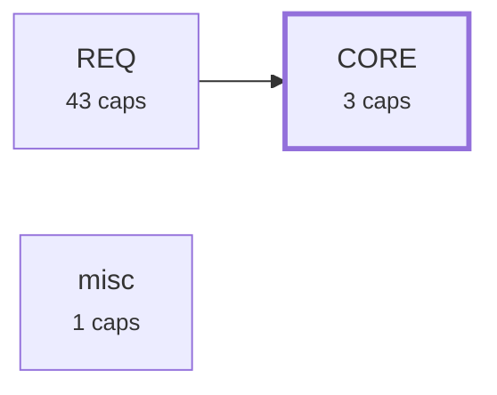

# Requirement Map

## System Map

_Capabilities grouped by area; thick border = bus; arrows = `depends_on`. Edges into the bus/hubs are hidden (the Dependency Map shows area-level coupling)._

```mermaid
graph LR
  subgraph sg_CORE["CORE"]
    CORE_DRIFT_003["Contract hashing & lock<br><small>CORE-DRIFT-003</small>"]
    CORE_PARSE_001["Requirement reading<br><small>CORE-PARSE-001</small>"]
    CORE_SCAN_002["Member discovery<br><small>CORE-SCAN-002</small>"]
  end
  subgraph sg_REQ["REQ"]
    REQ_ACVERIFY_019["Per-criterion test coverage<br><small>REQ-ACVERIFY-019</small>"]
    REQ_CANDIDATES_009["Capability candidates (extraction plan)<br><small>REQ-CANDIDATES-009</small>"]
    REQ_CHECK_006["The gate<br><small>REQ-CHECK-006</small>"]
    REQ_CMDREGISTRY_033["CLI command registry + generated integration artifacts<br><small>REQ-CMDREGISTRY-033</small>"]
    REQ_COVERAGE_029["Untagged-code coverage signal<br><small>REQ-COVERAGE-029</small>"]
    REQ_DOCBUNDLE_026["Untagged doc-bundle warning<br><small>REQ-DOCBUNDLE-026</small>"]
    REQ_DRIFTIMPACT_035["Drift blast-radius: name dependents<br><small>REQ-DRIFTIMPACT-035</small>"]
    REQ_EXCALIDRAW_030["Excalidraw scene builder — core API<br><small>REQ-EXCALIDRAW-030</small>"]
    REQ_EXCALIDRAW_031["Excalidraw quality gates<br><small>REQ-EXCALIDRAW-031</small>"]
    REQ_EXCALIDRAW_032["Excalidraw builder CLI verbs<br><small>REQ-EXCALIDRAW-032</small>"]
    REQ_EXTRACT_008["Legacy extraction<br><small>REQ-EXTRACT-008</small>"]
    REQ_FINDINGS_010["Open-findings report<br><small>REQ-FINDINGS-010</small>"]
    REQ_HEALTH_017["Corpus health snapshot<br><small>REQ-HEALTH-017</small>"]
    REQ_INIT_012["First-use bootstrap<br><small>REQ-INIT-012</small>"]
    REQ_LINT_014["Requirement readability linter<br><small>REQ-LINT-014</small>"]
    REQ_LINTCHECKS_025["Readability & scope checks<br><small>REQ-LINTCHECKS-025</small>"]
    REQ_MAP_007["Requirement map (Mermaid MD + JSON)<br><small>REQ-MAP-007</small>"]
    REQ_MEMBERDRIFT_027["Reverse-direction member drift<br><small>REQ-MEMBERDRIFT-027</small>"]
    REQ_NEW_004["Scaffold a requirement<br><small>REQ-NEW-004</small>"]
    REQ_NEXT_013["What-should-I-do-next report<br><small>REQ-NEXT-013</small>"]
    REQ_ORPHANCODE_034["Orphan-code warning<br><small>REQ-ORPHANCODE-034</small>"]
    REQ_PAGES_021["Publish & gate the GitHub Pages map copy<br><small>REQ-PAGES-021</small>"]
    REQ_PROMOTE_011["confirm<br><small>REQ-PROMOTE-011</small>"]
    REQ_PROMOTE_TODO_001["Promote a TODO item into a requirement draft<br><small>REQ-PROMOTE-TODO-001</small>"]
    REQ_PROSE_024["Prose capability classification & drafting<br><small>REQ-PROSE-024</small>"]
    REQ_PYFLOOR_040["Declared Python support floor<br><small>REQ-PYFLOOR-040</small>"]
    REQ_REGISTRYLAG_035["Registry-lag signal — commits since the requirements dir was last touched<br><small>REQ-REGISTRYLAG-035</small>"]
    REQ_REPRO_041["Committed build artifacts stay re-derivable<br><small>REQ-REPRO-041</small>"]
    REQ_REVIEW_022["AI requirement-quality review (deterministic plan + advisory pass)<br><small>REQ-REVIEW-022</small>"]
    REQ_ROADMAP_038["Roadmap coherence signals<br><small>REQ-ROADMAP-038</small>"]
    REQ_SCAN_005["List members per capability<br><small>REQ-SCAN-005</small>"]
    REQ_SCANCACHE_023["Opt-in scan cache<br><small>REQ-SCANCACHE-023</small>"]
    REQ_SEARCH_036["Free-text requirement search<br><small>REQ-SEARCH-036</small>"]
    REQ_SELFGATE_039["This repo's own gate wiring<br><small>REQ-SELFGATE-039</small>"]
    REQ_SHOW_015["Single-requirement dossier<br><small>REQ-SHOW-015</small>"]
    REQ_SIMILAR_016["Duplicate-capability detector<br><small>REQ-SIMILAR-016</small>"]
    REQ_SITE_026["Generate & maintain a project presentation page<br><small>REQ-SITE-026</small>"]
    REQ_STALEENGINE_043["Stale vendored engine, reported in CI<br><small>REQ-STALEENGINE-043</small>"]
    REQ_TESTLINK_018["Test-link integrity check<br><small>REQ-TESTLINK-018</small>"]
    REQ_TRACE_020["Upstream traceability<br><small>REQ-TRACE-020</small>"]
    REQ_TRACKED_042["Untracked members reported<br><small>REQ-TRACKED-042</small>"]
    REQ_VIEWER_007["Self-contained HTML map viewer<br><small>REQ-VIEWER-007</small>"]
    REQ_VLEVEL_037["Verification levels<br><small>REQ-VLEVEL-037</small>"]
  end
  subgraph sg_misc["misc"]
    NEED_SSOT_001["Stakeholder need — specs and code stay in sync<br><small>NEED-SSOT-001</small>"]
  end
  REQ_COVERAGE_029 --> REQ_NEXT_013
  REQ_EXCALIDRAW_031 --> REQ_EXCALIDRAW_030
  REQ_EXCALIDRAW_032 --> REQ_EXCALIDRAW_030
  REQ_INIT_012 --> REQ_EXTRACT_008
  REQ_INIT_012 --> REQ_MAP_007
  REQ_LINTCHECKS_025 --> REQ_LINT_014
  REQ_NEXT_013 --> REQ_MAP_007
  REQ_PAGES_021 --> REQ_MAP_007
  REQ_PROMOTE_TODO_001 --> REQ_NEW_004
  REQ_PROSE_024 --> REQ_EXTRACT_008
  REQ_REGISTRYLAG_035 --> REQ_HEALTH_017
  REQ_REPRO_041 --> REQ_SELFGATE_039
  REQ_ROADMAP_038 --> REQ_HEALTH_017
  REQ_SEARCH_036 --> REQ_SIMILAR_016
  REQ_SITE_026 --> REQ_MAP_007
  REQ_SITE_026 --> REQ_VIEWER_007
  REQ_SITE_026 --> REQ_PAGES_021
  REQ_STALEENGINE_043 --> REQ_SELFGATE_039
  REQ_VIEWER_007 --> REQ_MAP_007
  style CORE_DRIFT_003 stroke-width:3px
  style CORE_PARSE_001 stroke-width:3px
  style CORE_SCAN_002 stroke-width:3px
```



## Requirement-to-Code

_Each requirement → its code; arrow label = role (`implements` / `tested-by`). Red = confirmed but no code linked (a gap); grey = baseline/draft, not linked yet (expected)._

```mermaid
graph LR
  CORE_DRIFT_003["Contract hashing & lock<br><small>CORE-DRIFT-003</small>"]
  f_docs_full_architecture_html_4["docs/full_architecture.html:4"]
  CORE_DRIFT_003 -->|generated-from| f_docs_full_architecture_html_4
  f_plugin_scripts_reqmap_py_1488_1532["plugin/scripts/reqmap.py:1488-1532"]
  CORE_DRIFT_003 -->|implements| f_plugin_scripts_reqmap_py_1488_1532
  f_plugin_scripts_test_reqmap_py_153_5117["plugin/scripts/test_reqmap.py:153-5117"]
  CORE_DRIFT_003 -->|tested-by| f_plugin_scripts_test_reqmap_py_153_5117
  CORE_PARSE_001["Requirement reading<br><small>CORE-PARSE-001</small>"]
  f_docs_full_architecture_html_4["docs/full_architecture.html:4"]
  CORE_PARSE_001 -->|generated-from| f_docs_full_architecture_html_4
  f_plugin_scripts_reqmap_py_719_790["plugin/scripts/reqmap.py:719-790"]
  CORE_PARSE_001 -->|implements| f_plugin_scripts_reqmap_py_719_790
  f_plugin_scripts_test_reqmap_py_50_5070["plugin/scripts/test_reqmap.py:50-5070"]
  CORE_PARSE_001 -->|tested-by| f_plugin_scripts_test_reqmap_py_50_5070
  CORE_SCAN_002["Member discovery<br><small>CORE-SCAN-002</small>"]
  f_docs_full_architecture_html_4["docs/full_architecture.html:4"]
  CORE_SCAN_002 -->|generated-from| f_docs_full_architecture_html_4
  f_plugin_scripts_reqmap_py_112_1091["plugin/scripts/reqmap.py:112-1091"]
  CORE_SCAN_002 -->|implements| f_plugin_scripts_reqmap_py_112_1091
  f_plugin_scripts_test_reqmap_py_339_4648["plugin/scripts/test_reqmap.py:339-4648"]
  CORE_SCAN_002 -->|tested-by| f_plugin_scripts_test_reqmap_py_339_4648
  NEED_SSOT_001["Stakeholder need — specs and code stay in sync<br><small>NEED-SSOT-001</small>"]
  style NEED_SSOT_001 fill:#fee,stroke:#c66
  REQ_ACVERIFY_019["Per-criterion test coverage<br><small>REQ-ACVERIFY-019</small>"]
  f_plugin_scripts_reqmap_py_1036_1890["plugin/scripts/reqmap.py:1036-1890"]
  REQ_ACVERIFY_019 -->|implements| f_plugin_scripts_reqmap_py_1036_1890
  f_plugin_scripts_test_reqmap_py_3436_5101["plugin/scripts/test_reqmap.py:3436-5101"]
  REQ_ACVERIFY_019 -->|tested-by| f_plugin_scripts_test_reqmap_py_3436_5101
  REQ_CANDIDATES_009["Capability candidates (extraction plan)<br><small>REQ-CANDIDATES-009</small>"]
  f_plugin_scripts_reqmap_py_2504_2652["plugin/scripts/reqmap.py:2504-2652"]
  REQ_CANDIDATES_009 -->|implements| f_plugin_scripts_reqmap_py_2504_2652
  f_plugin_scripts_test_reqmap_py_1180_2650["plugin/scripts/test_reqmap.py:1180-2650"]
  REQ_CANDIDATES_009 -->|tested-by| f_plugin_scripts_test_reqmap_py_1180_2650
  REQ_CHECK_006["The gate<br><small>REQ-CHECK-006</small>"]
  f_docs_full_architecture_html_4["docs/full_architecture.html:4"]
  REQ_CHECK_006 -->|generated-from| f_docs_full_architecture_html_4
  f_plugin_scripts_reqmap_py_1475_5023["plugin/scripts/reqmap.py:1475-5023"]
  REQ_CHECK_006 -->|implements| f_plugin_scripts_reqmap_py_1475_5023
  f_plugin_scripts_test_reqmap_py_143_5279["plugin/scripts/test_reqmap.py:143-5279"]
  REQ_CHECK_006 -->|tested-by| f_plugin_scripts_test_reqmap_py_143_5279
  REQ_CMDREGISTRY_033["CLI command registry + generated integration artifacts<br><small>REQ-CMDREGISTRY-033</small>"]
  f_plugin_scripts_reqmap_py_193_2063["plugin/scripts/reqmap.py:193-2063"]
  REQ_CMDREGISTRY_033 -->|implements| f_plugin_scripts_reqmap_py_193_2063
  f_plugin_scripts_test_reqmap_py_4999["plugin/scripts/test_reqmap.py:4999"]
  REQ_CMDREGISTRY_033 -->|tested-by| f_plugin_scripts_test_reqmap_py_4999
  REQ_COVERAGE_029["Untagged-code coverage signal<br><small>REQ-COVERAGE-029</small>"]
  f_plugin_scripts_reqmap_py_3871["plugin/scripts/reqmap.py:3871"]
  REQ_COVERAGE_029 -->|implements| f_plugin_scripts_reqmap_py_3871
  f_plugin_scripts_test_reqmap_py_3167["plugin/scripts/test_reqmap.py:3167"]
  REQ_COVERAGE_029 -->|tested-by| f_plugin_scripts_test_reqmap_py_3167
  REQ_DOCBUNDLE_026["Untagged doc-bundle warning<br><small>REQ-DOCBUNDLE-026</small>"]
  f_plugin_scripts_reqmap_py_1257["plugin/scripts/reqmap.py:1257"]
  REQ_DOCBUNDLE_026 -->|implements| f_plugin_scripts_reqmap_py_1257
  f_plugin_scripts_test_reqmap_py_584["plugin/scripts/test_reqmap.py:584"]
  REQ_DOCBUNDLE_026 -->|tested-by| f_plugin_scripts_test_reqmap_py_584
  REQ_DRIFTIMPACT_035["Drift blast-radius: name dependents<br><small>REQ-DRIFTIMPACT-035</small>"]
  f_plugin_scripts_reqmap_py_1948["plugin/scripts/reqmap.py:1948"]
  REQ_DRIFTIMPACT_035 -->|implements| f_plugin_scripts_reqmap_py_1948
  f_plugin_scripts_test_reqmap_py_799["plugin/scripts/test_reqmap.py:799"]
  REQ_DRIFTIMPACT_035 -->|tested-by| f_plugin_scripts_test_reqmap_py_799
  REQ_EXCALIDRAW_030["Excalidraw scene builder — core API<br><small>REQ-EXCALIDRAW-030</small>"]
  f_plugin_skills_excalidraw_diagram_scripts_excalidraw_builder_py_2["plugin/skills/excalidraw-diagram/scripts/excalidraw_builder.py:2"]
  REQ_EXCALIDRAW_030 -->|implements| f_plugin_skills_excalidraw_diagram_scripts_excalidraw_builder_py_2
  f_plugin_skills_excalidraw_diagram_scripts_test_excalidraw_py_2["plugin/skills/excalidraw-diagram/scripts/test_excalidraw.py:2"]
  REQ_EXCALIDRAW_030 -->|tested-by| f_plugin_skills_excalidraw_diagram_scripts_test_excalidraw_py_2
  REQ_EXCALIDRAW_031["Excalidraw quality gates<br><small>REQ-EXCALIDRAW-031</small>"]
  f_plugin_skills_excalidraw_diagram_scripts_excalidraw_builder_py_3["plugin/skills/excalidraw-diagram/scripts/excalidraw_builder.py:3"]
  REQ_EXCALIDRAW_031 -->|implements| f_plugin_skills_excalidraw_diagram_scripts_excalidraw_builder_py_3
  f_plugin_skills_excalidraw_diagram_scripts_test_excalidraw_py_3["plugin/skills/excalidraw-diagram/scripts/test_excalidraw.py:3"]
  REQ_EXCALIDRAW_031 -->|tested-by| f_plugin_skills_excalidraw_diagram_scripts_test_excalidraw_py_3
  REQ_EXCALIDRAW_032["Excalidraw builder CLI verbs<br><small>REQ-EXCALIDRAW-032</small>"]
  f_plugin_skills_excalidraw_diagram_scripts_excalidraw_builder_py_4["plugin/skills/excalidraw-diagram/scripts/excalidraw_builder.py:4"]
  REQ_EXCALIDRAW_032 -->|implements| f_plugin_skills_excalidraw_diagram_scripts_excalidraw_builder_py_4
  f_plugin_skills_excalidraw_diagram_scripts_test_excalidraw_py_4["plugin/skills/excalidraw-diagram/scripts/test_excalidraw.py:4"]
  REQ_EXCALIDRAW_032 -->|tested-by| f_plugin_skills_excalidraw_diagram_scripts_test_excalidraw_py_4
  REQ_EXTRACT_008["Legacy extraction<br><small>REQ-EXTRACT-008</small>"]
  f_plugin_scripts_reqmap_py_2335_2487["plugin/scripts/reqmap.py:2335-2487"]
  REQ_EXTRACT_008 -->|implements| f_plugin_scripts_reqmap_py_2335_2487
  f_plugin_scripts_test_reqmap_py_1023_1038["plugin/scripts/test_reqmap.py:1023-1038"]
  REQ_EXTRACT_008 -->|tested-by| f_plugin_scripts_test_reqmap_py_1023_1038
  REQ_FINDINGS_010["Open-findings report<br><small>REQ-FINDINGS-010</small>"]
  f_plugin_scripts_reqmap_py_2773_2860["plugin/scripts/reqmap.py:2773-2860"]
  REQ_FINDINGS_010 -->|implements| f_plugin_scripts_reqmap_py_2773_2860
  f_plugin_scripts_test_reqmap_py_1253_1795["plugin/scripts/test_reqmap.py:1253-1795"]
  REQ_FINDINGS_010 -->|tested-by| f_plugin_scripts_test_reqmap_py_1253_1795
  REQ_HEALTH_017["Corpus health snapshot<br><small>REQ-HEALTH-017</small>"]
  f_plugin_scripts_reqmap_py_3809["plugin/scripts/reqmap.py:3809"]
  REQ_HEALTH_017 -->|implements| f_plugin_scripts_reqmap_py_3809
  f_plugin_scripts_test_reqmap_py_3124_3286["plugin/scripts/test_reqmap.py:3124-3286"]
  REQ_HEALTH_017 -->|tested-by| f_plugin_scripts_test_reqmap_py_3124_3286
  REQ_INIT_012["First-use bootstrap<br><small>REQ-INIT-012</small>"]
  f_plugin_scripts_reqmap_py_4000_4029["plugin/scripts/reqmap.py:4000-4029"]
  REQ_INIT_012 -->|implements| f_plugin_scripts_reqmap_py_4000_4029
  f_plugin_scripts_test_reqmap_py_2410_5231["plugin/scripts/test_reqmap.py:2410-5231"]
  REQ_INIT_012 -->|tested-by| f_plugin_scripts_test_reqmap_py_2410_5231
  REQ_LINT_014["Requirement readability linter<br><small>REQ-LINT-014</small>"]
  f_plugin_scripts_reqmap_py_3216_3422["plugin/scripts/reqmap.py:3216-3422"]
  REQ_LINT_014 -->|implements| f_plugin_scripts_reqmap_py_3216_3422
  f_plugin_scripts_test_reqmap_py_2678["plugin/scripts/test_reqmap.py:2678"]
  REQ_LINT_014 -->|tested-by| f_plugin_scripts_test_reqmap_py_2678
  REQ_LINTCHECKS_025["Readability & scope checks<br><small>REQ-LINTCHECKS-025</small>"]
  f_plugin_scripts_reqmap_py_3245_3283["plugin/scripts/reqmap.py:3245-3283"]
  REQ_LINTCHECKS_025 -->|implements| f_plugin_scripts_reqmap_py_3245_3283
  f_plugin_scripts_test_reqmap_py_2662_2678["plugin/scripts/test_reqmap.py:2662-2678"]
  REQ_LINTCHECKS_025 -->|tested-by| f_plugin_scripts_test_reqmap_py_2662_2678
  REQ_MAP_007["Requirement map (Mermaid MD + JSON)<br><small>REQ-MAP-007</small>"]
  f_docs_full_architecture_html_4["docs/full_architecture.html:4"]
  REQ_MAP_007 -->|generated-from| f_docs_full_architecture_html_4
  f_plugin_scripts_reqmap_py_2900_5112["plugin/scripts/reqmap.py:2900-5112"]
  REQ_MAP_007 -->|implements| f_plugin_scripts_reqmap_py_2900_5112
  f_plugin_scripts_test_reqmap_py_880_5231["plugin/scripts/test_reqmap.py:880-5231"]
  REQ_MAP_007 -->|tested-by| f_plugin_scripts_test_reqmap_py_880_5231
  REQ_MEMBERDRIFT_027["Reverse-direction member drift<br><small>REQ-MEMBERDRIFT-027</small>"]
  f_plugin_scripts_reqmap_py_1548_1635["plugin/scripts/reqmap.py:1548-1635"]
  REQ_MEMBERDRIFT_027 -->|implements| f_plugin_scripts_reqmap_py_1548_1635
  f_plugin_scripts_test_reqmap_py_639["plugin/scripts/test_reqmap.py:639"]
  REQ_MEMBERDRIFT_027 -->|tested-by| f_plugin_scripts_test_reqmap_py_639
  REQ_NEW_004["Scaffold a requirement<br><small>REQ-NEW-004</small>"]
  f_plugin_scripts_reqmap_py_2166["plugin/scripts/reqmap.py:2166"]
  REQ_NEW_004 -->|implements| f_plugin_scripts_reqmap_py_2166
  f_plugin_scripts_test_reqmap_py_1102["plugin/scripts/test_reqmap.py:1102"]
  REQ_NEW_004 -->|tested-by| f_plugin_scripts_test_reqmap_py_1102
  REQ_NEXT_013["What-should-I-do-next report<br><small>REQ-NEXT-013</small>"]
  f_plugin_scripts_reqmap_py_1288_3092["plugin/scripts/reqmap.py:1288-3092"]
  REQ_NEXT_013 -->|implements| f_plugin_scripts_reqmap_py_1288_3092
  f_plugin_scripts_test_reqmap_py_2284_5181["plugin/scripts/test_reqmap.py:2284-5181"]
  REQ_NEXT_013 -->|tested-by| f_plugin_scripts_test_reqmap_py_2284_5181
  REQ_ORPHANCODE_034["Orphan-code warning<br><small>REQ-ORPHANCODE-034</small>"]
  f_plugin_scripts_reqmap_py_1315_2003["plugin/scripts/reqmap.py:1315-2003"]
  REQ_ORPHANCODE_034 -->|implements| f_plugin_scripts_reqmap_py_1315_2003
  f_plugin_scripts_test_reqmap_py_739["plugin/scripts/test_reqmap.py:739"]
  REQ_ORPHANCODE_034 -->|tested-by| f_plugin_scripts_test_reqmap_py_739
  REQ_PAGES_021["Publish & gate the GitHub Pages map copy<br><small>REQ-PAGES-021</small>"]
  f_plugin_scripts_reqmap_py_3051_5128["plugin/scripts/reqmap.py:3051-5128"]
  REQ_PAGES_021 -->|implements| f_plugin_scripts_reqmap_py_3051_5128
  f_plugin_scripts_test_reqmap_py_1442_2121["plugin/scripts/test_reqmap.py:1442-2121"]
  REQ_PAGES_021 -->|tested-by| f_plugin_scripts_test_reqmap_py_1442_2121
  REQ_PROMOTE_011["confirm<br><small>REQ-PROMOTE-011</small>"]
  f_plugin_scripts_reqmap_py_2275_2301["plugin/scripts/reqmap.py:2275-2301"]
  REQ_PROMOTE_011 -->|implements| f_plugin_scripts_reqmap_py_2275_2301
  f_plugin_scripts_test_reqmap_py_2224_5181["plugin/scripts/test_reqmap.py:2224-5181"]
  REQ_PROMOTE_011 -->|tested-by| f_plugin_scripts_test_reqmap_py_2224_5181
  REQ_PROMOTE_TODO_001["Promote a TODO item into a requirement draft<br><small>REQ-PROMOTE-TODO-001</small>"]
  f_plugin_scripts_reqmap_py_2187_2243["plugin/scripts/reqmap.py:2187-2243"]
  REQ_PROMOTE_TODO_001 -->|implements| f_plugin_scripts_reqmap_py_2187_2243
  f_plugin_scripts_test_reqmap_py_3629_5181["plugin/scripts/test_reqmap.py:3629-5181"]
  REQ_PROMOTE_TODO_001 -->|tested-by| f_plugin_scripts_test_reqmap_py_3629_5181
  REQ_PROSE_024["Prose capability classification & drafting<br><small>REQ-PROSE-024</small>"]
  f_plugin_scripts_reqmap_py_2343_2396["plugin/scripts/reqmap.py:2343-2396"]
  REQ_PROSE_024 -->|implements| f_plugin_scripts_reqmap_py_2343_2396
  f_plugin_scripts_test_reqmap_py_837_1023["plugin/scripts/test_reqmap.py:837-1023"]
  REQ_PROSE_024 -->|tested-by| f_plugin_scripts_test_reqmap_py_837_1023
  REQ_PYFLOOR_040["Declared Python support floor<br><small>REQ-PYFLOOR-040</small>"]
  f__github_workflows_ci_yml_3[".github/workflows/ci.yml:3"]
  REQ_PYFLOOR_040 -->|implements| f__github_workflows_ci_yml_3
  f_plugin_scripts_reqmap_py_167["plugin/scripts/reqmap.py:167"]
  REQ_PYFLOOR_040 -->|implements| f_plugin_scripts_reqmap_py_167
  f_plugin_scripts_test_reqmap_py_4818["plugin/scripts/test_reqmap.py:4818"]
  REQ_PYFLOOR_040 -->|tested-by| f_plugin_scripts_test_reqmap_py_4818
  REQ_REGISTRYLAG_035["Registry-lag signal — commits since the requirements dir was last touched<br><small>REQ-REGISTRYLAG-035</small>"]
  f_plugin_scripts_reqmap_py_3783_3877["plugin/scripts/reqmap.py:3783-3877"]
  REQ_REGISTRYLAG_035 -->|implements| f_plugin_scripts_reqmap_py_3783_3877
  f_plugin_scripts_test_reqmap_py_3192["plugin/scripts/test_reqmap.py:3192"]
  REQ_REGISTRYLAG_035 -->|tested-by| f_plugin_scripts_test_reqmap_py_3192
  REQ_REPRO_041["Committed build artifacts stay re-derivable<br><small>REQ-REPRO-041</small>"]
  f__github_workflows_ci_yml_4[".github/workflows/ci.yml:4"]
  REQ_REPRO_041 -->|implements| f__github_workflows_ci_yml_4
  REQ_REVIEW_022["AI requirement-quality review (deterministic plan + advisory pass)<br><small>REQ-REVIEW-022</small>"]
  f_plugin_scripts_reqmap_py_5286["plugin/scripts/reqmap.py:5286"]
  REQ_REVIEW_022 -->|implements| f_plugin_scripts_reqmap_py_5286
  f_plugin_scripts_test_reqmap_py_3696["plugin/scripts/test_reqmap.py:3696"]
  REQ_REVIEW_022 -->|tested-by| f_plugin_scripts_test_reqmap_py_3696
  f_plugin_skills_requirement_quality_review_SKILL_md_6["plugin/skills/requirement-quality-review/SKILL.md:6"]
  REQ_REVIEW_022 -->|implements| f_plugin_skills_requirement_quality_review_SKILL_md_6
  f_plugin_skills_requirement_quality_review_SKILL_universal_md_9["plugin/skills/requirement-quality-review/SKILL.universal.md:9"]
  REQ_REVIEW_022 -->|implements| f_plugin_skills_requirement_quality_review_SKILL_universal_md_9
  REQ_ROADMAP_038["Roadmap coherence signals<br><small>REQ-ROADMAP-038</small>"]
  f_plugin_scripts_reqmap_py_2956_3883["plugin/scripts/reqmap.py:2956-3883"]
  REQ_ROADMAP_038 -->|implements| f_plugin_scripts_reqmap_py_2956_3883
  f_plugin_scripts_test_reqmap_py_5302["plugin/scripts/test_reqmap.py:5302"]
  REQ_ROADMAP_038 -->|tested-by| f_plugin_scripts_test_reqmap_py_5302
  REQ_SCAN_005["List members per capability<br><small>REQ-SCAN-005</small>"]
  f_plugin_scripts_reqmap_py_1672["plugin/scripts/reqmap.py:1672"]
  REQ_SCAN_005 -->|implements| f_plugin_scripts_reqmap_py_1672
  f_plugin_scripts_test_reqmap_py_1166["plugin/scripts/test_reqmap.py:1166"]
  REQ_SCAN_005 -->|tested-by| f_plugin_scripts_test_reqmap_py_1166
  REQ_SCANCACHE_023["Opt-in scan cache<br><small>REQ-SCANCACHE-023</small>"]
  f_plugin_scripts_reqmap_py_991_1005["plugin/scripts/reqmap.py:991-1005"]
  REQ_SCANCACHE_023 -->|implements| f_plugin_scripts_reqmap_py_991_1005
  f_plugin_scripts_test_reqmap_py_3757["plugin/scripts/test_reqmap.py:3757"]
  REQ_SCANCACHE_023 -->|tested-by| f_plugin_scripts_test_reqmap_py_3757
  REQ_SEARCH_036["Free-text requirement search<br><small>REQ-SEARCH-036</small>"]
  f_plugin_scripts_reqmap_py_3662["plugin/scripts/reqmap.py:3662"]
  REQ_SEARCH_036 -->|implements| f_plugin_scripts_reqmap_py_3662
  f_plugin_scripts_test_reqmap_py_3044["plugin/scripts/test_reqmap.py:3044"]
  REQ_SEARCH_036 -->|tested-by| f_plugin_scripts_test_reqmap_py_3044
  REQ_SELFGATE_039["This repo's own gate wiring<br><small>REQ-SELFGATE-039</small>"]
  f_sync_reqmap_sh_2["sync_reqmap.sh:2"]
  REQ_SELFGATE_039 -->|implements| f_sync_reqmap_sh_2
  f__githooks_pre_commit_2[".githooks/pre-commit:2"]
  REQ_SELFGATE_039 -->|implements| f__githooks_pre_commit_2
  f__githooks_pre_push_2[".githooks/pre-push:2"]
  REQ_SELFGATE_039 -->|implements| f__githooks_pre_push_2
  f__github_workflows_ci_yml_2[".github/workflows/ci.yml:2"]
  REQ_SELFGATE_039 -->|implements| f__github_workflows_ci_yml_2
  f_check_action_yml_2["check/action.yml:2"]
  REQ_SELFGATE_039 -->|implements| f_check_action_yml_2
  f_scripts_check_versions_py_2["scripts/check_versions.py:2"]
  REQ_SELFGATE_039 -->|implements| f_scripts_check_versions_py_2
  f_scripts_test_check_versions_py_91["scripts/test_check_versions.py:91"]
  REQ_SELFGATE_039 -->|tested-by| f_scripts_test_check_versions_py_91
  REQ_SHOW_015["Single-requirement dossier<br><small>REQ-SHOW-015</small>"]
  f_plugin_scripts_reqmap_py_3464["plugin/scripts/reqmap.py:3464"]
  REQ_SHOW_015 -->|implements| f_plugin_scripts_reqmap_py_3464
  f_plugin_scripts_test_reqmap_py_2900["plugin/scripts/test_reqmap.py:2900"]
  REQ_SHOW_015 -->|tested-by| f_plugin_scripts_test_reqmap_py_2900
  REQ_SIMILAR_016["Duplicate-capability detector<br><small>REQ-SIMILAR-016</small>"]
  f_plugin_scripts_reqmap_py_3553_3614["plugin/scripts/reqmap.py:3553-3614"]
  REQ_SIMILAR_016 -->|implements| f_plugin_scripts_reqmap_py_3553_3614
  f_plugin_scripts_test_reqmap_py_2982["plugin/scripts/test_reqmap.py:2982"]
  REQ_SIMILAR_016 -->|tested-by| f_plugin_scripts_test_reqmap_py_2982
  REQ_SITE_026["Generate & maintain a project presentation page<br><small>REQ-SITE-026</small>"]
  f_plugin_scripts_reqmap_py_4055_5520["plugin/scripts/reqmap.py:4055-5520"]
  REQ_SITE_026 -->|implements| f_plugin_scripts_reqmap_py_4055_5520
  f_plugin_scripts_test_reqmap_py_4458["plugin/scripts/test_reqmap.py:4458"]
  REQ_SITE_026 -->|tested-by| f_plugin_scripts_test_reqmap_py_4458
  REQ_STALEENGINE_043["Stale vendored engine, reported in CI<br><small>REQ-STALEENGINE-043</small>"]
  f_check_action_yml_3["check/action.yml:3"]
  REQ_STALEENGINE_043 -->|implements| f_check_action_yml_3
  f_check_engine_staleness_py_2["check/engine_staleness.py:2"]
  REQ_STALEENGINE_043 -->|implements| f_check_engine_staleness_py_2
  f_scripts_test_engine_staleness_py_49["scripts/test_engine_staleness.py:49"]
  REQ_STALEENGINE_043 -->|tested-by| f_scripts_test_engine_staleness_py_49
  REQ_TESTLINK_018["Test-link integrity check<br><small>REQ-TESTLINK-018</small>"]
  f_plugin_scripts_reqmap_py_1744_1882["plugin/scripts/reqmap.py:1744-1882"]
  REQ_TESTLINK_018 -->|implements| f_plugin_scripts_reqmap_py_1744_1882
  f_plugin_scripts_test_reqmap_py_3360["plugin/scripts/test_reqmap.py:3360"]
  REQ_TESTLINK_018 -->|tested-by| f_plugin_scripts_test_reqmap_py_3360
  REQ_TRACE_020["Upstream traceability<br><small>REQ-TRACE-020</small>"]
  f_plugin_scripts_reqmap_py_1838_3499["plugin/scripts/reqmap.py:1838-3499"]
  REQ_TRACE_020 -->|implements| f_plugin_scripts_reqmap_py_1838_3499
  f_plugin_scripts_test_reqmap_py_3506["plugin/scripts/test_reqmap.py:3506"]
  REQ_TRACE_020 -->|tested-by| f_plugin_scripts_test_reqmap_py_3506
  REQ_TRACKED_042["Untracked members reported<br><small>REQ-TRACKED-042</small>"]
  f_plugin_scripts_reqmap_py_1221_1992["plugin/scripts/reqmap.py:1221-1992"]
  REQ_TRACKED_042 -->|implements| f_plugin_scripts_reqmap_py_1221_1992
  f_plugin_scripts_test_reqmap_py_4706["plugin/scripts/test_reqmap.py:4706"]
  REQ_TRACKED_042 -->|tested-by| f_plugin_scripts_test_reqmap_py_4706
  REQ_VIEWER_007["Self-contained HTML map viewer<br><small>REQ-VIEWER-007</small>"]
  f_docs_full_architecture_html_4["docs/full_architecture.html:4"]
  REQ_VIEWER_007 -->|generated-from| f_docs_full_architecture_html_4
  f_plugin_scripts_reqmap_py_1193_5270["plugin/scripts/reqmap.py:1193-5270"]
  REQ_VIEWER_007 -->|implements| f_plugin_scripts_reqmap_py_1193_5270
  f_plugin_scripts_test_reqmap_py_1415_5345["plugin/scripts/test_reqmap.py:1415-5345"]
  REQ_VIEWER_007 -->|tested-by| f_plugin_scripts_test_reqmap_py_1415_5345
  REQ_VLEVEL_037["Verification levels<br><small>REQ-VLEVEL-037</small>"]
  f_plugin_scripts_reqmap_py_1387_3464["plugin/scripts/reqmap.py:1387-3464"]
  REQ_VLEVEL_037 -->|implements| f_plugin_scripts_reqmap_py_1387_3464
  f_plugin_scripts_test_reqmap_py_271_2972["plugin/scripts/test_reqmap.py:271-2972"]
  REQ_VLEVEL_037 -->|tested-by| f_plugin_scripts_test_reqmap_py_271_2972
```

## Dependency Map

_Area-level coupling: one box per area (N caps), arrow A->B = some capability in A depends on one in B. The System Map has the per-capability detail._



## Risk & Unknowns

_Requirements needing attention: red = unimplemented (confirmed, no code); orange = unreviewed (promote after review); yellow = untested (implemented but no tested-by — set `test_exempt` to silence), or unverified-intent (open verify-intent question)._


