# Requirement Map

## System Map

_Capabilities grouped by area; thick border = bus; arrows = `depends_on`. Edges into the bus/hubs are hidden (the Dependency Map shows area-level coupling)._

```mermaid
graph LR
  subgraph sg_CORE["CORE"]
    CORE_DRIFT_003["Contract hashing & lock<br><small>CORE-DRIFT-003</small>"]
    CORE_PARSE_001["Requirement reading<br><small>CORE-PARSE-001</small>"]
    CORE_SCAN_002["Member discovery<br><small>CORE-SCAN-002</small>"]
  end
  subgraph sg_REQ["REQ"]
    REQ_ACVERIFY_019["Per-criterion test coverage<br><small>REQ-ACVERIFY-019</small>"]
    REQ_CANDIDATES_009["Capability candidates (extraction plan)<br><small>REQ-CANDIDATES-009</small>"]
    REQ_CHECK_006["The gate<br><small>REQ-CHECK-006</small>"]
    REQ_CMDREGISTRY_033["CLI command registry + generated integration artifacts<br><small>REQ-CMDREGISTRY-033</small>"]
    REQ_COVERAGE_029["Untagged-code coverage signal<br><small>REQ-COVERAGE-029</small>"]
    REQ_DOCBUNDLE_026["Untagged doc-bundle warning<br><small>REQ-DOCBUNDLE-026</small>"]
    REQ_DRIFTIMPACT_035["Drift blast-radius: name dependents<br><small>REQ-DRIFTIMPACT-035</small>"]
    REQ_EXCALIDRAW_030["Excalidraw scene builder — core API<br><small>REQ-EXCALIDRAW-030</small>"]
    REQ_EXCALIDRAW_031["Excalidraw quality gates<br><small>REQ-EXCALIDRAW-031</small>"]
    REQ_EXCALIDRAW_032["Excalidraw builder CLI verbs<br><small>REQ-EXCALIDRAW-032</small>"]
    REQ_EXTRACT_008["Legacy extraction<br><small>REQ-EXTRACT-008</small>"]
    REQ_FINDINGS_010["Open-findings report<br><small>REQ-FINDINGS-010</small>"]
    REQ_HEALTH_017["Corpus health snapshot<br><small>REQ-HEALTH-017</small>"]
    REQ_INIT_012["First-use bootstrap<br><small>REQ-INIT-012</small>"]
    REQ_LINT_014["Requirement readability linter<br><small>REQ-LINT-014</small>"]
    REQ_LINTCHECKS_025["Readability & scope checks<br><small>REQ-LINTCHECKS-025</small>"]
    REQ_MAP_007["Requirement map (Mermaid MD + JSON)<br><small>REQ-MAP-007</small>"]
    REQ_MEMBERDRIFT_027["Reverse-direction member drift<br><small>REQ-MEMBERDRIFT-027</small>"]
    REQ_NEW_004["Scaffold a requirement<br><small>REQ-NEW-004</small>"]
    REQ_NEXT_013["What-should-I-do-next report<br><small>REQ-NEXT-013</small>"]
    REQ_ORPHANCODE_034["Orphan-code warning<br><small>REQ-ORPHANCODE-034</small>"]
    REQ_PAGES_021["Publish & gate the GitHub Pages map copy<br><small>REQ-PAGES-021</small>"]
    REQ_PIPE_046["A closed output pipe ends a command quietly<br><small>REQ-PIPE-046</small>"]
    REQ_PROMOTE_011["confirm<br><small>REQ-PROMOTE-011</small>"]
    REQ_PROMOTE_TODO_001["Promote a TODO item into a requirement draft<br><small>REQ-PROMOTE-TODO-001</small>"]
    REQ_PROSE_024["Prose capability classification & drafting<br><small>REQ-PROSE-024</small>"]
    REQ_PYFLOOR_040["Declared Python support floor<br><small>REQ-PYFLOOR-040</small>"]
    REQ_REGISTRYLAG_035["Registry-lag signal — commits since the requirements dir was last touched<br><small>REQ-REGISTRYLAG-035</small>"]
    REQ_REPRO_041["Committed build artifacts stay re-derivable<br><small>REQ-REPRO-041</small>"]
    REQ_REVIEW_022["AI requirement-quality review (deterministic plan + advisory pass)<br><small>REQ-REVIEW-022</small>"]
    REQ_ROADMAP_038["Roadmap coherence signals<br><small>REQ-ROADMAP-038</small>"]
    REQ_SCAN_005["List members per capability<br><small>REQ-SCAN-005</small>"]
    REQ_SCANCACHE_023["Opt-in scan cache<br><small>REQ-SCANCACHE-023</small>"]
    REQ_SEARCH_036["Free-text requirement search<br><small>REQ-SEARCH-036</small>"]
    REQ_SELFGATE_039["This repo's own gate wiring<br><small>REQ-SELFGATE-039</small>"]
    REQ_SHOW_015["Single-requirement dossier<br><small>REQ-SHOW-015</small>"]
    REQ_SIMILAR_016["Duplicate-capability detector<br><small>REQ-SIMILAR-016</small>"]
    REQ_SITE_026["Generate & maintain a project presentation page<br><small>REQ-SITE-026</small>"]
    REQ_STALEENGINE_043["Stale vendored engine, reported in CI<br><small>REQ-STALEENGINE-043</small>"]
    REQ_TESTLINK_018["Test-link integrity check<br><small>REQ-TESTLINK-018</small>"]
    REQ_TRACE_020["Upstream traceability<br><small>REQ-TRACE-020</small>"]
    REQ_TRACKED_042["Untracked members reported<br><small>REQ-TRACKED-042</small>"]
    REQ_TRANSLATE_044["Opt-in requirement-content translation<br><small>REQ-TRANSLATE-044</small>"]
    REQ_UNSCANNEDTAG_045["Tags in unscanned file types reported<br><small>REQ-UNSCANNEDTAG-045</small>"]
    REQ_VIEWER_007["Self-contained HTML map viewer<br><small>REQ-VIEWER-007</small>"]
    REQ_VLEVEL_037["Verification levels<br><small>REQ-VLEVEL-037</small>"]
  end
  subgraph sg_misc["misc"]
    NEED_SSOT_001["Stakeholder need — specs and code stay in sync<br><small>NEED-SSOT-001</small>"]
  end
  REQ_COVERAGE_029 --> REQ_NEXT_013
  REQ_EXCALIDRAW_031 --> REQ_EXCALIDRAW_030
  REQ_EXCALIDRAW_032 --> REQ_EXCALIDRAW_030
  REQ_INIT_012 --> REQ_EXTRACT_008
  REQ_INIT_012 --> REQ_MAP_007
  REQ_LINTCHECKS_025 --> REQ_LINT_014
  REQ_NEXT_013 --> REQ_MAP_007
  REQ_PAGES_021 --> REQ_MAP_007
  REQ_PIPE_046 --> REQ_CMDREGISTRY_033
  REQ_PROMOTE_TODO_001 --> REQ_NEW_004
  REQ_PROSE_024 --> REQ_EXTRACT_008
  REQ_REGISTRYLAG_035 --> REQ_HEALTH_017
  REQ_REPRO_041 --> REQ_SELFGATE_039
  REQ_ROADMAP_038 --> REQ_HEALTH_017
  REQ_SEARCH_036 --> REQ_SIMILAR_016
  REQ_SITE_026 --> REQ_MAP_007
  REQ_SITE_026 --> REQ_VIEWER_007
  REQ_SITE_026 --> REQ_PAGES_021
  REQ_STALEENGINE_043 --> REQ_SELFGATE_039
  REQ_TRANSLATE_044 --> REQ_MAP_007
  REQ_TRANSLATE_044 --> REQ_VIEWER_007
  REQ_VIEWER_007 --> REQ_MAP_007
  style CORE_DRIFT_003 stroke-width:3px
  style CORE_PARSE_001 stroke-width:3px
  style CORE_SCAN_002 stroke-width:3px
```



## Requirement-to-Code

_Each requirement → its code; arrow label = role (`implements` / `tested-by`). Red = confirmed but no code linked (a gap); grey = baseline/draft, not linked yet (expected)._

```mermaid
graph LR
  CORE_DRIFT_003["Contract hashing & lock<br><small>CORE-DRIFT-003</small>"]
  f_docs_full_architecture_html_4["docs/full_architecture.html:4"]
  CORE_DRIFT_003 -->|generated-from| f_docs_full_architecture_html_4
  f_plugin_scripts_reqmap_py_1603_1647["plugin/scripts/reqmap.py:1603-1647"]
  CORE_DRIFT_003 -->|implements| f_plugin_scripts_reqmap_py_1603_1647
  f_plugin_scripts_test_reqmap_py_155_5300["plugin/scripts/test_reqmap.py:155-5300"]
  CORE_DRIFT_003 -->|tested-by| f_plugin_scripts_test_reqmap_py_155_5300
  CORE_PARSE_001["Requirement reading<br><small>CORE-PARSE-001</small>"]
  f_docs_full_architecture_html_4["docs/full_architecture.html:4"]
  CORE_PARSE_001 -->|generated-from| f_docs_full_architecture_html_4
  f_plugin_scripts_reqmap_py_753_824["plugin/scripts/reqmap.py:753-824"]
  CORE_PARSE_001 -->|implements| f_plugin_scripts_reqmap_py_753_824
  f_plugin_scripts_test_reqmap_py_52_5253["plugin/scripts/test_reqmap.py:52-5253"]
  CORE_PARSE_001 -->|tested-by| f_plugin_scripts_test_reqmap_py_52_5253
  CORE_SCAN_002["Member discovery<br><small>CORE-SCAN-002</small>"]
  f_docs_full_architecture_html_4["docs/full_architecture.html:4"]
  CORE_SCAN_002 -->|generated-from| f_docs_full_architecture_html_4
  f_plugin_scripts_reqmap_py_119_1144["plugin/scripts/reqmap.py:119-1144"]
  CORE_SCAN_002 -->|implements| f_plugin_scripts_reqmap_py_119_1144
  f_plugin_scripts_test_reqmap_py_341_5884["plugin/scripts/test_reqmap.py:341-5884"]
  CORE_SCAN_002 -->|tested-by| f_plugin_scripts_test_reqmap_py_341_5884
  NEED_SSOT_001["Stakeholder need — specs and code stay in sync<br><small>NEED-SSOT-001</small>"]
  style NEED_SSOT_001 fill:#fee,stroke:#c66
  REQ_ACVERIFY_019["Per-criterion test coverage<br><small>REQ-ACVERIFY-019</small>"]
  f_plugin_scripts_reqmap_py_1089_2005["plugin/scripts/reqmap.py:1089-2005"]
  REQ_ACVERIFY_019 -->|implements| f_plugin_scripts_reqmap_py_1089_2005
  f_plugin_scripts_test_reqmap_py_3619_5284["plugin/scripts/test_reqmap.py:3619-5284"]
  REQ_ACVERIFY_019 -->|tested-by| f_plugin_scripts_test_reqmap_py_3619_5284
  REQ_CANDIDATES_009["Capability candidates (extraction plan)<br><small>REQ-CANDIDATES-009</small>"]
  f_plugin_scripts_reqmap_py_2683_2849["plugin/scripts/reqmap.py:2683-2849"]
  REQ_CANDIDATES_009 -->|implements| f_plugin_scripts_reqmap_py_2683_2849
  f_plugin_scripts_test_reqmap_py_1182_5906["plugin/scripts/test_reqmap.py:1182-5906"]
  REQ_CANDIDATES_009 -->|tested-by| f_plugin_scripts_test_reqmap_py_1182_5906
  REQ_CHECK_006["The gate<br><small>REQ-CHECK-006</small>"]
  f_docs_full_architecture_html_4["docs/full_architecture.html:4"]
  REQ_CHECK_006 -->|generated-from| f_docs_full_architecture_html_4
  f_plugin_scripts_reqmap_py_1590_5626["plugin/scripts/reqmap.py:1590-5626"]
  REQ_CHECK_006 -->|implements| f_plugin_scripts_reqmap_py_1590_5626
  f_plugin_scripts_test_reqmap_py_145_5462["plugin/scripts/test_reqmap.py:145-5462"]
  REQ_CHECK_006 -->|tested-by| f_plugin_scripts_test_reqmap_py_145_5462
  REQ_CMDREGISTRY_033["CLI command registry + generated integration artifacts<br><small>REQ-CMDREGISTRY-033</small>"]
  f_plugin_scripts_reqmap_py_201_2188["plugin/scripts/reqmap.py:201-2188"]
  REQ_CMDREGISTRY_033 -->|implements| f_plugin_scripts_reqmap_py_201_2188
  f_plugin_scripts_test_reqmap_py_5182["plugin/scripts/test_reqmap.py:5182"]
  REQ_CMDREGISTRY_033 -->|tested-by| f_plugin_scripts_test_reqmap_py_5182
  REQ_COVERAGE_029["Untagged-code coverage signal<br><small>REQ-COVERAGE-029</small>"]
  f_plugin_scripts_reqmap_py_4460["plugin/scripts/reqmap.py:4460"]
  REQ_COVERAGE_029 -->|implements| f_plugin_scripts_reqmap_py_4460
  f_plugin_scripts_test_reqmap_py_3350["plugin/scripts/test_reqmap.py:3350"]
  REQ_COVERAGE_029 -->|tested-by| f_plugin_scripts_test_reqmap_py_3350
  REQ_DOCBUNDLE_026["Untagged doc-bundle warning<br><small>REQ-DOCBUNDLE-026</small>"]
  f_plugin_scripts_reqmap_py_1368["plugin/scripts/reqmap.py:1368"]
  REQ_DOCBUNDLE_026 -->|implements| f_plugin_scripts_reqmap_py_1368
  f_plugin_scripts_test_reqmap_py_586["plugin/scripts/test_reqmap.py:586"]
  REQ_DOCBUNDLE_026 -->|tested-by| f_plugin_scripts_test_reqmap_py_586
  REQ_DRIFTIMPACT_035["Drift blast-radius: name dependents<br><small>REQ-DRIFTIMPACT-035</small>"]
  f_plugin_scripts_reqmap_py_2063["plugin/scripts/reqmap.py:2063"]
  REQ_DRIFTIMPACT_035 -->|implements| f_plugin_scripts_reqmap_py_2063
  f_plugin_scripts_test_reqmap_py_801["plugin/scripts/test_reqmap.py:801"]
  REQ_DRIFTIMPACT_035 -->|tested-by| f_plugin_scripts_test_reqmap_py_801
  REQ_EXCALIDRAW_030["Excalidraw scene builder — core API<br><small>REQ-EXCALIDRAW-030</small>"]
  f_plugin_skills_excalidraw_diagram_scripts_excalidraw_builder_py_2["plugin/skills/excalidraw-diagram/scripts/excalidraw_builder.py:2"]
  REQ_EXCALIDRAW_030 -->|implements| f_plugin_skills_excalidraw_diagram_scripts_excalidraw_builder_py_2
  f_plugin_skills_excalidraw_diagram_scripts_test_excalidraw_py_2["plugin/skills/excalidraw-diagram/scripts/test_excalidraw.py:2"]
  REQ_EXCALIDRAW_030 -->|tested-by| f_plugin_skills_excalidraw_diagram_scripts_test_excalidraw_py_2
  REQ_EXCALIDRAW_031["Excalidraw quality gates<br><small>REQ-EXCALIDRAW-031</small>"]
  f_plugin_skills_excalidraw_diagram_scripts_excalidraw_builder_py_3["plugin/skills/excalidraw-diagram/scripts/excalidraw_builder.py:3"]
  REQ_EXCALIDRAW_031 -->|implements| f_plugin_skills_excalidraw_diagram_scripts_excalidraw_builder_py_3
  f_plugin_skills_excalidraw_diagram_scripts_test_excalidraw_py_3["plugin/skills/excalidraw-diagram/scripts/test_excalidraw.py:3"]
  REQ_EXCALIDRAW_031 -->|tested-by| f_plugin_skills_excalidraw_diagram_scripts_test_excalidraw_py_3
  REQ_EXCALIDRAW_032["Excalidraw builder CLI verbs<br><small>REQ-EXCALIDRAW-032</small>"]
  f_plugin_skills_excalidraw_diagram_scripts_excalidraw_builder_py_4["plugin/skills/excalidraw-diagram/scripts/excalidraw_builder.py:4"]
  REQ_EXCALIDRAW_032 -->|implements| f_plugin_skills_excalidraw_diagram_scripts_excalidraw_builder_py_4
  f_plugin_skills_excalidraw_diagram_scripts_test_excalidraw_py_4["plugin/skills/excalidraw-diagram/scripts/test_excalidraw.py:4"]
  REQ_EXCALIDRAW_032 -->|tested-by| f_plugin_skills_excalidraw_diagram_scripts_test_excalidraw_py_4
  REQ_EXTRACT_008["Legacy extraction<br><small>REQ-EXTRACT-008</small>"]
  f_plugin_scripts_reqmap_py_2484_2661["plugin/scripts/reqmap.py:2484-2661"]
  REQ_EXTRACT_008 -->|implements| f_plugin_scripts_reqmap_py_2484_2661
  f_plugin_scripts_test_reqmap_py_1025_5946["plugin/scripts/test_reqmap.py:1025-5946"]
  REQ_EXTRACT_008 -->|tested-by| f_plugin_scripts_test_reqmap_py_1025_5946
  REQ_FINDINGS_010["Open-findings report<br><small>REQ-FINDINGS-010</small>"]
  f_plugin_scripts_reqmap_py_2971_4706["plugin/scripts/reqmap.py:2971-4706"]
  REQ_FINDINGS_010 -->|implements| f_plugin_scripts_reqmap_py_2971_4706
  f_plugin_scripts_test_reqmap_py_1255_5629["plugin/scripts/test_reqmap.py:1255-5629"]
  REQ_FINDINGS_010 -->|tested-by| f_plugin_scripts_test_reqmap_py_1255_5629
  REQ_HEALTH_017["Corpus health snapshot<br><small>REQ-HEALTH-017</small>"]
  f_plugin_scripts_reqmap_py_4398["plugin/scripts/reqmap.py:4398"]
  REQ_HEALTH_017 -->|implements| f_plugin_scripts_reqmap_py_4398
  f_plugin_scripts_test_reqmap_py_3307_3469["plugin/scripts/test_reqmap.py:3307-3469"]
  REQ_HEALTH_017 -->|tested-by| f_plugin_scripts_test_reqmap_py_3307_3469
  REQ_INIT_012["First-use bootstrap<br><small>REQ-INIT-012</small>"]
  f_plugin_scripts_reqmap_py_4589_4618["plugin/scripts/reqmap.py:4589-4618"]
  REQ_INIT_012 -->|implements| f_plugin_scripts_reqmap_py_4589_4618
  f_plugin_scripts_test_reqmap_py_2412_5414["plugin/scripts/test_reqmap.py:2412-5414"]
  REQ_INIT_012 -->|tested-by| f_plugin_scripts_test_reqmap_py_2412_5414
  REQ_LINT_014["Requirement readability linter<br><small>REQ-LINT-014</small>"]
  f_plugin_scripts_reqmap_py_3747_3968["plugin/scripts/reqmap.py:3747-3968"]
  REQ_LINT_014 -->|implements| f_plugin_scripts_reqmap_py_3747_3968
  f_plugin_scripts_test_reqmap_py_2680["plugin/scripts/test_reqmap.py:2680"]
  REQ_LINT_014 -->|tested-by| f_plugin_scripts_test_reqmap_py_2680
  REQ_LINTCHECKS_025["Readability & scope checks<br><small>REQ-LINTCHECKS-025</small>"]
  f_plugin_scripts_reqmap_py_3776_3814["plugin/scripts/reqmap.py:3776-3814"]
  REQ_LINTCHECKS_025 -->|implements| f_plugin_scripts_reqmap_py_3776_3814
  f_plugin_scripts_test_reqmap_py_2664_2680["plugin/scripts/test_reqmap.py:2664-2680"]
  REQ_LINTCHECKS_025 -->|tested-by| f_plugin_scripts_test_reqmap_py_2664_2680
  REQ_MAP_007["Requirement map (Mermaid MD + JSON)<br><small>REQ-MAP-007</small>"]
  f_docs_full_architecture_html_4["docs/full_architecture.html:4"]
  REQ_MAP_007 -->|generated-from| f_docs_full_architecture_html_4
  f_plugin_scripts_reqmap_py_3105_5715["plugin/scripts/reqmap.py:3105-5715"]
  REQ_MAP_007 -->|implements| f_plugin_scripts_reqmap_py_3105_5715
  f_plugin_scripts_test_reqmap_py_882_5811["plugin/scripts/test_reqmap.py:882-5811"]
  REQ_MAP_007 -->|tested-by| f_plugin_scripts_test_reqmap_py_882_5811
  REQ_MEMBERDRIFT_027["Reverse-direction member drift<br><small>REQ-MEMBERDRIFT-027</small>"]
  f_plugin_scripts_reqmap_py_1663_1750["plugin/scripts/reqmap.py:1663-1750"]
  REQ_MEMBERDRIFT_027 -->|implements| f_plugin_scripts_reqmap_py_1663_1750
  f_plugin_scripts_test_reqmap_py_641["plugin/scripts/test_reqmap.py:641"]
  REQ_MEMBERDRIFT_027 -->|tested-by| f_plugin_scripts_test_reqmap_py_641
  REQ_NEW_004["Scaffold a requirement<br><small>REQ-NEW-004</small>"]
  f_plugin_scripts_reqmap_py_2291_2313["plugin/scripts/reqmap.py:2291-2313"]
  REQ_NEW_004 -->|implements| f_plugin_scripts_reqmap_py_2291_2313
  f_plugin_scripts_test_reqmap_py_1104_5731["plugin/scripts/test_reqmap.py:1104-5731"]
  REQ_NEW_004 -->|tested-by| f_plugin_scripts_test_reqmap_py_1104_5731
  REQ_NEXT_013["What-should-I-do-next report<br><small>REQ-NEXT-013</small>"]
  f_plugin_scripts_reqmap_py_1399_3611["plugin/scripts/reqmap.py:1399-3611"]
  REQ_NEXT_013 -->|implements| f_plugin_scripts_reqmap_py_1399_3611
  f_plugin_scripts_test_reqmap_py_2286_5797["plugin/scripts/test_reqmap.py:2286-5797"]
  REQ_NEXT_013 -->|tested-by| f_plugin_scripts_test_reqmap_py_2286_5797
  REQ_ORPHANCODE_034["Orphan-code warning<br><small>REQ-ORPHANCODE-034</small>"]
  f_plugin_scripts_reqmap_py_1430_2128["plugin/scripts/reqmap.py:1430-2128"]
  REQ_ORPHANCODE_034 -->|implements| f_plugin_scripts_reqmap_py_1430_2128
  f_plugin_scripts_test_reqmap_py_741["plugin/scripts/test_reqmap.py:741"]
  REQ_ORPHANCODE_034 -->|tested-by| f_plugin_scripts_test_reqmap_py_741
  REQ_PAGES_021["Publish & gate the GitHub Pages map copy<br><small>REQ-PAGES-021</small>"]
  f_plugin_scripts_reqmap_py_3548_5731["plugin/scripts/reqmap.py:3548-5731"]
  REQ_PAGES_021 -->|implements| f_plugin_scripts_reqmap_py_3548_5731
  f_plugin_scripts_test_reqmap_py_1444_2123["plugin/scripts/test_reqmap.py:1444-2123"]
  REQ_PAGES_021 -->|tested-by| f_plugin_scripts_test_reqmap_py_1444_2123
  REQ_PIPE_046["A closed output pipe ends a command quietly<br><small>REQ-PIPE-046</small>"]
  f_plugin_scripts_reqmap_py_6152_6163["plugin/scripts/reqmap.py:6152-6163"]
  REQ_PIPE_046 -->|implements| f_plugin_scripts_reqmap_py_6152_6163
  f_plugin_scripts_test_reqmap_py_5993["plugin/scripts/test_reqmap.py:5993"]
  REQ_PIPE_046 -->|tested-by| f_plugin_scripts_test_reqmap_py_5993
  REQ_PROMOTE_011["confirm<br><small>REQ-PROMOTE-011</small>"]
  f_plugin_scripts_reqmap_py_2424_2450["plugin/scripts/reqmap.py:2424-2450"]
  REQ_PROMOTE_011 -->|implements| f_plugin_scripts_reqmap_py_2424_2450
  f_plugin_scripts_test_reqmap_py_2226_5364["plugin/scripts/test_reqmap.py:2226-5364"]
  REQ_PROMOTE_011 -->|tested-by| f_plugin_scripts_test_reqmap_py_2226_5364
  REQ_PROMOTE_TODO_001["Promote a TODO item into a requirement draft<br><small>REQ-PROMOTE-TODO-001</small>"]
  f_plugin_scripts_reqmap_py_2335_2392["plugin/scripts/reqmap.py:2335-2392"]
  REQ_PROMOTE_TODO_001 -->|implements| f_plugin_scripts_reqmap_py_2335_2392
  f_plugin_scripts_test_reqmap_py_3812_5364["plugin/scripts/test_reqmap.py:3812-5364"]
  REQ_PROMOTE_TODO_001 -->|tested-by| f_plugin_scripts_test_reqmap_py_3812_5364
  REQ_PROSE_024["Prose capability classification & drafting<br><small>REQ-PROSE-024</small>"]
  f_plugin_scripts_reqmap_py_2492_2551["plugin/scripts/reqmap.py:2492-2551"]
  REQ_PROSE_024 -->|implements| f_plugin_scripts_reqmap_py_2492_2551
  f_plugin_scripts_test_reqmap_py_839_5891["plugin/scripts/test_reqmap.py:839-5891"]
  REQ_PROSE_024 -->|tested-by| f_plugin_scripts_test_reqmap_py_839_5891
  REQ_PYFLOOR_040["Declared Python support floor<br><small>REQ-PYFLOOR-040</small>"]
  f__github_workflows_ci_yml_3[".github/workflows/ci.yml:3"]
  REQ_PYFLOOR_040 -->|implements| f__github_workflows_ci_yml_3
  f_plugin_scripts_reqmap_py_175["plugin/scripts/reqmap.py:175"]
  REQ_PYFLOOR_040 -->|implements| f_plugin_scripts_reqmap_py_175
  f_plugin_scripts_test_reqmap_py_5001["plugin/scripts/test_reqmap.py:5001"]
  REQ_PYFLOOR_040 -->|tested-by| f_plugin_scripts_test_reqmap_py_5001
  REQ_REGISTRYLAG_035["Registry-lag signal — commits since the requirements dir was last touched<br><small>REQ-REGISTRYLAG-035</small>"]
  f_plugin_scripts_reqmap_py_4372_4466["plugin/scripts/reqmap.py:4372-4466"]
  REQ_REGISTRYLAG_035 -->|implements| f_plugin_scripts_reqmap_py_4372_4466
  f_plugin_scripts_test_reqmap_py_3375["plugin/scripts/test_reqmap.py:3375"]
  REQ_REGISTRYLAG_035 -->|tested-by| f_plugin_scripts_test_reqmap_py_3375
  REQ_REPRO_041["Committed build artifacts stay re-derivable<br><small>REQ-REPRO-041</small>"]
  f__github_workflows_ci_yml_4[".github/workflows/ci.yml:4"]
  REQ_REPRO_041 -->|implements| f__github_workflows_ci_yml_4
  REQ_REVIEW_022["AI requirement-quality review (deterministic plan + advisory pass)<br><small>REQ-REVIEW-022</small>"]
  f_plugin_scripts_reqmap_py_5890["plugin/scripts/reqmap.py:5890"]
  REQ_REVIEW_022 -->|implements| f_plugin_scripts_reqmap_py_5890
  f_plugin_scripts_test_reqmap_py_3879["plugin/scripts/test_reqmap.py:3879"]
  REQ_REVIEW_022 -->|tested-by| f_plugin_scripts_test_reqmap_py_3879
  f_plugin_skills_requirement_quality_review_SKILL_md_6["plugin/skills/requirement-quality-review/SKILL.md:6"]
  REQ_REVIEW_022 -->|implements| f_plugin_skills_requirement_quality_review_SKILL_md_6
  f_plugin_skills_requirement_quality_review_SKILL_universal_md_9["plugin/skills/requirement-quality-review/SKILL.universal.md:9"]
  REQ_REVIEW_022 -->|implements| f_plugin_skills_requirement_quality_review_SKILL_universal_md_9
  REQ_ROADMAP_038["Roadmap coherence signals<br><small>REQ-ROADMAP-038</small>"]
  f_plugin_scripts_reqmap_py_3161_4472["plugin/scripts/reqmap.py:3161-4472"]
  REQ_ROADMAP_038 -->|implements| f_plugin_scripts_reqmap_py_3161_4472
  f_plugin_scripts_test_reqmap_py_5485["plugin/scripts/test_reqmap.py:5485"]
  REQ_ROADMAP_038 -->|tested-by| f_plugin_scripts_test_reqmap_py_5485
  REQ_SCAN_005["List members per capability<br><small>REQ-SCAN-005</small>"]
  f_plugin_scripts_reqmap_py_1787["plugin/scripts/reqmap.py:1787"]
  REQ_SCAN_005 -->|implements| f_plugin_scripts_reqmap_py_1787
  f_plugin_scripts_test_reqmap_py_1168["plugin/scripts/test_reqmap.py:1168"]
  REQ_SCAN_005 -->|tested-by| f_plugin_scripts_test_reqmap_py_1168
  REQ_SCANCACHE_023["Opt-in scan cache<br><small>REQ-SCANCACHE-023</small>"]
  f_plugin_scripts_reqmap_py_1044_1058["plugin/scripts/reqmap.py:1044-1058"]
  REQ_SCANCACHE_023 -->|implements| f_plugin_scripts_reqmap_py_1044_1058
  f_plugin_scripts_test_reqmap_py_3940["plugin/scripts/test_reqmap.py:3940"]
  REQ_SCANCACHE_023 -->|tested-by| f_plugin_scripts_test_reqmap_py_3940
  REQ_SEARCH_036["Free-text requirement search<br><small>REQ-SEARCH-036</small>"]
  f_plugin_scripts_reqmap_py_4251["plugin/scripts/reqmap.py:4251"]
  REQ_SEARCH_036 -->|implements| f_plugin_scripts_reqmap_py_4251
  f_plugin_scripts_test_reqmap_py_3227["plugin/scripts/test_reqmap.py:3227"]
  REQ_SEARCH_036 -->|tested-by| f_plugin_scripts_test_reqmap_py_3227
  REQ_SELFGATE_039["This repo's own gate wiring<br><small>REQ-SELFGATE-039</small>"]
  f_sync_reqmap_sh_2["sync_reqmap.sh:2"]
  REQ_SELFGATE_039 -->|implements| f_sync_reqmap_sh_2
  f__githooks_pre_commit_2[".githooks/pre-commit:2"]
  REQ_SELFGATE_039 -->|implements| f__githooks_pre_commit_2
  f__githooks_pre_push_2[".githooks/pre-push:2"]
  REQ_SELFGATE_039 -->|implements| f__githooks_pre_push_2
  f__github_workflows_ci_yml_2[".github/workflows/ci.yml:2"]
  REQ_SELFGATE_039 -->|implements| f__github_workflows_ci_yml_2
  f_check_action_yml_2["check/action.yml:2"]
  REQ_SELFGATE_039 -->|implements| f_check_action_yml_2
  f_scripts_check_versions_py_2["scripts/check_versions.py:2"]
  REQ_SELFGATE_039 -->|implements| f_scripts_check_versions_py_2
  f_scripts_test_check_engine_bump_py_56["scripts/test_check_engine_bump.py:56"]
  REQ_SELFGATE_039 -->|tested-by| f_scripts_test_check_engine_bump_py_56
  f_scripts_test_check_versions_py_93_100["scripts/test_check_versions.py:93-100"]
  REQ_SELFGATE_039 -->|tested-by| f_scripts_test_check_versions_py_93_100
  REQ_SHOW_015["Single-requirement dossier<br><small>REQ-SHOW-015</small>"]
  f_plugin_scripts_reqmap_py_4010["plugin/scripts/reqmap.py:4010"]
  REQ_SHOW_015 -->|implements| f_plugin_scripts_reqmap_py_4010
  f_plugin_scripts_test_reqmap_py_3064["plugin/scripts/test_reqmap.py:3064"]
  REQ_SHOW_015 -->|tested-by| f_plugin_scripts_test_reqmap_py_3064
  REQ_SIMILAR_016["Duplicate-capability detector<br><small>REQ-SIMILAR-016</small>"]
  f_plugin_scripts_reqmap_py_4099_4188["plugin/scripts/reqmap.py:4099-4188"]
  REQ_SIMILAR_016 -->|implements| f_plugin_scripts_reqmap_py_4099_4188
  f_plugin_scripts_test_reqmap_py_3146_5968["plugin/scripts/test_reqmap.py:3146-5968"]
  REQ_SIMILAR_016 -->|tested-by| f_plugin_scripts_test_reqmap_py_3146_5968
  REQ_SITE_026["Generate & maintain a project presentation page<br><small>REQ-SITE-026</small>"]
  f_plugin_scripts_reqmap_py_4644_6127["plugin/scripts/reqmap.py:4644-6127"]
  REQ_SITE_026 -->|implements| f_plugin_scripts_reqmap_py_4644_6127
  f_plugin_scripts_test_reqmap_py_4641["plugin/scripts/test_reqmap.py:4641"]
  REQ_SITE_026 -->|tested-by| f_plugin_scripts_test_reqmap_py_4641
  REQ_STALEENGINE_043["Stale vendored engine, reported in CI<br><small>REQ-STALEENGINE-043</small>"]
  f_check_action_yml_3["check/action.yml:3"]
  REQ_STALEENGINE_043 -->|implements| f_check_action_yml_3
  f_check_engine_staleness_py_2["check/engine_staleness.py:2"]
  REQ_STALEENGINE_043 -->|implements| f_check_engine_staleness_py_2
  f_scripts_test_engine_staleness_py_49["scripts/test_engine_staleness.py:49"]
  REQ_STALEENGINE_043 -->|tested-by| f_scripts_test_engine_staleness_py_49
  REQ_TESTLINK_018["Test-link integrity check<br><small>REQ-TESTLINK-018</small>"]
  f_plugin_scripts_reqmap_py_1859_1997["plugin/scripts/reqmap.py:1859-1997"]
  REQ_TESTLINK_018 -->|implements| f_plugin_scripts_reqmap_py_1859_1997
  f_plugin_scripts_test_reqmap_py_3543["plugin/scripts/test_reqmap.py:3543"]
  REQ_TESTLINK_018 -->|tested-by| f_plugin_scripts_test_reqmap_py_3543
  REQ_TRACE_020["Upstream traceability<br><small>REQ-TRACE-020</small>"]
  f_plugin_scripts_reqmap_py_1953_4045["plugin/scripts/reqmap.py:1953-4045"]
  REQ_TRACE_020 -->|implements| f_plugin_scripts_reqmap_py_1953_4045
  f_plugin_scripts_test_reqmap_py_3689["plugin/scripts/test_reqmap.py:3689"]
  REQ_TRACE_020 -->|tested-by| f_plugin_scripts_test_reqmap_py_3689
  REQ_TRACKED_042["Untracked members reported<br><small>REQ-TRACKED-042</small>"]
  f_plugin_scripts_reqmap_py_1274_2107["plugin/scripts/reqmap.py:1274-2107"]
  REQ_TRACKED_042 -->|implements| f_plugin_scripts_reqmap_py_1274_2107
  f_plugin_scripts_test_reqmap_py_4889["plugin/scripts/test_reqmap.py:4889"]
  REQ_TRACKED_042 -->|tested-by| f_plugin_scripts_test_reqmap_py_4889
  REQ_TRANSLATE_044["Opt-in requirement-content translation<br><small>REQ-TRANSLATE-044</small>"]
  f_plugin_scripts_reqmap_py_3242_3521["plugin/scripts/reqmap.py:3242-3521"]
  REQ_TRANSLATE_044 -->|implements| f_plugin_scripts_reqmap_py_3242_3521
  f_plugin_scripts_test_reqmap_py_2920["plugin/scripts/test_reqmap.py:2920"]
  REQ_TRANSLATE_044 -->|tested-by| f_plugin_scripts_test_reqmap_py_2920
  REQ_UNSCANNEDTAG_045["Tags in unscanned file types reported<br><small>REQ-UNSCANNEDTAG-045</small>"]
  f_plugin_scripts_reqmap_py_1317_2118["plugin/scripts/reqmap.py:1317-2118"]
  REQ_UNSCANNEDTAG_045 -->|implements| f_plugin_scripts_reqmap_py_1317_2118
  f_plugin_scripts_test_reqmap_py_5830["plugin/scripts/test_reqmap.py:5830"]
  REQ_UNSCANNEDTAG_045 -->|tested-by| f_plugin_scripts_test_reqmap_py_5830
  REQ_VIEWER_007["Self-contained HTML map viewer<br><small>REQ-VIEWER-007</small>"]
  f_docs_full_architecture_html_4["docs/full_architecture.html:4"]
  REQ_VIEWER_007 -->|generated-from| f_docs_full_architecture_html_4
  f_plugin_scripts_reqmap_py_1246_5874["plugin/scripts/reqmap.py:1246-5874"]
  REQ_VIEWER_007 -->|implements| f_plugin_scripts_reqmap_py_1246_5874
  f_plugin_scripts_test_reqmap_py_1417_5528["plugin/scripts/test_reqmap.py:1417-5528"]
  REQ_VIEWER_007 -->|tested-by| f_plugin_scripts_test_reqmap_py_1417_5528
  REQ_VLEVEL_037["Verification levels<br><small>REQ-VLEVEL-037</small>"]
  f_plugin_scripts_reqmap_py_1502_4010["plugin/scripts/reqmap.py:1502-4010"]
  REQ_VLEVEL_037 -->|implements| f_plugin_scripts_reqmap_py_1502_4010
  f_plugin_scripts_test_reqmap_py_273_3136["plugin/scripts/test_reqmap.py:273-3136"]
  REQ_VLEVEL_037 -->|tested-by| f_plugin_scripts_test_reqmap_py_273_3136
```

## Dependency Map

_Area-level coupling: one box per area (N caps), arrow A->B = some capability in A depends on one in B. The System Map has the per-capability detail._


## Risk & Unknowns

_Requirements needing attention: red = unimplemented (confirmed, no code); orange = unreviewed (promote after review); yellow = untested (implemented but no tested-by — set `test_exempt` to silence), or unverified-intent (open verify-intent question)._


