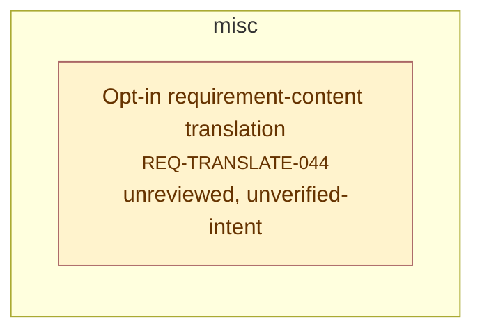

# Requirement Map

## System Map

_Capabilities grouped by area; thick border = bus; arrows = `depends_on`. Edges into the bus/hubs are hidden (the Dependency Map shows area-level coupling)._

```mermaid
graph LR
  subgraph sg_CORE["CORE"]
    CORE_DRIFT_003["Contract hashing & lock<br><small>CORE-DRIFT-003</small>"]
    CORE_PARSE_001["Requirement reading<br><small>CORE-PARSE-001</small>"]
    CORE_SCAN_002["Member discovery<br><small>CORE-SCAN-002</small>"]
  end
  subgraph sg_REQ["REQ"]
    REQ_ACVERIFY_019["Per-criterion test coverage<br><small>REQ-ACVERIFY-019</small>"]
    REQ_CANDIDATES_009["Capability candidates (extraction plan)<br><small>REQ-CANDIDATES-009</small>"]
    REQ_CHECK_006["The gate<br><small>REQ-CHECK-006</small>"]
    REQ_CMDREGISTRY_033["CLI command registry + generated integration artifacts<br><small>REQ-CMDREGISTRY-033</small>"]
    REQ_COVERAGE_029["Untagged-code coverage signal<br><small>REQ-COVERAGE-029</small>"]
    REQ_DOCBUNDLE_026["Untagged doc-bundle warning<br><small>REQ-DOCBUNDLE-026</small>"]
    REQ_DRIFTIMPACT_035["Drift blast-radius: name dependents<br><small>REQ-DRIFTIMPACT-035</small>"]
    REQ_EXCALIDRAW_030["Excalidraw scene builder — core API<br><small>REQ-EXCALIDRAW-030</small>"]
    REQ_EXCALIDRAW_031["Excalidraw quality gates<br><small>REQ-EXCALIDRAW-031</small>"]
    REQ_EXCALIDRAW_032["Excalidraw builder CLI verbs<br><small>REQ-EXCALIDRAW-032</small>"]
    REQ_EXTRACT_008["Legacy extraction<br><small>REQ-EXTRACT-008</small>"]
    REQ_FINDINGS_010["Open-findings report<br><small>REQ-FINDINGS-010</small>"]
    REQ_HEALTH_017["Corpus health snapshot<br><small>REQ-HEALTH-017</small>"]
    REQ_INIT_012["First-use bootstrap<br><small>REQ-INIT-012</small>"]
    REQ_LINT_014["Requirement readability linter<br><small>REQ-LINT-014</small>"]
    REQ_LINTCHECKS_025["Readability & scope checks<br><small>REQ-LINTCHECKS-025</small>"]
    REQ_MAP_007["Requirement map (Mermaid MD + JSON)<br><small>REQ-MAP-007</small>"]
    REQ_MEMBERDRIFT_027["Reverse-direction member drift<br><small>REQ-MEMBERDRIFT-027</small>"]
    REQ_NEW_004["Scaffold a requirement<br><small>REQ-NEW-004</small>"]
    REQ_NEXT_013["What-should-I-do-next report<br><small>REQ-NEXT-013</small>"]
    REQ_ORPHANCODE_034["Orphan-code warning<br><small>REQ-ORPHANCODE-034</small>"]
    REQ_PAGES_021["Publish & gate the GitHub Pages map copy<br><small>REQ-PAGES-021</small>"]
    REQ_PROMOTE_011["confirm<br><small>REQ-PROMOTE-011</small>"]
    REQ_PROMOTE_TODO_001["Promote a TODO item into a requirement draft<br><small>REQ-PROMOTE-TODO-001</small>"]
    REQ_PROSE_024["Prose capability classification & drafting<br><small>REQ-PROSE-024</small>"]
    REQ_PYFLOOR_040["Declared Python support floor<br><small>REQ-PYFLOOR-040</small>"]
    REQ_REGISTRYLAG_035["Registry-lag signal — commits since the requirements dir was last touched<br><small>REQ-REGISTRYLAG-035</small>"]
    REQ_REPRO_041["Committed build artifacts stay re-derivable<br><small>REQ-REPRO-041</small>"]
    REQ_REVIEW_022["AI requirement-quality review (deterministic plan + advisory pass)<br><small>REQ-REVIEW-022</small>"]
    REQ_ROADMAP_038["Roadmap coherence signals<br><small>REQ-ROADMAP-038</small>"]
    REQ_SCAN_005["List members per capability<br><small>REQ-SCAN-005</small>"]
    REQ_SCANCACHE_023["Opt-in scan cache<br><small>REQ-SCANCACHE-023</small>"]
    REQ_SEARCH_036["Free-text requirement search<br><small>REQ-SEARCH-036</small>"]
    REQ_SELFGATE_039["This repo's own gate wiring<br><small>REQ-SELFGATE-039</small>"]
    REQ_SHOW_015["Single-requirement dossier<br><small>REQ-SHOW-015</small>"]
    REQ_SIMILAR_016["Duplicate-capability detector<br><small>REQ-SIMILAR-016</small>"]
    REQ_SITE_026["Generate & maintain a project presentation page<br><small>REQ-SITE-026</small>"]
    REQ_STALEENGINE_043["Stale vendored engine, reported in CI<br><small>REQ-STALEENGINE-043</small>"]
    REQ_TESTLINK_018["Test-link integrity check<br><small>REQ-TESTLINK-018</small>"]
    REQ_TRACE_020["Upstream traceability<br><small>REQ-TRACE-020</small>"]
    REQ_TRACKED_042["Untracked members reported<br><small>REQ-TRACKED-042</small>"]
    REQ_TRANSLATE_044["Opt-in requirement-content translation<br><small>REQ-TRANSLATE-044</small>"]
    REQ_VIEWER_007["Self-contained HTML map viewer<br><small>REQ-VIEWER-007</small>"]
    REQ_VLEVEL_037["Verification levels<br><small>REQ-VLEVEL-037</small>"]
  end
  subgraph sg_misc["misc"]
    NEED_SSOT_001["Stakeholder need — specs and code stay in sync<br><small>NEED-SSOT-001</small>"]
  end
  REQ_COVERAGE_029 --> REQ_NEXT_013
  REQ_EXCALIDRAW_031 --> REQ_EXCALIDRAW_030
  REQ_EXCALIDRAW_032 --> REQ_EXCALIDRAW_030
  REQ_INIT_012 --> REQ_EXTRACT_008
  REQ_INIT_012 --> REQ_MAP_007
  REQ_LINTCHECKS_025 --> REQ_LINT_014
  REQ_NEXT_013 --> REQ_MAP_007
  REQ_PAGES_021 --> REQ_MAP_007
  REQ_PROMOTE_TODO_001 --> REQ_NEW_004
  REQ_PROSE_024 --> REQ_EXTRACT_008
  REQ_REGISTRYLAG_035 --> REQ_HEALTH_017
  REQ_REPRO_041 --> REQ_SELFGATE_039
  REQ_ROADMAP_038 --> REQ_HEALTH_017
  REQ_SEARCH_036 --> REQ_SIMILAR_016
  REQ_SITE_026 --> REQ_MAP_007
  REQ_SITE_026 --> REQ_VIEWER_007
  REQ_SITE_026 --> REQ_PAGES_021
  REQ_STALEENGINE_043 --> REQ_SELFGATE_039
  REQ_TRANSLATE_044 --> REQ_MAP_007
  REQ_TRANSLATE_044 --> REQ_VIEWER_007
  REQ_VIEWER_007 --> REQ_MAP_007
  style CORE_DRIFT_003 stroke-width:3px
  style CORE_PARSE_001 stroke-width:3px
  style CORE_SCAN_002 stroke-width:3px
```



## Requirement-to-Code

_Each requirement → its code; arrow label = role (`implements` / `tested-by`). Red = confirmed but no code linked (a gap); grey = baseline/draft, not linked yet (expected)._

```mermaid
graph LR
  CORE_DRIFT_003["Contract hashing & lock<br><small>CORE-DRIFT-003</small>"]
  f_docs_full_architecture_html_4["docs/full_architecture.html:4"]
  CORE_DRIFT_003 -->|generated-from| f_docs_full_architecture_html_4
  f_plugin_scripts_reqmap_py_1517_1561["plugin/scripts/reqmap.py:1517-1561"]
  CORE_DRIFT_003 -->|implements| f_plugin_scripts_reqmap_py_1517_1561
  f_plugin_scripts_test_reqmap_py_154_5280["plugin/scripts/test_reqmap.py:154-5280"]
  CORE_DRIFT_003 -->|tested-by| f_plugin_scripts_test_reqmap_py_154_5280
  CORE_PARSE_001["Requirement reading<br><small>CORE-PARSE-001</small>"]
  f_docs_full_architecture_html_4["docs/full_architecture.html:4"]
  CORE_PARSE_001 -->|generated-from| f_docs_full_architecture_html_4
  f_plugin_scripts_reqmap_py_748_819["plugin/scripts/reqmap.py:748-819"]
  CORE_PARSE_001 -->|implements| f_plugin_scripts_reqmap_py_748_819
  f_plugin_scripts_test_reqmap_py_51_5233["plugin/scripts/test_reqmap.py:51-5233"]
  CORE_PARSE_001 -->|tested-by| f_plugin_scripts_test_reqmap_py_51_5233
  CORE_SCAN_002["Member discovery<br><small>CORE-SCAN-002</small>"]
  f_docs_full_architecture_html_4["docs/full_architecture.html:4"]
  CORE_SCAN_002 -->|generated-from| f_docs_full_architecture_html_4
  f_plugin_scripts_reqmap_py_115_1120["plugin/scripts/reqmap.py:115-1120"]
  CORE_SCAN_002 -->|implements| f_plugin_scripts_reqmap_py_115_1120
  f_plugin_scripts_test_reqmap_py_340_4811["plugin/scripts/test_reqmap.py:340-4811"]
  CORE_SCAN_002 -->|tested-by| f_plugin_scripts_test_reqmap_py_340_4811
  NEED_SSOT_001["Stakeholder need — specs and code stay in sync<br><small>NEED-SSOT-001</small>"]
  style NEED_SSOT_001 fill:#fee,stroke:#c66
  REQ_ACVERIFY_019["Per-criterion test coverage<br><small>REQ-ACVERIFY-019</small>"]
  f_plugin_scripts_reqmap_py_1065_1919["plugin/scripts/reqmap.py:1065-1919"]
  REQ_ACVERIFY_019 -->|implements| f_plugin_scripts_reqmap_py_1065_1919
  f_plugin_scripts_test_reqmap_py_3599_5264["plugin/scripts/test_reqmap.py:3599-5264"]
  REQ_ACVERIFY_019 -->|tested-by| f_plugin_scripts_test_reqmap_py_3599_5264
  REQ_CANDIDATES_009["Capability candidates (extraction plan)<br><small>REQ-CANDIDATES-009</small>"]
  f_plugin_scripts_reqmap_py_2557_2705["plugin/scripts/reqmap.py:2557-2705"]
  REQ_CANDIDATES_009 -->|implements| f_plugin_scripts_reqmap_py_2557_2705
  f_plugin_scripts_test_reqmap_py_1181_2651["plugin/scripts/test_reqmap.py:1181-2651"]
  REQ_CANDIDATES_009 -->|tested-by| f_plugin_scripts_test_reqmap_py_1181_2651
  REQ_CHECK_006["The gate<br><small>REQ-CHECK-006</small>"]
  f_docs_full_architecture_html_4["docs/full_architecture.html:4"]
  REQ_CHECK_006 -->|generated-from| f_docs_full_architecture_html_4
  f_plugin_scripts_reqmap_py_1504_5437["plugin/scripts/reqmap.py:1504-5437"]
  REQ_CHECK_006 -->|implements| f_plugin_scripts_reqmap_py_1504_5437
  f_plugin_scripts_test_reqmap_py_144_5442["plugin/scripts/test_reqmap.py:144-5442"]
  REQ_CHECK_006 -->|tested-by| f_plugin_scripts_test_reqmap_py_144_5442
  REQ_CMDREGISTRY_033["CLI command registry + generated integration artifacts<br><small>REQ-CMDREGISTRY-033</small>"]
  f_plugin_scripts_reqmap_py_196_2092["plugin/scripts/reqmap.py:196-2092"]
  REQ_CMDREGISTRY_033 -->|implements| f_plugin_scripts_reqmap_py_196_2092
  f_plugin_scripts_test_reqmap_py_5162["plugin/scripts/test_reqmap.py:5162"]
  REQ_CMDREGISTRY_033 -->|tested-by| f_plugin_scripts_test_reqmap_py_5162
  REQ_COVERAGE_029["Untagged-code coverage signal<br><small>REQ-COVERAGE-029</small>"]
  f_plugin_scripts_reqmap_py_4272["plugin/scripts/reqmap.py:4272"]
  REQ_COVERAGE_029 -->|implements| f_plugin_scripts_reqmap_py_4272
  f_plugin_scripts_test_reqmap_py_3330["plugin/scripts/test_reqmap.py:3330"]
  REQ_COVERAGE_029 -->|tested-by| f_plugin_scripts_test_reqmap_py_3330
  REQ_DOCBUNDLE_026["Untagged doc-bundle warning<br><small>REQ-DOCBUNDLE-026</small>"]
  f_plugin_scripts_reqmap_py_1286["plugin/scripts/reqmap.py:1286"]
  REQ_DOCBUNDLE_026 -->|implements| f_plugin_scripts_reqmap_py_1286
  f_plugin_scripts_test_reqmap_py_585["plugin/scripts/test_reqmap.py:585"]
  REQ_DOCBUNDLE_026 -->|tested-by| f_plugin_scripts_test_reqmap_py_585
  REQ_DRIFTIMPACT_035["Drift blast-radius: name dependents<br><small>REQ-DRIFTIMPACT-035</small>"]
  f_plugin_scripts_reqmap_py_1977["plugin/scripts/reqmap.py:1977"]
  REQ_DRIFTIMPACT_035 -->|implements| f_plugin_scripts_reqmap_py_1977
  f_plugin_scripts_test_reqmap_py_800["plugin/scripts/test_reqmap.py:800"]
  REQ_DRIFTIMPACT_035 -->|tested-by| f_plugin_scripts_test_reqmap_py_800
  REQ_EXCALIDRAW_030["Excalidraw scene builder — core API<br><small>REQ-EXCALIDRAW-030</small>"]
  f_plugin_skills_excalidraw_diagram_scripts_excalidraw_builder_py_2["plugin/skills/excalidraw-diagram/scripts/excalidraw_builder.py:2"]
  REQ_EXCALIDRAW_030 -->|implements| f_plugin_skills_excalidraw_diagram_scripts_excalidraw_builder_py_2
  f_plugin_skills_excalidraw_diagram_scripts_test_excalidraw_py_2["plugin/skills/excalidraw-diagram/scripts/test_excalidraw.py:2"]
  REQ_EXCALIDRAW_030 -->|tested-by| f_plugin_skills_excalidraw_diagram_scripts_test_excalidraw_py_2
  REQ_EXCALIDRAW_031["Excalidraw quality gates<br><small>REQ-EXCALIDRAW-031</small>"]
  f_plugin_skills_excalidraw_diagram_scripts_excalidraw_builder_py_3["plugin/skills/excalidraw-diagram/scripts/excalidraw_builder.py:3"]
  REQ_EXCALIDRAW_031 -->|implements| f_plugin_skills_excalidraw_diagram_scripts_excalidraw_builder_py_3
  f_plugin_skills_excalidraw_diagram_scripts_test_excalidraw_py_3["plugin/skills/excalidraw-diagram/scripts/test_excalidraw.py:3"]
  REQ_EXCALIDRAW_031 -->|tested-by| f_plugin_skills_excalidraw_diagram_scripts_test_excalidraw_py_3
  REQ_EXCALIDRAW_032["Excalidraw builder CLI verbs<br><small>REQ-EXCALIDRAW-032</small>"]
  f_plugin_skills_excalidraw_diagram_scripts_excalidraw_builder_py_4["plugin/skills/excalidraw-diagram/scripts/excalidraw_builder.py:4"]
  REQ_EXCALIDRAW_032 -->|implements| f_plugin_skills_excalidraw_diagram_scripts_excalidraw_builder_py_4
  f_plugin_skills_excalidraw_diagram_scripts_test_excalidraw_py_4["plugin/skills/excalidraw-diagram/scripts/test_excalidraw.py:4"]
  REQ_EXCALIDRAW_032 -->|tested-by| f_plugin_skills_excalidraw_diagram_scripts_test_excalidraw_py_4
  REQ_EXTRACT_008["Legacy extraction<br><small>REQ-EXTRACT-008</small>"]
  f_plugin_scripts_reqmap_py_2388_2540["plugin/scripts/reqmap.py:2388-2540"]
  REQ_EXTRACT_008 -->|implements| f_plugin_scripts_reqmap_py_2388_2540
  f_plugin_scripts_test_reqmap_py_1024_1039["plugin/scripts/test_reqmap.py:1024-1039"]
  REQ_EXTRACT_008 -->|tested-by| f_plugin_scripts_test_reqmap_py_1024_1039
  REQ_FINDINGS_010["Open-findings report<br><small>REQ-FINDINGS-010</small>"]
  f_plugin_scripts_reqmap_py_2826_4517["plugin/scripts/reqmap.py:2826-4517"]
  REQ_FINDINGS_010 -->|implements| f_plugin_scripts_reqmap_py_2826_4517
  f_plugin_scripts_test_reqmap_py_1254_5609["plugin/scripts/test_reqmap.py:1254-5609"]
  REQ_FINDINGS_010 -->|tested-by| f_plugin_scripts_test_reqmap_py_1254_5609
  REQ_HEALTH_017["Corpus health snapshot<br><small>REQ-HEALTH-017</small>"]
  f_plugin_scripts_reqmap_py_4210["plugin/scripts/reqmap.py:4210"]
  REQ_HEALTH_017 -->|implements| f_plugin_scripts_reqmap_py_4210
  f_plugin_scripts_test_reqmap_py_3287_3449["plugin/scripts/test_reqmap.py:3287-3449"]
  REQ_HEALTH_017 -->|tested-by| f_plugin_scripts_test_reqmap_py_3287_3449
  REQ_INIT_012["First-use bootstrap<br><small>REQ-INIT-012</small>"]
  f_plugin_scripts_reqmap_py_4401_4430["plugin/scripts/reqmap.py:4401-4430"]
  REQ_INIT_012 -->|implements| f_plugin_scripts_reqmap_py_4401_4430
  f_plugin_scripts_test_reqmap_py_2411_5394["plugin/scripts/test_reqmap.py:2411-5394"]
  REQ_INIT_012 -->|tested-by| f_plugin_scripts_test_reqmap_py_2411_5394
  REQ_LINT_014["Requirement readability linter<br><small>REQ-LINT-014</small>"]
  f_plugin_scripts_reqmap_py_3602_3823["plugin/scripts/reqmap.py:3602-3823"]
  REQ_LINT_014 -->|implements| f_plugin_scripts_reqmap_py_3602_3823
  f_plugin_scripts_test_reqmap_py_2679["plugin/scripts/test_reqmap.py:2679"]
  REQ_LINT_014 -->|tested-by| f_plugin_scripts_test_reqmap_py_2679
  REQ_LINTCHECKS_025["Readability & scope checks<br><small>REQ-LINTCHECKS-025</small>"]
  f_plugin_scripts_reqmap_py_3631_3669["plugin/scripts/reqmap.py:3631-3669"]
  REQ_LINTCHECKS_025 -->|implements| f_plugin_scripts_reqmap_py_3631_3669
  f_plugin_scripts_test_reqmap_py_2663_2679["plugin/scripts/test_reqmap.py:2663-2679"]
  REQ_LINTCHECKS_025 -->|tested-by| f_plugin_scripts_test_reqmap_py_2663_2679
  REQ_MAP_007["Requirement map (Mermaid MD + JSON)<br><small>REQ-MAP-007</small>"]
  f_docs_full_architecture_html_4["docs/full_architecture.html:4"]
  REQ_MAP_007 -->|generated-from| f_docs_full_architecture_html_4
  f_plugin_scripts_reqmap_py_2960_5526["plugin/scripts/reqmap.py:2960-5526"]
  REQ_MAP_007 -->|implements| f_plugin_scripts_reqmap_py_2960_5526
  f_plugin_scripts_test_reqmap_py_881_5394["plugin/scripts/test_reqmap.py:881-5394"]
  REQ_MAP_007 -->|tested-by| f_plugin_scripts_test_reqmap_py_881_5394
  REQ_MEMBERDRIFT_027["Reverse-direction member drift<br><small>REQ-MEMBERDRIFT-027</small>"]
  f_plugin_scripts_reqmap_py_1577_1664["plugin/scripts/reqmap.py:1577-1664"]
  REQ_MEMBERDRIFT_027 -->|implements| f_plugin_scripts_reqmap_py_1577_1664
  f_plugin_scripts_test_reqmap_py_640["plugin/scripts/test_reqmap.py:640"]
  REQ_MEMBERDRIFT_027 -->|tested-by| f_plugin_scripts_test_reqmap_py_640
  REQ_NEW_004["Scaffold a requirement<br><small>REQ-NEW-004</small>"]
  f_plugin_scripts_reqmap_py_2195_2217["plugin/scripts/reqmap.py:2195-2217"]
  REQ_NEW_004 -->|implements| f_plugin_scripts_reqmap_py_2195_2217
  f_plugin_scripts_test_reqmap_py_1103_5711["plugin/scripts/test_reqmap.py:1103-5711"]
  REQ_NEW_004 -->|tested-by| f_plugin_scripts_test_reqmap_py_1103_5711
  REQ_NEXT_013["What-should-I-do-next report<br><small>REQ-NEXT-013</small>"]
  f_plugin_scripts_reqmap_py_1317_3466["plugin/scripts/reqmap.py:1317-3466"]
  REQ_NEXT_013 -->|implements| f_plugin_scripts_reqmap_py_1317_3466
  f_plugin_scripts_test_reqmap_py_2285_5671["plugin/scripts/test_reqmap.py:2285-5671"]
  REQ_NEXT_013 -->|tested-by| f_plugin_scripts_test_reqmap_py_2285_5671
  REQ_ORPHANCODE_034["Orphan-code warning<br><small>REQ-ORPHANCODE-034</small>"]
  f_plugin_scripts_reqmap_py_1344_2032["plugin/scripts/reqmap.py:1344-2032"]
  REQ_ORPHANCODE_034 -->|implements| f_plugin_scripts_reqmap_py_1344_2032
  f_plugin_scripts_test_reqmap_py_740["plugin/scripts/test_reqmap.py:740"]
  REQ_ORPHANCODE_034 -->|tested-by| f_plugin_scripts_test_reqmap_py_740
  REQ_PAGES_021["Publish & gate the GitHub Pages map copy<br><small>REQ-PAGES-021</small>"]
  f_plugin_scripts_reqmap_py_3403_5542["plugin/scripts/reqmap.py:3403-5542"]
  REQ_PAGES_021 -->|implements| f_plugin_scripts_reqmap_py_3403_5542
  f_plugin_scripts_test_reqmap_py_1443_2122["plugin/scripts/test_reqmap.py:1443-2122"]
  REQ_PAGES_021 -->|tested-by| f_plugin_scripts_test_reqmap_py_1443_2122
  REQ_PROMOTE_011["confirm<br><small>REQ-PROMOTE-011</small>"]
  f_plugin_scripts_reqmap_py_2328_2354["plugin/scripts/reqmap.py:2328-2354"]
  REQ_PROMOTE_011 -->|implements| f_plugin_scripts_reqmap_py_2328_2354
  f_plugin_scripts_test_reqmap_py_2225_5344["plugin/scripts/test_reqmap.py:2225-5344"]
  REQ_PROMOTE_011 -->|tested-by| f_plugin_scripts_test_reqmap_py_2225_5344
  REQ_PROMOTE_TODO_001["Promote a TODO item into a requirement draft<br><small>REQ-PROMOTE-TODO-001</small>"]
  f_plugin_scripts_reqmap_py_2239_2296["plugin/scripts/reqmap.py:2239-2296"]
  REQ_PROMOTE_TODO_001 -->|implements| f_plugin_scripts_reqmap_py_2239_2296
  f_plugin_scripts_test_reqmap_py_3792_5344["plugin/scripts/test_reqmap.py:3792-5344"]
  REQ_PROMOTE_TODO_001 -->|tested-by| f_plugin_scripts_test_reqmap_py_3792_5344
  REQ_PROSE_024["Prose capability classification & drafting<br><small>REQ-PROSE-024</small>"]
  f_plugin_scripts_reqmap_py_2396_2449["plugin/scripts/reqmap.py:2396-2449"]
  REQ_PROSE_024 -->|implements| f_plugin_scripts_reqmap_py_2396_2449
  f_plugin_scripts_test_reqmap_py_838_1024["plugin/scripts/test_reqmap.py:838-1024"]
  REQ_PROSE_024 -->|tested-by| f_plugin_scripts_test_reqmap_py_838_1024
  REQ_PYFLOOR_040["Declared Python support floor<br><small>REQ-PYFLOOR-040</small>"]
  f__github_workflows_ci_yml_3[".github/workflows/ci.yml:3"]
  REQ_PYFLOOR_040 -->|implements| f__github_workflows_ci_yml_3
  f_plugin_scripts_reqmap_py_170["plugin/scripts/reqmap.py:170"]
  REQ_PYFLOOR_040 -->|implements| f_plugin_scripts_reqmap_py_170
  f_plugin_scripts_test_reqmap_py_4981["plugin/scripts/test_reqmap.py:4981"]
  REQ_PYFLOOR_040 -->|tested-by| f_plugin_scripts_test_reqmap_py_4981
  REQ_REGISTRYLAG_035["Registry-lag signal — commits since the requirements dir was last touched<br><small>REQ-REGISTRYLAG-035</small>"]
  f_plugin_scripts_reqmap_py_4184_4278["plugin/scripts/reqmap.py:4184-4278"]
  REQ_REGISTRYLAG_035 -->|implements| f_plugin_scripts_reqmap_py_4184_4278
  f_plugin_scripts_test_reqmap_py_3355["plugin/scripts/test_reqmap.py:3355"]
  REQ_REGISTRYLAG_035 -->|tested-by| f_plugin_scripts_test_reqmap_py_3355
  REQ_REPRO_041["Committed build artifacts stay re-derivable<br><small>REQ-REPRO-041</small>"]
  f__github_workflows_ci_yml_4[".github/workflows/ci.yml:4"]
  REQ_REPRO_041 -->|implements| f__github_workflows_ci_yml_4
  REQ_REVIEW_022["AI requirement-quality review (deterministic plan + advisory pass)<br><small>REQ-REVIEW-022</small>"]
  f_plugin_scripts_reqmap_py_5701["plugin/scripts/reqmap.py:5701"]
  REQ_REVIEW_022 -->|implements| f_plugin_scripts_reqmap_py_5701
  f_plugin_scripts_test_reqmap_py_3859["plugin/scripts/test_reqmap.py:3859"]
  REQ_REVIEW_022 -->|tested-by| f_plugin_scripts_test_reqmap_py_3859
  f_plugin_skills_requirement_quality_review_SKILL_md_6["plugin/skills/requirement-quality-review/SKILL.md:6"]
  REQ_REVIEW_022 -->|implements| f_plugin_skills_requirement_quality_review_SKILL_md_6
  f_plugin_skills_requirement_quality_review_SKILL_universal_md_9["plugin/skills/requirement-quality-review/SKILL.universal.md:9"]
  REQ_REVIEW_022 -->|implements| f_plugin_skills_requirement_quality_review_SKILL_universal_md_9
  REQ_ROADMAP_038["Roadmap coherence signals<br><small>REQ-ROADMAP-038</small>"]
  f_plugin_scripts_reqmap_py_3016_4284["plugin/scripts/reqmap.py:3016-4284"]
  REQ_ROADMAP_038 -->|implements| f_plugin_scripts_reqmap_py_3016_4284
  f_plugin_scripts_test_reqmap_py_5465["plugin/scripts/test_reqmap.py:5465"]
  REQ_ROADMAP_038 -->|tested-by| f_plugin_scripts_test_reqmap_py_5465
  REQ_SCAN_005["List members per capability<br><small>REQ-SCAN-005</small>"]
  f_plugin_scripts_reqmap_py_1701["plugin/scripts/reqmap.py:1701"]
  REQ_SCAN_005 -->|implements| f_plugin_scripts_reqmap_py_1701
  f_plugin_scripts_test_reqmap_py_1167["plugin/scripts/test_reqmap.py:1167"]
  REQ_SCAN_005 -->|tested-by| f_plugin_scripts_test_reqmap_py_1167
  REQ_SCANCACHE_023["Opt-in scan cache<br><small>REQ-SCANCACHE-023</small>"]
  f_plugin_scripts_reqmap_py_1020_1034["plugin/scripts/reqmap.py:1020-1034"]
  REQ_SCANCACHE_023 -->|implements| f_plugin_scripts_reqmap_py_1020_1034
  f_plugin_scripts_test_reqmap_py_3920["plugin/scripts/test_reqmap.py:3920"]
  REQ_SCANCACHE_023 -->|tested-by| f_plugin_scripts_test_reqmap_py_3920
  REQ_SEARCH_036["Free-text requirement search<br><small>REQ-SEARCH-036</small>"]
  f_plugin_scripts_reqmap_py_4063["plugin/scripts/reqmap.py:4063"]
  REQ_SEARCH_036 -->|implements| f_plugin_scripts_reqmap_py_4063
  f_plugin_scripts_test_reqmap_py_3207["plugin/scripts/test_reqmap.py:3207"]
  REQ_SEARCH_036 -->|tested-by| f_plugin_scripts_test_reqmap_py_3207
  REQ_SELFGATE_039["This repo's own gate wiring<br><small>REQ-SELFGATE-039</small>"]
  f_sync_reqmap_sh_2["sync_reqmap.sh:2"]
  REQ_SELFGATE_039 -->|implements| f_sync_reqmap_sh_2
  f__githooks_pre_commit_2[".githooks/pre-commit:2"]
  REQ_SELFGATE_039 -->|implements| f__githooks_pre_commit_2
  f__githooks_pre_push_2[".githooks/pre-push:2"]
  REQ_SELFGATE_039 -->|implements| f__githooks_pre_push_2
  f__github_workflows_ci_yml_2[".github/workflows/ci.yml:2"]
  REQ_SELFGATE_039 -->|implements| f__github_workflows_ci_yml_2
  f_check_action_yml_2["check/action.yml:2"]
  REQ_SELFGATE_039 -->|implements| f_check_action_yml_2
  f_scripts_check_versions_py_2["scripts/check_versions.py:2"]
  REQ_SELFGATE_039 -->|implements| f_scripts_check_versions_py_2
  f_scripts_test_check_engine_bump_py_56["scripts/test_check_engine_bump.py:56"]
  REQ_SELFGATE_039 -->|tested-by| f_scripts_test_check_engine_bump_py_56
  f_scripts_test_check_versions_py_93_100["scripts/test_check_versions.py:93-100"]
  REQ_SELFGATE_039 -->|tested-by| f_scripts_test_check_versions_py_93_100
  REQ_SHOW_015["Single-requirement dossier<br><small>REQ-SHOW-015</small>"]
  f_plugin_scripts_reqmap_py_3865["plugin/scripts/reqmap.py:3865"]
  REQ_SHOW_015 -->|implements| f_plugin_scripts_reqmap_py_3865
  f_plugin_scripts_test_reqmap_py_3063["plugin/scripts/test_reqmap.py:3063"]
  REQ_SHOW_015 -->|tested-by| f_plugin_scripts_test_reqmap_py_3063
  REQ_SIMILAR_016["Duplicate-capability detector<br><small>REQ-SIMILAR-016</small>"]
  f_plugin_scripts_reqmap_py_3954_4015["plugin/scripts/reqmap.py:3954-4015"]
  REQ_SIMILAR_016 -->|implements| f_plugin_scripts_reqmap_py_3954_4015
  f_plugin_scripts_test_reqmap_py_3145["plugin/scripts/test_reqmap.py:3145"]
  REQ_SIMILAR_016 -->|tested-by| f_plugin_scripts_test_reqmap_py_3145
  REQ_SITE_026["Generate & maintain a project presentation page<br><small>REQ-SITE-026</small>"]
  f_plugin_scripts_reqmap_py_4456_5938["plugin/scripts/reqmap.py:4456-5938"]
  REQ_SITE_026 -->|implements| f_plugin_scripts_reqmap_py_4456_5938
  f_plugin_scripts_test_reqmap_py_4621["plugin/scripts/test_reqmap.py:4621"]
  REQ_SITE_026 -->|tested-by| f_plugin_scripts_test_reqmap_py_4621
  REQ_STALEENGINE_043["Stale vendored engine, reported in CI<br><small>REQ-STALEENGINE-043</small>"]
  f_check_action_yml_3["check/action.yml:3"]
  REQ_STALEENGINE_043 -->|implements| f_check_action_yml_3
  f_check_engine_staleness_py_2["check/engine_staleness.py:2"]
  REQ_STALEENGINE_043 -->|implements| f_check_engine_staleness_py_2
  f_scripts_test_engine_staleness_py_49["scripts/test_engine_staleness.py:49"]
  REQ_STALEENGINE_043 -->|tested-by| f_scripts_test_engine_staleness_py_49
  REQ_TESTLINK_018["Test-link integrity check<br><small>REQ-TESTLINK-018</small>"]
  f_plugin_scripts_reqmap_py_1773_1911["plugin/scripts/reqmap.py:1773-1911"]
  REQ_TESTLINK_018 -->|implements| f_plugin_scripts_reqmap_py_1773_1911
  f_plugin_scripts_test_reqmap_py_3523["plugin/scripts/test_reqmap.py:3523"]
  REQ_TESTLINK_018 -->|tested-by| f_plugin_scripts_test_reqmap_py_3523
  REQ_TRACE_020["Upstream traceability<br><small>REQ-TRACE-020</small>"]
  f_plugin_scripts_reqmap_py_1867_3900["plugin/scripts/reqmap.py:1867-3900"]
  REQ_TRACE_020 -->|implements| f_plugin_scripts_reqmap_py_1867_3900
  f_plugin_scripts_test_reqmap_py_3669["plugin/scripts/test_reqmap.py:3669"]
  REQ_TRACE_020 -->|tested-by| f_plugin_scripts_test_reqmap_py_3669
  REQ_TRACKED_042["Untracked members reported<br><small>REQ-TRACKED-042</small>"]
  f_plugin_scripts_reqmap_py_1250_2021["plugin/scripts/reqmap.py:1250-2021"]
  REQ_TRACKED_042 -->|implements| f_plugin_scripts_reqmap_py_1250_2021
  f_plugin_scripts_test_reqmap_py_4869["plugin/scripts/test_reqmap.py:4869"]
  REQ_TRACKED_042 -->|tested-by| f_plugin_scripts_test_reqmap_py_4869
  REQ_TRANSLATE_044["Opt-in requirement-content translation<br><small>REQ-TRANSLATE-044</small>"]
  f_plugin_scripts_reqmap_py_3097_3376["plugin/scripts/reqmap.py:3097-3376"]
  REQ_TRANSLATE_044 -->|implements| f_plugin_scripts_reqmap_py_3097_3376
  f_plugin_scripts_test_reqmap_py_2919["plugin/scripts/test_reqmap.py:2919"]
  REQ_TRANSLATE_044 -->|tested-by| f_plugin_scripts_test_reqmap_py_2919
  REQ_VIEWER_007["Self-contained HTML map viewer<br><small>REQ-VIEWER-007</small>"]
  f_docs_full_architecture_html_4["docs/full_architecture.html:4"]
  REQ_VIEWER_007 -->|generated-from| f_docs_full_architecture_html_4
  f_plugin_scripts_reqmap_py_1222_5685["plugin/scripts/reqmap.py:1222-5685"]
  REQ_VIEWER_007 -->|implements| f_plugin_scripts_reqmap_py_1222_5685
  f_plugin_scripts_test_reqmap_py_1416_5508["plugin/scripts/test_reqmap.py:1416-5508"]
  REQ_VIEWER_007 -->|tested-by| f_plugin_scripts_test_reqmap_py_1416_5508
  REQ_VLEVEL_037["Verification levels<br><small>REQ-VLEVEL-037</small>"]
  f_plugin_scripts_reqmap_py_1416_3865["plugin/scripts/reqmap.py:1416-3865"]
  REQ_VLEVEL_037 -->|implements| f_plugin_scripts_reqmap_py_1416_3865
  f_plugin_scripts_test_reqmap_py_272_3135["plugin/scripts/test_reqmap.py:272-3135"]
  REQ_VLEVEL_037 -->|tested-by| f_plugin_scripts_test_reqmap_py_272_3135
```

## Dependency Map

_Area-level coupling: one box per area (N caps), arrow A->B = some capability in A depends on one in B. The System Map has the per-capability detail._


## Risk & Unknowns

_Requirements needing attention: red = unimplemented (confirmed, no code); orange = unreviewed (promote after review); yellow = untested (implemented but no tested-by — set `test_exempt` to silence), or unverified-intent (open verify-intent question)._



### Risk Table

| ID | status | members | dependents | risks | recommendation |
| --- | --- | --- | --- | --- | --- |
| REQ-TRANSLATE-044 | baseline | 15 | 0 | unreviewed, unverified-intent | Draft/baseline, not yet validated: review the contract, wire its `tested-by` tests, then promote to `confirmed`. Until then it is tracked, not enforced. Has open `## WHAT — Verify intent` question(s): run `reqmap.py findings`, resolve each in `requirements/_findings.md`, then fold the answer into the Contract or delete the bullet. |
