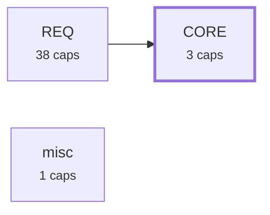

# Requirement Map

## System Map

_Capabilities grouped by area; thick border = bus; arrows = `depends_on`. Edges into the bus/hubs are hidden (the Dependency Map shows area-level coupling)._

```mermaid
graph LR
  subgraph sg_CORE["CORE"]
    CORE_DRIFT_003["Contract hashing & lock<br><small>CORE-DRIFT-003</small>"]
    CORE_PARSE_001["Requirement reading<br><small>CORE-PARSE-001</small>"]
    CORE_SCAN_002["Member discovery<br><small>CORE-SCAN-002</small>"]
  end
  subgraph sg_REQ["REQ"]
    REQ_ACVERIFY_019["Per-criterion test coverage<br><small>REQ-ACVERIFY-019</small>"]
    REQ_CANDIDATES_009["Capability candidates (extraction plan)<br><small>REQ-CANDIDATES-009</small>"]
    REQ_CHECK_006["The gate<br><small>REQ-CHECK-006</small>"]
    REQ_CMDREGISTRY_033["CLI command registry + generated integration artifacts<br><small>REQ-CMDREGISTRY-033</small>"]
    REQ_COVERAGE_029["Untagged-code coverage signal<br><small>REQ-COVERAGE-029</small>"]
    REQ_DOCBUNDLE_026["Untagged doc-bundle warning<br><small>REQ-DOCBUNDLE-026</small>"]
    REQ_DRIFTIMPACT_035["Drift blast-radius: name dependents<br><small>REQ-DRIFTIMPACT-035</small>"]
    REQ_EXCALIDRAW_030["Excalidraw scene builder — core API<br><small>REQ-EXCALIDRAW-030</small>"]
    REQ_EXCALIDRAW_031["Excalidraw quality gates<br><small>REQ-EXCALIDRAW-031</small>"]
    REQ_EXCALIDRAW_032["Excalidraw builder CLI verbs<br><small>REQ-EXCALIDRAW-032</small>"]
    REQ_EXTRACT_008["Legacy extraction<br><small>REQ-EXTRACT-008</small>"]
    REQ_FINDINGS_010["Open-findings report<br><small>REQ-FINDINGS-010</small>"]
    REQ_HEALTH_017["Corpus health snapshot<br><small>REQ-HEALTH-017</small>"]
    REQ_INIT_012["First-use bootstrap<br><small>REQ-INIT-012</small>"]
    REQ_LINT_014["Requirement readability linter<br><small>REQ-LINT-014</small>"]
    REQ_LINTCHECKS_025["Readability & scope checks<br><small>REQ-LINTCHECKS-025</small>"]
    REQ_MAP_007["Requirement map (Mermaid MD + JSON)<br><small>REQ-MAP-007</small>"]
    REQ_MEMBERDRIFT_027["Reverse-direction member drift<br><small>REQ-MEMBERDRIFT-027</small>"]
    REQ_NEW_004["Scaffold a requirement<br><small>REQ-NEW-004</small>"]
    REQ_NEXT_013["What-should-I-do-next report<br><small>REQ-NEXT-013</small>"]
    REQ_ORPHANCODE_034["Orphan-code warning<br><small>REQ-ORPHANCODE-034</small>"]
    REQ_PAGES_021["Publish & gate the GitHub Pages map copy<br><small>REQ-PAGES-021</small>"]
    REQ_PROMOTE_011["confirm<br><small>REQ-PROMOTE-011</small>"]
    REQ_PROMOTE_TODO_001["Promote a TODO item into a requirement draft<br><small>REQ-PROMOTE-TODO-001</small>"]
    REQ_PROSE_024["Prose capability classification & drafting<br><small>REQ-PROSE-024</small>"]
    REQ_REGISTRYLAG_035["Registry-lag signal — commits since the requirements dir was last touched<br><small>REQ-REGISTRYLAG-035</small>"]
    REQ_REVIEW_022["AI requirement-quality review (deterministic plan + advisory pass)<br><small>REQ-REVIEW-022</small>"]
    REQ_ROADMAP_038["Roadmap coherence signals<br><small>REQ-ROADMAP-038</small>"]
    REQ_SCAN_005["List members per capability<br><small>REQ-SCAN-005</small>"]
    REQ_SCANCACHE_023["Opt-in scan cache<br><small>REQ-SCANCACHE-023</small>"]
    REQ_SEARCH_036["Free-text requirement search<br><small>REQ-SEARCH-036</small>"]
    REQ_SHOW_015["Single-requirement dossier<br><small>REQ-SHOW-015</small>"]
    REQ_SIMILAR_016["Duplicate-capability detector<br><small>REQ-SIMILAR-016</small>"]
    REQ_SITE_026["Generate & maintain a project presentation page<br><small>REQ-SITE-026</small>"]
    REQ_TESTLINK_018["Test-link integrity check<br><small>REQ-TESTLINK-018</small>"]
    REQ_TRACE_020["Upstream traceability<br><small>REQ-TRACE-020</small>"]
    REQ_VIEWER_007["Self-contained HTML map viewer<br><small>REQ-VIEWER-007</small>"]
    REQ_VLEVEL_037["Verification levels<br><small>REQ-VLEVEL-037</small>"]
  end
  subgraph sg_misc["misc"]
    NEED_SSOT_001["Stakeholder need — specs and code stay in sync<br><small>NEED-SSOT-001</small>"]
  end
  REQ_COVERAGE_029 --> REQ_NEXT_013
  REQ_EXCALIDRAW_031 --> REQ_EXCALIDRAW_030
  REQ_EXCALIDRAW_032 --> REQ_EXCALIDRAW_030
  REQ_INIT_012 --> REQ_EXTRACT_008
  REQ_INIT_012 --> REQ_MAP_007
  REQ_LINTCHECKS_025 --> REQ_LINT_014
  REQ_NEXT_013 --> REQ_MAP_007
  REQ_PAGES_021 --> REQ_MAP_007
  REQ_PROMOTE_TODO_001 --> REQ_NEW_004
  REQ_PROSE_024 --> REQ_EXTRACT_008
  REQ_REGISTRYLAG_035 --> REQ_HEALTH_017
  REQ_ROADMAP_038 --> REQ_HEALTH_017
  REQ_SEARCH_036 --> REQ_SIMILAR_016
  REQ_SITE_026 --> REQ_MAP_007
  REQ_SITE_026 --> REQ_VIEWER_007
  REQ_SITE_026 --> REQ_PAGES_021
  REQ_VIEWER_007 --> REQ_MAP_007
  style CORE_DRIFT_003 stroke-width:3px
  style CORE_PARSE_001 stroke-width:3px
  style CORE_SCAN_002 stroke-width:3px
```



## Requirement-to-Code

_Each requirement → its code; arrow label = role (`implements` / `tested-by`). Red = confirmed but no code linked (a gap); grey = baseline/draft, not linked yet (expected)._

```mermaid
graph LR
  CORE_DRIFT_003["Contract hashing & lock<br><small>CORE-DRIFT-003</small>"]
  f_plugin_scripts_reqmap_py_1256_1300["plugin/scripts/reqmap.py:1256-1300"]
  CORE_DRIFT_003 -->|implements| f_plugin_scripts_reqmap_py_1256_1300
  f_plugin_scripts_test_reqmap_py_153_4826["plugin/scripts/test_reqmap.py:153-4826"]
  CORE_DRIFT_003 -->|tested-by| f_plugin_scripts_test_reqmap_py_153_4826
  CORE_PARSE_001["Requirement reading<br><small>CORE-PARSE-001</small>"]
  f_plugin_scripts_reqmap_py_686_757["plugin/scripts/reqmap.py:686-757"]
  CORE_PARSE_001 -->|implements| f_plugin_scripts_reqmap_py_686_757
  f_plugin_scripts_test_reqmap_py_50_4779["plugin/scripts/test_reqmap.py:50-4779"]
  CORE_PARSE_001 -->|tested-by| f_plugin_scripts_test_reqmap_py_50_4779
  CORE_SCAN_002["Member discovery<br><small>CORE-SCAN-002</small>"]
  f_plugin_scripts_reqmap_py_106_975["plugin/scripts/reqmap.py:106-975"]
  CORE_SCAN_002 -->|implements| f_plugin_scripts_reqmap_py_106_975
  f_plugin_scripts_test_reqmap_py_339_537["plugin/scripts/test_reqmap.py:339-537"]
  CORE_SCAN_002 -->|tested-by| f_plugin_scripts_test_reqmap_py_339_537
  NEED_SSOT_001["Stakeholder need — specs and code stay in sync<br><small>NEED-SSOT-001</small>"]
  style NEED_SSOT_001 fill:#fee,stroke:#c66
  REQ_ACVERIFY_019["Per-criterion test coverage<br><small>REQ-ACVERIFY-019</small>"]
  f_plugin_scripts_reqmap_py_1112_1651["plugin/scripts/reqmap.py:1112-1651"]
  REQ_ACVERIFY_019 -->|implements| f_plugin_scripts_reqmap_py_1112_1651
  f_plugin_scripts_test_reqmap_py_3428_4810["plugin/scripts/test_reqmap.py:3428-4810"]
  REQ_ACVERIFY_019 -->|tested-by| f_plugin_scripts_test_reqmap_py_3428_4810
  REQ_CANDIDATES_009["Capability candidates (extraction plan)<br><small>REQ-CANDIDATES-009</small>"]
  f_plugin_scripts_reqmap_py_2232_2380["plugin/scripts/reqmap.py:2232-2380"]
  REQ_CANDIDATES_009 -->|implements| f_plugin_scripts_reqmap_py_2232_2380
  f_plugin_scripts_test_reqmap_py_1172_2642["plugin/scripts/test_reqmap.py:1172-2642"]
  REQ_CANDIDATES_009 -->|tested-by| f_plugin_scripts_test_reqmap_py_1172_2642
  REQ_CHECK_006["The gate<br><small>REQ-CHECK-006</small>"]
  f_plugin_scripts_reqmap_py_1243_1769["plugin/scripts/reqmap.py:1243-1769"]
  REQ_CHECK_006 -->|implements| f_plugin_scripts_reqmap_py_1243_1769
  f_plugin_scripts_test_reqmap_py_143_4988["plugin/scripts/test_reqmap.py:143-4988"]
  REQ_CHECK_006 -->|tested-by| f_plugin_scripts_test_reqmap_py_143_4988
  REQ_CMDREGISTRY_033["CLI command registry + generated integration artifacts<br><small>REQ-CMDREGISTRY-033</small>"]
  f_plugin_scripts_reqmap_py_160_1791["plugin/scripts/reqmap.py:160-1791"]
  REQ_CMDREGISTRY_033 -->|implements| f_plugin_scripts_reqmap_py_160_1791
  f_plugin_scripts_test_reqmap_py_4708["plugin/scripts/test_reqmap.py:4708"]
  REQ_CMDREGISTRY_033 -->|tested-by| f_plugin_scripts_test_reqmap_py_4708
  REQ_COVERAGE_029["Untagged-code coverage signal<br><small>REQ-COVERAGE-029</small>"]
  f_plugin_scripts_reqmap_py_3599["plugin/scripts/reqmap.py:3599"]
  REQ_COVERAGE_029 -->|implements| f_plugin_scripts_reqmap_py_3599
  f_plugin_scripts_test_reqmap_py_3159["plugin/scripts/test_reqmap.py:3159"]
  REQ_COVERAGE_029 -->|tested-by| f_plugin_scripts_test_reqmap_py_3159
  REQ_DOCBUNDLE_026["Untagged doc-bundle warning<br><small>REQ-DOCBUNDLE-026</small>"]
  f_plugin_scripts_reqmap_py_1025["plugin/scripts/reqmap.py:1025"]
  REQ_DOCBUNDLE_026 -->|implements| f_plugin_scripts_reqmap_py_1025
  f_plugin_scripts_test_reqmap_py_576["plugin/scripts/test_reqmap.py:576"]
  REQ_DOCBUNDLE_026 -->|tested-by| f_plugin_scripts_test_reqmap_py_576
  REQ_DRIFTIMPACT_035["Drift blast-radius: name dependents<br><small>REQ-DRIFTIMPACT-035</small>"]
  f_plugin_scripts_reqmap_py_1689["plugin/scripts/reqmap.py:1689"]
  REQ_DRIFTIMPACT_035 -->|implements| f_plugin_scripts_reqmap_py_1689
  f_plugin_scripts_test_reqmap_py_791["plugin/scripts/test_reqmap.py:791"]
  REQ_DRIFTIMPACT_035 -->|tested-by| f_plugin_scripts_test_reqmap_py_791
  REQ_EXCALIDRAW_030["Excalidraw scene builder — core API<br><small>REQ-EXCALIDRAW-030</small>"]
  f_plugin_skills_excalidraw_diagram_scripts_excalidraw_builder_py_2["plugin/skills/excalidraw-diagram/scripts/excalidraw_builder.py:2"]
  REQ_EXCALIDRAW_030 -->|implements| f_plugin_skills_excalidraw_diagram_scripts_excalidraw_builder_py_2
  f_plugin_skills_excalidraw_diagram_scripts_test_excalidraw_py_2["plugin/skills/excalidraw-diagram/scripts/test_excalidraw.py:2"]
  REQ_EXCALIDRAW_030 -->|tested-by| f_plugin_skills_excalidraw_diagram_scripts_test_excalidraw_py_2
  REQ_EXCALIDRAW_031["Excalidraw quality gates<br><small>REQ-EXCALIDRAW-031</small>"]
  f_plugin_skills_excalidraw_diagram_scripts_excalidraw_builder_py_3["plugin/skills/excalidraw-diagram/scripts/excalidraw_builder.py:3"]
  REQ_EXCALIDRAW_031 -->|implements| f_plugin_skills_excalidraw_diagram_scripts_excalidraw_builder_py_3
  f_plugin_skills_excalidraw_diagram_scripts_test_excalidraw_py_3["plugin/skills/excalidraw-diagram/scripts/test_excalidraw.py:3"]
  REQ_EXCALIDRAW_031 -->|tested-by| f_plugin_skills_excalidraw_diagram_scripts_test_excalidraw_py_3
  REQ_EXCALIDRAW_032["Excalidraw builder CLI verbs<br><small>REQ-EXCALIDRAW-032</small>"]
  f_plugin_skills_excalidraw_diagram_scripts_excalidraw_builder_py_4["plugin/skills/excalidraw-diagram/scripts/excalidraw_builder.py:4"]
  REQ_EXCALIDRAW_032 -->|implements| f_plugin_skills_excalidraw_diagram_scripts_excalidraw_builder_py_4
  f_plugin_skills_excalidraw_diagram_scripts_test_excalidraw_py_4["plugin/skills/excalidraw-diagram/scripts/test_excalidraw.py:4"]
  REQ_EXCALIDRAW_032 -->|tested-by| f_plugin_skills_excalidraw_diagram_scripts_test_excalidraw_py_4
  REQ_EXTRACT_008["Legacy extraction<br><small>REQ-EXTRACT-008</small>"]
  f_plugin_scripts_reqmap_py_2063_2215["plugin/scripts/reqmap.py:2063-2215"]
  REQ_EXTRACT_008 -->|implements| f_plugin_scripts_reqmap_py_2063_2215
  f_plugin_scripts_test_reqmap_py_1015_1030["plugin/scripts/test_reqmap.py:1015-1030"]
  REQ_EXTRACT_008 -->|tested-by| f_plugin_scripts_test_reqmap_py_1015_1030
  REQ_FINDINGS_010["Open-findings report<br><small>REQ-FINDINGS-010</small>"]
  f_plugin_scripts_reqmap_py_2501_2588["plugin/scripts/reqmap.py:2501-2588"]
  REQ_FINDINGS_010 -->|implements| f_plugin_scripts_reqmap_py_2501_2588
  f_plugin_scripts_test_reqmap_py_1245_1787["plugin/scripts/test_reqmap.py:1245-1787"]
  REQ_FINDINGS_010 -->|tested-by| f_plugin_scripts_test_reqmap_py_1245_1787
  REQ_HEALTH_017["Corpus health snapshot<br><small>REQ-HEALTH-017</small>"]
  f_plugin_scripts_reqmap_py_3537["plugin/scripts/reqmap.py:3537"]
  REQ_HEALTH_017 -->|implements| f_plugin_scripts_reqmap_py_3537
  f_plugin_scripts_test_reqmap_py_3116_3278["plugin/scripts/test_reqmap.py:3116-3278"]
  REQ_HEALTH_017 -->|tested-by| f_plugin_scripts_test_reqmap_py_3116_3278
  REQ_INIT_012["First-use bootstrap<br><small>REQ-INIT-012</small>"]
  f_plugin_scripts_reqmap_py_3728_3757["plugin/scripts/reqmap.py:3728-3757"]
  REQ_INIT_012 -->|implements| f_plugin_scripts_reqmap_py_3728_3757
  f_plugin_scripts_test_reqmap_py_2402_4940["plugin/scripts/test_reqmap.py:2402-4940"]
  REQ_INIT_012 -->|tested-by| f_plugin_scripts_test_reqmap_py_2402_4940
  REQ_LINT_014["Requirement readability linter<br><small>REQ-LINT-014</small>"]
  f_plugin_scripts_reqmap_py_2944_3150["plugin/scripts/reqmap.py:2944-3150"]
  REQ_LINT_014 -->|implements| f_plugin_scripts_reqmap_py_2944_3150
  f_plugin_scripts_test_reqmap_py_2670["plugin/scripts/test_reqmap.py:2670"]
  REQ_LINT_014 -->|tested-by| f_plugin_scripts_test_reqmap_py_2670
  REQ_LINTCHECKS_025["Readability & scope checks<br><small>REQ-LINTCHECKS-025</small>"]
  f_plugin_scripts_reqmap_py_2973_3011["plugin/scripts/reqmap.py:2973-3011"]
  REQ_LINTCHECKS_025 -->|implements| f_plugin_scripts_reqmap_py_2973_3011
  f_plugin_scripts_test_reqmap_py_2654_2670["plugin/scripts/test_reqmap.py:2654-2670"]
  REQ_LINTCHECKS_025 -->|tested-by| f_plugin_scripts_test_reqmap_py_2654_2670
  REQ_MAP_007["Requirement map (Mermaid MD + JSON)<br><small>REQ-MAP-007</small>"]
  f_plugin_scripts_reqmap_py_2628_4802["plugin/scripts/reqmap.py:2628-4802"]
  REQ_MAP_007 -->|implements| f_plugin_scripts_reqmap_py_2628_4802
  f_plugin_scripts_test_reqmap_py_872_4940["plugin/scripts/test_reqmap.py:872-4940"]
  REQ_MAP_007 -->|tested-by| f_plugin_scripts_test_reqmap_py_872_4940
  REQ_MEMBERDRIFT_027["Reverse-direction member drift<br><small>REQ-MEMBERDRIFT-027</small>"]
  f_plugin_scripts_reqmap_py_1316_1403["plugin/scripts/reqmap.py:1316-1403"]
  REQ_MEMBERDRIFT_027 -->|implements| f_plugin_scripts_reqmap_py_1316_1403
  f_plugin_scripts_test_reqmap_py_631["plugin/scripts/test_reqmap.py:631"]
  REQ_MEMBERDRIFT_027 -->|tested-by| f_plugin_scripts_test_reqmap_py_631
  REQ_NEW_004["Scaffold a requirement<br><small>REQ-NEW-004</small>"]
  f_plugin_scripts_reqmap_py_1894["plugin/scripts/reqmap.py:1894"]
  REQ_NEW_004 -->|implements| f_plugin_scripts_reqmap_py_1894
  f_plugin_scripts_test_reqmap_py_1094["plugin/scripts/test_reqmap.py:1094"]
  REQ_NEW_004 -->|tested-by| f_plugin_scripts_test_reqmap_py_1094
  REQ_NEXT_013["What-should-I-do-next report<br><small>REQ-NEXT-013</small>"]
  f_plugin_scripts_reqmap_py_1056_2820["plugin/scripts/reqmap.py:1056-2820"]
  REQ_NEXT_013 -->|implements| f_plugin_scripts_reqmap_py_1056_2820
  f_plugin_scripts_test_reqmap_py_2276_4890["plugin/scripts/test_reqmap.py:2276-4890"]
  REQ_NEXT_013 -->|tested-by| f_plugin_scripts_test_reqmap_py_2276_4890
  REQ_ORPHANCODE_034["Orphan-code warning<br><small>REQ-ORPHANCODE-034</small>"]
  f_plugin_scripts_reqmap_py_1083_1731["plugin/scripts/reqmap.py:1083-1731"]
  REQ_ORPHANCODE_034 -->|implements| f_plugin_scripts_reqmap_py_1083_1731
  f_plugin_scripts_test_reqmap_py_731["plugin/scripts/test_reqmap.py:731"]
  REQ_ORPHANCODE_034 -->|tested-by| f_plugin_scripts_test_reqmap_py_731
  REQ_PAGES_021["Publish & gate the GitHub Pages map copy<br><small>REQ-PAGES-021</small>"]
  f_plugin_scripts_reqmap_py_2779_4818["plugin/scripts/reqmap.py:2779-4818"]
  REQ_PAGES_021 -->|implements| f_plugin_scripts_reqmap_py_2779_4818
  f_plugin_scripts_test_reqmap_py_1434_2113["plugin/scripts/test_reqmap.py:1434-2113"]
  REQ_PAGES_021 -->|tested-by| f_plugin_scripts_test_reqmap_py_1434_2113
  REQ_PROMOTE_011["confirm<br><small>REQ-PROMOTE-011</small>"]
  f_plugin_scripts_reqmap_py_2003_2029["plugin/scripts/reqmap.py:2003-2029"]
  REQ_PROMOTE_011 -->|implements| f_plugin_scripts_reqmap_py_2003_2029
  f_plugin_scripts_test_reqmap_py_2216_4890["plugin/scripts/test_reqmap.py:2216-4890"]
  REQ_PROMOTE_011 -->|tested-by| f_plugin_scripts_test_reqmap_py_2216_4890
  REQ_PROMOTE_TODO_001["Promote a TODO item into a requirement draft<br><small>REQ-PROMOTE-TODO-001</small>"]
  f_plugin_scripts_reqmap_py_1915_1971["plugin/scripts/reqmap.py:1915-1971"]
  REQ_PROMOTE_TODO_001 -->|implements| f_plugin_scripts_reqmap_py_1915_1971
  f_plugin_scripts_test_reqmap_py_3621_4890["plugin/scripts/test_reqmap.py:3621-4890"]
  REQ_PROMOTE_TODO_001 -->|tested-by| f_plugin_scripts_test_reqmap_py_3621_4890
  REQ_PROSE_024["Prose capability classification & drafting<br><small>REQ-PROSE-024</small>"]
  f_plugin_scripts_reqmap_py_2071_2124["plugin/scripts/reqmap.py:2071-2124"]
  REQ_PROSE_024 -->|implements| f_plugin_scripts_reqmap_py_2071_2124
  f_plugin_scripts_test_reqmap_py_829_1015["plugin/scripts/test_reqmap.py:829-1015"]
  REQ_PROSE_024 -->|tested-by| f_plugin_scripts_test_reqmap_py_829_1015
  REQ_REGISTRYLAG_035["Registry-lag signal — commits since the requirements dir was last touched<br><small>REQ-REGISTRYLAG-035</small>"]
  f_plugin_scripts_reqmap_py_3511_3605["plugin/scripts/reqmap.py:3511-3605"]
  REQ_REGISTRYLAG_035 -->|implements| f_plugin_scripts_reqmap_py_3511_3605
  f_plugin_scripts_test_reqmap_py_3184["plugin/scripts/test_reqmap.py:3184"]
  REQ_REGISTRYLAG_035 -->|tested-by| f_plugin_scripts_test_reqmap_py_3184
  REQ_REVIEW_022["AI requirement-quality review (deterministic plan + advisory pass)<br><small>REQ-REVIEW-022</small>"]
  f_plugin_scripts_reqmap_py_4969["plugin/scripts/reqmap.py:4969"]
  REQ_REVIEW_022 -->|implements| f_plugin_scripts_reqmap_py_4969
  f_plugin_scripts_test_reqmap_py_3688["plugin/scripts/test_reqmap.py:3688"]
  REQ_REVIEW_022 -->|tested-by| f_plugin_scripts_test_reqmap_py_3688
  f_plugin_skills_requirement_quality_review_SKILL_md_6["plugin/skills/requirement-quality-review/SKILL.md:6"]
  REQ_REVIEW_022 -->|implements| f_plugin_skills_requirement_quality_review_SKILL_md_6
  f_plugin_skills_requirement_quality_review_SKILL_universal_md_9["plugin/skills/requirement-quality-review/SKILL.universal.md:9"]
  REQ_REVIEW_022 -->|implements| f_plugin_skills_requirement_quality_review_SKILL_universal_md_9
  REQ_ROADMAP_038["Roadmap coherence signals<br><small>REQ-ROADMAP-038</small>"]
  f_plugin_scripts_reqmap_py_2684_3611["plugin/scripts/reqmap.py:2684-3611"]
  REQ_ROADMAP_038 -->|implements| f_plugin_scripts_reqmap_py_2684_3611
  f_plugin_scripts_test_reqmap_py_5014["plugin/scripts/test_reqmap.py:5014"]
  REQ_ROADMAP_038 -->|tested-by| f_plugin_scripts_test_reqmap_py_5014
  REQ_SCAN_005["List members per capability<br><small>REQ-SCAN-005</small>"]
  f_plugin_scripts_reqmap_py_1440["plugin/scripts/reqmap.py:1440"]
  REQ_SCAN_005 -->|implements| f_plugin_scripts_reqmap_py_1440
  f_plugin_scripts_test_reqmap_py_1158["plugin/scripts/test_reqmap.py:1158"]
  REQ_SCAN_005 -->|tested-by| f_plugin_scripts_test_reqmap_py_1158
  REQ_SCANCACHE_023["Opt-in scan cache<br><small>REQ-SCANCACHE-023</small>"]
  f_plugin_scripts_reqmap_py_952_966["plugin/scripts/reqmap.py:952-966"]
  REQ_SCANCACHE_023 -->|implements| f_plugin_scripts_reqmap_py_952_966
  f_plugin_scripts_test_reqmap_py_3749["plugin/scripts/test_reqmap.py:3749"]
  REQ_SCANCACHE_023 -->|tested-by| f_plugin_scripts_test_reqmap_py_3749
  REQ_SEARCH_036["Free-text requirement search<br><small>REQ-SEARCH-036</small>"]
  f_plugin_scripts_reqmap_py_3390["plugin/scripts/reqmap.py:3390"]
  REQ_SEARCH_036 -->|implements| f_plugin_scripts_reqmap_py_3390
  f_plugin_scripts_test_reqmap_py_3036["plugin/scripts/test_reqmap.py:3036"]
  REQ_SEARCH_036 -->|tested-by| f_plugin_scripts_test_reqmap_py_3036
  REQ_SHOW_015["Single-requirement dossier<br><small>REQ-SHOW-015</small>"]
  f_plugin_scripts_reqmap_py_3192["plugin/scripts/reqmap.py:3192"]
  REQ_SHOW_015 -->|implements| f_plugin_scripts_reqmap_py_3192
  f_plugin_scripts_test_reqmap_py_2892["plugin/scripts/test_reqmap.py:2892"]
  REQ_SHOW_015 -->|tested-by| f_plugin_scripts_test_reqmap_py_2892
  REQ_SIMILAR_016["Duplicate-capability detector<br><small>REQ-SIMILAR-016</small>"]
  f_plugin_scripts_reqmap_py_3281_3342["plugin/scripts/reqmap.py:3281-3342"]
  REQ_SIMILAR_016 -->|implements| f_plugin_scripts_reqmap_py_3281_3342
  f_plugin_scripts_test_reqmap_py_2974["plugin/scripts/test_reqmap.py:2974"]
  REQ_SIMILAR_016 -->|tested-by| f_plugin_scripts_test_reqmap_py_2974
  REQ_SITE_026["Generate & maintain a project presentation page<br><small>REQ-SITE-026</small>"]
  f_plugin_scripts_reqmap_py_3783_5186["plugin/scripts/reqmap.py:3783-5186"]
  REQ_SITE_026 -->|implements| f_plugin_scripts_reqmap_py_3783_5186
  f_plugin_scripts_test_reqmap_py_4390["plugin/scripts/test_reqmap.py:4390"]
  REQ_SITE_026 -->|tested-by| f_plugin_scripts_test_reqmap_py_4390
  REQ_TESTLINK_018["Test-link integrity check<br><small>REQ-TESTLINK-018</small>"]
  f_plugin_scripts_reqmap_py_1512_1643["plugin/scripts/reqmap.py:1512-1643"]
  REQ_TESTLINK_018 -->|implements| f_plugin_scripts_reqmap_py_1512_1643
  f_plugin_scripts_test_reqmap_py_3352["plugin/scripts/test_reqmap.py:3352"]
  REQ_TESTLINK_018 -->|tested-by| f_plugin_scripts_test_reqmap_py_3352
  REQ_TRACE_020["Upstream traceability<br><small>REQ-TRACE-020</small>"]
  f_plugin_scripts_reqmap_py_1599_3227["plugin/scripts/reqmap.py:1599-3227"]
  REQ_TRACE_020 -->|implements| f_plugin_scripts_reqmap_py_1599_3227
  f_plugin_scripts_test_reqmap_py_3498["plugin/scripts/test_reqmap.py:3498"]
  REQ_TRACE_020 -->|tested-by| f_plugin_scripts_test_reqmap_py_3498
  REQ_VIEWER_007["Self-contained HTML map viewer<br><small>REQ-VIEWER-007</small>"]
  f_plugin_scripts_reqmap_py_4931_4953["plugin/scripts/reqmap.py:4931-4953"]
  REQ_VIEWER_007 -->|implements| f_plugin_scripts_reqmap_py_4931_4953
  f_plugin_scripts_test_reqmap_py_1407["plugin/scripts/test_reqmap.py:1407"]
  REQ_VIEWER_007 -->|tested-by| f_plugin_scripts_test_reqmap_py_1407
  REQ_VLEVEL_037["Verification levels<br><small>REQ-VLEVEL-037</small>"]
  f_plugin_scripts_reqmap_py_1155_3192["plugin/scripts/reqmap.py:1155-3192"]
  REQ_VLEVEL_037 -->|implements| f_plugin_scripts_reqmap_py_1155_3192
  f_plugin_scripts_test_reqmap_py_271_2964["plugin/scripts/test_reqmap.py:271-2964"]
  REQ_VLEVEL_037 -->|tested-by| f_plugin_scripts_test_reqmap_py_271_2964
```

## Dependency Map

_Area-level coupling: one box per area (N caps), arrow A->B = some capability in A depends on one in B. The System Map has the per-capability detail._



## Risk & Unknowns

_Requirements needing attention: red = unimplemented (confirmed, no code); orange = unreviewed (promote after review); yellow = untested (implemented but no tested-by — set `test_exempt` to silence), or unverified-intent (open verify-intent question)._


