# Requirement Map

## System Map

_Capabilities grouped by area; thick border = bus; arrows = `depends_on`. Edges into the bus/hubs are hidden (the Dependency Map shows area-level coupling)._

```mermaid
graph LR
  subgraph sg_CORE["CORE"]
    CORE_DRIFT_003["Contract hashing & lock<br><small>CORE-DRIFT-003</small>"]
    CORE_PARSE_001["Requirement reading<br><small>CORE-PARSE-001</small>"]
    CORE_SCAN_002["Member discovery<br><small>CORE-SCAN-002</small>"]
  end
  subgraph sg_REQ["REQ"]
    REQ_ACVERIFY_019["Per-criterion test coverage<br><small>REQ-ACVERIFY-019</small>"]
    REQ_CANDIDATES_009["Capability candidates (extraction plan)<br><small>REQ-CANDIDATES-009</small>"]
    REQ_CHECK_006["The gate<br><small>REQ-CHECK-006</small>"]
    REQ_CMDREGISTRY_033["CLI command registry + generated integration artifacts<br><small>REQ-CMDREGISTRY-033</small>"]
    REQ_COVERAGE_029["Untagged-code coverage signal<br><small>REQ-COVERAGE-029</small>"]
    REQ_DOCBUNDLE_026["Untagged doc-bundle warning<br><small>REQ-DOCBUNDLE-026</small>"]
    REQ_DRIFTIMPACT_035["Drift blast-radius: name dependents<br><small>REQ-DRIFTIMPACT-035</small>"]
    REQ_EXCALIDRAW_030["Excalidraw scene builder — core API<br><small>REQ-EXCALIDRAW-030</small>"]
    REQ_EXCALIDRAW_031["Excalidraw quality gates<br><small>REQ-EXCALIDRAW-031</small>"]
    REQ_EXCALIDRAW_032["Excalidraw builder CLI verbs<br><small>REQ-EXCALIDRAW-032</small>"]
    REQ_EXTRACT_008["Legacy extraction<br><small>REQ-EXTRACT-008</small>"]
    REQ_FINDINGS_010["Open-findings report<br><small>REQ-FINDINGS-010</small>"]
    REQ_HEALTH_017["Corpus health snapshot<br><small>REQ-HEALTH-017</small>"]
    REQ_INIT_012["First-use bootstrap<br><small>REQ-INIT-012</small>"]
    REQ_LINT_014["Requirement readability linter<br><small>REQ-LINT-014</small>"]
    REQ_LINTCHECKS_025["Readability & scope checks<br><small>REQ-LINTCHECKS-025</small>"]
    REQ_MAP_007["Requirement map (Mermaid MD + JSON)<br><small>REQ-MAP-007</small>"]
    REQ_MEMBERDRIFT_027["Reverse-direction member drift<br><small>REQ-MEMBERDRIFT-027</small>"]
    REQ_NEW_004["Scaffold a requirement<br><small>REQ-NEW-004</small>"]
    REQ_NEXT_013["What-should-I-do-next report<br><small>REQ-NEXT-013</small>"]
    REQ_ORPHANCODE_034["Orphan-code warning<br><small>REQ-ORPHANCODE-034</small>"]
    REQ_PAGES_021["Publish & gate the GitHub Pages map copy<br><small>REQ-PAGES-021</small>"]
    REQ_PIPE_046["A closed output pipe ends a command quietly<br><small>REQ-PIPE-046</small>"]
    REQ_PROMOTE_011["confirm<br><small>REQ-PROMOTE-011</small>"]
    REQ_PROMOTE_TODO_001["Promote a TODO item into a requirement draft<br><small>REQ-PROMOTE-TODO-001</small>"]
    REQ_PROSE_024["Prose capability classification & drafting<br><small>REQ-PROSE-024</small>"]
    REQ_PYFLOOR_040["Declared Python support floor<br><small>REQ-PYFLOOR-040</small>"]
    REQ_REGISTRYLAG_035["Registry-lag signal — commits since the requirements dir was last touched<br><small>REQ-REGISTRYLAG-035</small>"]
    REQ_REPRO_041["Committed build artifacts stay re-derivable<br><small>REQ-REPRO-041</small>"]
    REQ_REVIEW_022["AI requirement-quality review (deterministic plan + advisory pass)<br><small>REQ-REVIEW-022</small>"]
    REQ_ROADMAP_038["Roadmap coherence signals<br><small>REQ-ROADMAP-038</small>"]
    REQ_SCAN_005["List members per capability<br><small>REQ-SCAN-005</small>"]
    REQ_SCANCACHE_023["Opt-in scan cache<br><small>REQ-SCANCACHE-023</small>"]
    REQ_SEARCH_036["Free-text requirement search<br><small>REQ-SEARCH-036</small>"]
    REQ_SELFGATE_039["This repo's own gate wiring<br><small>REQ-SELFGATE-039</small>"]
    REQ_SHOW_015["Single-requirement dossier<br><small>REQ-SHOW-015</small>"]
    REQ_SIMILAR_016["Duplicate-capability detector<br><small>REQ-SIMILAR-016</small>"]
    REQ_SITE_026["Generate & maintain a project presentation page<br><small>REQ-SITE-026</small>"]
    REQ_STALEENGINE_043["Stale vendored engine, reported in CI<br><small>REQ-STALEENGINE-043</small>"]
    REQ_SUGGESTVERIFIES_047["Suggest per-criterion 'verifies:' tags<br><small>REQ-SUGGESTVERIFIES-047</small>"]
    REQ_TESTLINK_018["Test-link integrity check<br><small>REQ-TESTLINK-018</small>"]
    REQ_TRACE_020["Upstream traceability<br><small>REQ-TRACE-020</small>"]
    REQ_TRACKED_042["Untracked members reported<br><small>REQ-TRACKED-042</small>"]
    REQ_TRANSLATE_044["Opt-in requirement-content translation<br><small>REQ-TRANSLATE-044</small>"]
    REQ_UNSCANNEDTAG_045["Tags in unscanned file types reported<br><small>REQ-UNSCANNEDTAG-045</small>"]
    REQ_VIEWER_007["Self-contained HTML map viewer<br><small>REQ-VIEWER-007</small>"]
    REQ_VLEVEL_037["Verification levels<br><small>REQ-VLEVEL-037</small>"]
  end
  subgraph sg_misc["misc"]
    NEED_SSOT_001["Stakeholder need — specs and code stay in sync<br><small>NEED-SSOT-001</small>"]
  end
  REQ_COVERAGE_029 --> REQ_NEXT_013
  REQ_EXCALIDRAW_031 --> REQ_EXCALIDRAW_030
  REQ_EXCALIDRAW_032 --> REQ_EXCALIDRAW_030
  REQ_INIT_012 --> REQ_EXTRACT_008
  REQ_INIT_012 --> REQ_MAP_007
  REQ_LINTCHECKS_025 --> REQ_LINT_014
  REQ_NEXT_013 --> REQ_MAP_007
  REQ_PAGES_021 --> REQ_MAP_007
  REQ_PIPE_046 --> REQ_CMDREGISTRY_033
  REQ_PROMOTE_TODO_001 --> REQ_NEW_004
  REQ_PROSE_024 --> REQ_EXTRACT_008
  REQ_REGISTRYLAG_035 --> REQ_HEALTH_017
  REQ_REPRO_041 --> REQ_SELFGATE_039
  REQ_ROADMAP_038 --> REQ_HEALTH_017
  REQ_SEARCH_036 --> REQ_SIMILAR_016
  REQ_SITE_026 --> REQ_MAP_007
  REQ_SITE_026 --> REQ_VIEWER_007
  REQ_SITE_026 --> REQ_PAGES_021
  REQ_STALEENGINE_043 --> REQ_SELFGATE_039
  REQ_SUGGESTVERIFIES_047 --> REQ_ACVERIFY_019
  REQ_TRANSLATE_044 --> REQ_MAP_007
  REQ_TRANSLATE_044 --> REQ_VIEWER_007
  REQ_VIEWER_007 --> REQ_MAP_007
  style CORE_DRIFT_003 stroke-width:3px
  style CORE_PARSE_001 stroke-width:3px
  style CORE_SCAN_002 stroke-width:3px
```



## Requirement-to-Code

_Each requirement → its code; arrow label = role (`implements` / `tested-by`). Red = confirmed but no code linked (a gap); grey = baseline/draft, not linked yet (expected)._

```mermaid
graph LR
  CORE_DRIFT_003["Contract hashing & lock<br><small>CORE-DRIFT-003</small>"]
  f_docs_full_architecture_html_4["docs/full_architecture.html:4"]
  CORE_DRIFT_003 -->|generated-from| f_docs_full_architecture_html_4
  f_plugin_scripts_reqmap_py_1694_1738["plugin/scripts/reqmap.py:1694-1738"]
  CORE_DRIFT_003 -->|implements| f_plugin_scripts_reqmap_py_1694_1738
  f_plugin_scripts_test_reqmap_py_155_5893["plugin/scripts/test_reqmap.py:155-5893"]
  CORE_DRIFT_003 -->|tested-by| f_plugin_scripts_test_reqmap_py_155_5893
  CORE_PARSE_001["Requirement reading<br><small>CORE-PARSE-001</small>"]
  f_docs_full_architecture_html_4["docs/full_architecture.html:4"]
  CORE_PARSE_001 -->|generated-from| f_docs_full_architecture_html_4
  f_plugin_scripts_reqmap_py_774_845["plugin/scripts/reqmap.py:774-845"]
  CORE_PARSE_001 -->|implements| f_plugin_scripts_reqmap_py_774_845
  f_plugin_scripts_test_reqmap_py_52_5846["plugin/scripts/test_reqmap.py:52-5846"]
  CORE_PARSE_001 -->|tested-by| f_plugin_scripts_test_reqmap_py_52_5846
  CORE_SCAN_002["Member discovery<br><small>CORE-SCAN-002</small>"]
  f_docs_full_architecture_html_4["docs/full_architecture.html:4"]
  CORE_SCAN_002 -->|generated-from| f_docs_full_architecture_html_4
  f_plugin_scripts_reqmap_py_119_1165["plugin/scripts/reqmap.py:119-1165"]
  CORE_SCAN_002 -->|implements| f_plugin_scripts_reqmap_py_119_1165
  f_plugin_scripts_test_reqmap_py_341_6477["plugin/scripts/test_reqmap.py:341-6477"]
  CORE_SCAN_002 -->|tested-by| f_plugin_scripts_test_reqmap_py_341_6477
  NEED_SSOT_001["Stakeholder need — specs and code stay in sync<br><small>NEED-SSOT-001</small>"]
  style NEED_SSOT_001 fill:#fee,stroke:#c66
  REQ_ACVERIFY_019["Per-criterion test coverage<br><small>REQ-ACVERIFY-019</small>"]
  f_plugin_scripts_reqmap_py_1110_3286["plugin/scripts/reqmap.py:1110-3286"]
  REQ_ACVERIFY_019 -->|implements| f_plugin_scripts_reqmap_py_1110_3286
  f_plugin_scripts_test_reqmap_py_3662_5877["plugin/scripts/test_reqmap.py:3662-5877"]
  REQ_ACVERIFY_019 -->|tested-by| f_plugin_scripts_test_reqmap_py_3662_5877
  REQ_CANDIDATES_009["Capability candidates (extraction plan)<br><small>REQ-CANDIDATES-009</small>"]
  f_plugin_scripts_reqmap_py_2864_3030["plugin/scripts/reqmap.py:2864-3030"]
  REQ_CANDIDATES_009 -->|implements| f_plugin_scripts_reqmap_py_2864_3030
  f_plugin_scripts_test_reqmap_py_1182_6499["plugin/scripts/test_reqmap.py:1182-6499"]
  REQ_CANDIDATES_009 -->|tested-by| f_plugin_scripts_test_reqmap_py_1182_6499
  REQ_CHECK_006["The gate<br><small>REQ-CHECK-006</small>"]
  f_docs_full_architecture_html_4["docs/full_architecture.html:4"]
  REQ_CHECK_006 -->|generated-from| f_docs_full_architecture_html_4
  f_plugin_scripts_reqmap_py_1681_5924["plugin/scripts/reqmap.py:1681-5924"]
  REQ_CHECK_006 -->|implements| f_plugin_scripts_reqmap_py_1681_5924
  f_plugin_scripts_test_reqmap_py_145_6055["plugin/scripts/test_reqmap.py:145-6055"]
  REQ_CHECK_006 -->|tested-by| f_plugin_scripts_test_reqmap_py_145_6055
  REQ_CMDREGISTRY_033["CLI command registry + generated integration artifacts<br><small>REQ-CMDREGISTRY-033</small>"]
  f_plugin_scripts_reqmap_py_206_2353["plugin/scripts/reqmap.py:206-2353"]
  REQ_CMDREGISTRY_033 -->|implements| f_plugin_scripts_reqmap_py_206_2353
  f_plugin_scripts_test_reqmap_py_5775["plugin/scripts/test_reqmap.py:5775"]
  REQ_CMDREGISTRY_033 -->|tested-by| f_plugin_scripts_test_reqmap_py_5775
  REQ_COVERAGE_029["Untagged-code coverage signal<br><small>REQ-COVERAGE-029</small>"]
  f_plugin_scripts_reqmap_py_4746["plugin/scripts/reqmap.py:4746"]
  REQ_COVERAGE_029 -->|implements| f_plugin_scripts_reqmap_py_4746
  f_plugin_scripts_test_reqmap_py_3393["plugin/scripts/test_reqmap.py:3393"]
  REQ_COVERAGE_029 -->|tested-by| f_plugin_scripts_test_reqmap_py_3393
  REQ_DOCBUNDLE_026["Untagged doc-bundle warning<br><small>REQ-DOCBUNDLE-026</small>"]
  f_plugin_scripts_reqmap_py_1389["plugin/scripts/reqmap.py:1389"]
  REQ_DOCBUNDLE_026 -->|implements| f_plugin_scripts_reqmap_py_1389
  f_plugin_scripts_test_reqmap_py_586["plugin/scripts/test_reqmap.py:586"]
  REQ_DOCBUNDLE_026 -->|tested-by| f_plugin_scripts_test_reqmap_py_586
  REQ_DRIFTIMPACT_035["Drift blast-radius: name dependents<br><small>REQ-DRIFTIMPACT-035</small>"]
  f_plugin_scripts_reqmap_py_2200["plugin/scripts/reqmap.py:2200"]
  REQ_DRIFTIMPACT_035 -->|implements| f_plugin_scripts_reqmap_py_2200
  f_plugin_scripts_test_reqmap_py_801["plugin/scripts/test_reqmap.py:801"]
  REQ_DRIFTIMPACT_035 -->|tested-by| f_plugin_scripts_test_reqmap_py_801
  REQ_EXCALIDRAW_030["Excalidraw scene builder — core API<br><small>REQ-EXCALIDRAW-030</small>"]
  f_plugin_skills_excalidraw_diagram_scripts_excalidraw_builder_py_2["plugin/skills/excalidraw-diagram/scripts/excalidraw_builder.py:2"]
  REQ_EXCALIDRAW_030 -->|implements| f_plugin_skills_excalidraw_diagram_scripts_excalidraw_builder_py_2
  f_plugin_skills_excalidraw_diagram_scripts_test_excalidraw_py_2["plugin/skills/excalidraw-diagram/scripts/test_excalidraw.py:2"]
  REQ_EXCALIDRAW_030 -->|tested-by| f_plugin_skills_excalidraw_diagram_scripts_test_excalidraw_py_2
  REQ_EXCALIDRAW_031["Excalidraw quality gates<br><small>REQ-EXCALIDRAW-031</small>"]
  f_plugin_skills_excalidraw_diagram_scripts_excalidraw_builder_py_3["plugin/skills/excalidraw-diagram/scripts/excalidraw_builder.py:3"]
  REQ_EXCALIDRAW_031 -->|implements| f_plugin_skills_excalidraw_diagram_scripts_excalidraw_builder_py_3
  f_plugin_skills_excalidraw_diagram_scripts_test_excalidraw_py_3["plugin/skills/excalidraw-diagram/scripts/test_excalidraw.py:3"]
  REQ_EXCALIDRAW_031 -->|tested-by| f_plugin_skills_excalidraw_diagram_scripts_test_excalidraw_py_3
  REQ_EXCALIDRAW_032["Excalidraw builder CLI verbs<br><small>REQ-EXCALIDRAW-032</small>"]
  f_plugin_skills_excalidraw_diagram_scripts_excalidraw_builder_py_4["plugin/skills/excalidraw-diagram/scripts/excalidraw_builder.py:4"]
  REQ_EXCALIDRAW_032 -->|implements| f_plugin_skills_excalidraw_diagram_scripts_excalidraw_builder_py_4
  f_plugin_skills_excalidraw_diagram_scripts_test_excalidraw_py_4["plugin/skills/excalidraw-diagram/scripts/test_excalidraw.py:4"]
  REQ_EXCALIDRAW_032 -->|tested-by| f_plugin_skills_excalidraw_diagram_scripts_test_excalidraw_py_4
  REQ_EXTRACT_008["Legacy extraction<br><small>REQ-EXTRACT-008</small>"]
  f_plugin_scripts_reqmap_py_2665_2842["plugin/scripts/reqmap.py:2665-2842"]
  REQ_EXTRACT_008 -->|implements| f_plugin_scripts_reqmap_py_2665_2842
  f_plugin_scripts_test_reqmap_py_1025_6539["plugin/scripts/test_reqmap.py:1025-6539"]
  REQ_EXTRACT_008 -->|tested-by| f_plugin_scripts_test_reqmap_py_1025_6539
  REQ_FINDINGS_010["Open-findings report<br><small>REQ-FINDINGS-010</small>"]
  f_plugin_scripts_reqmap_py_3152_4993["plugin/scripts/reqmap.py:3152-4993"]
  REQ_FINDINGS_010 -->|implements| f_plugin_scripts_reqmap_py_3152_4993
  f_plugin_scripts_test_reqmap_py_1255_6222["plugin/scripts/test_reqmap.py:1255-6222"]
  REQ_FINDINGS_010 -->|tested-by| f_plugin_scripts_test_reqmap_py_1255_6222
  REQ_HEALTH_017["Corpus health snapshot<br><small>REQ-HEALTH-017</small>"]
  f_plugin_scripts_reqmap_py_4679["plugin/scripts/reqmap.py:4679"]
  REQ_HEALTH_017 -->|implements| f_plugin_scripts_reqmap_py_4679
  f_plugin_scripts_test_reqmap_py_3350_3512["plugin/scripts/test_reqmap.py:3350-3512"]
  REQ_HEALTH_017 -->|tested-by| f_plugin_scripts_test_reqmap_py_3350_3512
  REQ_INIT_012["First-use bootstrap<br><small>REQ-INIT-012</small>"]
  f_plugin_scripts_reqmap_py_4875_4911["plugin/scripts/reqmap.py:4875-4911"]
  REQ_INIT_012 -->|implements| f_plugin_scripts_reqmap_py_4875_4911
  f_plugin_scripts_test_reqmap_py_2412_6007["plugin/scripts/test_reqmap.py:2412-6007"]
  REQ_INIT_012 -->|tested-by| f_plugin_scripts_test_reqmap_py_2412_6007
  REQ_LINT_014["Requirement readability linter<br><small>REQ-LINT-014</small>"]
  f_plugin_scripts_reqmap_py_3982_4201["plugin/scripts/reqmap.py:3982-4201"]
  REQ_LINT_014 -->|implements| f_plugin_scripts_reqmap_py_3982_4201
  f_plugin_scripts_test_reqmap_py_2704["plugin/scripts/test_reqmap.py:2704"]
  REQ_LINT_014 -->|tested-by| f_plugin_scripts_test_reqmap_py_2704
  REQ_LINTCHECKS_025["Readability & scope checks<br><small>REQ-LINTCHECKS-025</small>"]
  f_plugin_scripts_reqmap_py_4011_4215["plugin/scripts/reqmap.py:4011-4215"]
  REQ_LINTCHECKS_025 -->|implements| f_plugin_scripts_reqmap_py_4011_4215
  f_plugin_scripts_test_reqmap_py_2688_4249["plugin/scripts/test_reqmap.py:2688-4249"]
  REQ_LINTCHECKS_025 -->|tested-by| f_plugin_scripts_test_reqmap_py_2688_4249
  REQ_MAP_007["Requirement map (Mermaid MD + JSON)<br><small>REQ-MAP-007</small>"]
  f_docs_full_architecture_html_4["docs/full_architecture.html:4"]
  REQ_MAP_007 -->|generated-from| f_docs_full_architecture_html_4
  f_plugin_scripts_reqmap_py_1636_6013["plugin/scripts/reqmap.py:1636-6013"]
  REQ_MAP_007 -->|implements| f_plugin_scripts_reqmap_py_1636_6013
  f_plugin_scripts_test_reqmap_py_882_6404["plugin/scripts/test_reqmap.py:882-6404"]
  REQ_MAP_007 -->|tested-by| f_plugin_scripts_test_reqmap_py_882_6404
  REQ_MEMBERDRIFT_027["Reverse-direction member drift<br><small>REQ-MEMBERDRIFT-027</small>"]
  f_plugin_scripts_reqmap_py_1754_1841["plugin/scripts/reqmap.py:1754-1841"]
  REQ_MEMBERDRIFT_027 -->|implements| f_plugin_scripts_reqmap_py_1754_1841
  f_plugin_scripts_test_reqmap_py_641["plugin/scripts/test_reqmap.py:641"]
  REQ_MEMBERDRIFT_027 -->|tested-by| f_plugin_scripts_test_reqmap_py_641
  REQ_NEW_004["Scaffold a requirement<br><small>REQ-NEW-004</small>"]
  f_plugin_scripts_reqmap_py_2456_2478["plugin/scripts/reqmap.py:2456-2478"]
  REQ_NEW_004 -->|implements| f_plugin_scripts_reqmap_py_2456_2478
  f_plugin_scripts_test_reqmap_py_1104_6324["plugin/scripts/test_reqmap.py:1104-6324"]
  REQ_NEW_004 -->|tested-by| f_plugin_scripts_test_reqmap_py_1104_6324
  REQ_NEXT_013["What-should-I-do-next report<br><small>REQ-NEXT-013</small>"]
  f_plugin_scripts_reqmap_py_1420_3841["plugin/scripts/reqmap.py:1420-3841"]
  REQ_NEXT_013 -->|implements| f_plugin_scripts_reqmap_py_1420_3841
  f_plugin_scripts_test_reqmap_py_2286_6390["plugin/scripts/test_reqmap.py:2286-6390"]
  REQ_NEXT_013 -->|tested-by| f_plugin_scripts_test_reqmap_py_2286_6390
  REQ_ORPHANCODE_034["Orphan-code warning<br><small>REQ-ORPHANCODE-034</small>"]
  f_plugin_scripts_reqmap_py_1451_2265["plugin/scripts/reqmap.py:1451-2265"]
  REQ_ORPHANCODE_034 -->|implements| f_plugin_scripts_reqmap_py_1451_2265
  f_plugin_scripts_test_reqmap_py_741["plugin/scripts/test_reqmap.py:741"]
  REQ_ORPHANCODE_034 -->|tested-by| f_plugin_scripts_test_reqmap_py_741
  REQ_PAGES_021["Publish & gate the GitHub Pages map copy<br><small>REQ-PAGES-021</small>"]
  f_plugin_scripts_reqmap_py_3763_6029["plugin/scripts/reqmap.py:3763-6029"]
  REQ_PAGES_021 -->|implements| f_plugin_scripts_reqmap_py_3763_6029
  f_plugin_scripts_test_reqmap_py_1444_2123["plugin/scripts/test_reqmap.py:1444-2123"]
  REQ_PAGES_021 -->|tested-by| f_plugin_scripts_test_reqmap_py_1444_2123
  REQ_PIPE_046["A closed output pipe ends a command quietly<br><small>REQ-PIPE-046</small>"]
  f_plugin_scripts_reqmap_py_6627_6638["plugin/scripts/reqmap.py:6627-6638"]
  REQ_PIPE_046 -->|implements| f_plugin_scripts_reqmap_py_6627_6638
  f_plugin_scripts_test_reqmap_py_6586["plugin/scripts/test_reqmap.py:6586"]
  REQ_PIPE_046 -->|tested-by| f_plugin_scripts_test_reqmap_py_6586
  REQ_PROMOTE_011["confirm<br><small>REQ-PROMOTE-011</small>"]
  f_plugin_scripts_reqmap_py_2589_2615["plugin/scripts/reqmap.py:2589-2615"]
  REQ_PROMOTE_011 -->|implements| f_plugin_scripts_reqmap_py_2589_2615
  f_plugin_scripts_test_reqmap_py_2226_5957["plugin/scripts/test_reqmap.py:2226-5957"]
  REQ_PROMOTE_011 -->|tested-by| f_plugin_scripts_test_reqmap_py_2226_5957
  REQ_PROMOTE_TODO_001["Promote a TODO item into a requirement draft<br><small>REQ-PROMOTE-TODO-001</small>"]
  f_plugin_scripts_reqmap_py_2500_2557["plugin/scripts/reqmap.py:2500-2557"]
  REQ_PROMOTE_TODO_001 -->|implements| f_plugin_scripts_reqmap_py_2500_2557
  f_plugin_scripts_test_reqmap_py_4405_5957["plugin/scripts/test_reqmap.py:4405-5957"]
  REQ_PROMOTE_TODO_001 -->|tested-by| f_plugin_scripts_test_reqmap_py_4405_5957
  REQ_PROSE_024["Prose capability classification & drafting<br><small>REQ-PROSE-024</small>"]
  f_plugin_scripts_reqmap_py_2673_2732["plugin/scripts/reqmap.py:2673-2732"]
  REQ_PROSE_024 -->|implements| f_plugin_scripts_reqmap_py_2673_2732
  f_plugin_scripts_test_reqmap_py_839_6484["plugin/scripts/test_reqmap.py:839-6484"]
  REQ_PROSE_024 -->|tested-by| f_plugin_scripts_test_reqmap_py_839_6484
  REQ_PYFLOOR_040["Declared Python support floor<br><small>REQ-PYFLOOR-040</small>"]
  f__github_workflows_ci_yml_3[".github/workflows/ci.yml:3"]
  REQ_PYFLOOR_040 -->|implements| f__github_workflows_ci_yml_3
  f_plugin_scripts_reqmap_py_180["plugin/scripts/reqmap.py:180"]
  REQ_PYFLOOR_040 -->|implements| f_plugin_scripts_reqmap_py_180
  f_plugin_scripts_test_reqmap_py_5594["plugin/scripts/test_reqmap.py:5594"]
  REQ_PYFLOOR_040 -->|tested-by| f_plugin_scripts_test_reqmap_py_5594
  REQ_REGISTRYLAG_035["Registry-lag signal — commits since the requirements dir was last touched<br><small>REQ-REGISTRYLAG-035</small>"]
  f_plugin_scripts_reqmap_py_4653_4752["plugin/scripts/reqmap.py:4653-4752"]
  REQ_REGISTRYLAG_035 -->|implements| f_plugin_scripts_reqmap_py_4653_4752
  f_plugin_scripts_test_reqmap_py_3418["plugin/scripts/test_reqmap.py:3418"]
  REQ_REGISTRYLAG_035 -->|tested-by| f_plugin_scripts_test_reqmap_py_3418
  REQ_REPRO_041["Committed build artifacts stay re-derivable<br><small>REQ-REPRO-041</small>"]
  f__github_workflows_ci_yml_4[".github/workflows/ci.yml:4"]
  REQ_REPRO_041 -->|implements| f__github_workflows_ci_yml_4
  REQ_REVIEW_022["AI requirement-quality review (deterministic plan + advisory pass)<br><small>REQ-REVIEW-022</small>"]
  f_plugin_scripts_reqmap_py_6353["plugin/scripts/reqmap.py:6353"]
  REQ_REVIEW_022 -->|implements| f_plugin_scripts_reqmap_py_6353
  f_plugin_scripts_test_reqmap_py_4472["plugin/scripts/test_reqmap.py:4472"]
  REQ_REVIEW_022 -->|tested-by| f_plugin_scripts_test_reqmap_py_4472
  f_plugin_skills_requirement_quality_review_SKILL_md_6["plugin/skills/requirement-quality-review/SKILL.md:6"]
  REQ_REVIEW_022 -->|implements| f_plugin_skills_requirement_quality_review_SKILL_md_6
  f_plugin_skills_requirement_quality_review_SKILL_universal_md_9["plugin/skills/requirement-quality-review/SKILL.universal.md:9"]
  REQ_REVIEW_022 -->|implements| f_plugin_skills_requirement_quality_review_SKILL_universal_md_9
  REQ_ROADMAP_038["Roadmap coherence signals<br><small>REQ-ROADMAP-038</small>"]
  f_plugin_scripts_reqmap_py_3366_4758["plugin/scripts/reqmap.py:3366-4758"]
  REQ_ROADMAP_038 -->|implements| f_plugin_scripts_reqmap_py_3366_4758
  f_plugin_scripts_test_reqmap_py_6078["plugin/scripts/test_reqmap.py:6078"]
  REQ_ROADMAP_038 -->|tested-by| f_plugin_scripts_test_reqmap_py_6078
  REQ_SCAN_005["List members per capability<br><small>REQ-SCAN-005</small>"]
  f_plugin_scripts_reqmap_py_1878["plugin/scripts/reqmap.py:1878"]
  REQ_SCAN_005 -->|implements| f_plugin_scripts_reqmap_py_1878
  f_plugin_scripts_test_reqmap_py_1168["plugin/scripts/test_reqmap.py:1168"]
  REQ_SCAN_005 -->|tested-by| f_plugin_scripts_test_reqmap_py_1168
  REQ_SCANCACHE_023["Opt-in scan cache<br><small>REQ-SCANCACHE-023</small>"]
  f_plugin_scripts_reqmap_py_1065_1079["plugin/scripts/reqmap.py:1065-1079"]
  REQ_SCANCACHE_023 -->|implements| f_plugin_scripts_reqmap_py_1065_1079
  f_plugin_scripts_test_reqmap_py_4533["plugin/scripts/test_reqmap.py:4533"]
  REQ_SCANCACHE_023 -->|tested-by| f_plugin_scripts_test_reqmap_py_4533
  REQ_SEARCH_036["Free-text requirement search<br><small>REQ-SEARCH-036</small>"]
  f_app_scripts_ssr_smoke_jsx_2["app/scripts/ssr-smoke.jsx:2"]
  REQ_SEARCH_036 -->|tested-by| f_app_scripts_ssr_smoke_jsx_2
  f_app_src_lib_search_js_1["app/src/lib/search.js:1"]
  REQ_SEARCH_036 -->|implements| f_app_src_lib_search_js_1
  f_plugin_scripts_reqmap_py_4489["plugin/scripts/reqmap.py:4489"]
  REQ_SEARCH_036 -->|implements| f_plugin_scripts_reqmap_py_4489
  f_plugin_scripts_test_reqmap_py_3270["plugin/scripts/test_reqmap.py:3270"]
  REQ_SEARCH_036 -->|tested-by| f_plugin_scripts_test_reqmap_py_3270
  REQ_SELFGATE_039["This repo's own gate wiring<br><small>REQ-SELFGATE-039</small>"]
  f_sync_reqmap_sh_2["sync_reqmap.sh:2"]
  REQ_SELFGATE_039 -->|implements| f_sync_reqmap_sh_2
  f__githooks_pre_commit_2[".githooks/pre-commit:2"]
  REQ_SELFGATE_039 -->|implements| f__githooks_pre_commit_2
  f__githooks_pre_push_2[".githooks/pre-push:2"]
  REQ_SELFGATE_039 -->|implements| f__githooks_pre_push_2
  f__github_workflows_ci_yml_2[".github/workflows/ci.yml:2"]
  REQ_SELFGATE_039 -->|implements| f__github_workflows_ci_yml_2
  f_check_action_yml_2["check/action.yml:2"]
  REQ_SELFGATE_039 -->|implements| f_check_action_yml_2
  f_scripts_check_versions_py_2["scripts/check_versions.py:2"]
  REQ_SELFGATE_039 -->|implements| f_scripts_check_versions_py_2
  f_scripts_test_check_engine_bump_py_56["scripts/test_check_engine_bump.py:56"]
  REQ_SELFGATE_039 -->|tested-by| f_scripts_test_check_engine_bump_py_56
  f_scripts_test_check_versions_py_93_100["scripts/test_check_versions.py:93-100"]
  REQ_SELFGATE_039 -->|tested-by| f_scripts_test_check_versions_py_93_100
  REQ_SHOW_015["Single-requirement dossier<br><small>REQ-SHOW-015</small>"]
  f_plugin_scripts_reqmap_py_4248["plugin/scripts/reqmap.py:4248"]
  REQ_SHOW_015 -->|implements| f_plugin_scripts_reqmap_py_4248
  f_plugin_scripts_test_reqmap_py_3107["plugin/scripts/test_reqmap.py:3107"]
  REQ_SHOW_015 -->|tested-by| f_plugin_scripts_test_reqmap_py_3107
  REQ_SIMILAR_016["Duplicate-capability detector<br><small>REQ-SIMILAR-016</small>"]
  f_plugin_scripts_reqmap_py_4337_4426["plugin/scripts/reqmap.py:4337-4426"]
  REQ_SIMILAR_016 -->|implements| f_plugin_scripts_reqmap_py_4337_4426
  f_plugin_scripts_test_reqmap_py_3189_6561["plugin/scripts/test_reqmap.py:3189-6561"]
  REQ_SIMILAR_016 -->|tested-by| f_plugin_scripts_test_reqmap_py_3189_6561
  REQ_SITE_026["Generate & maintain a project presentation page<br><small>REQ-SITE-026</small>"]
  f_plugin_scripts_reqmap_py_4937_6599["plugin/scripts/reqmap.py:4937-6599"]
  REQ_SITE_026 -->|implements| f_plugin_scripts_reqmap_py_4937_6599
  f_plugin_scripts_test_reqmap_py_5234["plugin/scripts/test_reqmap.py:5234"]
  REQ_SITE_026 -->|tested-by| f_plugin_scripts_test_reqmap_py_5234
  REQ_STALEENGINE_043["Stale vendored engine, reported in CI<br><small>REQ-STALEENGINE-043</small>"]
  f_check_action_yml_3["check/action.yml:3"]
  REQ_STALEENGINE_043 -->|implements| f_check_action_yml_3
  f_check_engine_staleness_py_2["check/engine_staleness.py:2"]
  REQ_STALEENGINE_043 -->|implements| f_check_engine_staleness_py_2
  f_scripts_test_engine_staleness_py_49["scripts/test_engine_staleness.py:49"]
  REQ_STALEENGINE_043 -->|tested-by| f_scripts_test_engine_staleness_py_49
  REQ_SUGGESTVERIFIES_047["Suggest per-criterion 'verifies:' tags<br><small>REQ-SUGGESTVERIFIES-047</small>"]
  f_plugin_scripts_reqmap_py_6198_6326["plugin/scripts/reqmap.py:6198-6326"]
  REQ_SUGGESTVERIFIES_047 -->|implements| f_plugin_scripts_reqmap_py_6198_6326
  f_plugin_scripts_test_reqmap_py_4010["plugin/scripts/test_reqmap.py:4010"]
  REQ_SUGGESTVERIFIES_047 -->|tested-by| f_plugin_scripts_test_reqmap_py_4010
  REQ_TESTLINK_018["Test-link integrity check<br><small>REQ-TESTLINK-018</small>"]
  f_plugin_scripts_reqmap_py_1979_2126["plugin/scripts/reqmap.py:1979-2126"]
  REQ_TESTLINK_018 -->|implements| f_plugin_scripts_reqmap_py_1979_2126
  f_plugin_scripts_test_reqmap_py_3586_3933["plugin/scripts/test_reqmap.py:3586-3933"]
  REQ_TESTLINK_018 -->|tested-by| f_plugin_scripts_test_reqmap_py_3586_3933
  REQ_TRACE_020["Upstream traceability<br><small>REQ-TRACE-020</small>"]
  f_plugin_scripts_reqmap_py_1968_4283["plugin/scripts/reqmap.py:1968-4283"]
  REQ_TRACE_020 -->|implements| f_plugin_scripts_reqmap_py_1968_4283
  f_plugin_scripts_test_reqmap_py_3839_4281["plugin/scripts/test_reqmap.py:3839-4281"]
  REQ_TRACE_020 -->|tested-by| f_plugin_scripts_test_reqmap_py_3839_4281
  REQ_TRACKED_042["Untracked members reported<br><small>REQ-TRACKED-042</small>"]
  f_plugin_scripts_reqmap_py_1295_2244["plugin/scripts/reqmap.py:1295-2244"]
  REQ_TRACKED_042 -->|implements| f_plugin_scripts_reqmap_py_1295_2244
  f_plugin_scripts_test_reqmap_py_5482["plugin/scripts/test_reqmap.py:5482"]
  REQ_TRACKED_042 -->|tested-by| f_plugin_scripts_test_reqmap_py_5482
  REQ_TRANSLATE_044["Opt-in requirement-content translation<br><small>REQ-TRANSLATE-044</small>"]
  f_app_src_lib_i18n_jsx_2["app/src/lib/i18n.jsx:2"]
  REQ_TRANSLATE_044 -->|implements| f_app_src_lib_i18n_jsx_2
  f_app_src_views_SpecView_jsx_2["app/src/views/SpecView.jsx:2"]
  REQ_TRANSLATE_044 -->|implements| f_app_src_views_SpecView_jsx_2
  f_plugin_scripts_reqmap_py_3447_3739["plugin/scripts/reqmap.py:3447-3739"]
  REQ_TRANSLATE_044 -->|implements| f_plugin_scripts_reqmap_py_3447_3739
  f_plugin_scripts_test_reqmap_py_2944["plugin/scripts/test_reqmap.py:2944"]
  REQ_TRANSLATE_044 -->|tested-by| f_plugin_scripts_test_reqmap_py_2944
  REQ_UNSCANNEDTAG_045["Tags in unscanned file types reported<br><small>REQ-UNSCANNEDTAG-045</small>"]
  f_plugin_scripts_reqmap_py_1338_2255["plugin/scripts/reqmap.py:1338-2255"]
  REQ_UNSCANNEDTAG_045 -->|implements| f_plugin_scripts_reqmap_py_1338_2255
  f_plugin_scripts_test_reqmap_py_6423["plugin/scripts/test_reqmap.py:6423"]
  REQ_UNSCANNEDTAG_045 -->|tested-by| f_plugin_scripts_test_reqmap_py_6423
  REQ_VIEWER_007["Self-contained HTML map viewer<br><small>REQ-VIEWER-007</small>"]
  f_app_vite_viewer_config_js_1["app/vite.viewer.config.js:1"]
  REQ_VIEWER_007 -->|implements| f_app_vite_viewer_config_js_1
  f_app_scripts_install_viewer_mjs_1["app/scripts/install-viewer.mjs:1"]
  REQ_VIEWER_007 -->|implements| f_app_scripts_install_viewer_mjs_1
  f_app_scripts_ssr_smoke_jsx_1["app/scripts/ssr-smoke.jsx:1"]
  REQ_VIEWER_007 -->|tested-by| f_app_scripts_ssr_smoke_jsx_1
  f_app_src_App_jsx_1["app/src/App.jsx:1"]
  REQ_VIEWER_007 -->|implements| f_app_src_App_jsx_1
  f_app_src_main_jsx_1["app/src/main.jsx:1"]
  REQ_VIEWER_007 -->|implements| f_app_src_main_jsx_1
  f_app_src_lib_data_js_1["app/src/lib/data.js:1"]
  REQ_VIEWER_007 -->|implements| f_app_src_lib_data_js_1
  f_app_src_lib_i18n_jsx_1["app/src/lib/i18n.jsx:1"]
  REQ_VIEWER_007 -->|implements| f_app_src_lib_i18n_jsx_1
  f_app_src_lib_icons_jsx_1["app/src/lib/icons.jsx:1"]
  REQ_VIEWER_007 -->|implements| f_app_src_lib_icons_jsx_1
  f_app_src_lib_layout_js_1["app/src/lib/layout.js:1"]
  REQ_VIEWER_007 -->|implements| f_app_src_lib_layout_js_1
  f_app_src_lib_loadData_js_1["app/src/lib/loadData.js:1"]
  REQ_VIEWER_007 -->|implements| f_app_src_lib_loadData_js_1
  f_app_src_lib_ui_jsx_1["app/src/lib/ui.jsx:1"]
  REQ_VIEWER_007 -->|implements| f_app_src_lib_ui_jsx_1
  f_app_src_styles_app_css_1["app/src/styles/app.css:1"]
  REQ_VIEWER_007 -->|implements| f_app_src_styles_app_css_1
  f_app_src_styles_colors_and_type_css_1["app/src/styles/colors_and_type.css:1"]
  REQ_VIEWER_007 -->|implements| f_app_src_styles_colors_and_type_css_1
  f_app_src_views_MapView_jsx_1["app/src/views/MapView.jsx:1"]
  REQ_VIEWER_007 -->|implements| f_app_src_views_MapView_jsx_1
  f_app_src_views_ProblemsView_jsx_1["app/src/views/ProblemsView.jsx:1"]
  REQ_VIEWER_007 -->|implements| f_app_src_views_ProblemsView_jsx_1
  f_app_src_views_RoadmapView_jsx_1["app/src/views/RoadmapView.jsx:1"]
  REQ_VIEWER_007 -->|implements| f_app_src_views_RoadmapView_jsx_1
  f_app_src_views_SpecView_jsx_1["app/src/views/SpecView.jsx:1"]
  REQ_VIEWER_007 -->|implements| f_app_src_views_SpecView_jsx_1
  f_docs_full_architecture_html_4["docs/full_architecture.html:4"]
  REQ_VIEWER_007 -->|generated-from| f_docs_full_architecture_html_4
  f_plugin_scripts_reqmap_py_1267_6172["plugin/scripts/reqmap.py:1267-6172"]
  REQ_VIEWER_007 -->|implements| f_plugin_scripts_reqmap_py_1267_6172
  f_plugin_scripts_test_reqmap_py_1417_6121["plugin/scripts/test_reqmap.py:1417-6121"]
  REQ_VIEWER_007 -->|tested-by| f_plugin_scripts_test_reqmap_py_1417_6121
  REQ_VLEVEL_037["Verification levels<br><small>REQ-VLEVEL-037</small>"]
  f_plugin_scripts_reqmap_py_1523_4248["plugin/scripts/reqmap.py:1523-4248"]
  REQ_VLEVEL_037 -->|implements| f_plugin_scripts_reqmap_py_1523_4248
  f_plugin_scripts_test_reqmap_py_273_3179["plugin/scripts/test_reqmap.py:273-3179"]
  REQ_VLEVEL_037 -->|tested-by| f_plugin_scripts_test_reqmap_py_273_3179
```

## Dependency Map

_Area-level coupling: one box per area (N caps), arrow A->B = some capability in A depends on one in B. The System Map has the per-capability detail._


## Risk & Unknowns

_Requirements needing attention: red = unimplemented (confirmed, no code); orange = unreviewed (promote after review); yellow = untested (implemented but no tested-by — set `test_exempt` to silence), or unverified-intent (open verify-intent question)._


