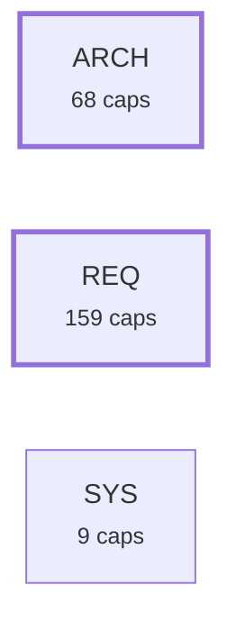
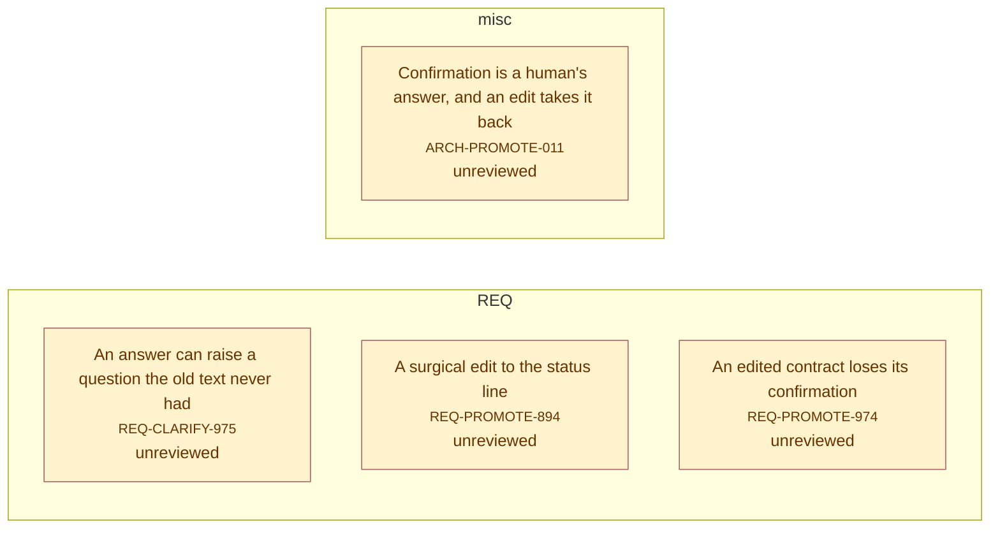

# Requirement Map

## Specification Hierarchy

_The spec hierarchy: system needs -> architecture requirements (`satisfies:`), each box showing how many code-level requirements sit under it. The code level itself is counted, not drawn._


## System Map

_Capabilities grouped by area; thick border = bus; arrows = `depends_on`. Edges into the bus/hubs are hidden (the Dependency Map shows area-level coupling)._

```mermaid
graph LR
  subgraph sg_ARCH["ARCH"]
    ARCH_ACVERIFY_019["Per-criterion test coverage<br><small>ARCH-ACVERIFY-019</small>"]
    ARCH_ATOMICFORM_053["The atomic requirement form<br><small>ARCH-ATOMICFORM-053</small>"]
    ARCH_ATOMICITY_049["Statement atomicity<br><small>ARCH-ATOMICITY-049</small>"]
    ARCH_AUDIT_065["One report of everything the engine can discover<br><small>ARCH-AUDIT-065</small>"]
    ARCH_CANDIDATES_009["Capability candidates (extraction plan)<br><small>ARCH-CANDIDATES-009</small>"]
    ARCH_CHECK_006["The gate<br><small>ARCH-CHECK-006</small>"]
    ARCH_CLARIFY_062["Questions a requirement has not answered<br><small>ARCH-CLARIFY-062</small>"]
    ARCH_CMDREGISTRY_033["CLI command registry + generated integration artifacts<br><small>ARCH-CMDREGISTRY-033</small>"]
    ARCH_CONFIG_060["Per-repo configuration file<br><small>ARCH-CONFIG-060</small>"]
    ARCH_CONTEXT_048["Consolidated Context section<br><small>ARCH-CONTEXT-048</small>"]
    ARCH_COVERAGE_029["Untagged-code coverage signal<br><small>ARCH-COVERAGE-029</small>"]
    ARCH_DECOMPOSE_050["Clause decomposition scaffold<br><small>ARCH-DECOMPOSE-050</small>"]
    ARCH_DESCRIPTION_057["One Description section, and Cases instead of Acceptance<br><small>ARCH-DESCRIPTION-057</small>"]
    ARCH_DESIGN_061["Advisory design review<br><small>ARCH-DESIGN-061</small>"]
    ARCH_DOCBUNDLE_026["Untagged doc-bundle warning<br><small>ARCH-DOCBUNDLE-026</small>"]
    ARCH_DRIFT_003["Contract hashing & lock<br><small>ARCH-DRIFT-003</small>"]
    ARCH_DRIFTIMPACT_035["Drift blast-radius: name dependents<br><small>ARCH-DRIFTIMPACT-035</small>"]
    ARCH_EXCALIDRAW_030["Excalidraw scene builder — core API<br><small>ARCH-EXCALIDRAW-030</small>"]
    ARCH_EXCALIDRAW_031["Excalidraw quality gates<br><small>ARCH-EXCALIDRAW-031</small>"]
    ARCH_EXCALIDRAW_032["Excalidraw builder CLI verbs<br><small>ARCH-EXCALIDRAW-032</small>"]
    ARCH_EXTRACT_008["Legacy extraction<br><small>ARCH-EXTRACT-008</small>"]
    ARCH_FANOUT_052["Hierarchy breadth<br><small>ARCH-FANOUT-052</small>"]
    ARCH_FINDINGS_010["Open-findings report<br><small>ARCH-FINDINGS-010</small>"]
    ARCH_HEALTH_017["Corpus health snapshot<br><small>ARCH-HEALTH-017</small>"]
    ARCH_IMPLEMENT_063["The brief for implementing a requirement<br><small>ARCH-IMPLEMENT-063</small>"]
    ARCH_INIT_012["First-use bootstrap<br><small>ARCH-INIT-012</small>"]
    ARCH_LEVEL_051["Specification level<br><small>ARCH-LEVEL-051</small>"]
    ARCH_LINT_014["Requirement readability linter<br><small>ARCH-LINT-014</small>"]
    ARCH_LINTCHECKS_025["Readability & scope checks<br><small>ARCH-LINTCHECKS-025</small>"]
    ARCH_MAP_007["Requirement graph (_map.json)<br><small>ARCH-MAP-007</small>"]
    ARCH_MAPDIAGRAMS_055["Mermaid diagrams (_map.md)<br><small>ARCH-MAPDIAGRAMS-055</small>"]
    ARCH_MEMBERDRIFT_027["Reverse-direction member drift<br><small>ARCH-MEMBERDRIFT-027</small>"]
    ARCH_MODULEFILE_056["Several requirements in one file<br><small>ARCH-MODULEFILE-056</small>"]
    ARCH_NEW_004["Scaffold a requirement<br><small>ARCH-NEW-004</small>"]
    ARCH_NEXT_013["What-should-I-do-next report<br><small>ARCH-NEXT-013</small>"]
    ARCH_ORPHANCODE_034["Orphan-code warning<br><small>ARCH-ORPHANCODE-034</small>"]
    ARCH_PAGES_021["Publish & gate the GitHub Pages map copy<br><small>ARCH-PAGES-021</small>"]
    ARCH_PARSE_001["Requirement reading<br><small>ARCH-PARSE-001</small>"]
    ARCH_PIPE_046["A closed output pipe ends a command quietly<br><small>ARCH-PIPE-046</small>"]
    ARCH_PROMOTE_011["Confirmation is a human's answer, and an edit takes it back<br><small>ARCH-PROMOTE-011</small>"]
    ARCH_PROMOTE_TODO_001["Promote a TODO item into a requirement draft<br><small>ARCH-PROMOTE-TODO-001</small>"]
    ARCH_PROSE_024["Prose capability classification & drafting<br><small>ARCH-PROSE-024</small>"]
    ARCH_PYFLOOR_040["Declared Python support floor<br><small>ARCH-PYFLOOR-040</small>"]
    ARCH_REDUNDANCY_058["Requirements that say the same thing<br><small>ARCH-REDUNDANCY-058</small>"]
    ARCH_REGISTRYLAG_035["Registry-lag signal — commits since the requirements dir was last touched<br><small>ARCH-REGISTRYLAG-035</small>"]
    ARCH_REPRO_041["Committed build artifacts stay re-derivable<br><small>ARCH-REPRO-041</small>"]
    ARCH_RETIRE_064["Taking a requirement out of service<br><small>ARCH-RETIRE-064</small>"]
    ARCH_REVIEW_022["AI requirement-quality review (deterministic plan + advisory pass)<br><small>ARCH-REVIEW-022</small>"]
    ARCH_REVIEWEDSCORE_109["Reviewed-only health score<br><small>ARCH-REVIEWEDSCORE-109</small>"]
    ARCH_ROADMAP_038["Roadmap coherence signals<br><small>ARCH-ROADMAP-038</small>"]
    ARCH_RULES_059["The gate rule registry<br><small>ARCH-RULES-059</small>"]
    ARCH_SCAN_002["Member discovery<br><small>ARCH-SCAN-002</small>"]
    ARCH_SCANCACHE_023["Opt-in scan cache<br><small>ARCH-SCANCACHE-023</small>"]
    ARCH_SEARCH_036["Free-text requirement search<br><small>ARCH-SEARCH-036</small>"]
    ARCH_SELFGATE_039["This repo's own gate wiring<br><small>ARCH-SELFGATE-039</small>"]
    ARCH_SHOW_015["Single-requirement dossier<br><small>ARCH-SHOW-015</small>"]
    ARCH_SIMILAR_016["Duplicate-capability detector<br><small>ARCH-SIMILAR-016</small>"]
    ARCH_SITE_026["Generate & maintain a project presentation page<br><small>ARCH-SITE-026</small>"]
    ARCH_STALEENGINE_043["Stale vendored engine, reported in CI<br><small>ARCH-STALEENGINE-043</small>"]
    ARCH_SUGGESTVERIFIES_047["Suggest per-criterion 'verifies:' tags<br><small>ARCH-SUGGESTVERIFIES-047</small>"]
    ARCH_TESTLINK_018["Test-link integrity check<br><small>ARCH-TESTLINK-018</small>"]
    ARCH_TRACE_020["Upstream traceability<br><small>ARCH-TRACE-020</small>"]
    ARCH_TRACKED_042["Untracked members reported<br><small>ARCH-TRACKED-042</small>"]
    ARCH_TRANSLATE_044["Reading a cached requirement translation into the map<br><small>ARCH-TRANSLATE-044</small>"]
    ARCH_UNSCANNEDTAG_045["Tags in unscanned file types reported<br><small>ARCH-UNSCANNEDTAG-045</small>"]
    ARCH_VIEWER_007["Self-contained HTML map viewer<br><small>ARCH-VIEWER-007</small>"]
    ARCH_VLEVEL_037["Verification levels<br><small>ARCH-VLEVEL-037</small>"]
    ARCH_VRUNGS_054["Level-to-verification correspondence<br><small>ARCH-VRUNGS-054</small>"]
  end
  subgraph sg_REQ["REQ"]
    REQ_ACVERIFY_821["Mapping verifies tags to labelled criteria<br><small>REQ-ACVERIFY-821</small>"]
    REQ_ACVERIFY_822["When per-criterion coverage stays silent<br><small>REQ-ACVERIFY-822</small>"]
    REQ_ACVERIFY_823["Emitting clauses, covered and gap on the map<br><small>REQ-ACVERIFY-823</small>"]
    REQ_ATOMICITY_824["One obligation per clause, with an advisory length backstop<br><small>REQ-ATOMICITY-824</small>"]
    REQ_ATOMICITY_825["statement-size measures length, not atomicity<br><small>REQ-ATOMICITY-825</small>"]
    REQ_AUDIT_970["Every discovery pass, one report, one exit code<br><small>REQ-AUDIT-970</small>"]
    REQ_AUDIT_971["An exemption nobody justified is itself a finding<br><small>REQ-AUDIT-971</small>"]
    REQ_AUDIT_972["Whether the corpus has a shape at all<br><small>REQ-AUDIT-972</small>"]
    REQ_AUDIT_973["Sync says what it found<br><small>REQ-AUDIT-973</small>"]
    REQ_CANDIDATES_826["The plan's JSON shape and read-only scanning<br><small>REQ-CANDIDATES-826</small>"]
    REQ_CANDIDATES_827["Fields a candidate carries<br><small>REQ-CANDIDATES-827</small>"]
    REQ_CHECK_828["Gate errors that block a commit<br><small>REQ-CHECK-828</small>"]
    REQ_CHECK_829["Contract drift and missing-coverage warnings<br><small>REQ-CHECK-829</small>"]
    REQ_CHECK_830["Milestone shape and lock-file warnings<br><small>REQ-CHECK-830</small>"]
    REQ_CHECK_831["Corpus-health warnings: needs, levels, cycles<br><small>REQ-CHECK-831</small>"]
    REQ_CHECK_832["What the gate prints beyond pass or fail<br><small>REQ-CHECK-832</small>"]
    REQ_CHECK_833["Advancing the lock file<br><small>REQ-CHECK-833</small>"]
    REQ_CLARIFY_956["Detecting what a requirement leaves open<br><small>REQ-CLARIFY-956</small>"]
    REQ_CLARIFY_957["Reporting the open questions<br><small>REQ-CLARIFY-957</small>"]
    REQ_CLARIFY_975["An answer can raise a question the old text never had<br><small>REQ-CLARIFY-975</small>"]
    REQ_CMDREGISTRY_834["One COMMANDS dict drives argparse, schema and docs<br><small>REQ-CMDREGISTRY-834</small>"]
    REQ_CMDREGISTRY_963["The command registry as data on the map<br><small>REQ-CMDREGISTRY-963</small>"]
    REQ_CONFIG_949["Reading and applying '_config.json'<br><small>REQ-CONFIG-949</small>"]
    REQ_CONTEXT_835["One Context section replaces three near-synonymous headings<br><small>REQ-CONTEXT-835</small>"]
    REQ_COVERAGE_836["Counting untagged code as a read-only signal<br><small>REQ-COVERAGE-836</small>"]
    REQ_DECOMPOSE_837["--decompose is opt-in; the default lint run never writes<br><small>REQ-DECOMPOSE-837</small>"]
    REQ_DECOMPOSE_838["A created draft's shape: status, parent link, seeded clause, id<br><small>REQ-DECOMPOSE-838</small>"]
    REQ_DECOMPOSE_839["The parent never changes, and the command knows its own limits<br><small>REQ-DECOMPOSE-839</small>"]
    REQ_DESIGN_950["Encapsulation and abstraction candidates<br><small>REQ-DESIGN-950</small>"]
    REQ_DESIGN_951["Inheritance and polymorphism candidates<br><small>REQ-DESIGN-951</small>"]
    REQ_DESIGN_952["The 'design' report<br><small>REQ-DESIGN-952</small>"]
    REQ_DESIGN_953["Code-writing standards<br><small>REQ-DESIGN-953</small>"]
    REQ_DESIGN_954["Design health in the map<br><small>REQ-DESIGN-954</small>"]
    REQ_DESIGN_955["Brace-language heuristics<br><small>REQ-DESIGN-955</small>"]
    REQ_DESIGN_976["Design candidates in the map<br><small>REQ-DESIGN-976</small>"]
    REQ_DESIGN_978["Class metrics, the C&K half that applies<br><small>REQ-DESIGN-978</small>"]
    REQ_DESIGN_979["What the review could not measure<br><small>REQ-DESIGN-979</small>"]
    REQ_DESIGN_980["The metrics that did not survive calibration<br><small>REQ-DESIGN-980</small>"]
    REQ_DOCBUNDLE_840["Flagging a large, unlinked docs/ HTML bundle<br><small>REQ-DOCBUNDLE-840</small>"]
    REQ_DRIFT_841["Hashing only the normative sections<br><small>REQ-DRIFT-841</small>"]
    REQ_DRIFT_842["Reading and writing the drift baseline<br><small>REQ-DRIFT-842</small>"]
    REQ_DRIFTIMPACT_843["Name a drifted requirement's direct dependents<br><small>REQ-DRIFTIMPACT-843</small>"]
    REQ_EXCALIDRAW_844["Shape, layout, and annotation vocabulary<br><small>REQ-EXCALIDRAW-844</small>"]
    REQ_EXCALIDRAW_845["Connectors and the save() contract<br><small>REQ-EXCALIDRAW-845</small>"]
    REQ_EXCALIDRAW_846["Named gates: crossing, legend, and overflow checks<br><small>REQ-EXCALIDRAW-846</small>"]
    REQ_EXCALIDRAW_847["Text-overlap, label-fit gates, and the two hard gates<br><small>REQ-EXCALIDRAW-847</small>"]
    REQ_EXCALIDRAW_848["Smoke test, render and discover verbs<br><small>REQ-EXCALIDRAW-848</small>"]
    REQ_EXTRACT_849["Which files draft walks<br><small>REQ-EXTRACT-849</small>"]
    REQ_EXTRACT_850["Writing one draft proposal per file<br><small>REQ-EXTRACT-850</small>"]
    REQ_EXTRACT_851["Scoring risk and capturing an authoring hint<br><small>REQ-EXTRACT-851</small>"]
    REQ_FANOUT_852["Counting children and reporting an out-of-band parent<br><small>REQ-FANOUT-852</small>"]
    REQ_FINDINGS_853["Collecting open verify-intent bullets<br><small>REQ-FINDINGS-853</small>"]
    REQ_FINDINGS_854["The raw findings report<br><small>REQ-FINDINGS-854</small>"]
    REQ_FINDINGS_855["The triaged findings report<br><small>REQ-FINDINGS-855</small>"]
    REQ_FINDINGS_856["Findings integration with map and gate<br><small>REQ-FINDINGS-856</small>"]
    REQ_HEALTH_857["health is a read-only snapshot of the whole corpus<br><small>REQ-HEALTH-857</small>"]
    REQ_HEALTH_858["The headline score: green means every axis passes at once<br><small>REQ-HEALTH-858</small>"]
    REQ_HEALTH_859["Component counts, --json parity, and an always-zero exit<br><small>REQ-HEALTH-859</small>"]
    REQ_HEALTH_968["The health record travels with the map<br><small>REQ-HEALTH-968</small>"]
    REQ_IMPLEMENT_958["What the implementation brief states<br><small>REQ-IMPLEMENT-958</small>"]
    REQ_IMPLEMENT_959["Pointing at where this kind of code lives<br><small>REQ-IMPLEMENT-959</small>"]
    REQ_INIT_860["Scaffolding the requirements folder and a starter .reqmapignore<br><small>REQ-INIT-860</small>"]
    REQ_INIT_861["Running draft, lock, and map in a fixed order<br><small>REQ-INIT-861</small>"]
    REQ_LEVEL_862["The level field, validated independently of layer<br><small>REQ-LEVEL-862</small>"]
    REQ_LINT_863["What lint checks and skips<br><small>REQ-LINT-863</small>"]
    REQ_LINT_864["Where the prose checks read from, and what fails a strict run<br><small>REQ-LINT-864</small>"]
    REQ_LINTCHECKS_865["Readability checks: length, stacking, anonymous subjects<br><small>REQ-LINTCHECKS-865</small>"]
    REQ_LINTCHECKS_866["Scope checks: acceptance count, over-scoping, file spread<br><small>REQ-LINTCHECKS-866</small>"]
    REQ_LINTCHECKS_867["Atomic-form parity and layer-mismatch checks<br><small>REQ-LINTCHECKS-867</small>"]
    REQ_LINTCHECKS_868["The vague-term check<br><small>REQ-LINTCHECKS-868</small>"]
    REQ_LINTCHECKS_869["The redundant-modal check<br><small>REQ-LINTCHECKS-869</small>"]
    REQ_MAP_870["Generating _map.json's node graph<br><small>REQ-MAP-870</small>"]
    REQ_MAP_871["Repo, engine version, todos, and freshness checking<br><small>REQ-MAP-871</small>"]
    REQ_MAP_872["Reading contract clauses across wrapped lines<br><small>REQ-MAP-872</small>"]
    REQ_MAP_873["Deduping intent against the contract<br><small>REQ-MAP-873</small>"]
    REQ_MAPDIAGRAMS_874["_map.md: five legended, always-regenerated Mermaid blocks<br><small>REQ-MAPDIAGRAMS-874</small>"]
    REQ_MAPDIAGRAMS_875["Specification Hierarchy: satisfies edges only, code counted not drawn<br><small>REQ-MAPDIAGRAMS-875</small>"]
    REQ_MAPDIAGRAMS_876["System Map: per-area subgraphs, bus edges hidden<br><small>REQ-MAPDIAGRAMS-876</small>"]
    REQ_MAPDIAGRAMS_877["Dependency Map is area-level; Req→Code colors and collapses lines<br><small>REQ-MAPDIAGRAMS-877</small>"]
    REQ_MAPDIAGRAMS_878["Risk diagram: only flagged requirements, each with advice<br><small>REQ-MAPDIAGRAMS-878</small>"]
    REQ_MEMBERDRIFT_879["The member-hash sidecar<br><small>REQ-MEMBERDRIFT-879</small>"]
    REQ_MEMBERDRIFT_880["Warning when code moves ahead of its spec<br><small>REQ-MEMBERDRIFT-880</small>"]
    REQ_NEW_881["Stamping a fresh requirement file from a template<br><small>REQ-NEW-881</small>"]
    REQ_NEW_882["Refusing to clobber, and a scaffold that lints clean<br><small>REQ-NEW-882</small>"]
    REQ_NEXT_883["next reads the same risk signals the Risk tab reads<br><small>REQ-NEXT-883</small>"]
    REQ_NEXT_884["Four action buckets, two advisory ones, and untagged files<br><small>REQ-NEXT-884</small>"]
    REQ_NEXT_885["Priority, then risk score, then id decide bucket order<br><small>REQ-NEXT-885</small>"]
    REQ_NEXT_886["Each bucket truncates to a top few, --all shows everything<br><small>REQ-NEXT-886</small>"]
    REQ_NEXT_887["An empty registry and a clean one get different messages<br><small>REQ-NEXT-887</small>"]
    REQ_ORPHANCODE_888["Warning on a sizeable file with no requirement link<br><small>REQ-ORPHANCODE-888</small>"]
    REQ_PAGES_889["Publish docs/map.html and flag it when it drifts<br><small>REQ-PAGES-889</small>"]
    REQ_PARSE_890["load_requirements returns one meta/body/path record per file<br><small>REQ-PARSE-890</small>"]
    REQ_PARSE_891["The hand-rolled frontmatter grammar: scalars and lists only<br><small>REQ-PARSE-891</small>"]
    REQ_PARSE_892["Missing frontmatter, underscore files, and a BOM never crash the reader<br><small>REQ-PARSE-892</small>"]
    REQ_PIPE_893["A closed reader ends the command with exit 0<br><small>REQ-PIPE-893</small>"]
    REQ_PROMOTE_894["A surgical edit to the status line<br><small>REQ-PROMOTE-894</small>"]
    REQ_PROMOTE_974["An edited contract loses its confirmation<br><small>REQ-PROMOTE-974</small>"]
    REQ_PROMOTE_TODO_897["Scaffolding a draft from a matched TODO item<br><small>REQ-PROMOTE-TODO-897</small>"]
    REQ_PROMOTE_TODO_898["Refusing an unresolvable promotion<br><small>REQ-PROMOTE-TODO-898</small>"]
    REQ_PROMOTE_TODO_899["TODO.md stays untouched unless --mark-done asks otherwise<br><small>REQ-PROMOTE-TODO-899</small>"]
    REQ_PROSE_900["Sorting prose files into three drafting buckets<br><small>REQ-PROSE-900</small>"]
    REQ_PROSE_901["Scaffolding a draft from a prose file's own headings<br><small>REQ-PROSE-901</small>"]
    REQ_PYFLOOR_902["Refusing an interpreter below the declared floor<br><small>REQ-PYFLOOR-902</small>"]
    REQ_REGISTRYLAG_903["Counting commits since the registry last moved<br><small>REQ-REGISTRYLAG-903</small>"]
    REQ_REGISTRYLAG_904["Reporting lag without ever gating on it<br><small>REQ-REGISTRYLAG-904</small>"]
    REQ_REPRO_905["Rebuilding and diffing each committed artifact in CI<br><small>REQ-REPRO-905</small>"]
    REQ_RETIRE_960["The blast radius of a retirement<br><small>REQ-RETIRE-960</small>"]
    REQ_RETIRE_961["Deprecating, refusing, and never writing by accident<br><small>REQ-RETIRE-961</small>"]
    REQ_RETIRE_962["Deleting a requirement without deleting meaning<br><small>REQ-RETIRE-962</small>"]
    REQ_REVIEW_906["A deterministic plan for an out-of-band AI review<br><small>REQ-REVIEW-906</small>"]
    REQ_ROADMAP_907["A behind roadmap and an unversioned heading, both read-only<br><small>REQ-ROADMAP-907</small>"]
    REQ_RULES_947["One registry of gate rules<br><small>REQ-RULES-947</small>"]
    REQ_RULES_948["Codes on every finding, and per-requirement exemption<br><small>REQ-RULES-948</small>"]
    REQ_SCAN_908["scan_members walks the tree and collects role: ID tags<br><small>REQ-SCAN-908</small>"]
    REQ_SCAN_909["One tag can bind several requirements, and directories are pruned<br><small>REQ-SCAN-909</small>"]
    REQ_SCANCACHE_911["Caching scan results without changing them<br><small>REQ-SCANCACHE-911</small>"]
    REQ_SEARCH_912["Ranking a query against the corpus<br><small>REQ-SEARCH-912</small>"]
    REQ_SEARCH_913["Printing ranked matches with their score<br><small>REQ-SEARCH-913</small>"]
    REQ_SEARCH_914["The relevance floor and the empty-query message<br><small>REQ-SEARCH-914</small>"]
    REQ_SEARCH_915["Search always exits zero on a well-formed query<br><small>REQ-SEARCH-915</small>"]
    REQ_SEARCH_965["Finding a requirement by its id, and by its literal text<br><small>REQ-SEARCH-965</small>"]
    REQ_SELFGATE_916["Five files wire the gate into CI, hooks, and a consumer's Action<br><small>REQ-SELFGATE-916</small>"]
    REQ_SHOW_917["A one-screen header, intent and contract<br><small>REQ-SHOW-917</small>"]
    REQ_SHOW_918["Dependencies both ways, and the code members<br><small>REQ-SHOW-918</small>"]
    REQ_SHOW_919["Open questions, risk signals, and a caller-visible exit code<br><small>REQ-SHOW-919</small>"]
    REQ_SIMILAR_920["Reporting overlapping requirement pairs<br><small>REQ-SIMILAR-920</small>"]
    REQ_SIMILAR_921["Building the comparison bag of words<br><small>REQ-SIMILAR-921</small>"]
    REQ_SIMILAR_922["Weighting terms and scoring a pair<br><small>REQ-SIMILAR-922</small>"]
    REQ_SIMILAR_923["The relevance threshold and report format<br><small>REQ-SIMILAR-923</small>"]
    REQ_SITE_924["Inject engine-owned regions into a presentation page<br><small>REQ-SITE-924</small>"]
    REQ_STALEENGINE_925["The gate action reports a stale vendored engine<br><small>REQ-STALEENGINE-925</small>"]
    REQ_STALEENGINE_926["The staleness probe fails open, never the gate itself<br><small>REQ-STALEENGINE-926</small>"]
    REQ_SUGGESTVERIFIES_927["Proposing a tag from a matching test name<br><small>REQ-SUGGESTVERIFIES-927</small>"]
    REQ_SUGGESTVERIFIES_928["Refusing a match that could be wrong<br><small>REQ-SUGGESTVERIFIES-928</small>"]
    REQ_SUGGESTVERIFIES_929["A dry run by default, --apply to write<br><small>REQ-SUGGESTVERIFIES-929</small>"]
    REQ_TESTLINK_930["Checking every tested-by link, at every status<br><small>REQ-TESTLINK-930</small>"]
    REQ_TESTLINK_931["Recognizing a test function by shape, not by parsing<br><small>REQ-TESTLINK-931</small>"]
    REQ_TESTLINK_932["Recognizing Rust, shell, and stdlib-style test entry points<br><small>REQ-TESTLINK-932</small>"]
    REQ_TESTLINK_933["Reporting a broken link as a warning, never an error<br><small>REQ-TESTLINK-933</small>"]
    REQ_TRACE_934["Declaring and checking a satisfies: link<br><small>REQ-TRACE-934</small>"]
    REQ_TRACE_935["How need and aggregate layers are exempt from code checks<br><small>REQ-TRACE-935</small>"]
    REQ_TRACKED_936["Warning when a member is not tracked by git<br><small>REQ-TRACKED-936</small>"]
    REQ_TRANSLATE_937["The cache key, and the promise that nothing shells out<br><small>REQ-TRANSLATE-937</small>"]
    REQ_TRANSLATE_938["Reading the cache: fresh only, and failing open<br><small>REQ-TRANSLATE-938</small>"]
    REQ_TRANSLATE_967["A translation may not carry a field the requirement does not<br><small>REQ-TRANSLATE-967</small>"]
    REQ_UNSCANNEDTAG_939["Warning about a tag the scan never reads<br><small>REQ-UNSCANNEDTAG-939</small>"]
    REQ_VIEWER_940["Writing _map.html from the vendored template<br><small>REQ-VIEWER-940</small>"]
    REQ_VIEWER_941["Escaping the inlined graph for embedded ‹script›<br><small>REQ-VIEWER-941</small>"]
    REQ_VIEWER_942["Ranking nodes and rendering acceptance criteria as authored<br><small>REQ-VIEWER-942</small>"]
    REQ_VIEWER_943["UI chrome language, requirement content untranslated<br><small>REQ-VIEWER-943</small>"]
    REQ_VIEWER_944["Cross-references and header fields in a rendered spec<br><small>REQ-VIEWER-944</small>"]
    REQ_VIEWER_945["Scoping the outline from the registry tally<br><small>REQ-VIEWER-945</small>"]
    REQ_VIEWER_964["The command reference, in the reader's language<br><small>REQ-VIEWER-964</small>"]
    REQ_VIEWER_966["One inbox, with the origin of a signal as a tab<br><small>REQ-VIEWER-966</small>"]
    REQ_VIEWER_969["Two engine-emitted readings in the rail<br><small>REQ-VIEWER-969</small>"]
    REQ_VIEWER_977["The advisory design tab<br><small>REQ-VIEWER-977</small>"]
    REQ_VLEVEL_944["A tested-by tag may carry a level suffix<br><small>REQ-VLEVEL-944</small>"]
    REQ_VLEVEL_945["scan_test_levels collects real levels, not documented examples<br><small>REQ-VLEVEL-945</small>"]
    REQ_VLEVEL_946["The gate reads levels: unvalidated needs, system-only bus code<br><small>REQ-VLEVEL-946</small>"]
  end
  subgraph sg_SYS["SYS"]
    SYS_AUTHOR_101["Authoring and evolving a requirement<br><small>SYS-AUTHOR-101</small>"]
    SYS_GATE_102["Keeping code and specification in step<br><small>SYS-GATE-102</small>"]
    SYS_QUALITY_104["Keeping requirements readable<br><small>SYS-QUALITY-104</small>"]
    SYS_READ_103["Reading a repository<br><small>SYS-READ-103</small>"]
    SYS_REPORT_105["Answering what is here and what to do next<br><small>SYS-REPORT-105</small>"]
    SYS_SHIP_108["Adopting and shipping the engine<br><small>SYS-SHIP-108</small>"]
    SYS_SSOT_001["Stakeholder need — specs and code stay in sync<br><small>SYS-SSOT-001</small>"]
    SYS_VISUAL_106["Seeing the system at a glance<br><small>SYS-VISUAL-106</small>"]
    SYS_VMODEL_107["Placing a requirement in the V<br><small>SYS-VMODEL-107</small>"]
  end
  ARCH_ATOMICITY_049 --> ARCH_LINT_014
  ARCH_AUDIT_065 --> ARCH_NEXT_013
  ARCH_AUDIT_065 --> ARCH_SIMILAR_016
  ARCH_AUDIT_065 --> ARCH_COVERAGE_029
  ARCH_AUDIT_065 --> ARCH_DESIGN_061
  ARCH_COVERAGE_029 --> ARCH_NEXT_013
  ARCH_DECOMPOSE_050 --> ARCH_ATOMICITY_049
  ARCH_DECOMPOSE_050 --> ARCH_LINT_014
  ARCH_DECOMPOSE_050 --> ARCH_NEW_004
  ARCH_DESIGN_061 --> ARCH_CMDREGISTRY_033
  ARCH_EXCALIDRAW_031 --> ARCH_EXCALIDRAW_030
  ARCH_EXCALIDRAW_032 --> ARCH_EXCALIDRAW_030
  ARCH_FANOUT_052 --> ARCH_LINT_014
  ARCH_FANOUT_052 --> ARCH_LEVEL_051
  ARCH_IMPLEMENT_063 --> ARCH_SIMILAR_016
  ARCH_IMPLEMENT_063 --> ARCH_CLARIFY_062
  ARCH_INIT_012 --> ARCH_EXTRACT_008
  ARCH_LINTCHECKS_025 --> ARCH_LINT_014
  ARCH_PIPE_046 --> ARCH_CMDREGISTRY_033
  ARCH_PROMOTE_TODO_001 --> ARCH_NEW_004
  ARCH_PROSE_024 --> ARCH_EXTRACT_008
  ARCH_REDUNDANCY_058 --> ARCH_NEXT_013
  ARCH_REDUNDANCY_058 --> ARCH_SIMILAR_016
  ARCH_REGISTRYLAG_035 --> ARCH_HEALTH_017
  ARCH_REPRO_041 --> ARCH_SELFGATE_039
  ARCH_REVIEWEDSCORE_109 --> ARCH_HEALTH_017
  ARCH_ROADMAP_038 --> ARCH_HEALTH_017
  ARCH_SEARCH_036 --> ARCH_SIMILAR_016
  ARCH_SITE_026 --> ARCH_VIEWER_007
  ARCH_SITE_026 --> ARCH_PAGES_021
  ARCH_STALEENGINE_043 --> ARCH_SELFGATE_039
  ARCH_SUGGESTVERIFIES_047 --> ARCH_ACVERIFY_019
  ARCH_TRANSLATE_044 --> ARCH_VIEWER_007
  ARCH_VRUNGS_054 --> ARCH_LEVEL_051
  ARCH_VRUNGS_054 --> ARCH_VLEVEL_037
  style ARCH_CONFIG_060 stroke-width:3px
  style REQ_CONFIG_949 stroke-width:3px
  style ARCH_DESCRIPTION_057 stroke-width:3px
  style ARCH_DRIFT_003 stroke-width:3px
  style REQ_DRIFT_841 stroke-width:3px
  style REQ_DRIFT_842 stroke-width:3px
  style ARCH_MODULEFILE_056 stroke-width:3px
  style ARCH_PARSE_001 stroke-width:3px
  style REQ_PARSE_890 stroke-width:3px
  style REQ_PARSE_891 stroke-width:3px
  style REQ_PARSE_892 stroke-width:3px
  style ARCH_RULES_059 stroke-width:3px
  style REQ_RULES_947 stroke-width:3px
  style REQ_RULES_948 stroke-width:3px
  style ARCH_SCAN_002 stroke-width:3px
  style REQ_SCAN_908 stroke-width:3px
  style REQ_SCAN_909 stroke-width:3px
```

## Requirement-to-Code

_Each system/architecture requirement → its code; arrow label = role (`implements` / `tested-by`). Red = confirmed but no code linked (a gap); grey = baseline/draft, not linked yet (expected). Code-level requirements are omitted here (see the viewer)._

```mermaid
graph LR
  ARCH_ACVERIFY_019["Per-criterion test coverage<br><small>ARCH-ACVERIFY-019</small>"]
  f_plugin_scripts_reqmap_py_1283_3958["plugin/scripts/reqmap.py:1283-3958"]
  ARCH_ACVERIFY_019 -->|implements| f_plugin_scripts_reqmap_py_1283_3958
  f_plugin_scripts_test_reqmap_py_3876_6224["plugin/scripts/test_reqmap.py:3876-6224"]
  ARCH_ACVERIFY_019 -->|tested-by| f_plugin_scripts_test_reqmap_py_3876_6224
  ARCH_ATOMICFORM_053["The atomic requirement form<br><small>ARCH-ATOMICFORM-053</small>"]
  f_plugin_scripts_reqmap_py_1748_6419["plugin/scripts/reqmap.py:1748-6419"]
  ARCH_ATOMICFORM_053 -->|implements| f_plugin_scripts_reqmap_py_1748_6419
  f_plugin_scripts_test_reqmap_py_7366["plugin/scripts/test_reqmap.py:7366"]
  ARCH_ATOMICFORM_053 -->|tested-by| f_plugin_scripts_test_reqmap_py_7366
  ARCH_ATOMICITY_049["Statement atomicity<br><small>ARCH-ATOMICITY-049</small>"]
  f_plugin_scripts_reqmap_py_4555_4563["plugin/scripts/reqmap.py:4555-4563"]
  ARCH_ATOMICITY_049 -->|implements| f_plugin_scripts_reqmap_py_4555_4563
  f_plugin_scripts_test_reqmap_py_6971_9260["plugin/scripts/test_reqmap.py:6971-9260"]
  ARCH_ATOMICITY_049 -->|tested-by| f_plugin_scripts_test_reqmap_py_6971_9260
  ARCH_AUDIT_065["One report of everything the engine can discover<br><small>ARCH-AUDIT-065</small>"]
  f_plugin_scripts_reqmap_py_2731_5594["plugin/scripts/reqmap.py:2731-5594"]
  ARCH_AUDIT_065 -->|implements| f_plugin_scripts_reqmap_py_2731_5594
  f_plugin_scripts_test_reqmap_py_8069["plugin/scripts/test_reqmap.py:8069"]
  ARCH_AUDIT_065 -->|tested-by| f_plugin_scripts_test_reqmap_py_8069
  ARCH_CANDIDATES_009["Capability candidates (extraction plan)<br><small>ARCH-CANDIDATES-009</small>"]
  f_plugin_scripts_reqmap_py_3535_3701["plugin/scripts/reqmap.py:3535-3701"]
  ARCH_CANDIDATES_009 -->|implements| f_plugin_scripts_reqmap_py_3535_3701
  f_plugin_scripts_test_reqmap_py_1202_9695["plugin/scripts/test_reqmap.py:1202-9695"]
  ARCH_CANDIDATES_009 -->|tested-by| f_plugin_scripts_test_reqmap_py_1202_9695
  ARCH_CHECK_006["The gate<br><small>ARCH-CHECK-006</small>"]
  f_docs_full_architecture_html_4["docs/full_architecture.html:4"]
  ARCH_CHECK_006 -->|generated-from| f_docs_full_architecture_html_4
  f_plugin_scripts_reqmap_py_1878_7351["plugin/scripts/reqmap.py:1878-7351"]
  ARCH_CHECK_006 -->|implements| f_plugin_scripts_reqmap_py_1878_7351
  f_plugin_scripts_test_reqmap_py_145_9652["plugin/scripts/test_reqmap.py:145-9652"]
  ARCH_CHECK_006 -->|tested-by| f_plugin_scripts_test_reqmap_py_145_9652
  ARCH_CLARIFY_062["Questions a requirement has not answered<br><small>ARCH-CLARIFY-062</small>"]
  f_plugin_scripts_reqmap_py_7881_7973["plugin/scripts/reqmap.py:7881-7973"]
  ARCH_CLARIFY_062 -->|implements| f_plugin_scripts_reqmap_py_7881_7973
  f_plugin_scripts_test_reqmap_py_10185_10883["plugin/scripts/test_reqmap.py:10185-10883"]
  ARCH_CLARIFY_062 -->|tested-by| f_plugin_scripts_test_reqmap_py_10185_10883
  ARCH_CMDREGISTRY_033["CLI command registry + generated integration artifacts<br><small>ARCH-CMDREGISTRY-033</small>"]
  f_plugin_scripts_reqmap_py_262_9179["plugin/scripts/reqmap.py:262-9179"]
  ARCH_CMDREGISTRY_033 -->|implements| f_plugin_scripts_reqmap_py_262_9179
  f_plugin_scripts_test_reqmap_py_6049_10549["plugin/scripts/test_reqmap.py:6049-10549"]
  ARCH_CMDREGISTRY_033 -->|tested-by| f_plugin_scripts_test_reqmap_py_6049_10549
  ARCH_CONFIG_060["Per-repo configuration file<br><small>ARCH-CONFIG-060</small>"]
  f_plugin_scripts_reqmap_py_9129_9448["plugin/scripts/reqmap.py:9129-9448"]
  ARCH_CONFIG_060 -->|implements| f_plugin_scripts_reqmap_py_9129_9448
  f_plugin_scripts_test_reqmap_py_7956["plugin/scripts/test_reqmap.py:7956"]
  ARCH_CONFIG_060 -->|tested-by| f_plugin_scripts_test_reqmap_py_7956
  ARCH_CONTEXT_048["Consolidated Context section<br><small>ARCH-CONTEXT-048</small>"]
  f_plugin_scripts_reqmap_py_6489["plugin/scripts/reqmap.py:6489"]
  ARCH_CONTEXT_048 -->|implements| f_plugin_scripts_reqmap_py_6489
  f_plugin_scripts_test_reqmap_py_1679_8914["plugin/scripts/test_reqmap.py:1679-8914"]
  ARCH_CONTEXT_048 -->|tested-by| f_plugin_scripts_test_reqmap_py_1679_8914
  ARCH_COVERAGE_029["Untagged-code coverage signal<br><small>ARCH-COVERAGE-029</small>"]
  f_plugin_scripts_reqmap_py_1592_5971["plugin/scripts/reqmap.py:1592-5971"]
  ARCH_COVERAGE_029 -->|implements| f_plugin_scripts_reqmap_py_1592_5971
  f_plugin_scripts_test_reqmap_py_3577["plugin/scripts/test_reqmap.py:3577"]
  ARCH_COVERAGE_029 -->|tested-by| f_plugin_scripts_test_reqmap_py_3577
  ARCH_DECOMPOSE_050["Clause decomposition scaffold<br><small>ARCH-DECOMPOSE-050</small>"]
  f_plugin_scripts_reqmap_py_2340_5033["plugin/scripts/reqmap.py:2340-5033"]
  ARCH_DECOMPOSE_050 -->|implements| f_plugin_scripts_reqmap_py_2340_5033
  f_plugin_scripts_test_reqmap_py_7049_9369["plugin/scripts/test_reqmap.py:7049-9369"]
  ARCH_DECOMPOSE_050 -->|tested-by| f_plugin_scripts_test_reqmap_py_7049_9369
  ARCH_DESCRIPTION_057["One Description section, and Cases instead of Acceptance<br><small>ARCH-DESCRIPTION-057</small>"]
  f_docs_full_architecture_html_4["docs/full_architecture.html:4"]
  ARCH_DESCRIPTION_057 -->|generated-from| f_docs_full_architecture_html_4
  f_plugin_scripts_reqmap_py_1849_2238["plugin/scripts/reqmap.py:1849-2238"]
  ARCH_DESCRIPTION_057 -->|implements| f_plugin_scripts_reqmap_py_1849_2238
  f_plugin_scripts_test_reqmap_py_7668["plugin/scripts/test_reqmap.py:7668"]
  ARCH_DESCRIPTION_057 -->|tested-by| f_plugin_scripts_test_reqmap_py_7668
  ARCH_DESIGN_061["Advisory design review<br><small>ARCH-DESIGN-061</small>"]
  f_plugin_scripts_reqmap_py_8548_9062["plugin/scripts/reqmap.py:8548-9062"]
  ARCH_DESIGN_061 -->|implements| f_plugin_scripts_reqmap_py_8548_9062
  f_plugin_scripts_test_reqmap_py_8222["plugin/scripts/test_reqmap.py:8222"]
  ARCH_DESIGN_061 -->|tested-by| f_plugin_scripts_test_reqmap_py_8222
  ARCH_DOCBUNDLE_026["Untagged doc-bundle warning<br><small>ARCH-DOCBUNDLE-026</small>"]
  f_plugin_scripts_reqmap_py_1552_2779["plugin/scripts/reqmap.py:1552-2779"]
  ARCH_DOCBUNDLE_026 -->|implements| f_plugin_scripts_reqmap_py_1552_2779
  f_plugin_scripts_test_reqmap_py_587["plugin/scripts/test_reqmap.py:587"]
  ARCH_DOCBUNDLE_026 -->|tested-by| f_plugin_scripts_test_reqmap_py_587
  ARCH_DRIFT_003["Contract hashing & lock<br><small>ARCH-DRIFT-003</small>"]
  f_docs_full_architecture_html_4["docs/full_architecture.html:4"]
  ARCH_DRIFT_003 -->|generated-from| f_docs_full_architecture_html_4
  f_plugin_scripts_reqmap_py_1960_2750["plugin/scripts/reqmap.py:1960-2750"]
  ARCH_DRIFT_003 -->|implements| f_plugin_scripts_reqmap_py_1960_2750
  f_plugin_scripts_test_reqmap_py_155_10864["plugin/scripts/test_reqmap.py:155-10864"]
  ARCH_DRIFT_003 -->|tested-by| f_plugin_scripts_test_reqmap_py_155_10864
  ARCH_DRIFTIMPACT_035["Drift blast-radius: name dependents<br><small>ARCH-DRIFTIMPACT-035</small>"]
  f_plugin_scripts_reqmap_py_2750["plugin/scripts/reqmap.py:2750"]
  ARCH_DRIFTIMPACT_035 -->|implements| f_plugin_scripts_reqmap_py_2750
  f_plugin_scripts_test_reqmap_py_802_9713["plugin/scripts/test_reqmap.py:802-9713"]
  ARCH_DRIFTIMPACT_035 -->|tested-by| f_plugin_scripts_test_reqmap_py_802_9713
  ARCH_EXCALIDRAW_030["Excalidraw scene builder — core API<br><small>ARCH-EXCALIDRAW-030</small>"]
  f_plugin_skills_excalidraw_diagram_scripts_excalidraw_builder_py_2["plugin/skills/excalidraw-diagram/scripts/excalidraw_builder.py:2"]
  ARCH_EXCALIDRAW_030 -->|implements| f_plugin_skills_excalidraw_diagram_scripts_excalidraw_builder_py_2
  f_plugin_skills_excalidraw_diagram_scripts_test_excalidraw_py_2["plugin/skills/excalidraw-diagram/scripts/test_excalidraw.py:2"]
  ARCH_EXCALIDRAW_030 -->|tested-by| f_plugin_skills_excalidraw_diagram_scripts_test_excalidraw_py_2
  ARCH_EXCALIDRAW_031["Excalidraw quality gates<br><small>ARCH-EXCALIDRAW-031</small>"]
  f_plugin_skills_excalidraw_diagram_scripts_excalidraw_builder_py_3["plugin/skills/excalidraw-diagram/scripts/excalidraw_builder.py:3"]
  ARCH_EXCALIDRAW_031 -->|implements| f_plugin_skills_excalidraw_diagram_scripts_excalidraw_builder_py_3
  f_plugin_skills_excalidraw_diagram_scripts_test_excalidraw_py_3["plugin/skills/excalidraw-diagram/scripts/test_excalidraw.py:3"]
  ARCH_EXCALIDRAW_031 -->|tested-by| f_plugin_skills_excalidraw_diagram_scripts_test_excalidraw_py_3
  ARCH_EXCALIDRAW_032["Excalidraw builder CLI verbs<br><small>ARCH-EXCALIDRAW-032</small>"]
  f_plugin_skills_excalidraw_diagram_scripts_excalidraw_builder_py_4["plugin/skills/excalidraw-diagram/scripts/excalidraw_builder.py:4"]
  ARCH_EXCALIDRAW_032 -->|implements| f_plugin_skills_excalidraw_diagram_scripts_excalidraw_builder_py_4
  f_plugin_skills_excalidraw_diagram_scripts_test_excalidraw_py_4["plugin/skills/excalidraw-diagram/scripts/test_excalidraw.py:4"]
  ARCH_EXCALIDRAW_032 -->|tested-by| f_plugin_skills_excalidraw_diagram_scripts_test_excalidraw_py_4
  ARCH_EXTRACT_008["Legacy extraction<br><small>ARCH-EXTRACT-008</small>"]
  f_plugin_scripts_reqmap_py_3332_3513["plugin/scripts/reqmap.py:3332-3513"]
  ARCH_EXTRACT_008 -->|implements| f_plugin_scripts_reqmap_py_3332_3513
  f_plugin_scripts_test_reqmap_py_1056_9521["plugin/scripts/test_reqmap.py:1056-9521"]
  ARCH_EXTRACT_008 -->|tested-by| f_plugin_scripts_test_reqmap_py_1056_9521
  ARCH_FANOUT_052["Hierarchy breadth<br><small>ARCH-FANOUT-052</small>"]
  f_plugin_scripts_reqmap_py_4881_5057["plugin/scripts/reqmap.py:4881-5057"]
  ARCH_FANOUT_052 -->|implements| f_plugin_scripts_reqmap_py_4881_5057
  f_plugin_scripts_test_reqmap_py_7292_9321["plugin/scripts/test_reqmap.py:7292-9321"]
  ARCH_FANOUT_052 -->|tested-by| f_plugin_scripts_test_reqmap_py_7292_9321
  ARCH_FINDINGS_010["Open-findings report<br><small>ARCH-FINDINGS-010</small>"]
  f_plugin_scripts_reqmap_py_3824_6469["plugin/scripts/reqmap.py:3824-6469"]
  ARCH_FINDINGS_010 -->|implements| f_plugin_scripts_reqmap_py_3824_6469
  f_plugin_scripts_test_reqmap_py_1275_8965["plugin/scripts/test_reqmap.py:1275-8965"]
  ARCH_FINDINGS_010 -->|tested-by| f_plugin_scripts_test_reqmap_py_1275_8965
  ARCH_HEALTH_017["Corpus health snapshot<br><small>ARCH-HEALTH-017</small>"]
  f_plugin_scripts_reqmap_py_2883_5940["plugin/scripts/reqmap.py:2883-5940"]
  ARCH_HEALTH_017 -->|implements| f_plugin_scripts_reqmap_py_2883_5940
  f_plugin_scripts_test_reqmap_py_3449_9133["plugin/scripts/test_reqmap.py:3449-9133"]
  ARCH_HEALTH_017 -->|tested-by| f_plugin_scripts_test_reqmap_py_3449_9133
  ARCH_IMPLEMENT_063["The brief for implementing a requirement<br><small>ARCH-IMPLEMENT-063</small>"]
  f_plugin_scripts_reqmap_py_8028_8049["plugin/scripts/reqmap.py:8028-8049"]
  ARCH_IMPLEMENT_063 -->|implements| f_plugin_scripts_reqmap_py_8028_8049
  f_plugin_scripts_test_reqmap_py_10315["plugin/scripts/test_reqmap.py:10315"]
  ARCH_IMPLEMENT_063 -->|tested-by| f_plugin_scripts_test_reqmap_py_10315
  ARCH_INIT_012["First-use bootstrap<br><small>ARCH-INIT-012</small>"]
  f_plugin_scripts_reqmap_py_6126_6162["plugin/scripts/reqmap.py:6126-6162"]
  ARCH_INIT_012 -->|implements| f_plugin_scripts_reqmap_py_6126_6162
  f_plugin_scripts_test_reqmap_py_2546_6358["plugin/scripts/test_reqmap.py:2546-6358"]
  ARCH_INIT_012 -->|tested-by| f_plugin_scripts_test_reqmap_py_2546_6358
  ARCH_LEVEL_051["Specification level<br><small>ARCH-LEVEL-051</small>"]
  f_docs_full_architecture_html_4["docs/full_architecture.html:4"]
  ARCH_LEVEL_051 -->|generated-from| f_docs_full_architecture_html_4
  f_plugin_scripts_reqmap_py_149_3999["plugin/scripts/reqmap.py:149-3999"]
  ARCH_LEVEL_051 -->|implements| f_plugin_scripts_reqmap_py_149_3999
  f_plugin_scripts_test_reqmap_py_7249_9381["plugin/scripts/test_reqmap.py:7249-9381"]
  ARCH_LEVEL_051 -->|tested-by| f_plugin_scripts_test_reqmap_py_7249_9381
  ARCH_LINT_014["Requirement readability linter<br><small>ARCH-LINT-014</small>"]
  f_plugin_scripts_reqmap_py_4515_5033["plugin/scripts/reqmap.py:4515-5033"]
  ARCH_LINT_014 -->|implements| f_plugin_scripts_reqmap_py_4515_5033
  f_plugin_scripts_test_reqmap_py_2847["plugin/scripts/test_reqmap.py:2847"]
  ARCH_LINT_014 -->|tested-by| f_plugin_scripts_test_reqmap_py_2847
  ARCH_LINTCHECKS_025["Readability & scope checks<br><small>ARCH-LINTCHECKS-025</small>"]
  f_plugin_scripts_reqmap_py_4544_5056["plugin/scripts/reqmap.py:4544-5056"]
  ARCH_LINTCHECKS_025 -->|implements| f_plugin_scripts_reqmap_py_4544_5056
  f_plugin_scripts_test_reqmap_py_2831_4457["plugin/scripts/test_reqmap.py:2831-4457"]
  ARCH_LINTCHECKS_025 -->|tested-by| f_plugin_scripts_test_reqmap_py_2831_4457
  ARCH_MAP_007["Requirement graph (_map.json)<br><small>ARCH-MAP-007</small>"]
  f_docs_full_architecture_html_4["docs/full_architecture.html:4"]
  ARCH_MAP_007 -->|generated-from| f_docs_full_architecture_html_4
  f_plugin_scripts_reqmap_py_1810_7451["plugin/scripts/reqmap.py:1810-7451"]
  ARCH_MAP_007 -->|implements| f_plugin_scripts_reqmap_py_1810_7451
  f_plugin_scripts_test_reqmap_py_1380_8894["plugin/scripts/test_reqmap.py:1380-8894"]
  ARCH_MAP_007 -->|tested-by| f_plugin_scripts_test_reqmap_py_1380_8894
  ARCH_MAPDIAGRAMS_055["Mermaid diagrams (_map.md)<br><small>ARCH-MAPDIAGRAMS-055</small>"]
  f_plugin_scripts_reqmap_py_6569_6912["plugin/scripts/reqmap.py:6569-6912"]
  ARCH_MAPDIAGRAMS_055 -->|implements| f_plugin_scripts_reqmap_py_6569_6912
  f_plugin_scripts_test_reqmap_py_883_9747["plugin/scripts/test_reqmap.py:883-9747"]
  ARCH_MAPDIAGRAMS_055 -->|tested-by| f_plugin_scripts_test_reqmap_py_883_9747
  ARCH_MEMBERDRIFT_027["Reverse-direction member drift<br><small>ARCH-MEMBERDRIFT-027</small>"]
  f_plugin_scripts_reqmap_py_2049_2763["plugin/scripts/reqmap.py:2049-2763"]
  ARCH_MEMBERDRIFT_027 -->|implements| f_plugin_scripts_reqmap_py_2049_2763
  f_plugin_scripts_test_reqmap_py_642["plugin/scripts/test_reqmap.py:642"]
  ARCH_MEMBERDRIFT_027 -->|tested-by| f_plugin_scripts_test_reqmap_py_642
  ARCH_MODULEFILE_056["Several requirements in one file<br><small>ARCH-MODULEFILE-056</small>"]
  f_plugin_scripts_reqmap_py_984_4308["plugin/scripts/reqmap.py:984-4308"]
  ARCH_MODULEFILE_056 -->|implements| f_plugin_scripts_reqmap_py_984_4308
  f_plugin_scripts_test_reqmap_py_7579["plugin/scripts/test_reqmap.py:7579"]
  ARCH_MODULEFILE_056 -->|tested-by| f_plugin_scripts_test_reqmap_py_7579
  ARCH_NEW_004["Scaffold a requirement<br><small>ARCH-NEW-004</small>"]
  f_plugin_scripts_reqmap_py_3133_3155["plugin/scripts/reqmap.py:3133-3155"]
  ARCH_NEW_004 -->|implements| f_plugin_scripts_reqmap_py_3133_3155
  f_plugin_scripts_test_reqmap_py_1135_6690["plugin/scripts/test_reqmap.py:1135-6690"]
  ARCH_NEW_004 -->|tested-by| f_plugin_scripts_test_reqmap_py_1135_6690
  ARCH_NEXT_013["What-should-I-do-next report<br><small>ARCH-NEXT-013</small>"]
  f_plugin_scripts_reqmap_py_1592_4380["plugin/scripts/reqmap.py:1592-4380"]
  ARCH_NEXT_013 -->|implements| f_plugin_scripts_reqmap_py_1592_4380
  f_plugin_scripts_test_reqmap_py_2400_8659["plugin/scripts/test_reqmap.py:2400-8659"]
  ARCH_NEXT_013 -->|tested-by| f_plugin_scripts_test_reqmap_py_2400_8659
  ARCH_ORPHANCODE_034["Orphan-code warning<br><small>ARCH-ORPHANCODE-034</small>"]
  f_plugin_scripts_reqmap_py_1616_2810["plugin/scripts/reqmap.py:1616-2810"]
  ARCH_ORPHANCODE_034 -->|implements| f_plugin_scripts_reqmap_py_1616_2810
  f_plugin_scripts_test_reqmap_py_742_9737["plugin/scripts/test_reqmap.py:742-9737"]
  ARCH_ORPHANCODE_034 -->|tested-by| f_plugin_scripts_test_reqmap_py_742_9737
  ARCH_PAGES_021["Publish & gate the GitHub Pages map copy<br><small>ARCH-PAGES-021</small>"]
  f_plugin_scripts_reqmap_py_4241_7469["plugin/scripts/reqmap.py:4241-7469"]
  ARCH_PAGES_021 -->|implements| f_plugin_scripts_reqmap_py_4241_7469
  f_plugin_scripts_test_reqmap_py_1484_2242["plugin/scripts/test_reqmap.py:1484-2242"]
  ARCH_PAGES_021 -->|tested-by| f_plugin_scripts_test_reqmap_py_1484_2242
  ARCH_PARSE_001["Requirement reading<br><small>ARCH-PARSE-001</small>"]
  f_docs_full_architecture_html_4["docs/full_architecture.html:4"]
  ARCH_PARSE_001 -->|generated-from| f_docs_full_architecture_html_4
  f_plugin_scripts_reqmap_py_804_1003["plugin/scripts/reqmap.py:804-1003"]
  ARCH_PARSE_001 -->|implements| f_plugin_scripts_reqmap_py_804_1003
  f_plugin_scripts_test_reqmap_py_52_6193["plugin/scripts/test_reqmap.py:52-6193"]
  ARCH_PARSE_001 -->|tested-by| f_plugin_scripts_test_reqmap_py_52_6193
  ARCH_PIPE_046["A closed output pipe ends a command quietly<br><small>ARCH-PIPE-046</small>"]
  f_plugin_scripts_reqmap_py_9486_9505["plugin/scripts/reqmap.py:9486-9505"]
  ARCH_PIPE_046 -->|implements| f_plugin_scripts_reqmap_py_9486_9505
  f_plugin_scripts_test_reqmap_py_6950["plugin/scripts/test_reqmap.py:6950"]
  ARCH_PIPE_046 -->|tested-by| f_plugin_scripts_test_reqmap_py_6950
  ARCH_PROMOTE_011["Confirmation is a human's answer, and an edit takes it back<br><small>ARCH-PROMOTE-011</small>"]
  f_plugin_scripts_reqmap_py_3270_3296["plugin/scripts/reqmap.py:3270-3296"]
  ARCH_PROMOTE_011 -->|implements| f_plugin_scripts_reqmap_py_3270_3296
  f_plugin_scripts_test_reqmap_py_2345_10718["plugin/scripts/test_reqmap.py:2345-10718"]
  ARCH_PROMOTE_011 -->|tested-by| f_plugin_scripts_test_reqmap_py_2345_10718
  ARCH_PROMOTE_TODO_001["Promote a TODO item into a requirement draft<br><small>ARCH-PROMOTE-TODO-001</small>"]
  f_plugin_scripts_reqmap_py_3179_3238["plugin/scripts/reqmap.py:3179-3238"]
  ARCH_PROMOTE_TODO_001 -->|implements| f_plugin_scripts_reqmap_py_3179_3238
  f_plugin_scripts_test_reqmap_py_4613_9601["plugin/scripts/test_reqmap.py:4613-9601"]
  ARCH_PROMOTE_TODO_001 -->|tested-by| f_plugin_scripts_test_reqmap_py_4613_9601
  ARCH_PROSE_024["Prose capability classification & drafting<br><small>ARCH-PROSE-024</small>"]
  f_plugin_scripts_reqmap_py_3340_3399["plugin/scripts/reqmap.py:3340-3399"]
  ARCH_PROSE_024 -->|implements| f_plugin_scripts_reqmap_py_3340_3399
  f_plugin_scripts_test_reqmap_py_840_8980["plugin/scripts/test_reqmap.py:840-8980"]
  ARCH_PROSE_024 -->|tested-by| f_plugin_scripts_test_reqmap_py_840_8980
  ARCH_PYFLOOR_040["Declared Python support floor<br><small>ARCH-PYFLOOR-040</small>"]
  f__github_workflows_ci_yml_3[".github/workflows/ci.yml:3"]
  ARCH_PYFLOOR_040 -->|implements| f__github_workflows_ci_yml_3
  f_plugin_scripts_reqmap_py_236["plugin/scripts/reqmap.py:236"]
  ARCH_PYFLOOR_040 -->|implements| f_plugin_scripts_reqmap_py_236
  f_plugin_scripts_test_reqmap_py_5860_9395["plugin/scripts/test_reqmap.py:5860-9395"]
  ARCH_PYFLOOR_040 -->|tested-by| f_plugin_scripts_test_reqmap_py_5860_9395
  ARCH_REDUNDANCY_058["Requirements that say the same thing<br><small>ARCH-REDUNDANCY-058</small>"]
  f_plugin_scripts_reqmap_py_5267_9404["plugin/scripts/reqmap.py:5267-9404"]
  ARCH_REDUNDANCY_058 -->|implements| f_plugin_scripts_reqmap_py_5267_9404
  f_plugin_scripts_test_reqmap_py_7732["plugin/scripts/test_reqmap.py:7732"]
  ARCH_REDUNDANCY_058 -->|tested-by| f_plugin_scripts_test_reqmap_py_7732
  ARCH_REGISTRYLAG_035["Registry-lag signal — commits since the requirements dir was last touched<br><small>ARCH-REGISTRYLAG-035</small>"]
  f_plugin_scripts_reqmap_py_5823_5977["plugin/scripts/reqmap.py:5823-5977"]
  ARCH_REGISTRYLAG_035 -->|implements| f_plugin_scripts_reqmap_py_5823_5977
  f_plugin_scripts_test_reqmap_py_3601["plugin/scripts/test_reqmap.py:3601"]
  ARCH_REGISTRYLAG_035 -->|tested-by| f_plugin_scripts_test_reqmap_py_3601
  ARCH_REPRO_041["Committed build artifacts stay re-derivable<br><small>ARCH-REPRO-041</small>"]
  f__github_workflows_ci_yml_4[".github/workflows/ci.yml:4"]
  ARCH_REPRO_041 -->|implements| f__github_workflows_ci_yml_4
  ARCH_RETIRE_064["Taking a requirement out of service<br><small>ARCH-RETIRE-064</small>"]
  f_plugin_scripts_reqmap_py_8134_8185["plugin/scripts/reqmap.py:8134-8185"]
  ARCH_RETIRE_064 -->|implements| f_plugin_scripts_reqmap_py_8134_8185
  f_plugin_scripts_test_reqmap_py_7809_10409["plugin/scripts/test_reqmap.py:7809-10409"]
  ARCH_RETIRE_064 -->|tested-by| f_plugin_scripts_test_reqmap_py_7809_10409
  ARCH_REVIEW_022["AI requirement-quality review (deterministic plan + advisory pass)<br><small>ARCH-REVIEW-022</small>"]
  f_plugin_scripts_reqmap_py_8416["plugin/scripts/reqmap.py:8416"]
  ARCH_REVIEW_022 -->|implements| f_plugin_scripts_reqmap_py_8416
  f_plugin_scripts_test_reqmap_py_4699["plugin/scripts/test_reqmap.py:4699"]
  ARCH_REVIEW_022 -->|tested-by| f_plugin_scripts_test_reqmap_py_4699
  f_plugin_skills_requirement_quality_review_SKILL_md_6["plugin/skills/requirement-quality-review/SKILL.md:6"]
  ARCH_REVIEW_022 -->|implements| f_plugin_skills_requirement_quality_review_SKILL_md_6
  f_plugin_skills_requirement_quality_review_SKILL_universal_md_9["plugin/skills/requirement-quality-review/SKILL.universal.md:9"]
  ARCH_REVIEW_022 -->|implements| f_plugin_skills_requirement_quality_review_SKILL_universal_md_9
  ARCH_REVIEWEDSCORE_109["Reviewed-only health score<br><small>ARCH-REVIEWEDSCORE-109</small>"]
  f_plugin_scripts_reqmap_py_5915_5926["plugin/scripts/reqmap.py:5915-5926"]
  ARCH_REVIEWEDSCORE_109 -->|implements| f_plugin_scripts_reqmap_py_5915_5926
  f_plugin_scripts_test_reqmap_py_3449["plugin/scripts/test_reqmap.py:3449"]
  ARCH_REVIEWEDSCORE_109 -->|tested-by| f_plugin_scripts_test_reqmap_py_3449
  ARCH_ROADMAP_038["Roadmap coherence signals<br><small>ARCH-ROADMAP-038</small>"]
  f_plugin_scripts_reqmap_py_4046_5983["plugin/scripts/reqmap.py:4046-5983"]
  ARCH_ROADMAP_038 -->|implements| f_plugin_scripts_reqmap_py_4046_5983
  f_plugin_scripts_test_reqmap_py_6444_9678["plugin/scripts/test_reqmap.py:6444-9678"]
  ARCH_ROADMAP_038 -->|tested-by| f_plugin_scripts_test_reqmap_py_6444_9678
  ARCH_RULES_059["The gate rule registry<br><small>ARCH-RULES-059</small>"]
  f_plugin_scripts_reqmap_py_858_2904["plugin/scripts/reqmap.py:858-2904"]
  ARCH_RULES_059 -->|implements| f_plugin_scripts_reqmap_py_858_2904
  f_plugin_scripts_test_reqmap_py_7852["plugin/scripts/test_reqmap.py:7852"]
  ARCH_RULES_059 -->|tested-by| f_plugin_scripts_test_reqmap_py_7852
  ARCH_SCAN_002["Member discovery<br><small>ARCH-SCAN-002</small>"]
  f_docs_full_architecture_html_4["docs/full_architecture.html:4"]
  ARCH_SCAN_002 -->|generated-from| f_docs_full_architecture_html_4
  f_plugin_scripts_reqmap_py_120_1368["plugin/scripts/reqmap.py:120-1368"]
  ARCH_SCAN_002 -->|implements| f_plugin_scripts_reqmap_py_120_1368
  f_plugin_scripts_test_reqmap_py_342_6841["plugin/scripts/test_reqmap.py:342-6841"]
  ARCH_SCAN_002 -->|tested-by| f_plugin_scripts_test_reqmap_py_342_6841
  ARCH_SCANCACHE_023["Opt-in scan cache<br><small>ARCH-SCANCACHE-023</small>"]
  f_plugin_scripts_reqmap_py_1238_1311["plugin/scripts/reqmap.py:1238-1311"]
  ARCH_SCANCACHE_023 -->|implements| f_plugin_scripts_reqmap_py_1238_1311
  f_plugin_scripts_test_reqmap_py_4760["plugin/scripts/test_reqmap.py:4760"]
  ARCH_SCANCACHE_023 -->|tested-by| f_plugin_scripts_test_reqmap_py_4760
  ARCH_SEARCH_036["Free-text requirement search<br><small>ARCH-SEARCH-036</small>"]
  f_app_scripts_ssr_smoke_jsx_2["app/scripts/ssr-smoke.jsx:2"]
  ARCH_SEARCH_036 -->|tested-by| f_app_scripts_ssr_smoke_jsx_2
  f_app_src_lib_search_js_1["app/src/lib/search.js:1"]
  ARCH_SEARCH_036 -->|implements| f_app_src_lib_search_js_1
  f_plugin_scripts_reqmap_py_5444_5492["plugin/scripts/reqmap.py:5444-5492"]
  ARCH_SEARCH_036 -->|implements| f_plugin_scripts_reqmap_py_5444_5492
  f_plugin_scripts_test_reqmap_py_3369_10584["plugin/scripts/test_reqmap.py:3369-10584"]
  ARCH_SEARCH_036 -->|tested-by| f_plugin_scripts_test_reqmap_py_3369_10584
  ARCH_SELFGATE_039["This repo's own gate wiring<br><small>ARCH-SELFGATE-039</small>"]
  f_sync_reqmap_sh_2["sync_reqmap.sh:2"]
  ARCH_SELFGATE_039 -->|implements| f_sync_reqmap_sh_2
  f__githooks_pre_commit_2[".githooks/pre-commit:2"]
  ARCH_SELFGATE_039 -->|implements| f__githooks_pre_commit_2
  f__githooks_pre_push_2[".githooks/pre-push:2"]
  ARCH_SELFGATE_039 -->|implements| f__githooks_pre_push_2
  f__github_workflows_ci_yml_2[".github/workflows/ci.yml:2"]
  ARCH_SELFGATE_039 -->|implements| f__github_workflows_ci_yml_2
  f_check_action_yml_2["check/action.yml:2"]
  ARCH_SELFGATE_039 -->|implements| f_check_action_yml_2
  f_scripts_check_retired_verbs_py_2["scripts/check_retired_verbs.py:2"]
  ARCH_SELFGATE_039 -->|implements| f_scripts_check_retired_verbs_py_2
  f_scripts_check_versions_py_2["scripts/check_versions.py:2"]
  ARCH_SELFGATE_039 -->|implements| f_scripts_check_versions_py_2
  f_scripts_test_check_engine_bump_py_56["scripts/test_check_engine_bump.py:56"]
  ARCH_SELFGATE_039 -->|tested-by| f_scripts_test_check_engine_bump_py_56
  f_scripts_test_check_versions_py_93_100["scripts/test_check_versions.py:93-100"]
  ARCH_SELFGATE_039 -->|tested-by| f_scripts_test_check_versions_py_93_100
  ARCH_SHOW_015["Single-requirement dossier<br><small>ARCH-SHOW-015</small>"]
  f_plugin_scripts_reqmap_py_5109["plugin/scripts/reqmap.py:5109"]
  ARCH_SHOW_015 -->|implements| f_plugin_scripts_reqmap_py_5109
  f_plugin_scripts_test_reqmap_py_3206_8833["plugin/scripts/test_reqmap.py:3206-8833"]
  ARCH_SHOW_015 -->|tested-by| f_plugin_scripts_test_reqmap_py_3206_8833
  ARCH_SIMILAR_016["Duplicate-capability detector<br><small>ARCH-SIMILAR-016</small>"]
  f_plugin_scripts_reqmap_py_5199_5365["plugin/scripts/reqmap.py:5199-5365"]
  ARCH_SIMILAR_016 -->|implements| f_plugin_scripts_reqmap_py_5199_5365
  f_plugin_scripts_test_reqmap_py_3288_9403["plugin/scripts/test_reqmap.py:3288-9403"]
  ARCH_SIMILAR_016 -->|tested-by| f_plugin_scripts_test_reqmap_py_3288_9403
  ARCH_SITE_026["Generate & maintain a project presentation page<br><small>ARCH-SITE-026</small>"]
  f_plugin_scripts_reqmap_py_6188_7534["plugin/scripts/reqmap.py:6188-7534"]
  ARCH_SITE_026 -->|implements| f_plugin_scripts_reqmap_py_6188_7534
  f_plugin_scripts_test_reqmap_py_5482["plugin/scripts/test_reqmap.py:5482"]
  ARCH_SITE_026 -->|tested-by| f_plugin_scripts_test_reqmap_py_5482
  ARCH_STALEENGINE_043["Stale vendored engine, reported in CI<br><small>ARCH-STALEENGINE-043</small>"]
  f_check_action_yml_3["check/action.yml:3"]
  ARCH_STALEENGINE_043 -->|implements| f_check_action_yml_3
  f_check_engine_staleness_py_2["check/engine_staleness.py:2"]
  ARCH_STALEENGINE_043 -->|implements| f_check_engine_staleness_py_2
  f_scripts_test_engine_staleness_py_49_154["scripts/test_engine_staleness.py:49-154"]
  ARCH_STALEENGINE_043 -->|tested-by| f_scripts_test_engine_staleness_py_49_154
  ARCH_SUGGESTVERIFIES_047["Suggest per-criterion 'verifies:' tags<br><small>ARCH-SUGGESTVERIFIES-047</small>"]
  f_plugin_scripts_reqmap_py_7639_7770["plugin/scripts/reqmap.py:7639-7770"]
  ARCH_SUGGESTVERIFIES_047 -->|implements| f_plugin_scripts_reqmap_py_7639_7770
  f_plugin_scripts_test_reqmap_py_4207_9273["plugin/scripts/test_reqmap.py:4207-9273"]
  ARCH_SUGGESTVERIFIES_047 -->|tested-by| f_plugin_scripts_test_reqmap_py_4207_9273
  ARCH_TESTLINK_018["Test-link integrity check<br><small>ARCH-TESTLINK-018</small>"]
  f_plugin_scripts_reqmap_py_2364_2621["plugin/scripts/reqmap.py:2364-2621"]
  ARCH_TESTLINK_018 -->|implements| f_plugin_scripts_reqmap_py_2364_2621
  f_plugin_scripts_test_reqmap_py_3800_9348["plugin/scripts/test_reqmap.py:3800-9348"]
  ARCH_TESTLINK_018 -->|tested-by| f_plugin_scripts_test_reqmap_py_3800_9348
  ARCH_TRACE_020["Upstream traceability<br><small>ARCH-TRACE-020</small>"]
  f_docs_full_architecture_html_4["docs/full_architecture.html:4"]
  ARCH_TRACE_020 -->|generated-from| f_docs_full_architecture_html_4
  f_plugin_scripts_reqmap_py_2329_5145["plugin/scripts/reqmap.py:2329-5145"]
  ARCH_TRACE_020 -->|implements| f_plugin_scripts_reqmap_py_2329_5145
  f_plugin_scripts_test_reqmap_py_4053_4489["plugin/scripts/test_reqmap.py:4053-4489"]
  ARCH_TRACE_020 -->|tested-by| f_plugin_scripts_test_reqmap_py_4053_4489
  ARCH_TRACKED_042["Untracked members reported<br><small>ARCH-TRACKED-042</small>"]
  f_plugin_scripts_reqmap_py_1458_2787["plugin/scripts/reqmap.py:1458-2787"]
  ARCH_TRACKED_042 -->|implements| f_plugin_scripts_reqmap_py_1458_2787
  f_plugin_scripts_test_reqmap_py_5748["plugin/scripts/test_reqmap.py:5748"]
  ARCH_TRACKED_042 -->|tested-by| f_plugin_scripts_test_reqmap_py_5748
  ARCH_TRANSLATE_044["Reading a cached requirement translation into the map<br><small>ARCH-TRANSLATE-044</small>"]
  f_app_src_lib_i18n_jsx_2["app/src/lib/i18n.jsx:2"]
  ARCH_TRANSLATE_044 -->|implements| f_app_src_lib_i18n_jsx_2
  f_app_src_views_SpecView_jsx_2["app/src/views/SpecView.jsx:2"]
  ARCH_TRANSLATE_044 -->|implements| f_app_src_views_SpecView_jsx_2
  f_plugin_scripts_reqmap_py_2698_4212["plugin/scripts/reqmap.py:2698-4212"]
  ARCH_TRANSLATE_044 -->|implements| f_plugin_scripts_reqmap_py_2698_4212
  f_plugin_scripts_test_reqmap_py_3126_10663["plugin/scripts/test_reqmap.py:3126-10663"]
  ARCH_TRANSLATE_044 -->|tested-by| f_plugin_scripts_test_reqmap_py_3126_10663
  ARCH_UNSCANNEDTAG_045["Tags in unscanned file types reported<br><small>ARCH-UNSCANNEDTAG-045</small>"]
  f_plugin_scripts_reqmap_py_1501_2799["plugin/scripts/reqmap.py:1501-2799"]
  ARCH_UNSCANNEDTAG_045 -->|implements| f_plugin_scripts_reqmap_py_1501_2799
  f_plugin_scripts_test_reqmap_py_6788["plugin/scripts/test_reqmap.py:6788"]
  ARCH_UNSCANNEDTAG_045 -->|tested-by| f_plugin_scripts_test_reqmap_py_6788
  ARCH_VIEWER_007["Self-contained HTML map viewer<br><small>ARCH-VIEWER-007</small>"]
  f_app_vite_viewer_config_js_1["app/vite.viewer.config.js:1"]
  ARCH_VIEWER_007 -->|implements| f_app_vite_viewer_config_js_1
  f_app_scripts_install_viewer_mjs_1["app/scripts/install-viewer.mjs:1"]
  ARCH_VIEWER_007 -->|implements| f_app_scripts_install_viewer_mjs_1
  f_app_scripts_ssr_smoke_jsx_1["app/scripts/ssr-smoke.jsx:1"]
  ARCH_VIEWER_007 -->|tested-by| f_app_scripts_ssr_smoke_jsx_1
  f_app_src_App_jsx_1["app/src/App.jsx:1"]
  ARCH_VIEWER_007 -->|implements| f_app_src_App_jsx_1
  f_app_src_main_jsx_1["app/src/main.jsx:1"]
  ARCH_VIEWER_007 -->|implements| f_app_src_main_jsx_1
  f_app_src_lib_data_js_1["app/src/lib/data.js:1"]
  ARCH_VIEWER_007 -->|implements| f_app_src_lib_data_js_1
  f_app_src_lib_i18n_jsx_1["app/src/lib/i18n.jsx:1"]
  ARCH_VIEWER_007 -->|implements| f_app_src_lib_i18n_jsx_1
  f_app_src_lib_icons_jsx_1["app/src/lib/icons.jsx:1"]
  ARCH_VIEWER_007 -->|implements| f_app_src_lib_icons_jsx_1
  f_app_src_lib_layout_js_1["app/src/lib/layout.js:1"]
  ARCH_VIEWER_007 -->|implements| f_app_src_lib_layout_js_1
  f_app_src_lib_loadData_js_1["app/src/lib/loadData.js:1"]
  ARCH_VIEWER_007 -->|implements| f_app_src_lib_loadData_js_1
  f_app_src_lib_tree_js_1["app/src/lib/tree.js:1"]
  ARCH_VIEWER_007 -->|implements| f_app_src_lib_tree_js_1
  f_app_src_lib_ui_jsx_1["app/src/lib/ui.jsx:1"]
  ARCH_VIEWER_007 -->|implements| f_app_src_lib_ui_jsx_1
  f_app_src_lib_useDragPan_js_1["app/src/lib/useDragPan.js:1"]
  ARCH_VIEWER_007 -->|implements| f_app_src_lib_useDragPan_js_1
  f_app_src_styles_app_css_1["app/src/styles/app.css:1"]
  ARCH_VIEWER_007 -->|implements| f_app_src_styles_app_css_1
  f_app_src_styles_colors_and_type_css_1["app/src/styles/colors_and_type.css:1"]
  ARCH_VIEWER_007 -->|implements| f_app_src_styles_colors_and_type_css_1
  f_app_src_views_CommandsView_jsx_1["app/src/views/CommandsView.jsx:1"]
  ARCH_VIEWER_007 -->|implements| f_app_src_views_CommandsView_jsx_1
  f_app_src_views_ExplorerView_jsx_1["app/src/views/ExplorerView.jsx:1"]
  ARCH_VIEWER_007 -->|implements| f_app_src_views_ExplorerView_jsx_1
  f_app_src_views_MapView_jsx_1["app/src/views/MapView.jsx:1"]
  ARCH_VIEWER_007 -->|implements| f_app_src_views_MapView_jsx_1
  f_app_src_views_ProblemsView_jsx_1["app/src/views/ProblemsView.jsx:1"]
  ARCH_VIEWER_007 -->|implements| f_app_src_views_ProblemsView_jsx_1
  f_app_src_views_RoadmapView_jsx_1["app/src/views/RoadmapView.jsx:1"]
  ARCH_VIEWER_007 -->|implements| f_app_src_views_RoadmapView_jsx_1
  f_app_src_views_SpecView_jsx_1["app/src/views/SpecView.jsx:1"]
  ARCH_VIEWER_007 -->|implements| f_app_src_views_SpecView_jsx_1
  f_docs_full_architecture_html_4["docs/full_architecture.html:4"]
  ARCH_VIEWER_007 -->|generated-from| f_docs_full_architecture_html_4
  f_plugin_scripts_reqmap_py_1430_7613["plugin/scripts/reqmap.py:1430-7613"]
  ARCH_VIEWER_007 -->|implements| f_plugin_scripts_reqmap_py_1430_7613
  f_plugin_scripts_test_reqmap_py_1457_9201["plugin/scripts/test_reqmap.py:1457-9201"]
  ARCH_VIEWER_007 -->|tested-by| f_plugin_scripts_test_reqmap_py_1457_9201
  ARCH_VLEVEL_037["Verification levels<br><small>ARCH-VLEVEL-037</small>"]
  f_plugin_scripts_reqmap_py_1688_5109["plugin/scripts/reqmap.py:1688-5109"]
  ARCH_VLEVEL_037 -->|implements| f_plugin_scripts_reqmap_py_1688_5109
  f_plugin_scripts_test_reqmap_py_274_3278["plugin/scripts/test_reqmap.py:274-3278"]
  ARCH_VLEVEL_037 -->|tested-by| f_plugin_scripts_test_reqmap_py_274_3278
  f_scripts_test_cross_tool_py_84["scripts/test_cross_tool.py:84"]
  ARCH_VLEVEL_037 -->|tested-by| f_scripts_test_cross_tool_py_84
  ARCH_VRUNGS_054["Level-to-verification correspondence<br><small>ARCH-VRUNGS-054</small>"]
  f_plugin_scripts_reqmap_py_2600["plugin/scripts/reqmap.py:2600"]
  ARCH_VRUNGS_054 -->|implements| f_plugin_scripts_reqmap_py_2600
  f_plugin_scripts_test_reqmap_py_7456["plugin/scripts/test_reqmap.py:7456"]
  ARCH_VRUNGS_054 -->|tested-by| f_plugin_scripts_test_reqmap_py_7456
  SYS_AUTHOR_101["Authoring and evolving a requirement<br><small>SYS-AUTHOR-101</small>"]
  style SYS_AUTHOR_101 fill:#fee,stroke:#c66
  SYS_GATE_102["Keeping code and specification in step<br><small>SYS-GATE-102</small>"]
  style SYS_GATE_102 fill:#fee,stroke:#c66
  SYS_QUALITY_104["Keeping requirements readable<br><small>SYS-QUALITY-104</small>"]
  style SYS_QUALITY_104 fill:#fee,stroke:#c66
  SYS_READ_103["Reading a repository<br><small>SYS-READ-103</small>"]
  style SYS_READ_103 fill:#fee,stroke:#c66
  SYS_REPORT_105["Answering what is here and what to do next<br><small>SYS-REPORT-105</small>"]
  style SYS_REPORT_105 fill:#fee,stroke:#c66
  SYS_SHIP_108["Adopting and shipping the engine<br><small>SYS-SHIP-108</small>"]
  style SYS_SHIP_108 fill:#fee,stroke:#c66
  SYS_SSOT_001["Stakeholder need — specs and code stay in sync<br><small>SYS-SSOT-001</small>"]
  style SYS_SSOT_001 fill:#fee,stroke:#c66
  SYS_VISUAL_106["Seeing the system at a glance<br><small>SYS-VISUAL-106</small>"]
  style SYS_VISUAL_106 fill:#fee,stroke:#c66
  SYS_VMODEL_107["Placing a requirement in the V<br><small>SYS-VMODEL-107</small>"]
  style SYS_VMODEL_107 fill:#fee,stroke:#c66
```

## Dependency Map

_Area-level coupling: one box per area (N caps), arrow A->B = some capability in A depends on one in B. The System Map has the per-capability detail._



## Risk & Unknowns

_Requirements needing attention: red = unimplemented (confirmed, no code); orange = unreviewed (promote after review); yellow = untested (implemented but no tested-by — set `test_exempt` to silence), or unverified-intent (open verify-intent question)._



### Risk Table

| ID | status | members | dependents | risks | recommendation |
| --- | --- | --- | --- | --- | --- |
| REQ-CLARIFY-975 | draft | 6 | 0 | unreviewed | Draft/baseline, not yet validated: review the contract, wire its `tested-by` tests, then promote to `confirmed`. Until then it is tracked, not enforced. |
| ARCH-PROMOTE-011 | draft | 8 | 0 | unreviewed | Draft/baseline, not yet validated: review the contract, wire its `tested-by` tests, then promote to `confirmed`. Until then it is tracked, not enforced. |
| REQ-PROMOTE-894 | draft | 4 | 0 | unreviewed | Draft/baseline, not yet validated: review the contract, wire its `tested-by` tests, then promote to `confirmed`. Until then it is tracked, not enforced. |
| REQ-PROMOTE-974 | draft | 2 | 0 | unreviewed | Draft/baseline, not yet validated: review the contract, wire its `tested-by` tests, then promote to `confirmed`. Until then it is tracked, not enforced. |
