# Requirement Map

## System Map

_Capabilities grouped by area; thick border = bus; arrows = `depends_on`. Edges into the bus/hubs are hidden (the Dependency Map shows area-level coupling)._

```mermaid
graph LR
  subgraph sg_CORE["CORE"]
    CORE_DRIFT_003["Contract hashing & lock<br><small>CORE-DRIFT-003</small>"]
    CORE_PARSE_001["Requirement reading<br><small>CORE-PARSE-001</small>"]
    CORE_SCAN_002["Member discovery<br><small>CORE-SCAN-002</small>"]
  end
  subgraph sg_REQ["REQ"]
    REQ_ACVERIFY_019["Per-criterion test coverage<br><small>REQ-ACVERIFY-019</small>"]
    REQ_ATOMICITY_049["Statement atomicity<br><small>REQ-ATOMICITY-049</small>"]
    REQ_CANDIDATES_009["Capability candidates (extraction plan)<br><small>REQ-CANDIDATES-009</small>"]
    REQ_CHECK_006["The gate<br><small>REQ-CHECK-006</small>"]
    REQ_CMDREGISTRY_033["CLI command registry + generated integration artifacts<br><small>REQ-CMDREGISTRY-033</small>"]
    REQ_CONTEXT_048["Consolidated Context section<br><small>REQ-CONTEXT-048</small>"]
    REQ_COVERAGE_029["Untagged-code coverage signal<br><small>REQ-COVERAGE-029</small>"]
    REQ_DECOMPOSE_050["Clause decomposition scaffold<br><small>REQ-DECOMPOSE-050</small>"]
    REQ_DOCBUNDLE_026["Untagged doc-bundle warning<br><small>REQ-DOCBUNDLE-026</small>"]
    REQ_DRIFTIMPACT_035["Drift blast-radius: name dependents<br><small>REQ-DRIFTIMPACT-035</small>"]
    REQ_EXCALIDRAW_030["Excalidraw scene builder — core API<br><small>REQ-EXCALIDRAW-030</small>"]
    REQ_EXCALIDRAW_031["Excalidraw quality gates<br><small>REQ-EXCALIDRAW-031</small>"]
    REQ_EXCALIDRAW_032["Excalidraw builder CLI verbs<br><small>REQ-EXCALIDRAW-032</small>"]
    REQ_EXTRACT_008["Legacy extraction<br><small>REQ-EXTRACT-008</small>"]
    REQ_FINDINGS_010["Open-findings report<br><small>REQ-FINDINGS-010</small>"]
    REQ_HEALTH_017["Corpus health snapshot<br><small>REQ-HEALTH-017</small>"]
    REQ_INIT_012["First-use bootstrap<br><small>REQ-INIT-012</small>"]
    REQ_LINT_014["Requirement readability linter<br><small>REQ-LINT-014</small>"]
    REQ_LINTCHECKS_025["Readability & scope checks<br><small>REQ-LINTCHECKS-025</small>"]
    REQ_MAP_007["Requirement map (Mermaid MD + JSON)<br><small>REQ-MAP-007</small>"]
    REQ_MEMBERDRIFT_027["Reverse-direction member drift<br><small>REQ-MEMBERDRIFT-027</small>"]
    REQ_NEW_004["Scaffold a requirement<br><small>REQ-NEW-004</small>"]
    REQ_NEXT_013["What-should-I-do-next report<br><small>REQ-NEXT-013</small>"]
    REQ_ORPHANCODE_034["Orphan-code warning<br><small>REQ-ORPHANCODE-034</small>"]
    REQ_PAGES_021["Publish & gate the GitHub Pages map copy<br><small>REQ-PAGES-021</small>"]
    REQ_PIPE_046["A closed output pipe ends a command quietly<br><small>REQ-PIPE-046</small>"]
    REQ_PROMOTE_011["confirm<br><small>REQ-PROMOTE-011</small>"]
    REQ_PROMOTE_TODO_001["Promote a TODO item into a requirement draft<br><small>REQ-PROMOTE-TODO-001</small>"]
    REQ_PROSE_024["Prose capability classification & drafting<br><small>REQ-PROSE-024</small>"]
    REQ_PYFLOOR_040["Declared Python support floor<br><small>REQ-PYFLOOR-040</small>"]
    REQ_REGISTRYLAG_035["Registry-lag signal — commits since the requirements dir was last touched<br><small>REQ-REGISTRYLAG-035</small>"]
    REQ_REPRO_041["Committed build artifacts stay re-derivable<br><small>REQ-REPRO-041</small>"]
    REQ_REVIEW_022["AI requirement-quality review (deterministic plan + advisory pass)<br><small>REQ-REVIEW-022</small>"]
    REQ_ROADMAP_038["Roadmap coherence signals<br><small>REQ-ROADMAP-038</small>"]
    REQ_SCAN_005["List members per capability<br><small>REQ-SCAN-005</small>"]
    REQ_SCANCACHE_023["Opt-in scan cache<br><small>REQ-SCANCACHE-023</small>"]
    REQ_SEARCH_036["Free-text requirement search<br><small>REQ-SEARCH-036</small>"]
    REQ_SELFGATE_039["This repo's own gate wiring<br><small>REQ-SELFGATE-039</small>"]
    REQ_SHOW_015["Single-requirement dossier<br><small>REQ-SHOW-015</small>"]
    REQ_SIMILAR_016["Duplicate-capability detector<br><small>REQ-SIMILAR-016</small>"]
    REQ_SITE_026["Generate & maintain a project presentation page<br><small>REQ-SITE-026</small>"]
    REQ_STALEENGINE_043["Stale vendored engine, reported in CI<br><small>REQ-STALEENGINE-043</small>"]
    REQ_SUGGESTVERIFIES_047["Suggest per-criterion 'verifies:' tags<br><small>REQ-SUGGESTVERIFIES-047</small>"]
    REQ_TESTLINK_018["Test-link integrity check<br><small>REQ-TESTLINK-018</small>"]
    REQ_TRACE_020["Upstream traceability<br><small>REQ-TRACE-020</small>"]
    REQ_TRACKED_042["Untracked members reported<br><small>REQ-TRACKED-042</small>"]
    REQ_TRANSLATE_044["Opt-in requirement-content translation<br><small>REQ-TRANSLATE-044</small>"]
    REQ_UNSCANNEDTAG_045["Tags in unscanned file types reported<br><small>REQ-UNSCANNEDTAG-045</small>"]
    REQ_VIEWER_007["Self-contained HTML map viewer<br><small>REQ-VIEWER-007</small>"]
    REQ_VLEVEL_037["Verification levels<br><small>REQ-VLEVEL-037</small>"]
  end
  subgraph sg_misc["misc"]
    NEED_SSOT_001["Stakeholder need — specs and code stay in sync<br><small>NEED-SSOT-001</small>"]
  end
  REQ_ATOMICITY_049 --> REQ_LINT_014
  REQ_CONTEXT_048 --> REQ_MAP_007
  REQ_COVERAGE_029 --> REQ_NEXT_013
  REQ_DECOMPOSE_050 --> REQ_ATOMICITY_049
  REQ_DECOMPOSE_050 --> REQ_LINT_014
  REQ_DECOMPOSE_050 --> REQ_NEW_004
  REQ_EXCALIDRAW_031 --> REQ_EXCALIDRAW_030
  REQ_EXCALIDRAW_032 --> REQ_EXCALIDRAW_030
  REQ_INIT_012 --> REQ_EXTRACT_008
  REQ_INIT_012 --> REQ_MAP_007
  REQ_LINTCHECKS_025 --> REQ_LINT_014
  REQ_NEXT_013 --> REQ_MAP_007
  REQ_PAGES_021 --> REQ_MAP_007
  REQ_PIPE_046 --> REQ_CMDREGISTRY_033
  REQ_PROMOTE_TODO_001 --> REQ_NEW_004
  REQ_PROSE_024 --> REQ_EXTRACT_008
  REQ_REGISTRYLAG_035 --> REQ_HEALTH_017
  REQ_REPRO_041 --> REQ_SELFGATE_039
  REQ_ROADMAP_038 --> REQ_HEALTH_017
  REQ_SEARCH_036 --> REQ_SIMILAR_016
  REQ_SITE_026 --> REQ_MAP_007
  REQ_SITE_026 --> REQ_VIEWER_007
  REQ_SITE_026 --> REQ_PAGES_021
  REQ_STALEENGINE_043 --> REQ_SELFGATE_039
  REQ_SUGGESTVERIFIES_047 --> REQ_ACVERIFY_019
  REQ_TRANSLATE_044 --> REQ_MAP_007
  REQ_TRANSLATE_044 --> REQ_VIEWER_007
  REQ_VIEWER_007 --> REQ_MAP_007
  style CORE_DRIFT_003 stroke-width:3px
  style CORE_PARSE_001 stroke-width:3px
  style CORE_SCAN_002 stroke-width:3px
```



## Requirement-to-Code

_Each requirement → its code; arrow label = role (`implements` / `tested-by`). Red = confirmed but no code linked (a gap); grey = baseline/draft, not linked yet (expected)._

```mermaid
graph LR
  CORE_DRIFT_003["Contract hashing & lock<br><small>CORE-DRIFT-003</small>"]
  f_docs_full_architecture_html_4["docs/full_architecture.html:4"]
  CORE_DRIFT_003 -->|generated-from| f_docs_full_architecture_html_4
  f_plugin_scripts_reqmap_py_1702_1746["plugin/scripts/reqmap.py:1702-1746"]
  CORE_DRIFT_003 -->|implements| f_plugin_scripts_reqmap_py_1702_1746
  f_plugin_scripts_test_reqmap_py_155_5937["plugin/scripts/test_reqmap.py:155-5937"]
  CORE_DRIFT_003 -->|tested-by| f_plugin_scripts_test_reqmap_py_155_5937
  CORE_PARSE_001["Requirement reading<br><small>CORE-PARSE-001</small>"]
  f_docs_full_architecture_html_4["docs/full_architecture.html:4"]
  CORE_PARSE_001 -->|generated-from| f_docs_full_architecture_html_4
  f_plugin_scripts_reqmap_py_782_853["plugin/scripts/reqmap.py:782-853"]
  CORE_PARSE_001 -->|implements| f_plugin_scripts_reqmap_py_782_853
  f_plugin_scripts_test_reqmap_py_52_5890["plugin/scripts/test_reqmap.py:52-5890"]
  CORE_PARSE_001 -->|tested-by| f_plugin_scripts_test_reqmap_py_52_5890
  CORE_SCAN_002["Member discovery<br><small>CORE-SCAN-002</small>"]
  f_docs_full_architecture_html_4["docs/full_architecture.html:4"]
  CORE_SCAN_002 -->|generated-from| f_docs_full_architecture_html_4
  f_plugin_scripts_reqmap_py_119_1173["plugin/scripts/reqmap.py:119-1173"]
  CORE_SCAN_002 -->|implements| f_plugin_scripts_reqmap_py_119_1173
  f_plugin_scripts_test_reqmap_py_341_6521["plugin/scripts/test_reqmap.py:341-6521"]
  CORE_SCAN_002 -->|tested-by| f_plugin_scripts_test_reqmap_py_341_6521
  NEED_SSOT_001["Stakeholder need — specs and code stay in sync<br><small>NEED-SSOT-001</small>"]
  style NEED_SSOT_001 fill:#fee,stroke:#c66
  REQ_ACVERIFY_019["Per-criterion test coverage<br><small>REQ-ACVERIFY-019</small>"]
  f_plugin_scripts_reqmap_py_1118_3317["plugin/scripts/reqmap.py:1118-3317"]
  REQ_ACVERIFY_019 -->|implements| f_plugin_scripts_reqmap_py_1118_3317
  f_plugin_scripts_test_reqmap_py_3706_5921["plugin/scripts/test_reqmap.py:3706-5921"]
  REQ_ACVERIFY_019 -->|tested-by| f_plugin_scripts_test_reqmap_py_3706_5921
  REQ_ATOMICITY_049["Statement atomicity<br><small>REQ-ATOMICITY-049</small>"]
  f_plugin_scripts_reqmap_py_4061_4069["plugin/scripts/reqmap.py:4061-4069"]
  REQ_ATOMICITY_049 -->|implements| f_plugin_scripts_reqmap_py_4061_4069
  f_plugin_scripts_test_reqmap_py_6651["plugin/scripts/test_reqmap.py:6651"]
  REQ_ATOMICITY_049 -->|tested-by| f_plugin_scripts_test_reqmap_py_6651
  REQ_CANDIDATES_009["Capability candidates (extraction plan)<br><small>REQ-CANDIDATES-009</small>"]
  f_plugin_scripts_reqmap_py_2895_3061["plugin/scripts/reqmap.py:2895-3061"]
  REQ_CANDIDATES_009 -->|implements| f_plugin_scripts_reqmap_py_2895_3061
  f_plugin_scripts_test_reqmap_py_1182_6543["plugin/scripts/test_reqmap.py:1182-6543"]
  REQ_CANDIDATES_009 -->|tested-by| f_plugin_scripts_test_reqmap_py_1182_6543
  REQ_CHECK_006["The gate<br><small>REQ-CHECK-006</small>"]
  f_docs_full_architecture_html_4["docs/full_architecture.html:4"]
  REQ_CHECK_006 -->|generated-from| f_docs_full_architecture_html_4
  f_plugin_scripts_reqmap_py_1689_6221["plugin/scripts/reqmap.py:1689-6221"]
  REQ_CHECK_006 -->|implements| f_plugin_scripts_reqmap_py_1689_6221
  f_plugin_scripts_test_reqmap_py_145_6099["plugin/scripts/test_reqmap.py:145-6099"]
  REQ_CHECK_006 -->|tested-by| f_plugin_scripts_test_reqmap_py_145_6099
  REQ_CMDREGISTRY_033["CLI command registry + generated integration artifacts<br><small>REQ-CMDREGISTRY-033</small>"]
  f_plugin_scripts_reqmap_py_206_2375["plugin/scripts/reqmap.py:206-2375"]
  REQ_CMDREGISTRY_033 -->|implements| f_plugin_scripts_reqmap_py_206_2375
  f_plugin_scripts_test_reqmap_py_5819["plugin/scripts/test_reqmap.py:5819"]
  REQ_CMDREGISTRY_033 -->|tested-by| f_plugin_scripts_test_reqmap_py_5819
  REQ_CONTEXT_048["Consolidated Context section<br><small>REQ-CONTEXT-048</small>"]
  f_plugin_scripts_reqmap_py_5427["plugin/scripts/reqmap.py:5427"]
  REQ_CONTEXT_048 -->|implements| f_plugin_scripts_reqmap_py_5427
  f_plugin_scripts_test_reqmap_py_1639["plugin/scripts/test_reqmap.py:1639"]
  REQ_CONTEXT_048 -->|tested-by| f_plugin_scripts_test_reqmap_py_1639
  REQ_COVERAGE_029["Untagged-code coverage signal<br><small>REQ-COVERAGE-029</small>"]
  f_plugin_scripts_reqmap_py_4995["plugin/scripts/reqmap.py:4995"]
  REQ_COVERAGE_029 -->|implements| f_plugin_scripts_reqmap_py_4995
  f_plugin_scripts_test_reqmap_py_3437["plugin/scripts/test_reqmap.py:3437"]
  REQ_COVERAGE_029 -->|tested-by| f_plugin_scripts_test_reqmap_py_3437
  REQ_DECOMPOSE_050["Clause decomposition scaffold<br><small>REQ-DECOMPOSE-050</small>"]
  f_plugin_scripts_reqmap_py_4360_4429["plugin/scripts/reqmap.py:4360-4429"]
  REQ_DECOMPOSE_050 -->|implements| f_plugin_scripts_reqmap_py_4360_4429
  f_plugin_scripts_test_reqmap_py_6729["plugin/scripts/test_reqmap.py:6729"]
  REQ_DECOMPOSE_050 -->|tested-by| f_plugin_scripts_test_reqmap_py_6729
  REQ_DOCBUNDLE_026["Untagged doc-bundle warning<br><small>REQ-DOCBUNDLE-026</small>"]
  f_plugin_scripts_reqmap_py_1397["plugin/scripts/reqmap.py:1397"]
  REQ_DOCBUNDLE_026 -->|implements| f_plugin_scripts_reqmap_py_1397
  f_plugin_scripts_test_reqmap_py_586["plugin/scripts/test_reqmap.py:586"]
  REQ_DOCBUNDLE_026 -->|tested-by| f_plugin_scripts_test_reqmap_py_586
  REQ_DRIFTIMPACT_035["Drift blast-radius: name dependents<br><small>REQ-DRIFTIMPACT-035</small>"]
  f_plugin_scripts_reqmap_py_2214["plugin/scripts/reqmap.py:2214"]
  REQ_DRIFTIMPACT_035 -->|implements| f_plugin_scripts_reqmap_py_2214
  f_plugin_scripts_test_reqmap_py_801["plugin/scripts/test_reqmap.py:801"]
  REQ_DRIFTIMPACT_035 -->|tested-by| f_plugin_scripts_test_reqmap_py_801
  REQ_EXCALIDRAW_030["Excalidraw scene builder — core API<br><small>REQ-EXCALIDRAW-030</small>"]
  f_plugin_skills_excalidraw_diagram_scripts_excalidraw_builder_py_2["plugin/skills/excalidraw-diagram/scripts/excalidraw_builder.py:2"]
  REQ_EXCALIDRAW_030 -->|implements| f_plugin_skills_excalidraw_diagram_scripts_excalidraw_builder_py_2
  f_plugin_skills_excalidraw_diagram_scripts_test_excalidraw_py_2["plugin/skills/excalidraw-diagram/scripts/test_excalidraw.py:2"]
  REQ_EXCALIDRAW_030 -->|tested-by| f_plugin_skills_excalidraw_diagram_scripts_test_excalidraw_py_2
  REQ_EXCALIDRAW_031["Excalidraw quality gates<br><small>REQ-EXCALIDRAW-031</small>"]
  f_plugin_skills_excalidraw_diagram_scripts_excalidraw_builder_py_3["plugin/skills/excalidraw-diagram/scripts/excalidraw_builder.py:3"]
  REQ_EXCALIDRAW_031 -->|implements| f_plugin_skills_excalidraw_diagram_scripts_excalidraw_builder_py_3
  f_plugin_skills_excalidraw_diagram_scripts_test_excalidraw_py_3["plugin/skills/excalidraw-diagram/scripts/test_excalidraw.py:3"]
  REQ_EXCALIDRAW_031 -->|tested-by| f_plugin_skills_excalidraw_diagram_scripts_test_excalidraw_py_3
  REQ_EXCALIDRAW_032["Excalidraw builder CLI verbs<br><small>REQ-EXCALIDRAW-032</small>"]
  f_plugin_skills_excalidraw_diagram_scripts_excalidraw_builder_py_4["plugin/skills/excalidraw-diagram/scripts/excalidraw_builder.py:4"]
  REQ_EXCALIDRAW_032 -->|implements| f_plugin_skills_excalidraw_diagram_scripts_excalidraw_builder_py_4
  f_plugin_skills_excalidraw_diagram_scripts_test_excalidraw_py_4["plugin/skills/excalidraw-diagram/scripts/test_excalidraw.py:4"]
  REQ_EXCALIDRAW_032 -->|tested-by| f_plugin_skills_excalidraw_diagram_scripts_test_excalidraw_py_4
  REQ_EXTRACT_008["Legacy extraction<br><small>REQ-EXTRACT-008</small>"]
  f_plugin_scripts_reqmap_py_2695_2873["plugin/scripts/reqmap.py:2695-2873"]
  REQ_EXTRACT_008 -->|implements| f_plugin_scripts_reqmap_py_2695_2873
  f_plugin_scripts_test_reqmap_py_1025_6583["plugin/scripts/test_reqmap.py:1025-6583"]
  REQ_EXTRACT_008 -->|tested-by| f_plugin_scripts_test_reqmap_py_1025_6583
  REQ_FINDINGS_010["Open-findings report<br><small>REQ-FINDINGS-010</small>"]
  f_plugin_scripts_reqmap_py_3183_5254["plugin/scripts/reqmap.py:3183-5254"]
  REQ_FINDINGS_010 -->|implements| f_plugin_scripts_reqmap_py_3183_5254
  f_plugin_scripts_test_reqmap_py_1255_6266["plugin/scripts/test_reqmap.py:1255-6266"]
  REQ_FINDINGS_010 -->|tested-by| f_plugin_scripts_test_reqmap_py_1255_6266
  REQ_HEALTH_017["Corpus health snapshot<br><small>REQ-HEALTH-017</small>"]
  f_plugin_scripts_reqmap_py_4928["plugin/scripts/reqmap.py:4928"]
  REQ_HEALTH_017 -->|implements| f_plugin_scripts_reqmap_py_4928
  f_plugin_scripts_test_reqmap_py_3394_3556["plugin/scripts/test_reqmap.py:3394-3556"]
  REQ_HEALTH_017 -->|tested-by| f_plugin_scripts_test_reqmap_py_3394_3556
  REQ_INIT_012["First-use bootstrap<br><small>REQ-INIT-012</small>"]
  f_plugin_scripts_reqmap_py_5124_5160["plugin/scripts/reqmap.py:5124-5160"]
  REQ_INIT_012 -->|implements| f_plugin_scripts_reqmap_py_5124_5160
  f_plugin_scripts_test_reqmap_py_2456_6051["plugin/scripts/test_reqmap.py:2456-6051"]
  REQ_INIT_012 -->|tested-by| f_plugin_scripts_test_reqmap_py_2456_6051
  REQ_LINT_014["Requirement readability linter<br><small>REQ-LINT-014</small>"]
  f_plugin_scripts_reqmap_py_4021_4429["plugin/scripts/reqmap.py:4021-4429"]
  REQ_LINT_014 -->|implements| f_plugin_scripts_reqmap_py_4021_4429
  f_plugin_scripts_test_reqmap_py_2748["plugin/scripts/test_reqmap.py:2748"]
  REQ_LINT_014 -->|tested-by| f_plugin_scripts_test_reqmap_py_2748
  REQ_LINTCHECKS_025["Readability & scope checks<br><small>REQ-LINTCHECKS-025</small>"]
  f_plugin_scripts_reqmap_py_4050_4448["plugin/scripts/reqmap.py:4050-4448"]
  REQ_LINTCHECKS_025 -->|implements| f_plugin_scripts_reqmap_py_4050_4448
  f_plugin_scripts_test_reqmap_py_2732_4293["plugin/scripts/test_reqmap.py:2732-4293"]
  REQ_LINTCHECKS_025 -->|tested-by| f_plugin_scripts_test_reqmap_py_2732_4293
  REQ_MAP_007["Requirement map (Mermaid MD + JSON)<br><small>REQ-MAP-007</small>"]
  f_docs_full_architecture_html_4["docs/full_architecture.html:4"]
  REQ_MAP_007 -->|generated-from| f_docs_full_architecture_html_4
  f_plugin_scripts_reqmap_py_1644_6310["plugin/scripts/reqmap.py:1644-6310"]
  REQ_MAP_007 -->|implements| f_plugin_scripts_reqmap_py_1644_6310
  f_plugin_scripts_test_reqmap_py_882_6448["plugin/scripts/test_reqmap.py:882-6448"]
  REQ_MAP_007 -->|tested-by| f_plugin_scripts_test_reqmap_py_882_6448
  REQ_MEMBERDRIFT_027["Reverse-direction member drift<br><small>REQ-MEMBERDRIFT-027</small>"]
  f_plugin_scripts_reqmap_py_1762_1849["plugin/scripts/reqmap.py:1762-1849"]
  REQ_MEMBERDRIFT_027 -->|implements| f_plugin_scripts_reqmap_py_1762_1849
  f_plugin_scripts_test_reqmap_py_641["plugin/scripts/test_reqmap.py:641"]
  REQ_MEMBERDRIFT_027 -->|tested-by| f_plugin_scripts_test_reqmap_py_641
  REQ_NEW_004["Scaffold a requirement<br><small>REQ-NEW-004</small>"]
  f_plugin_scripts_reqmap_py_2479_2501["plugin/scripts/reqmap.py:2479-2501"]
  REQ_NEW_004 -->|implements| f_plugin_scripts_reqmap_py_2479_2501
  f_plugin_scripts_test_reqmap_py_1104_6368["plugin/scripts/test_reqmap.py:1104-6368"]
  REQ_NEW_004 -->|tested-by| f_plugin_scripts_test_reqmap_py_1104_6368
  REQ_NEXT_013["What-should-I-do-next report<br><small>REQ-NEXT-013</small>"]
  f_plugin_scripts_reqmap_py_1428_3876["plugin/scripts/reqmap.py:1428-3876"]
  REQ_NEXT_013 -->|implements| f_plugin_scripts_reqmap_py_1428_3876
  f_plugin_scripts_test_reqmap_py_2330_6434["plugin/scripts/test_reqmap.py:2330-6434"]
  REQ_NEXT_013 -->|tested-by| f_plugin_scripts_test_reqmap_py_2330_6434
  REQ_ORPHANCODE_034["Orphan-code warning<br><small>REQ-ORPHANCODE-034</small>"]
  f_plugin_scripts_reqmap_py_1459_2284["plugin/scripts/reqmap.py:1459-2284"]
  REQ_ORPHANCODE_034 -->|implements| f_plugin_scripts_reqmap_py_1459_2284
  f_plugin_scripts_test_reqmap_py_741["plugin/scripts/test_reqmap.py:741"]
  REQ_ORPHANCODE_034 -->|tested-by| f_plugin_scripts_test_reqmap_py_741
  REQ_PAGES_021["Publish & gate the GitHub Pages map copy<br><small>REQ-PAGES-021</small>"]
  f_plugin_scripts_reqmap_py_3798_6326["plugin/scripts/reqmap.py:3798-6326"]
  REQ_PAGES_021 -->|implements| f_plugin_scripts_reqmap_py_3798_6326
  f_plugin_scripts_test_reqmap_py_1444_2167["plugin/scripts/test_reqmap.py:1444-2167"]
  REQ_PAGES_021 -->|tested-by| f_plugin_scripts_test_reqmap_py_1444_2167
  REQ_PIPE_046["A closed output pipe ends a command quietly<br><small>REQ-PIPE-046</small>"]
  f_plugin_scripts_reqmap_py_6931_6942["plugin/scripts/reqmap.py:6931-6942"]
  REQ_PIPE_046 -->|implements| f_plugin_scripts_reqmap_py_6931_6942
  f_plugin_scripts_test_reqmap_py_6630["plugin/scripts/test_reqmap.py:6630"]
  REQ_PIPE_046 -->|tested-by| f_plugin_scripts_test_reqmap_py_6630
  REQ_PROMOTE_011["confirm<br><small>REQ-PROMOTE-011</small>"]
  f_plugin_scripts_reqmap_py_2612_2638["plugin/scripts/reqmap.py:2612-2638"]
  REQ_PROMOTE_011 -->|implements| f_plugin_scripts_reqmap_py_2612_2638
  f_plugin_scripts_test_reqmap_py_2270_6001["plugin/scripts/test_reqmap.py:2270-6001"]
  REQ_PROMOTE_011 -->|tested-by| f_plugin_scripts_test_reqmap_py_2270_6001
  REQ_PROMOTE_TODO_001["Promote a TODO item into a requirement draft<br><small>REQ-PROMOTE-TODO-001</small>"]
  f_plugin_scripts_reqmap_py_2523_2580["plugin/scripts/reqmap.py:2523-2580"]
  REQ_PROMOTE_TODO_001 -->|implements| f_plugin_scripts_reqmap_py_2523_2580
  f_plugin_scripts_test_reqmap_py_4449_6001["plugin/scripts/test_reqmap.py:4449-6001"]
  REQ_PROMOTE_TODO_001 -->|tested-by| f_plugin_scripts_test_reqmap_py_4449_6001
  REQ_PROSE_024["Prose capability classification & drafting<br><small>REQ-PROSE-024</small>"]
  f_plugin_scripts_reqmap_py_2703_2762["plugin/scripts/reqmap.py:2703-2762"]
  REQ_PROSE_024 -->|implements| f_plugin_scripts_reqmap_py_2703_2762
  f_plugin_scripts_test_reqmap_py_839_6528["plugin/scripts/test_reqmap.py:839-6528"]
  REQ_PROSE_024 -->|tested-by| f_plugin_scripts_test_reqmap_py_839_6528
  REQ_PYFLOOR_040["Declared Python support floor<br><small>REQ-PYFLOOR-040</small>"]
  f__github_workflows_ci_yml_3[".github/workflows/ci.yml:3"]
  REQ_PYFLOOR_040 -->|implements| f__github_workflows_ci_yml_3
  f_plugin_scripts_reqmap_py_180["plugin/scripts/reqmap.py:180"]
  REQ_PYFLOOR_040 -->|implements| f_plugin_scripts_reqmap_py_180
  f_plugin_scripts_test_reqmap_py_5638["plugin/scripts/test_reqmap.py:5638"]
  REQ_PYFLOOR_040 -->|tested-by| f_plugin_scripts_test_reqmap_py_5638
  REQ_REGISTRYLAG_035["Registry-lag signal — commits since the requirements dir was last touched<br><small>REQ-REGISTRYLAG-035</small>"]
  f_plugin_scripts_reqmap_py_4902_5001["plugin/scripts/reqmap.py:4902-5001"]
  REQ_REGISTRYLAG_035 -->|implements| f_plugin_scripts_reqmap_py_4902_5001
  f_plugin_scripts_test_reqmap_py_3462["plugin/scripts/test_reqmap.py:3462"]
  REQ_REGISTRYLAG_035 -->|tested-by| f_plugin_scripts_test_reqmap_py_3462
  REQ_REPRO_041["Committed build artifacts stay re-derivable<br><small>REQ-REPRO-041</small>"]
  f__github_workflows_ci_yml_4[".github/workflows/ci.yml:4"]
  REQ_REPRO_041 -->|implements| f__github_workflows_ci_yml_4
  REQ_REVIEW_022["AI requirement-quality review (deterministic plan + advisory pass)<br><small>REQ-REVIEW-022</small>"]
  f_plugin_scripts_reqmap_py_6650["plugin/scripts/reqmap.py:6650"]
  REQ_REVIEW_022 -->|implements| f_plugin_scripts_reqmap_py_6650
  f_plugin_scripts_test_reqmap_py_4516["plugin/scripts/test_reqmap.py:4516"]
  REQ_REVIEW_022 -->|tested-by| f_plugin_scripts_test_reqmap_py_4516
  f_plugin_skills_requirement_quality_review_SKILL_md_6["plugin/skills/requirement-quality-review/SKILL.md:6"]
  REQ_REVIEW_022 -->|implements| f_plugin_skills_requirement_quality_review_SKILL_md_6
  f_plugin_skills_requirement_quality_review_SKILL_universal_md_9["plugin/skills/requirement-quality-review/SKILL.universal.md:9"]
  REQ_REVIEW_022 -->|implements| f_plugin_skills_requirement_quality_review_SKILL_universal_md_9
  REQ_ROADMAP_038["Roadmap coherence signals<br><small>REQ-ROADMAP-038</small>"]
  f_plugin_scripts_reqmap_py_3401_5007["plugin/scripts/reqmap.py:3401-5007"]
  REQ_ROADMAP_038 -->|implements| f_plugin_scripts_reqmap_py_3401_5007
  f_plugin_scripts_test_reqmap_py_6122["plugin/scripts/test_reqmap.py:6122"]
  REQ_ROADMAP_038 -->|tested-by| f_plugin_scripts_test_reqmap_py_6122
  REQ_SCAN_005["List members per capability<br><small>REQ-SCAN-005</small>"]
  f_plugin_scripts_reqmap_py_1891["plugin/scripts/reqmap.py:1891"]
  REQ_SCAN_005 -->|implements| f_plugin_scripts_reqmap_py_1891
  f_plugin_scripts_test_reqmap_py_1168["plugin/scripts/test_reqmap.py:1168"]
  REQ_SCAN_005 -->|tested-by| f_plugin_scripts_test_reqmap_py_1168
  REQ_SCANCACHE_023["Opt-in scan cache<br><small>REQ-SCANCACHE-023</small>"]
  f_plugin_scripts_reqmap_py_1073_1087["plugin/scripts/reqmap.py:1073-1087"]
  REQ_SCANCACHE_023 -->|implements| f_plugin_scripts_reqmap_py_1073_1087
  f_plugin_scripts_test_reqmap_py_4577["plugin/scripts/test_reqmap.py:4577"]
  REQ_SCANCACHE_023 -->|tested-by| f_plugin_scripts_test_reqmap_py_4577
  REQ_SEARCH_036["Free-text requirement search<br><small>REQ-SEARCH-036</small>"]
  f_app_scripts_ssr_smoke_jsx_2["app/scripts/ssr-smoke.jsx:2"]
  REQ_SEARCH_036 -->|tested-by| f_app_scripts_ssr_smoke_jsx_2
  f_app_src_lib_search_js_1["app/src/lib/search.js:1"]
  REQ_SEARCH_036 -->|implements| f_app_src_lib_search_js_1
  f_plugin_scripts_reqmap_py_4738["plugin/scripts/reqmap.py:4738"]
  REQ_SEARCH_036 -->|implements| f_plugin_scripts_reqmap_py_4738
  f_plugin_scripts_test_reqmap_py_3314["plugin/scripts/test_reqmap.py:3314"]
  REQ_SEARCH_036 -->|tested-by| f_plugin_scripts_test_reqmap_py_3314
  REQ_SELFGATE_039["This repo's own gate wiring<br><small>REQ-SELFGATE-039</small>"]
  f_sync_reqmap_sh_2["sync_reqmap.sh:2"]
  REQ_SELFGATE_039 -->|implements| f_sync_reqmap_sh_2
  f__githooks_pre_commit_2[".githooks/pre-commit:2"]
  REQ_SELFGATE_039 -->|implements| f__githooks_pre_commit_2
  f__githooks_pre_push_2[".githooks/pre-push:2"]
  REQ_SELFGATE_039 -->|implements| f__githooks_pre_push_2
  f__github_workflows_ci_yml_2[".github/workflows/ci.yml:2"]
  REQ_SELFGATE_039 -->|implements| f__github_workflows_ci_yml_2
  f_check_action_yml_2["check/action.yml:2"]
  REQ_SELFGATE_039 -->|implements| f_check_action_yml_2
  f_scripts_check_versions_py_2["scripts/check_versions.py:2"]
  REQ_SELFGATE_039 -->|implements| f_scripts_check_versions_py_2
  f_scripts_test_check_engine_bump_py_56["scripts/test_check_engine_bump.py:56"]
  REQ_SELFGATE_039 -->|tested-by| f_scripts_test_check_engine_bump_py_56
  f_scripts_test_check_versions_py_93_100["scripts/test_check_versions.py:93-100"]
  REQ_SELFGATE_039 -->|tested-by| f_scripts_test_check_versions_py_93_100
  REQ_SHOW_015["Single-requirement dossier<br><small>REQ-SHOW-015</small>"]
  f_plugin_scripts_reqmap_py_4497["plugin/scripts/reqmap.py:4497"]
  REQ_SHOW_015 -->|implements| f_plugin_scripts_reqmap_py_4497
  f_plugin_scripts_test_reqmap_py_3151["plugin/scripts/test_reqmap.py:3151"]
  REQ_SHOW_015 -->|tested-by| f_plugin_scripts_test_reqmap_py_3151
  REQ_SIMILAR_016["Duplicate-capability detector<br><small>REQ-SIMILAR-016</small>"]
  f_plugin_scripts_reqmap_py_4586_4675["plugin/scripts/reqmap.py:4586-4675"]
  REQ_SIMILAR_016 -->|implements| f_plugin_scripts_reqmap_py_4586_4675
  f_plugin_scripts_test_reqmap_py_3233_6605["plugin/scripts/test_reqmap.py:3233-6605"]
  REQ_SIMILAR_016 -->|tested-by| f_plugin_scripts_test_reqmap_py_3233_6605
  REQ_SITE_026["Generate & maintain a project presentation page<br><small>REQ-SITE-026</small>"]
  f_plugin_scripts_reqmap_py_5186_6903["plugin/scripts/reqmap.py:5186-6903"]
  REQ_SITE_026 -->|implements| f_plugin_scripts_reqmap_py_5186_6903
  f_plugin_scripts_test_reqmap_py_5278["plugin/scripts/test_reqmap.py:5278"]
  REQ_SITE_026 -->|tested-by| f_plugin_scripts_test_reqmap_py_5278
  REQ_STALEENGINE_043["Stale vendored engine, reported in CI<br><small>REQ-STALEENGINE-043</small>"]
  f_check_action_yml_3["check/action.yml:3"]
  REQ_STALEENGINE_043 -->|implements| f_check_action_yml_3
  f_check_engine_staleness_py_2["check/engine_staleness.py:2"]
  REQ_STALEENGINE_043 -->|implements| f_check_engine_staleness_py_2
  f_scripts_test_engine_staleness_py_49["scripts/test_engine_staleness.py:49"]
  REQ_STALEENGINE_043 -->|tested-by| f_scripts_test_engine_staleness_py_49
  REQ_SUGGESTVERIFIES_047["Suggest per-criterion 'verifies:' tags<br><small>REQ-SUGGESTVERIFIES-047</small>"]
  f_plugin_scripts_reqmap_py_6495_6623["plugin/scripts/reqmap.py:6495-6623"]
  REQ_SUGGESTVERIFIES_047 -->|implements| f_plugin_scripts_reqmap_py_6495_6623
  f_plugin_scripts_test_reqmap_py_4054["plugin/scripts/test_reqmap.py:4054"]
  REQ_SUGGESTVERIFIES_047 -->|tested-by| f_plugin_scripts_test_reqmap_py_4054
  REQ_TESTLINK_018["Test-link integrity check<br><small>REQ-TESTLINK-018</small>"]
  f_plugin_scripts_reqmap_py_1992_2140["plugin/scripts/reqmap.py:1992-2140"]
  REQ_TESTLINK_018 -->|implements| f_plugin_scripts_reqmap_py_1992_2140
  f_plugin_scripts_test_reqmap_py_3630_3977["plugin/scripts/test_reqmap.py:3630-3977"]
  REQ_TESTLINK_018 -->|tested-by| f_plugin_scripts_test_reqmap_py_3630_3977
  REQ_TRACE_020["Upstream traceability<br><small>REQ-TRACE-020</small>"]
  f_plugin_scripts_reqmap_py_1981_4532["plugin/scripts/reqmap.py:1981-4532"]
  REQ_TRACE_020 -->|implements| f_plugin_scripts_reqmap_py_1981_4532
  f_plugin_scripts_test_reqmap_py_3883_4325["plugin/scripts/test_reqmap.py:3883-4325"]
  REQ_TRACE_020 -->|tested-by| f_plugin_scripts_test_reqmap_py_3883_4325
  REQ_TRACKED_042["Untracked members reported<br><small>REQ-TRACKED-042</small>"]
  f_plugin_scripts_reqmap_py_1303_2263["plugin/scripts/reqmap.py:1303-2263"]
  REQ_TRACKED_042 -->|implements| f_plugin_scripts_reqmap_py_1303_2263
  f_plugin_scripts_test_reqmap_py_5526["plugin/scripts/test_reqmap.py:5526"]
  REQ_TRACKED_042 -->|tested-by| f_plugin_scripts_test_reqmap_py_5526
  REQ_TRANSLATE_044["Opt-in requirement-content translation<br><small>REQ-TRANSLATE-044</small>"]
  f_app_src_lib_i18n_jsx_2["app/src/lib/i18n.jsx:2"]
  REQ_TRANSLATE_044 -->|implements| f_app_src_lib_i18n_jsx_2
  f_app_src_views_SpecView_jsx_2["app/src/views/SpecView.jsx:2"]
  REQ_TRANSLATE_044 -->|implements| f_app_src_views_SpecView_jsx_2
  f_plugin_scripts_reqmap_py_3482_3774["plugin/scripts/reqmap.py:3482-3774"]
  REQ_TRANSLATE_044 -->|implements| f_plugin_scripts_reqmap_py_3482_3774
  f_plugin_scripts_test_reqmap_py_2988["plugin/scripts/test_reqmap.py:2988"]
  REQ_TRANSLATE_044 -->|tested-by| f_plugin_scripts_test_reqmap_py_2988
  REQ_UNSCANNEDTAG_045["Tags in unscanned file types reported<br><small>REQ-UNSCANNEDTAG-045</small>"]
  f_plugin_scripts_reqmap_py_1346_2274["plugin/scripts/reqmap.py:1346-2274"]
  REQ_UNSCANNEDTAG_045 -->|implements| f_plugin_scripts_reqmap_py_1346_2274
  f_plugin_scripts_test_reqmap_py_6467["plugin/scripts/test_reqmap.py:6467"]
  REQ_UNSCANNEDTAG_045 -->|tested-by| f_plugin_scripts_test_reqmap_py_6467
  REQ_VIEWER_007["Self-contained HTML map viewer<br><small>REQ-VIEWER-007</small>"]
  f_app_vite_viewer_config_js_1["app/vite.viewer.config.js:1"]
  REQ_VIEWER_007 -->|implements| f_app_vite_viewer_config_js_1
  f_app_scripts_install_viewer_mjs_1["app/scripts/install-viewer.mjs:1"]
  REQ_VIEWER_007 -->|implements| f_app_scripts_install_viewer_mjs_1
  f_app_scripts_ssr_smoke_jsx_1["app/scripts/ssr-smoke.jsx:1"]
  REQ_VIEWER_007 -->|tested-by| f_app_scripts_ssr_smoke_jsx_1
  f_app_src_App_jsx_1["app/src/App.jsx:1"]
  REQ_VIEWER_007 -->|implements| f_app_src_App_jsx_1
  f_app_src_main_jsx_1["app/src/main.jsx:1"]
  REQ_VIEWER_007 -->|implements| f_app_src_main_jsx_1
  f_app_src_lib_data_js_1["app/src/lib/data.js:1"]
  REQ_VIEWER_007 -->|implements| f_app_src_lib_data_js_1
  f_app_src_lib_i18n_jsx_1["app/src/lib/i18n.jsx:1"]
  REQ_VIEWER_007 -->|implements| f_app_src_lib_i18n_jsx_1
  f_app_src_lib_icons_jsx_1["app/src/lib/icons.jsx:1"]
  REQ_VIEWER_007 -->|implements| f_app_src_lib_icons_jsx_1
  f_app_src_lib_layout_js_1["app/src/lib/layout.js:1"]
  REQ_VIEWER_007 -->|implements| f_app_src_lib_layout_js_1
  f_app_src_lib_loadData_js_1["app/src/lib/loadData.js:1"]
  REQ_VIEWER_007 -->|implements| f_app_src_lib_loadData_js_1
  f_app_src_lib_ui_jsx_1["app/src/lib/ui.jsx:1"]
  REQ_VIEWER_007 -->|implements| f_app_src_lib_ui_jsx_1
  f_app_src_lib_useDragPan_js_1["app/src/lib/useDragPan.js:1"]
  REQ_VIEWER_007 -->|implements| f_app_src_lib_useDragPan_js_1
  f_app_src_styles_app_css_1["app/src/styles/app.css:1"]
  REQ_VIEWER_007 -->|implements| f_app_src_styles_app_css_1
  f_app_src_styles_colors_and_type_css_1["app/src/styles/colors_and_type.css:1"]
  REQ_VIEWER_007 -->|implements| f_app_src_styles_colors_and_type_css_1
  f_app_src_views_MapView_jsx_1["app/src/views/MapView.jsx:1"]
  REQ_VIEWER_007 -->|implements| f_app_src_views_MapView_jsx_1
  f_app_src_views_ProblemsView_jsx_1["app/src/views/ProblemsView.jsx:1"]
  REQ_VIEWER_007 -->|implements| f_app_src_views_ProblemsView_jsx_1
  f_app_src_views_RoadmapView_jsx_1["app/src/views/RoadmapView.jsx:1"]
  REQ_VIEWER_007 -->|implements| f_app_src_views_RoadmapView_jsx_1
  f_app_src_views_SpecView_jsx_1["app/src/views/SpecView.jsx:1"]
  REQ_VIEWER_007 -->|implements| f_app_src_views_SpecView_jsx_1
  f_docs_full_architecture_html_4["docs/full_architecture.html:4"]
  REQ_VIEWER_007 -->|generated-from| f_docs_full_architecture_html_4
  f_plugin_scripts_reqmap_py_1275_6469["plugin/scripts/reqmap.py:1275-6469"]
  REQ_VIEWER_007 -->|implements| f_plugin_scripts_reqmap_py_1275_6469
  f_plugin_scripts_test_reqmap_py_1417_6165["plugin/scripts/test_reqmap.py:1417-6165"]
  REQ_VIEWER_007 -->|tested-by| f_plugin_scripts_test_reqmap_py_1417_6165
  REQ_VLEVEL_037["Verification levels<br><small>REQ-VLEVEL-037</small>"]
  f_plugin_scripts_reqmap_py_1531_4497["plugin/scripts/reqmap.py:1531-4497"]
  REQ_VLEVEL_037 -->|implements| f_plugin_scripts_reqmap_py_1531_4497
  f_plugin_scripts_test_reqmap_py_273_3223["plugin/scripts/test_reqmap.py:273-3223"]
  REQ_VLEVEL_037 -->|tested-by| f_plugin_scripts_test_reqmap_py_273_3223
```

## Dependency Map

_Area-level coupling: one box per area (N caps), arrow A->B = some capability in A depends on one in B. The System Map has the per-capability detail._


## Risk & Unknowns

_Requirements needing attention: red = unimplemented (confirmed, no code); orange = unreviewed (promote after review); yellow = untested (implemented but no tested-by — set `test_exempt` to silence), or unverified-intent (open verify-intent question)._


