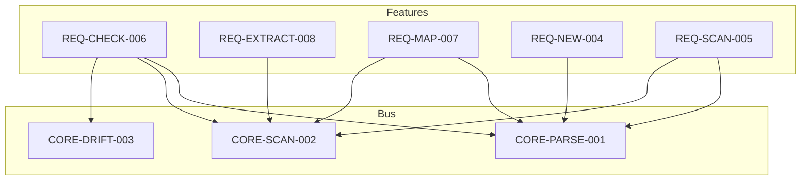
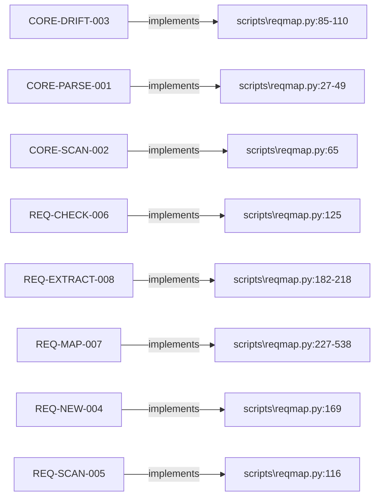
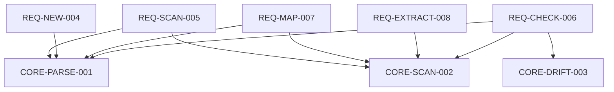
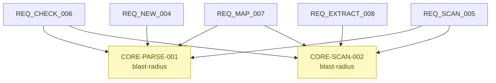

# Requirement Map

## System Map



## Requirement-to-Code



## Behavioral Flow

```mermaid
flowchart LR
  in_CORE_DRIFT_003(["A requirement body (markdown) and the lock file `r"])
  CORE_DRIFT_003["CORE-DRIFT-003"]
  out_CORE_DRIFT_003(["A 12-char content hash of the binding sections; re"])
  in_CORE_DRIFT_003 --> CORE_DRIFT_003 --> out_CORE_DRIFT_003
  in_CORE_PARSE_001(["A `requirements/` directory containing `*.md` file"])
  CORE_PARSE_001["CORE-PARSE-001"]
  out_CORE_PARSE_001(["A dict `id -> {meta, body, path}`. `meta` is the p"])
  in_CORE_PARSE_001 --> CORE_PARSE_001 --> out_CORE_PARSE_001
  in_CORE_SCAN_002(["A code root directory and source files in known ex"])
  CORE_SCAN_002["CORE-SCAN-002"]
  out_CORE_SCAN_002(["A dict `cap_id -> [(role, relative_file, line_numb"])
  in_CORE_SCAN_002 --> CORE_SCAN_002 --> out_CORE_SCAN_002
  in_REQ_CHECK_006(["The loaded requirements, the discovered members, a"])
  REQ_CHECK_006["REQ-CHECK-006"]
  out_REQ_CHECK_006(["Printed `ERROR`/`WARN` lines plus a summary; exit "])
  in_REQ_CHECK_006 --> REQ_CHECK_006 --> out_REQ_CHECK_006
  in_REQ_EXTRACT_008(["A code root and the already-discovered members (so"])
  REQ_EXTRACT_008["REQ-EXTRACT-008"]
  out_REQ_EXTRACT_008(["One `requirements/DRAFT-*.md` per untagged file, e"])
  in_REQ_EXTRACT_008 --> REQ_EXTRACT_008 --> out_REQ_EXTRACT_008
  in_REQ_MAP_007(["The loaded requirements and the discovered members"])
  REQ_MAP_007["REQ-MAP-007"]
  out_REQ_MAP_007(["`requirements/_map.html`: multi-tab HTML viewer wi"])
  in_REQ_MAP_007 --> REQ_MAP_007 --> out_REQ_MAP_007
  in_REQ_NEW_004(["A capability id `AREA-NAME-NNN` (CLI argument) and"])
  REQ_NEW_004["REQ-NEW-004"]
  out_REQ_NEW_004(["A new `requirements/AREA-NAME-NNN.md` with the id "])
  in_REQ_NEW_004 --> REQ_NEW_004 --> out_REQ_NEW_004
  in_REQ_SCAN_005(["The loaded requirements and the discovered members"])
  REQ_SCAN_005["REQ-SCAN-005"]
  out_REQ_SCAN_005(["Printed lines: each capability id, then its `role "])
  in_REQ_SCAN_005 --> REQ_SCAN_005 --> out_REQ_SCAN_005
```

## Dependency Map



## Risk & Unknowns



### Risk Table

| ID | status | members | dependents | risks |
| --- | --- | --- | --- | --- |
| CORE-PARSE-001 | confirmed | 2 | 4 | blast-radius |
| CORE-SCAN-002 | confirmed | 1 | 4 | blast-radius |
